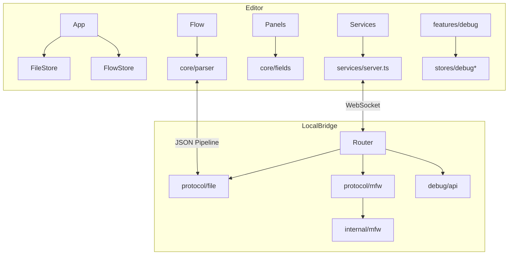

# CODEBASE_MAP — LLM 快速检索导航

> 供 AI Agent / 开发者快速定位代码。路径均相对于仓库根目录。
> 最后更新：2026-07-16

---

## 0. 一句话架构

```
Editor (React)  ←WebSocket→  LocalBridge (Go)  ←binding→  MaaFramework
     ↑ embed                         ↑
  Iframe 测试宿主              Desktop (Wails 内嵌 Editor + 子进程 lb)
DocumentStation / Landing = 独立静态站点
```

**常用命令**：`yarn dev`（Editor :3000）| `yarn server`（LocalBridge）| `yarn editor:install`

---

## 1. 顶层目录速查

| 目录 | 代号 | 技术栈 | 入口 |
|------|------|--------|------|
| `Editor/` | editor / mpe | React 19, Vite 7, Ant Design 6, Zustand, @xyflow/react | `src/main.tsx` → `App.tsx` |
| `LocalBridge/` | lb | Go 1.26, Gorilla WS, MaaFW binding | `cmd/lb/main.go` |
| `Desktop/` | desktop | Wails v2 | `main.go` |
| `Iframe/` | — | 纯静态 HTML/JS | `index.html` |
| `DocumentStation/` | doc | VitePress | `docs/index.md` |
| `Landing/` | landing | Astro 5 | `src/pages/index.astro` |
| `.agents/skills/` | — | Cursor Agent Skills | 见各 `SKILL.md` |

---

## 2. Editor — 前端核心

### 2.1 `Editor/src/` 目录树

```
src/
├── main.tsx              # 入口：i18n、WebSocket 初始化、挂载 App
├── App.tsx               # 壳层：布局、面板、生命周期、嵌入模式
├── components/           # 全部 React UI
├── contexts/             # ThemeContext (darkreader)
├── core/                 # Pipeline 领域逻辑（无 React）
├── data/                 # 静态数据 + localize 桥
├── features/             # 大型功能域（目前仅 debug）
├── hooks/                # 全局 hooks
├── i18n/                 # react-i18next + antd locale
├── services/             # LocalBridge WebSocket 协议客户端
├── stores/               # Zustand 状态
├── styles/               # Less modules
└── utils/                # 纯工具（AI、嵌入、Wails、节点等）
```

### 2.2 按任务检索（Editor）

| 想找… | 首选路径 |
|--------|----------|
| Pipeline 导入/导出 | `core/parser/index.ts`（`pipelineToFlow` / `flowToPipelineString`） |
| 字段 schema 定义 | `core/fields/`（`recognition/` `action/` `other/`） |
| 自动布局 / 吸附 / 避障 | `core/layout.ts` `snapUtils.ts` `avoidanceUtils.ts` |
| 画布主组件 | `components/Flow.tsx` |
| 节点类型注册 | `components/flow/nodes/index.ts` |
| 节点渲染 | `components/flow/nodes/PipelineNode/` `ExternalNode` `AnchorNode` `StickerNode` `GroupNode` |
| 多文件 Tab | `stores/fileStore.ts` + `components/panels/main/FilePanel.tsx` |
| 字段编辑面板 | `components/panels/main/FieldPanel.tsx` + `panels/field/items/` |
| 节点专用编辑器 | `components/panels/node-editors/*.tsx` |
| 用户设置 | `components/panels/settings/settingsDefinitions.ts` + `stores/configStore.ts` |
| 设备连接 / 实时画面 | `stores/mfwStore.ts` + `panels/main/ConnectionPanel/` + `services/protocols/MFWProtocol.ts` |
| 本地项目文件树 | `stores/localFileStore.ts` + `LocalFileListPanel.tsx` + `FileProtocol.ts` |
| 跨文件节点跳转 | `services/crossFileService.ts` |
| 校验错误 | `stores/errorStore.ts` + `ErrorPanel.tsx` |
| 剪贴板 copy/paste | `stores/clipboardStore.ts` |
| 面板互斥占位 | `stores/panelOccupancyStore.ts` + `hooks/usePanelOccupancy.ts` |
| iframe 嵌入 | `utils/embedBridge.ts` + `stores/embedStore.ts` + `App.tsx` 嵌入分支 |
| 桌面 Wails 桥 | `utils/wailsBridge.ts` |
| AI 探索模式 | `utils/ai/explorationAI.ts` + `panels/exploration/` |
| AI 客户端 | `utils/ai/aiClient.ts` + `providers/` |
| Monaco JSON 补全 | `components/json/mfwJsonCompletion.ts` |
| 新手引导 / 测验 | `data/newcomerQuiz*.ts` + `stores/newcomerStore.ts` + `modals/NewcomerGuideModal.tsx` |
| 使用协议 | `data/termsData.ts` + `stores/termsStore.ts` |
| 节点模板 | `data/nodeTemplates.ts` + `stores/customTemplateStore.ts` |
| 更新日志 | `data/updateLogs.ts` + `i18n/locales/*-updateLogs.json` |
| 泰语 / i18n | `i18n/locales/th-TH.json` `localeUtils.ts` `data/localize.ts` |
| 调试全流程 | `features/debug/` + `stores/debug*.ts` + `components/debug/DebugModal.tsx` |

### 2.3 Zustand Stores 一览

**核心业务**

| Store 文件 | 职责 |
|------------|------|
| `stores/flow/` | React Flow 图（多 slice：view/selection/history/node/edge/graph/path/anchorRef/exploration） |
| `fileStore.ts` | 多文档、当前文件 nodes/edges/config、viewport |
| `configStore.ts` | 全局用户配置、localStorage 缓存 |
| `localFileStore.ts` | LocalBridge 扫描的本地项目与图片 |
| `mfwStore.ts` | MaaFW 控制器连接、设备列表 |
| `wsStore.ts` | WebSocket 连接状态 |
| `clipboardStore.ts` | 画布剪贴板 |
| `errorStore.ts` | 校验错误 |
| `customTemplateStore.ts` | 用户自定义节点模板 |
| `toolbarStore.ts` | 导入/导出偏好 |
| `loggerStore.ts` | 后端日志 |
| `operationLogStore.ts` | 操作描述（undo 文案） |
| `panelOccupancyStore.ts` | 面板区域互斥 |
| `wikiStore.ts` | Wiki 悬浮锚点 |

**嵌入 / 引导**

| Store | 职责 |
|-------|------|
| `embedStore.ts` | iframe capabilities、ready、文件名 |
| `termsStore.ts` | 使用协议接受状态 |
| `newcomerStore.ts` | 新手引导步骤与测验 |

**调试（`debug*.ts`）**

| Store | 职责 |
|-------|------|
| `debugSessionStore.ts` | Modal 开关、运行状态、资源预检 |
| `debugTraceStore.ts` | 事件流、trace、回放 |
| `debugArtifactStore.ts` | 调试产物（截图等） |
| `debugOverlayStore.ts` | 画布执行高亮 |
| `debugRunProfileStore.ts` | 运行配置预设 |
| `debugAiSummaryStore.ts` | AI 调试摘要 |
| `debugDiagnosticsStore.ts` | 诊断消息 |
| `debugModalMemoryStore.ts` | Modal UI 记忆 |
| `debugOverrideStore.ts` | Pipeline 覆盖草稿 |

### 2.4 组件分层

```
Header                    → 顶栏（连接、调试、设置）
FilePanel + ToolbarPanel  → 左上文档区 + 工具条
Flow (MainFlow)           → 中央 React Flow 画布
侧面板                     → Field / Edge / Search / Error / Logger / LiveScreen / AI…
ToolPanel                 → 右侧 Add / Global / Layout
modals/                   → ROI、OCR、协议、新手引导等一次性弹窗
debug/DebugModal          → 大型 Drawer（内容在 features/debug）
panels/settings/          → configStore 驱动的声明式设置
```

### 2.5 i18n（本 fork 特点）

```
i18n/
├── index.ts           # i18next 初始化、syncI18nLocale
├── localeUtils.ts     # UiLocale: zh-CN | en-US | th-TH
├── antdLocales.ts     # antd ConfigProvider locale
└── locales/
    ├── th-TH.json           # 主 UI 文案
    └── th-TH-updateLogs.json # 更新日志 data.* 键
```

- 运行时语言：`configStore.configs.uiLocale` → `App.tsx` 同步
- 静态数据本地化：`data/localize.ts`（terms、quiz、templates、updateLogs）
- 新增翻译：优先改 `th-TH.json`；大段 data 放 `*-updateLogs.json`

### 2.6 WebSocket 服务层（Editor 侧）

```
services/
├── index.ts / server.ts       # LocalWebSocketServer 连接管理
├── type.ts                    # SystemRoutes、APIRoute
├── crossFileService.ts        # 跨文件搜索
└── protocols/
    ├── FileProtocol.ts        # 本地文件读写
    ├── MFWProtocol.ts         # 控制器、截图、OCR、动作
    ├── ConfigProtocol.ts      # 后端配置
    ├── ResourceProtocol.ts    # 资源包/图片
    ├── LoggerProtocol.ts      # 日志推送
    ├── AIProtocol.ts          # AI 代理
    ├── DebugProtocolClient.ts # 调试会话
    └── ErrorProtocol.ts
```

初始化链：`main.tsx` → `initializeWebSocket()` → 注册 Protocol → `features/debug/registerProtocolListeners`

---

## 3. LocalBridge — 后端桥接

### 3.1 目录树

```
LocalBridge/
├── cmd/lb/main.go              # CLI 入口，注册所有 Handler
├── internal/
│   ├── server/                 # WebSocket 服务
│   ├── router/router.go        # 消息路由 RegisterHandler / Route
│   ├── protocol/               # 按域拆分的 Handler
│   │   ├── file/file_handler.go
│   │   ├── mfw/handler.go
│   │   ├── utility/handler.go  # OCR、模板匹配、日志
│   │   ├── ai/handler.go
│   │   ├── config/handler.go
│   │   └── resource/handler.go
│   ├── debug/                  # 调试子系统（session/trace/artifact/replay…）
│   ├── mfw/                    # MaaFramework 适配层
│   ├── service/                # 文件扫描/监听
│   └── eventbus/
├── pkg/models/                 # 共享消息模型
└── config/                     # 服务配置
```

### 3.2 WS 路由速查（前后端对应）

| 路由前缀 | Go Handler | Editor Protocol |
|----------|------------|-----------------|
| `/etl/open_file` 等 | `protocol/file/` | `FileProtocol.ts` |
| `/etl/mfw/*` | `protocol/mfw/` | `MFWProtocol.ts` |
| `/etl/utility/*` | `protocol/utility/` | `MFWProtocol.ts`（部分） |
| `/etl/ai/*` | `protocol/ai/` | `AIProtocol.ts` |
| `/etl/config/*` | `protocol/config/` | `ConfigProtocol.ts` |
| `/etl/get_image` 等 | `protocol/resource/` | `ResourceProtocol.ts` |
| 调试 API | `internal/debug/api/` | `DebugProtocolClient.ts` |
| `/system/handshake` | server | `services/type.ts` SystemRoutes |

**MFW 常用路由**：`create_*_controller`、`disconnect_controller`、`request_screencap`、`controller_click/swipe/...`、`submit_task`、`load_resource`

### 3.3 按任务检索（LocalBridge）

| 想找… | 路径 |
|--------|------|
| 新增 WS 路由 | 对应 `protocol/*/handler.go` + Editor `protocols/*.ts` |
| 文件读写 | `protocol/file/file_handler.go` |
| 设备/控制器 | `protocol/mfw/handler.go` → `internal/mfw/` |
| OCR/模板匹配 | `protocol/utility/` |
| 调试运行时 | `internal/debug/runtime/` `runner/` `session/` |
| 调试 trace | `internal/debug/trace/store.go` |
| 调试产物 | `internal/debug/artifact/store.go` |
| 资源健康检查 | `internal/debug/diagnostics/` |

---

## 4. 其他子项目

### Desktop (`Desktop/`)
- Wails 打包 Editor dist + 启动 lb 子进程
- `internal/bridge/` 子进程管理，`internal/ports/` 端口分配
- 构建：Editor `build --mode desktop` → 复制到 `frontend/dist/`

### Iframe (`Iframe/`)
- `test-host.js` — postMessage 协议测试（对应文档「Iframe 嵌入与通信」）

### DocumentStation (`DocumentStation/docs/`)
- `01.指南/10.工作流面板/` — 节点、字段、文件（与 Editor UI 对应）
- `01.指南/20.本地服务/` — LocalBridge 使用
- `01.指南/95.开发与调试/` — iframe、贡献指南

### Landing (`Landing/src/`)
- 营销页组件：`components/Hero` `FeatureExplorer` `ShowcaseGrid`

---

## 5. 数据流简图



---

## 6. Grep / 搜索关键词建议

| 领域 | 推荐搜索词 |
|------|-----------|
| 节点类型 | `NodeTypeEnum` `nodeTypes` `PipelineNode` |
| 字段控件 | `ParamFieldList` `fieldFactory` `FieldPanel` |
| Pipeline 协议 | `pipelineToFlow` `flowToPipeline` `ProjectInterface` |
| WS 消息 | `/etl/` `send("` `RegisterHandler` |
| 设置项 | `settingsDefinitions` `configStore` `ConfigItemRenderer` |
| 嵌入 | `embedBridge` `mpe:init` `useEmbedMode` |
| 调试 | `debugSession` `registerProtocolListeners` `DebugModal` |
| i18n | `syncI18nLocale` `th-TH` `localize.ts` |
| 快捷键 | `useGlobalShortcuts` |
| 撤销重做 | `historySlice` `undo` `redo` |

---

## 7. Agent Skills 索引

| Skill | 何时读 |
|-------|--------|
| `.agents/skills/i18n/SKILL.md` | 加翻译、locale 设置 |
| `.agents/skills/maafw/SKILL.md` | Pipeline 协议、MaaFW 集成 |
| `.agents/skills/react-flow-node-ts/SKILL.md` | 新建画布节点 |
| `.agents/skills/zustand-store-ts/SKILL.md` | 新建 store |
| `.agents/skills/ant-design/SKILL.md` | antd 6 组件选型 |
| `.agents/skills/tauri-v2/SKILL.md` | 桌面相关（参考） |

---

## 8. 近期活跃区域（git 变更参考）

本 fork 近期改动集中在：
- `Editor/src/i18n/` — th-TH 本地化、`localeUtils`
- `Editor/src/stores/configStore.ts` — uiLocale 等配置
- `Editor/src/stores/newcomerStore.ts` + `data/newcomerQuiz*.ts` + `modals/NewcomerGuideModal.tsx` — 新手引导
- `Editor/src/components/panels/settings/` — 设置面板
