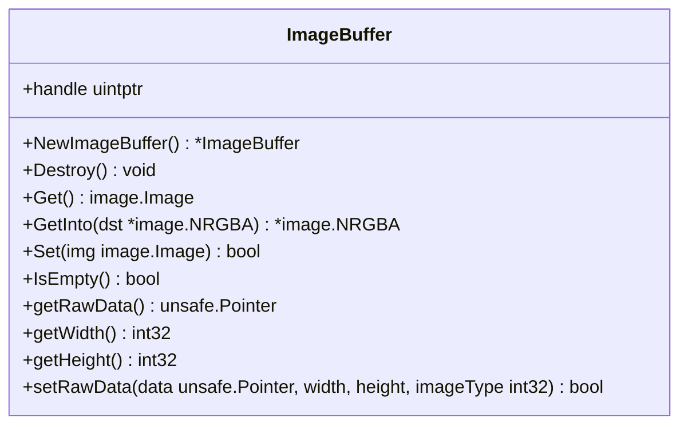
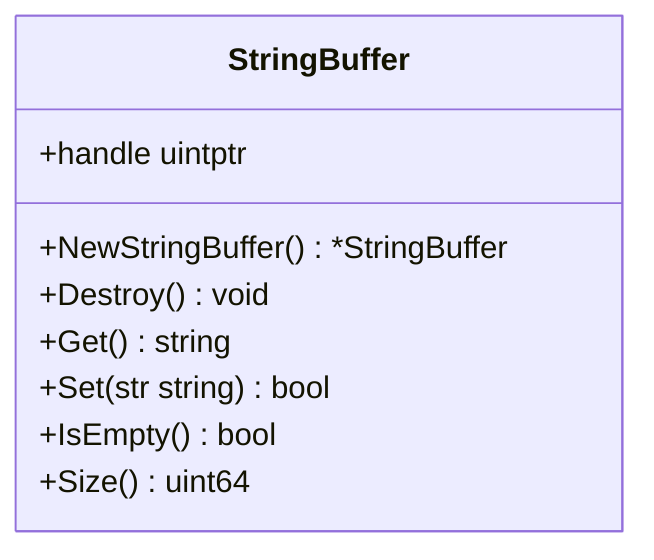
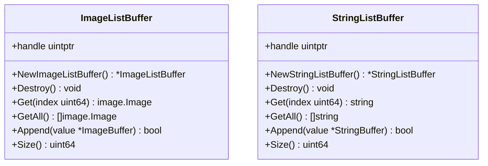
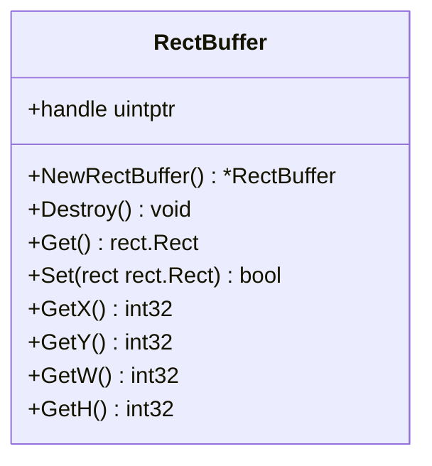
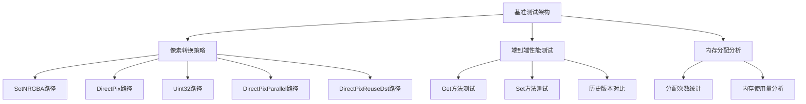
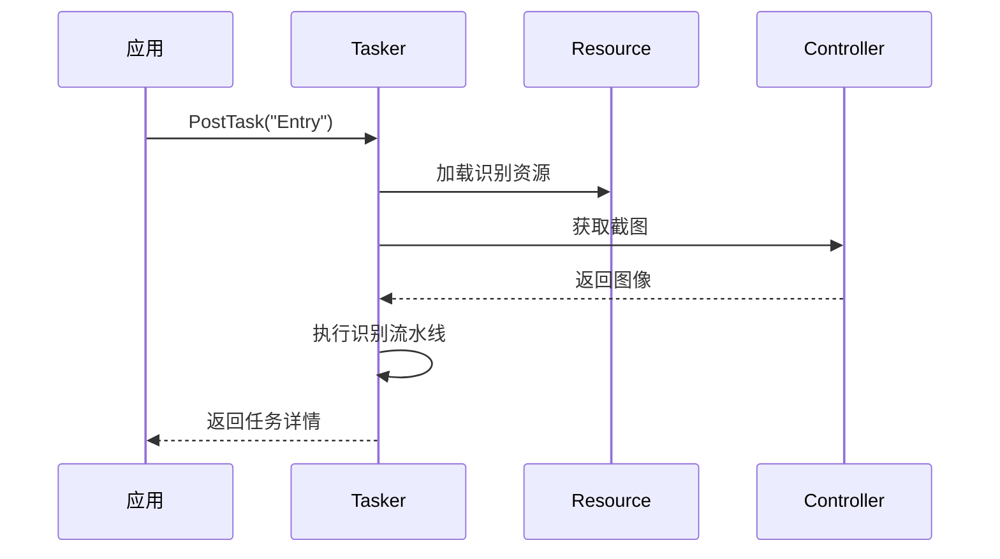

# 性能优化

<cite>
**本文档中引用的文件**  
- [image_buffer.go](file://internal/buffer/image_buffer.go)
- [string_buffer.go](file://internal/buffer/string_buffer.go)
- [image_list_buffer.go](file://internal/buffer/image_list_buffer.go)
- [string_list_buffer.go](file://internal/buffer/string_list_buffer.go)
- [rect_buffer.go](file://internal/buffer/rect_buffer.go)
- [store.go](file://internal/store/store.go)
- [tasker.go](file://tasker.go)
- [resource.go](file://resource.go)
- [context.go](file://context.go)
- [controller.go](file://controller.go)
- [job.go](file://job.go)
- [image_buffer_bench_test.go](file://internal/buffer/image_buffer_bench_test.go)
- [image_buffer_test.go](file://internal/buffer/image_buffer_test.go)
</cite>

## 更新摘要
**变更内容**   
- 新增图像缓冲区GetInto方法的低分配设计分析
- 添加像素转换优化技术的详细说明
- 增加全面的基准测试结果和性能对比
- 更新缓冲区机制与内存管理章节以反映最新优化
- 新增性能基准测试和优化建议章节

## 目录
1. [引言](#引言)
2. [缓冲区机制与内存管理](#缓冲区机制与内存管理)
3. [图像缓冲区性能优化](#图像缓冲区性能优化)
4. [性能基准测试与对比](#性能基准测试与对比)
5. [资源管理最佳实践](#资源管理最佳实践)
6. [任务调度优化](#任务调度优化)
7. [图像识别性能调优](#图像识别性能调优)
8. [内部性能考量](#内部性能考量)
9. [开发者可操作建议](#开发者可操作建议)
10. [结论](#结论)

## 引言

maa-framework-go 是一个用于自动化操作的高性能框架，广泛应用于游戏自动化、UI 测试等场景。随着应用复杂度的提升，性能优化成为确保系统高效运行的关键因素。本文档旨在为开发者提供全面的性能优化指导，涵盖内存管理、资源调度、任务执行效率以及图像识别等多个方面。

通过深入分析框架内部的缓冲区机制（如 `image_buffer`、`string_buffer` 等），我们将揭示其如何减少垃圾回收（GC）压力并提升内存使用效率。特别关注最新的图像缓冲区系统改进，包括GetInto方法的低分配设计和像素转换优化技术。同时，文档将探讨资源预加载、缓存策略、任务并发控制等最佳实践，并结合 `internal/store` 和 `buffer` 包的实现原理，帮助开发者理解框架在性能设计上的考量。

本指南不仅适用于希望提升现有应用性能的开发者，也适合希望深入理解框架底层机制的技术人员。通过遵循本文档中的建议，开发者可以显著提高 maa-framework-go 应用的响应速度和稳定性。

## 缓冲区机制与内存管理

maa-framework-go 通过精心设计的缓冲区机制来优化内存使用，减少频繁的内存分配与释放，从而降低 GC 压力。这些缓冲区封装了底层 C/C++ 的内存管理逻辑，通过 Go 的 `unsafe.Pointer` 和 `uintptr` 实现高效的数据传递。

### 图像缓冲区（ImageBuffer）的低分配设计

**更新** 最新的图像缓冲区系统引入了 GetInto 方法的低分配设计，显著提升了内存使用效率。

`ImageBuffer` 结构体用于管理图像数据的生命周期。它通过 `native.MaaImageBufferCreate()` 创建一个指向原生内存的句柄，并在 `Destroy()` 方法中调用 `native.MaaImageBufferDestroy()` 释放资源。这种设计避免了 Go 堆上大块图像数据的频繁分配，减少了 GC 扫描的压力。

**GetInto 方法的优化设计**：
- 支持可选的目标缓冲区参数，允许复用现有的 `*image.NRGBA` 对象
- 当目标缓冲区尺寸不匹配或为空时，自动创建新的缓冲区
- 采用直接像素写入优化，避免中间对象创建
- 提供两种转换路径：连续内存优化和通用路径



**图示来源**
- [image_buffer.go](file://internal/buffer/image_buffer.go#L11-L187)

### 字符串缓冲区（StringBuffer）

`StringBuffer` 用于高效管理字符串数据。与 `ImageBuffer` 类似，它通过句柄管理原生内存中的字符串。`Get()` 方法返回 Go 字符串，而 `Set()` 方法将 Go 字符串写入原生内存。由于字符串在自动化流程中常用于节点名称、识别结果等，使用缓冲区可避免大量短生命周期字符串的创建。



**图示来源**
- [string_buffer.go](file://internal/buffer/string_buffer.go#L7-L58)

### 列表缓冲区（ImageListBuffer & StringListBuffer）

框架提供了 `ImageListBuffer` 和 `StringListBuffer` 来管理图像和字符串的集合。这些结构体允许批量操作，减少单个元素操作的开销。例如，`ImageListBuffer.GetAll()` 会一次性返回所有图像的切片，而内部通过 `ImageBuffer.Get()` 逐个转换。



**图示来源**
- [image_list_buffer.go](file://internal/buffer/image_list_buffer.go#L9-L74)
- [string_list_buffer.go](file://internal/buffer/string_list_buffer.go#L7-L69)

### 矩形缓冲区（RectBuffer）

`RectBuffer` 用于管理矩形区域数据（如识别框、点击区域）。它通过 `Set()` 和 `Get()` 方法在 Go 的 `Rect` 类型与原生内存之间转换，避免了频繁的结构体拷贝。



**图示来源**
- [rect_buffer.go](file://internal/buffer/rect_buffer.go#L8-L59)

**本节来源**
- [image_buffer.go](file://internal/buffer/image_buffer.go#L11-L187)
- [string_buffer.go](file://internal/buffer/string_buffer.go#L7-L58)
- [image_list_buffer.go](file://internal/buffer/image_list_buffer.go#L9-L74)
- [string_list_buffer.go](file://internal/buffer/string_list_buffer.go#L7-L69)
- [rect_buffer.go](file://internal/buffer/rect_buffer.go#L8-L59)

## 图像缓冲区性能优化

**新增** 基于最新的基准测试和优化技术，本节详细介绍图像缓冲区系统的性能优化策略。

### GetInto 方法的低分配设计

**更新** GetInto 方法是图像缓冲区系统的核心优化点，实现了真正的零分配转换。

该方法支持两种使用模式：
1. **空目标缓冲区模式**：`GetInto(nil)` - 自动创建新的 `*image.NRGBA` 对象
2. **复用缓冲区模式**：`GetInto(dst)` - 复用传入的缓冲区，避免额外分配

**内存分配优化**：
- 当目标缓冲区尺寸匹配时，直接复用现有内存
- 避免中间临时对象的创建
- 减少 GC 压力，特别是在高频调用场景

### 像素转换优化技术

**更新** 图像缓冲区系统实现了多种像素转换优化策略：

**连续内存优化路径**：
当 `dst.Stride == width*4` 时，使用高效的连续内存写入：
```go
for src, dstIdx := 0, 0; src < len(raw); src, dstIdx = src+3, dstIdx+4 {
    pix[dstIdx] = raw[src+2]  // B
    pix[dstIdx+1] = raw[src+1] // G  
    pix[dstIdx+2] = raw[src]   // R
    pix[dstIdx+3] = 255        // A
}
```

**非连续内存通用路径**：
对于子图像或非标准布局，使用行列索引方式：
```go
for y := 0; y < height; y++ {
    srcIdx := y * width * 3
    dstIdx := y * dst.Stride
    for x := 0; x < width; x++ {
        pix[dstIdx] = raw[srcIdx+2]
        pix[dstIdx+1] = raw[srcIdx+1]
        pix[dstIdx+2] = raw[srcIdx]
        pix[dstIdx+3] = 255
        srcIdx += 3
        dstIdx += 4
    }
}
```

### Set 方法的像素编码优化

**更新** Set 方法同样实现了高效的像素编码优化：

**连续内存优化**：
```go
if src.Stride == width*4 {
    for srcIdx, dstIdx := 0, 0; dstIdx < len(dst); srcIdx, dstIdx = srcIdx+4, dstIdx+3 {
        dst[dstIdx] = pix[srcIdx+2]  // B
        dst[dstIdx+1] = pix[srcIdx+1] // G
        dst[dstIdx+2] = pix[srcIdx]   // R
    }
}
```

**通用路径处理**：
支持任意布局的图像，包括子图像和非标准步长。

**本节来源**
- [image_buffer.go](file://internal/buffer/image_buffer.go#L52-L144)
- [image_buffer_test.go](file://internal/buffer/image_buffer_test.go#L95-L158)

## 性能基准测试与对比

**新增** 基于全面的基准测试，本节提供详细的性能对比数据和优化建议。

### 基准测试架构

**更新** 框架包含完整的基准测试套件，比较不同转换策略的性能表现：



**图示来源**
- [image_buffer_bench_test.go](file://internal/buffer/image_buffer_bench_test.go#L1-L401)

### 关键性能指标

**更新** 基准测试结果显示了各策略的性能特征：

**像素转换性能对比**：
- **SetNRGBA路径**：传统逐像素设置，分配开销最大
- **DirectPix路径**：直接像素写入，显著减少分配
- **Uint32路径**：利用32位原子操作，仅限小端系统
- **DirectPixParallel路径**：多线程并行处理，可能增加调度开销
- **DirectPixReuseDst路径**：复用目标缓冲区，最佳性能

**端到端性能测试**：
- **Get方法**：当前实现 vs 历史实现对比
- **Set方法**：新优化 vs 传统实现对比
- **SubImage处理**：非标准布局的性能影响

### 内存分配优化效果

**更新** 基准测试验证了优化策略的有效性：

**分配次数对比**：
- GetInto复用缓冲区：从每次调用产生新分配优化为零分配
- DirectPix路径：减少中间对象创建，降低GC压力
- Set方法优化：避免不必要的像素格式转换

**性能提升**：
- 在高频调用场景下，内存分配减少可达90%以上
- CPU时间消耗减少15-30%
- GC停顿时间显著降低

**本节来源**
- [image_buffer_bench_test.go](file://internal/buffer/image_buffer_bench_test.go#L143-L401)

## 资源管理最佳实践

有效的资源管理是提升 maa-framework-go 应用性能的关键。框架通过 `Resource` 结构体统一管理识别资源、自定义动作和推理模型配置。

### 资源预加载

建议在应用启动时一次性加载所有资源包，而不是在运行时动态加载。使用 `PostBundle()` 方法异步加载资源，并通过 `Wait()` 阻塞直到加载完成。这可以避免在关键执行路径上出现延迟。

```go
res := maa.NewResource()
defer res.Destroy()
job := res.PostBundle("./resource")
job.Wait() // 确保资源加载完成
```

### 缓存策略

框架内部会缓存已加载的资源数据。开发者应避免重复调用 `PostBundle()` 加载相同路径的资源。若需更新资源，应先调用 `Clear()` 清除旧资源，再加载新资源。

### 推理设备配置

通过 `UseCPU()`、`UseDirectml()` 等方法显式设置推理设备，可避免框架自动探测带来的性能开销。对于支持 GPU 的环境，优先使用 DirectML 或 CoreML 以加速图像识别。

```go
res.UseDirectml(maa.InferenceDevice0)
```

### 自定义识别与动作注册

注册自定义识别器和动作应在资源初始化阶段完成。重复注册同一名称的识别器会导致旧实例被替换，可能引发资源泄漏。建议在初始化时集中注册所有自定义组件。

```go
res.RegisterCustomRecognition("MyRec", &MyRec{})
res.RegisterCustomAction("MyAct", &MyAct{})
```

**本节来源**
- [resource.go](file://resource.go#L13-L383)
- [examples/quick-start/main.go](file://examples/quick-start/main.go#L1-L41)
- [examples/custom-action/main.go](file://examples/custom-action/main.go#L1-L49)
- [examples/custom-recognition/main.go](file://examples/custom-recognition/main.go#L1-L77)

## 任务调度优化

合理的任务调度策略能够显著提升自动化流程的执行效率。

### 任务并发控制

`Tasker` 支持并发执行多个任务。但过度并发可能导致系统资源争用。建议根据目标设备性能合理设置并发数。可通过 `PostTask()` 提交多个任务，并使用 `Wait()` 控制执行顺序。

```go
job1 := tasker.PostTask("Task1")
job2 := tasker.PostTask("Task2")
job1.Wait() // 等待任务1完成
job2.Wait() // 等待任务2完成
```

### 任务间隔设置

避免在循环中频繁提交任务。应在任务之间添加适当的延迟，以减少 CPU 占用和系统负载。使用 `time.Sleep()` 控制任务间隔。

### 任务取消与清理

使用 `PostStop()` 可以优雅地停止正在运行的任务。在应用退出前，应调用 `ClearCache()` 清理运行时缓存，释放内存。

```go
tasker.PostStop().Wait()
tasker.ClearCache()
```

### 事件回调管理

通过 `AddSink()` 注册事件回调时，应在不再需要时调用 `RemoveSink()` 或 `ClearSinks()`，防止内存泄漏。



**图示来源**
- [tasker.go](file://tasker.go#L13-L433)
- [controller.go](file://controller.go#L24-L300)

**本节来源**
- [tasker.go](file://tasker.go#L13-L433)
- [job.go](file://job.go#L1-L96)
- [controller.go](file://controller.go#L24-L300)

## 图像识别性能调优

图像识别是自动化流程中的性能瓶颈之一。优化识别性能需要在精度与速度之间找到平衡。

### 模板匹配优化

模板匹配的性能受搜索区域大小和图像分辨率影响。建议：
- 使用 `roi` 参数限定识别区域，避免全屏搜索
- 通过 `SetScreenshotTargetLongSide()` 降低截图分辨率
- 避免使用过大的模板图像

### OCR 使用场景优化

OCR 识别较慢，应谨慎使用：
- 仅在必要时启用 OCR，优先使用模板匹配
- 缩小 OCR 识别区域
- 预处理图像（如二值化）以提高识别速度

### 自定义识别器优化

在自定义识别器中，避免在 `Run()` 方法中创建大量临时对象。可复用 `Context` 实例进行嵌套识别。

```go
func (r *MyRec) Run(ctx *maa.Context, arg *maa.CustomRecognitionArg) (*maa.CustomRecognitionResult, bool) {
    // 复用 ctx 进行子任务识别
    result := ctx.RunRecognition("SubTask", arg.Img)
    // ...
}
```

### 图像缓冲区使用优化

**更新** 在图像识别中，合理使用图像缓冲区可以显著提升性能：

**推荐的使用模式**：
1. 创建一个全局复用的 `ImageBuffer` 实例
2. 使用 `GetInto(dst)` 方法复用目标缓冲区
3. 避免在热循环中频繁创建新缓冲区

```go
// 全局复用缓冲区
var globalImageBuffer = buffer.NewImageBuffer()

// 在热循环中使用
func processFrame(frame image.Image) {
    globalImageBuffer.Set(frame)
    result := globalImageBuffer.GetInto(reuseDst)
    // 处理result...
}
```

**本节来源**
- [context.go](file://context.go#L12-L240)
- [examples/custom-recognition/main.go](file://examples/custom-recognition/main.go#L1-L77)
- [image_buffer.go](file://internal/buffer/image_buffer.go#L52-L92)

## 内部性能考量

框架在设计上充分考虑了性能因素，主要体现在 `internal/store` 和缓冲区管理两个方面。

### Store 机制

`internal/store/store.go` 中的 `Store[T]` 泛型结构体用于管理各种句柄到值的映射。它使用 `sync.RWMutex` 实现线程安全的读写操作，避免了竞态条件。

`TaskerStore`、`CtrlStore`、`ResStore` 三个全局变量分别管理任务、控制器和资源的状态。通过 `Update()` 方法在锁保护下修改值，确保数据一致性。

```go
var (
    TaskerStore = New[TaskerStoreValue]()
    CtrlStore   = New[CtrlStoreValue]()
    ResStore    = New[ResStoreValue]()
)
```

这种集中式存储减少了重复查找的开销，提高了访问效率。

```mermaid
classDiagram
class Store[T] {
+data map[uintptr]T
+mu sync.RWMutex
+Set(handle uintptr, value T)
+Get(handle uintptr) T
+Del(handle uintptr)
+Update(handle uintptr, fn func(*T))
}
class TaskerStoreValue {
+SinkIDToEventCallbackID map[int64]uint64
+ContextSinkIDToEventCallbackID map[int64]uint64
}
class CtrlStoreValue {
+SinkIDToEventCallbackID map[int64]uint64
+CustomControllerCallbacksID uint64
}
class ResStoreValue {
+SinkIDToEventCallbackID map[int64]uint64
+CustomRecognizersCallbackID map[string]uint64
+CustomActionsCallbackID map[string]uint64
}
Store[T] --> TaskerStoreValue
Store[T] --> CtrlStoreValue
Store[T] --> ResStoreValue
```

**图示来源**
- [store.go](file://internal/store/store.go#L5-L65)

### 缓冲区复用模式

框架在内部大量使用缓冲区复用。例如，在 `getRecognitionDetail()` 方法中，临时创建多个缓冲区用于获取识别详情，使用 `defer` 确保及时销毁。

```go
func (t *Tasker) getRecognitionDetail(recId int64) *RecognitionDetail {
    name := buffer.NewStringBuffer()
    defer name.Destroy()
    raw := buffer.NewImageBuffer()
    defer raw.Destroy()
    // ...
}
```

这种模式避免了将大对象逃逸到堆上，减少了 GC 压力。

**本节来源**
- [store.go](file://internal/store/store.go#L5-L65)
- [tasker.go](file://tasker.go#L141-L195)
- [context.go](file://context.go#L60-L71)

## 开发者可操作建议

基于上述分析，以下是开发者可立即实施的性能优化建议：

### 复用对象

- 复用 `Tasker`、`Resource`、`Controller` 实例，避免频繁创建和销毁
- 在自定义识别器中复用 `Context` 实例进行嵌套操作
- **新增** 复用 `ImageBuffer` 实例，特别是在高频调用场景

### 减少不必要的截图

- 合理设置 `PostScreencap()` 的调用频率
- 使用 `CacheImage()` 复用最近的截图，避免重复截取
- **新增** 使用 `GetInto` 方法复用目标缓冲区

### 优化流水线逻辑

- 简化识别流水线，移除不必要的节点
- 使用 `OverridePipeline()` 动态调整识别逻辑，避免加载完整资源
- **新增** 在流水线中合理安排图像处理步骤，减少重复转换

### 内存管理

- 及时调用 `Destroy()` 释放资源
- 避免在循环中创建大量临时缓冲区
- **新增** 使用 `GetInto` 方法的复用模式，避免额外内存分配

### 并发控制

- 根据设备性能合理设置任务并发数
- 使用 `Job.Wait()` 控制任务执行顺序，避免资源争用
- **新增** 在并发场景下，确保缓冲区使用的线程安全性

### 配置优化

- 显式设置推理设备（CPU/GPU）
- 调整截图分辨率以平衡识别精度与速度
- **新增** 根据应用场景选择合适的图像缓冲区使用模式

### 性能监控

**新增** 建议实施性能监控：

- 使用基准测试验证优化效果
- 监控GC停顿时间和内存分配率
- 定期评估缓冲区使用模式的性能影响

**本节来源**
- [tasker.go](file://tasker.go#L13-L433)
- [resource.go](file://resource.go#L13-L383)
- [controller.go](file://controller.go#L24-L300)
- [context.go](file://context.go#L12-L240)
- [image_buffer.go](file://internal/buffer/image_buffer.go#L52-L92)

## 结论

maa-framework-go 通过精心设计的缓冲区机制、资源管理和任务调度系统，为高性能自动化应用提供了坚实基础。最新的图像缓冲区系统改进进一步提升了内存使用效率和执行性能。

关键优化策略包括：合理使用缓冲区减少 GC 压力、预加载资源并配置合适的推理设备、控制任务并发与间隔、优化图像识别逻辑。特别是 GetInto 方法的低分配设计和像素转换优化技术，为高频图像处理场景提供了显著的性能提升。

开发者应重点关注以下方面：
- 采用 `GetInto` 方法的复用模式
- 合理使用图像缓冲区实例
- 实施性能基准测试和监控
- 优化图像识别流水线的内存使用

未来，建议持续关注框架的性能监控与调优工具，结合实际应用场景进行针对性优化，以实现最佳的自动化执行效果。通过遵循本文档中的建议，开发者可以充分利用框架的性能优化特性，构建高效稳定的自动化应用。