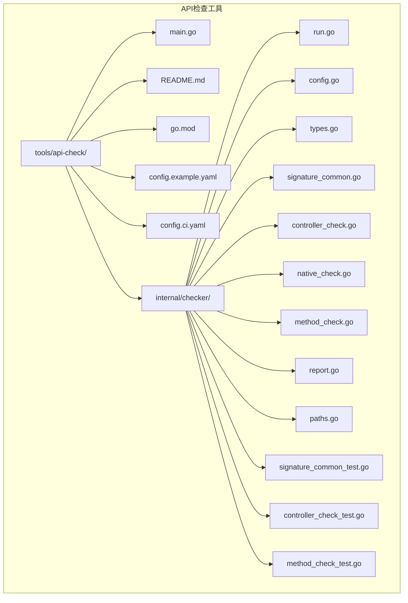
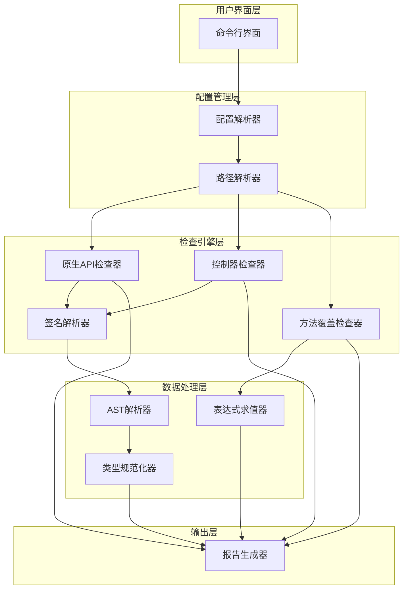
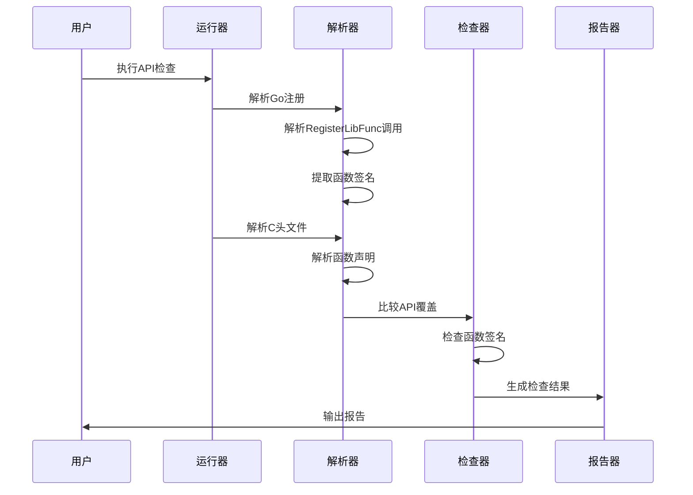
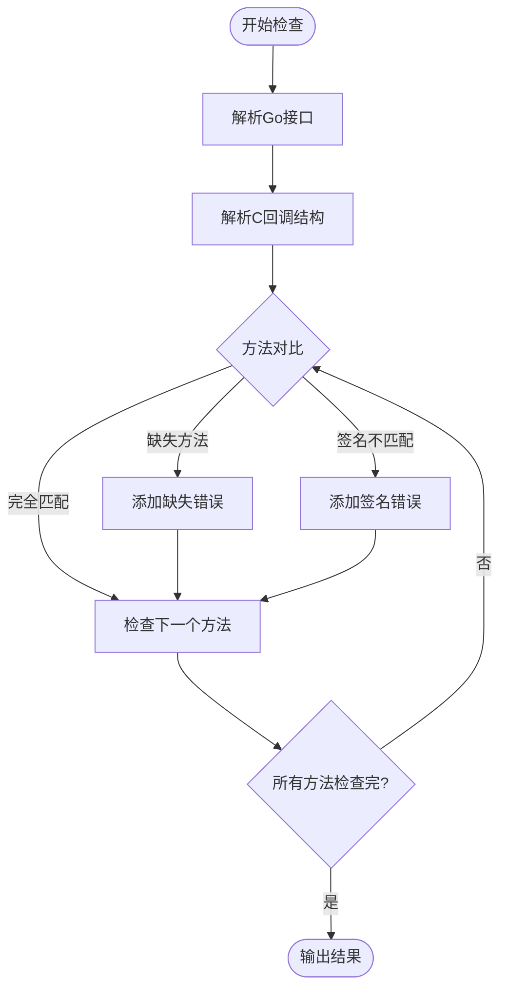
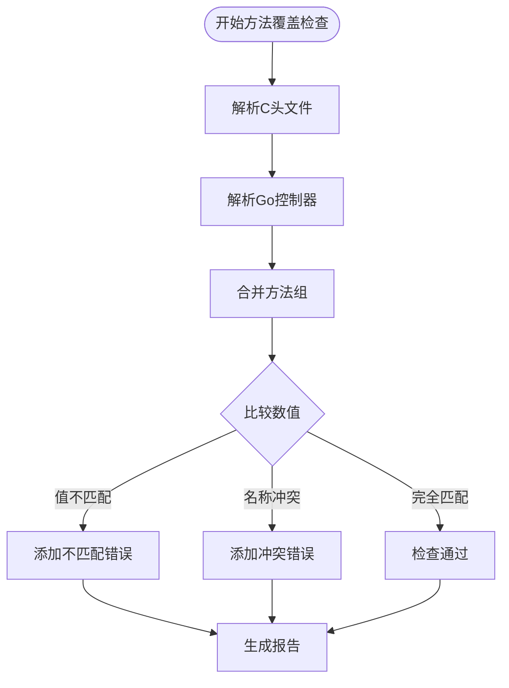
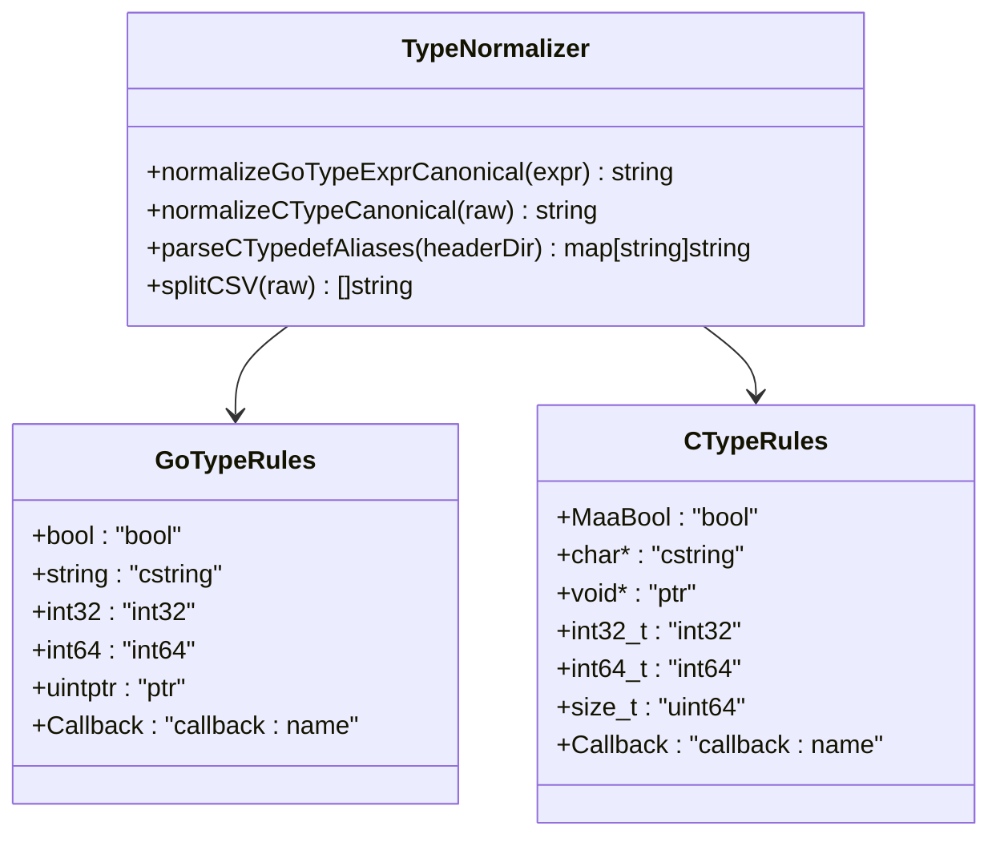
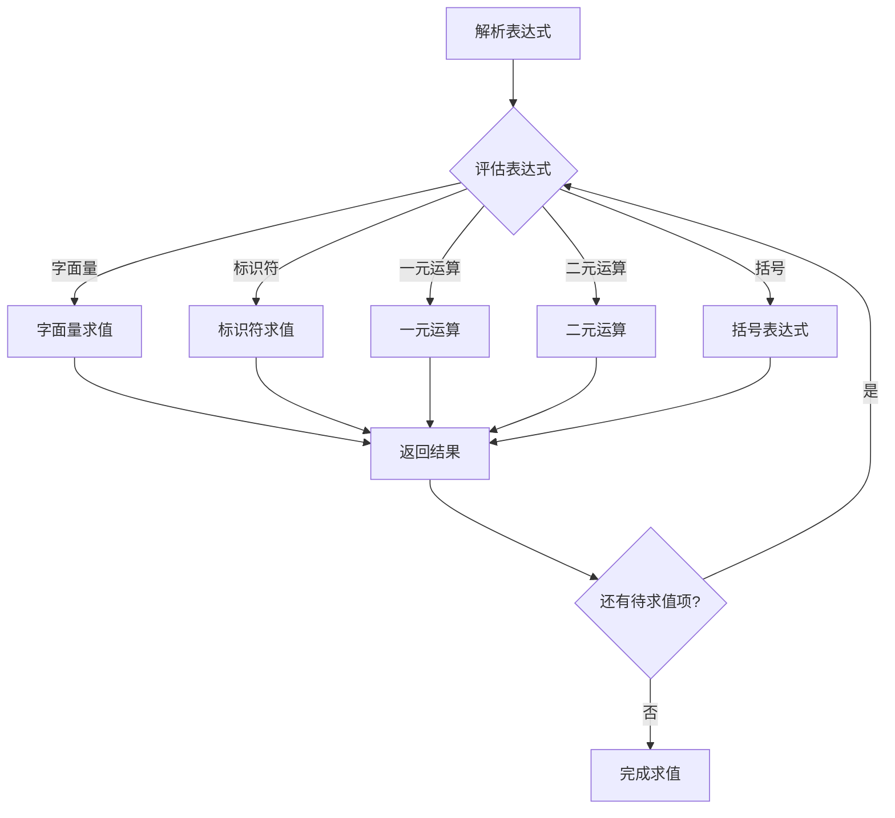

# API一致性检查工具

<cite>
**本文档引用的文件**
- [main.go](file://tools/api-check/main.go)
- [README.md](file://tools/api-check/README.md)
- [go.mod](file://tools/api-check/go.mod)
- [run.go](file://tools/api-check/internal/checker/run.go)
- [config.go](file://tools/api-check/internal/checker/config.go)
- [types.go](file://tools/api-check/internal/checker/types.go)
- [signature_common.go](file://tools/api-check/internal/checker/signature_common.go)
- [controller_check.go](file://tools/api-check/internal/checker/controller_check.go)
- [native_check.go](file://tools/api-check/internal/checker/native_check.go)
- [method_check.go](file://tools/api-check/internal/checker/method_check.go)
- [report.go](file://tools/api-check/internal/checker/report.go)
- [paths.go](file://tools/api-check/internal/checker/paths.go)
- [config.example.yaml](file://tools/api-check/config.example.yaml)
- [config.ci.yaml](file://tools/api-check/config.ci.yaml)
- [signature_common_test.go](file://tools/api-check/internal/checker/signature_common_test.go)
- [controller_check_test.go](file://tools/api-check/internal/checker/controller_check_test.go)
- [method_check_test.go](file://tools/api-check/internal/checker/method_check_test.go)
</cite>

## 更新摘要
**变更内容**
- 新增了method_check.go模块，提供662行的综合方法覆盖检查逻辑
- 增强了C API常量与Go实现的对比验证能力
- 新增了控制器方法覆盖检查功能
- 完善了表达式求值和类型规范化系统

## 目录
1. [简介](#简介)
2. [项目结构](#项目结构)
3. [核心组件](#核心组件)
4. [架构概览](#架构概览)
5. [详细组件分析](#详细组件分析)
6. [依赖关系分析](#依赖关系分析)
7. [性能考虑](#性能考虑)
8. [故障排除指南](#故障排除指南)
9. [结论](#结论)

## 简介

API一致性检查工具是一个专门用于验证MaaFramework Go绑定API一致性的自动化工具。该工具主要检查以下四个方面的API一致性：

1. **原生API覆盖检查**：验证Go注册的C符号与头文件中导出函数的一致性
2. **函数签名一致性检查**：比较Go变量函数签名与C导出函数签名的严格匹配
3. **自定义控制器一致性检查**：确保CustomController接口与MaaCustomControllerCallbacks结构体的一致性
4. **控制器方法覆盖检查**：验证C API常量与Go实现的对比验证，包括表达式求值和类型规范化

该工具通过解析Go源码中的`RegisterLibFunc`调用、C头文件中的函数声明、自定义控制器接口，以及控制器方法常量，自动检测API不匹配问题。

## 项目结构



**图表来源**
- [main.go](file://tools/api-check/main.go#L1-L12)
- [run.go](file://tools/api-check/internal/checker/run.go#L1-L157)
- [types.go](file://tools/api-check/internal/checker/types.go#L1-L70)

**章节来源**
- [main.go](file://tools/api-check/main.go#L1-L12)
- [README.md](file://tools/api-check/README.md#L1-L83)

## 核心组件

### 主要入口点
- **主程序入口**：位于`tools/api-check/main.go`，简单的程序入口，调用checker.Run()执行检查
- **运行时控制**：位于`tools/api-check/internal/checker/run.go`，处理命令行参数、配置加载和检查流程

### 配置管理系统
- **配置解析**：位于`tools/api-check/internal/checker/config.go`，支持多种配置文件加载方式
- **路径解析**：位于`tools/api-check/internal/checker/paths.go`，自动检测仓库根目录和解析相对路径
- **类型定义**：位于`tools/api-check/internal/checker/types.go`，定义核心数据结构和常量

### 检查引擎
- **原生API检查**：位于`tools/api-check/internal/checker/native_check.go`，检查Go注册与C头文件的API一致性
- **控制器检查**：位于`tools/api-check/internal/checker/controller_check.go`，验证CustomController接口与回调结构体
- **签名解析**：位于`tools/api-check/internal/checker/signature_common.go`，处理Go和C语言的类型规范化
- **方法覆盖检查**：位于`tools/api-check/internal/checker/method_check.go`，新增的662行综合方法覆盖检查逻辑

### 报告系统
- **报告输出**：位于`tools/api-check/internal/checker/report.go`，格式化输出检查结果
- **测试支持**：包含完整的单元测试，验证核心解析逻辑的正确性

**章节来源**
- [run.go](file://tools/api-check/internal/checker/run.go#L11-L96)
- [config.go](file://tools/api-check/internal/checker/config.go#L12-L52)
- [paths.go](file://tools/api-check/internal/checker/paths.go#L12-L40)

## 架构概览



**图表来源**
- [run.go](file://tools/api-check/internal/checker/run.go#L11-L96)
- [native_check.go](file://tools/api-check/internal/checker/native_check.go#L13-L99)
- [controller_check.go](file://tools/api-check/internal/checker/controller_check.go#L14-L80)
- [method_check.go](file://tools/api-check/internal/checker/method_check.go#L55-L89)

## 详细组件分析

### 原生API检查器

原生API检查器负责验证Go注册的C符号与头文件中导出函数的一致性。其工作流程如下：



**图表来源**
- [native_check.go](file://tools/api-check/internal/checker/native_check.go#L13-L99)
- [signature_common.go](file://tools/api-check/internal/checker/signature_common.go#L15-L69)

#### 关键特性
- **双路径检查**：同时检查头文件函数存在但Go未注册、Go注册但头文件不存在的情况
- **严格签名匹配**：使用严格的参数数量和顺序匹配，支持类型别名展开
- **位置信息追踪**：记录函数声明和注册的位置信息，便于调试

**章节来源**
- [native_check.go](file://tools/api-check/internal/checker/native_check.go#L13-L99)
- [signature_common.go](file://tools/api-check/internal/checker/signature_common.go#L107-L167)

### 自定义控制器检查器

自定义控制器检查器确保Go的CustomController接口与C的MaaCustomControllerCallbacks结构体保持一致：



**图表来源**
- [controller_check.go](file://tools/api-check/internal/checker/controller_check.go#L14-L80)
- [controller_check.go](file://tools/api-check/internal/checker/controller_check.go#L82-L128)

#### 特殊处理逻辑
- **回调名称转换**：将C风格的回调名称转换为Go风格的方法名
- **缓冲区参数过滤**：自动忽略MaaStringBuffer和MaaImageBuffer等特殊参数
- **返回值推导**：根据参数类型推导相应的返回值组合

**章节来源**
- [controller_check.go](file://tools/api-check/internal/checker/controller_check.go#L14-L80)
- [controller_check.go](file://tools/api-check/internal/checker/controller_check.go#L375-L391)

### 方法覆盖检查器

**新增** 方法覆盖检查器是本次更新的核心增强功能，负责验证C API常量与Go实现的对比验证：



**图表来源**
- [method_check.go](file://tools/api-check/internal/checker/method_check.go#L55-L89)
- [method_check.go](file://tools/api-check/internal/checker/method_check.go#L307-L364)

#### 核心功能特性
- **多控制器支持**：支持ADB和Win32两种控制器的方法覆盖检查
- **表达式求值**：支持复杂的C宏表达式求值，包括位运算和复合表达式
- **下划线标准化**：自动处理C风格下划线命名与Go风格命名的转换
- **冲突检测**：检测方法名称标准化后的冲突情况

**章节来源**
- [method_check.go](file://tools/api-check/internal/checker/method_check.go#L55-L89)
- [method_check.go](file://tools/api-check/internal/checker/method_check.go#L307-L364)

### 类型规范化系统

类型规范化系统是整个检查工具的核心，负责将不同语言的类型统一到规范化的表示形式：



**图表来源**
- [signature_common.go](file://tools/api-check/internal/checker/signature_common.go#L107-L167)
- [signature_common.go](file://tools/api-check/internal/checker/signature_common.go#L306-L372)

#### 类型映射规则
- **Go到C类型映射**：string映射到cstring，uintptr映射到ptr，各种整数类型按位宽映射
- **C类型别名展开**：递归展开typedef别名，直到无法再展开为止
- **指针类型处理**：统一表示为ptr，忽略const和volatile限定符

**章节来源**
- [signature_common.go](file://tools/api-check/internal/checker/signature_common.go#L107-L167)
- [signature_common.go](file://tools/api-check/internal/checker/signature_common.go#L306-L372)

### 表达式求值系统

**新增** 表达式求值系统是方法覆盖检查器的重要组成部分，负责解析和计算C宏表达式：



**图表来源**
- [method_check.go](file://tools/api-check/internal/checker/method_check.go#L481-L524)
- [method_check.go](file://tools/api-check/internal/checker/method_check.go#L526-L610)

#### 支持的表达式类型
- **字面量**：支持十进制、十六进制等整数字面量
- **标识符**：支持常量引用和iota关键字
- **一元运算**：支持加减号、按位取反等运算
- **二元运算**：支持加减乘除、取模、位移、按位运算等
- **括号表达式**：支持嵌套括号的表达式求值

**章节来源**
- [method_check.go](file://tools/api-check/internal/checker/method_check.go#L481-L524)
- [method_check.go](file://tools/api-check/internal/checker/method_check.go#L526-L610)

## 依赖关系分析

```mermaid
graph TB
subgraph "外部依赖"
YAML[gopkg.in/yaml.v3]
GoAST[Go AST包]
GoParser[Go Parser包]
Regexp[正则表达式包]
End
subgraph "内部模块"
Main[main.go]
Run[run.go]
Config[config.go]
Types[types.go]
SignCommon[signature_common.go]
NativeCheck[native_check.go]
ControllerCheck[controller_check.go]
MethodCheck[method_check.go]
Report[report.go]
Paths[paths.go]
end
Main --> Run
Run --> Config
Run --> Types
Run --> NativeCheck
Run --> ControllerCheck
Run --> MethodCheck
Run --> Report
Run --> Paths
Config --> YAML
NativeCheck --> SignCommon
ControllerCheck --> SignCommon
MethodCheck --> SignCommon
SignCommon --> GoAST
SignCommon --> GoParser
MethodCheck --> Regexp
```

**图表来源**
- [go.mod](file://tools/api-check/go.mod#L1-L6)
- [main.go](file://tools/api-check/main.go#L3-L6)

### 外部依赖
- **YAML解析**：使用gopkg.in/yaml.v3进行配置文件解析
- **Go语言工具链**：依赖标准库的go/ast和go/parser进行语法分析
- **正则表达式**：用于C宏表达式的解析和匹配

### 内部模块耦合
- **低耦合设计**：各检查器模块相互独立，通过共享的类型规范化系统进行交互
- **清晰的职责分离**：每个模块专注于特定的检查任务，便于维护和扩展

**章节来源**
- [go.mod](file://tools/api-check/go.mod#L1-L6)
- [types.go](file://tools/api-check/internal/checker/types.go#L19-L35)

## 性能考虑

### 解析效率优化
- **AST缓存**：对于重复使用的解析结果进行缓存，避免重复解析相同文件
- **并行处理**：在可能的情况下并行处理多个文件，提高整体检查速度
- **增量检查**：支持只检查变更的文件，减少全量检查的时间

### 内存使用优化
- **流式解析**：对大型头文件采用流式解析方式，避免一次性加载到内存
- **类型别名表**：使用哈希表存储类型别名，提供O(1)的查找时间复杂度
- **表达式求值缓存**：对已求值的表达式进行缓存，避免重复计算

### I/O性能优化
- **路径缓存**：缓存已解析的路径，避免重复的文件系统查询
- **批量操作**：将多个小文件的操作合并为批量操作，减少系统调用开销

## 故障排除指南

### 常见问题及解决方案

#### 配置文件问题
- **问题**：找不到配置文件
- **解决方案**：检查配置文件路径是否正确，确认文件权限设置

#### 路径解析失败
- **问题**：无法检测到仓库根目录
- **解决方案**：确认当前工作目录是否在正确的仓库中，检查.git目录是否存在

#### 类型解析错误
- **问题**：某些类型无法正确解析
- **解决方案**：检查头文件中的typedef定义，确认类型别名没有形成循环依赖

#### 表达式求值错误
- **问题**：C宏表达式无法求值
- **解决方案**：检查表达式语法是否正确，确认所有引用的常量都已定义

#### 性能问题
- **问题**：检查过程运行缓慢
- **解决方案**：考虑使用黑名单排除不需要检查的函数，或限制检查范围

**章节来源**
- [paths.go](file://tools/api-check/internal/checker/paths.go#L12-L40)
- [config.go](file://tools/api-check/internal/checker/config.go#L12-L52)

### 调试技巧

#### 启用详细日志
- 使用`-v`标志启用详细输出，查看详细的解析过程
- 检查中间结果，确认每个步骤的正确性

#### 验证核心功能
- 运行单元测试验证类型解析的正确性
- 使用简单示例验证整个检查流程

**章节来源**
- [signature_common_test.go](file://tools/api-check/internal/checker/signature_common_test.go#L10-L30)
- [controller_check_test.go](file://tools/api-check/internal/checker/controller_check_test.go#L5-L23)
- [method_check_test.go](file://tools/api-check/internal/checker/method_check_test.go#L10-L76)

## 结论

API一致性检查工具为MaaFramework Go绑定提供了一个全面、可靠的API一致性验证解决方案。通过自动化检查原生API覆盖、函数签名、自定义控制器和控制器方法覆盖的一致性，该工具能够：

1. **预防API不匹配问题**：在开发早期发现潜在的API不兼容问题
2. **提高代码质量**：确保Go绑定与C API保持同步，减少运行时错误
3. **简化维护工作**：自动化检查减少了手动验证的工作量
4. **支持持续集成**：可以轻松集成到CI/CD流程中，确保API稳定性
5. **增强表达式求值能力**：新增的方法覆盖检查器支持复杂的C宏表达式求值

本次更新新增的662行综合方法覆盖检查逻辑显著增强了工具的功能，特别是对C API常量与Go实现的对比验证能力。通过表达式求值、类型规范化和冲突检测等机制，该工具能够更准确地识别API不一致性问题，为MaaFramework生态系统的健康发展提供强有力的技术保障。

该工具的设计具有良好的可扩展性和可维护性，为未来的功能扩展提供了坚实的基础。通过持续改进和优化，该工具将继续为MaaFramework生态系统的健康发展做出贡献。