# 可配置JSON编码器

<cite>
**本文档引用的文件**
- [internal/jsoncodec/jsoncodec.go](file://internal/jsoncodec/jsoncodec.go)
- [json_codec.go](file://json_codec.go)
- [json_codec_test.go](file://json_codec_test.go)
- [maa.go](file://maa.go)
- [pipeline.go](file://pipeline.go)
- [resource.go](file://resource.go)
- [action.go](file://action.go)
- [action_result.go](file://action_result.go)
- [context.go](file://context.go)
- [wait_freezes.go](file://wait_freezes.go)
- [millis.go](file://millis.go)
- [README.md](file://README.md)
- [go.mod](file://go.mod)
</cite>

## 目录
1. [简介](#简介)
2. [项目结构](#项目结构)
3. [核心组件](#核心组件)
4. [架构概览](#架构概览)
5. [详细组件分析](#详细组件分析)
6. [依赖关系分析](#依赖关系分析)
7. [性能考虑](#性能考虑)
8. [故障排除指南](#故障排除指南)
9. [结论](#结论)

## 简介

可配置JSON编码器是MaaFramework Go绑定中的一个关键特性，它允许开发者在运行时替换默认的JSON序列化和反序列化机制。这个功能对于需要自定义JSON处理逻辑、支持特殊数据类型或集成特定JSON库的场景至关重要。

该实现采用原子值存储机制，确保在高并发环境下的线程安全性和一致性。通过全局函数和初始化选项，开发者可以灵活地配置JSON编码器的行为，同时保持与标准encoding/json库的兼容性。

## 项目结构

该项目采用模块化的Go包结构，主要包含以下关键目录：

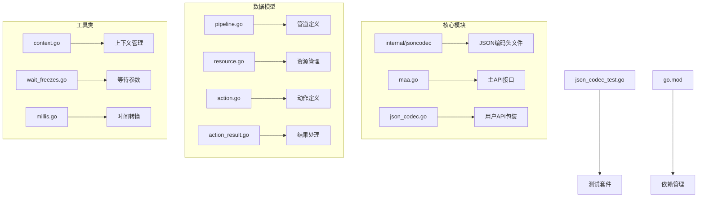

**图表来源**
- [internal/jsoncodec/jsoncodec.go](file://internal/jsoncodec/jsoncodec.go#L1-L58)
- [json_codec.go](file://json_codec.go#L1-L43)
- [maa.go](file://maa.go#L1-L200)

**章节来源**
- [README.md](file://README.md#L1-L191)
- [go.mod](file://go.mod#L1-L15)

## 核心组件

### JSON编码器接口定义

项目提供了两个核心接口类型，用于定义JSON编码和解码行为：

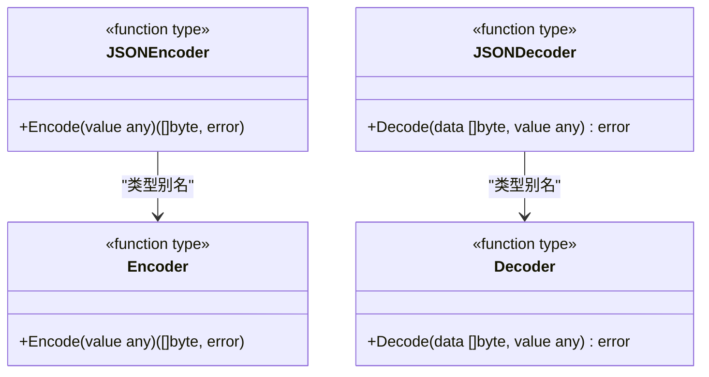

**图表来源**
- [json_codec.go](file://json_codec.go#L5-L9)
- [internal/jsoncodec/jsoncodec.go](file://internal/jsoncodec/jsoncodec.go#L8-L9)

### 编码器存储机制

系统使用原子值存储来管理全局编码器状态：

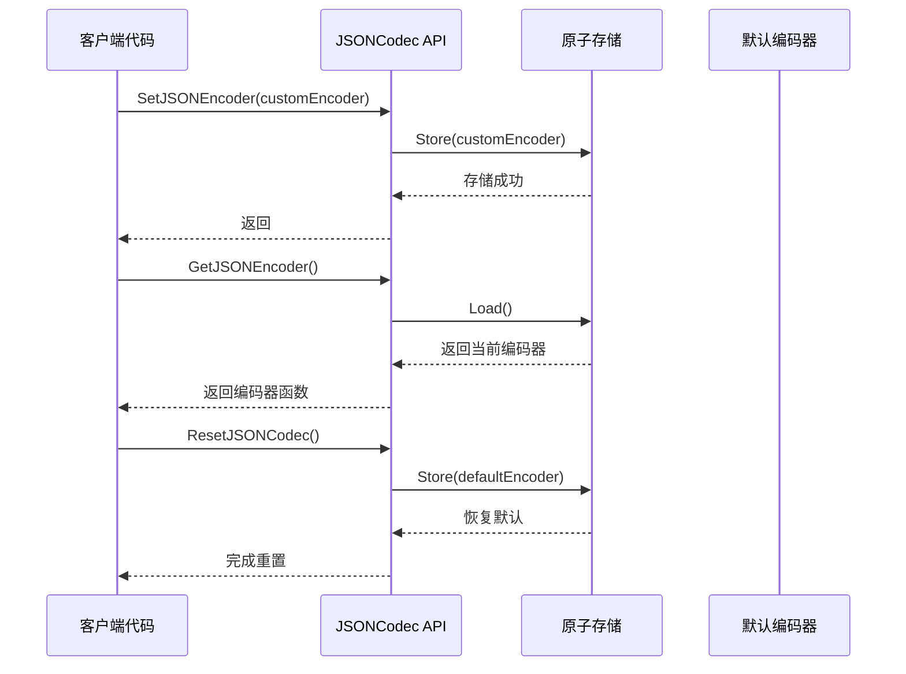

**图表来源**
- [internal/jsoncodec/jsoncodec.go](file://internal/jsoncodec/jsoncodec.go#L11-L49)

**章节来源**
- [internal/jsoncodec/jsoncodec.go](file://internal/jsoncodec/jsoncodec.go#L1-L58)
- [json_codec.go](file://json_codec.go#L1-L43)

## 架构概览

### 整体架构设计

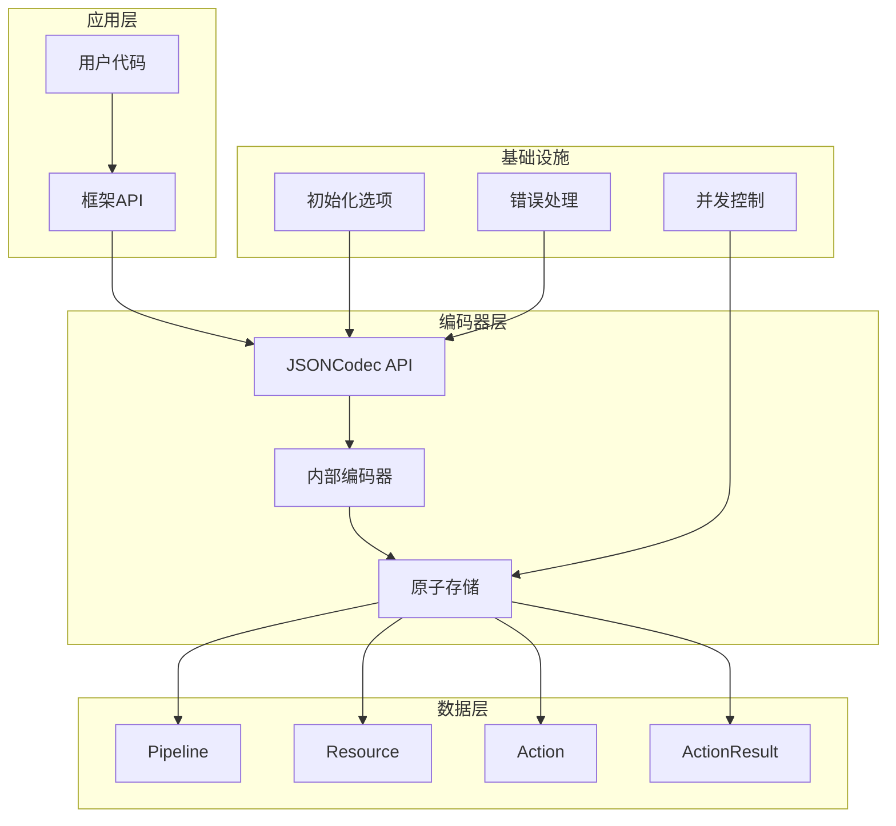

**图表来源**
- [maa.go](file://maa.go#L34-L69)
- [internal/jsoncodec/jsoncodec.go](file://internal/jsoncodec/jsoncodec.go#L11-L17)

### 初始化流程

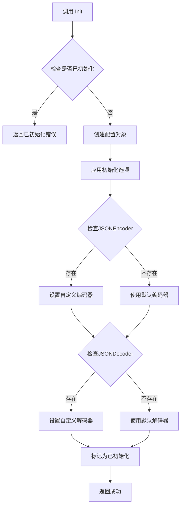

**图表来源**
- [maa.go](file://maa.go#L146-L209)

**章节来源**
- [maa.go](file://maa.go#L146-L209)

## 详细组件分析

### 内部JSON编码头文件

内部实现提供了完整的JSON编码头文件，包括：

- **类型定义**：定义了Encoder和Decoder函数类型
- **默认实现**：使用encoding/json的标准实现
- **原子存储**：使用sync/atomic.Value确保线程安全
- **全局操作**：提供设置、获取、重置功能

### 用户API包装

用户API包装层提供了更友好的接口：

- **类型转换**：将内部类型转换为公共类型
- **便捷函数**：提供简化的方法调用
- **错误处理**：统一错误处理机制

### 数据模型中的JSON集成

多个数据模型实现了JSON序列化接口：

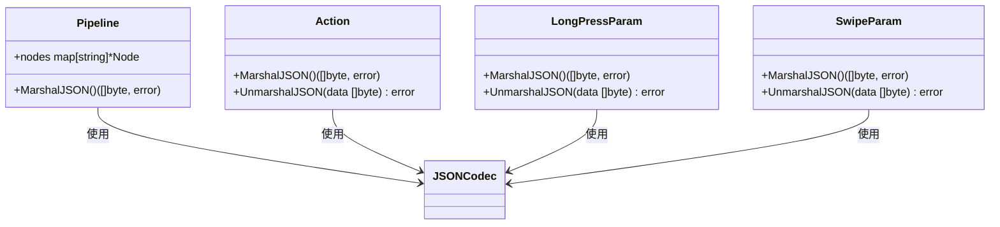

**图表来源**
- [pipeline.go](file://pipeline.go#L28-L31)
- [action.go](file://action.go#L167-L173)
- [action.go](file://action.go#L173-L180)

**章节来源**
- [pipeline.go](file://pipeline.go#L28-L31)
- [action.go](file://action.go#L17-L25)
- [action.go](file://action.go#L167-L173)

### 资源管理中的JSON使用

资源管理系统广泛使用JSON编码器：

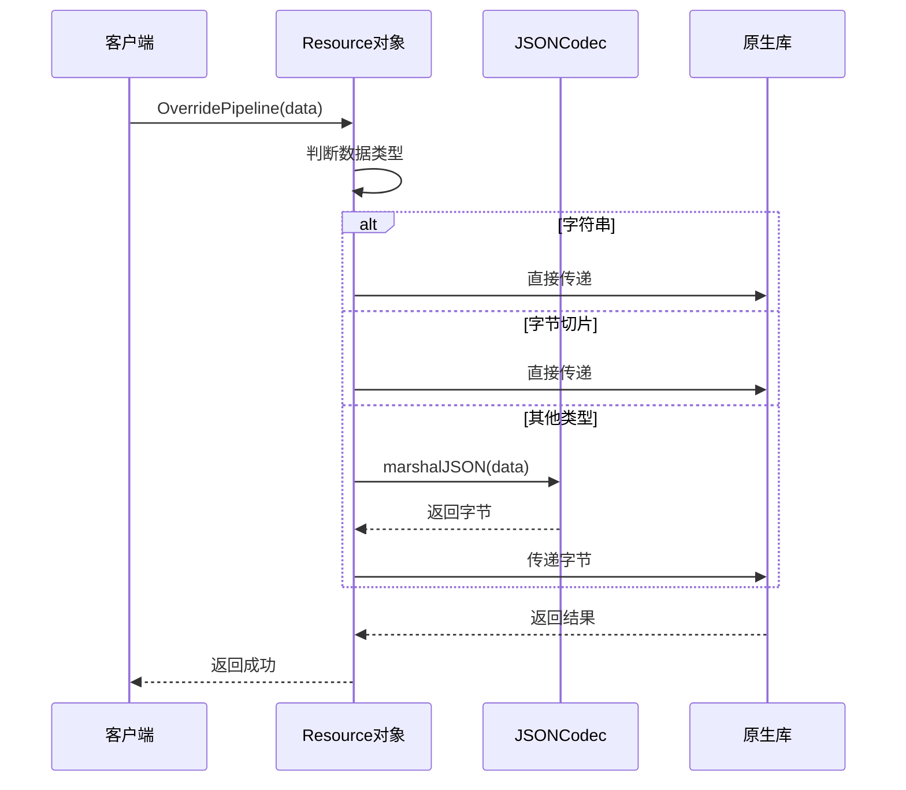

**图表来源**
- [resource.go](file://resource.go#L328-L343)

**章节来源**
- [resource.go](file://resource.go#L328-L343)

### 时间参数的JSON处理

等待参数等时间敏感的数据结构也集成了JSON处理：

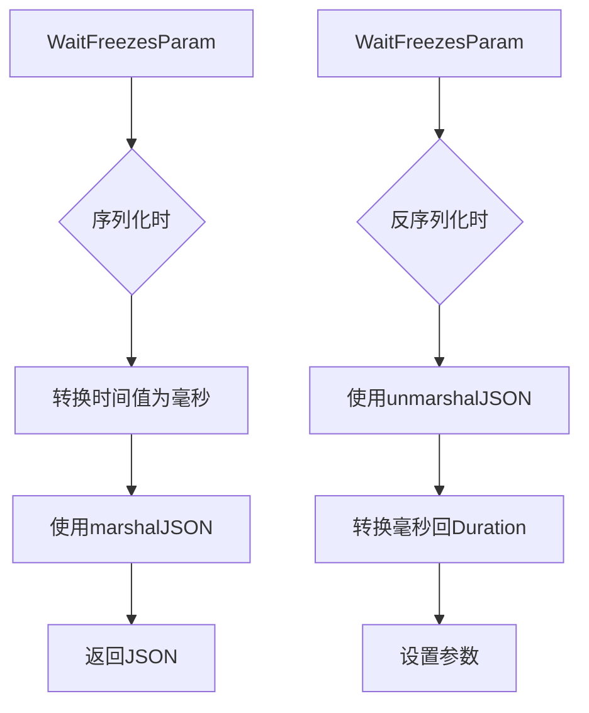

**图表来源**
- [wait_freezes.go](file://wait_freezes.go#L31-L42)
- [wait_freezes.go](file://wait_freezes.go#L44-L60)

**章节来源**
- [wait_freezes.go](file://wait_freezes.go#L31-L61)
- [millis.go](file://millis.go#L1-L25)

## 依赖关系分析

### 外部依赖

项目的主要外部依赖包括：

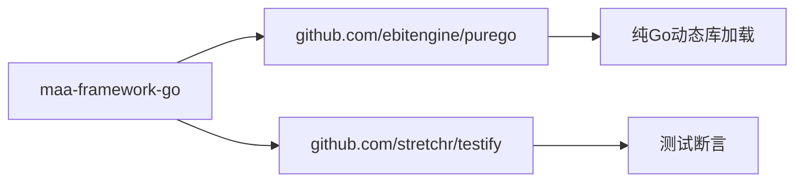

**图表来源**
- [go.mod](file://go.mod#L5-L14)

### 内部模块依赖

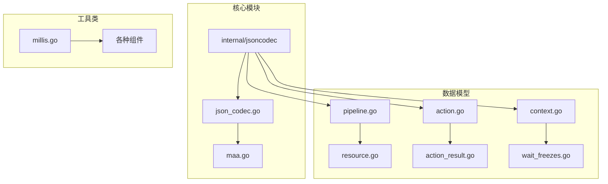

**图表来源**
- [internal/jsoncodec/jsoncodec.go](file://internal/jsoncodec/jsoncodec.go#L1-L10)
- [json_codec.go](file://json_codec.go#L1-L10)

**章节来源**
- [go.mod](file://go.mod#L1-L15)

## 性能考虑

### 并发安全性

系统采用原子值存储确保在高并发环境下的线程安全：

- **原子操作**：使用sync/atomic.Value避免锁竞争
- **无锁设计**：减少同步开销
- **内存屏障**：确保可见性

### 内存管理

- **零分配策略**：尽量避免不必要的内存分配
- **缓冲区复用**：在可能的情况下复用缓冲区
- **延迟初始化**：仅在需要时创建昂贵的对象

### 编码器选择

- **默认性能**：使用标准库提供最佳平衡
- **自定义优化**：允许针对特定场景优化
- **缓存策略**：可实现自定义的缓存机制

## 故障排除指南

### 常见问题

1. **编码器为空指针**
   - 症状：调用SetJSONEncoder(nil)导致panic
   - 解决方案：始终传递有效的编码器函数

2. **初始化顺序错误**
   - 症状：在Init之前调用编码器函数
   - 解决方案：确保先调用Init再使用编码器

3. **并发修改冲突**
   - 症状：多个goroutine同时修改编码器
   - 解决方案：使用原子操作或同步机制

### 调试技巧

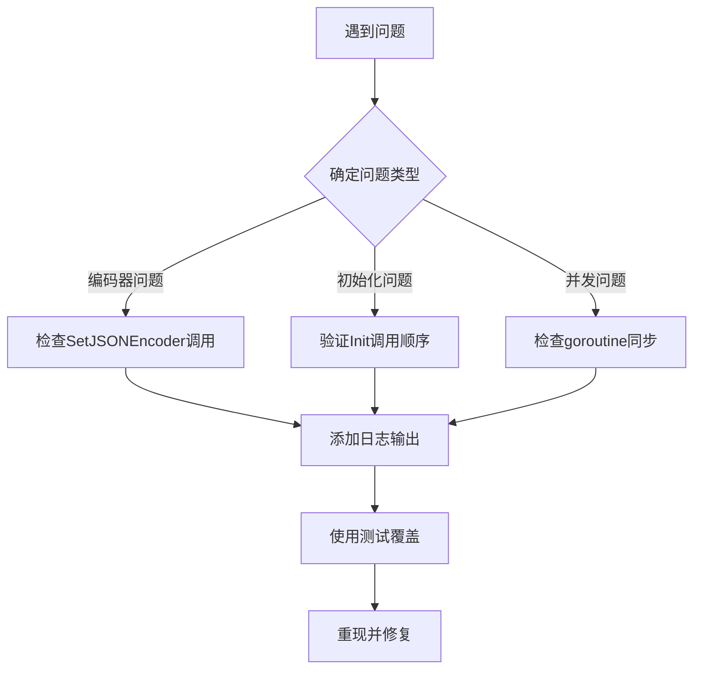

**章节来源**
- [json_codec_test.go](file://json_codec_test.go#L70-L88)

## 结论

可配置JSON编码器为MaaFramework Go绑定提供了强大的灵活性和扩展性。通过原子值存储机制，系统在保证线程安全的同时提供了高性能的JSON处理能力。

该实现的关键优势包括：

- **完全兼容**：与标准encoding/json完全兼容
- **高度可配置**：支持运行时替换编码器
- **线程安全**：原子操作确保并发安全性
- **易于使用**：简洁的API设计
- **全面测试**：完善的测试覆盖

对于需要自定义JSON处理逻辑的应用场景，这个可配置JSON编码器提供了理想的解决方案，既保持了简单性又提供了足够的灵活性。