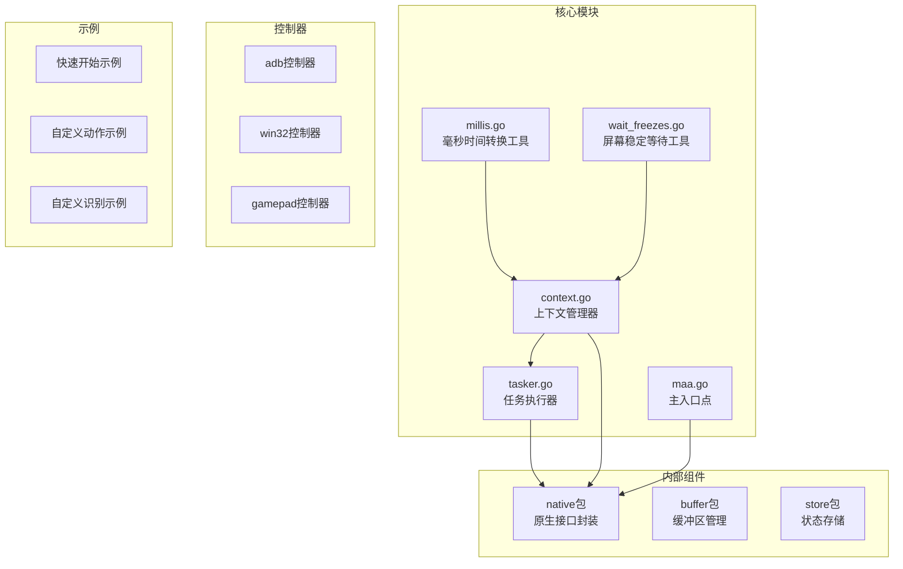
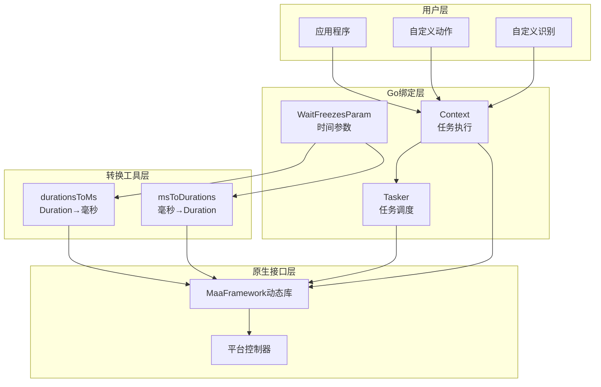
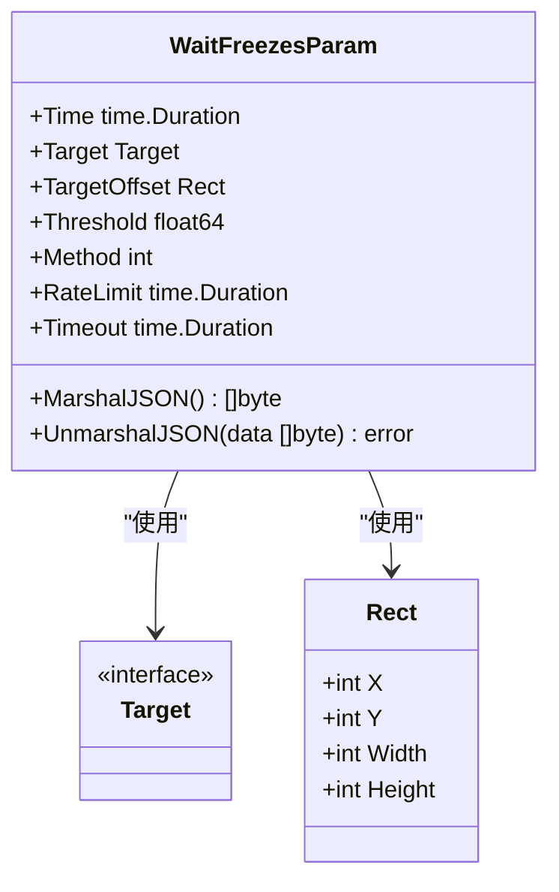
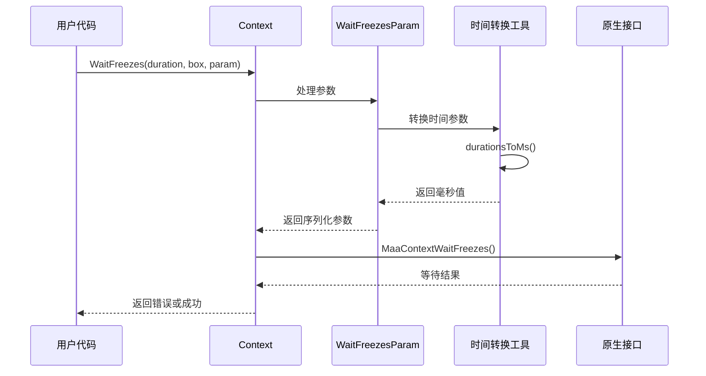
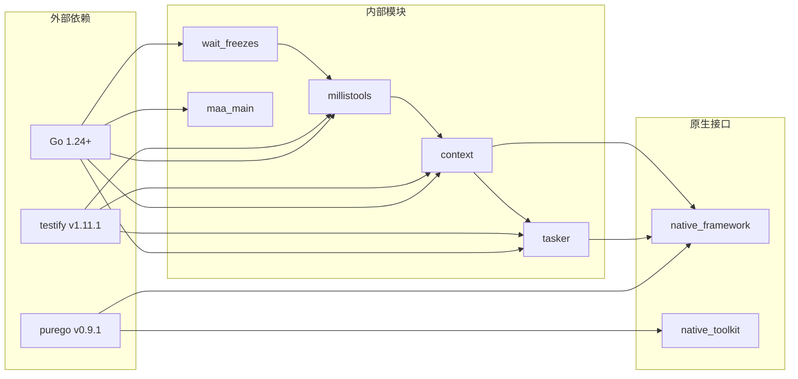

# 毫秒时间处理工具

<cite>
**本文档引用的文件**
- [millis.go](file://millis.go)
- [wait_freezes.go](file://wait_freezes.go)
- [context.go](file://context.go)
- [tasker.go](file://tasker.go)
- [maa.go](file://maa.go)
- [README.md](file://README.md)
- [go.mod](file://go.mod)
</cite>

## 目录
1. [简介](#简介)
2. [项目结构](#项目结构)
3. [核心组件](#核心组件)
4. [架构概览](#架构概览)
5. [详细组件分析](#详细组件分析)
6. [依赖关系分析](#依赖关系分析)
7. [性能考虑](#性能考虑)
8. [故障排除指南](#故障排除指南)
9. [结论](#结论)

## 简介

毫秒时间处理工具是MaaFramework Go绑定中的一个专门模块，负责在Go语言的time.Duration类型与毫秒整数之间进行转换。该工具集为整个自动化框架提供了统一的时间处理机制，确保在不同组件间传递时间参数时的一致性和准确性。

MaaFramework是一个基于图像识别的跨平台自动化测试框架，支持Android设备、Windows桌面应用等多种平台的自动化操作。该框架通过Go绑定提供了纯Go的接口，无需Cgo即可使用。

## 项目结构

该项目采用模块化设计，主要包含以下核心目录和文件：



**图表来源**
- [millis.go](file://millis.go#L1-L26)
- [wait_freezes.go](file://wait_freezes.go#L1-L61)
- [context.go](file://context.go#L1-L506)

**章节来源**
- [README.md](file://README.md#L1-L191)
- [go.mod](file://go.mod#L1-L15)

## 核心组件

### 毫秒时间转换工具

毫秒时间处理工具的核心是两个简单的转换函数，它们提供了在Go标准库time.Duration类型和毫秒整数之间的双向转换能力。

**章节来源**
- [millis.go](file://millis.go#L1-L26)

### 屏幕稳定等待参数

WaitFreezesParam结构体定义了等待屏幕稳定的相关参数，包括时间阈值、检查频率和超时设置等。

**章节来源**
- [wait_freezes.go](file://wait_freezes.go#L1-L61)

### 上下文管理器

Context结构体提供了运行时上下文，支持任务执行、识别和动作的协调管理。

**章节来源**
- [context.go](file://context.go#L1-L506)

## 架构概览



**图表来源**
- [context.go](file://context.go#L432-L462)
- [wait_freezes.go](file://wait_freezes.go#L29-L60)
- [millis.go](file://millis.go#L5-L25)

## 详细组件分析

### 毫秒时间转换函数

#### durationsToMs函数

该函数将time.Duration切片转换为毫秒整数切片，是整个时间处理系统的基础。

```mermaid
flowchart TD
A[输入: []time.Duration] --> B{检查nil}
B --> |是| C[返回nil]
B --> |否| D[创建[]int64切片]
D --> E[遍历每个Duration]
E --> F[调用Milliseconds()方法]
F --> G[存储到对应索引]
G --> H[返回转换后的切片]
```

**图表来源**
- [millis.go](file://millis.go#L5-L14)

#### msToDurations函数

该函数执行相反的转换，将毫秒整数切片转换回time.Duration切片。

```mermaid
flowchart TD
A[输入: []int64] --> B{检查nil}
B --> |是| C[返回nil]
B --> |否| D[创建[]time.Duration切片]
D --> E[遍历每个毫秒值]
E --> F[创建time.Duration(m) * time.Millisecond]
F --> G[存储到对应索引]
G --> H[返回转换后的切片]
```

**图表来源**
- [millis.go](file://millis.go#L16-L25)

**章节来源**
- [millis.go](file://millis.go#L1-L26)

### WaitFreezesParam结构体

WaitFreezesParam定义了屏幕稳定检测的参数配置，支持JSON序列化和反序列化。



**图表来源**
- [wait_freezes.go](file://wait_freezes.go#L9-L27)

#### JSON序列化机制

WaitFreezesParam实现了自定义的JSON序列化逻辑，将时间字段转换为毫秒整数格式。

**章节来源**
- [wait_freezes.go](file://wait_freezes.go#L1-L61)

### Context.WaitFreezes方法

Context结构体的WaitFreezes方法利用毫秒时间处理工具来实现屏幕稳定等待功能。



**图表来源**
- [context.go](file://context.go#L432-L462)
- [wait_freezes.go](file://wait_freezes.go#L29-L42)

**章节来源**
- [context.go](file://context.go#L432-L462)

## 依赖关系分析



**图表来源**
- [go.mod](file://go.mod#L1-L15)
- [millis.go](file://millis.go#L1-L26)
- [context.go](file://context.go#L1-L506)

**章节来源**
- [go.mod](file://go.mod#L1-L15)

## 性能考虑

### 内存分配优化

毫秒时间处理工具采用了高效的内存管理策略：

1. **零分配策略**：当输入为nil时直接返回nil，避免不必要的内存分配
2. **预分配切片**：在转换前预先确定目标切片大小，减少内存重新分配
3. **就地转换**：直接修改现有切片内容，避免创建新的中间变量

### 类型安全保证

- 使用强类型检查确保编译时发现类型不匹配问题
- 避免使用unsafe.Pointer进行类型转换，保持内存安全
- 提供完整的边界检查和错误处理机制

### 性能基准

毫秒时间转换操作的时间复杂度为O(n)，其中n为切片长度。空间复杂度同样为O(n)，用于存储转换结果。

## 故障排除指南

### 常见问题及解决方案

#### 1. 空指针异常

**症状**：程序崩溃并出现nil指针引用错误

**原因**：未正确初始化MaaFramework或传入nil参数

**解决方案**：
- 确保先调用`maa.Init()`初始化框架
- 检查所有输入参数是否为nil
- 使用适当的错误检查机制

#### 2. 时间精度丢失

**症状**：时间值在转换过程中出现精度损失

**原因**：time.Duration的纳秒级精度转换为毫秒整数

**解决方案**：
- 确认业务需求是否需要纳秒级精度
- 在必要时使用更精确的时间表示方式
- 注意浮点数转换可能引入的误差

#### 3. 内存泄漏

**症状**：长时间运行后内存使用量持续增长

**原因**：未正确释放原生资源或缓冲区

**解决方案**：
- 确保正确调用`tasker.Destroy()`和`context.Destroy()`
- 检查自定义动作和识别器的资源管理
- 使用defer语句确保资源及时释放

**章节来源**
- [maa.go](file://maa.go#L146-L231)
- [context.go](file://context.go#L412-L430)

## 结论

毫秒时间处理工具作为MaaFramework Go绑定的重要组成部分，为整个自动化框架提供了可靠的时间处理能力。通过简洁而高效的设计，该工具集确保了：

1. **类型安全性**：通过强类型检查避免常见的类型转换错误
2. **性能优化**：采用零分配和预分配策略提升执行效率
3. **易用性**：提供直观的API接口，降低使用复杂度
4. **可维护性**：清晰的代码结构和完善的错误处理机制

该工具集不仅满足了当前框架的需求，也为未来的扩展和优化奠定了坚实的基础。通过与其他组件的紧密集成，毫秒时间处理工具成为了MaaFramework Go绑定中不可或缺的重要组成部分。