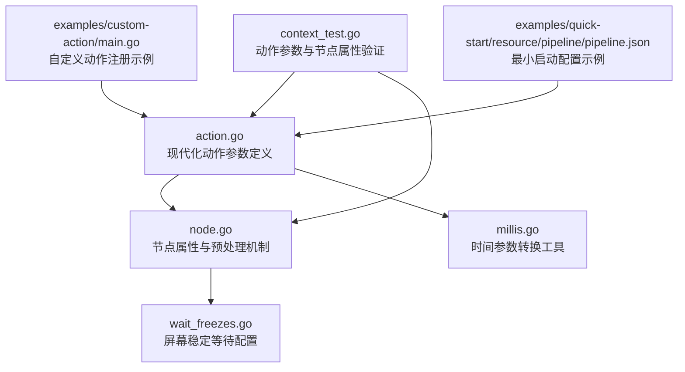
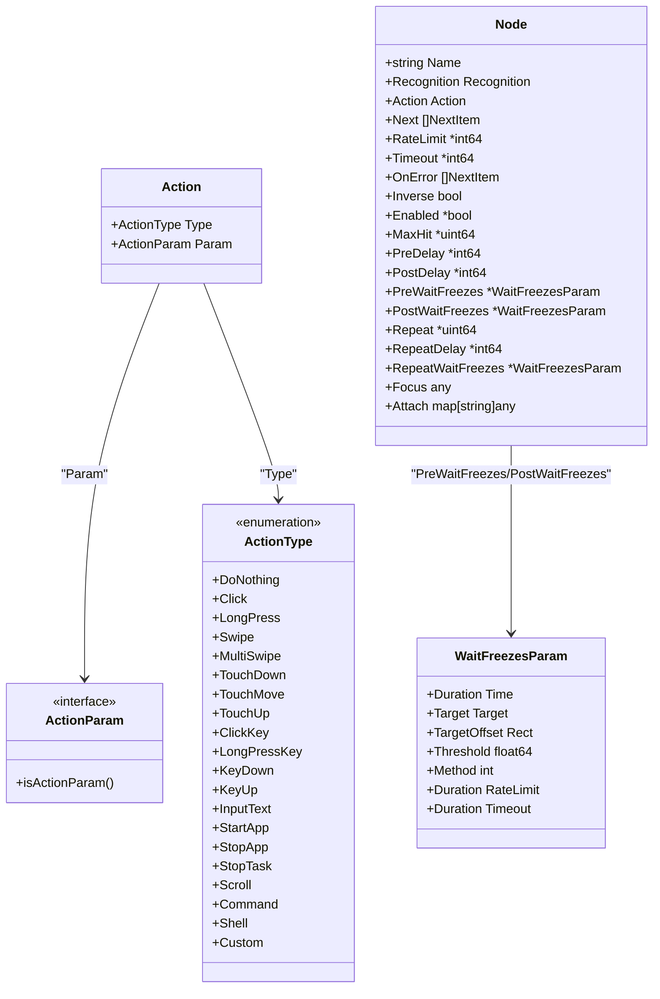
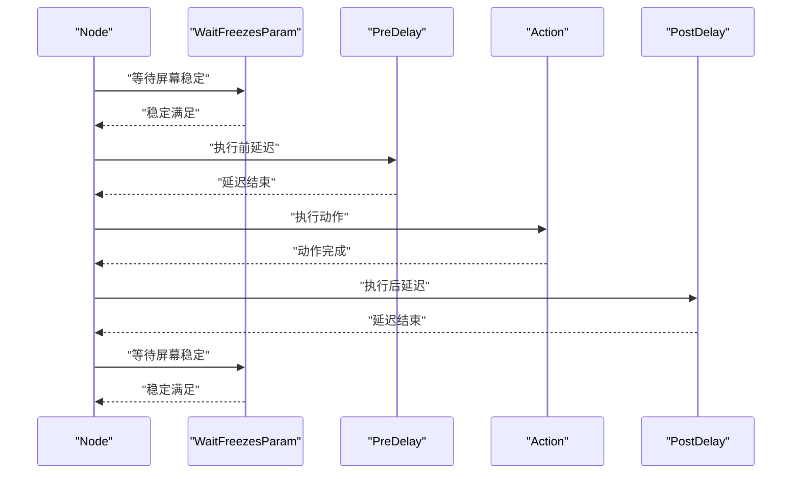
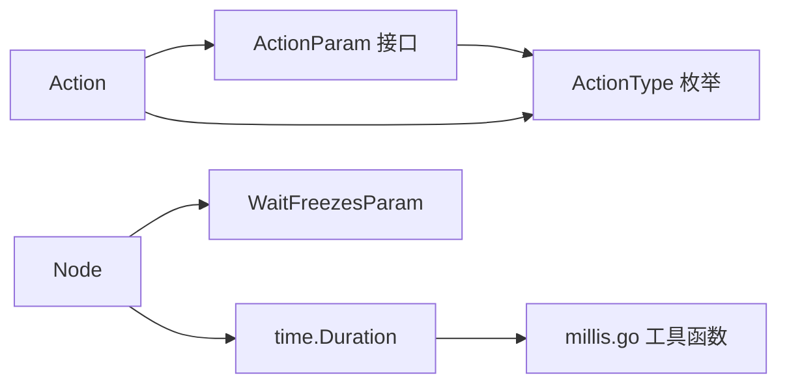

# 动作系统配置

<cite>
**本文引用的文件**
- [action.go](file://action.go)
- [node.go](file://node.go)
- [wait_freezes.go](file://wait_freezes.go)
- [millis.go](file://millis.go)
- [context_test.go](file://context_test.go)
- [examples/quick-start/resource/pipeline/pipeline.json](file://examples/quick-start/resource/pipeline/pipeline.json)
- [examples/custom-action/main.go](file://examples/custom-action/main.go)
</cite>

## 更新摘要
**所做更改**
- 更新了动作参数类型系统，引入现代化的 duration 字段处理机制
- 新增了统一的 JSON 序列化/反序列化接口设计
- 完善了时间参数的毫秒级转换机制
- 增强了动作参数的类型安全性和易用性

## 目录
1. [简介](#简介)
2. [项目结构与定位](#项目结构与定位)
3. [核心组件总览](#核心组件总览)
4. [架构概览](#架构概览)
5. [详细组件分析](#详细组件分析)
6. [依赖关系分析](#依赖关系分析)
7. [性能与稳定性考量](#性能与稳定性考量)
8. [故障排查指南](#故障排查指南)
9. [结论](#结论)
10. [附录：常见用法与示例](#附录常见用法与示例)

## 简介
本文件系统化梳理了现代化的 NodeAction 类型在本仓库中的动作体系，重点介绍了基于统一参数类型和接口设计的动作系统配置。新版本采用现代化的参数类型设计，通过统一的 JSON 序列化机制和毫秒级时间参数处理，显著提升了 API 的一致性和易用性。文档覆盖 Click、Swipe、StartApp、StopApp、Text（InputText）、Key（ClickKey/LongPressKey/KeyDown/KeyUp）、LongPress、Scroll、Command、Custom 等动作类型，并详细说明各动作的参数含义与设置方式。

## 项目结构与定位
- 动作类型与参数定义集中在 action.go 中，包含 Action、ActionType、各类 ActionParam 结构体及 ActXxx 工厂函数
- 节点属性与预处理机制定义在 node.go 中，提供现代化的属性设置接口
- 屏幕稳定等待配置在 wait_freezes.go 中，支持统一的时间参数处理
- 时间转换工具在 millis.go 中，提供毫秒级时间参数的序列化/反序列化支持
- 行为验证与参数示例主要来自 context_test.go 的单元测试用例
- 示例工程展示了如何注册自定义动作与启动应用的基本流程

**图表来源**
- [action.go](file://action.go#L10-L115)
- [node.go](file://node.go#L9-L52)
- [wait_freezes.go](file://wait_freezes.go#L8-L28)
- [millis.go](file://millis.go#L1-L25)

**章节来源**
- [action.go](file://action.go#L10-L115)
- [node.go](file://node.go#L9-L52)
- [wait_freezes.go](file://wait_freezes.go#L8-L28)
- [millis.go](file://millis.go#L1-L25)
- [context_test.go](file://context_test.go#L14-L26)
- [examples/custom-action/main.go](file://examples/custom-action/main.go#L58-L61)
- [examples/quick-start/resource/pipeline/pipeline.json](file://examples/quick-start/resource/pipeline/pipeline.json#L1-L5)

## 核心组件总览
- Action：现代化的动作配置载体，包含 Type 与 Param 字段
- ActionType：枚举所有可用动作类型，提供类型安全的类型定义
- ActionParam：现代化的动作参数接口，支持统一的序列化机制
- 各动作工厂函数 ActXxx：提供类型安全的参数构建接口
- Node：节点配置，支持现代化的属性设置方法
- WaitFreezesParam：屏幕稳定等待配置，支持统一的时间参数处理

**章节来源**
- [action.go](file://action.go#L10-L115)
- [action.go](file://action.go#L86-L110)
- [action.go](file://action.go#L112-L115)
- [node.go](file://node.go#L9-L52)
- [wait_freezes.go](file://wait_freezes.go#L8-L28)

## 架构概览
下图展示现代化动作系统的核心架构，包括统一的参数类型设计和序列化机制：

**图表来源**
- [action.go](file://action.go#L10-L16)
- [action.go](file://action.go#L86-L110)
- [action.go](file://action.go#L112-L115)
- [node.go](file://node.go#L9-L52)
- [wait_freezes.go](file://wait_freezes.go#L8-L28)

## 详细组件分析

### 现代化的动作类型与参数系统
- **统一的参数接口**：所有动作参数都实现了 ActionParam 接口，确保类型安全和一致性
- **现代化的工厂函数**：每个动作类型都有对应的 ActXxx 工厂函数，提供类型安全的参数构建
- **增强的动作类型**：支持 DoNothing、Click、LongPress、Swipe、MultiSwipe、TouchDown、TouchMove、TouchUp、ClickKey、LongPressKey、KeyDown、KeyUp、InputText、StartApp、StopApp、StopTask、Scroll、Command、Shell、Custom 等完整动作集

**章节来源**
- [action.go](file://action.go#L10-L16)
- [action.go](file://action.go#L86-L110)
- [action.go](file://action.go#L112-L115)

### 现代化的参数类型设计
- **时间参数统一处理**：Duration、RateLimit、Timeout 等时间参数使用 time.Duration 类型，在 JSON 序列化时自动转换为毫秒整数
- **数组参数深拷贝**：MultiSwipe、ClickKey 等数组参数在工厂函数中进行深拷贝，避免共享状态问题
- **统一的序列化机制**：每个参数结构体都实现了自定义的 MarshalJSON 和 UnmarshalJSON 方法，确保 JSON 格式的一致性

**章节来源**
- [action.go](file://action.go#L148-L189)
- [action.go](file://action.go#L191-L248)
- [action.go](file://action.go#L250-L344)
- [action.go](file://action.go#L346-L397)
- [action.go](file://action.go#L399-L453)
- [action.go](file://action.go#L455-L485)
- [action.go](file://action.go#L487-L501)
- [action.go](file://action.go#L503-L533)
- [action.go](file://action.go#L535-L547)
- [action.go](file://action.go#L549-L567)
- [action.go](file://action.go#L569-L589)
- [action.go](file://action.go#L591-L603)
- [action.go](file://action.go#L605-L626)

### 现代化的节点属性系统
- **类型安全的属性设置**：每个节点属性都有对应的 SetXxx 方法，支持 time.Duration 类型的直接设置
- **现代化的默认值处理**：所有可选属性都使用指针类型，支持 nil 值表示未设置
- **增强的链式调用支持**：所有设置方法都返回节点本身，支持流畅的链式调用语法

**章节来源**
- [node.go](file://node.go#L9-L52)
- [node.go](file://node.go#L54-L60)
- [node.go](file://node.go#L98-L110)
- [node.go](file://node.go#L136-L148)
- [node.go](file://node.go#L150-L160)
- [node.go](file://node.go#L162-L179)
- [node.go](file://node.go#L181-L197)

### 屏幕稳定等待的现代化配置
- **统一的时间参数处理**：WaitFreezesParam 支持 Time、RateLimit、Timeout 三个时间参数的统一毫秒级处理
- **灵活的监控区域配置**：支持 Target 和 TargetOffset 的灵活组合，实现精确的监控区域定义
- **可配置的检测参数**：支持阈值、算法、检查间隔等参数的灵活配置

**章节来源**
- [wait_freezes.go](file://wait_freezes.go#L8-L28)
- [wait_freezes.go](file://wait_freezes.go#L30-L61)

### 时间参数转换工具
- **双向转换支持**：durationsToMs 和 msToDurations 函数提供时间切片与毫秒切片之间的双向转换
- **统一的序列化格式**：所有时间参数在 JSON 序列化时都转换为整数毫秒值
- **类型安全的转换**：转换函数确保类型安全，避免精度丢失

**章节来源**
- [millis.go](file://millis.go#L1-L25)

### 现代化的动作参数示例
- **Click 动作**：支持目标位置、偏移量和接触点配置
- **LongPress 动作**：支持目标、偏移量、持续时间和接触点配置
- **Swipe 动作**：支持起始和结束位置、偏移量、持续时间、结束停留、悬停模式和接触点配置
- **MultiSwipe 动作**：支持多指滑动，每个手指可以有不同的起始时间、位置和参数
- **键盘动作**：支持 ClickKey、LongPressKey、KeyDown、KeyUp 四种键盘操作
- **文本输入**：支持 InputText 动作，包含输入文本内容
- **应用控制**：支持 StartApp、StopApp、StopTask 动作
- **滚动操作**：支持 Scroll 动作，包含 dx、dy 参数
- **命令执行**：支持 Command 和 Shell 动作
- **自定义动作**：支持 Custom 动作，包含自定义参数

**章节来源**
- [context_test.go](file://context_test.go#L14-L26)
- [context_test.go](file://context_test.go#L684-L707)
- [context_test.go](file://context_test.go#L709-L740)
- [context_test.go](file://context_test.go#L742-L780)
- [context_test.go](file://context_test.go#L782-L853)
- [context_test.go](file://context_test.go#L855-L901)
- [context_test.go](file://context_test.go#L903-L947)
- [context_test.go](file://context_test.go#L949-L970)
- [context_test.go](file://context_test.go#L972-L1012)
- [context_test.go](file://context_test.go#L1014-L1080)
- [context_test.go](file://context_test.go#L1082-L1106)

### 动作执行序列（现代化流程）
以下序列图展示现代化动作执行的时序，包括预处理与后处理阶段：

**图表来源**
- [node.go](file://node.go#L34-L41)
- [wait_freezes.go](file://wait_freezes.go#L8-L28)

## 依赖关系分析
- Action 与 ActionParam 之间为组合关系，通过统一的接口确保类型安全
- 各 ActXxx 工厂函数负责创建对应 Action，并进行参数的深拷贝和类型转换
- Node 与 WaitFreezesParam 之间为组合关系，支持现代化的属性设置
- 时间参数转换工具提供统一的毫秒级处理机制

**图表来源**
- [action.go](file://action.go#L10-L16)
- [action.go](file://action.go#L86-L110)
- [action.go](file://action.go#L112-L115)
- [node.go](file://node.go#L9-L52)
- [wait_freezes.go](file://wait_freezes.go#L8-L28)
- [millis.go](file://millis.go#L1-L25)

**章节来源**
- [action.go](file://action.go#L10-L16)
- [action.go](file://action.go#L86-L110)
- [action.go](file://action.go#L112-L115)
- [node.go](file://node.go#L9-L52)
- [wait_freezes.go](file://wait_freezes.go#L8-L28)
- [millis.go](file://millis.go#L1-L25)

## 性能与稳定性考量
- **现代化的时间处理**：统一的 time.Duration 类型确保时间参数的精度和一致性
- **深拷贝机制**：数组参数在工厂函数中进行深拷贝，避免参数共享导致的状态污染
- **类型安全的接口**：统一的 ActionParam 接口确保所有动作参数的类型安全性
- **灵活的默认值处理**：可选属性使用指针类型，支持灵活的默认值处理
- **高效的序列化机制**：自定义的 JSON 序列化方法确保参数转换的高效性

## 故障排查指南
- **动作类型不支持**
  - 当 ActionParam 未在解析分支中出现时会返回错误。请确认类型名称拼写与大小写一致
  - 参考路径：[动作类型解析与错误处理](file://action.go#L34-L84)
- **参数类型不匹配**
  - 现代化的参数系统通过统一的接口和工厂函数确保类型安全
  - 参考路径：[动作参数示例](file://context_test.go#L14-L26)
- **时间参数转换错误**
  - 确认使用正确的工厂函数和参数类型
  - 参考路径：[时间参数转换工具](file://millis.go#L1-L25)
- **节点属性设置问题**
  - 使用现代化的 SetXxx 方法进行属性设置，支持 time.Duration 类型
  - 参考路径：[节点属性设置方法](file://node.go#L98-L197)

**章节来源**
- [action.go](file://action.go#L34-L84)
- [context_test.go](file://context_test.go#L14-L26)
- [millis.go](file://millis.go#L1-L25)
- [node.go](file://node.go#L98-L197)

## 结论
现代化的动作系统通过统一的参数类型设计、增强的工厂函数机制和完善的序列化支持，显著提升了 API 的一致性和易用性。新的设计不仅保持了原有功能的完整性，还通过类型安全的接口、深拷贝机制和现代化的时间处理，为开发者提供了更加可靠和高效的使用体验。建议在复杂场景中充分利用这些现代化特性，构建更加健壮的自动化脚本。

## 附录：常见用法与示例

### 最小启动示例（StartApp）
- 示例路径：[pipeline.json](file://examples/quick-start/resource/pipeline/pipeline.json#L1-L5)
- 说明：该示例将 Startup 节点的动作设为 StartApp，适合快速启动目标应用

**章节来源**
- [examples/quick-start/resource/pipeline/pipeline.json](file://examples/quick-start/resource/pipeline/pipeline.json#L1-L5)

### 注册自定义动作示例
- 示例路径：[custom-action/main.go](file://examples/custom-action/main.go#L58-L61)
- 说明：通过 Resource.RegisterCustomAction 注册自定义动作名称与处理器，随后在流水线中以 Custom 动作调用

**章节来源**
- [examples/custom-action/main.go](file://examples/custom-action/main.go#L58-L61)

### 组合复杂自动化场景建议
- **场景一：长按后滑动**
  - 使用 ActLongPress 创建长按动作，然后使用 ActSwipe 创建滑动动作
  - 参考路径：[LongPress 参数](file://action.go#L148-L189)、[Swipe 参数](file://action.go#L191-L248)
- **场景二：多指滑动**
  - 使用 ActMultiSwipe 创建多指滑动动作，为每个手指设置不同的 Starting、Begin/End、Duration 等参数
  - 参考路径：[MultiSwipe 参数](file://action.go#L250-L344)
- **场景三：输入文本并等待稳定**
  - 使用 ActInputText 创建文本输入动作，然后设置 PostWaitFreezes 等待界面稳定
  - 参考路径：[InputText 参数](file://action.go#L487-L501)、[WaitFreezes 参数](file://wait_freezes.go#L8-L28)
- **场景四：启动应用后执行命令**
  - 先使用 ActStartApp 启动应用，再使用 ActCommand 执行外部脚本
  - 参考路径：[StartApp 参数](file://action.go#L503-L533)、[Command 参数](file://action.go#L569-L589)

**章节来源**
- [action.go](file://action.go#L148-L189)
- [action.go](file://action.go#L191-L248)
- [action.go](file://action.go#L250-L344)
- [action.go](file://action.go#L487-L501)
- [action.go](file://action.go#L503-L533)
- [action.go](file://action.go#L569-L589)
- [wait_freezes.go](file://wait_freezes.go#L8-L28)