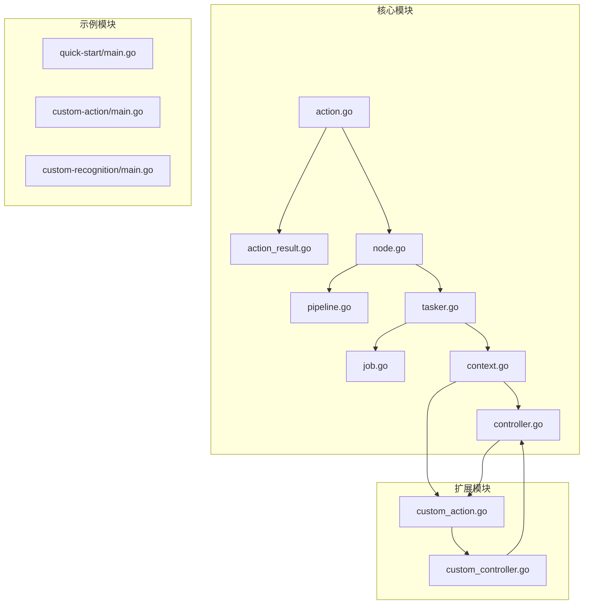
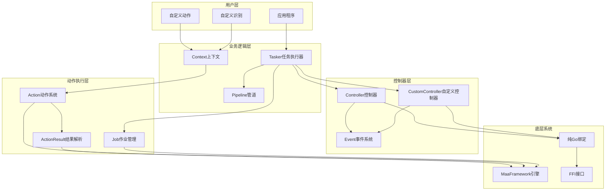
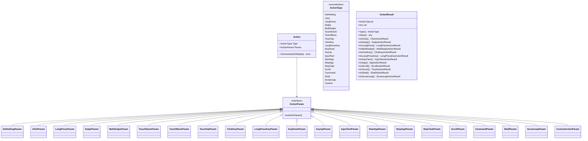
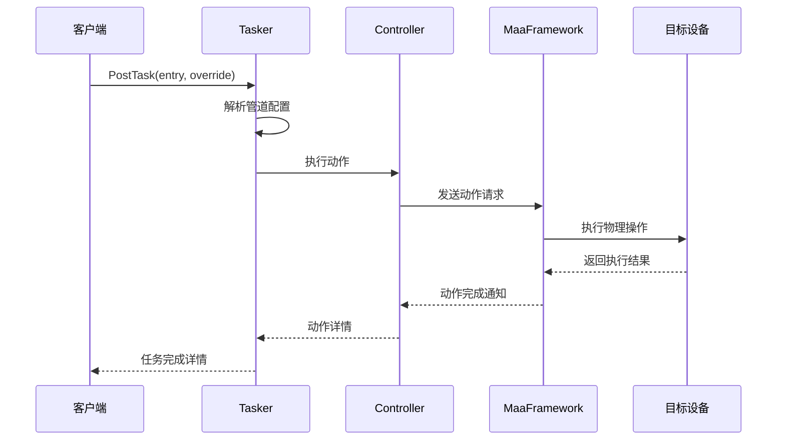
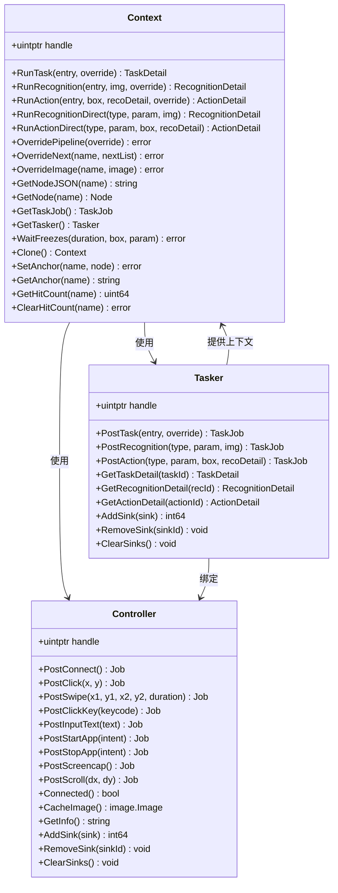
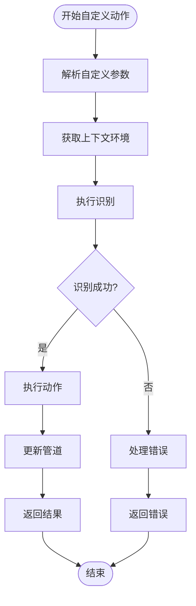
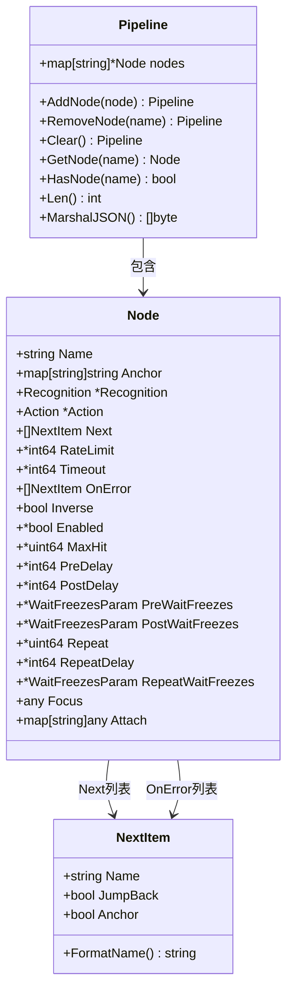
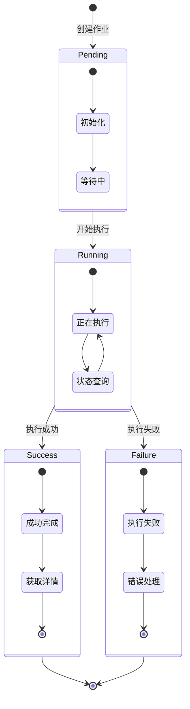
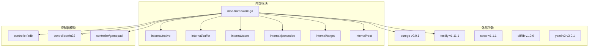
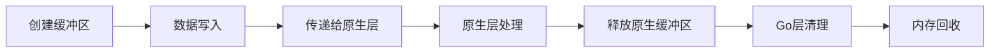

# 统一动作系统

<cite>
**本文档引用的文件**
- [action.go](file://action.go)
- [action_result.go](file://action_result.go)
- [context.go](file://context.go)
- [controller.go](file://controller.go)
- [custom_action.go](file://custom_action.go)
- [custom_controller.go](file://custom_controller.go)
- [node.go](file://node.go)
- [pipeline.go](file://pipeline.go)
- [tasker.go](file://tasker.go)
- [job.go](file://job.go)
- [main.go](file://examples/quick-start/main.go)
- [main.go](file://examples/custom-action/main.go)
- [main.go](file://examples/custom-recognition/main.go)
- [README.md](file://README.md)
- [go.mod](file://go.mod)
</cite>

## 目录
1. [简介](#简介)
2. [项目结构](#项目结构)
3. [核心组件](#核心组件)
4. [架构概览](#架构概览)
5. [详细组件分析](#详细组件分析)
6. [依赖关系分析](#依赖关系分析)
7. [性能考虑](#性能考虑)
8. [故障排除指南](#故障排除指南)
9. [结论](#结论)
10. [附录](#附录)

## 简介

统一动作系统是基于MaaFramework的跨平台自动化测试框架，提供了一套完整的动作执行和控制机制。该系统通过统一的动作类型定义、灵活的参数配置和强大的扩展能力，实现了对不同平台设备（Android、Windows、iOS等）的自动化控制。

系统的核心特点包括：
- **统一动作接口**：标准化的动作类型和参数定义
- **多平台支持**：ADB控制器、Win32控制器、PlayCover控制器等
- **自定义扩展**：支持自定义动作和识别算法
- **异步执行**：基于作业系统的异步任务管理
- **事件驱动**：完整的事件回调机制

## 项目结构



**图表来源**
- [action.go](file://action.go#L1-L648)
- [node.go](file://node.go#L1-L343)
- [tasker.go](file://tasker.go#L1-L676)
- [controller.go](file://controller.go#L1-L558)

**章节来源**
- [go.mod](file://go.mod#L1-L15)
- [README.md](file://README.md#L1-L191)

## 核心组件

### 动作系统核心

统一动作系统的核心由以下关键组件构成：

#### 动作类型定义
系统定义了丰富的动作类型，涵盖点击、滑动、按键、应用控制等多种操作：
- 基础输入动作：Click、LongPress、Swipe、MultiSwipe
- 触摸手势：TouchDown、TouchMove、TouchUp
- 键盘操作：ClickKey、LongPressKey、KeyDown、KeyUp
- 应用控制：StartApp、StopApp
- 设备操作：Scroll、Command、Shell、Screencap
- 控制器操作：StopTask、Custom

#### 动作参数系统
每个动作类型都有对应的参数结构，支持灵活的配置选项：
- 目标定位：Target、TargetOffset
- 时间控制：Duration、EndHold
- 压力控制：Pressure
- 联系点标识：Contact

#### 结果解析系统
动作执行结果通过统一的解析机制处理，支持不同类型动作的结果提取：
- 点击结果：包含坐标、接触点、压力信息
- 滑动结果：包含起始点、终点列表、持续时间
- 键盘结果：包含键码信息
- 应用结果：包含包名信息

**章节来源**
- [action.go](file://action.go#L88-L113)
- [action_result.go](file://action_result.go#L48-L159)

### 上下文管理系统

上下文系统为自定义动作和识别提供了运行时环境：
- **任务执行**：RunTask、RunRecognition、RunAction
- **直接调用**：RunRecognitionDirect、RunActionDirect
- **管道覆盖**：OverridePipeline、OverrideNext
- **资源访问**：GetNode、GetTasker、WaitFreezes

### 控制器系统

系统支持多种平台的控制器实现：
- **ADB控制器**：Android设备自动化
- **Win32控制器**：Windows桌面应用控制
- **PlayCover控制器**：iOS应用通过PlayCover控制
- **虚拟游戏手柄**：Windows平台的ViGEm支持

**章节来源**
- [context.go](file://context.go#L13-L506)
- [controller.go](file://controller.go#L26-L558)

## 架构概览



**图表来源**
- [tasker.go](file://tasker.go#L14-L676)
- [context.go](file://context.go#L13-L506)
- [controller.go](file://controller.go#L26-L558)
- [action.go](file://action.go#L10-L86)

## 详细组件分析

### 动作系统架构



**图表来源**
- [action.go](file://action.go#L10-L118)
- [action_result.go](file://action_result.go#L48-L159)

#### 动作执行流程



**图表来源**
- [tasker.go](file://tasker.go#L104-L152)
- [controller.go](file://controller.go#L292-L402)

**章节来源**
- [action.go](file://action.go#L1-L648)
- [action_result.go](file://action_result.go#L1-L392)

### 上下文系统分析



**图表来源**
- [context.go](file://context.go#L13-L506)
- [tasker.go](file://tasker.go#L14-L676)
- [controller.go](file://controller.go#L26-L558)

#### 自定义动作执行流程



**图表来源**
- [custom_action.go](file://custom_action.go#L50-L94)
- [custom_controller.go](file://custom_controller.go#L120-L137)

**章节来源**
- [context.go](file://context.go#L1-L506)
- [custom_action.go](file://custom_action.go#L1-L94)

### 管道系统设计



**图表来源**
- [pipeline.go](file://pipeline.go#L16-L67)
- [node.go](file://node.go#L9-L52)

#### 作业管理系统



**图表来源**
- [job.go](file://job.go#L6-L168)

**章节来源**
- [pipeline.go](file://pipeline.go#L1-L67)
- [node.go](file://node.go#L1-L343)
- [job.go](file://job.go#L1-L168)

## 依赖关系分析



**图表来源**
- [go.mod](file://go.mod#L5-L14)

### 核心依赖特性

系统采用纯Go实现，通过purego库实现与C库的交互：
- **无CGO要求**：完全基于purego的纯Go实现
- **跨平台支持**：支持Windows、Linux、macOS等多个平台
- **动态库加载**：运行时动态加载MaaFramework库
- **内存安全**：通过缓冲区管理确保内存安全

**章节来源**
- [go.mod](file://go.mod#L1-L15)

## 性能考虑

### 异步执行优化

系统通过作业模式实现高效的异步执行：
- **非阻塞操作**：所有I/O操作都是异步的
- **状态缓存**：避免重复的状态查询
- **批量处理**：支持多个作业的并发执行

### 内存管理



**图表来源**
- [context.go](file://context.go#L97-L112)
- [tasker.go](file://tasker.go#L242-L305)

### 缓冲区管理

系统使用专门的缓冲区管理机制：
- **图像缓冲区**：高效处理图像数据传输
- **字符串缓冲区**：管理字符串数据的生命周期
- **矩形缓冲区**：处理坐标数据的序列化
- **列表缓冲区**：管理复杂数据结构

## 故障排除指南

### 常见问题诊断

#### 连接问题
- **ADB连接失败**：检查设备连接状态和权限
- **Win32窗口无响应**：确认窗口句柄有效性和权限
- **控制器初始化错误**：验证配置参数和依赖库

#### 动作执行问题
- **动作超时**：检查目标位置和等待时间设置
- **识别失败**：验证图像质量和ROI区域
- **结果解析错误**：检查JSON格式和字段完整性

#### 自定义扩展问题
- **自定义动作未注册**：确认注册函数调用和参数传递
- **回调函数异常**：检查回调函数的实现和上下文访问
- **内存泄漏**：确保正确释放所有资源和缓冲区

**章节来源**
- [controller.go](file://controller.go#L425-L488)
- [custom_action.go](file://custom_action.go#L16-L35)

### 调试技巧

1. **启用调试模式**：查看详细的日志输出
2. **检查状态变化**：监控作业状态的转换
3. **验证数据流**：确认输入输出数据的正确性
4. **测试边界条件**：验证异常情况的处理

## 结论

统一动作系统通过模块化的架构设计和丰富的功能特性，为跨平台自动化测试提供了强大而灵活的解决方案。系统的主要优势包括：

- **统一接口**：标准化的动作类型和参数定义
- **强扩展性**：支持自定义动作和识别算法
- **高性能**：异步执行和优化的内存管理
- **易用性**：简洁的API设计和完善的文档

该系统适用于各种自动化场景，从简单的点击操作到复杂的多步骤流程，都能提供稳定可靠的支持。

## 附录

### 快速开始示例

系统提供了完整的示例代码，展示了基本的使用方法：

#### 基础使用
```go
// 初始化框架
maa.Init()
tasker, _ := maa.NewTasker()

// 创建ADB控制器
ctrl, _ := maa.NewAdbController(adbPath, address, ...)
ctrl.PostConnect().Wait()

// 绑定资源和控制器
res, _ := maa.NewResource()
res.PostBundle("./resource").Wait()
tasker.BindResource(res)
tasker.BindController(ctrl)

// 执行任务
detail, _ := tasker.PostTask("Startup").Wait().GetDetail()
```

#### 自定义动作
```go
// 注册自定义动作
if err := res.RegisterCustomAction("MyAct", &MyAct{}); err != nil {
    // 处理错误
}

// 在管道中使用
"Startup": {
    "action": "MyAct",
    "custom_action_param": {
        "param1": "value1"
    }
}
```

#### 自定义识别
```go
// 注册自定义识别
if err := res.RegisterCustomRecognition("MyRec", &MyRec{}); err != nil {
    // 处理错误
}

// 在管道中使用
"MyCustomOCR": {
    "recognition": "MyRec",
    "roi": [100, 100, 200, 300]
}
```

**章节来源**
- [main.go](file://examples/quick-start/main.go#L1-L65)
- [main.go](file://examples/custom-action/main.go#L1-L76)
- [main.go](file://examples/custom-recognition/main.go#L1-L107)