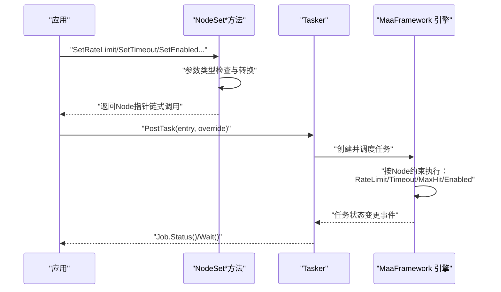
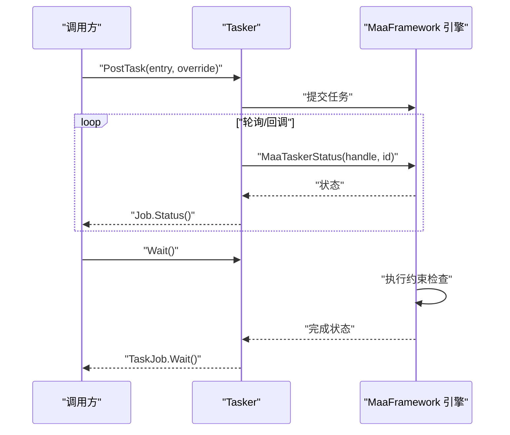
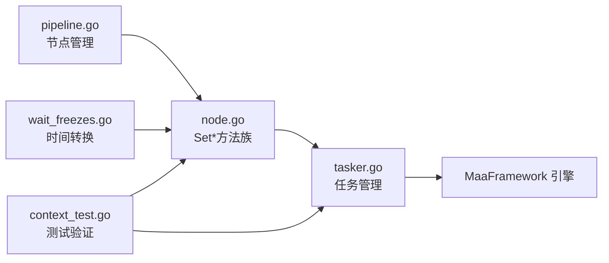

# 执行约束配置

<cite>
**本文引用的文件**
- [node.go](file://node.go)
- [pipeline.go](file://pipeline.go)
- [tasker.go](file://tasker.go)
- [context_test.go](file://context_test.go)
- [wait_freezes.go](file://wait_freezes.go)
- [CHANGELOG.md](file://CHANGELOG.md)
</cite>

## 更新摘要
**所做更改**
- 更新了执行约束配置的API设计说明，反映从functional options模式向直接参数设置模式的现代化转变
- 新增了Set*方法族的详细说明和使用示例
- 更新了参数类型和默认值的描述
- 增强了类型安全性和易用性的说明
- 添加了现代化API设计的最佳实践建议

## 目录
1. [简介](#简介)
2. [现代化API设计](#现代化api设计)
3. [核心组件](#核心组件)
4. [架构总览](#架构总览)
5. [详细组件分析](#详细组件分析)
6. [依赖关系分析](#依赖关系分析)
7. [性能考量](#性能考量)
8. [故障排查指南](#故障排查指南)
9. [结论](#结论)
10. [附录：最佳实践与调优建议](#附录最佳实践与调优建议)

## 简介
本篇文档聚焦于流水线节点的"执行约束配置"，即 RateLimit（识别间隔）、Timeout（识别超时）、MaxHit（最大命中次数）与 Enabled（启用状态）。随着API设计的现代化升级，我们采用了直接参数设置而非functional options的方式，增强了类型安全性、易用性和开发体验。我们将从现代化的数据模型、Go绑定层到底层原生库的调用链路进行系统性解析，并结合测试用例说明这些约束如何影响节点的识别与动作执行行为。

## 现代化API设计
**更新** API设计已从传统的functional options模式升级为直接参数设置模式，提供更好的类型安全性和开发体验。

### API设计变更概述
- **传统模式**：使用With*方法（如WithRateLimit、WithTimeout）
- **现代模式**：使用Set*方法（如SetRateLimit、SetTimeout）
- **类型安全**：直接参数类型检查，编译时错误检测
- **易用性**：链式调用支持，方法返回Node指针便于连续设置

### 现代化优势
- **编译时类型检查**：参数类型错误在编译阶段即可发现
- **IDE智能提示**：完整的参数类型信息支持自动补全
- **链式调用**：方法返回Node指针，支持流畅的API调用
- **默认值管理**：更清晰的默认值处理机制

**章节来源**
- [node.go](file://node.go#L99-L143)
- [CHANGELOG.md](file://CHANGELOG.md#L1-L11)

## 核心组件
**更新** 核心组件现采用现代化的直接参数设置模式。

### Node执行约束字段
- **RateLimit**：最小识别间隔（毫秒），用于控制识别频率，避免过于频繁的截图/识别
- **Timeout**：识别等待的最大时间（毫秒），防止识别过程卡死或阻塞  
- **MaxHit**：节点最大命中次数，达到后通常不再继续匹配该节点
- **Enabled**：节点是否启用，true表示激活，false表示跳过
- **PreDelay/PostDelay**：动作执行前后的延迟时间（毫秒）
- **Repeat**：重复执行次数，默认1次
- **Inverse**：是否反转识别结果，默认false

### 现代化Set*方法族
- **SetRateLimit(rateLimit time.Duration)**：设置识别间隔
- **SetTimeout(timeout time.Duration)**：设置识别超时
- **SetEnabled(enabled bool)**：设置启用状态
- **SetMaxHit(maxHit uint64)**：设置最大命中次数
- **SetPreDelay/preDelay time.Duration)**：设置动作前延迟
- **SetPostDelay(postDelay time.Duration)**：设置动作后延迟
- **SetRepeat(repeat uint64)**：设置重复次数
- **SetInverse(inverse bool)**：设置结果反转

### 任务执行与查询
- **Tasker.PostTask**：提交任务，返回TaskJob；通过状态查询与等待完成
- **Job/TaskJob**：提供Status()/Wait()/Success()/Failure()/Done()等便捷方法
- **Pipeline**：提供AddNode/RemoveNode/Clear/Len等节点管理功能

**章节来源**
- [node.go](file://node.go#L10-L52)
- [node.go](file://node.go#L99-L143)
- [tasker.go](file://tasker.go#L111-L115)

## 架构总览
**更新** 架构图反映了现代化API设计下的执行流程。



**图表来源**
- [node.go](file://node.go#L99-L143)
- [tasker.go](file://tasker.go#L111-L115)

## 详细组件分析

### Node执行约束字段与现代化设置方法
**更新** 详细说明了现代化的Set*方法族及其使用方式。

#### 字段定义与默认值
- **RateLimit**：最小识别间隔（毫秒），默认1000ms
- **Timeout**：识别等待最大时间（毫秒），默认20000ms
- **MaxHit**：最大命中次数，默认不限制
- **Enabled**：是否启用，默认true
- **PreDelay/PostDelay**：动作前后延迟，默认200ms
- **Repeat**：重复次数，默认1次
- **Inverse**：结果反转，默认false

#### 现代化设置方法
- **SetRateLimit(rateLimit time.Duration)**：设置识别间隔，参数为time.Duration类型
- **SetTimeout(timeout time.Duration)**：设置超时时间，参数为time.Duration类型
- **SetEnabled(enabled bool)**：设置启用状态，参数为bool类型
- **SetMaxHit(maxHit uint64)**：设置最大命中次数，参数为uint64类型
- **SetPreDelay/preDelay time.Duration)**：设置动作前延迟
- **SetPostDelay(postDelay time.Duration)**：设置动作后延迟
- **SetRepeat(repeat uint64)**：设置重复次数
- **SetInverse(inverse bool)**：设置结果反转

#### 语义说明
- **RateLimit**：控制相邻两次识别尝试之间的最小间隔，避免过度扫描
- **Timeout**：单次识别最长等待时间，超过则判定失败并触发错误分支
- **MaxHit**：限制节点命中上限，到达后通常不再继续匹配
- **Enabled**：禁用节点将直接跳过，不参与识别与动作
- **PreDelay/PostDelay**：动作执行前后的精确延迟控制
- **Repeat**：支持节点的重复执行机制
- **Inverse**：支持识别结果的逻辑反转

**章节来源**
- [node.go](file://node.go#L10-L52)
- [node.go](file://node.go#L99-L143)
- [context_test.go](file://context_test.go#L1194-L1209)

### 任务提交与状态查询
**更新** 任务执行流程保持不变，但Node配置更加直观。

#### Tasker.PostTask
- 支持传入pipeline覆盖参数（override）
- 返回TaskJob，可通过Wait()获取最终状态
- 支持多种覆盖参数格式：JSON字符串、[]byte、任意JSON可序列化值

#### Job/TaskJob
- 提供Status()/Wait()/Success()/Failure()/Done()等便捷方法
- 新增Error()方法用于检查任务创建阶段的错误
- 支持任务详情查询和节点详情获取

#### 原生函数
- MaaTaskerPostTask/MaaTaskerStatus/MaaTaskerWait等底层函数保持不变



**图表来源**
- [tasker.go](file://tasker.go#L111-L115)
- [tasker.go](file://tasker.go#L162-L169)

**章节来源**
- [tasker.go](file://tasker.go#L111-L115)
- [tasker.go](file://tasker.go#L162-L169)

### 约束对节点执行行为的影响
**更新** 约束机制保持一致，但配置方式更加直观。

#### RateLimit如何控制识别频率
- 在同一节点的连续识别之间施加最小间隔，降低CPU/GPU与截图压力
- 适用于高频匹配场景（如反复检测某个按钮）
- 现代化配置：`node.SetRateLimit(500 * time.Millisecond)`

#### Timeout如何防止任务卡死
- 若识别长时间无结果或阻塞，超时后触发错误处理链（OnError）
- 有助于避免无限等待导致的资源占用
- 现代化配置：`node.SetTimeout(30 * time.Second)`

#### MaxHit如何限制节点执行次数
- 达到上限后通常不再继续匹配该节点，避免重复执行
- 适合"只做一次"的动作或"到达目标后停止"的节点
- 现代化配置：`node.SetMaxHit(1)`

#### Enabled启用状态
- false时节点被跳过，不参与识别与动作
- 适合临时禁用某些节点而不删除配置
- 现代化配置：`node.SetEnabled(true/false)`

#### PreDelay/PostDelay时序控制
- 精确控制动作执行前后的延迟时间
- 支持毫秒级精度的时间控制
- 现代化配置：`node.SetPreDelay(100 * time.Millisecond)`

#### Repeat重复执行机制
- 支持节点的重复执行
- 结合RepeatDelay控制重复间隔
- 现代化配置：`node.SetRepeat(3)`

**章节来源**
- [node.go](file://node.go#L10-L52)
- [context_test.go](file://context_test.go#L1194-L1223)

### 实际案例与验证
**更新** 测试用例验证了现代化API的正确性。

#### 测试用例覆盖
- 断言RateLimit/Timeout/Enabled/MaxHit等字段被正确读取
- 断言PreDelay/PostDelay/WaitFreezes等其他时序参数也被正确读取
- 验证Set*方法的链式调用支持
- 测试时间参数的毫秒转换正确性

#### 用法要点
- 使用Set*方法为Node配置约束
- 通过OverridePipeline或PostTask的override参数动态调整节点约束
- 使用Job/TaskJob的Wait()/Status()观察执行结果与耗时
- 利用链式调用简化配置代码

**章节来源**
- [context_test.go](file://context_test.go#L1191-L1230)

### 与原生引擎的关系
**更新** 原生引擎保持不变，Go层提供现代化的API包装。

#### Go层职责
- 参数封装与类型转换（time.Duration到毫秒）
- 状态查询与任务管理
- 现代化的API设计和错误处理

#### 原生引擎职责
- 具体的识别、动作执行与约束落地
- 与底层MaaFramework库的直接交互
- 跨平台兼容性的保证

#### 类型转换机制
- Set*方法内部自动将time.Duration转换为毫秒整数
- JSON序列化时自动处理时间类型的转换
- 保持与原生引擎期望的数据格式一致

**章节来源**
- [node.go](file://node.go#L99-L143)
- [wait_freezes.go](file://wait_freezes.go#L31-L61)

## 依赖关系分析
**更新** 依赖关系反映了现代化API设计的影响。

### Go层依赖
- **node.go**：定义现代化的Node结构体和Set*方法族
- **tasker.go**：封装任务提交与状态查询，支持多种覆盖参数格式
- **pipeline.go**：提供Pipeline管理功能，支持节点的添加、删除、清空等操作
- **wait_freezes.go**：处理WaitFreezesParam的时间类型转换

### 测试依赖
- **context_test.go**：通过OverridePipeline与GetNodeData验证约束字段读取
- 测试覆盖Set*方法的正确性和时间参数转换

### 外部依赖
- **MaaFramework库**：底层识别引擎，保持向后兼容
- **purego**：用于注册原生函数，保证跨平台兼容



**图表来源**
- [node.go](file://node.go#L99-L143)
- [tasker.go](file://tasker.go#L111-L115)
- [pipeline.go](file://pipeline.go#L37-L70)
- [wait_freezes.go](file://wait_freezes.go#L31-L61)
- [context_test.go](file://context_test.go#L1191-L1230)

**章节来源**
- [node.go](file://node.go#L99-L143)
- [tasker.go](file://tasker.go#L111-L115)
- [pipeline.go](file://pipeline.go#L37-L70)
- [context_test.go](file://context_test.go#L1191-L1230)

## 性能考量
**更新** 性能考量基于现代化API设计的优势。

### RateLimit优化
- **过短**：会导致频繁截图/识别，CPU/GPU占用上升
- **过长**：会降低响应速度，影响交互体验
- **建议**：默认1000ms，复杂界面可适当提高；高频按钮可降低至200~500ms
- **现代化优势**：编译时类型检查确保参数正确性

### Timeout调优
- **过短**：可能误判成功，过长导致资源占用与延迟增加
- **过长**：可能导致任务长时间挂起
- **建议**：默认20000ms，简单目标可降至5000~10000ms；复杂OCR/模板匹配可提升至30000ms+
- **现代化优势**：time.Duration类型提供更好的时间表达能力

### MaxHit控制
- **一次性动作**：设为1，避免重复执行
- **循环检测节点**：设为较大值或不限制，配合Enabled退出
- **现代化优势**：uint64类型支持更大的命中次数限制

### Enabled动态控制
- **临时禁用**：优先使用Enabled，避免删除配置
- **动态开关**：快速禁用不稳定节点，避免影响整体流程
- **现代化优势**：布尔类型检查确保逻辑正确性

### 并发与事件回调
- 利用AddSink/AddContextSink订阅事件，监控识别命中计数与节点状态变化
- 现代化API提供更好的错误处理和状态查询能力

## 故障排查指南
**更新** 故障排查指南基于现代化API设计的特点。

### 识别长时间无响应
- **检查Timeout是否过小或过大**
- **关注OnError分支是否被触发**
- **现代化排查**：利用Set*方法的链式调用和类型检查快速定位问题

### 识别过于频繁导致卡顿
- **提高RateLimit**，减少截图频率
- **现代化配置**：`node.SetRateLimit(1 * time.Second)`确保合理的识别间隔

### 动作重复执行
- **设置MaxHit或在命中后将Enabled设为false**
- **现代化控制**：`node.SetMaxHit(1).SetEnabled(false)`实现一次性动作

### 任务迟迟不结束
- **使用Job.Wait()观察最终状态**
- **现代化检查**：`job.Error()`获取任务创建阶段的具体错误信息
- **必要时使用PostStop停止任务**

### 时间参数配置错误
- **检查time.Duration到毫秒的转换**
- **现代化优势**：编译时类型检查避免常见的时间配置错误

**章节来源**
- [tasker.go](file://tasker.go#L111-L115)
- [node.go](file://node.go#L99-L143)

## 结论
**更新** 结论强调现代化API设计带来的改进。

执行约束配置是保障流水线稳定与高效运行的关键。通过现代化的直接参数设置API（Set*方法），开发者获得了更好的类型安全性、编译时错误检测和开发体验。相比传统的functional options模式，现代化API提供了：

- **更强的类型安全**：编译时参数类型检查
- **更好的开发体验**：链式调用支持和完整的IDE智能提示
- **更清晰的API设计**：直接参数设置，语义更加明确
- **更高的可靠性**：减少运行时类型转换错误

结合Job/TaskJob的状态查询与事件订阅，可以更有效地定位问题并优化流程。现代化的API设计为未来的扩展和维护奠定了坚实的基础。

## 附录：最佳实践与调优建议
**更新** 最佳实践基于现代化API设计的特点。

### 基础配置建议
- **RateLimit**：默认1000ms，复杂界面可适当提高；高频按钮可降低至200~500ms
- **Timeout**：默认20000ms，简单目标可降至5000~10000ms；复杂OCR/模板匹配可提升至30000ms+
- **MaxHit**：一次性动作设为1；循环检测节点设为较大值或不限制，配合Enabled退出
- **Enabled**：临时禁用节点优先使用Enabled，避免删除配置

### 现代化API使用建议
- **链式调用**：充分利用Set*方法的链式调用特性
  ```go
  node := maa.NewNode("example").
      SetRateLimit(500*time.Millisecond).
      SetTimeout(30*time.Second).
      SetMaxHit(1).
      SetEnabled(true)
  ```
- **类型安全**：使用time.Duration类型确保时间参数的准确性
- **默认值管理**：未设置的字段将使用默认值，无需手动设置

### 场景化配置建议
- **登录/启动流程**：Timeout适中，MaxHit1，Enabled动态切换
- **高频点击**：RateLimit适中，Timeout适中，MaxHit1
- **OCR文字识别**：Timeout偏大，RateLimit适中，MaxHit1
- **模板匹配**：根据模板数量与算法选择RateLimit/Timeout，MaxHit1

### 监控与调试
- **使用Tasker.AddSink/Tasker.AddContextSink订阅事件**，观察命中计数与节点状态
- **通过Tasker.GetTaskDetail/GetNodeDetail获取实时执行细节**
- **使用Job.Wait()/Status()观察任务生命周期与最终状态**
- **现代化错误处理**：利用job.Error()获取详细的错误信息

### API迁移指南
对于从传统API迁移到现代化API的用户：
1. **替换With*方法**：`WithRateLimit()` → `SetRateLimit()`
2. **保持参数类型**：time.Duration类型保持不变
3. **利用链式调用**：享受更好的代码可读性
4. **编译时检查**：利用类型系统提前发现配置错误