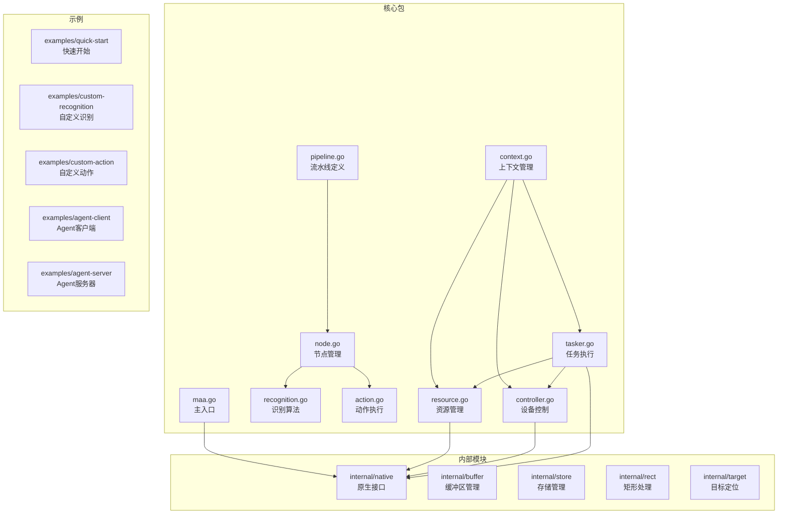
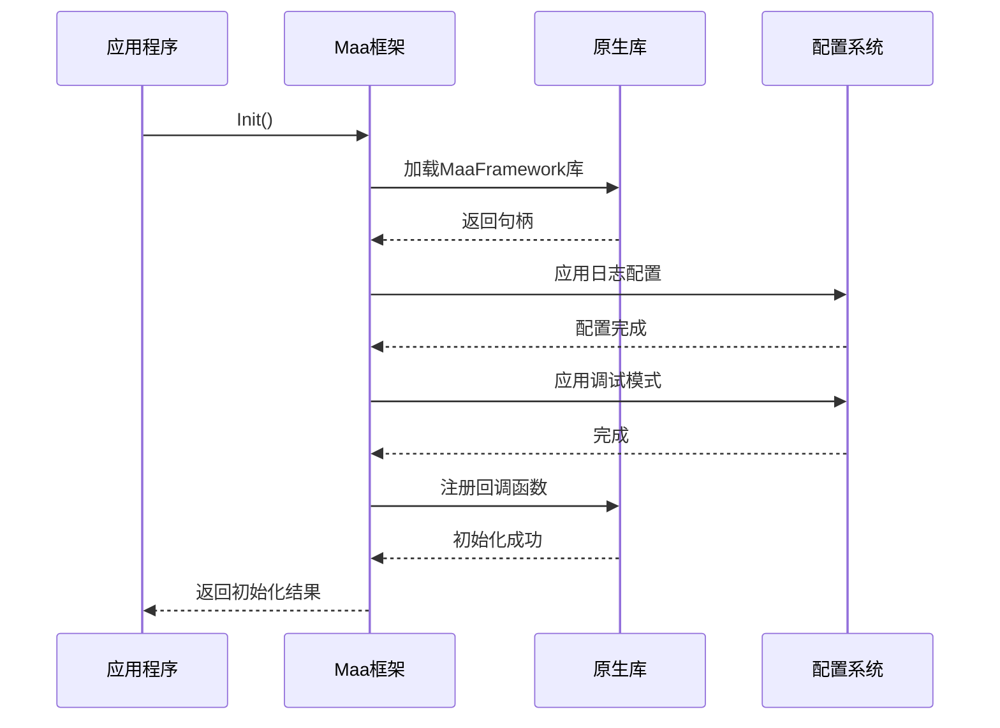
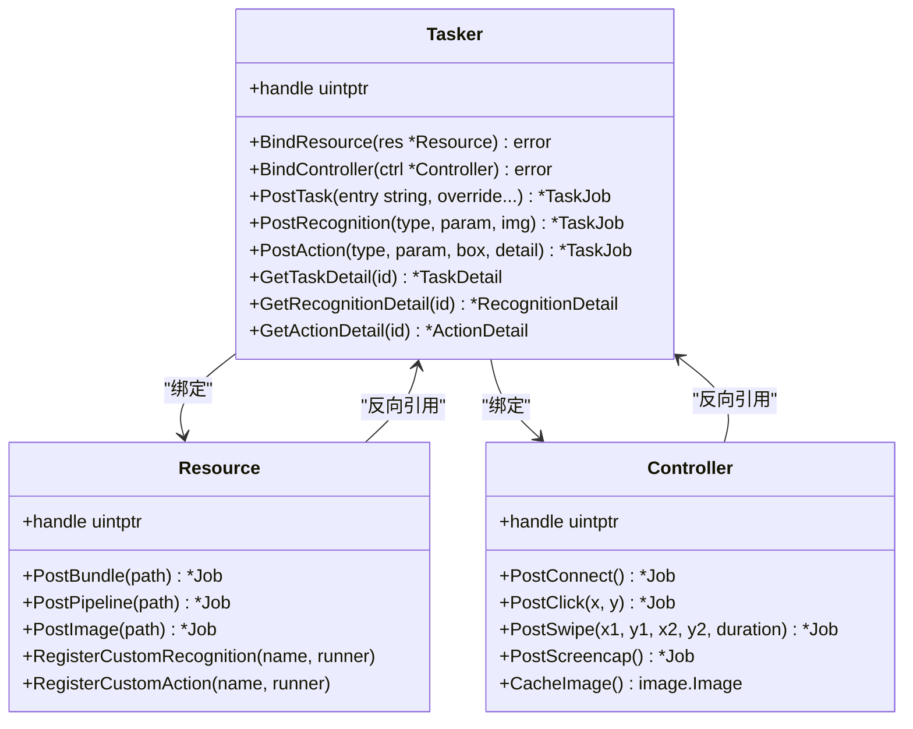
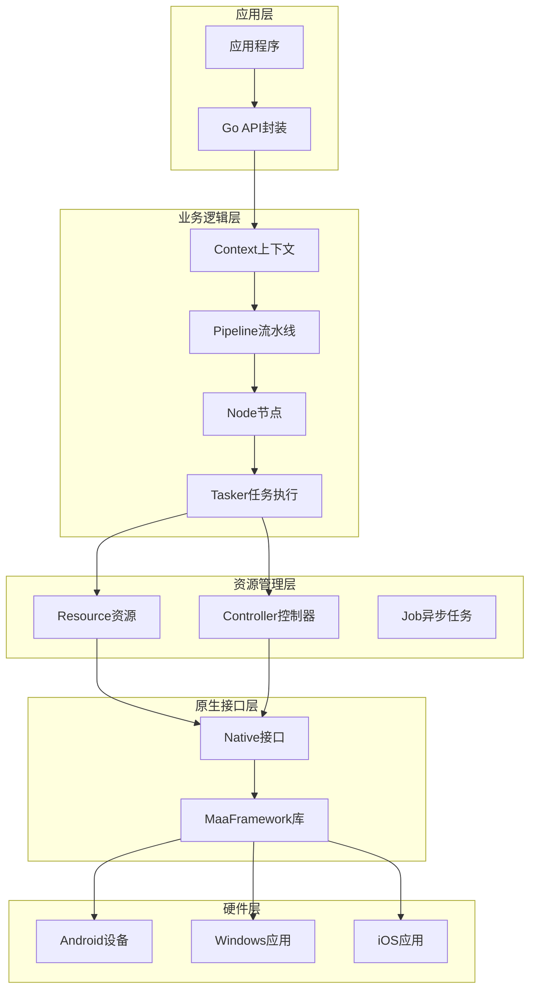
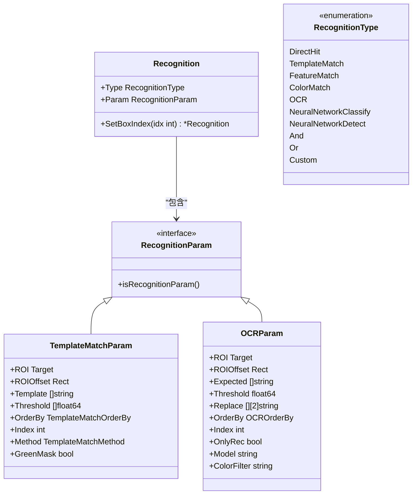
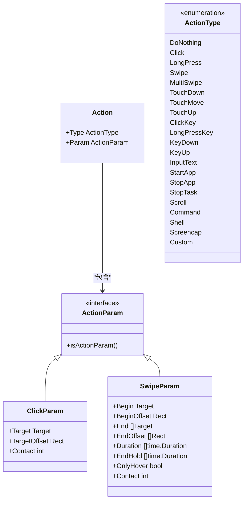
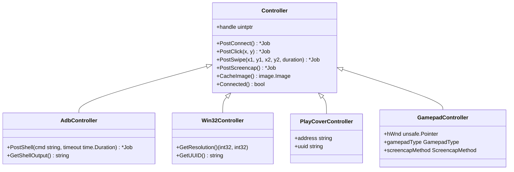
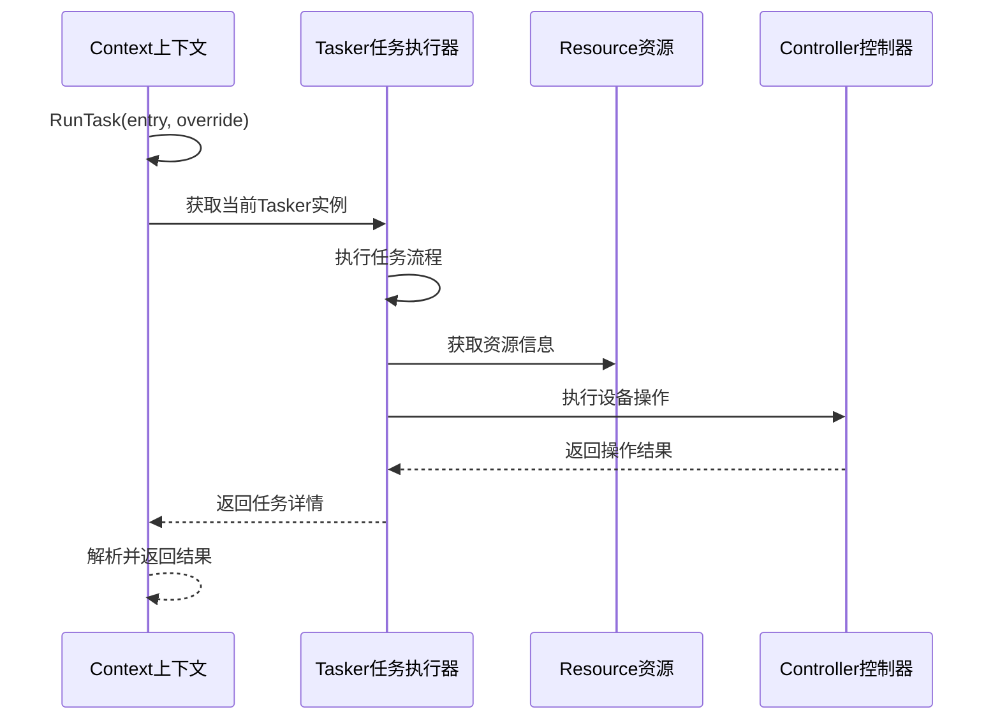
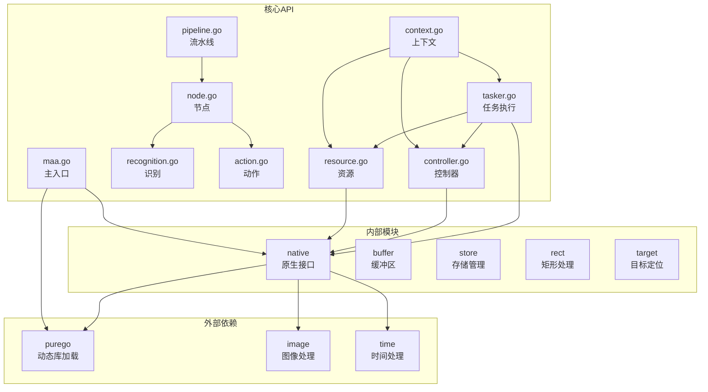

# 统一识别系统

<cite>
**本文档引用的文件**
- [README.md](file://README.md)
- [README_zh.md](file://README_zh.md)
- [maa.go](file://maa.go)
- [context.go](file://context.go)
- [pipeline.go](file://pipeline.go)
- [recognition.go](file://recognition.go)
- [action.go](file://action.go)
- [controller.go](file://controller.go)
- [tasker.go](file://tasker.go)
- [node.go](file://node.go)
- [resource.go](file://resource.go)
- [internal/native/framework.go](file://internal/native/framework.go)
- [examples/quick-start/main.go](file://examples/quick-start/main.go)
- [examples/custom-recognition/main.go](file://examples/custom-recognition/main.go)
- [examples/custom-action/main.go](file://examples/custom-action/main.go)
</cite>

## 目录
1. [简介](#简介)
2. [项目结构](#项目结构)
3. [核心组件](#核心组件)
4. [架构概览](#架构概览)
5. [详细组件分析](#详细组件分析)
6. [依赖关系分析](#依赖关系分析)
7. [性能考虑](#性能考虑)
8. [故障排除指南](#故障排除指南)
9. [结论](#结论)

## 简介

统一识别系统是一个基于图像识别的跨平台自动化测试框架，提供纯Go实现的MaaFramework绑定。该系统支持多种设备控制方式（Android ADB、Windows桌面、iOS通过PlayCover、虚拟手柄），集成了丰富的图像识别算法（模板匹配、OCR、特征检测、神经网络分类和检测），并提供了灵活的流水线驱动架构。

系统的核心特性包括：
- **多平台支持**：支持Windows、Linux、macOS等多个操作系统
- **多设备控制**：ADB控制器、Win32控制器、PlayCover控制器、虚拟手柄控制器
- **丰富识别算法**：模板匹配、OCR、特征检测、颜色匹配、神经网络识别等
- **自定义扩展**：支持自定义识别和动作处理器
- **Agent架构**：支持从外部进程挂载自定义识别和动作
- **流水线驱动**：基于JSON配置的声明式任务流

## 项目结构



**图表来源**
- [maa.go](file://maa.go#L1-L322)
- [context.go](file://context.go#L1-L506)
- [pipeline.go](file://pipeline.go#L1-L67)
- [node.go](file://node.go#L1-L343)

**章节来源**
- [README.md](file://README.md#L36-L51)
- [README_zh.md](file://README_zh.md#L36-L51)

## 核心组件

### 初始化与配置系统

初始化系统是整个框架的基础，负责加载动态库并配置全局参数：



**图表来源**
- [maa.go](file://maa.go#L146-L209)
- [internal/native/framework.go](file://internal/native/framework.go#L339-L357)

### 任务执行引擎

任务执行引擎是系统的核心协调器，负责管理资源、控制器和执行任务流程：



**图表来源**
- [tasker.go](file://tasker.go#L14-L78)
- [resource.go](file://resource.go#L14-L41)
- [controller.go](file://controller.go#L26-L54)

**章节来源**
- [maa.go](file://maa.go#L143-L231)
- [tasker.go](file://tasker.go#L14-L78)
- [resource.go](file://resource.go#L14-L41)

## 架构概览

统一识别系统采用分层架构设计，从底层的原生库接口到高层的应用编程接口形成了清晰的抽象层次：



**图表来源**
- [internal/native/framework.go](file://internal/native/framework.go#L1-L542)
- [context.go](file://context.go#L13-L17)
- [tasker.go](file://tasker.go#L14-L18)

## 详细组件分析

### 识别算法系统

识别算法系统提供了多种图像识别方法，每种算法都有其特定的应用场景和参数配置：



**图表来源**
- [recognition.go](file://recognition.go#L10-L89)
- [recognition.go](file://recognition.go#L143-L174)
- [recognition.go](file://recognition.go#L312-L349)

#### OCR识别算法详解

OCR（光学字符识别）算法是系统中最复杂的识别算法之一，支持多种配置选项：

| 参数 | 类型 | 描述 | 默认值 |
|------|------|------|--------|
| ROI | Target | 识别区域 | 整个屏幕 |
| ROIOffset | Rect | ROI偏移量 | 无偏移 |
| Expected | []string | 期望文本结果 | 空数组 |
| Threshold | float64 | 模型置信度阈值 | 0.3 |
| Replace | [][2]string | 文本替换规则 | 无替换 |
| OrderBy | OCROrderBy | 结果排序方式 | Horizontal |
| Index | int | 选择第几个结果 | 0 |
| OnlyRec | bool | 仅识别模式 | false |
| Model | string | 模型文件夹路径 | 系统默认 |
| ColorFilter | string | 颜色过滤器名称 | 无过滤 |

**章节来源**
- [recognition.go](file://recognition.go#L300-L350)

### 动作执行系统

动作执行系统负责将识别结果转换为具体的设备操作，支持多种输入设备和操作类型：



**图表来源**
- [action.go](file://action.go#L10-L86)
- [action.go](file://action.go#L133-L149)
- [action.go](file://action.go#L194-L251)

#### 多点触控手势支持

系统支持复杂的多点触控手势，通过MultiSwipeParam实现：

| 参数 | 类型 | 描述 | 默认值 |
|------|------|------|--------|
| Swipes | []MultiSwipeItem | 触控项列表 | 必需参数 |
| Starting | time.Duration | 开始时间 | 0ms |
| Begin | Target | 起始位置 | 必需参数 |
| BeginOffset | Rect | 起始偏移量 | 无偏移 |
| End | []Target | 结束位置数组 | 必需参数 |
| EndOffset | []Rect | 结束偏移量数组 | 无偏移 |
| Duration | []time.Duration | 持续时间数组 | 200ms |
| EndHold | []time.Duration | 结束保持时间 | 0ms |
| OnlyHover | bool | 悬停模式 | false |
| Contact | int | 触控点标识 | 使用数组索引 |

**章节来源**
- [action.go](file://action.go#L253-L347)

### 设备控制器系统

设备控制器系统提供了对不同设备类型的统一抽象，支持多种控制方式：



**图表来源**
- [controller.go](file://controller.go#L26-L94)
- [controller.go](file://controller.go#L31-L70)
- [controller.go](file://controller.go#L72-L94)

#### 截图选项配置

系统提供了灵活的截图配置选项，支持不同的缩放策略：

| 选项 | 描述 | 使用场景 |
|------|------|----------|
| WithScreenshotTargetLongSide | 设置长边目标尺寸 | 保持纵横比，自动计算短边 |
| WithScreenshotTargetShortSide | 设置短边目标尺寸 | 保持纵横比，自动计算长边 |
| WithScreenshotUseRawSize | 使用原始分辨率 | 不进行缩放，直接使用设备分辨率 |

**章节来源**
- [controller.go](file://controller.go#L218-L289)

### 上下文管理系统

上下文管理系统为自定义识别和动作提供了运行时环境，支持任务、识别、动作的嵌套执行：



**图表来源**
- [context.go](file://context.go#L57-L64)
- [context.go](file://context.go#L97-L112)
- [context.go](file://context.go#L149-L171)

**章节来源**
- [context.go](file://context.go#L13-L506)

## 依赖关系分析

系统采用模块化设计，各组件之间的依赖关系清晰明确：



**图表来源**
- [internal/native/framework.go](file://internal/native/framework.go#L1-L11)
- [maa.go](file://maa.go#L3-L8)
- [context.go](file://context.go#L3-L11)

**章节来源**
- [internal/native/framework.go](file://internal/native/framework.go#L1-L542)

## 性能考虑

### 缓存机制

系统实现了多层次的缓存机制以提高性能：

1. **识别图像缓存**：通过`SetRecoImageCacheLimit`设置缓存大小，默认4096
2. **绘制结果缓存**：支持保存调试绘制结果用于问题排查
3. **任务状态缓存**：避免重复查询相同的状态信息

### 异步处理

所有I/O密集型操作都采用异步处理模式：

- **Job系统**：所有长时间运行的操作返回Job对象
- **事件回调**：通过回调机制通知操作完成状态
- **批量处理**：支持多个操作的并发执行

### 内存管理

系统采用智能的内存管理策略：

- **缓冲区复用**：重用图像和字符串缓冲区减少内存分配
- **延迟加载**：资源按需加载，避免不必要的内存占用
- **自动清理**：组件销毁时自动释放相关资源

## 故障排除指南

### 常见初始化错误

| 错误类型 | 可能原因 | 解决方案 |
|----------|----------|----------|
| ErrAlreadyInitialized | 重复调用Init() | 确保只初始化一次 |
| ErrNotInitialized | 未调用Init()就使用API | 在使用任何API前调用Init() |
| LibraryLoadError | 动态库加载失败 | 检查库文件路径和权限 |
| ErrSetLogDir | 日志目录设置失败 | 确保目录存在且可写 |

### 调试模式启用

系统提供了完整的调试支持：

```go
// 启用调试模式
maa.SetDebugMode(true)

// 设置日志级别
maa.SetStdoutLevel(maa.LoggingLevelDebug)

// 启用绘制保存
maa.SetSaveDraw(true)

// 设置绘制质量
maa.SetDrawQuality(95)
```

### 性能优化建议

1. **合理设置缓存大小**：根据应用场景调整识别图像缓存限制
2. **使用合适的截图尺寸**：避免过大的截图影响处理速度
3. **批量化操作**：将多个相似操作合并执行
4. **及时清理资源**：使用完毕后及时释放资源

**章节来源**
- [maa.go](file://maa.go#L10-L321)

## 结论

统一识别系统通过其模块化的设计和丰富的功能特性，为跨平台自动化测试提供了强大的解决方案。系统的核心优势包括：

1. **高度抽象的API设计**：通过清晰的接口抽象，简化了复杂设备控制和图像识别的使用
2. **灵活的扩展机制**：支持自定义识别和动作处理器，满足特殊需求
3. **完善的错误处理**：提供了详细的错误信息和调试支持
4. **优秀的性能表现**：通过缓存机制和异步处理确保高效运行

该系统特别适用于需要跨平台、多设备支持的自动化测试场景，为开发者提供了从简单到复杂的完整解决方案。随着功能的不断完善和社区的持续贡献，统一识别系统必将成为自动化测试领域的重要工具。