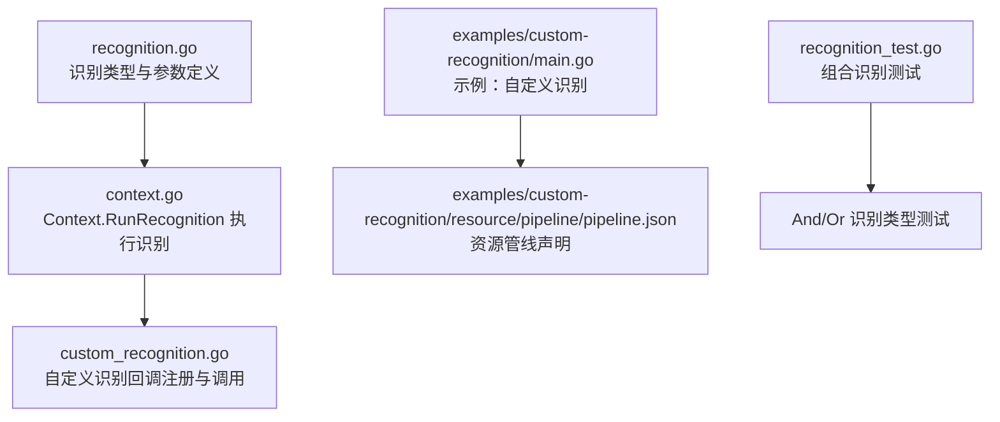
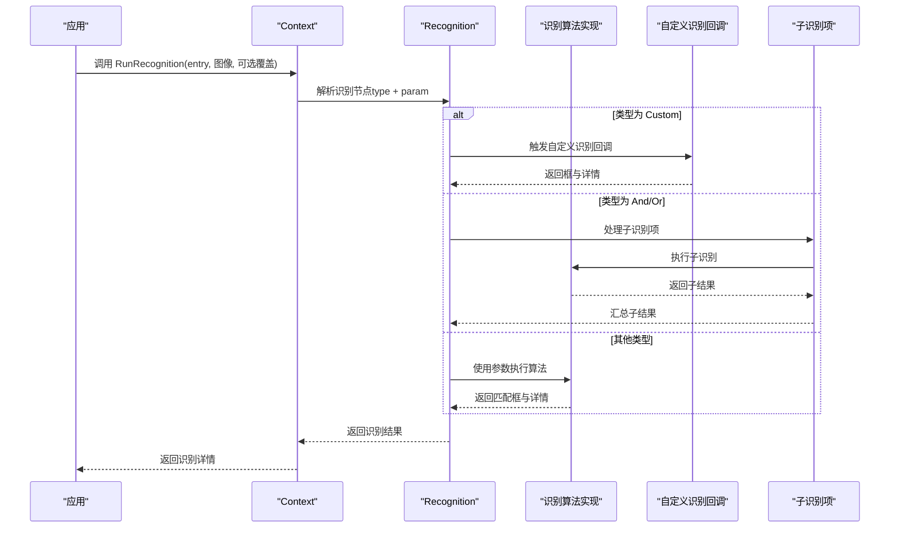
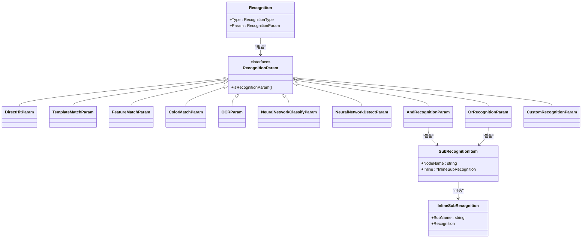

# 识别系统配置

<cite>
**本文引用的文件列表**
- [recognition.go](file://recognition.go)
- [context.go](file://context.go)
- [custom_recognition.go](file://custom_recognition.go)
- [examples/custom-recognition/main.go](file://examples/custom-recognition/main.go)
- [examples/custom-recognition/resource/pipeline/pipeline.json](file://examples/custom-recognition/resource/pipeline/pipeline.json)
- [recognition_test.go](file://recognition_test.go)
- [README.md](file://README.md)
</cite>

## 更新摘要
**变更内容**
- 新增 DirectHit 直接命中识别类型，用于总是成功的识别场景
- 新增 And/Or 组合识别类型，支持复杂的逻辑组合
- 增强了识别参数的类型安全性，所有参数类型都有专门的类型别名
- 改进了 API 设计的一致性和易用性
- 新增子识别项引用机制，支持节点名称引用和内联识别
- 优化了识别参数的深拷贝机制，避免共享底层数组

## 目录
1. [简介](#简介)
2. [项目结构与入口](#项目结构与入口)
3. [核心组件总览](#核心组件总览)
4. [架构概览](#架构概览)
5. [详细组件分析](#详细组件分析)
6. [依赖关系分析](#依赖关系分析)
7. [性能与资源权衡](#性能与资源权衡)
8. [故障排查指南](#故障排查指南)
9. [结论](#结论)
10. [附录：参数与使用示例路径](#附录参数与使用示例路径)

## 简介
本文件面向希望在MaaFramework Go绑定中进行图像识别的开发者，系统性解析识别系统配置及其支持的识别算法族，包括DirectHit（直接命中）、TemplateMatch（模板匹配）、FeatureMatch（特征匹配）、ColorMatch（颜色匹配）、OCR（光学字符识别）、NeuralNetworkClassify（神经网络分类）、NeuralNetworkDetect（神经网络检测）、And（逻辑与）和Or（逻辑或）以及Custom（自定义识别）。文档将从数据结构、参数含义、使用方式、适用场景、性能与资源消耗权衡等方面进行深入说明，并提供可直接定位到源码的示例路径，帮助快速上手。

## 项目结构与入口
- 识别配置的核心定义位于recognition.go，包含Recognition类型、各类识别参数结构体、以及对应的构造函数（如RecTemplateMatch、RecFeatureMatch、RecOCR、RecColorMatch、RecNeuralNetworkClassify、RecNeuralNetworkDetect、RecCustom、RecAnd、RecOr、RecDirectHit）。
- 运行时上下文与识别执行由context.go提供，Context.RunRecognition用于对给定图像运行识别节点。
- 自定义识别回调机制由custom_recognition.go提供，支持注册自定义识别器并在任务流中调用。
- 示例工程展示了如何在资源管线中声明识别节点，以及如何在自定义识别中复用Context能力。

**图表来源**
- [recognition.go](file://recognition.go#L10-L122)
- [context.go](file://context.go#L78-L128)
- [custom_recognition.go](file://custom_recognition.go#L17-L100)
- [examples/custom-recognition/main.go](file://examples/custom-recognition/main.go#L1-L107)
- [examples/custom-recognition/resource/pipeline/pipeline.json](file://examples/custom-recognition/resource/pipeline/pipeline.json#L1-L12)
- [recognition_test.go](file://recognition_test.go#L60-L153)

**章节来源**
- [README.md](file://README.md#L27-L40)
- [recognition.go](file://recognition.go#L10-L122)
- [context.go](file://context.go#L78-L128)
- [custom_recognition.go](file://custom_recognition.go#L17-L100)
- [examples/custom-recognition/main.go](file://examples/custom-recognition/main.go#L1-L107)
- [examples/custom-recognition/resource/pipeline/pipeline.json](file://examples/custom-recognition/resource/pipeline/pipeline.json#L1-L12)
- [recognition_test.go](file://recognition_test.go#L60-L153)

## 核心组件总览
- Recognition：识别节点的统一抽象，包含识别类型与参数。
- RecognitionType：枚举所有可用的识别算法类型，包括DirectHit、TemplateMatch、FeatureMatch、ColorMatch、OCR、NeuralNetworkClassify、NeuralNetworkDetect、And、Or、Custom等类型。
- RecognitionParam接口及各算法参数结构体：封装对应算法所需的全部配置项，所有参数类型都实现RecognitionParam接口。
- 构造函数族：RecTemplateMatch、RecFeatureMatch、RecOCR、RecColorMatch、RecNeuralNetworkClassify、RecNeuralNetworkDetect、RecCustom、RecAnd、RecOr、RecDirectHit，用于便捷构建识别节点。
- Context.RunRecognition：在给定图像上执行识别节点，返回识别结果详情。
- 子识别项机制：支持Ref（节点名称引用）和Inline（内联识别）两种子识别项形式。

**更新** 新增了DirectHit和组合识别类型，增强了API的一致性和类型安全性。

**章节来源**
- [recognition.go](file://recognition.go#L10-L122)
- [recognition.go](file://recognition.go#L75-L89)
- [recognition.go](file://recognition.go#L91-L94)
- [recognition.go](file://recognition.go#L110-L122)
- [recognition.go](file://recognition.go#L165-L174)
- [recognition.go](file://recognition.go#L222-L231)
- [recognition.go](file://recognition.go#L339-L349)
- [recognition.go](file://recognition.go#L289-L298)
- [recognition.go](file://recognition.go#L382-L392)
- [recognition.go](file://recognition.go#L426-L436)
- [recognition.go](file://recognition.go#L541-L547)
- [recognition.go](file://recognition.go#L557-L566)
- [recognition.go](file://recognition.go#L116-L122)
- [context.go](file://context.go#L78-L128)

## 架构概览
下图展示了识别配置在运行时的调用链路：应用通过Context.RunRecognition触发识别；识别节点根据Recognition.Type选择对应算法；算法参数由Recognition.Param提供；对于Custom类型，会回调已注册的自定义识别器；对于And/Or类型，会处理子识别项的组合逻辑。

**图表来源**
- [context.go](file://context.go#L78-L128)
- [recognition.go](file://recognition.go#L10-L122)
- [custom_recognition.go](file://custom_recognition.go#L56-L100)
- [recognition.go](file://recognition.go#L438-L566)

## 详细组件分析

### Recognition与识别类型
- Recognition：包含识别类型与参数两部分，通过UnmarshalJSON按类型动态反序列化参数对象。
- RecognitionType：包含DirectHit、TemplateMatch、FeatureMatch、ColorMatch、OCR、NeuralNetworkClassify、NeuralNetworkDetect、And、Or、Custom等类型。
- RecognitionParam：识别参数接口，所有算法参数结构体实现该接口，确保类型安全和统一的API设计。

**更新** 新增DirectHit类型用于总是成功的识别场景，And/Or类型支持复杂的逻辑组合。

**章节来源**
- [recognition.go](file://recognition.go#L10-L122)
- [recognition.go](file://recognition.go#L75-L89)
- [recognition.go](file://recognition.go#L91-L94)

### DirectHit（直接命中）
- 参数结构：DirectHitParam，是一个空结构体，用于表示直接命中识别。
- 功能特性：DirectHit识别总是成功，不进行任何实际的图像匹配，常用于占位符或条件判断的基础节点。
- 构造函数：RecDirectHit()，创建一个总是成功的识别节点。

**使用场景**：
- 作为And/Or组合识别的基础节点
- 用于条件判断的默认成功分支
- 作为任务流程的起始节点

**章节来源**
- [recognition.go](file://recognition.go#L110-L122)
- [recognition.go](file://recognition.go#L116-L122)

### TemplateMatch（模板匹配）
- 参数结构：TemplateMatchParam，关键字段包括ROI、ROIOffset、Template、Threshold、OrderBy、Index、Method、GreenMask。
- 方法与排序：匹配方法支持SQDIFF_NORMED、CCORR_NORMED、CCOEFF_NORMED（默认更准确），排序支持Horizontal、Vertical、Score、Random。
- 构造函数：RecTemplateMatch(p TemplateMatchParam)，支持模板路径数组、阈值数组等参数。
- 使用建议：高精度场景优先使用CCOEFF_NORMED，但计算成本更高；大图搜索建议配合ROI缩小范围；GreenMask可用于透明区域遮罩，提升匹配鲁棒性。
- 性能与资源：匹配复杂度与模板数量、阈值设置相关；大模板或高分辨率图像会显著增加耗时。

**更新** 构造函数现在使用参数结构体而非多个选项函数，提供更好的类型安全性。

**章节来源**
- [recognition.go](file://recognition.go#L143-L163)
- [recognition.go](file://recognition.go#L165-L174)
- [recognition.go](file://recognition.go#L134-L141)

### FeatureMatch（特征匹配）
- 参数结构：FeatureMatchParam，关键字段包括ROI、ROIOffset、Template、Count、OrderBy、Index、Detector、Ratio、GreenMask。
- 检测器与排序：检测器支持SIFT、KAZE、AKAZE、BRISK、ORB，排序支持Horizontal、Vertical、Score、Area、Random。
- 构造函数：RecFeatureMatch(p FeatureMatchParam)，支持特征点数量阈值、匹配比阈值等参数。
- 使用建议：对透视、缩放、旋转有较强泛化需求时优先SIFT/KAZE/AKAZE；BRISK/ORB适合实时性要求高的场景；Ratio用于KNN匹配距离阈值，降低误匹配。
- 性能与资源：SIFT/KAZE/AKAZE计算量较大；BRISK/ORB更快但精度略低。

**更新** 构造函数现在使用参数结构体，支持特征点数量和匹配比阈值的精确控制。

**章节来源**
- [recognition.go](file://recognition.go#L198-L220)
- [recognition.go](file://recognition.go#L222-L231)
- [recognition.go](file://recognition.go#L187-L196)

### ColorMatch（颜色匹配）
- 参数结构：ColorMatchParam，关键字段包括ROI、ROIOffset、Method、Lower、Upper、Count、OrderBy、Index、Connected。
- 颜色空间与排序：颜色空间支持RGB、HSV、GRAY，排序支持Horizontal、Vertical、Score、Area、Random。
- 构造函数：RecColorMatch(p ColorMatchParam)，支持颜色边界二维数组、像素计数阈值等参数。
- 使用建议：Lower/Upper维度需与Method通道数一致（RGB=3，HSV=3，GRAY=1）；Connected开启后可合并连通域，适合连续颜色区域。
- 性能与资源：通道数越少、阈值越高，计算量越小；Connected会增加后处理开销。

**更新** 构造函数现在使用参数结构体，支持二维颜色边界数组的深拷贝，避免共享底层数组。

**章节来源**
- [recognition.go](file://recognition.go#L253-L275)
- [recognition.go](file://recognition.go#L289-L298)
- [recognition.go](file://recognition.go#L277-L287)

### OCR（光学字符识别）
- 参数结构：OCRParam，关键字段包括ROI、ROIOffset、Expected、Threshold、Replace、OrderBy、Index、OnlyRec、Model、ColorFilter。
- 排序与模式：排序支持Horizontal、Vertical、Area、Length、Random、Expected，OnlyRec为仅识别模式，ColorFilter用于颜色二值化。
- 构造函数：RecOCR(p OCRParam)，支持预期文本数组、替换规则二维数组等参数。
- 使用建议：Expected支持正则表达式，便于灵活匹配；Replace用于纠正常见OCR错误字符；OnlyRec适合固定位置、固定字体的稳定场景。
- 性能与资源：模型越大、阈值越低，推理时间越长；OnlyRec可显著提速。

**更新** 构造函数现在使用参数结构体，支持预期文本和替换规则的深拷贝，ColorFilter字段用于颜色预处理。

**章节来源**
- [recognition.go](file://recognition.go#L312-L337)
- [recognition.go](file://recognition.go#L339-L349)

### NeuralNetworkClassify（神经网络分类）
- 参数结构：NeuralNetworkClassifyParam，关键字段包括ROI、ROIOffset、Labels、Model、Expected、OrderBy、Index。
- 排序：排序支持Horizontal、Vertical、Score、Random、Expected。
- 构造函数：RecNeuralNetworkClassify(p NeuralNetworkClassifyParam)，支持标签数组、期望类别索引数组等参数。
- 使用建议：Labels用于调试与日志，便于定位类别名称；Expected为期望类别索引列表，用于过滤结果。
- 性能与资源：ONNX模型加载与推理带来一定内存与CPU开销；固定位置的分类通常较快。

**更新** 构造函数现在使用参数结构体，支持标签和期望类别的深拷贝。

**章节来源**
- [recognition.go](file://recognition.go#L362-L380)
- [recognition.go](file://recognition.go#L382-L392)

### NeuralNetworkDetect（神经网络检测）
- 参数结构：NeuralNetworkDetectParam，关键字段包括ROI、ROIOffset、Labels、Model、Expected、OrderBy、Index。
- 排序：排序支持Horizontal、Vertical、Score、Area、Random、Expected。
- 构造函数：RecNeuralNetworkDetect(p NeuralNetworkDetectParam)，支持标签数组、期望类别索引数组等参数。
- 使用建议：支持YOLOv8/YOLOv11 ONNX模型，适合任意位置目标检测；Expected为期望类别索引列表，用于筛选感兴趣类别。
- 性能与资源：深度学习模型推理成本较高，建议合理设置ROI与阈值以平衡准确率与速度。

**更新** 构造函数现在使用参数结构体，支持标签和期望类别的深拷贝。

**章节来源**
- [recognition.go](file://recognition.go#L406-L424)
- [recognition.go](file://recognition.go#L426-L436)

### And/Or 组合识别
- 参数结构：AndRecognitionParam和OrRecognitionParam，关键字段包括AllOf/AnyOf子识别项数组和BoxIndex。
- 子识别项机制：支持SubRecognitionItem，包含NodeName（节点名称引用）和Inline（内联识别）两种形式。
- 构造函数：RecAnd(items ...SubRecognitionItem)和RecOr(anyOf ...SubRecognitionItem)，支持混合引用和内联识别。
- 使用建议：And要求所有子识别都成功，Or要求任一子识别成功；SetBoxIndex用于指定最终框的选择。
- 性能与资源：组合识别的性能取决于子识别项的数量和复杂度。

**新增功能** 组合识别是本次现代化改进的重要组成部分，提供了强大的逻辑组合能力。

**章节来源**
- [recognition.go](file://recognition.go#L438-L530)
- [recognition.go](file://recognition.go#L532-L547)
- [recognition.go](file://recognition.go#L549-L566)
- [recognition.go](file://recognition.go#L568-L590)
- [recognition_test.go](file://recognition_test.go#L60-L153)

### Custom（自定义识别）
- 参数结构：CustomRecognitionParam，关键字段包括ROI、ROIOffset、CustomRecognition、CustomRecognitionParam。
- 回调机制：通过registerCustomRecognition注册识别器，返回唯一ID；_MaaCustomRecognitionCallbackAgent负责桥接C层回调与Go侧实现；自定义识别器实现CustomRecognitionRunner接口的Run方法，返回框与详情。
- 构造函数：RecCustom(p CustomRecognitionParam)，支持自定义识别参数的任意类型。
- 使用示例：在资源管线中声明识别类型为Custom，并指定custom_recognition名称；在Go侧实现CustomRecognitionRunner接口并通过资源注册。
- 性能与资源：取决于自定义算法实现；可通过ROI限制、缓存中间结果等方式优化。

**更新** 构造函数现在使用参数结构体，支持任意类型的自定义参数。

**章节来源**
- [recognition.go](file://recognition.go#L568-L590)
- [custom_recognition.go](file://custom_recognition.go#L17-L100)
- [examples/custom-recognition/main.go](file://examples/custom-recognition/main.go#L1-L107)
- [examples/custom-recognition/resource/pipeline/pipeline.json](file://examples/custom-recognition/resource/pipeline/pipeline.json#L1-L12)

## 依赖关系分析
- Recognition与各算法参数结构体之间通过接口与类型分支解耦，新增算法只需实现RecognitionParam接口并扩展类型分支。
- Context.RunRecognition依赖Recognition的类型信息与参数，将识别任务委托给底层引擎。
- Custom识别通过回调机制与外部进程交互，避免与主流程强耦合。
- 组合识别通过SubRecognitionItem机制支持节点名称引用和内联识别的混合使用。

**更新** 新增了DirectHit和组合识别的依赖关系，增强了系统的模块化程度。

**图表来源**
- [recognition.go](file://recognition.go#L10-L122)
- [recognition.go](file://recognition.go#L110-L122)
- [recognition.go](file://recognition.go#L143-L163)
- [recognition.go](file://recognition.go#L198-L220)
- [recognition.go](file://recognition.go#L253-L275)
- [recognition.go](file://recognition.go#L312-L337)
- [recognition.go](file://recognition.go#L362-L380)
- [recognition.go](file://recognition.go#L406-L424)
- [recognition.go](file://recognition.go#L532-L566)
- [recognition.go](file://recognition.go#L568-L590)
- [recognition.go](file://recognition.go#L438-L530)

## 性能与资源权衡
- DirectHit
  - 准确率：完美；总是成功。
  - 速度：极快；无计算开销。
  - 资源：零开销。
- TemplateMatch
  - 准确率：高；对形变敏感度较低。
  - 速度：中等；受模板尺寸与图像分辨率影响大。
  - 资源：内存占用与模板数量线性相关；阈值越低越耗时。
- FeatureMatch
  - 准确率：高；对透视、缩放、旋转具备较好鲁棒性。
  - 速度：中到低；SIFT/KAZE/AKAZE较慢，BRISK/ORB较快。
  - 资源：SIFT/KAZE/AKAZE内存与计算开销大；BRISK/ORB更快。
- ColorMatch
  - 准确率：中到高；依赖颜色空间与阈值设置。
  - 速度：快；Connected会增加后处理时间。
  - 资源：GRAY通道最少，RGB最多；Connected合并连通域增加额外处理。
- OCR
  - 准确率：高；受字体、清晰度、光照影响。
  - 速度：中到低；OnlyRec可显著提速。
  - 资源：模型越大越慢；阈值越低越耗时。
- NeuralNetworkClassify
  - 准确率：高；依赖训练质量与预处理。
  - 速度：中到低；ONNX模型推理成本较高。
  - 资源：显存/CPU占用；固定位置有利于加速。
- NeuralNetworkDetect
  - 准确率：高；YOLO系列对多尺度目标检测效果好。
  - 速度：低到中；模型越大越慢。
  - 资源：深度学习模型推理成本高；建议合理设置ROI与阈值。
- And/Or 组合识别
  - 准确率：取决于子识别项；And要求全部成功，Or要求任一成功。
  - 速度：子识别项数量与复杂度的函数；可能比单个识别慢。
  - 资源：子识别项资源消耗的累加；BoxIndex选择影响最终资源使用。
- Custom
  - 准确率/速度/资源：完全取决于自定义实现；可通过ROI限制、缓存中间结果等方式优化。

**更新** 新增了DirectHit和组合识别的性能分析，强调了组合识别的灵活性和潜在的性能开销。

## 故障排查指南
- 识别不生效
  - 检查Recognition.Type是否正确，参数是否完整。
  - 确认ROI设置合理，避免过大或过小导致误匹配或漏检。
- DirectHit识别问题
  - DirectHit应该总是成功，如果失败可能是配置错误或上游节点问题。
- TemplateMatch误检/漏检
  - 调整Threshold；尝试不同Method（CCOEFF_NORMED通常更准确）；启用GreenMask处理透明区域。
- FeatureMatch不稳定
  - 切换Detector（SIFT/KAZE/AKAZE更稳健，BRISK/ORB更快）；调整Ratio与Count阈值，减少误匹配。
- ColorMatch异常
  - 确认Lower/Upper维度与Method通道数一致（RGB=3，HSV=3，GRAY=1）；尝试开启Connected合并连通域。
- OCR识别错误
  - 使用Replace纠正常见字符错误；适当提高Threshold；必要时关闭OnlyRec让模型自动检测文本框。
- 组合识别问题
  - 检查And/Or的子识别项配置；确认BoxIndex设置正确；验证子识别项的类型和参数。
- 自定义识别未触发
  - 确认资源中识别类型为Custom且custom_recognition名称与注册名一致；检查回调注册是否成功，以及CustomRecognitionParam.CustomRecognitionParam传参是否正确。

**更新** 新增了DirectHit和组合识别的故障排查指导，涵盖了现代化API的常见问题。

**章节来源**
- [recognition.go](file://recognition.go#L10-L122)
- [recognition.go](file://recognition.go#L110-L122)
- [recognition.go](file://recognition.go#L143-L163)
- [recognition.go](file://recognition.go#L198-L220)
- [recognition.go](file://recognition.go#L253-L275)
- [recognition.go](file://recognition.go#L312-L337)
- [recognition.go](file://recognition.go#L362-L380)
- [recognition.go](file://recognition.go#L406-L424)
- [recognition.go](file://recognition.go#L532-L566)
- [recognition.go](file://recognition.go#L568-L590)
- [custom_recognition.go](file://custom_recognition.go#L17-L100)

## 结论
MaaFramework Go绑定提供了现代化的识别配置体系：通过Recognition统一抽象，结合丰富的参数与构造函数，开发者可以灵活地在DirectHit、模板匹配、特征匹配、颜色匹配、OCR、神经网络分类与检测、组合识别以及自定义识别之间进行选择与组合。新的API设计提高了类型安全性、一致性和易用性，特别是组合识别功能为复杂的业务逻辑提供了强大的支持。在实际应用中，应根据场景对准确率、速度与资源消耗进行权衡，并通过合理的ROI、阈值与算法选择获得最佳效果。

**更新** 强调了现代化API设计的优势，特别是组合识别功能的价值。

## 附录：参数与使用示例路径
- DirectHit
  - 参数结构：[DirectHitParam](file://recognition.go#L110-L114)
  - 构造函数：[RecDirectHit](file://recognition.go#L116-L122)
- TemplateMatch
  - 参数结构与选项：[TemplateMatchParam](file://recognition.go#L143-L163)
  - 构造函数：[RecTemplateMatch](file://recognition.go#L165-L174)
- FeatureMatch
  - 参数结构与选项：[FeatureMatchParam](file://recognition.go#L198-L220)
  - 构造函数：[RecFeatureMatch](file://recognition.go#L222-L231)
- ColorMatch
  - 参数结构与选项：[ColorMatchParam](file://recognition.go#L253-L275)
  - 构造函数：[RecColorMatch](file://recognition.go#L289-L298)
- OCR
  - 参数结构与选项：[OCRParam](file://recognition.go#L312-L337)
  - 构造函数：[RecOCR](file://recognition.go#L339-L349)
- NeuralNetworkClassify
  - 参数结构与选项：[NeuralNetworkClassifyParam](file://recognition.go#L362-L380)
  - 构造函数：[RecNeuralNetworkClassify](file://recognition.go#L382-L392)
- NeuralNetworkDetect
  - 参数结构与选项：[NeuralNetworkDetectParam](file://recognition.go#L406-L424)
  - 构造函数：[RecNeuralNetworkDetect](file://recognition.go#L426-L436)
- And/Or 组合识别
  - 参数结构与选项：[AndRecognitionParam](file://recognition.go#L532-L547), [OrRecognitionParam](file://recognition.go#L549-L566)
  - 构造函数：[RecAnd](file://recognition.go#L541-L547), [RecOr](file://recognition.go#L557-L566)
  - 子识别项机制：[SubRecognitionItem](file://recognition.go#L438-L530)
  - 组合识别测试：[recognition_test.go](file://recognition_test.go#L60-L153)
- Custom
  - 参数结构与选项：[CustomRecognitionParam](file://recognition.go#L568-L590)
  - 构造函数：[RecCustom](file://recognition.go#L582-L590)
  - 回调注册与调用：[custom_recognition.go](file://custom_recognition.go#L17-L100)
  - 示例工程（资源声明与自定义识别实现）：
    - [examples/custom-recognition/resource/pipeline/pipeline.json](file://examples/custom-recognition/resource/pipeline/pipeline.json#L1-L12)
    - [examples/custom-recognition/main.go](file://examples/custom-recognition/main.go#L1-L107)