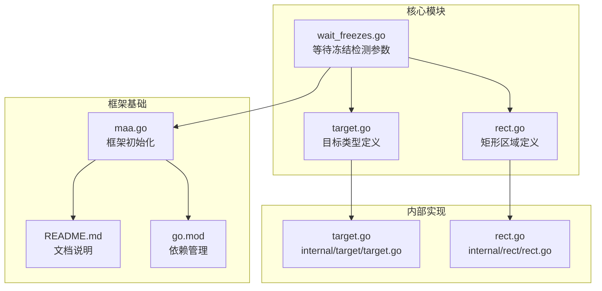
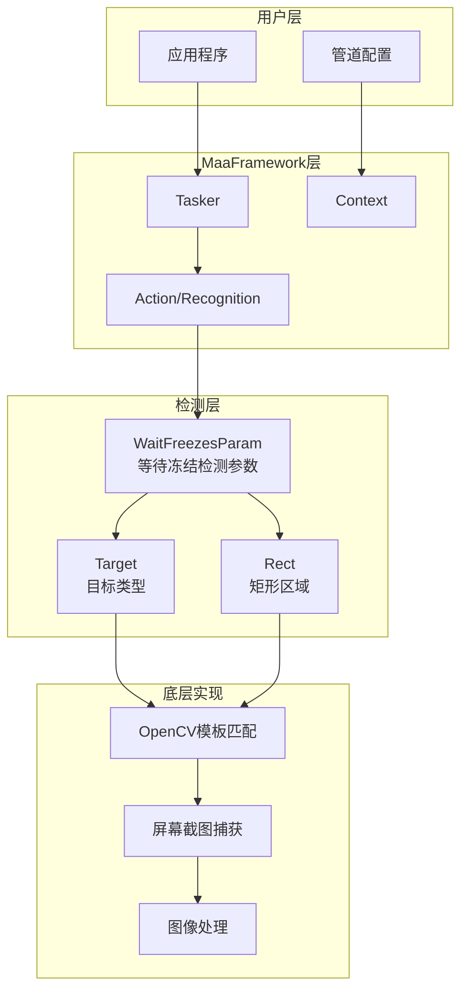
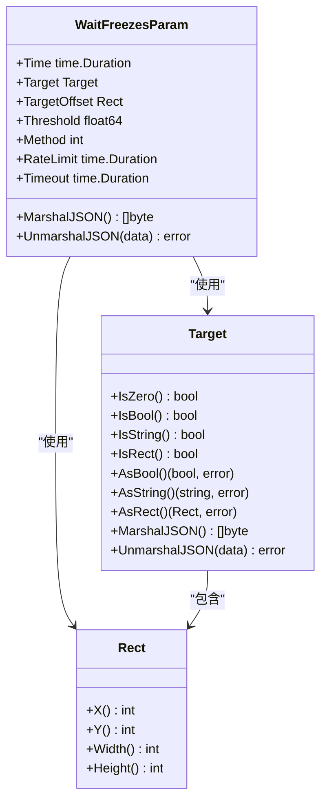
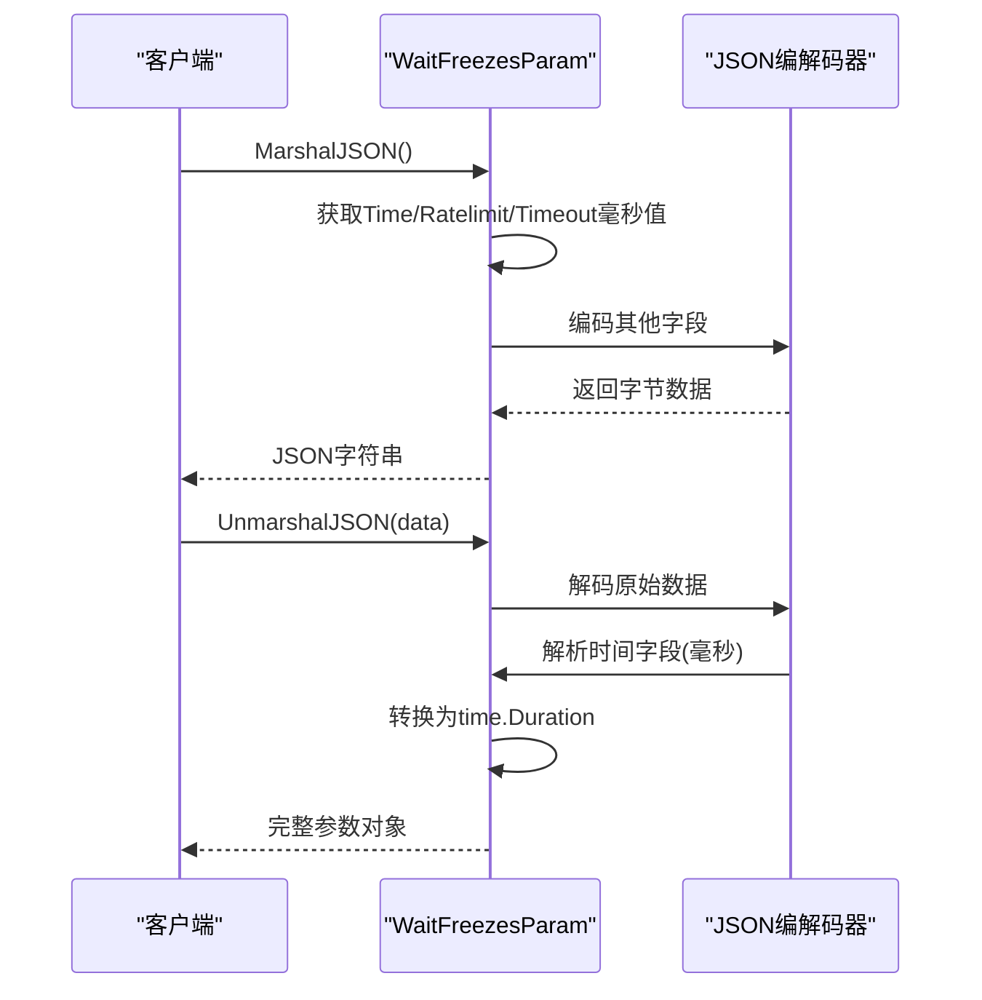
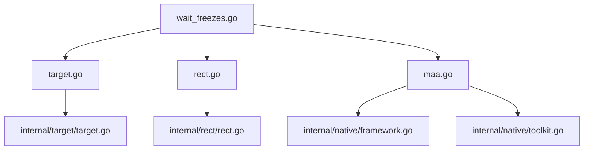

# 等待冻结检测

<cite>
**本文档引用的文件**
- [wait_freezes.go](file://wait_freezes.go)
- [target.go](file://target.go)
- [rect.go](file://rect.go)
- [target.go](file://internal/target/target.go)
- [rect.go](file://internal/rect/rect.go)
- [maa.go](file://maa.go)
- [README.md](file://README.md)
- [README_zh.md](file://README_zh.md)
- [go.mod](file://go.mod)
</cite>

## 目录
1. [简介](#简介)
2. [项目结构](#项目结构)
3. [核心组件](#核心组件)
4. [架构概览](#架构概览)
5. [详细组件分析](#详细组件分析)
6. [依赖关系分析](#依赖关系分析)
7. [性能考虑](#性能考虑)
8. [故障排除指南](#故障排除指南)
9. [结论](#结论)

## 简介

等待冻结检测是MaaFramework Go绑定中的一个重要功能，用于监控屏幕状态变化并等待界面稳定。该功能通过模板匹配算法检测屏幕区域的变化，当目标区域在连续一段时间内没有显著变化时，认为屏幕已冻结稳定。

MaaFramework是一个基于图像识别的跨平台自动化测试框架，支持多种控制器（ADB、Win32、PlayCover等）和丰富的图像识别算法。等待冻结检测功能为自动化流程提供了可靠的时机控制机制。

## 项目结构

该项目采用模块化设计，主要包含以下核心模块：

**图表来源**
- [wait_freezes.go](file://wait_freezes.go#L1-L61)
- [target.go](file://target.go#L1-L18)
- [rect.go](file://rect.go#L1-L6)
- [maa.go](file://maa.go#L1-L322)

**章节来源**
- [wait_freezes.go](file://wait_freezes.go#L1-L61)
- [target.go](file://target.go#L1-L18)
- [rect.go](file://rect.go#L1-L6)
- [maa.go](file://maa.go#L1-L322)

## 核心组件

等待冻结检测功能的核心组件是一个参数结构体，定义了检测屏幕稳定性的各种配置选项。该组件提供了完整的JSON序列化支持，便于在管道配置中使用。

### 主要特性

1. **时间阈值控制** - 定义屏幕必须保持稳定的时间长度
2. **区域监控** - 指定要监控的屏幕区域
3. **模板匹配** - 使用OpenCV模板匹配算法检测变化
4. **阈值控制** - 设置匹配相似度阈值
5. **检查间隔限制** - 控制检测频率
6. **超时机制** - 防止无限等待

**章节来源**
- [wait_freezes.go](file://wait_freezes.go#L7-L27)

## 架构概览

等待冻结检测功能在整个MaaFramework架构中的位置如下：

**图表来源**
- [wait_freezes.go](file://wait_freezes.go#L9-L26)
- [target.go](file://target.go#L3-L5)
- [rect.go](file://rect.go#L3-L5)

## 详细组件分析

### WaitFreezesParam 结构体

WaitFreezesParam是等待冻结检测的核心数据结构，定义了所有相关的配置参数：

**图表来源**
- [wait_freezes.go](file://wait_freezes.go#L9-L26)
- [target.go](file://internal/target/target.go#L23-L73)
- [rect.go](file://internal/rect/rect.go#L4-L20)

### JSON序列化机制

等待冻结检测参数提供了自定义的JSON序列化实现，专门处理时间相关的字段：

**图表来源**
- [wait_freezes.go](file://wait_freezes.go#L29-L60)

### 参数配置详解

| 参数名称 | 类型 | 默认值 | 描述 |
|---------|------|--------|------|
| Time | time.Duration | 1ms | 屏幕必须保持稳定的时间 |
| Target | Target | 无 | 要监控的目标区域 |
| TargetOffset | Rect | 空 | 目标区域的偏移量 |
| Threshold | float64 | 0.95 | 模板匹配相似度阈值 |
| Method | int | 5 | OpenCV模板匹配方法 |
| RateLimit | time.Duration | 1000ms | 最小检查间隔 |
| Timeout | time.Duration | 20000ms | 最大等待时间 |

**章节来源**
- [wait_freezes.go](file://wait_freezes.go#L10-L26)

## 依赖关系分析

等待冻结检测功能的依赖关系相对简单，主要依赖于框架的基础类型：

**图表来源**
- [wait_freezes.go](file://wait_freezes.go#L3-L5)
- [target.go](file://target.go#L3-L5)
- [rect.go](file://rect.go#L3-L5)

### 外部依赖

项目的主要外部依赖包括：

1. **purego** - 用于动态加载原生库
2. **testify** - 测试断言库
3. **spew** - 调试输出工具
4. **yaml** - YAML解析库

**章节来源**
- [go.mod](file://go.mod#L5-L14)

## 性能考虑

等待冻结检测功能在设计时充分考虑了性能优化：

### 检测频率控制
- 默认1000ms检查间隔，避免过度占用CPU资源
- 可通过RateLimit参数调整检查频率
- 超时机制防止长时间无效等待

### 图像处理优化
- 使用OpenCV模板匹配算法，性能稳定
- 支持多种匹配方法，可根据场景选择最优方案
- 阈值参数允许在准确性和性能间平衡

### 内存管理
- 时间参数以毫秒形式存储，减少内存占用
- JSON序列化时进行必要的数据转换
- 自动清理临时图像数据

## 故障排除指南

### 常见问题及解决方案

1. **检测不准确**
   - 检查Threshold参数设置是否合理
   - 确认Target区域是否正确
   - 验证Method参数是否适合当前场景

2. **性能问题**
   - 调整RateLimit参数降低检查频率
   - 优化Target区域大小
   - 检查系统资源使用情况

3. **超时问题**
   - 增加Timeout参数值
   - 检查目标区域是否有动画效果
   - 验证屏幕截图捕获功能正常

### 调试建议

1. 启用调试模式查看详细日志
2. 使用SaveDraw功能保存识别结果
3. 逐步缩小Target区域范围定位问题
4. 检查框架初始化是否成功

**章节来源**
- [maa.go](file://maa.go#L238-L321)

## 结论

等待冻结检测功能为MaaFramework提供了强大的屏幕稳定性监控能力。通过合理的参数配置和优化策略，可以实现精确的时机控制，提高自动化流程的可靠性和效率。

该功能的设计体现了MaaFramework的整体架构理念：简洁易用、功能强大、性能优异。随着框架的不断发展，等待冻结检测功能将继续完善，为用户提供更好的自动化体验。