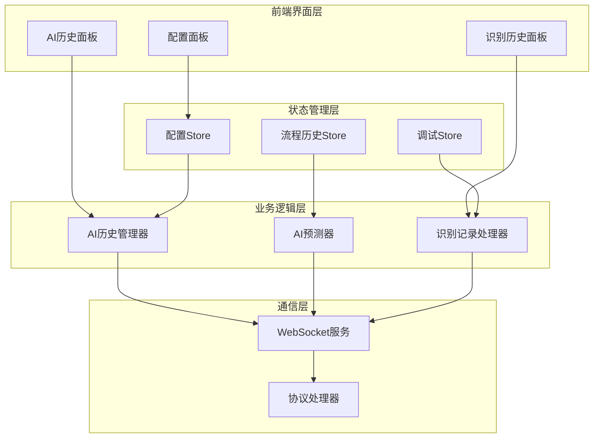
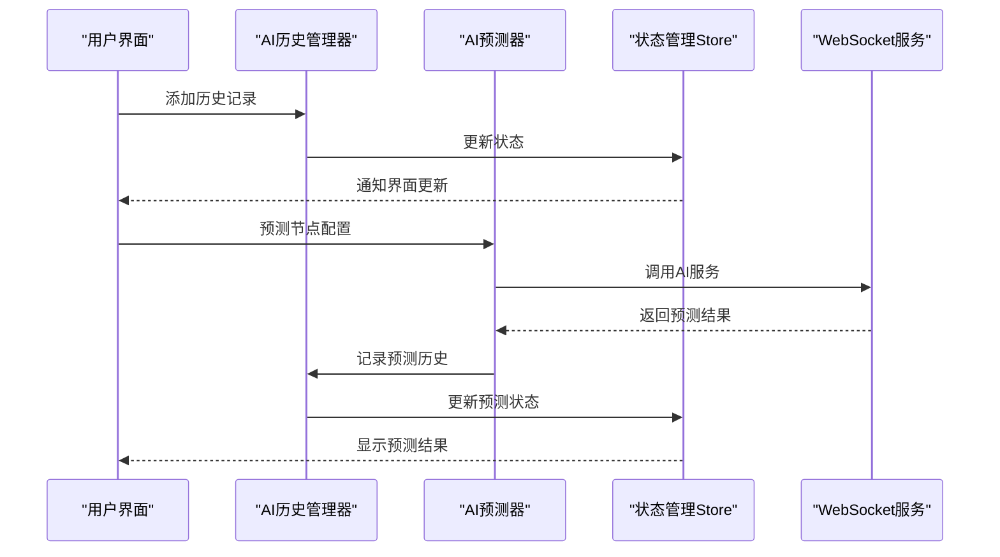
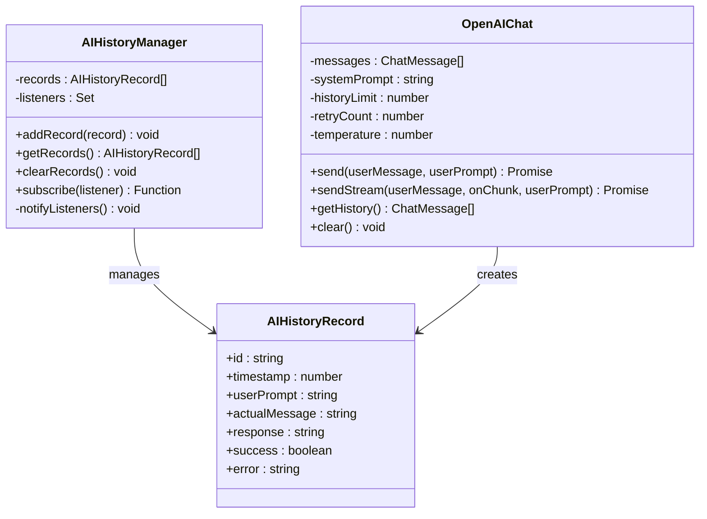
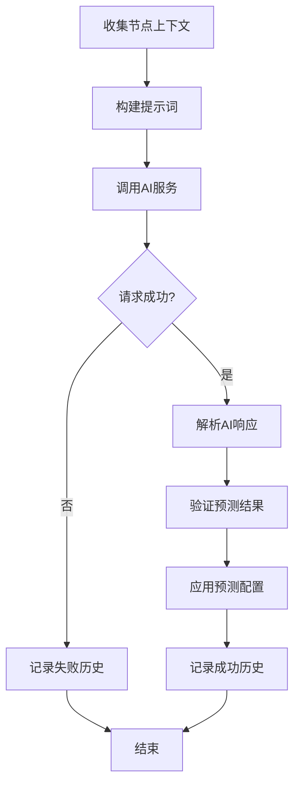
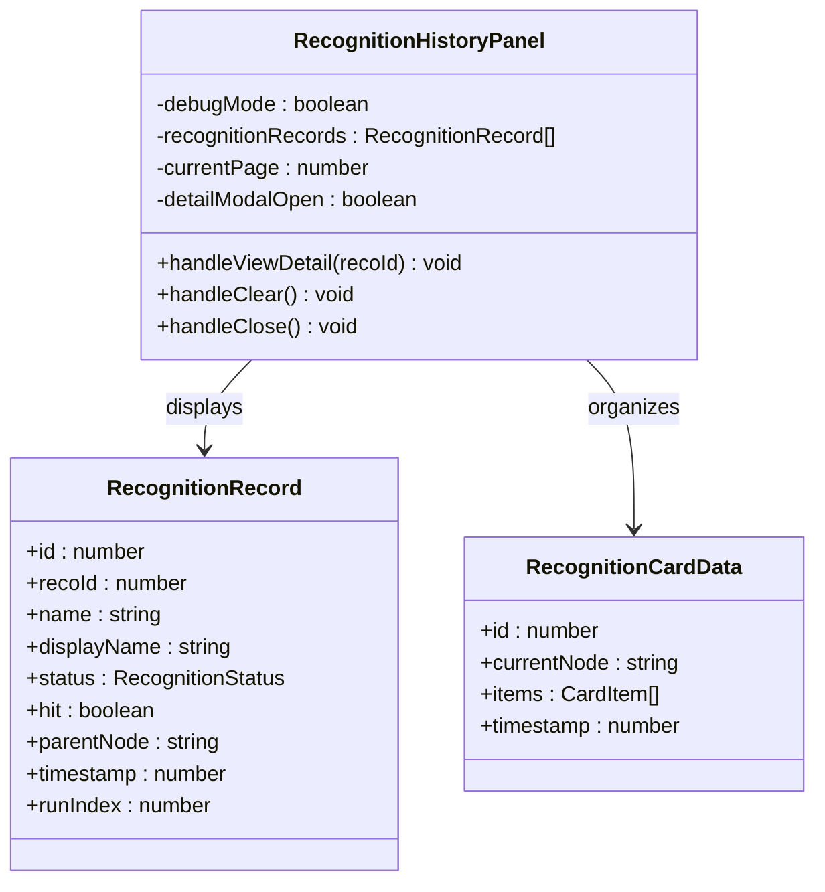
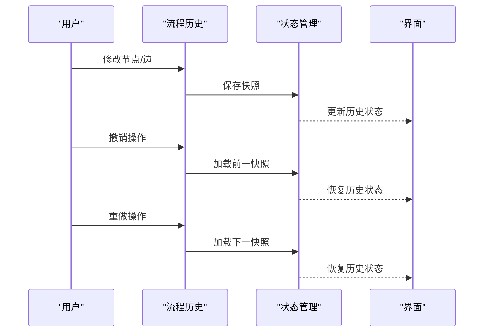
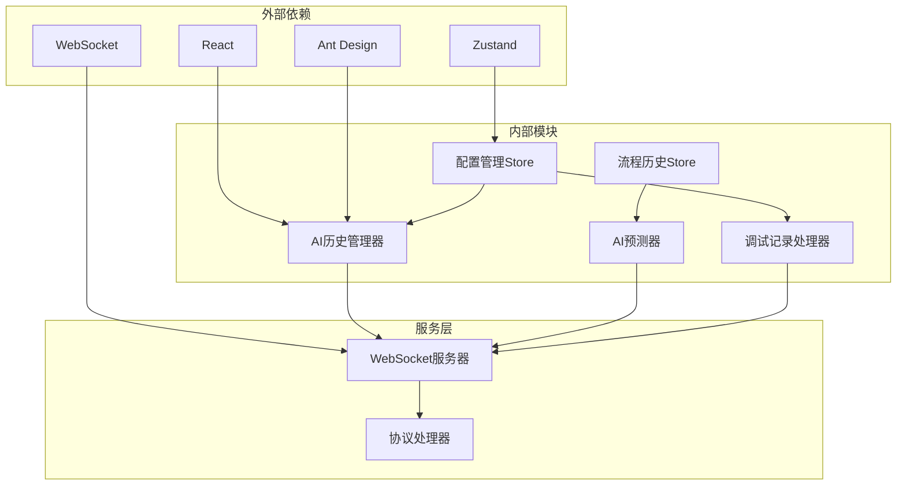

# AI历史记录管理系统

<cite>
**本文档引用的文件**
- [AIHistoryPanel.tsx](file://src/components/panels/main/AIHistoryPanel.tsx)
- [RecognitionHistoryPanel.tsx](file://src/components/panels/main/RecognitionHistoryPanel.tsx)
- [aiPredictor.ts](file://src/utils/aiPredictor.ts)
- [openai.ts](file://src/utils/openai.ts)
- [debugStore.ts](file://src/stores/debugStore.ts)
- [historySlice.ts](file://src/stores/flow/slices/historySlice.ts)
- [types.ts](file://src/stores/flow/types.ts)
- [configStore.ts](file://src/stores/configStore.ts)
- [AIConfigSection.tsx](file://src/components/panels/config/AIConfigSection.tsx)
- [server.ts](file://src/services/server.ts)
</cite>

## 目录
1. [简介](#简介)
2. [项目结构](#项目结构)
3. [核心组件](#核心组件)
4. [架构总览](#架构总览)
5. [详细组件分析](#详细组件分析)
6. [依赖关系分析](#依赖关系分析)
7. [性能考量](#性能考量)
8. [故障排查指南](#故障排查指南)
9. [结论](#结论)
10. [附录](#附录)

## 简介
本系统是一个面向MaaFramework Pipeline编辑器的AI历史记录管理系统，负责收集、存储、查询和分析AI相关的使用记录。系统涵盖三类主要历史记录：
- AI对话历史：记录与AI交互的完整对话历史，包括用户输入、AI回复、成功与否等
- 识别记录历史：记录调试过程中的识别事件，包括识别状态、命中情况、父节点关系等
- 补全记录：通过AI预测生成的节点配置补全记录，支持验证和应用

系统提供完整的查询筛选功能（时间范围、节点类型、成功率统计）、学习分析功能（使用频率统计、效果评估、个性化推荐）、以及清理管理策略（存储空间控制、隐私保护、数据备份）。同时提供丰富的配置选项和最佳实践指导。

## 项目结构
系统采用前后端分离的架构设计，前端使用React + Zustand状态管理，后端通过WebSocket协议与本地服务通信。核心模块包括：
- 历史记录管理：AI历史记录、识别记录、补全记录的统一管理
- 状态管理：Zustand Store管理应用状态和历史记录
- 通信协议：WebSocket协议实现前后端实时通信
- 配置管理：集中管理AI服务配置和系统参数

**图表来源**
- [AIHistoryPanel.tsx:83-163](file://src/components/panels/main/AIHistoryPanel.tsx#L83-L163)
- [RecognitionHistoryPanel.tsx:173-376](file://src/components/panels/main/RecognitionHistoryPanel.tsx#L173-L376)
- [openai.ts:48-87](file://src/utils/openai.ts#L48-L87)
- [debugStore.ts:227-800](file://src/stores/debugStore.ts#L227-L800)
- [server.ts:20-331](file://src/services/server.ts#L20-L331)

**章节来源**
- [AIHistoryPanel.tsx:1-166](file://src/components/panels/main/AIHistoryPanel.tsx#L1-L166)
- [RecognitionHistoryPanel.tsx:1-377](file://src/components/panels/main/RecognitionHistoryPanel.tsx#L1-L377)
- [openai.ts:1-394](file://src/utils/openai.ts#L1-L394)

## 核心组件
系统的核心组件包括历史记录管理器、AI预测器、调试记录处理器和状态管理Store。每个组件都有明确的职责分工和清晰的接口定义。

### 历史记录管理器
AI历史管理器提供全局的历史记录管理功能，支持记录的增删改查、订阅通知和持久化存储。

### AI预测器
AI预测器负责收集节点上下文信息、构建提示词、调用AI服务、解析响应结果，并进行参数验证和应用。

### 调试记录处理器
调试记录处理器专门处理识别记录和执行历史，提供内存限制、自动清理、状态跟踪等功能。

### 状态管理Store
系统使用Zustand实现多层状态管理，包括配置状态、调试状态、流程历史状态等，确保状态的一致性和可追踪性。

**章节来源**
- [openai.ts:48-87](file://src/utils/openai.ts#L48-L87)
- [aiPredictor.ts:82-172](file://src/utils/aiPredictor.ts#L82-L172)
- [debugStore.ts:80-137](file://src/stores/debugStore.ts#L80-L137)
- [configStore.ts:95-161](file://src/stores/configStore.ts#L95-L161)

## 架构总览
系统采用分层架构设计，各层之间职责清晰，耦合度低，便于维护和扩展。

**图表来源**
- [openai.ts:169-243](file://src/utils/openai.ts#L169-L243)
- [aiPredictor.ts:532-559](file://src/utils/aiPredictor.ts#L532-L559)
- [server.ts:286-300](file://src/services/server.ts#L286-L300)

系统架构特点：
- **分层清晰**：界面层、业务逻辑层、状态管理层、通信层职责分明
- **事件驱动**：通过订阅机制实现状态变更的通知和传播
- **协议统一**：基于WebSocket协议实现前后端通信
- **状态隔离**：不同类型的记录使用独立的状态管理，避免相互干扰

## 详细组件分析

### AI历史记录管理器
AI历史记录管理器是整个系统的核心组件，负责AI相关历史记录的统一管理。

**图表来源**
- [openai.ts:48-87](file://src/utils/openai.ts#L48-L87)
- [openai.ts:36-45](file://src/utils/openai.ts#L36-L45)
- [openai.ts:93-100](file://src/utils/openai.ts#L93-L100)

AI历史记录管理器的核心功能：
- **记录管理**：支持历史记录的添加、查询、清空操作
- **状态通知**：通过订阅机制通知界面和其他组件状态变更
- **唯一标识**：为每条记录生成唯一ID和时间戳
- **内存控制**：自动管理历史记录的数量，防止内存溢出

**章节来源**
- [openai.ts:48-87](file://src/utils/openai.ts#L48-L87)

### AI预测器组件
AI预测器负责收集节点上下文信息、构建提示词、调用AI服务并处理响应结果。

**图表来源**
- [aiPredictor.ts:82-172](file://src/utils/aiPredictor.ts#L82-L172)
- [aiPredictor.ts:532-559](file://src/utils/aiPredictor.ts#L532-L559)

AI预测器的工作流程：
1. **上下文收集**：收集当前节点、前置节点、OCR结果等信息
2. **提示词构建**：根据上下文信息构建详细的提示词
3. **AI调用**：调用OpenAI兼容的API服务
4. **结果解析**：解析AI返回的JSON格式结果
5. **参数验证**：验证预测结果的有效性和完整性
6. **配置应用**：将验证后的配置应用到节点

**章节来源**
- [aiPredictor.ts:82-172](file://src/utils/aiPredictor.ts#L82-L172)
- [aiPredictor.ts:532-559](file://src/utils/aiPredictor.ts#L532-L559)

### 识别历史面板
识别历史面板提供调试过程中识别记录的可视化展示和管理功能。

**图表来源**
- [RecognitionHistoryPanel.tsx:173-376](file://src/components/panels/main/RecognitionHistoryPanel.tsx#L173-L376)
- [debugStore.ts:84-103](file://src/stores/debugStore.ts#L84-L103)

识别历史面板的功能特性：
- **卡片化展示**：将识别记录按节点分组，以卡片形式展示
- **状态可视化**：通过不同颜色和图标表示识别状态
- **分页浏览**：支持大量记录的分页浏览
- **详情查看**：支持查看识别详情和相关图像
- **内存管理**：自动清理超出限制的历史记录

**章节来源**
- [RecognitionHistoryPanel.tsx:173-376](file://src/components/panels/main/RecognitionHistoryPanel.tsx#L173-L376)
- [debugStore.ts:84-103](file://src/stores/debugStore.ts#L84-L103)

### 流程历史管理
流程历史管理负责保存和恢复工作流的编辑历史，支持撤销和重做操作。

**图表来源**
- [historySlice.ts:50-108](file://src/stores/flow/slices/historySlice.ts#L50-L108)
- [historySlice.ts:111-148](file://src/stores/flow/slices/historySlice.ts#L111-L148)

流程历史管理的特点：
- **快照机制**：定期保存工作流状态的快照
- **差异检测**：只在状态发生变化时保存新的快照
- **历史限制**：限制历史记录的数量，防止内存占用过大
- **无缝集成**：与React Flow无缝集成，支持撤销重做

**章节来源**
- [historySlice.ts:49-108](file://src/stores/flow/slices/historySlice.ts#L49-L108)
- [historySlice.ts:111-188](file://src/stores/flow/slices/historySlice.ts#L111-L188)

## 依赖关系分析

**图表来源**
- [openai.ts:1-10](file://src/utils/openai.ts#L1-L10)
- [aiPredictor.ts:1-16](file://src/utils/aiPredictor.ts#L1-L16)
- [debugStore.ts:1-5](file://src/stores/debugStore.ts#L1-L5)
- [server.ts:1-16](file://src/services/server.ts#L1-L16)

系统依赖关系特点：
- **轻量级框架**：使用React和Zustand实现最小化依赖
- **协议驱动**：通过WebSocket协议实现前后端解耦
- **模块化设计**：各模块职责明确，依赖关系清晰
- **可扩展性**：支持添加新的历史记录类型和处理逻辑

**章节来源**
- [openai.ts:1-10](file://src/utils/openai.ts#L1-L10)
- [aiPredictor.ts:1-16](file://src/utils/aiPredictor.ts#L1-L16)
- [debugStore.ts:1-5](file://src/stores/debugStore.ts#L1-L5)

## 性能考量
系统在设计时充分考虑了性能优化，采用多种策略确保良好的用户体验。

### 内存管理策略
- **历史记录限制**：识别记录最大300条，执行历史最大300条，超出时按20%比例清理
- **详情缓存限制**：识别详情缓存最大50条，避免大图像数据占用过多内存
- **自动清理机制**：当达到上限时自动清理最旧的记录和对应的缓存

### 状态更新优化
- **批量更新**：使用Zustand的批量更新机制减少不必要的重渲染
- **订阅模式**：只通知相关的监听者，避免全局广播
- **快照优化**：差异检测避免重复保存相同的状态

### 网络通信优化
- **连接池管理**：WebSocket连接的生命周期管理
- **超时控制**：合理的连接超时和请求超时设置
- **错误重试**：智能的错误重试机制，避免频繁重试

## 故障排查指南

### 常见问题及解决方案

#### AI服务连接问题
**症状**：AI历史记录显示配置错误
**原因**：API URL、API Key或模型配置不正确
**解决方法**：
1. 检查AI配置面板中的各项设置
2. 使用测试连接按钮验证配置
3. 确认API服务正常运行

#### 识别记录丢失
**症状**：识别历史面板显示空白或记录不完整
**原因**：达到内存限制被自动清理
**解决方法**：
1. 检查MAX_RECOGNITION_RECORDS配置
2. 定期清理不需要的历史记录
3. 调整内存限制参数

#### WebSocket连接失败
**症状**：调试功能无法使用
**原因**：本地服务未启动或端口冲突
**解决方法**：
1. 确认本地服务已启动
2. 检查端口设置（默认9066）
3. 查看连接状态变化回调

**章节来源**
- [AIConfigSection.tsx:120-142](file://src/components/panels/config/AIConfigSection.tsx#L120-L142)
- [debugStore.ts:10-21](file://src/stores/debugStore.ts#L10-L21)
- [server.ts:105-251](file://src/services/server.ts#L105-L251)

### 调试技巧
- **状态监控**：通过浏览器开发者工具监控Zustand状态变化
- **日志输出**：利用console.log输出关键状态信息
- **性能分析**：使用React DevTools分析组件渲染性能

## 结论
AI历史记录管理系统通过精心设计的架构和完善的组件实现了对AI使用记录的全面管理。系统具有以下优势：

1. **架构清晰**：分层设计使得各模块职责明确，易于维护和扩展
2. **功能完整**：涵盖历史记录的收集、存储、查询、分析和清理全流程
3. **性能优化**：通过内存管理和状态优化确保系统稳定运行
4. **用户体验**：提供直观的界面和丰富的配置选项

系统为AI在Pipeline编辑器中的应用提供了坚实的基础，支持用户进行有效的历史记录管理和分析，提升工作效率和质量。

## 附录

### 配置选项详解
系统提供丰富的配置选项，主要包括：

#### AI服务配置
- **API URL**：OpenAI兼容的API端点地址
- **API Key**：访问API所需的密钥
- **模型名称**：使用的具体模型名称
- **温度参数**：控制AI输出的创造性程度

#### 界面配置
- **面板显示**：控制AI历史面板的显示状态
- **历史记录数量**：限制历史记录的最大数量
- **字段面板模式**：控制字段面板的显示方式

#### 调试配置
- **保存文件前调试**：调试前自动保存文件
- **实时画面预览**：启用实时画面预览功能
- **磁吸对齐**：启用节点磁吸对齐功能

**章节来源**
- [configStore.ts:95-211](file://src/stores/configStore.ts#L95-L211)
- [AIConfigSection.tsx:11-142](file://src/components/panels/config/AIConfigSection.tsx#L11-L142)

### 最佳实践建议
1. **定期清理**：定期清理不需要的历史记录，释放内存空间
2. **配置备份**：定期备份AI配置，防止配置丢失
3. **监控性能**：关注系统性能指标，及时发现潜在问题
4. **安全防护**：注意API Key的安全存储，避免泄露
5. **版本升级**：及时更新系统版本，获得最新的功能和修复