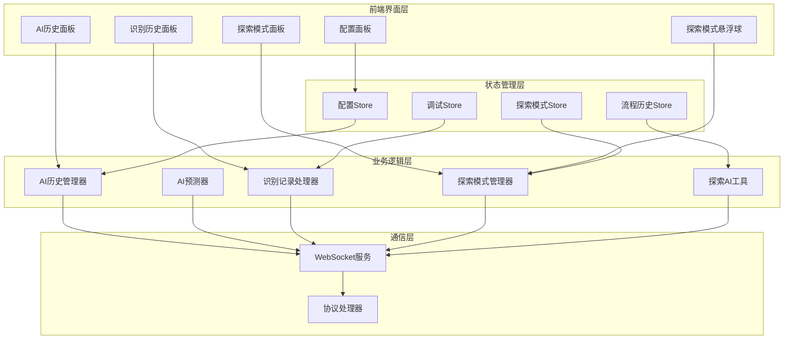
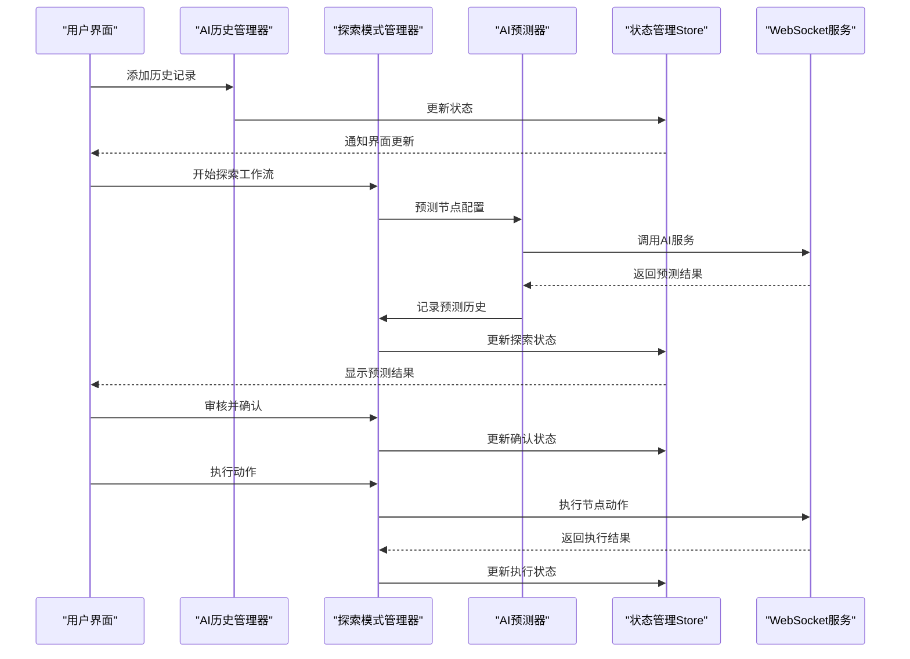
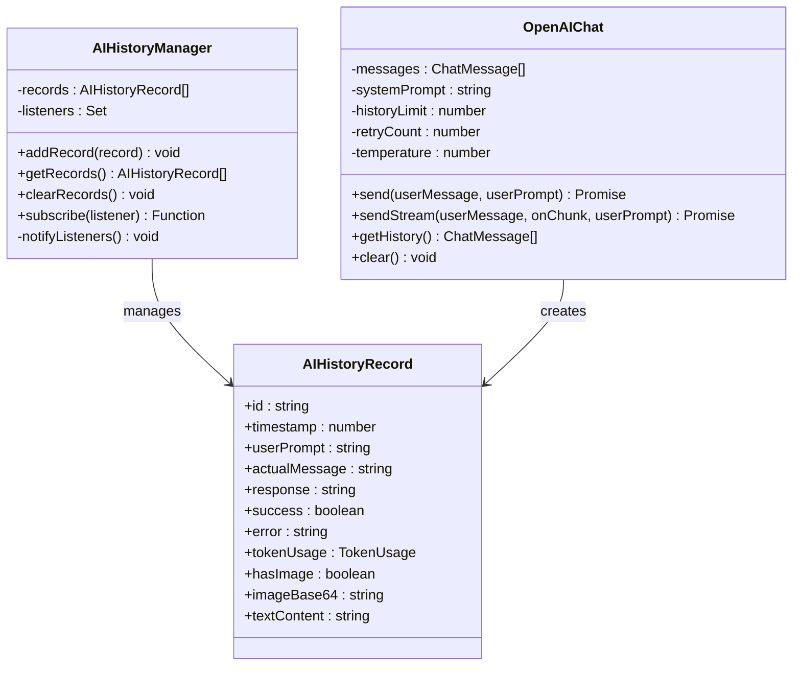
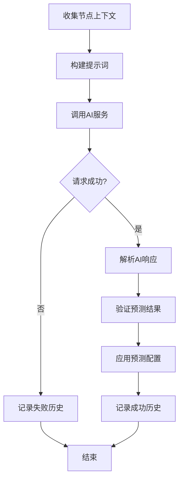
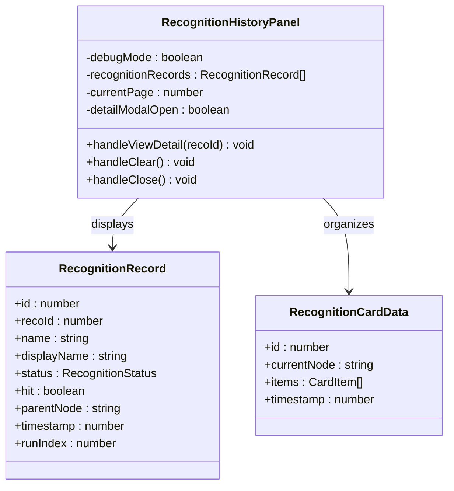
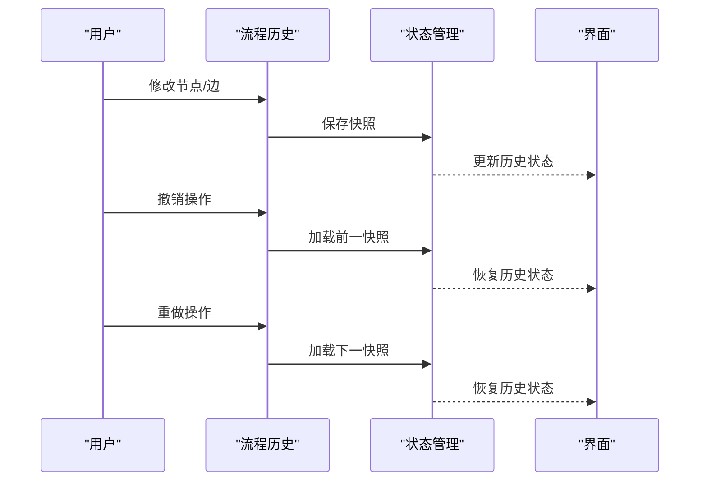
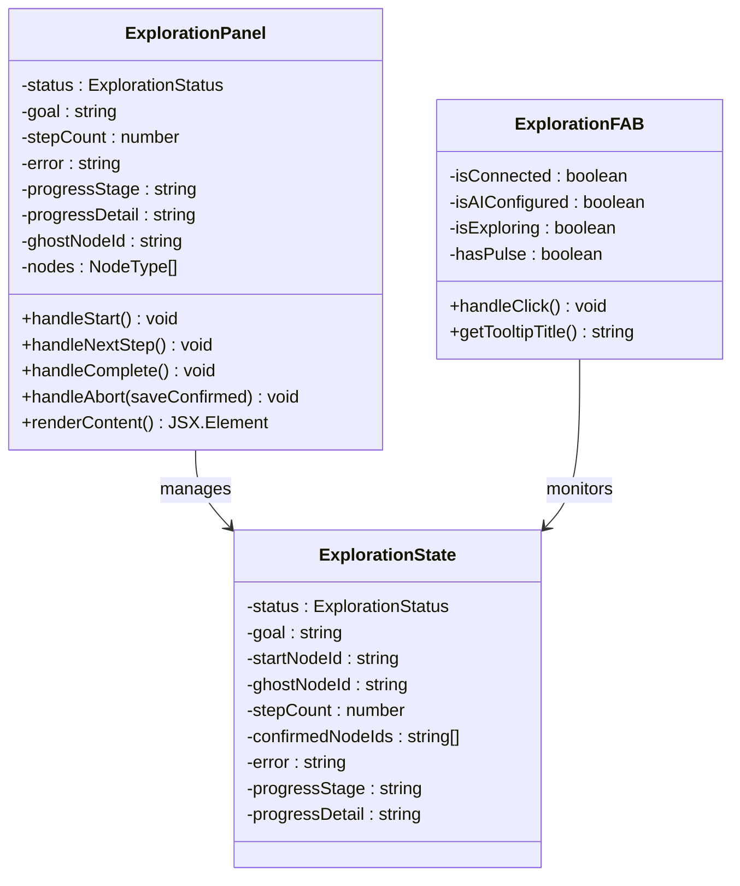
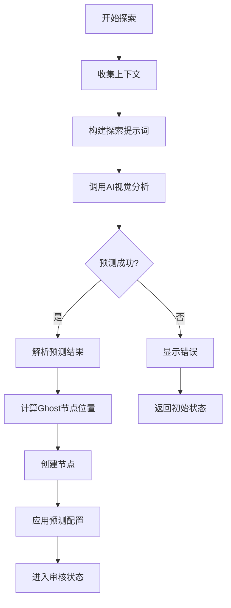
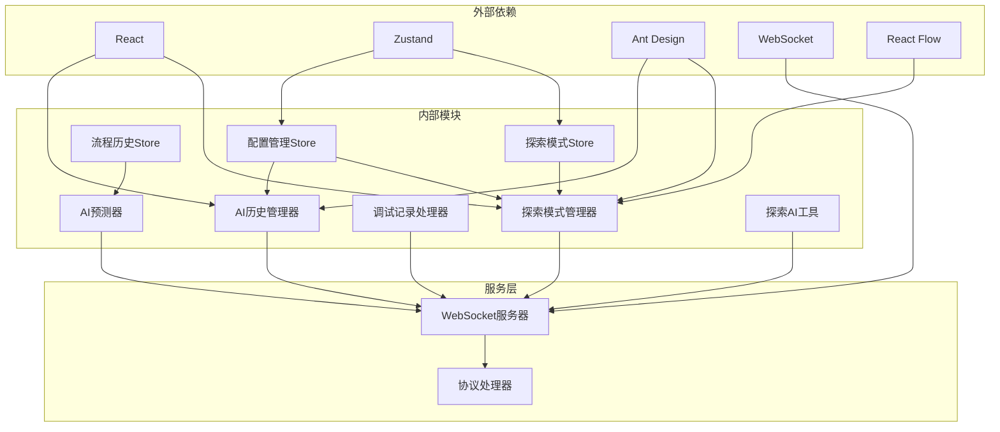

# AI历史记录管理系统

<cite>
**本文档引用的文件**
- [AIHistoryPanel.tsx](file://src/components/panels/main/AIHistoryPanel.tsx)
- [RecognitionHistoryPanel.tsx](file://src/components/panels/main/RecognitionHistoryPanel.tsx)
- [ExplorationPanel.tsx](file://src/components/panels/exploration/ExplorationPanel.tsx)
- [ExplorationFAB.tsx](file://src/components/panels/exploration/ExplorationFAB.tsx)
- [explorationSlice.ts](file://src/stores/flow/slices/explorationSlice.ts)
- [explorationAI.ts](file://src/utils/ai/explorationAI.ts)
- [aiPredictor.ts](file://src/utils/ai/aiPredictor.ts)
- [openai.ts](file://src/utils/ai/openai.ts)
- [aiPrompts.ts](file://src/utils/ai/aiPrompts.ts)
- [debugStore.ts](file://src/stores/debugStore.ts)
- [historySlice.ts](file://src/stores/flow/slices/historySlice.ts)
- [types.ts](file://src/stores/flow/types.ts)
- [configStore.ts](file://src/stores/configStore.ts)
- [AIConfigSection.tsx](file://src/components/panels/config/AIConfigSection.tsx)
- [server.ts](file://src/services/server.ts)
- [ExplorationPanel.module.less](file://src/styles/panels/ExplorationPanel.module.less)
</cite>

## 更新摘要
**变更内容**
- 新增智能引导式工作流探索系统，从简单的预测工具升级为完整的AI工作流构建器
- 添加探索状态管理，支持多步骤工作流的智能构建
- 引入Ghost节点概念，提供可视化的AI预测结果预览
- 增强AI历史记录管理，支持探索模式下的工作流历史追踪
- 新增探索模式的完整生命周期管理（idle → predicting → reviewing → executing → confirmed → completed）

## 目录
1. [简介](#简介)
2. [项目结构](#项目结构)
3. [核心组件](#核心组件)
4. [架构总览](#架构总览)
5. [详细组件分析](#详细组件分析)
6. [探索模式系统](#探索模式系统)
7. [依赖关系分析](#依赖关系分析)
8. [性能考量](#性能考量)
9. [故障排查指南](#故障排查指南)
10. [结论](#结论)
11. [附录](#附录)

## 简介
本系统是一个面向MaaFramework Pipeline编辑器的AI历史记录管理系统，现已升级为智能引导式工作流构建器。系统负责收集、存储、查询和分析AI相关的使用记录，涵盖三大核心功能模块：

### 主要功能模块
- **AI对话历史管理**：记录与AI交互的完整对话历史，包括用户输入、AI回复、成功与否等
- **识别记录历史**：记录调试过程中的识别事件，包括识别状态、命中情况、父节点关系等  
- **探索模式工作流**：智能引导式工作流构建器，支持多步骤工作流的AI预测、审核、执行和确认

系统提供完整的查询筛选功能（时间范围、节点类型、成功率统计）、学习分析功能（使用频率统计、效果评估、个性化推荐）、以及清理管理策略（存储空间控制、隐私保护、数据备份）。同时提供丰富的配置选项和最佳实践指导。

## 项目结构
系统采用前后端分离的架构设计，前端使用React + Zustand状态管理，后端通过WebSocket协议与本地服务通信。核心模块包括：

### 核心架构模块
- **历史记录管理**：AI历史记录、识别记录、探索工作流的统一管理
- **状态管理层**：Zustand Store管理应用状态和历史记录
- **探索模式系统**：完整的AI工作流构建和执行系统
- **通信协议**：WebSocket协议实现前后端实时通信
- **配置管理**：集中管理AI服务配置和系统参数



**图表来源**
- [ExplorationPanel.tsx:29-303](file://src/components/panels/exploration/ExplorationPanel.tsx#L29-L303)
- [ExplorationFAB.tsx:22-97](file://src/components/panels/exploration/ExplorationFAB.tsx#L22-L97)
- [explorationSlice.ts:40-344](file://src/stores/flow/slices/explorationSlice.ts#L40-L344)
- [explorationAI.ts:70-567](file://src/utils/ai/explorationAI.ts#L70-L567)

## 核心组件
系统的核心组件包括历史记录管理器、AI预测器、调试记录处理器、探索模式管理器和状态管理Store。每个组件都有明确的职责分工和清晰的接口定义。

### 历史记录管理器
AI历史管理器提供全局的历史记录管理功能，支持记录的增删改查、订阅通知和持久化存储。

### AI预测器
AI预测器负责收集节点上下文信息、构建提示词、调用AI服务、解析响应结果，并进行参数验证和应用。

### 调试记录处理器
调试记录处理器专门处理识别记录和执行历史，提供内存限制、自动清理、状态跟踪等功能。

### 探索模式管理器
探索模式管理器是系统的核心创新组件，提供完整的AI工作流构建和执行能力，支持多步骤工作流的智能预测、审核、执行和确认。

### 状态管理Store
系统使用Zustand实现多层状态管理，包括配置状态、调试状态、流程历史状态、探索模式状态等，确保状态的一致性和可追踪性。

**章节来源**
- [explorationAI.ts:70-567](file://src/utils/ai/explorationAI.ts#L70-L567)
- [explorationSlice.ts:40-344](file://src/stores/flow/slices/explorationSlice.ts#L40-L344)
- [aiPredictor.ts:82-172](file://src/utils/ai/aiPredictor.ts#L82-L172)
- [debugStore.ts:80-137](file://src/stores/debugStore.ts#L80-L137)

## 架构总览
系统采用分层架构设计，各层之间职责清晰，耦合度低，便于维护和扩展。新增的探索模式系统为整个架构增添了智能化的工作流构建能力。



**图表来源**
- [explorationSlice.ts:144-187](file://src/stores/flow/slices/explorationSlice.ts#L144-L187)
- [explorationAI.ts:344-518](file://src/utils/ai/explorationAI.ts#L344-L518)
- [aiPredictor.ts:532-559](file://src/utils/ai/aiPredictor.ts#L532-L559)

系统架构特点：
- **分层清晰**：界面层、业务逻辑层、状态管理层、通信层职责分明
- **事件驱动**：通过订阅机制实现状态变更的通知和传播
- **协议统一**：基于WebSocket协议实现前后端通信
- **状态隔离**：不同类型的记录使用独立的状态管理，避免相互干扰
- **智能扩展**：探索模式系统提供完整的AI工作流构建能力

## 详细组件分析

### AI历史记录管理器
AI历史记录管理器是整个系统的核心组件，负责AI相关历史记录的统一管理。



**图表来源**
- [openai.ts:48-87](file://src/utils/ai/openai.ts#L48-L87)
- [openai.ts:36-45](file://src/utils/ai/openai.ts#L36-L45)
- [openai.ts:93-100](file://src/utils/ai/openai.ts#L93-L100)

AI历史记录管理器的核心功能：
- **记录管理**：支持历史记录的添加、查询、清空操作
- **状态通知**：通过订阅机制通知界面和其他组件状态变更
- **唯一标识**：为每条记录生成唯一ID和时间戳
- **内存控制**：自动管理历史记录的数量，防止内存溢出
- **Token统计**：支持AI调用的Token使用量统计和展示

**章节来源**
- [openai.ts:48-87](file://src/utils/ai/openai.ts#L48-L87)

### AI预测器组件
AI预测器负责收集节点上下文信息、构建提示词、调用AI服务并处理响应结果。



**图表来源**
- [aiPredictor.ts:82-172](file://src/utils/ai/aiPredictor.ts#L82-L172)
- [aiPredictor.ts:532-559](file://src/utils/ai/aiPredictor.ts#L532-L559)

AI预测器的工作流程：
1. **上下文收集**：收集当前节点、前置节点、OCR结果等信息
2. **提示词构建**：根据上下文信息构建详细的提示词
3. **AI调用**：调用OpenAI兼容的API服务
4. **结果解析**：解析AI返回的JSON格式结果
5. **参数验证**：验证预测结果的有效性和完整性
6. **配置应用**：将验证后的配置应用到节点

**章节来源**
- [aiPredictor.ts:82-172](file://src/utils/ai/aiPredictor.ts#L82-L172)
- [aiPredictor.ts:532-559](file://src/utils/ai/aiPredictor.ts#L532-L559)

### 识别历史面板
识别历史面板提供调试过程中识别记录的可视化展示和管理功能。



**图表来源**
- [RecognitionHistoryPanel.tsx:173-376](file://src/components/panels/main/RecognitionHistoryPanel.tsx#L173-L376)
- [debugStore.ts:84-103](file://src/stores/debugStore.ts#L84-L103)

识别历史面板的功能特性：
- **卡片化展示**：将识别记录按节点分组，以卡片形式展示
- **状态可视化**：通过不同颜色和图标表示识别状态
- **分页浏览**：支持大量记录的分页浏览
- **详情查看**：支持查看识别详情和相关图像
- **内存管理**：自动清理超出限制的历史记录

**章节来源**
- [RecognitionHistoryPanel.tsx:173-376](file://src/components/panels/main/RecognitionHistoryPanel.tsx#L173-L376)
- [debugStore.ts:84-103](file://src/stores/debugStore.ts#L84-L103)

### 流程历史管理
流程历史管理负责保存和恢复工作流的编辑历史，支持撤销和重做操作。



**图表来源**
- [historySlice.ts:50-108](file://src/stores/flow/slices/historySlice.ts#L50-L108)
- [historySlice.ts:111-148](file://src/stores/flow/slices/historySlice.ts#L111-L148)

流程历史管理的特点：
- **快照机制**：定期保存工作流状态的快照
- **差异检测**：只在状态发生变化时保存新的快照
- **历史限制**：限制历史记录的数量，防止内存占用过大
- **无缝集成**：与React Flow无缝集成，支持撤销重做

**章节来源**
- [historySlice.ts:49-108](file://src/stores/flow/slices/historySlice.ts#L49-L108)
- [historySlice.ts:111-188](file://src/stores/flow/slices/historySlice.ts#L111-L188)

## 探索模式系统

### 探索模式架构
探索模式系统是本次升级的核心创新，提供完整的AI工作流构建能力。系统采用状态机设计，支持多步骤工作流的智能构建。

```mermaid
stateDiagram-v2
[*] --> idle
state idle {
[*] --> waiting_for_goal
waiting_for_goal : 等待用户输入目标
waiting_for_goal --> ready_to_start : 用户输入目标
ready_to_start : 准备开始探索
ready_to_start --> predicting : 开始AI预测
}
state predicting {
[*] --> collecting_context
collecting_context : 收集节点上下文
collecting_context --> generating_prediction : AI生成预测
generating_prediction : 生成节点配置
generating_prediction --> reviewing : 显示预测结果
}
state reviewing {
[*] --> user_review : 用户审核
user_review : 等待用户确认
user_review --> confirmed : 用户确认
user_review --> executing : 用户执行
user_review --> regenerating : 用户重新生成
}
state executing {
[*] --> performing_action
performing_action : 执行节点动作
performing_action --> reviewing : 执行完成
}
state confirmed {
[*] --> ready_for_next_step
ready_for_next_step : 准备下一步
ready_for_next_step --> predicting : 下一步预测
}
state completed {
[*] --> [*]
}
idle --> predicting : start()
predicting --> reviewing : success
predicting --> idle : error
reviewing --> confirmed : confirm()
reviewing --> executing : execute()
reviewing --> regenerating : regenerate()
reviewing --> idle : abort()
executing --> reviewing : complete
confirmed --> predicting : nextStep()
confirmed --> completed : complete()
```

**图表来源**
- [explorationSlice.ts:22-344](file://src/stores/flow/slices/explorationSlice.ts#L22-L344)
- [types.ts:369-424](file://src/stores/flow/types.ts#L369-L424)

### 探索模式核心组件

#### 探索面板组件
探索面板提供完整的用户交互界面，支持目标输入、状态显示、操作控制等功能。



**图表来源**
- [ExplorationPanel.tsx:29-303](file://src/components/panels/exploration/ExplorationPanel.tsx#L29-L303)
- [ExplorationFAB.tsx:22-97](file://src/components/panels/exploration/ExplorationFAB.tsx#L22-L97)
- [types.ts:379-424](file://src/stores/flow/types.ts#L379-L424)

#### 探索AI工具
探索AI工具提供AI预测和执行的核心功能，支持视觉分析和动作执行。



**图表来源**
- [explorationAI.ts:70-117](file://src/utils/ai/explorationAI.ts#L70-L117)
- [explorationAI.ts:197-231](file://src/utils/ai/explorationAI.ts#L197-L231)

探索AI工具的核心功能：
- **上下文收集**：收集前置节点信息和当前截图
- **智能提示词构建**：根据目标和上下文构建探索提示词
- **视觉AI分析**：调用AI视觉API分析截图内容
- **预测结果解析**：解析AI返回的节点配置和推理依据
- **Ghost节点管理**：计算节点位置、创建和管理临时节点
- **动作执行**：通过MFW协议执行节点动作

**章节来源**
- [ExplorationPanel.tsx:29-303](file://src/components/panels/exploration/ExplorationPanel.tsx#L29-L303)
- [ExplorationFAB.tsx:22-97](file://src/components/panels/exploration/ExplorationFAB.tsx#L22-L97)
- [explorationSlice.ts:40-344](file://src/stores/flow/slices/explorationSlice.ts#L40-L344)
- [explorationAI.ts:70-567](file://src/utils/ai/explorationAI.ts#L70-L567)

## 依赖关系分析



**图表来源**
- [openai.ts:1-10](file://src/utils/ai/openai.ts#L1-L10)
- [aiPredictor.ts:1-16](file://src/utils/ai/aiPredictor.ts#L1-L16)
- [debugStore.ts:1-5](file://src/stores/debugStore.ts#L1-L5)
- [server.ts:1-16](file://src/services/server.ts#L1-L16)

系统依赖关系特点：
- **轻量级框架**：使用React和Zustand实现最小化依赖
- **协议驱动**：通过WebSocket协议实现前后端解耦
- **模块化设计**：各模块职责明确，依赖关系清晰
- **可扩展性**：支持添加新的历史记录类型和处理逻辑
- **智能集成**：探索模式系统与现有历史记录系统无缝集成

**章节来源**
- [openai.ts:1-10](file://src/utils/ai/openai.ts#L1-L10)
- [aiPredictor.ts:1-16](file://src/utils/ai/aiPredictor.ts#L1-L16)
- [debugStore.ts:1-5](file://src/stores/debugStore.ts#L1-L5)

## 性能考量
系统在设计时充分考虑了性能优化，采用多种策略确保良好的用户体验。

### 内存管理策略
- **历史记录限制**：识别记录最大300条，执行历史最大300条，超出时按20%比例清理
- **详情缓存限制**：识别详情缓存最大50条，避免大图像数据占用过多内存
- **自动清理机制**：当达到上限时自动清理最旧的记录和对应的缓存
- **探索状态清理**：探索模式的Ghost节点在不需要时自动清理

### 状态更新优化
- **批量更新**：使用Zustand的批量更新机制减少不必要的重渲染
- **订阅模式**：只通知相关的监听者，避免全局广播
- **快照优化**：差异检测避免重复保存相同的状态
- **状态隔离**：探索模式状态与其他状态完全隔离，避免相互影响

### 网络通信优化
- **连接池管理**：WebSocket连接的生命周期管理
- **超时控制**：合理的连接超时和请求超时设置
- **错误重试**：智能的错误重试机制，避免频繁重试
- **进度反馈**：探索模式提供详细的进度反馈，避免用户困惑

### 探索模式性能优化
- **智能预测**：只在必要时调用AI服务，避免频繁预测
- **缓存机制**：探索模式的预测结果和截图进行缓存
- **异步处理**：所有AI调用都是异步的，不影响UI响应
- **资源管理**：自动管理探索模式使用的各种资源

## 故障排查指南

### 常见问题及解决方案

#### AI服务连接问题
**症状**：AI历史记录显示配置错误
**原因**：API URL、API Key或模型配置不正确
**解决方法**：
1. 检查AI配置面板中的各项设置
2. 使用测试连接按钮验证配置
3. 确认API服务正常运行

#### 探索模式无法启动
**症状**：探索模式悬浮球不可用或点击无效
**原因**：设备未连接或AI配置未完成
**解决方法**：
1. 确认设备已正确连接
2. 检查AI API配置是否完整
3. 确认探索目标输入正确
4. 查看状态栏的错误提示

#### 探索预测失败
**症状**：探索模式显示预测失败或卡在预测状态
**原因**：AI服务异常或截图获取失败
**解决方法**：
1. 检查AI服务连接状态
2. 确认设备截图功能正常
3. 重新尝试预测
4. 查看详细的错误信息

#### 识别记录丢失
**症状**：识别历史面板显示空白或记录不完整
**原因**：达到内存限制被自动清理
**解决方法**：
1. 检查MAX_RECOGNITION_RECORDS配置
2. 定期清理不需要的历史记录
3. 调整内存限制参数

#### WebSocket连接失败
**症状**：调试功能无法使用
**原因**：本地服务未启动或端口冲突
**解决方法**：
1. 确认本地服务已启动
2. 检查端口设置（默认9066）
3. 查看连接状态变化回调

**章节来源**
- [AIConfigSection.tsx:120-142](file://src/components/panels/config/AIConfigSection.tsx#L120-L142)
- [debugStore.ts:10-21](file://src/stores/debugStore.ts#L10-L21)
- [server.ts:105-251](file://src/services/server.ts#L105-L251)

### 调试技巧
- **状态监控**：通过浏览器开发者工具监控Zustand状态变化
- **日志输出**：利用console.log输出关键状态信息
- **性能分析**：使用React DevTools分析组件渲染性能
- **探索模式调试**：利用探索模式的详细进度反馈进行调试

## 结论
AI历史记录管理系统通过精心设计的架构和完善的组件实现了对AI使用记录的全面管理。系统现已升级为智能引导式工作流构建器，具有以下优势：

### 核心优势
1. **架构清晰**：分层设计使得各模块职责明确，易于维护和扩展
2. **功能完整**：涵盖历史记录的收集、存储、查询、分析和清理全流程
3. **性能优化**：通过内存管理和状态优化确保系统稳定运行
4. **用户体验**：提供直观的界面和丰富的配置选项
5. **智能扩展**：探索模式系统提供完整的AI工作流构建能力

### 技术创新
- **探索模式系统**：从简单的预测工具升级为完整的AI工作流构建器
- **Ghost节点概念**：提供可视化的AI预测结果预览
- **多步骤工作流**：支持复杂的多步骤工作流智能构建
- **状态机设计**：探索模式采用状态机设计，状态转换清晰明确

系统为AI在Pipeline编辑器中的应用提供了坚实的基础，支持用户进行有效的历史记录管理和分析，提升工作效率和质量。新增的探索模式系统更是为用户提供了智能化的工作流构建体验，大大降低了工作流开发的门槛。

## 附录

### 配置选项详解
系统提供丰富的配置选项，主要包括：

#### AI服务配置
- **API URL**：OpenAI兼容的API端点地址
- **API Key**：访问API所需的密钥
- **模型名称**：使用的具体模型名称
- **温度参数**：控制AI输出的创造性程度

#### 界面配置
- **面板显示**：控制AI历史面板的显示状态
- **历史记录数量**：限制历史记录的最大数量
- **字段面板模式**：控制字段面板的显示方式
- **探索模式显示**：控制探索模式面板的显示状态

#### 调试配置
- **保存文件前调试**：调试前自动保存文件
- **实时画面预览**：启用实时画面预览功能
- **磁吸对齐**：启用节点磁吸对齐功能
- **探索模式自动保存**：探索模式完成后自动保存确认的节点

#### 探索模式配置
- **探索目标**：用户输入的探索目标描述
- **起始节点**：探索的起始节点选择
- **预测超时**：AI预测的最大等待时间
- **执行超时**：动作执行的最大等待时间

**章节来源**
- [configStore.ts:95-211](file://src/stores/configStore.ts#L95-L211)
- [AIConfigSection.tsx:11-142](file://src/components/panels/config/AIConfigSection.tsx#L11-L142)

### 最佳实践建议
1. **定期清理**：定期清理不需要的历史记录，释放内存空间
2. **配置备份**：定期备份AI配置，防止配置丢失
3. **监控性能**：关注系统性能指标，及时发现潜在问题
4. **安全防护**：注意API Key的安全存储，避免泄露
5. **版本升级**：及时更新系统版本，获得最新的功能和修复
6. **探索模式使用**：充分利用探索模式的智能工作流构建能力
7. **状态管理**：合理使用探索模式的各种状态，避免状态混乱
8. **错误处理**：建立完善的错误处理机制，提高系统稳定性

### 探索模式使用指南
1. **准备工作**：确保设备连接正常，AI配置完整
2. **目标设定**：清晰描述探索目标，提供具体的任务描述
3. **起始节点**：根据需要选择合适的起始节点
4. **审核确认**：仔细审核AI生成的预测结果
5. **动作执行**：在确认无误后执行节点动作
6. **迭代优化**：根据执行结果调整和优化工作流
7. **完成总结**：探索完成后进行总结和归档