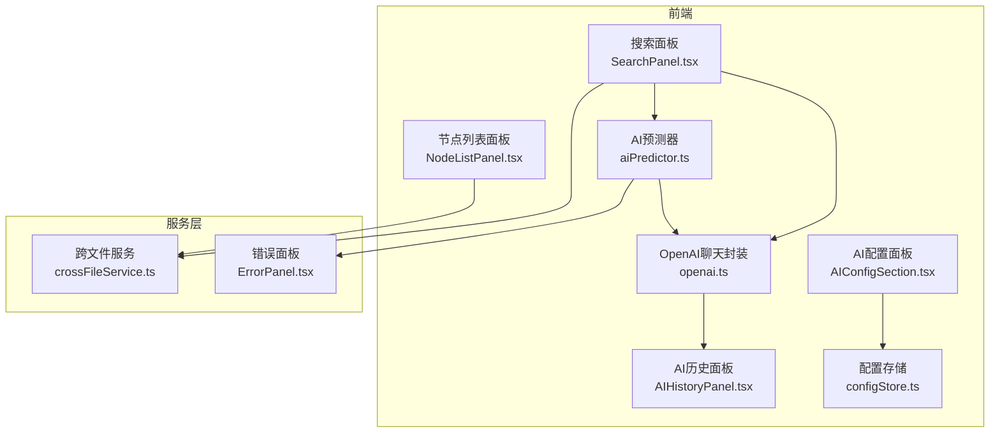
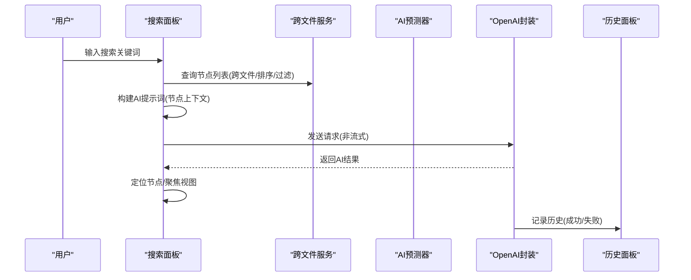
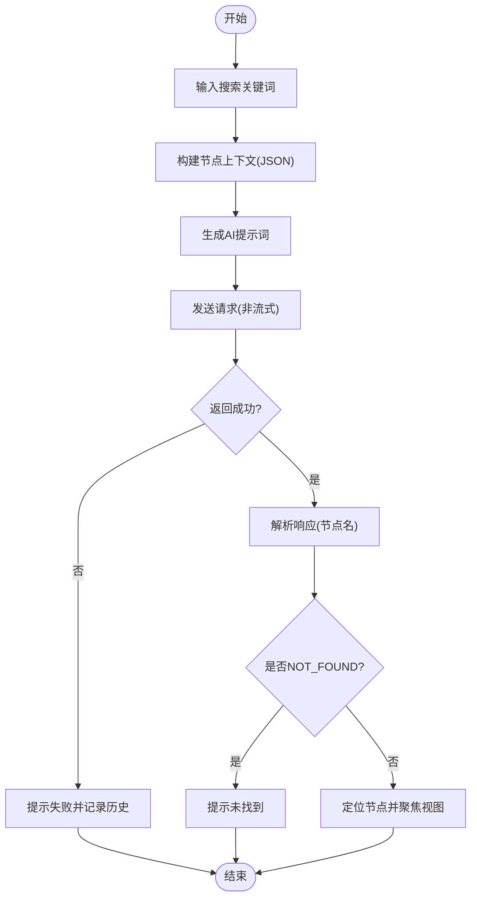
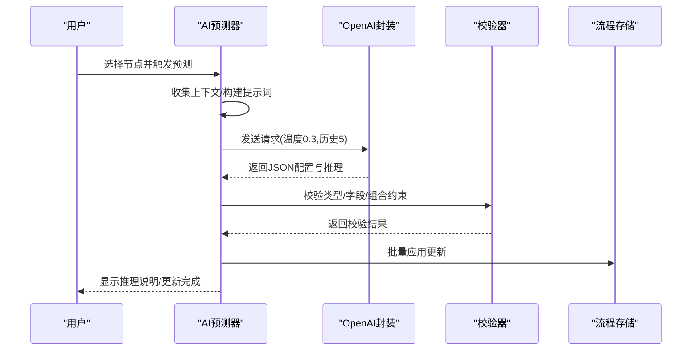
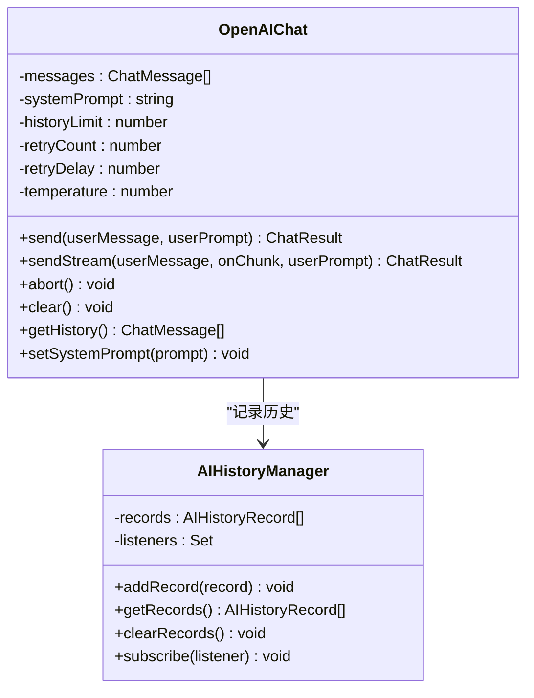
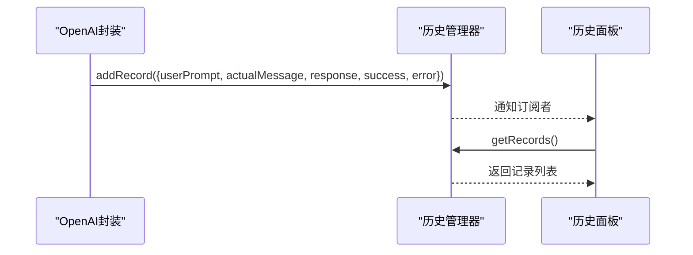
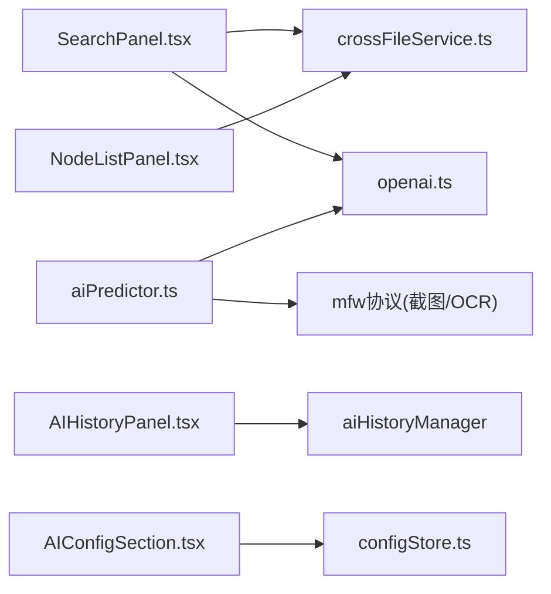

# AI辅助功能

<cite>
**本文档引用的文件**
- [aiPredictor.ts](file://src/utils/aiPredictor.ts)
- [openai.ts](file://src/utils/openai.ts)
- [SearchPanel.tsx](file://src/components/panels/main/SearchPanel.tsx)
- [AIHistoryPanel.tsx](file://src/components/panels/main/AIHistoryPanel.tsx)
- [AIConfigSection.tsx](file://src/components/panels/config/AIConfigSection.tsx)
- [crossFileService.ts](file://src/services/crossFileService.ts)
- [configStore.ts](file://src/stores/configStore.ts)
- [AdjacentInfoPanel.tsx](file://src/components/panels/main/AdjacentInfoPanel.tsx)
- [NodeListPanel.tsx](file://src/components/panels/main/node-list/NodeListPanel.tsx)
- [ErrorPanel.tsx](file://src/components/panels/main/ErrorPanel.tsx)
</cite>

## 目录
1. [简介](#简介)
2. [项目结构](#项目结构)
3. [核心组件](#核心组件)
4. [架构总览](#架构总览)
5. [详细组件分析](#详细组件分析)
6. [依赖关系分析](#依赖关系分析)
7. [性能考量](#性能考量)
8. [故障排查指南](#故障排查指南)
9. [结论](#结论)
10. [附录](#附录)

## 简介
本文件系统性阐述 MaaPipelineEditor 的 AI 辅助能力，覆盖智能搜索、节点级 AI 补全、推理预测、OpenAI 集成、AI 历史记录管理、配置与个性化设置、最佳实践与使用技巧，以及与传统编辑方式的互补关系。读者无需具备深厚技术背景，也能通过本指南高效使用 AI 功能提升工作流编辑效率。

## 项目结构
AI 功能围绕“提示词工程 + 对话管理 + 上下文采集 + 结果校验 + 历史记录 + 配置面板”组织，前端采用 React + Zustand 状态管理，后端通过本地桥接服务与设备交互，形成“前端 AI 调用 + 本地服务协同”的闭环。

**图表来源**
- [SearchPanel.tsx:1-414](file://src/components/panels/main/SearchPanel.tsx#L1-L414)
- [NodeListPanel.tsx:1-396](file://src/components/panels/main/node-list/NodeListPanel.tsx#L1-L396)
- [AIConfigSection.tsx:1-148](file://src/components/panels/config/AIConfigSection.tsx#L1-L148)
- [aiPredictor.ts:1-785](file://src/utils/aiPredictor.ts#L1-L785)
- [openai.ts:1-394](file://src/utils/openai.ts#L1-L394)
- [AIHistoryPanel.tsx:1-166](file://src/components/panels/main/AIHistoryPanel.tsx#L1-L166)
- [crossFileService.ts:1-565](file://src/services/crossFileService.ts#L1-L565)
- [configStore.ts:1-268](file://src/stores/configStore.ts#L1-L268)
- [ErrorPanel.tsx:1-38](file://src/components/panels/main/ErrorPanel.tsx#L1-L38)

**章节来源**
- [SearchPanel.tsx:1-414](file://src/components/panels/main/SearchPanel.tsx#L1-L414)
- [aiPredictor.ts:1-785](file://src/utils/aiPredictor.ts#L1-L785)
- [openai.ts:1-394](file://src/utils/openai.ts#L1-L394)
- [crossFileService.ts:1-565](file://src/services/crossFileService.ts#L1-L565)
- [configStore.ts:1-268](file://src/stores/configStore.ts#L1-L268)

## 核心组件
- 智能搜索系统：基于跨文件节点服务与 AI 提示词，实现节点级模糊搜索与精准定位。
- 节点级 AI 补全：采集上下文（前置节点、OCR、关键参数），生成识别/动作配置建议并进行严格校验。
- 推理预测系统：结合流程拓扑与 OCR 语义，进行逻辑验证与错误检测。
- OpenAI 集成：统一的聊天封装，支持非流式与流式响应、重试、历史裁剪、取消与安全校验。
- AI 历史记录管理：全局记录对话历史，支持查看、清空与订阅变更。
- 配置与个性化：API 地址、密钥、模型、跨文件搜索开关、历史面板开关等。

**章节来源**
- [aiPredictor.ts:74-172](file://src/utils/aiPredictor.ts#L74-L172)
- [openai.ts:48-87](file://src/utils/openai.ts#L48-L87)
- [SearchPanel.tsx:205-273](file://src/components/panels/main/SearchPanel.tsx#L205-L273)
- [AIConfigSection.tsx:1-148](file://src/components/panels/config/AIConfigSection.tsx#L1-L148)

## 架构总览
AI 辅助功能的运行链路如下：

**图表来源**
- [SearchPanel.tsx:205-273](file://src/components/panels/main/SearchPanel.tsx#L205-L273)
- [crossFileService.ts:207-268](file://src/services/crossFileService.ts#L207-L268)
- [openai.ts:169-243](file://src/utils/openai.ts#L169-L243)
- [AIHistoryPanel.tsx:82-166](file://src/components/panels/main/AIHistoryPanel.tsx#L82-L166)

## 详细组件分析

### 智能搜索系统（模糊搜索与精准推荐）
- 能力概述
  - 普通搜索：基于本地节点标签与完整名进行模糊匹配，支持当前文件优先与跨文件搜索。
  - AI 搜索：将节点上下文（识别类型、动作类型、参数）打包为提示词，交由 AI 推荐最匹配节点。
- 关键流程
  - 普通搜索：调用跨文件服务进行节点检索与排序，渲染下拉选项并支持跳转。
  - AI 搜索：构建系统提示词与用户提示词，发送请求，解析返回并定位节点。
- 与节点列表联动：节点列表面板提供筛选、分组与高亮，便于用户确认候选节点。

**图表来源**
- [SearchPanel.tsx:205-273](file://src/components/panels/main/SearchPanel.tsx#L205-L273)
- [crossFileService.ts:207-268](file://src/services/crossFileService.ts#L207-L268)

**章节来源**
- [SearchPanel.tsx:205-273](file://src/components/panels/main/SearchPanel.tsx#L205-L273)
- [crossFileService.ts:207-268](file://src/services/crossFileService.ts#L207-L268)
- [NodeListPanel.tsx:144-191](file://src/components/panels/main/node-list/NodeListPanel.tsx#L144-L191)

### 节点级 AI 补全机制（配置预测、参数建议、自动完成）
- 能力概述
  - 上下文采集：前置节点类型/连接关系/关键参数；OCR 文本与置信度框；节点标签与类型。
  - 提示词工程：系统知识（协议规范、字段约束、默认值策略）+ 用户提示词（上下文）。
  - AI 推理：生成 JSON 结构的识别/动作配置与推理说明。
  - 结果校验：类型合法性、字段有效性、组合约束（如 DirectHit 不允许识别参数）。
  - 应用更新：批量写入节点数据，避免重复渲染。
- 与自动完成联动：跨文件服务提供节点自动完成选项，结合 AI 补全提升配置效率。

**图表来源**
- [aiPredictor.ts:82-172](file://src/utils/aiPredictor.ts#L82-L172)
- [aiPredictor.ts:271-525](file://src/utils/aiPredictor.ts#L271-L525)
- [aiPredictor.ts:532-596](file://src/utils/aiPredictor.ts#L532-L596)
- [aiPredictor.ts:720-784](file://src/utils/aiPredictor.ts#L720-L784)
- [openai.ts:169-243](file://src/utils/openai.ts#L169-L243)

**章节来源**
- [aiPredictor.ts:74-172](file://src/utils/aiPredictor.ts#L74-L172)
- [aiPredictor.ts:271-525](file://src/utils/aiPredictor.ts#L271-L525)
- [aiPredictor.ts:532-596](file://src/utils/aiPredictor.ts#L532-L596)
- [aiPredictor.ts:720-784](file://src/utils/aiPredictor.ts#L720-L784)
- [crossFileService.ts:531-560](file://src/services/crossFileService.ts#L531-L560)

### 推理预测系统（流程分析、逻辑验证、错误检测）
- 流程分析：基于前置节点连接类型（next/jump_back/on_error）与顺序号，结合 OCR 文本，推断节点目的与应采用的识别/动作类型。
- 逻辑验证：字段匹配约束（识别类型专属字段与通用字段）、必填字段约束、类型选择逻辑（文字/图片/颜色/无条件）。
- 错误检测：DirectHit 不允许识别参数；OCR/Templates/Colors 等字段组合冲突；默认值不填策略减少冗余。
- 与错误面板联动：AI 校验失败或 API 调用异常时，错误面板展示诊断信息。

**图表来源**
- [aiPredictor.ts:598-713](file://src/utils/aiPredictor.ts#L598-L713)
- [ErrorPanel.tsx:8-38](file://src/components/panels/main/ErrorPanel.tsx#L8-L38)

**章节来源**
- [aiPredictor.ts:598-713](file://src/utils/aiPredictor.ts#L598-L713)
- [ErrorPanel.tsx:8-38](file://src/components/panels/main/ErrorPanel.tsx#L8-L38)

### OpenAI 集成（API 调用、模型选择、成本控制）
- 统一封装：OpenAIChat 类负责系统提示词、历史记录、重试、取消、流式/非流式响应、配置校验。
- 配置项：API 地址、API Key、模型名称、历史记录轮数、重试次数、重试间隔、温度。
- 成本控制：通过历史裁剪（非系统消息最多 2N 条）、温度降低（0.3）减少 token 消耗；提供测试连接按钮验证可用性。
- 跨域与安全：明文存储 API Key 于浏览器（LocalStorage），建议使用支持 CORS 的 API 中转服务。

**图表来源**
- [openai.ts:93-394](file://src/utils/openai.ts#L93-L394)
- [openai.ts:48-87](file://src/utils/openai.ts#L48-L87)

**章节来源**
- [openai.ts:115-129](file://src/utils/openai.ts#L115-L129)
- [openai.ts:169-243](file://src/utils/openai.ts#L169-L243)
- [openai.ts:251-358](file://src/utils/openai.ts#L251-L358)
- [AIConfigSection.tsx:36-43](file://src/components/panels/config/AIConfigSection.tsx#L36-L43)

### AI 历史记录管理（使用记录、效果评估、学习机制）
- 全局管理：AIHistoryManager 维护记录数组，支持添加、获取、清空与订阅通知。
- 记录内容：时间戳、用户输入、实际消息、AI 回复、成功标志、错误信息。
- 面板展示：支持展开查看实际消息、按成功/失败/含提示词分类、一键清空。
- 学习机制：通过历史记录回顾 AI 输出质量，优化提示词与系统提示词；结合邻接信息面板理解上下文影响。

**图表来源**
- [openai.ts:48-87](file://src/utils/openai.ts#L48-L87)
- [AIHistoryPanel.tsx:82-166](file://src/components/panels/main/AIHistoryPanel.tsx#L82-L166)

**章节来源**
- [openai.ts:48-87](file://src/utils/openai.ts#L48-L87)
- [AIHistoryPanel.tsx:82-166](file://src/components/panels/main/AIHistoryPanel.tsx#L82-L166)

### 配置选项与个性化设置
- AI 配置：API URL、API Key、模型名称；测试连接；跨文件搜索开关；AI 历史面板开关。
- 个性化：节点样式、字段面板模式、实时预览、磁吸对齐、画布背景模式等（与 AI 无关，但影响编辑体验）。
- 面板联动：AI 历史面板与配置面板联动，支持在配置面板中开启/关闭并查看历史。

**章节来源**
- [AIConfigSection.tsx:1-148](file://src/components/panels/config/AIConfigSection.tsx#L1-L148)
- [configStore.ts:115-144](file://src/stores/configStore.ts#L115-L144)
- [configStore.ts:256-267](file://src/stores/configStore.ts#L256-L267)

## 依赖关系分析
- 组件耦合
  - SearchPanel 依赖 crossFileService 与 openai.ts；NodeListPanel 依赖 crossFileService 与 AdjacentInfoPanel。
  - aiPredictor.ts 依赖 openai.ts、mfw 协议（截图/OCR）、字段定义（识别/动作字段键集合）。
  - AIHistoryPanel 依赖 aiHistoryManager；AIConfigSection 依赖 configStore。
- 外部依赖
  - 本地桥接服务（mfw 协议）提供截图与 OCR 能力，用于上下文采集。
  - 浏览器 Fetch API 调用 OpenAI 兼容接口，受 CORS 限制影响。

**图表来源**
- [SearchPanel.tsx:1-414](file://src/components/panels/main/SearchPanel.tsx#L1-L414)
- [crossFileService.ts:1-565](file://src/services/crossFileService.ts#L1-L565)
- [openai.ts:1-394](file://src/utils/openai.ts#L1-L394)
- [aiPredictor.ts:1-785](file://src/utils/aiPredictor.ts#L1-L785)
- [AIHistoryPanel.tsx:1-166](file://src/components/panels/main/AIHistoryPanel.tsx#L1-L166)
- [AIConfigSection.tsx:1-148](file://src/components/panels/config/AIConfigSection.tsx#L1-L148)
- [configStore.ts:1-268](file://src/stores/configStore.ts#L1-L268)

**章节来源**
- [SearchPanel.tsx:1-414](file://src/components/panels/main/SearchPanel.tsx#L1-L414)
- [aiPredictor.ts:1-785](file://src/utils/aiPredictor.ts#L1-L785)

## 性能考量
- 提示词长度控制：节点上下文 JSON 与系统知识较大，建议在构建提示词时裁剪关键字段（如 template 取前若干项）。
- 历史记录裁剪：非系统消息最多 2N 条，避免历史过长导致 token 消耗增加。
- 温度与重试：温度越低越稳定，重试次数与间隔需平衡稳定性与成本。
- 跨文件搜索：启用跨文件时节点列表较大，建议配合关键词过滤与类型筛选。
- UI 响应：AI 搜索与预测过程使用防抖与进度提示，避免频繁请求造成卡顿。

[本节为通用指导，无需列出章节来源]

## 故障排查指南
- API 配置问题
  - 症状：发送请求立即失败，历史记录显示配置错误。
  - 处理：检查 API URL、API Key、模型名称是否填写；使用“测试连接”按钮验证。
- CORS 跨域问题
  - 症状：浏览器报跨域错误。
  - 处理：使用支持 CORS 的 API 中转服务；确保后端正确配置跨域头。
- 截图/OCR 失败
  - 症状：OCR 识别失败或超时。
  - 处理：确认已连接设备且控制器 ID 有效；检查本地桥接服务状态。
- AI 返回格式异常
  - 症状：解析失败或返回非 JSON。
  - 处理：调整系统提示词，要求返回严格的 JSON；必要时降低温度。
- 节点定位失败
  - 症状：AI 推荐节点名不存在。
  - 处理：检查节点名是否包含前缀；使用普通搜索核对节点存在性。

**章节来源**
- [openai.ts:170-181](file://src/utils/openai.ts#L170-L181)
- [openai.ts:255-273](file://src/utils/openai.ts#L255-L273)
- [aiPredictor.ts:177-265](file://src/utils/aiPredictor.ts#L177-L265)
- [ErrorPanel.tsx:8-38](file://src/components/panels/main/ErrorPanel.tsx#L8-L38)

## 结论
MaaPipelineEditor 的 AI 辅助功能通过“智能搜索 + 节点级补全 + 推理校验 + 历史管理 + 集成封装”的体系，显著提升了节点配置效率与准确性。它与传统编辑方式互补：前者加速探索与纠错，后者保证细节与一致性。合理配置与使用技巧可进一步降低成本、提升稳定性与可维护性。

[本节为总结性内容，无需列出章节来源]

## 附录

### 最佳实践与使用技巧
- 搜索阶段
  - 先用普通搜索快速定位，再用 AI 搜索精确定位复杂场景。
  - 在跨文件环境中开启“跨文件搜索”，利用 AI 综合多文件上下文。
- 补全阶段
  - 优先提供 OCR 文本与关键参数，提升 AI 推理精度。
  - 使用较低温度（0.3）获得更稳定的配置建议。
- 校验与应用
  - 关注推理说明，理解 AI 选择的原因，必要时手动微调。
  - 利用历史面板回顾 AI 输出质量，逐步优化提示词。
- 配置与安全
  - API Key 存储于本地，避免在公共设备使用；建议使用中转服务。
  - 定期清理历史记录，减少 token 消耗与隐私风险。

[本节为通用指导，无需列出章节来源]