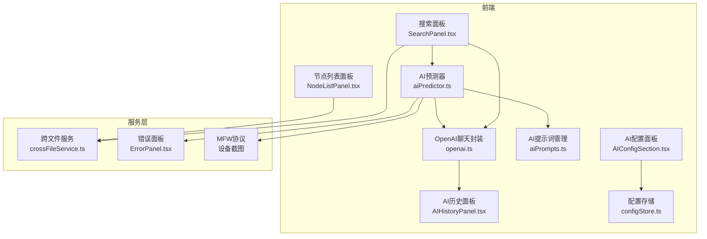
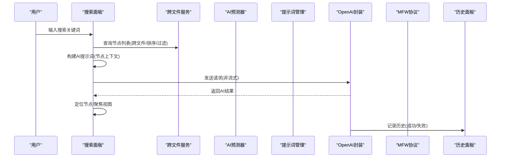
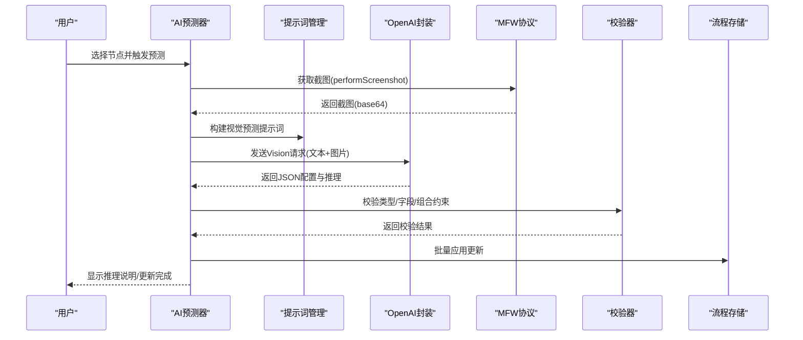
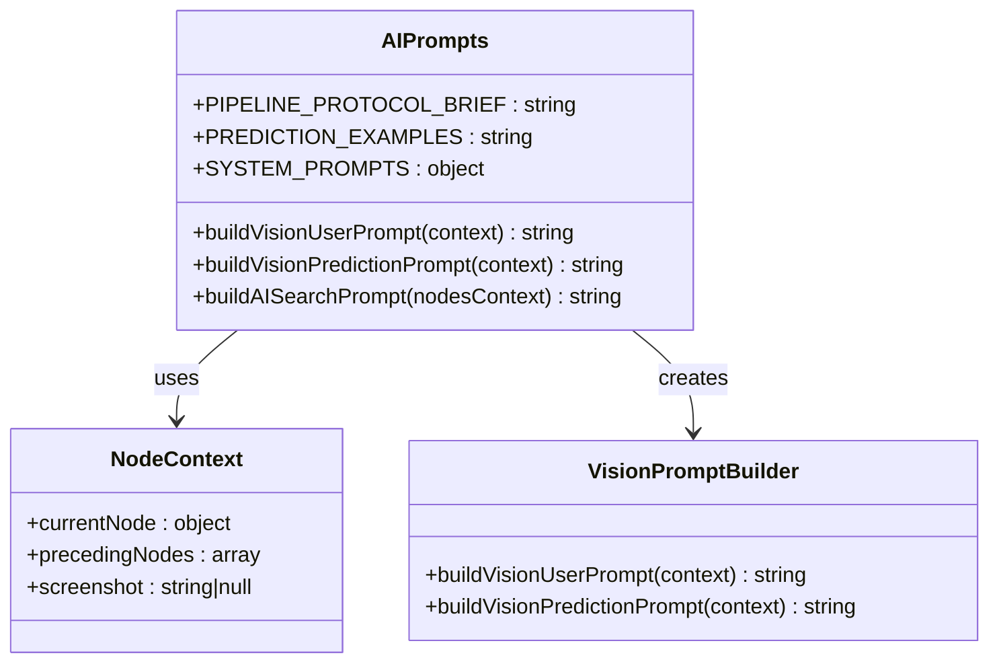
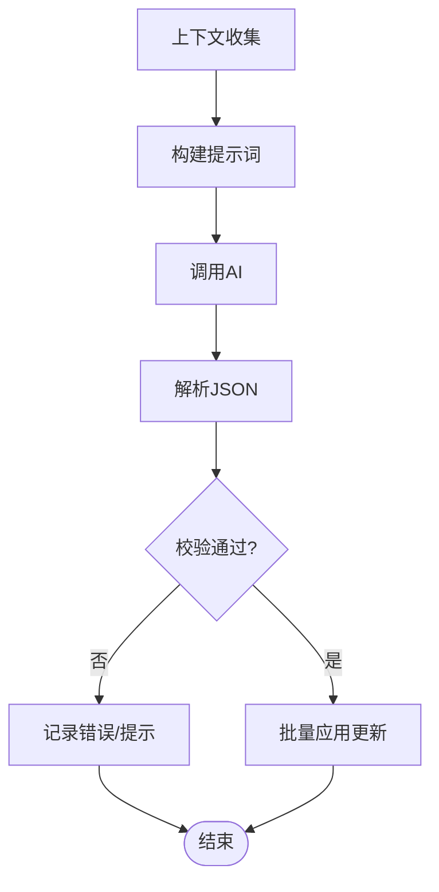
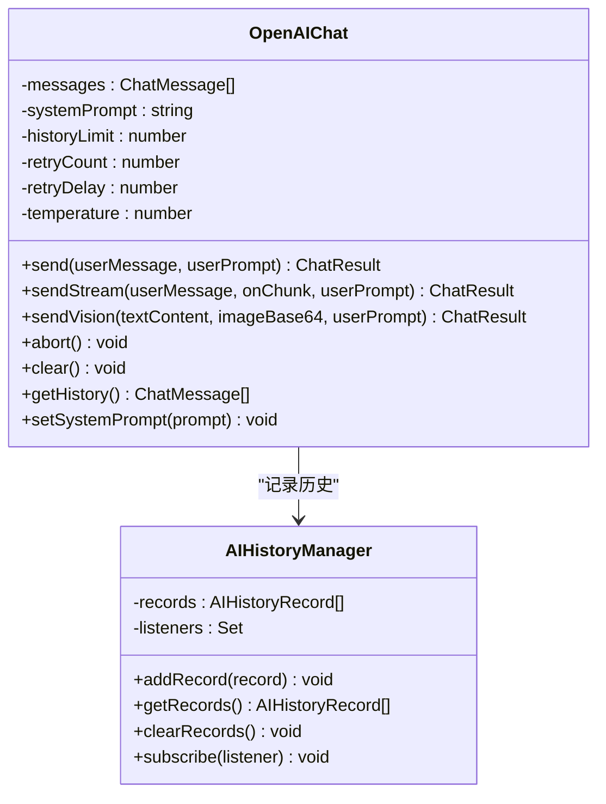
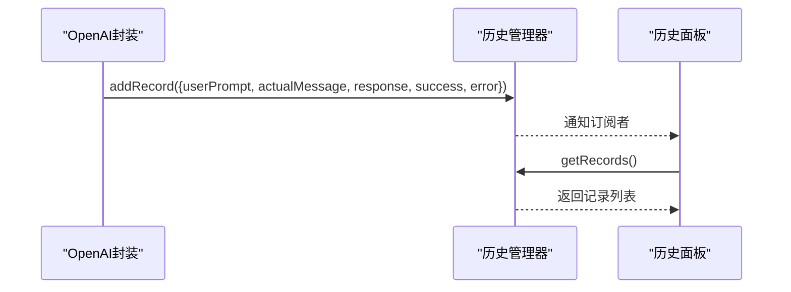
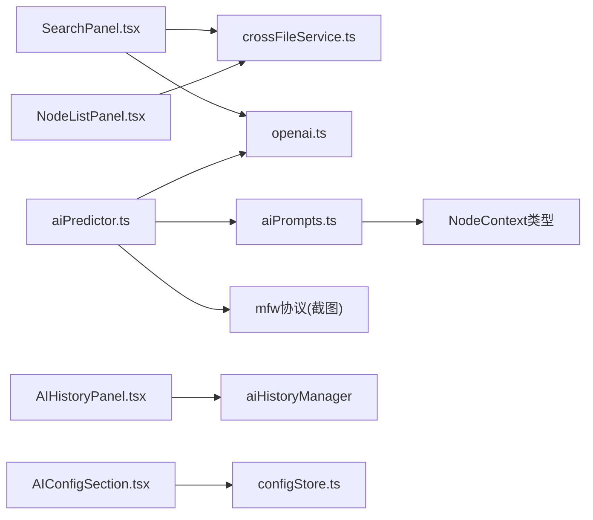

# AI辅助功能

<cite>
**本文档引用的文件**
- [aiPredictor.ts](file://src/utils/ai/aiPredictor.ts)
- [aiPrompts.ts](file://src/utils/ai/aiPrompts.ts)
- [openai.ts](file://src/utils/ai/openai.ts)
- [SearchPanel.tsx](file://src/components/panels/main/SearchPanel.tsx)
- [AIHistoryPanel.tsx](file://src/components/panels/main/AIHistoryPanel.tsx)
- [AIConfigSection.tsx](file://src/components/panels/config/AIConfigSection.tsx)
- [crossFileService.ts](file://src/services/crossFileService.ts)
- [configStore.ts](file://src/stores/configStore.ts)
- [AdjacentInfoPanel.tsx](file://src/components/panels/main/AdjacentInfoPanel.tsx)
- [NodeListPanel.tsx](file://src/components/panels/main/node-list/NodeListPanel.tsx)
- [ErrorPanel.tsx](file://src/components/panels/main/ErrorPanel.tsx)
</cite>

## 更新摘要
**变更内容**
- AI相关工具模块重构：从 src/utils/ 移动到 src/utils/ai/，提升代码组织清晰度
- AI预测系统得到增强，新增智能节点配置建议功能，支持更精确的配置预测
- 提升了AI工具的模块化程度，便于维护和扩展

## 目录
1. [简介](#简介)
2. [项目结构](#项目结构)
3. [核心组件](#核心组件)
4. [架构总览](#架构总览)
5. [详细组件分析](#详细组件分析)
6. [依赖关系分析](#依赖关系分析)
7. [性能考量](#性能考量)
8. [故障排查指南](#故障排查指南)
9. [结论](#结论)
10. [附录](#附录)

## 简介
本文件系统性阐述 MaaPipelineEditor 的 AI 辅助能力，覆盖智能搜索、节点级 AI 补全、推理预测、OpenAI 集成、AI 历史记录管理、配置与个性化设置、最佳实践与使用技巧，以及与传统编辑方式的互补关系。本次重大更新引入了全新的视觉AI预测系统，从传统的OCR识别转向基于截图的视觉分析，显著提升了AI辅助功能的实用性和准确性。

## 项目结构
AI功能围绕"提示词工程 + 视觉分析 + 对话管理 + 上下文采集 + 结果校验 + 历史记录 + 配置面板"组织，前端采用 React + Zustand 状态管理，后端通过本地桥接服务与设备交互，形成"前端 AI 调用 + 本地服务协同"的闭环。

**图表来源**
- [SearchPanel.tsx:1-406](file://src/components/panels/main/SearchPanel.tsx#L1-L406)
- [NodeListPanel.tsx:1-396](file://src/components/panels/main/node-list/NodeListPanel.tsx#L1-L396)
- [AIConfigSection.tsx:1-189](file://src/components/panels/config/AIConfigSection.tsx#L1-L189)
- [aiPrompts.ts:1-427](file://src/utils/ai/aiPrompts.ts#L1-L427)
- [aiPredictor.ts:1-583](file://src/utils/ai/aiPredictor.ts#L1-L583)
- [openai.ts:1-509](file://src/utils/ai/openai.ts#L1-L509)
- [AIHistoryPanel.tsx:1-166](file://src/components/panels/main/AIHistoryPanel.tsx#L1-L166)
- [crossFileService.ts:1-729](file://src/services/crossFileService.ts#L1-L729)
- [configStore.ts:1-287](file://src/stores/configStore.ts#L1-L287)
- [ErrorPanel.tsx:1-38](file://src/components/panels/main/ErrorPanel.tsx#L1-L38)

**章节来源**
- [SearchPanel.tsx:1-406](file://src/components/panels/main/SearchPanel.tsx#L1-L406)
- [aiPrompts.ts:1-427](file://src/utils/ai/aiPrompts.ts#L1-L427)
- [aiPredictor.ts:1-583](file://src/utils/ai/aiPredictor.ts#L1-L583)
- [openai.ts:1-509](file://src/utils/ai/openai.ts#L1-L509)
- [crossFileService.ts:1-729](file://src/services/crossFileService.ts#L1-L729)
- [configStore.ts:1-287](file://src/stores/configStore.ts#L1-L287)

## 核心组件
- **智能搜索系统**：基于跨文件节点服务与 AI 提示词，实现节点级模糊搜索与精准定位。
- **视觉AI预测系统**：基于截图视觉分析的节点级 AI 补全，替代传统OCR识别，提供更准确的配置建议。
- **提示词管理系统**：统一管理所有AI功能的提示词，包括协议规范、预测示例、系统提示词等。
- **推理预测系统**：结合流程拓扑与视觉分析，进行逻辑验证与错误检测。
- **OpenAI 集成**：统一的聊天封装，支持非流式与流式响应、重试、历史裁剪、取消与安全校验。
- **AI 历史记录管理**：全局记录对话历史，支持查看、清空与订阅变更。
- **配置与个性化**：API 地址、密钥、模型、跨文件搜索开关、历史面板开关等。

**章节来源**
- [aiPrompts.ts:8-427](file://src/utils/ai/aiPrompts.ts#L8-L427)
- [aiPredictor.ts:71-150](file://src/utils/ai/aiPredictor.ts#L71-L150)
- [openai.ts:100-509](file://src/utils/ai/openai.ts#L100-L509)
- [SearchPanel.tsx:205-273](file://src/components/panels/main/SearchPanel.tsx#L205-L273)
- [AIConfigSection.tsx:1-189](file://src/components/panels/config/AIConfigSection.tsx#L1-L189)

## 架构总览
AI 辅助功能的运行链路经过重大升级，现在基于视觉分析而非OCR识别：

**图表来源**
- [SearchPanel.tsx:205-273](file://src/components/panels/main/SearchPanel.tsx#L205-L273)
- [crossFileService.ts:207-268](file://src/services/crossFileService.ts#L207-L268)
- [openai.ts:188-262](file://src/utils/ai/openai.ts#L188-L262)
- [AIHistoryPanel.tsx:82-166](file://src/components/panels/main/AIHistoryPanel.tsx#L82-L166)

## 详细组件分析

### 智能搜索系统（模糊搜索与精准推荐）
- **能力概述**
  - 普通搜索：基于本地节点标签与完整名进行模糊匹配，支持当前文件优先与跨文件搜索。
  - AI 搜索：将节点上下文（识别类型、动作类型、参数）打包为提示词，交由 AI 推荐最匹配节点。
- **关键流程**
  - 普通搜索：调用跨文件服务进行节点检索与排序，渲染下拉选项并支持跳转。
  - AI 搜索：构建系统提示词与用户提示词，发送请求，解析返回并定位节点。
- **与节点列表联动**：节点列表面板提供筛选、分组与高亮，便于用户确认候选节点。

**图表来源**
- [SearchPanel.tsx:205-273](file://src/components/panels/main/SearchPanel.tsx#L205-L273)
- [crossFileService.ts:207-268](file://src/services/crossFileService.ts#L207-L268)

**章节来源**
- [SearchPanel.tsx:205-273](file://src/components/panels/main/SearchPanel.tsx#L205-L273)
- [crossFileService.ts:207-268](file://src/services/crossFileService.ts#L207-L268)
- [NodeListPanel.tsx:144-191](file://src/components/panels/main/node-list/NodeListPanel.tsx#L144-L191)

### 视觉AI预测系统（截图视觉分析与配置预测）
- **能力概述**
  - **视觉分析**：基于截图画面进行元素识别，包括按钮、文字、图标、输入框等可交互元素。
  - **智能推理**：根据节点名和画面内容推断最适合的识别类型和动作类型。
  - **配置生成**：自动生成JSON结构的识别/动作配置与推理说明。
  - **上下文收集**：前置节点类型/连接关系/关键参数；截图画面内容；节点标签与类型。
  - **结果校验**：类型合法性、字段有效性、组合约束（如 DirectHit 不允许识别参数）。
  - **应用更新**：批量写入节点数据，避免重复渲染。
- **与自动完成联动**：跨文件服务提供节点自动完成选项，结合AI补全提升配置效率。

**图表来源**
- [aiPredictor.ts:71-150](file://src/utils/ai/aiPredictor.ts#L71-L150)
- [aiPredictor.ts:155-203](file://src/utils/ai/aiPredictor.ts#L155-L203)
- [aiPredictor.ts:210-241](file://src/utils/ai/aiPredictor.ts#L210-L241)
- [aiPrompts.ts:118-183](file://src/utils/ai/aiPrompts.ts#L118-L183)
- [openai.ts:419-507](file://src/utils/ai/openai.ts#L419-L507)

**章节来源**
- [aiPredictor.ts:71-150](file://src/utils/ai/aiPredictor.ts#L71-L150)
- [aiPredictor.ts:155-203](file://src/utils/ai/aiPredictor.ts#L155-L203)
- [aiPredictor.ts:210-241](file://src/utils/ai/aiPredictor.ts#L210-L241)
- [aiPrompts.ts:118-183](file://src/utils/ai/aiPrompts.ts#L118-L183)
- [crossFileService.ts:531-560](file://src/services/crossFileService.ts#L531-L560)

### 提示词管理系统（统一提示词工程）
- **能力概述**
  - **协议规范**：MaaFramework Pipeline协议精要，包括识别类型、动作类型、关键参数和约束规则。
  - **预测示例**：正确的few-shot示例和错误示例，帮助AI理解期望输出格式。
  - **系统提示词**：SYSTEM_PROMPTS常量，包含PIPELINE_EXPERT和TEST_CONNECTION等预设提示词。
  - **用户提示词**：buildVisionUserPrompt函数，动态构建针对当前节点的视觉分析提示词。
  - **完整提示词**：buildVisionPredictionPrompt函数，组合协议规范、预测示例和用户提示词。
- **关键功能**
  - 统一管理所有AI功能的提示词，确保一致性。
  - 支持动态构建针对不同节点上下文的提示词。
  - 提供预设的系统提示词，简化AI调用。

**图表来源**
- [aiPrompts.ts:11-427](file://src/utils/ai/aiPrompts.ts#L11-L427)

**章节来源**
- [aiPrompts.ts:8-427](file://src/utils/ai/aiPrompts.ts#L8-L427)

### 推理预测系统（流程分析、逻辑验证、错误检测）
- **流程分析**：基于前置节点连接类型（next/jump_back/on_error）与顺序号，结合截图画面内容，推断节点目的与应采用的识别/动作类型。
- **逻辑验证**：字段匹配约束（识别类型专属字段与通用字段）、必填字段约束、类型选择逻辑（文字/图片/颜色/无条件）。
- **错误检测**：DirectHit 不允许识别参数；OCR/Templates/Colors 等字段组合冲突；默认值不填策略减少冗余。
- **与错误面板联动**：AI 校验失败或 API 调用异常时，错误面板展示诊断信息。

**图表来源**
- [aiPredictor.ts:285-395](file://src/utils/ai/aiPredictor.ts#L285-L395)
- [ErrorPanel.tsx:8-38](file://src/components/panels/main/ErrorPanel.tsx#L8-L38)

**章节来源**
- [aiPredictor.ts:285-395](file://src/utils/ai/aiPredictor.ts#L285-L395)
- [ErrorPanel.tsx:8-38](file://src/components/panels/main/ErrorPanel.tsx#L8-L38)

### OpenAI 集成（API 调用、模型选择、成本控制）
- **统一封装**：OpenAIChat 类负责系统提示词、历史记录、重试、取消、流式/非流式响应、配置校验。
- **视觉支持**：新增sendVision方法，支持文本+图片的视觉对话模式。
- **配置项**：API 地址、API Key、模型名称、历史记录轮数、重试次数、重试间隔、温度。
- **成本控制**：通过历史裁剪（非系统消息最多 2N 条）、温度降低（0.3）减少 token 消耗；提供测试连接按钮验证可用性。
- **跨域与安全**：明文存储 API Key 于浏览器（LocalStorage），建议使用支持 CORS 的 API 中转服务。

**图表来源**
- [openai.ts:100-509](file://src/utils/ai/openai.ts#L100-L509)
- [openai.ts:122-141](file://src/utils/ai/openai.ts#L122-L141)

**章节来源**
- [openai.ts:122-141](file://src/utils/ai/openai.ts#L122-L141)
- [openai.ts:188-262](file://src/utils/ai/openai.ts#L188-L262)
- [openai.ts:419-507](file://src/utils/ai/openai.ts#L419-L507)
- [AIConfigSection.tsx:36-43](file://src/components/panels/config/AIConfigSection.tsx#L36-L43)

### AI 历史记录管理（使用记录、效果评估、学习机制）
- **全局管理**：AIHistoryManager 维护记录数组，支持添加、获取、清空与订阅通知。
- **记录内容**：时间戳、用户输入、实际消息、AI 回复、成功标志、错误信息。
- **面板展示**：支持展开查看实际消息、按成功/失败/含提示词分类、一键清空。
- **学习机制**：通过历史记录回顾 AI 输出质量，优化提示词与系统提示词；结合邻接信息面板理解上下文影响。

**图表来源**
- [openai.ts:55-94](file://src/utils/ai/openai.ts#L55-L94)
- [AIHistoryPanel.tsx:82-166](file://src/components/panels/main/AIHistoryPanel.tsx#L82-L166)

**章节来源**
- [openai.ts:55-94](file://src/utils/ai/openai.ts#L55-L94)
- [AIHistoryPanel.tsx:82-166](file://src/components/panels/main/AIHistoryPanel.tsx#L82-L166)

### 配置选项与个性化设置
- **AI 配置**：API URL、API Key、模型名称；测试连接；跨文件搜索开关；AI 历史面板开关。
- **个性化**：节点样式、字段面板模式、实时预览、磁吸对齐、画布背景模式等（与 AI 无关，但影响编辑体验）。
- **面板联动**：AI 历史面板与配置面板联动，支持在配置面板中开启/关闭并查看历史。
- **模型要求**：节点预测功能需要支持视觉的模型（如GPT-4o、Claude-3.5-Sonnet、Qwen-VL等）。

**章节来源**
- [AIConfigSection.tsx:1-189](file://src/components/panels/config/AIConfigSection.tsx#L1-L189)
- [configStore.ts:177-287](file://src/stores/configStore.ts#L177-L287)
- [configStore.ts:256-267](file://src/stores/configStore.ts#L256-L267)

## 依赖关系分析
- **组件耦合**
  - SearchPanel 依赖 crossFileService 与 openai.ts；NodeListPanel 依赖 crossFileService 与 AdjacentInfoPanel。
  - aiPredictor.ts 依赖 aiPrompts.ts、openai.ts、mfw 协议（截图）、字段定义（识别/动作字段键集合）。
  - AIHistoryPanel 依赖 aiHistoryManager；AIConfigSection 依赖 configStore。
  - aiPrompts.ts 依赖 NodeContext 类型定义。
- **外部依赖**
  - 本地桥接服务（mfw 协议）提供截图能力，用于视觉分析上下文采集。
  - 浏览器 Fetch API 调用 OpenAI 兼容接口，受 CORS 限制影响。

**图表来源**
- [SearchPanel.tsx:1-406](file://src/components/panels/main/SearchPanel.tsx#L1-L406)
- [crossFileService.ts:1-729](file://src/services/crossFileService.ts#L1-L729)
- [openai.ts:1-509](file://src/utils/ai/openai.ts#L1-L509)
- [aiPredictor.ts:1-583](file://src/utils/ai/aiPredictor.ts#L1-L583)
- [aiPrompts.ts:1-427](file://src/utils/ai/aiPrompts.ts#L1-L427)
- [AIHistoryPanel.tsx:1-166](file://src/components/panels/main/AIHistoryPanel.tsx#L1-L166)
- [AIConfigSection.tsx:1-189](file://src/components/panels/config/AIConfigSection.tsx#L1-L189)
- [configStore.ts:1-287](file://src/stores/configStore.ts#L1-L287)

**章节来源**
- [SearchPanel.tsx:1-406](file://src/components/panels/main/SearchPanel.tsx#L1-L406)
- [aiPredictor.ts:1-583](file://src/utils/ai/aiPredictor.ts#L1-L583)
- [aiPrompts.ts:1-427](file://src/utils/ai/aiPrompts.ts#L1-L427)

## 性能考量
- **提示词长度控制**：节点上下文 JSON 与系统知识较大，建议在构建提示词时裁剪关键字段（如 template 取前若干项）。
- **历史记录裁剪**：非系统消息最多 2N 条，避免历史过长导致 token 消耗增加。
- **温度与重试**：温度越低越稳定，重试次数与间隔需平衡稳定性与成本。
- **跨文件搜索**：启用跨文件时节点列表较大，建议配合关键词过滤与类型筛选。
- **UI 响应**：AI 搜索与预测过程使用防抖与进度提示，避免频繁请求造成卡顿。
- **视觉分析优化**：截图获取超时控制在10秒内，避免长时间等待影响用户体验。

## 故障排查指南
- **API 配置问题**
  - 症状：发送请求立即失败，历史记录显示配置错误。
  - 处理：检查 API URL、API Key、模型名称是否填写；使用"测试连接"按钮验证。
- **CORS 跨域问题**
  - 症状：浏览器报跨域错误。
  - 处理：使用支持 CORS 的 API 中转服务；确保后端正确配置跨域头。
- **截图获取失败**
  - 症状：AI预测失败，提示截图获取失败。
  - 处理：确认已连接设备且控制器 ID 有效；检查本地桥接服务状态；确保设备屏幕可访问。
- **AI 返回格式异常**
  - 症状：解析失败或返回非 JSON。
  - 处理：调整系统提示词，要求返回严格的 JSON；必要时降低温度。
- **节点定位失败**
  - 症状：AI 推荐节点名不存在。
  - 处理：检查节点名是否包含前缀；使用普通搜索核对节点存在性。
- **视觉模型兼容性**
  - 症状：sendVision调用失败或返回空结果。
  - 处理：确认使用支持视觉的模型（如GPT-4o、Claude-3.5-Sonnet、Qwen-VL等）；检查模型是否支持多模态输入。

**章节来源**
- [openai.ts:188-262](file://src/utils/ai/openai.ts#L188-L262)
- [openai.ts:419-507](file://src/utils/ai/openai.ts#L419-L507)
- [aiPredictor.ts:155-203](file://src/utils/ai/aiPredictor.ts#L155-L203)
- [ErrorPanel.tsx:8-38](file://src/components/panels/main/ErrorPanel.tsx#L8-L38)

## 结论
MaaPipelineEditor 的 AI 辅助功能经过重大升级，通过"智能搜索 + 视觉AI预测 + 推理校验 + 历史管理 + 集成封装"的新体系，显著提升了节点配置效率与准确性。新的视觉AI预测系统替代了传统的OCR识别，基于截图画面进行智能分析，提供更准确的配置建议。它与传统编辑方式互补：前者加速探索与纠错，后者保证细节与一致性。合理配置与使用技巧可进一步降低成本、提升稳定性与可维护性。

## 附录

### 最佳实践与使用技巧
- **搜索阶段**
  - 先用普通搜索快速定位，再用 AI 搜索精确定位复杂场景。
  - 在跨文件环境中开启"跨文件搜索"，利用 AI 综合多文件上下文。
- **视觉预测阶段**
  - 确保设备连接正常，截图能够成功获取。
  - 优先提供清晰的界面截图，提升AI视觉分析准确性。
  - 使用较低温度（0.3-0.7）获得更稳定的配置建议。
- **校验与应用**
  - 关注推理说明，理解 AI 选择的原因，必要时手动微调。
  - 利用历史面板回顾 AI 输出质量，逐步优化提示词。
- **配置与安全**
  - API Key 存储于本地，避免在公共设备使用；建议使用中转服务。
  - 定期清理历史记录，减少 token 消耗与隐私风险。
  - 确保使用支持视觉的模型，以获得最佳的AI预测效果。

### AI提示系统详细规范

#### 识别类型详解
- **DirectHit**：不识别，直接命中，仅可用 roi 指定区域
- **TemplateMatch**：模板匹配/找图，支持 threshold、method、green_mask
- **OCR**：文字识别，支持 expected、threshold、replace、only_rec
- **ColorMatch**：颜色匹配，支持 lower、upper、count、method、connected
- **FeatureMatch**：特征匹配（抗透视/缩放），支持 template、count、detector、ratio
- **NeuralNetworkClassify**：深度学习分类（固定位置），支持 model、labels、expected
- **NeuralNetworkDetect**：深度学习检测（任意位置），支持 model、labels、expected、threshold
- **And/Or**：组合识别（逻辑与/或），支持 all_of、any_of、box_index、sub_name
- **Custom**：自定义识别器，支持 custom_recognition、custom_recognition_param

#### 动作类型详解
- **DoNothing**：无动作
- **Click/LongPress**：点击/长按，支持 target、target_offset、contact、duration
- **Swipe/MultiSwipe**：线性滑动/多指滑动，支持 begin、end、duration、end_hold、swipes[]
- **Scroll**：滚轮滚动（仅Win32），支持 target、dx、dy
- **TouchDown/TouchMove/TouchUp**：触控点操作，支持 contact、target
- **ClickKey/LongPressKey**：按键操作，支持 key[]、duration
- **KeyDown/KeyUp**：按键状态，支持 key
- **InputText**：输入文本，支持 input_text
- **StartApp/StopApp**：应用启停，支持 package
- **StopTask/Command/Shell/Screencap**：任务停止/命令执行/ADB命令/截图保存
- **Custom**：自定义动作，支持 custom_action、custom_action_param、target

#### 协议约束规则
- **DirectHit 不需要识别参数**：不要设置 expected、template 等
- **OCR 设置 expected**：匹配期望文字（支持正则），不要设置 template
- **TemplateMatch 设置 template**：模板图片路径，不要设置 expected
- **ColorMatch 必填 lower/upper**：颜色范围，method 默认 4(RGB)
- **And/Or 组合识别**：all_of/any_of 中可内联定义或引用节点名

#### 设计模式
- **图标按钮识别**：图标无文字时使用 TemplateMatch，有文字优先 OCR
- **多状态按钮**：同一按钮可能有多种外观，使用 Or 组合
- **多条件验证**：同时验证多个条件，使用 And + sub_name
- **固定位置操作**：滑动、点击固定位置使用 DirectHit
- **文本输入**：先点击输入框，再输入文本（通常需要两个节点）

#### 性能优化提示
- **roi 精确裁剪**：缩小识别区域既提升速度又减少误识别
- **green_mask 遮盖干扰**：模板图片中不需要匹配的区域涂绿 (0,255,0)
- **threshold 调优**：TemplateMatch 建议 0.7，OCR 建议 0.3
- **method 选择**：TemplateMatch 默认 5(CCOEFF_NORMED)，对光照变化鲁棒
- **detector 选择**：FeatureMatch 默认 SIFT 精度最高，ORB 最快但无尺度不变性
- **connected 选项**：ColorMatch 时设置 true 可过滤噪点
- **only_rec 选项**：OCR 设置 true 跳过检测，仅识别（需精确 roi）