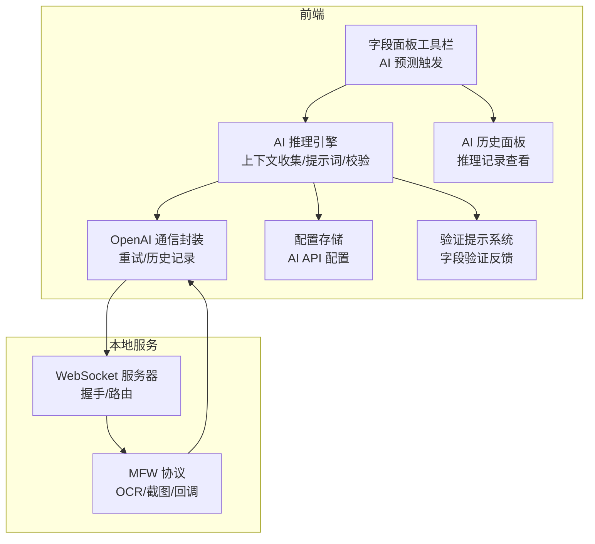
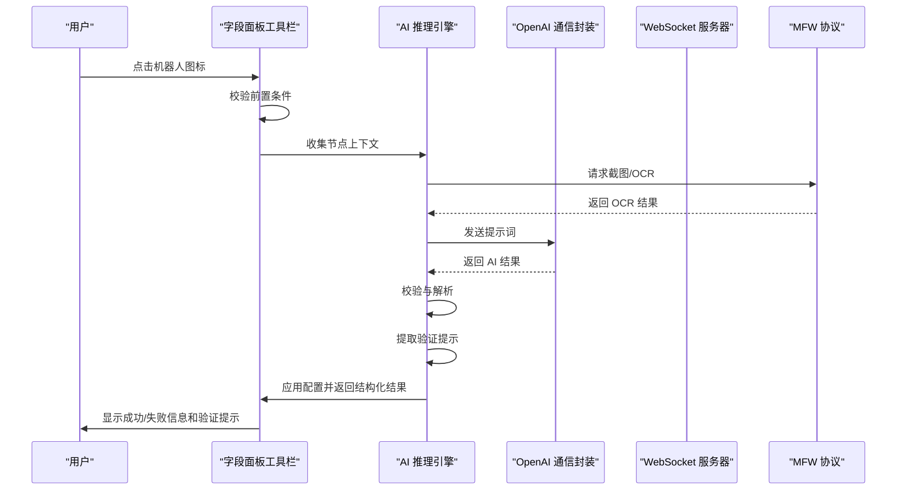
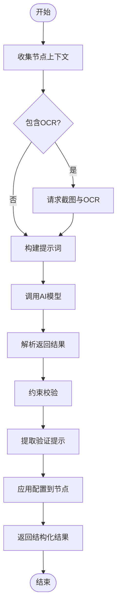
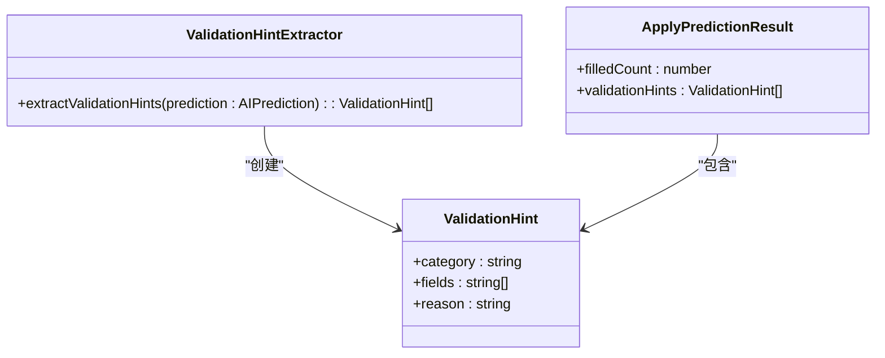
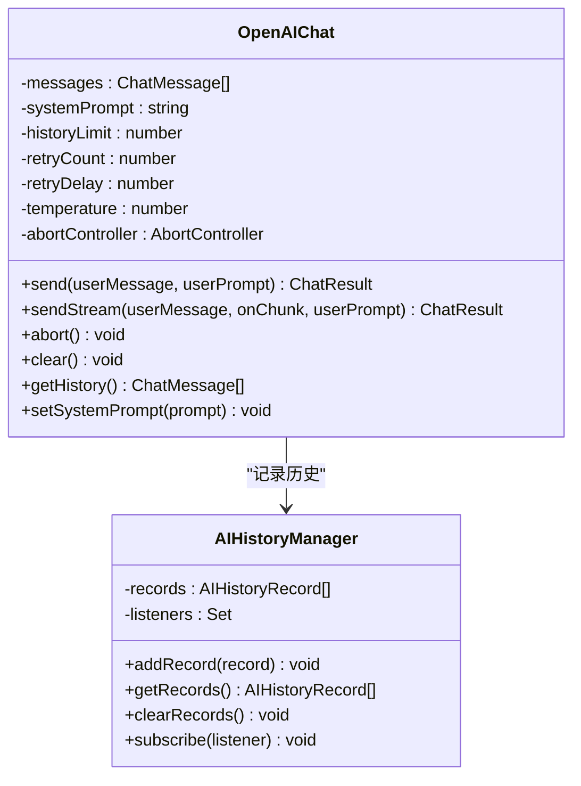
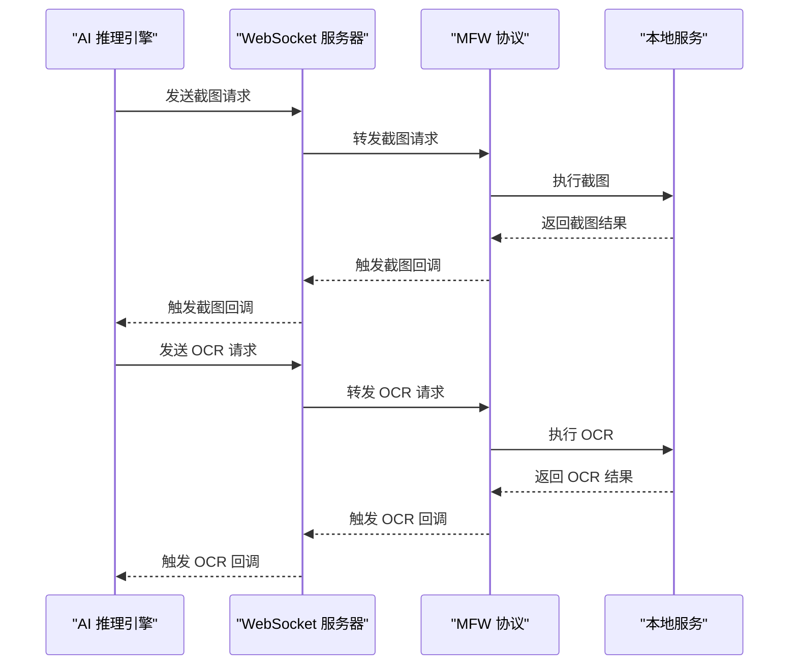
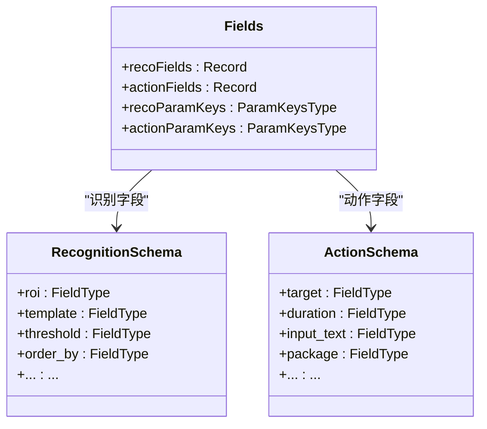
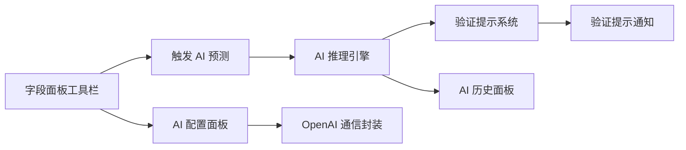
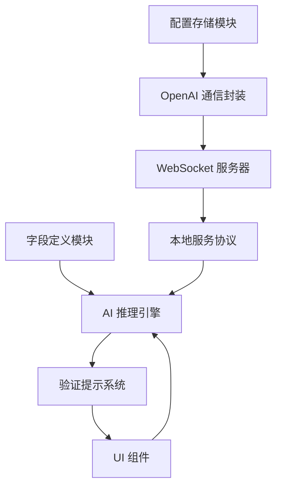

# 推理预测系统

<cite>
**本文档引用的文件**
- [aiPredictor.ts](file://src/utils/aiPredictor.ts)
- [openai.ts](file://src/utils/openai.ts)
- [server.ts](file://src/services/server.ts)
- [mfwStore.ts](file://src/stores/mfwStore.ts)
- [configStore.ts](file://src/stores/configStore.ts)
- [fields.ts](file://src/core/fields/action/fields.ts)
- [fields.ts](file://src/core/fields/recognition/fields.ts)
- [index.ts](file://src/core/fields/index.ts)
- [schema.ts](file://src/core/fields/action/schema.ts)
- [schema.ts](file://src/core/fields/recognition/schema.ts)
- [FieldPanelToolbar.tsx](file://src/components/panels/field/tools/FieldPanelToolbar.tsx)
- [AIHistoryPanel.tsx](file://src/components/panels/main/AIHistoryPanel.tsx)
- [AIConfigSection.tsx](file://src/components/panels/config/AIConfigSection.tsx)
- [MFWProtocol.ts](file://src/services/protocols/MFWProtocol.ts)
- [AI 服务.md](file://docsite/docs/01.指南/20.本地服务/50.AI 服务.md)
</cite>

## 更新摘要
**变更内容**
- 更新了 `applyPrediction` 函数的返回结构，现在返回包含 `filledCount` 和 `validationHints` 的结构化结果
- 新增了验证提示机制，提供详细的字段验证反馈
- 增强了 UI 层面的用户反馈，包括字段填充统计和验证提示通知
- 完善了约束校验和验证提示的提取逻辑

## 目录
1. [简介](#简介)
2. [项目结构](#项目结构)
3. [核心组件](#核心组件)
4. [架构总览](#架构总览)
5. [详细组件分析](#详细组件分析)
6. [依赖关系分析](#依赖关系分析)
7. [性能考量](#性能考量)
8. [故障排除指南](#故障排除指南)
9. [结论](#结论)
10. [附录](#附录)

## 简介
本推理预测系统旨在为 MaaFramework Pipeline 工作流提供智能化的节点配置推断能力。系统通过收集节点上下文、构建提示词、调用外部 AI 模型、解析返回结果并进行严格校验，最终将合理的配置自动填充到节点中。整个流程涵盖上下文采集、提示词构建、模型调用、结果解析与约束校验、以及与本地服务的 OCR 集成。

**更新** 系统现已增强验证反馈机制，`applyPrediction` 函数返回结构化结果，包括字段填充计数和验证提示，为用户提供更详细的推理依据和验证指导。

## 项目结构
系统采用前后端分离的架构设计，前端负责 UI 交互与推理流程编排，后端本地服务负责设备连接与 OCR 等底层能力。核心模块包括：
- 推理引擎：负责上下文收集、提示词构建、AI 调用、结果解析与校验
- AI 通信：封装 OpenAI 兼容 API 的调用、重试与历史记录
- 本地服务集成：通过 WebSocket 与本地服务通信，实现 OCR 截图与结果回调
- 配置管理：集中管理 AI API 配置与 UI 状态
- 字段定义：统一管理识别与动作类型的字段 Schema，确保参数合法性
- 验证提示系统：提供结构化的验证反馈机制

**图表来源**
- [FieldPanelToolbar.tsx:119-183](file://src/components/panels/field/tools/FieldPanelToolbar.tsx#L119-L183)
- [aiPredictor.ts:532-559](file://src/utils/aiPredictor.ts#L532-L559)
- [openai.ts:169-243](file://src/utils/openai.ts#L169-L243)
- [server.ts:104-251](file://src/services/server.ts#L104-L251)
- [MFWProtocol.ts:436-499](file://src/services/protocols/MFWProtocol.ts#L436-L499)

**章节来源**
- [FieldPanelToolbar.tsx:119-183](file://src/components/panels/field/tools/FieldPanelToolbar.tsx#L119-L183)
- [aiPredictor.ts:82-172](file://src/utils/aiPredictor.ts#L82-L172)
- [openai.ts:93-113](file://src/utils/openai.ts#L93-L113)
- [server.ts:20-35](file://src/services/server.ts#L20-L35)
- [MFWProtocol.ts:38-97](file://src/services/protocols/MFWProtocol.ts#L38-L97)

## 核心组件
- AI 推理引擎：负责收集节点上下文、构建提示词、调用 AI、解析与校验结果、应用到节点
- OpenAI 通信封装：封装 API 调用、重试策略、历史记录与流式响应
- 本地服务协议：通过 WebSocket 与本地服务通信，处理 OCR 与截图请求
- 配置存储：集中管理 AI API URL、Key、Model 等配置
- 字段 Schema：统一管理识别与动作类型的字段定义，确保参数合法性
- 验证提示系统：提取需要人工验证的字段，提供分类和原因说明

**章节来源**
- [aiPredictor.ts:532-784](file://src/utils/aiPredictor.ts#L532-L784)
- [openai.ts:93-393](file://src/utils/openai.ts#L93-L393)
- [MFWProtocol.ts:436-499](file://src/services/protocols/MFWProtocol.ts#L436-L499)
- [configStore.ts:95-144](file://src/stores/configStore.ts#L95-L144)
- [fields.ts:7-114](file://src/core/fields/recognition/fields.ts#L7-L114)
- [fields.ts:7-148](file://src/core/fields/action/fields.ts#L7-L148)

## 架构总览
推理预测系统的核心流程如下：
1. 用户在字段面板触发 AI 预测
2. 系统检查前置条件（本地服务连接、设备连接、OCR 配置、AI API 配置）
3. 收集节点上下文（前置节点、连接类型、关键参数、OCR 结果）
4. 构建提示词（系统知识 + 用户提示）
5. 调用 OpenAI 兼容 API
6. 解析返回结果并进行严格校验（类型匹配、字段有效性、业务规则）
7. 应用预测结果到节点字段，返回结构化结果
8. 提取验证提示，显示需要人工验证的字段
9. 记录历史并可查看推理依据

**图表来源**
- [FieldPanelToolbar.tsx:120-183](file://src/components/panels/field/tools/FieldPanelToolbar.tsx#L120-L183)
- [aiPredictor.ts:82-172](file://src/utils/aiPredictor.ts#L82-L172)
- [aiPredictor.ts:532-559](file://src/utils/aiPredictor.ts#L532-L559)
- [openai.ts:169-243](file://src/utils/openai.ts#L169-L243)
- [MFWProtocol.ts:436-499](file://src/services/protocols/MFWProtocol.ts#L436-L499)

## 详细组件分析

### AI 推理引擎
AI 推理引擎是系统的核心，负责完整的推理流程：
- 上下文收集：遍历前置节点，提取连接类型、识别/动作类型、关键参数
- OCR 集成：通过本地服务请求截图与 OCR，降级处理失败情况
- 提示词构建：内置系统知识与用户提示，约束字段匹配、必填字段、类型选择逻辑
- AI 调用：封装 OpenAIChat，支持温度参数与历史记录
- 结果解析：移除 Markdown 标记，解析 JSON，验证格式完整性
- 约束校验：类型存在性检查、字段有效性检查、无效组合过滤、默认值处理
- 应用配置：批量更新节点数据，返回结构化结果

**更新** `applyPrediction` 函数现在返回 `ApplyPredictionResult` 接口，包含：
- `filledCount`: 成功填充的字段数量
- `validationHints`: 需要人工验证的字段提示数组

**图表来源**
- [aiPredictor.ts:82-172](file://src/utils/aiPredictor.ts#L82-L172)
- [aiPredictor.ts:271-525](file://src/utils/aiPredictor.ts#L271-L525)
- [aiPredictor.ts:532-559](file://src/utils/aiPredictor.ts#L532-L559)
- [aiPredictor.ts:564-596](file://src/utils/aiPredictor.ts#L564-L596)
- [aiPredictor.ts:603-713](file://src/utils/aiPredictor.ts#L603-L713)
- [aiPredictor.ts:720-784](file://src/utils/aiPredictor.ts#L720-L784)

**章节来源**
- [aiPredictor.ts:82-172](file://src/utils/aiPredictor.ts#L82-L172)
- [aiPredictor.ts:271-525](file://src/utils/aiPredictor.ts#L271-L525)
- [aiPredictor.ts:532-559](file://src/utils/aiPredictor.ts#L532-L559)
- [aiPredictor.ts:564-596](file://src/utils/aiPredictor.ts#L564-L596)
- [aiPredictor.ts:603-713](file://src/utils/aiPredictor.ts#L603-L713)
- [aiPredictor.ts:720-784](file://src/utils/aiPredictor.ts#L720-L784)

### 验证提示系统
新增的验证提示系统提供结构化的字段验证反馈机制：
- `ValidationHint` 接口定义：包含类别、字段列表和原因说明
- `extractValidationHints` 函数：从预测结果中提取需要人工验证的字段
- 支持的验证类别：识别区域、模板图片、颜色范围、模型文件、目标坐标、应用包名、输入内容
- 自动检测：根据识别类型和参数自动判断需要验证的字段

**图表来源**
- [aiPredictor.ts:67-71](file://src/utils/aiPredictor.ts#L67-L71)
- [aiPredictor.ts:77-163](file://src/utils/aiPredictor.ts#L77-L163)
- [aiPredictor.ts:501-504](file://src/utils/aiPredictor.ts#L501-L504)

**章节来源**
- [aiPredictor.ts:67-71](file://src/utils/aiPredictor.ts#L67-L71)
- [aiPredictor.ts:77-163](file://src/utils/aiPredictor.ts#L77-L163)
- [aiPredictor.ts:501-504](file://src/utils/aiPredictor.ts#L501-L504)

### OpenAI 通信封装
OpenAI 通信封装提供统一的 API 调用接口，包含：
- 配置校验：API URL、Key、Model 的完整性检查
- 请求构建：消息历史维护、温度参数、模型参数
- 重试机制：可配置重试次数与间隔
- 历史记录：记录每次请求与响应，支持清空与订阅
- 流式响应：支持流式输出回调
- 取消请求：AbortController 支持中断请求

**图表来源**
- [openai.ts:93-113](file://src/utils/openai.ts#L93-L113)
- [openai.ts:48-87](file://src/utils/openai.ts#L48-L87)
- [openai.ts:169-243](file://src/utils/openai.ts#L169-L243)
- [openai.ts:251-358](file://src/utils/openai.ts#L251-L358)

**章节来源**
- [openai.ts:115-128](file://src/utils/openai.ts#L115-L128)
- [openai.ts:130-157](file://src/utils/openai.ts#L130-L157)
- [openai.ts:169-243](file://src/utils/openai.ts#L169-L243)
- [openai.ts:251-358](file://src/utils/openai.ts#L251-L358)
- [openai.ts:360-393](file://src/utils/openai.ts#L360-L393)

### 本地服务集成（WebSocket 与 MFW 协议）
系统通过 WebSocket 与本地服务通信，实现设备连接与 OCR 能力：
- WebSocket 服务器：负责握手、路由注册、连接状态管理
- MFW 协议：处理设备列表、控制器创建、截图与 OCR 回调
- OCR 流程：截图请求 -> OCR 请求 -> 结果回调 -> 上下文构建

**图表来源**
- [server.ts:104-251](file://src/services/server.ts#L104-L251)
- [MFWProtocol.ts:436-499](file://src/services/protocols/MFWProtocol.ts#L436-L499)
- [aiPredictor.ts:177-265](file://src/utils/aiPredictor.ts#L177-L265)

**章节来源**
- [server.ts:20-35](file://src/services/server.ts#L20-L35)
- [server.ts:104-251](file://src/services/server.ts#L104-L251)
- [MFWProtocol.ts:38-97](file://src/services/protocols/MFWProtocol.ts#L38-L97)
- [MFWProtocol.ts:436-499](file://src/services/protocols/MFWProtocol.ts#L436-L499)
- [mfwStore.ts:72-97](file://src/stores/mfwStore.ts#L72-L97)

### 字段定义与约束校验
系统通过统一的字段 Schema 管理识别与动作类型，确保参数合法性：
- 识别类型：DirectHit、OCR、TemplateMatch、ColorMatch、FeatureMatch、NeuralNetworkClassify、NeuralNetworkDetect 等
- 动作类型：DoNothing、Click、LongPress、Swipe、InputText、StartApp、StopApp、ClickKey 等
- 字段约束：必填字段、类型匹配、默认值、无效组合过滤
- 参数键生成：自动生成参数键列表，支持大小写转换

**图表来源**
- [index.ts:37-44](file://src/core/fields/index.ts#L37-L44)
- [fields.ts:7-114](file://src/core/fields/recognition/fields.ts#L7-L114)
- [fields.ts:7-148](file://src/core/fields/action/fields.ts#L7-L148)
- [schema.ts:9-276](file://src/core/fields/recognition/schema.ts#L9-L276)
- [schema.ts:9-299](file://src/core/fields/action/schema.ts#L9-L299)

**章节来源**
- [index.ts:37-44](file://src/core/fields/index.ts#L37-L44)
- [fields.ts:7-114](file://src/core/fields/recognition/fields.ts#L7-L114)
- [fields.ts:7-148](file://src/core/fields/action/fields.ts#L7-L148)
- [schema.ts:9-276](file://src/core/fields/recognition/schema.ts#L9-L276)
- [schema.ts:9-299](file://src/core/fields/action/schema.ts#L9-L299)

### UI 交互与历史记录
- 字段面板工具栏：提供 AI 预测按钮，触发推理流程并处理错误提示
- AI 历史面板：展示每次推理的输入、输出与错误信息，支持清空
- AI 配置面板：管理 API URL、Key、Model，并提供测试连接功能
- 验证提示通知：显示需要人工验证的字段和原因

**更新** UI 现在显示结构化结果：
- 字段填充统计：显示成功填充的字段数量
- 验证提示通知：弹出通知显示需要验证的字段类别和具体字段
- 详细推理依据：可在 AI 历史面板中查看完整的推理过程

**图表来源**
- [FieldPanelToolbar.tsx:119-183](file://src/components/panels/field/tools/FieldPanelToolbar.tsx#L119-L183)
- [AIHistoryPanel.tsx:83-163](file://src/components/panels/main/AIHistoryPanel.tsx#L83-L163)
- [AIConfigSection.tsx:11-148](file://src/components/panels/config/AIConfigSection.tsx#L11-L148)

**章节来源**
- [FieldPanelToolbar.tsx:119-183](file://src/components/panels/field/tools/FieldPanelToolbar.tsx#L119-L183)
- [AIHistoryPanel.tsx:83-163](file://src/components/panels/main/AIHistoryPanel.tsx#L83-L163)
- [AIConfigSection.tsx:11-148](file://src/components/panels/config/AIConfigSection.tsx#L11-L148)

## 依赖关系分析
系统各模块之间的依赖关系如下：
- 字段定义模块为推理引擎提供类型与参数键映射
- 配置存储模块为 OpenAI 通信封装提供 API 配置
- 本地服务协议为推理引擎提供 OCR 与截图能力
- UI 组件负责触发推理流程并展示结果
- 验证提示系统为 UI 提供结构化的验证反馈

**图表来源**
- [index.ts:37-44](file://src/core/fields/index.ts#L37-L44)
- [configStore.ts:95-144](file://src/stores/configStore.ts#L95-L144)
- [openai.ts:115-119](file://src/utils/openai.ts#L115-L119)
- [server.ts:104-251](file://src/services/server.ts#L104-L251)
- [MFWProtocol.ts:436-499](file://src/services/protocols/MFWProtocol.ts#L436-L499)

**章节来源**
- [index.ts:37-44](file://src/core/fields/index.ts#L37-L44)
- [configStore.ts:95-144](file://src/stores/configStore.ts#L95-L144)
- [openai.ts:115-119](file://src/utils/openai.ts#L115-L119)
- [server.ts:104-251](file://src/services/server.ts#L104-L251)
- [MFWProtocol.ts:436-499](file://src/services/protocols/MFWProtocol.ts#L436-L499)

## 性能考量
- OCR 请求超时控制：截图与 OCR 请求均设置了超时时间，避免阻塞 UI
- 历史记录限制：限制消息历史数量，减少内存占用
- 重试策略：可配置重试次数与间隔，提高稳定性
- 参数默认值：避免设置与默认值相同的字段，减少不必要的配置
- 并发控制：UI 层面避免重复触发，确保一次推理完成后再进行下一次
- 验证提示缓存：验证提示计算结果可被缓存，减少重复计算

## 故障排除指南
常见问题与解决方案：
- 未连接到本地服务或设备：检查本地服务连接状态与设备连接状态
- OCR 识别失败：确认 OCR 功能已正确配置，检查截图与 OCR 请求是否成功
- API 配置错误：检查 AI API URL、Key、Model 是否正确，使用测试连接验证
- CORS 跨域问题：浏览器直接调用 API 可能遇到跨域限制，建议使用支持 CORS 的 API 代理服务
- 推理结果为空：检查节点命名是否清晰，提示词是否足够明确
- 验证提示缺失：检查 AI 模型是否支持视觉功能，某些模型可能不支持图像分析

**章节来源**
- [FieldPanelToolbar.tsx:164-183](file://src/components/panels/field/tools/FieldPanelToolbar.tsx#L164-L183)
- [AI 服务.md:70-76](file://docsite/docs/01.指南/20.本地服务/50.AI 服务.md#L70-L76)

## 结论
推理预测系统通过严谨的上下文收集、结构化的提示词构建、可靠的 AI 模型调用与严格的约束校验，实现了对节点配置的智能推断。系统不仅提供了完善的错误处理与历史记录功能，还通过统一的字段定义保证了参数的合法性与一致性。结合本地服务的 OCR 能力，系统能够为用户提供高效、准确的配置辅助。

**更新** 新增的验证提示系统进一步增强了用户体验，通过结构化的验证反馈帮助用户识别需要人工验证的字段，提高了配置的准确性和可靠性。`applyPrediction` 函数返回的结构化结果使得系统能够提供更详细的执行反馈，包括字段填充统计和具体的验证提示信息。

## 附录
- 使用方法与注意事项详见文档：[AI 服务:78-108](file://docsite/docs/01.指南/20.本地服务/50.AI 服务.md#L78-L108)
- 验证提示系统支持的字段类别：识别区域、模板图片、颜色范围、模型文件、目标坐标、应用包名、输入内容
- 结构化结果包含：字段填充数量统计和详细的验证提示列表