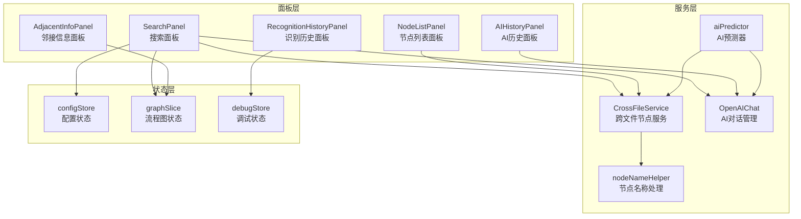
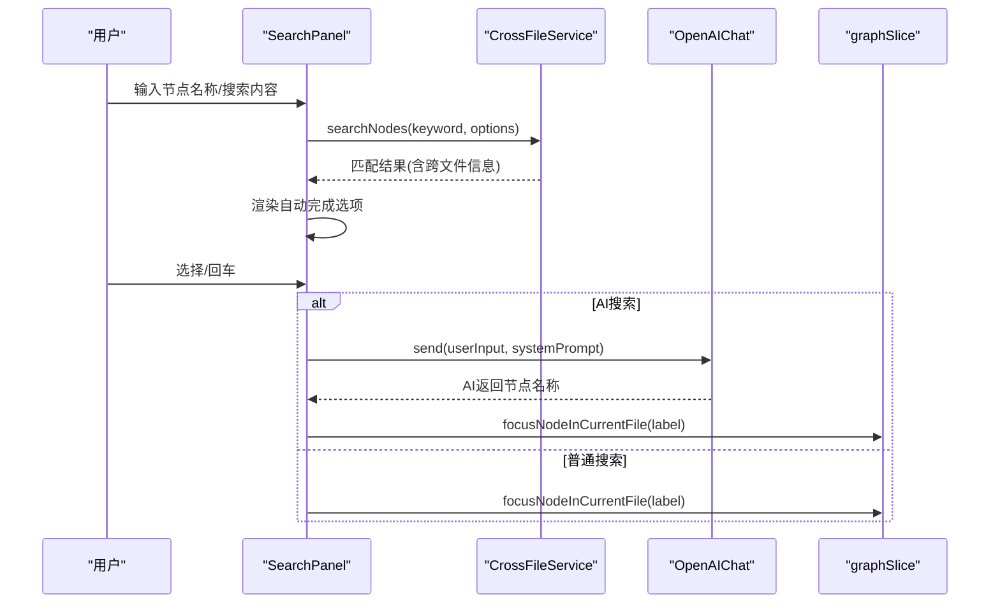
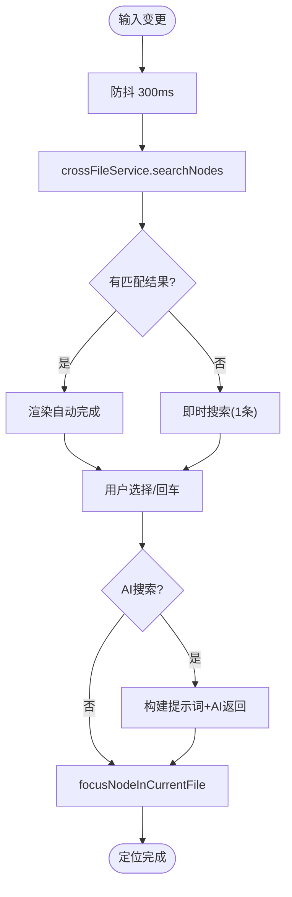
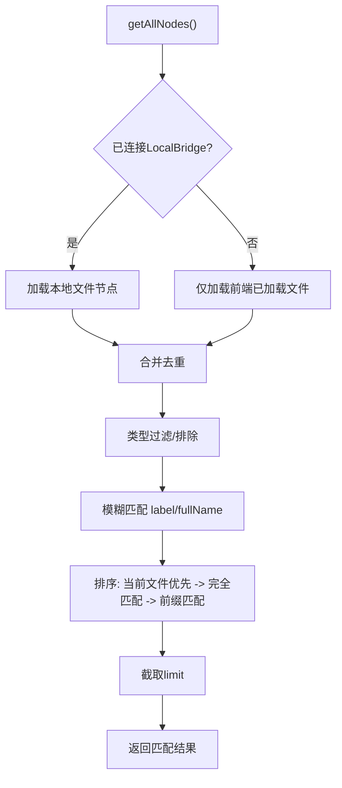
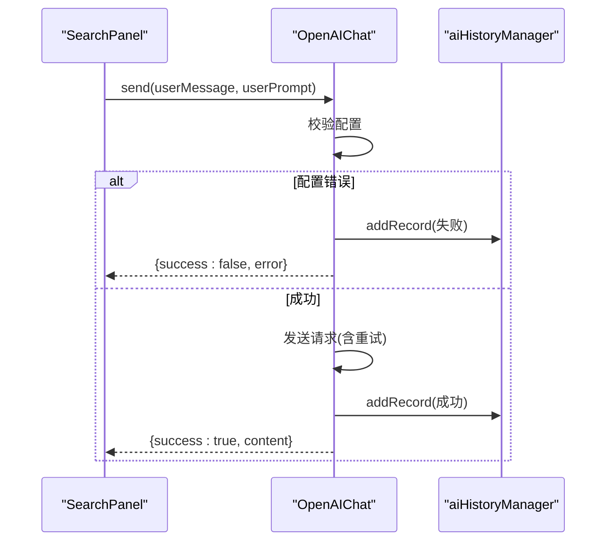
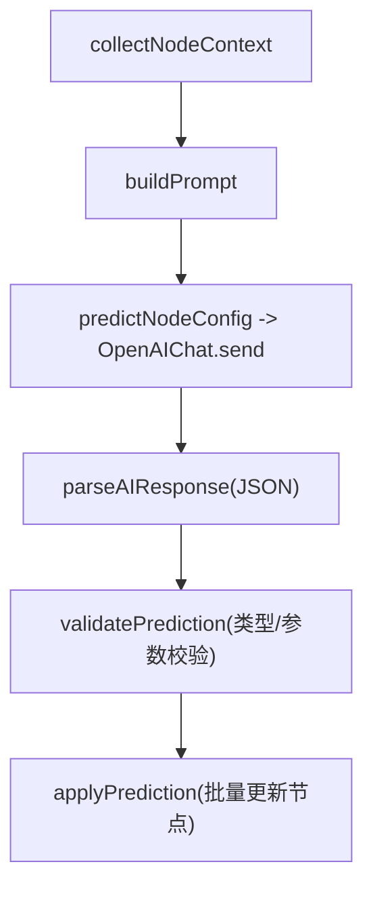
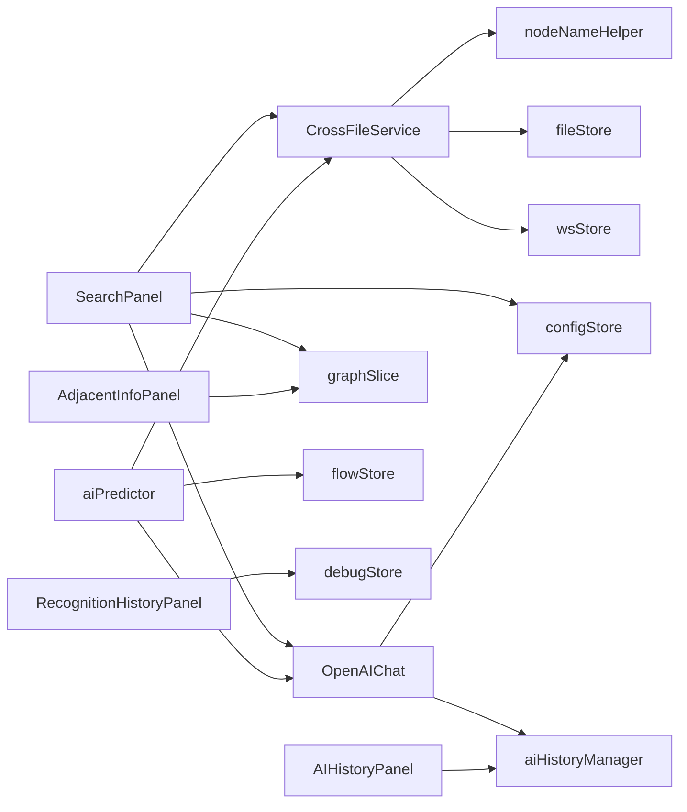

# 智能搜索系统

<cite>
**本文档引用的文件**
- [SearchPanel.tsx](file://src/components/panels/main/SearchPanel.tsx)
- [crossFileService.ts](file://src/services/crossFileService.ts)
- [nodeNameHelper.ts](file://src/utils/nodeNameHelper.ts)
- [openai.ts](file://src/utils/openai.ts)
- [configStore.ts](file://src/stores/configStore.ts)
- [AdjacentInfoPanel.tsx](file://src/components/panels/main/AdjacentInfoPanel.tsx)
- [RecognitionHistoryPanel.tsx](file://src/components/panels/main/RecognitionHistoryPanel.tsx)
- [AIHistoryPanel.tsx](file://src/components/panels/main/AIHistoryPanel.tsx)
- [aiPredictor.ts](file://src/utils/aiPredictor.ts)
- [FieldPanelToolbar.tsx](file://src/components/panels/field/tools/FieldPanelToolbar.tsx)
- [graphSlice.ts](file://src/stores/flow/slices/graphSlice.ts)
- [schema.ts](file://src/core/fields/recognition/schema.ts)
</cite>

## 目录
1. [简介](#简介)
2. [项目结构](#项目结构)
3. [核心组件](#核心组件)
4. [架构总览](#架构总览)
5. [详细组件分析](#详细组件分析)
6. [依赖关系分析](#依赖关系分析)
7. [性能考虑](#性能考虑)
8. [故障排除指南](#故障排除指南)
9. [结论](#结论)
10. [附录](#附录)

## 简介
本智能搜索系统围绕“节点搜索”与“AI协同预测”两大核心能力构建，提供：
- 模糊搜索与智能排序：支持跨文件节点检索、关键字匹配、前缀匹配与精确匹配的优先级排序。
- 节点定位功能：基于节点名称快速定位、跨文件跳转、视图聚焦与选中高亮。
- AI智能搜索：利用上下文信息与提示词工程，实现语义层面的节点匹配与推荐。
- 历史记录管理：统一的AI对话历史记录、识别历史记录与可视化面板。
- 配置与使用：可配置的搜索范围、匹配精度与结果排序策略。

## 项目结构
系统主要由前端面板组件、服务层与状态管理三部分组成：
- 面板层：搜索面板、节点列表面板、邻接信息面板、识别历史面板、AI历史面板。
- 服务层：跨文件节点服务、节点名称处理工具、AI对话与历史管理。
- 状态层：配置状态、流程图状态、调试状态等。

**图表来源**
- [SearchPanel.tsx:21-414](file://src/components/panels/main/SearchPanel.tsx#L21-L414)
- [crossFileService.ts:55-565](file://src/services/crossFileService.ts#L55-L565)
- [openai.ts:93-394](file://src/utils/openai.ts#L93-L394)
- [configStore.ts:163-268](file://src/stores/configStore.ts#L163-L268)
- [graphSlice.ts:9-305](file://src/stores/flow/slices/graphSlice.ts#L9-L305)
- [AdjacentInfoPanel.tsx:43-344](file://src/components/panels/main/AdjacentInfoPanel.tsx#L43-L344)
- [RecognitionHistoryPanel.tsx:173-377](file://src/components/panels/main/RecognitionHistoryPanel.tsx#L173-L377)
- [AIHistoryPanel.tsx:82-166](file://src/components/panels/main/AIHistoryPanel.tsx#L82-L166)
- [aiPredictor.ts:52-730](file://src/utils/aiPredictor.ts#L52-L730)

**章节来源**
- [SearchPanel.tsx:21-414](file://src/components/panels/main/SearchPanel.tsx#L21-L414)
- [crossFileService.ts:55-565](file://src/services/crossFileService.ts#L55-L565)
- [openai.ts:93-394](file://src/utils/openai.ts#L93-L394)
- [configStore.ts:163-268](file://src/stores/configStore.ts#L163-L268)

## 核心组件
- 搜索面板（SearchPanel）：提供关键字输入、自动完成、普通搜索与AI搜索，支持跨文件跳转与当前文件定位。
- 跨文件节点服务（CrossFileService）：统一聚合本地文件与前端已加载文件的节点，提供模糊匹配、类型过滤、排序与跳转。
- 节点名称处理（nodeNameHelper）：处理带前缀与不带前缀的节点名，支持前缀剥离与拼接。
- AI对话管理（OpenAIChat）：封装AI请求、历史记录、重试与流式响应。
- AI预测器（aiPredictor）：基于节点上下文与OCR结果，构建提示词并解析AI返回，校验与应用预测结果。
- 邻接信息面板（AdjacentInfoPanel）：展示前驱/后继节点，支持一键跳转与视图聚焦。
- 识别历史面板（RecognitionHistoryPanel）：展示调试过程中的识别记录卡片与分页。
- AI历史面板（AIHistoryPanel）：展示AI对话历史，支持展开/收起与清空。

**章节来源**
- [SearchPanel.tsx:21-414](file://src/components/panels/main/SearchPanel.tsx#L21-L414)
- [crossFileService.ts:55-565](file://src/services/crossFileService.ts#L55-L565)
- [nodeNameHelper.ts:1-44](file://src/utils/nodeNameHelper.ts#L1-L44)
- [openai.ts:93-394](file://src/utils/openai.ts#L93-L394)
- [aiPredictor.ts:52-730](file://src/utils/aiPredictor.ts#L52-L730)
- [AdjacentInfoPanel.tsx:43-344](file://src/components/panels/main/AdjacentInfoPanel.tsx#L43-L344)
- [RecognitionHistoryPanel.tsx:173-377](file://src/components/panels/main/RecognitionHistoryPanel.tsx#L173-L377)
- [AIHistoryPanel.tsx:82-166](file://src/components/panels/main/AIHistoryPanel.tsx#L82-L166)

## 架构总览
系统采用“面板-服务-状态”的分层架构：
- 面板层负责用户交互与展示。
- 服务层负责数据聚合与业务逻辑（跨文件节点、AI对话、历史管理）。
- 状态层负责持久化配置、流程图状态与调试状态。

**图表来源**
- [SearchPanel.tsx:46-174](file://src/components/panels/main/SearchPanel.tsx#L46-L174)
- [crossFileService.ts:207-268](file://src/services/crossFileService.ts#L207-L268)
- [openai.ts:169-243](file://src/utils/openai.ts#L169-L243)
- [graphSlice.ts:255-305](file://src/stores/flow/slices/graphSlice.ts#L255-L305)

## 详细组件分析

### 搜索面板（SearchPanel）
- 关键机制
  - 防抖搜索：300ms防抖，避免频繁查询。
  - 跨文件搜索：通过配置开关控制是否启用跨文件。
  - 自动完成：渲染节点标签与文件路径提示。
  - 普通搜索：优先跨文件跳转，否则当前文件定位。
  - AI搜索：构建系统提示词与节点上下文，调用AI返回最匹配节点名称。
- 数据流
  - 输入变更触发防抖查询，查询结果映射为AutoComplete选项。
  - 选中或回车触发navigateToNode或focusNodeInCurrentFile。
  - AI搜索时构建nodesContext并调用OpenAIChat.send。

**图表来源**
- [SearchPanel.tsx:46-174](file://src/components/panels/main/SearchPanel.tsx#L46-L174)
- [crossFileService.ts:207-268](file://src/services/crossFileService.ts#L207-L268)

**章节来源**
- [SearchPanel.tsx:21-414](file://src/components/panels/main/SearchPanel.tsx#L21-L414)

### 跨文件节点服务（CrossFileService）
- 节点聚合：连接LocalBridge时聚合本地文件与前端已加载文件；未连接时仅前端已加载文件。
- 模糊匹配：同时匹配label与fullName（含前缀），支持类型过滤与排除。
- 排序策略：当前文件优先，完全匹配优先，前缀匹配优先，其余按默认顺序。
- 跳转逻辑：当前文件直接定位；已加载文件切换后定位；未加载文件请求加载并轮询等待节点出现。

**图表来源**
- [crossFileService.ts:68-268](file://src/services/crossFileService.ts#L68-L268)

**章节来源**
- [crossFileService.ts:55-565](file://src/services/crossFileService.ts#L55-L565)
- [nodeNameHelper.ts:14-43](file://src/utils/nodeNameHelper.ts#L14-L43)

### AI对话管理（OpenAIChat）与AI历史面板（AIHistoryPanel）
- OpenAIChat
  - 配置校验：API URL、API Key、模型名称。
  - 历史记录：维护消息历史，限制长度，记录成功/失败。
  - 重试机制：可配置重试次数与间隔。
  - 流式响应：支持增量回调。
- AIHistoryPanel
  - 展示历史记录：时间戳、成功/失败、用户输入、实际消息、AI回复。
  - 支持展开/收起实际消息，清空历史。

**图表来源**
- [openai.ts:116-243](file://src/utils/openai.ts#L116-L243)
- [AIHistoryPanel.tsx:82-166](file://src/components/panels/main/AIHistoryPanel.tsx#L82-L166)

**章节来源**
- [openai.ts:93-394](file://src/utils/openai.ts#L93-L394)
- [AIHistoryPanel.tsx:82-166](file://src/components/panels/main/AIHistoryPanel.tsx#L82-L166)

### AI预测器（aiPredictor）与节点上下文
- 上下文收集：当前节点、前置节点、OCR结果（可选）。
- 提示词构建：系统知识+用户提示词，强调返回规则与字段约束。
- 预测与解析：调用OpenAIChat，解析JSON响应，校验识别/动作类型与参数。
- 应用预测：批量更新节点配置。

**图表来源**
- [aiPredictor.ts:82-730](file://src/utils/aiPredictor.ts#L82-L730)
- [openai.ts:532-559](file://src/utils/openai.ts#L532-L559)

**章节来源**
- [aiPredictor.ts:52-730](file://src/utils/aiPredictor.ts#L52-L730)
- [FieldPanelToolbar.tsx:162-203](file://src/components/panels/field/tools/FieldPanelToolbar.tsx#L162-L203)

### 邻接信息面板（AdjacentInfoPanel）
- 前驱/后继节点分组：按edgeType分组（next/on_error），按order排序。
- 跳转与聚焦：点击节点标签选中并聚焦视图。

**章节来源**
- [AdjacentInfoPanel.tsx:43-344](file://src/components/panels/main/AdjacentInfoPanel.tsx#L43-L344)

### 识别历史面板（RecognitionHistoryPanel）
- 卡片化展示：按节点分组，显示状态、命中、时间戳与详情链接。
- 分页与清空：支持分页浏览与一键清空。

**章节来源**
- [RecognitionHistoryPanel.tsx:173-377](file://src/components/panels/main/RecognitionHistoryPanel.tsx#L173-L377)

## 依赖关系分析
- SearchPanel依赖CrossFileService进行节点搜索，依赖OpenAIChat进行AI搜索，依赖configStore读取跨文件开关，依赖graphSlice进行节点定位。
- CrossFileService依赖nodeNameHelper进行节点名前缀处理，依赖fileStore与wsStore获取文件与连接状态。
- OpenAIChat依赖configStore读取AI配置，依赖aiHistoryManager记录历史。
- aiPredictor依赖OpenAIChat与CrossFileService，依赖flowStore批量更新节点。
- AdjacentInfoPanel依赖flowStore读取节点/边，依赖graphSlice进行视图聚焦。
- RecognitionHistoryPanel与AIHistoryPanel分别依赖debugStore与aiHistoryManager。

**图表来源**
- [SearchPanel.tsx:10-18](file://src/components/panels/main/SearchPanel.tsx#L10-L18)
- [crossFileService.ts:6-15](file://src/services/crossFileService.ts#L6-L15)
- [openai.ts:1-10](file://src/utils/openai.ts#L1-L10)
- [aiPredictor.ts:1-20](file://src/utils/aiPredictor.ts#L1-L20)
- [configStore.ts:1-20](file://src/stores/configStore.ts#L1-L20)
- [graphSlice.ts:1-10](file://src/stores/flow/slices/graphSlice.ts#L1-L10)

**章节来源**
- [SearchPanel.tsx:10-18](file://src/components/panels/main/SearchPanel.tsx#L10-L18)
- [crossFileService.ts:6-15](file://src/services/crossFileService.ts#L6-L15)
- [openai.ts:1-10](file://src/utils/openai.ts#L1-L10)
- [aiPredictor.ts:1-20](file://src/utils/aiPredictor.ts#L1-L20)
- [configStore.ts:1-20](file://src/stores/configStore.ts#L1-L20)
- [graphSlice.ts:1-10](file://src/stores/flow/slices/graphSlice.ts#L1-L10)

## 性能考虑
- 防抖优化：搜索输入300ms防抖，减少跨文件查询压力。
- 限制返回数量：默认限制10条，避免UI与网络负载过大。
- 跨文件开关：通过配置项控制是否启用跨文件搜索，降低不必要的扫描。
- 历史记录裁剪：AI历史与识别记录均设置上限并定期清理，避免内存膨胀。
- 视图聚焦：定位节点时仅聚焦一次，避免多次重绘。

[本节为通用指导，无需特定文件引用]

## 故障排除指南
- AI搜索失败
  - 检查AI配置：API URL、API Key、模型名称是否填写。
  - 查看AI历史面板：确认实际消息是否包含系统提示词，定位提示词构建问题。
  - 参考错误提示：面板工具栏会根据错误类型给出具体提示。
- 节点定位失败
  - 确认节点是否存在且未被过滤（类型排除）。
  - 若为未加载文件，检查LocalBridge连接与文件加载状态。
- 跨文件搜索无结果
  - 检查配置项“启用跨文件搜索”是否开启。
  - 确认节点标签与文件前缀是否正确（nodeNameHelper处理前后缀）。

**章节来源**
- [FieldPanelToolbar.tsx:162-203](file://src/components/panels/field/tools/FieldPanelToolbar.tsx#L162-L203)
- [AIHistoryPanel.tsx:82-166](file://src/components/panels/main/AIHistoryPanel.tsx#L82-L166)
- [crossFileService.ts:207-268](file://src/services/crossFileService.ts#L207-L268)
- [nodeNameHelper.ts:14-43](file://src/utils/nodeNameHelper.ts#L14-L43)

## 结论
本智能搜索系统通过“跨文件节点聚合 + 模糊匹配 + AI语义搜索”的组合，实现了高效、准确的节点定位与推荐。配合邻接信息、识别历史与AI历史面板，形成完整的搜索、调试与回溯闭环。通过可配置的搜索范围、匹配精度与排序规则，满足不同场景下的使用需求。

[本节为总结性内容，无需特定文件引用]

## 附录

### 搜索功能配置选项与使用技巧
- 搜索范围设置
  - 启用/禁用跨文件搜索：通过配置项控制是否扫描本地文件与前端已加载文件。
- 匹配精度调节
  - 模糊匹配：支持label与fullName（含前缀）匹配。
  - 排序规则：当前文件优先、完全匹配优先、前缀匹配优先。
- 结果排序规则
  - 默认按“当前文件优先”，其次“完全匹配”，再次“前缀匹配”，最后保持稳定顺序。
- AI搜索提示词要点
  - 严格要求返回最匹配节点名称，避免多余说明。
  - 节点类型与常见字段需明确，便于AI准确理解上下文。

**章节来源**
- [configStore.ts:184-189](file://src/stores/configStore.ts#L184-L189)
- [crossFileService.ts:207-268](file://src/services/crossFileService.ts#L207-L268)
- [SearchPanel.tsx:224-239](file://src/components/panels/main/SearchPanel.tsx#L224-L239)

### 搜索系统与AI预测功能的协同机制
- 上下文驱动：AI预测器收集当前节点、前置节点与OCR结果，构建提示词。
- 语义匹配：SearchPanel的AI搜索同样基于节点上下文与系统提示词，返回最匹配节点名称。
- 历史回溯：AI历史面板统一记录AI交互，便于复盘与优化提示词。

**章节来源**
- [aiPredictor.ts:82-273](file://src/utils/aiPredictor.ts#L82-L273)
- [openai.ts:169-243](file://src/utils/openai.ts#L169-L243)
- [AIHistoryPanel.tsx:82-166](file://src/components/panels/main/AIHistoryPanel.tsx#L82-L166)