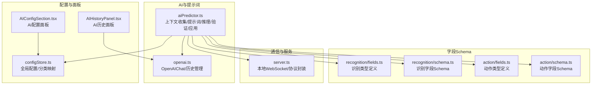
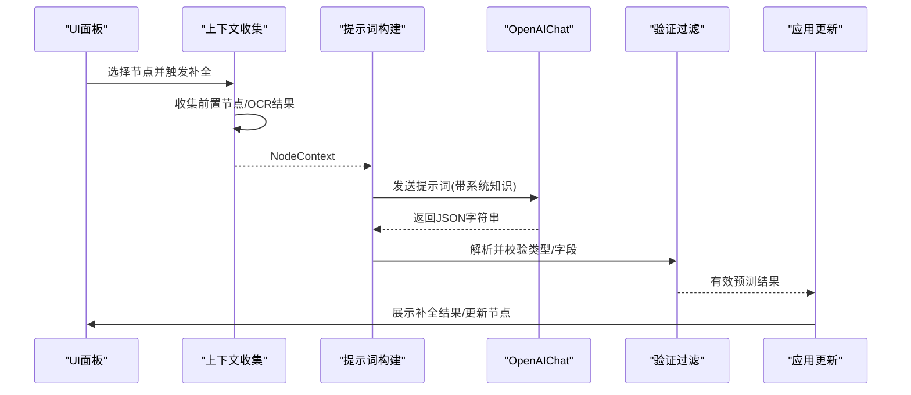
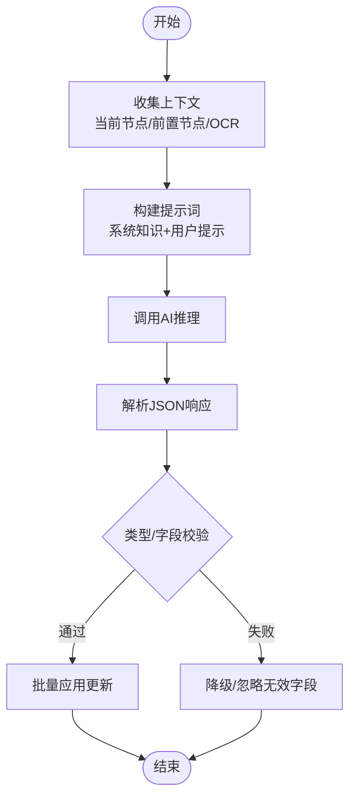
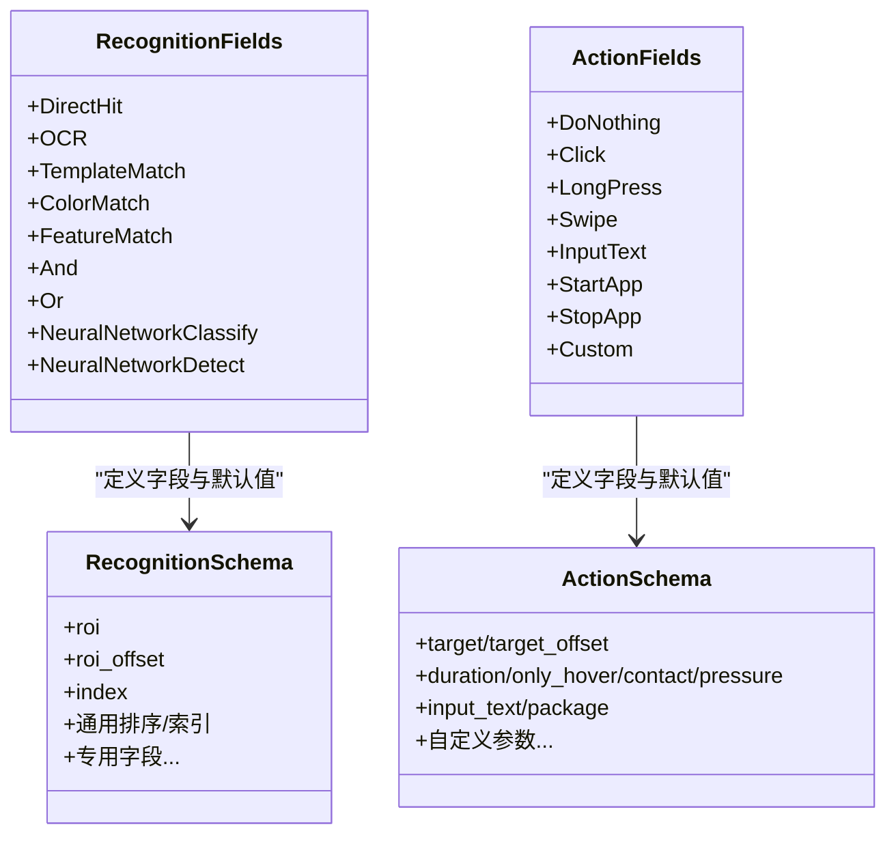
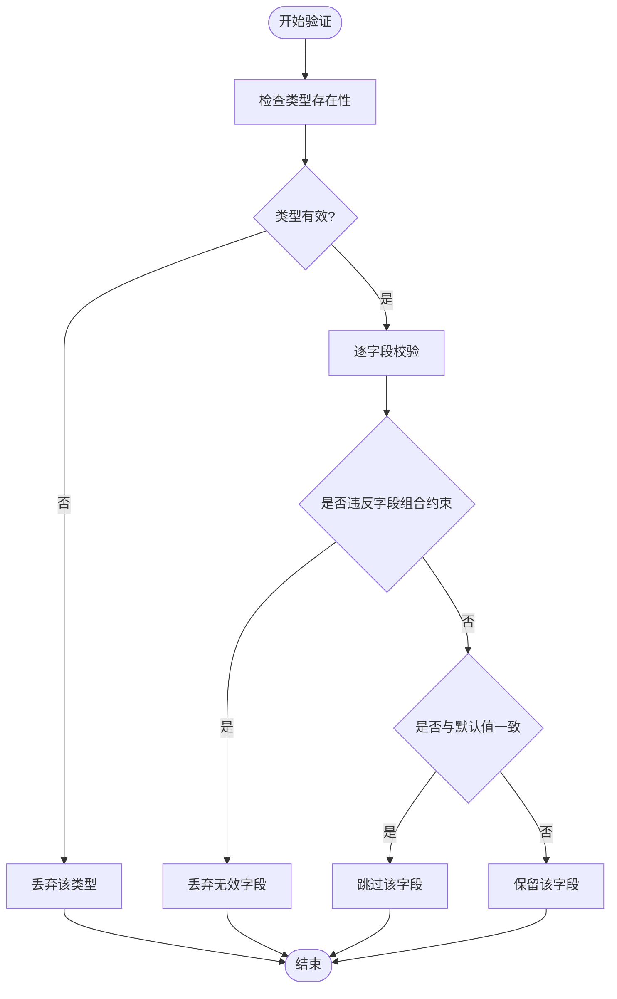
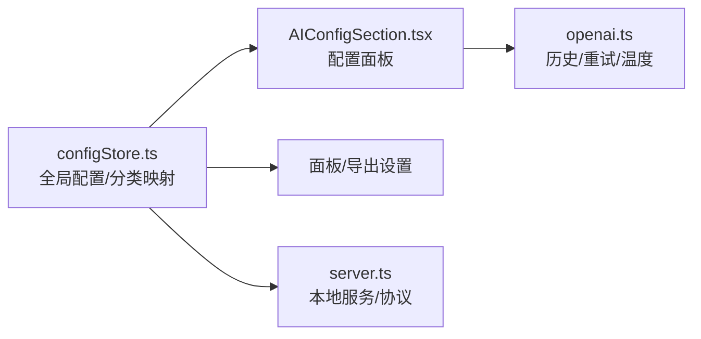
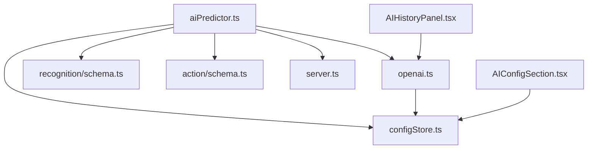

# 配置补全系统

<cite>
**本文档引用的文件**
- [aiPredictor.ts](file://src/utils/aiPredictor.ts)
- [openai.ts](file://src/utils/openai.ts)
- [configStore.ts](file://src/stores/configStore.ts)
- [fields.ts](file://src/core/fields/action/fields.ts)
- [schema.ts](file://src/core/fields/action/schema.ts)
- [fields.ts](file://src/core/fields/recognition/fields.ts)
- [schema.ts](file://src/core/fields/recognition/schema.ts)
- [AIHistoryPanel.tsx](file://src/components/panels/main/AIHistoryPanel.tsx)
- [AIConfigSection.tsx](file://src/components/panels/config/AIConfigSection.tsx)
- [server.ts](file://src/services/server.ts)
</cite>

## 目录
1. [简介](#简介)
2. [项目结构](#项目结构)
3. [核心组件](#核心组件)
4. [架构总览](#架构总览)
5. [详细组件分析](#详细组件分析)
6. [依赖关系分析](#依赖关系分析)
7. [性能考量](#性能考量)
8. [故障排查指南](#故障排查指南)
9. [结论](#结论)
10. [附录](#附录)

## 简介
本文件系统性阐述配置补全系统的设计与实现，重点覆盖节点级AI补全的工作原理（上下文分析、类型推断、参数预测）、字段级智能补全（自动填充、动作参数建议、默认值智能设置）、补全结果的验证与过滤机制（类型检查、字段约束、逻辑验证），以及配置选项（补全精度、历史学习、个性化偏好）与最佳实践。

## 项目结构
配置补全系统围绕“上下文收集-提示词构建-AI推理-结果解析-验证过滤-应用更新”这一主线展开，涉及AI通信、字段Schema、节点上下文、历史面板等多个模块。

**图表来源**
- [aiPredictor.ts:1-785](file://src/utils/aiPredictor.ts#L1-L785)
- [openai.ts:1-394](file://src/utils/openai.ts#L1-L394)
- [fields.ts:1-149](file://src/core/fields/action/fields.ts#L1-L149)
- [schema.ts:1-299](file://src/core/fields/action/schema.ts#L1-L299)
- [fields.ts:1-115](file://src/core/fields/recognition/fields.ts#L1-L115)
- [schema.ts:1-276](file://src/core/fields/recognition/schema.ts#L1-L276)
- [configStore.ts:1-268](file://src/stores/configStore.ts#L1-L268)
- [AIConfigSection.tsx:1-148](file://src/components/panels/config/AIConfigSection.tsx#L1-L148)
- [AIHistoryPanel.tsx:1-166](file://src/components/panels/main/AIHistoryPanel.tsx#L1-L166)
- [server.ts:1-373](file://src/services/server.ts#L1-L373)

**章节来源**
- [aiPredictor.ts:1-785](file://src/utils/aiPredictor.ts#L1-L785)
- [openai.ts:1-394](file://src/utils/openai.ts#L1-L394)
- [configStore.ts:1-268](file://src/stores/configStore.ts#L1-L268)

## 核心组件
- 上下文收集与OCR：收集当前节点、前置节点关系、OCR识别结果，形成NodeContext。
- 提示词构建：基于协议规范与上下文生成系统提示词与用户提示词。
- AI推理：调用OpenAI兼容接口，支持重试与历史管理。
- 结果解析与验证：解析JSON响应，校验类型与字段有效性，过滤非法组合。
- 应用更新：批量更新节点的识别/动作类型与参数。

**章节来源**
- [aiPredictor.ts:82-172](file://src/utils/aiPredictor.ts#L82-L172)
- [aiPredictor.ts:271-525](file://src/utils/aiPredictor.ts#L271-L525)
- [aiPredictor.ts:532-596](file://src/utils/aiPredictor.ts#L532-L596)
- [aiPredictor.ts:603-713](file://src/utils/aiPredictor.ts#L603-L713)
- [aiPredictor.ts:720-784](file://src/utils/aiPredictor.ts#L720-L784)

## 架构总览
系统采用分层设计：UI层负责触发与展示（配置面板、历史面板），服务层负责与本地服务通信，工具层负责AI交互与历史管理，核心层负责上下文与Schema约束。

**图表来源**
- [aiPredictor.ts:82-172](file://src/utils/aiPredictor.ts#L82-L172)
- [aiPredictor.ts:271-525](file://src/utils/aiPredictor.ts#L271-L525)
- [aiPredictor.ts:532-596](file://src/utils/aiPredictor.ts#L532-L596)
- [aiPredictor.ts:603-713](file://src/utils/aiPredictor.ts#L603-L713)
- [aiPredictor.ts:720-784](file://src/utils/aiPredictor.ts#L720-L784)
- [openai.ts:169-243](file://src/utils/openai.ts#L169-L243)

## 详细组件分析

### 节点级AI补全工作原理
- 上下文分析
  - 当前节点：标签、识别类型与参数、动作类型与参数。
  - 前置节点：连接类型（next/jump_back/on_error）、识别/动作类型、关键参数（如expected/template/roi）。
  - OCR结果：文本、文本框数量、置信度最高的若干文本框。
- 类型推断
  - 识别类型：根据OCR文本、模板图片、颜色区域等线索推断OCR/TemplateMatch/ColorMatch/FeatureMatch/DirectHit等。
  - 动作类型：根据节点名称与上下文推断点击、长按、滑动、输入文本、启动/关闭应用等。
- 参数预测
  - 基于字段Schema与默认值，仅填充必要参数；与默认值一致的字段不返回。
  - ROI/ROI Offset/排序策略/索引等参数按上下文合理设置。
- 提示词构建
  - 系统提示词包含协议规范、字段约束、默认值策略、推理步骤与JSON返回格式要求。
  - 用户提示词包含当前节点、前置节点、OCR结果与推理要求。

**图表来源**
- [aiPredictor.ts:82-172](file://src/utils/aiPredictor.ts#L82-L172)
- [aiPredictor.ts:271-525](file://src/utils/aiPredictor.ts#L271-L525)
- [aiPredictor.ts:532-596](file://src/utils/aiPredictor.ts#L532-L596)
- [aiPredictor.ts:603-713](file://src/utils/aiPredictor.ts#L603-L713)

**章节来源**
- [aiPredictor.ts:25-57](file://src/utils/aiPredictor.ts#L25-L57)
- [aiPredictor.ts:82-172](file://src/utils/aiPredictor.ts#L82-L172)
- [aiPredictor.ts:271-525](file://src/utils/aiPredictor.ts#L271-L525)

### 字段级智能补全
- 识别字段（recognition）
  - 通用字段：roi、roi_offset、index、order_by等。
  - 专用字段：OCR的expected/threshold/replace/only_rec/model/color_filter；TemplateMatch的template/threshold/method/green_mask；ColorMatch的lower/upper/method/count/connected；FeatureMatch的template/detector/ratio/count/green_mask；NN分类/检测的model/labels/expected/threshold等。
  - 默认值策略：仅当字段值与默认值不一致时才返回，减少冗余。
- 动作字段（action）
  - 点击/长按：target/target_offset、duration、contact、pressure等。
  - 滑动：begin/begin_offset、end/end_offset、duration、end_hold、only_hover、contact、pressure等。
  - 输入/应用：input_text、package、cmd/shell参数等。
  - 自定义动作：custom_action/custom_action_param/custom_target等。
- 自动填充与建议
  - 基于上下文自动填充ROI/目标引用锚点/模板路径等。
  - 基于节点名称与Schema推断动作类型与必要参数。

**图表来源**
- [fields.ts:1-115](file://src/core/fields/recognition/fields.ts#L1-L115)
- [schema.ts:1-276](file://src/core/fields/recognition/schema.ts#L1-L276)
- [fields.ts:1-149](file://src/core/fields/action/fields.ts#L1-L149)
- [schema.ts:1-299](file://src/core/fields/action/schema.ts#L1-L299)

**章节来源**
- [fields.ts:1-115](file://src/core/fields/recognition/fields.ts#L1-L115)
- [schema.ts:1-276](file://src/core/fields/recognition/schema.ts#L1-L276)
- [fields.ts:1-149](file://src/core/fields/action/fields.ts#L1-L149)
- [schema.ts:1-299](file://src/core/fields/action/schema.ts#L1-L299)

### 补全结果的验证与过滤机制
- 类型检查
  - 识别/动作类型必须存在于各自字段定义中，否则忽略。
- 字段约束
  - DirectHit不允许任何识别参数；OCR不应包含template/green_mask；TemplateMatch/FeatureMatch不应包含expected/only_rec；ColorMatch不应包含expected/template。
  - 必填字段校验：TemplateMatch/FeatureMatch需template；ColorMatch需lower/upper；NN分类/检测需model；InputText需input_text；StartApp/StopApp需package。
- 默认值策略
  - 与默认值一致的字段不返回，避免冗余。
- 逻辑验证
  - ROI/排序策略/索引等参数与上下文一致性检查。

**图表来源**
- [aiPredictor.ts:603-713](file://src/utils/aiPredictor.ts#L603-L713)

**章节来源**
- [aiPredictor.ts:603-713](file://src/utils/aiPredictor.ts#L603-L713)

### 补全系统的配置选项
- AI服务配置
  - API URL、API Key、模型名称，支持测试连接。
  - 历史记录管理：历史轮数限制、重试次数与间隔、温度参数。
- 面板与导出
  - 配置分类映射（panel/pipeline/communication/ai），便于导出与迁移。
  - 节点样式、字段面板模式、实时预览、跨文件搜索等。
- 通信协议
  - 本地WebSocket服务，握手版本校验，连接状态与超时处理。

**图表来源**
- [configStore.ts:1-268](file://src/stores/configStore.ts#L1-L268)
- [AIConfigSection.tsx:1-148](file://src/components/panels/config/AIConfigSection.tsx#L1-L148)
- [openai.ts:1-394](file://src/utils/openai.ts#L1-L394)
- [server.ts:1-373](file://src/services/server.ts#L1-L373)

**章节来源**
- [configStore.ts:1-268](file://src/stores/configStore.ts#L1-L268)
- [AIConfigSection.tsx:1-148](file://src/components/panels/config/AIConfigSection.tsx#L1-L148)
- [openai.ts:1-394](file://src/utils/openai.ts#L1-L394)
- [server.ts:1-373](file://src/services/server.ts#L1-L373)

### UI集成与历史展示
- AI历史面板：展示每次请求的用户输入、实际消息、AI回复与状态，支持清空与展开查看。
- AI配置面板：集中配置API URL/Key/模型，提供测试连接按钮。

**章节来源**
- [AIHistoryPanel.tsx:1-166](file://src/components/panels/main/AIHistoryPanel.tsx#L1-L166)
- [AIConfigSection.tsx:1-148](file://src/components/panels/config/AIConfigSection.tsx#L1-L148)

## 依赖关系分析
- 模块耦合
  - aiPredictor依赖OpenAIChat、字段Schema、配置存储、MFW协议（用于OCR）。
  - OpenAIChat依赖配置存储读取API配置，维护历史记录。
  - 字段Schema为类型与默认值提供权威定义，被验证阶段严格使用。
- 外部依赖
  - 本地WebSocket服务用于OCR截图与识别请求。
  - 浏览器fetch用于调用外部AI服务。

**图表来源**
- [aiPredictor.ts:1-785](file://src/utils/aiPredictor.ts#L1-L785)
- [openai.ts:1-394](file://src/utils/openai.ts#L1-L394)
- [schema.ts:1-276](file://src/core/fields/recognition/schema.ts#L1-L276)
- [schema.ts:1-299](file://src/core/fields/action/schema.ts#L1-L299)
- [configStore.ts:1-268](file://src/stores/configStore.ts#L1-L268)
- [server.ts:1-373](file://src/services/server.ts#L1-L373)
- [AIHistoryPanel.tsx:1-166](file://src/components/panels/main/AIHistoryPanel.tsx#L1-L166)
- [AIConfigSection.tsx:1-148](file://src/components/panels/config/AIConfigSection.tsx#L1-L148)

**章节来源**
- [aiPredictor.ts:1-15](file://src/utils/aiPredictor.ts#L1-L15)
- [openai.ts:1-10](file://src/utils/openai.ts#L1-L10)
- [configStore.ts:24-62](file://src/stores/configStore.ts#L24-L62)

## 性能考量
- OCR调用成本高，应按需触发；失败时降级推理，避免阻塞。
- 提示词构建与AI调用应限制历史轮数与温度，平衡准确性与响应速度。
- 批量应用更新减少多次渲染与状态变更。
- 本地服务连接超时与重试策略避免长时间等待。

[本节为通用指导，无需具体文件分析]

## 故障排查指南
- AI服务配置问题
  - 确认API URL/Key/模型已正确配置；使用测试连接验证。
- 本地服务连接问题
  - 检查端口与服务状态；确认协议版本匹配；关注连接超时与握手失败提示。
- OCR失败降级
  - 当OCR请求失败时，系统会降级推理，仍可基于前置节点与节点名称进行推断。
- 历史记录查看
  - 通过AI历史面板查看实际发送消息、AI回复与错误原因，定位提示词或参数问题。

**章节来源**
- [AIConfigSection.tsx:120-142](file://src/components/panels/config/AIConfigSection.tsx#L120-L142)
- [server.ts:105-251](file://src/services/server.ts#L105-L251)
- [aiPredictor.ts:156-169](file://src/utils/aiPredictor.ts#L156-L169)
- [AIHistoryPanel.tsx:82-166](file://src/components/panels/main/AIHistoryPanel.tsx#L82-L166)

## 结论
配置补全系统通过严谨的上下文收集、协议化的提示词构建、可靠的AI推理与严格的验证过滤，实现了节点级与字段级的智能补全。配合完善的配置与历史展示，既保证了易用性，也为调试与优化提供了清晰的路径。建议在实际使用中结合上下文与Schema约束，逐步提升补全质量与稳定性。

[本节为总结性内容，无需具体文件分析]

## 附录
- 最佳实践
  - 优先提供明确的前置节点与OCR结果，提升识别类型推断准确性。
  - 合理设置ROI与排序策略，减少误判。
  - 使用默认值策略，避免冗余参数污染。
  - 定期查看AI历史，优化提示词与参数。
- 使用技巧
  - 在配置面板中统一管理AI服务参数，便于迁移与备份。
  - 利用历史面板定位失败原因，针对性调整提示词或上下文。
  - 对于复杂流程，先补全关键节点，再逐步完善细节。

[本节为通用指导，无需具体文件分析]