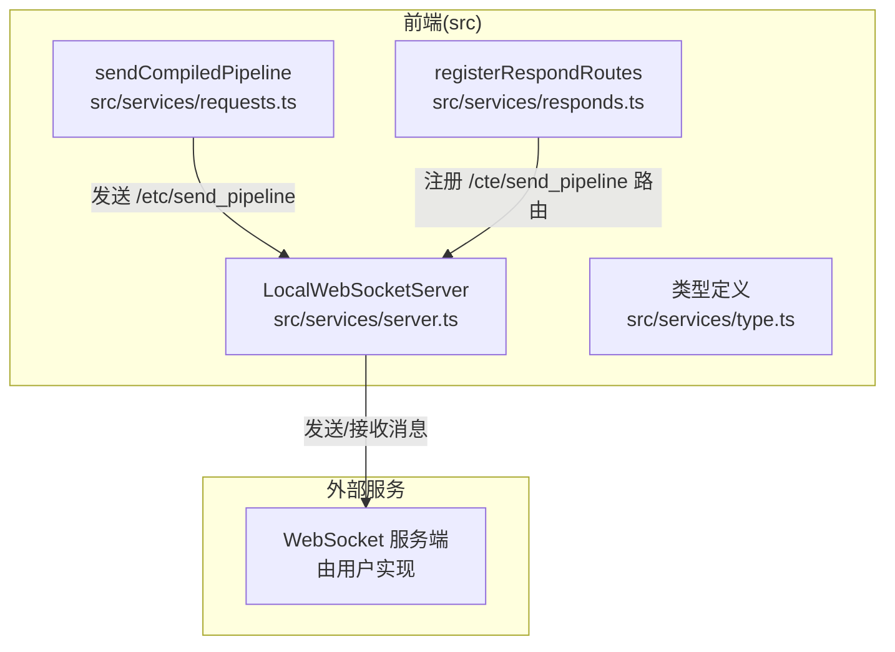
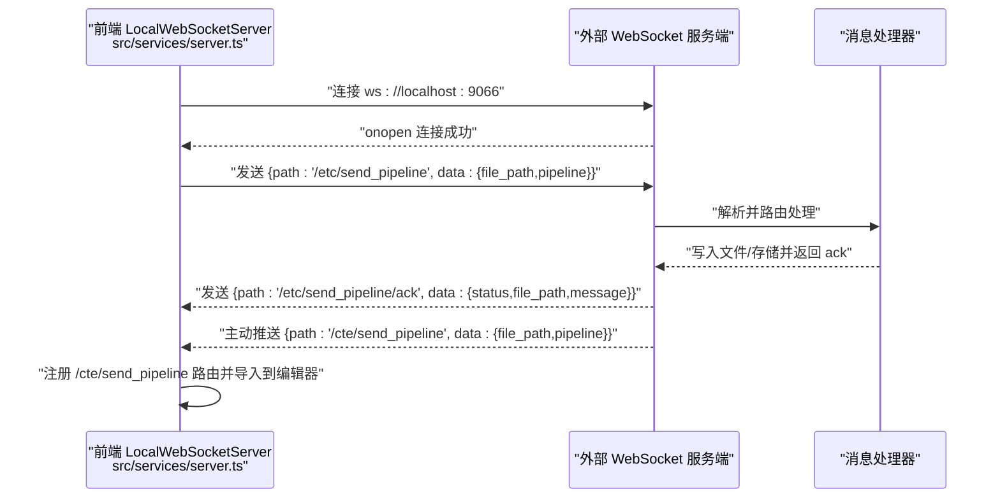
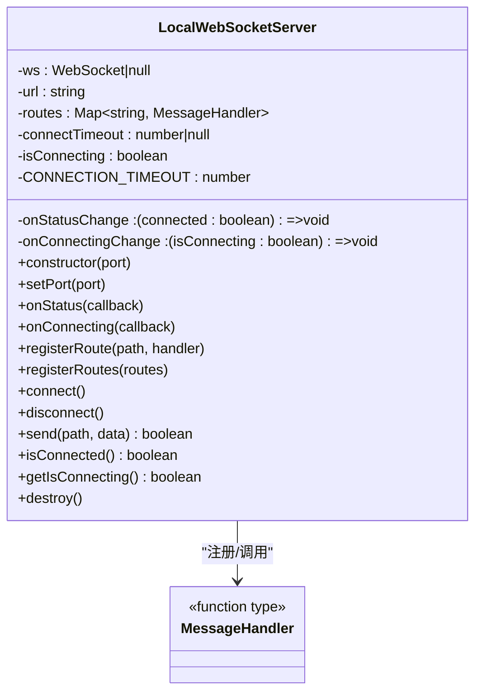
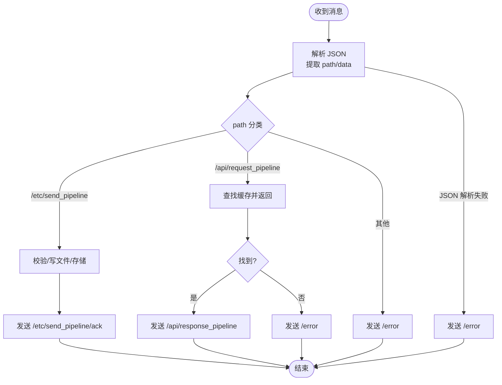
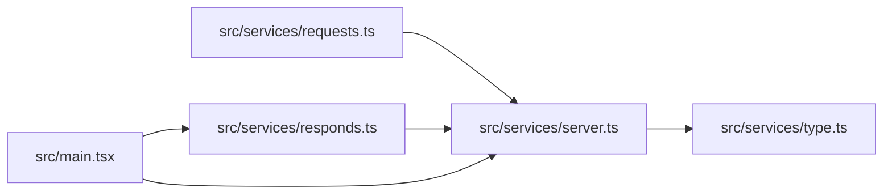

# API 参考

<cite>
**本文引用的文件**
- [src/services/server.ts](file://src/services/server.ts)
- [src/services/type.ts](file://src/services/type.ts)
- [src/services/requests.ts](file://src/services/requests.ts)
- [src/services/responds.ts](file://src/services/responds.ts)
- [src/main.tsx](file://src/main.tsx)
- [docsite/docs/01.指南/10.其他/10.通信协议.md](file://docsite/docs/01.指南/10.其他/10.通信协议.md)
- [LocalBridge/Agreement.md](file://LocalBridge/Agreement.md)
</cite>

## 更新摘要
**变更内容**
- 移除了已删除的 `server` 模块相关内容，更新为当前实际存在的 `src/services` 模块结构。
- 更新了 WebSocket 通信协议的最新规范，包括新增的日志推送路径 `/lte/log`。
- 修正了前端 WebSocket 客户端的初始化流程，明确 `registerRespondRoutes` 和 `initializeWebSocket` 的调用关系。
- 更新了通信路径与数据结构，补充了日志消息格式说明。

## 目录
1. [简介](#简介)
2. [项目结构](#项目结构)
3. [核心组件](#核心组件)
4. [架构总览](#架构总览)
5. [详细组件分析](#详细组件分析)
6. [依赖关系分析](#依赖关系分析)
7. [性能与可靠性](#性能与可靠性)
8. [故障排查指南](#故障排查指南)
9. [结论](#结论)
10. [附录](#附录)

## 简介
本文档为 MaaPipelineEditor（MPE）前后端 WebSocket 通信协议的完整 API 参考，涵盖连接建立、消息格式、事件类型、前端客户端封装、后端服务器处理、公开通信路径及数据结构、安全与错误处理策略、调试技巧等内容。目标读者既包括需要集成 MPE 本地通信能力的开发者，也包括希望理解其内部工作原理的使用者。

## 项目结构
- 前端位于 `src/`，包含 WebSocket 客户端封装、请求与响应路由注册、类型定义等。
- 后端服务逻辑由外部实现，MPE 作为客户端通过 WebSocket 与之通信。
- 文档位于 `docsite/docs/`，包含通信协议说明与示例。

**图表来源**
- [src/services/server.ts](file://src/services/server.ts#L1-L215)
- [src/services/requests.ts](file://src/services/requests.ts#L1-L46)
- [src/services/responds.ts](file://src/services/responds.ts#L1-L69)
- [src/services/type.ts](file://src/services/type.ts#L1-L9)

## 核心组件
- 前端 WebSocket 客户端封装：负责连接管理、消息发送与接收、路由注册与分发、连接状态与超时处理。
- 消息处理器：根据 `path` 路由分发到具体处理函数，返回 ack 或错误消息。
- 文档协议：定义默认端口、消息格式、API 路由与数据结构。

**章节来源**
- [src/services/server.ts](file://src/services/server.ts#L1-L215)
- [src/services/type.ts](file://src/services/type.ts#L1-L9)
- [docsite/docs/01.指南/10.其他/10.通信协议.md](file://docsite/docs/01.指南/10.其他/10.通信协议.md#L1-L216)

## 架构总览
MPE 的本地通信基于 WebSocket（RFC 6455），默认端口 9066，地址 `ws://localhost:9066`。前端通过 `LocalWebSocketServer` 统一管理连接与消息路由；外部服务端接收消息并进行处理。

**图表来源**
- [src/services/server.ts](file://src/services/server.ts#L1-L215)

## 详细组件分析

### 前端 WebSocket 客户端封装（LocalWebSocketServer）
- 连接管理
  - 默认端口 9066，地址 `ws://localhost:9066`。
  - 防重复连接、连接超时（3 秒）、连接状态与“连接中”状态回调。
  - 断开连接与资源清理。
- 消息发送与接收
  - 发送：将 `{path, data}` 序列化为 JSON 并发送。
  - 接收：解析 JSON，按 `path` 查找已注册路由并调用对应 handler。
- 路由注册机制
  - `registerRoute(path, handler)` 与 `registerRoutes(routes)` 批量注册。
  - 支持动态 `setPort` 与重新连接。
- 典型使用
  - 初始化：`initializeWebSocket()`（占位函数，实际初始化在应用启动时进行）。
  - 发送编译后的 Pipeline：`sendCompiledPipeline()` 通过 `/etc/send_pipeline` 路由发送。
  - 注册响应路由：`registerRespondRoutes()` 注册 `/cte/send_pipeline` 路由，将服务端推送的 Pipeline 导入编辑器。

**图表来源**
- [src/services/server.ts](file://src/services/server.ts#L1-L215)
- [src/services/type.ts](file://src/services/type.ts#L1-L9)

**章节来源**
- [src/services/server.ts](file://src/services/server.ts#L1-L215)
- [src/services/type.ts](file://src/services/type.ts#L1-L9)
- [src/services/requests.ts](file://src/services/requests.ts#L1-L46)
- [src/services/responds.ts](file://src/services/responds.ts#L1-L69)

### 后端 WebSocket 服务器与消息处理
- 服务器核心
  - 外部服务端需监听 `localhost:9066`，维护客户端集合，记录日志。
  - 提供 `send_message(path, data)` 统一发送消息格式。
  - 主动推送：`send_pipeline_to_client(file_path, pipeline)` 向所有客户端广播 `/cte/send_pipeline`。
- 消息处理
  - 解析 JSON，按 `path` 分发。
  - `/etc/send_pipeline`：接收前端发送的 Pipeline，校验数据、写入本地文件、存储到内存、返回 `/etc/send_pipeline/ack`。
  - `/api/request_pipeline`：根据 `file_path` 返回已缓存的 Pipeline 或 `/error`。
  - 未识别路由：返回 `/error`。
  - JSON 解析失败：返回 `/error`。

**章节来源**
- [docsite/docs/01.指南/10.其他/10.通信协议.md](file://docsite/docs/01.指南/10.其他/10.通信协议.md#L1-L216)

### 通信路径与数据结构
- 默认端口与地址
  - 默认端口：9066
  - 地址：`ws://localhost:9066`
  - 连接超时：3 秒
- 消息格式
  - 统一 JSON 结构：`{ path: string, data: any }`
- 路由与数据结构
  - 发送 Pipeline（MPE → 本地服务）
    - 路径：`/etc/send_pipeline`
    - 请求数据：
      - `file_path`: string（目标文件绝对路径）
      - `pipeline`: object（Pipeline JSON 对象）
    - 响应数据：
      - `/etc/send_pipeline/ack`：包含 `status`、`file_path`、`message`
    - 错误数据：
      - `/error`：包含 `status`、`message`
  - 接收 Pipeline（本地服务 → MPE）
    - 路径：`/cte/send_pipeline`
    - 请求数据：
      - `file_path`: string（文件路径标识）
      - `pipeline`: object|string（Pipeline JSON 对象或 JSON 字符串）
    - 处理逻辑（前端）：
      - 若已存在同路径文件：切换并更新内容
      - 若当前文件路径匹配：直接更新
      - 否则：新建文件并导入，保存文件路径到配置
  - 日志推送（本地服务 → MPE）
    - 路径：`/lte/log`
    - 请求数据：
      - `level`: "INFO" | "WARN" | "ERROR"
      - `module`: "WebSocket" | "File" | "MaaFW" | ...
      - `message`: string
      - `timestamp`: string (ISO 8601)
    - 处理逻辑（前端）：可配置是否接收日志推送，用于调试和监控。

**章节来源**
- [docsite/docs/01.指南/10.其他/10.通信协议.md](file://docsite/docs/01.指南/10.其他/10.通信协议.md#L1-L216)
- [LocalBridge/Agreement.md](file://LocalBridge/Agreement.md#L274-L289)
- [src/services/requests.ts](file://src/services/requests.ts#L1-L46)
- [src/services/responds.ts](file://src/services/responds.ts#L1-L69)

## 依赖关系分析
- 前端依赖
  - `LocalWebSocketServer` 依赖类型定义 `type.ts`，用于声明 `MessageHandler` 与 `APIRoute`。
  - 请求模块 `requests.ts` 依赖 `LocalWebSocketServer` 与 `flowToPipeline`，通过 `/etc/send_pipeline` 发送编译后的 Pipeline。
  - 响应模块 `responds.ts` 依赖 `LocalWebSocketServer` 与 `pipelineToFlow`，注册 `/cte/send_pipeline` 路由并导入到编辑器。
- 应用初始化
  - `src/main.tsx` 在应用启动时调用 `registerRespondRoutes(localServer)` 和 `initializeWebSocket()`，完成 WebSocket 服务的初始化。

**图表来源**
- [src/services/server.ts](file://src/services/server.ts#L1-L215)
- [src/services/type.ts](file://src/services/type.ts#L1-L9)
- [src/services/requests.ts](file://src/services/requests.ts#L1-L46)
- [src/services/responds.ts](file://src/services/responds.ts#L1-L69)
- [src/main.tsx](file://src/main.tsx#L1-L23)

## 性能与可靠性
- 连接与超时
  - 前端连接超时 3 秒，避免长时间阻塞 UI。
  - 重复连接保护：正在连接中时禁止再次发起连接。
- 消息处理
  - JSON 解析失败与未识别路由均返回 `/error`，便于前端快速定位问题。
- 日志与可观测性
  - 支持日志输出到控制台与 UI 回调，便于调试与运维。

[本节为通用建议，不直接分析具体文件]

## 故障排查指南
- 连接失败
  - 检查本地服务是否启动且端口 9066 可用。
  - 前端提示“连接失败/连接超时”，确认 `ws://localhost:9066` 可达。
- 消息解析失败
  - 后端返回 `/error`，前端打印“Failed to parse message”，检查消息格式是否为 `{path, data}`。
- 路由未识别
  - 后端返回 `/error`，前端打印“No handler for path”，检查 `path` 是否正确。
- 文件写入失败
  - 后端返回 `/error`，检查 `file_path` 是否存在、权限是否足够、磁盘空间是否充足。
- 调试技巧
  - 使用浏览器开发者工具的 Network → WebSocket 面板，观察帧数据与时间戳，核对 `path` 与 `data`。
  - 在后端控制台查看日志输出，确认连接、消息到达与处理结果。

**章节来源**
- [src/services/server.ts](file://src/services/server.ts#L1-L215)

## 结论
MPE 的本地通信协议以 WebSocket 为基础，采用统一的 JSON 消息格式与路由化设计，前后端职责清晰：前端负责连接与路由分发，后端负责消息路由与持久化。通过明确的错误回传与日志输出，开发者可以快速集成与排障。建议在生产环境中进一步优化文件写入与并发处理，并完善 UI 与日志的可观测性。

[本节为总结，不直接分析具体文件]

## 附录

### 安全考虑（本地服务限制）
- 仅监听本地地址（`localhost`），默认端口 9066，避免暴露至公网。
- 建议在生产环境增加鉴权或白名单机制（例如仅允许特定 IP 或令牌验证）。
- 文件写入需校验路径与权限，避免越权写入。

**章节来源**
- [docsite/docs/01.指南/10.其他/10.通信协议.md](file://docsite/docs/01.指南/10.其他/10.通信协议.md#L1-L216)

### 错误处理策略
- 前端
  - 连接超时：关闭连接句柄、重置状态、提示用户。
  - 连接错误/关闭：重置状态、提示用户。
  - 发送失败：捕获异常并返回 false。
- 后端
  - JSON 解析失败：返回 `/error`。
  - 未识别路由：返回 `/error`。
  - 文件写入失败：返回 `/error`。
  - 连接断开：记录日志并清理客户端集合。

**章节来源**
- [src/services/server.ts](file://src/services/server.ts#L1-L215)

### 调试技巧
- 浏览器开发者工具
  - Network → WebSocket：查看帧数据、时间戳、消息体。
  - Console：查看前端日志与警告。
- 后端控制台
  - 查看服务器启动、客户端连接、消息到达与处理结果的日志。

**章节来源**
- [src/services/server.ts](file://src/services/server.ts#L1-L215)