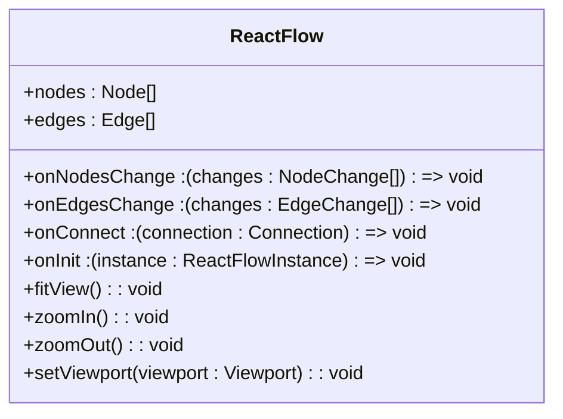
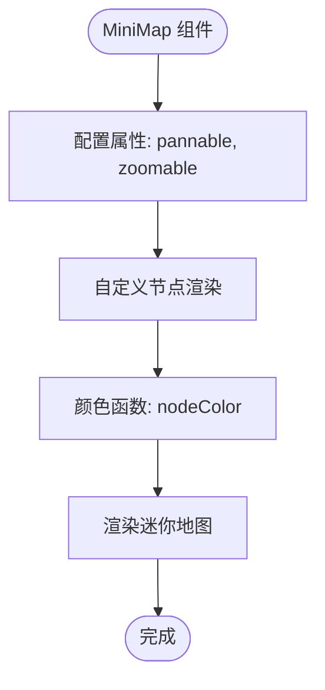
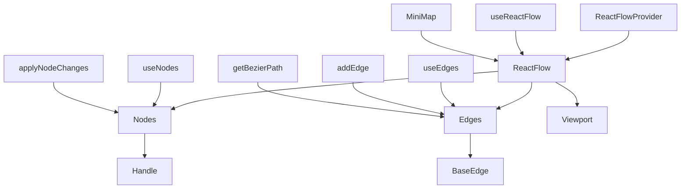

# React Flow API 参考

<cite>
**本文档中引用的文件**  
- [index.mdx](file://instructions/react-flow/api-reference/index.mdx)
- [react-flow.mdx](file://instructions/react-flow/api-reference/react-flow.mdx)
- [react-flow-provider.mdx](file://instructions/react-flow/api-reference/react-flow-provider.mdx)
- [use-react-flow.mdx](file://instructions/react-flow/api-reference/hooks/use-react-flow.mdx)
- [use-nodes.mdx](file://instructions/react-flow/api-reference/hooks/use-nodes.mdx)
- [use-edges.mdx](file://instructions/react-flow/api-reference/hooks/use-edges.mdx)
- [react-flow-instance.mdx](file://instructions/react-flow/api-reference/types/react-flow-instance.mdx)
- [node.mdx](file://instructions/react-flow/api-reference/types/node.mdx)
- [base-edge.mdx](file://instructions/react-flow/api-reference/components/base-edge.mdx)
- [handle.mdx](file://instructions/react-flow/api-reference/components/handle.mdx)
- [minimap.mdx](file://instructions/react-flow/api-reference/components/minimap.mdx)
- [add-edge.mdx](file://instructions/react-flow/api-reference/utils/add-edge.mdx)
- [apply-node-changes.mdx](file://instructions/react-flow/api-reference/utils/apply-node-changes.mdx)
- [get-bezier-path.mdx](file://instructions/react-flow/api-reference/utils/get-bezier-path.mdx)
</cite>

## 目录
1. [简介](#简介)
2. [核心组件](#核心组件)
3. [核心钩子](#核心钩子)
4. [核心类型](#核心类型)
5. [实用工具函数](#实用工具函数)
6. [架构概览](#架构概览)

## 简介

React Flow 是一个用于构建交互式流程图和节点编辑器的强大 React 库。本参考文档旨在全面介绍 React Flow 提供的所有 API，包括组件、钩子、类型和工具函数。文档结构经过重新组织，使开发者能够快速查找所需信息。

对于新用户，建议先阅读学习部分的指南和教程以了解基本概念。而对于有经验的开发者，本 API 参考提供了详细的类型定义和使用方法，帮助您深入掌握 React Flow 的各项功能。

**Section sources**
- [index.mdx](file://instructions/react-flow/api-reference/index.mdx)

## 核心组件

React Flow 提供了一系列核心组件，构成了流程图应用的基础结构。这些组件协同工作，实现了节点、边、视口和交互功能。

### ReactFlow 组件

`<ReactFlow />` 组件是 React Flow 应用的核心，负责渲染节点和边、处理用户交互，并可管理自身的状态。该组件接受多种属性，分为常用属性、视口属性、边属性、事件处理器、交互属性等类别。

组件支持受控和非受控两种模式，可通过 `nodes`、`edges` 属性传入数据，并通过 `onNodesChange`、`onEdgesChange` 等回调函数处理状态变化。对于复杂交互，还提供了丰富的事件处理器，如节点事件、边事件、连接事件等。

**Diagram sources**
- [react-flow.mdx](file://instructions/react-flow/api-reference/react-flow.mdx)

**Section sources**
- [react-flow.mdx](file://instructions/react-flow/api-reference/react-flow.mdx)

### ReactFlowProvider 组件

`<ReactFlowProvider />` 组件是一个上下文提供器，使得在 `<ReactFlow />` 组件外部也能访问流程的内部状态。许多 React Flow 提供的钩子都依赖于这个组件才能正常工作。

当需要在流程画布外部的组件（如侧边栏）中访问节点或边的状态时，必须将这些组件放置在 `<ReactFlowProvider />` 内部。如果应用中有多个独立的流程图，每个流程图都需要使用独立的 `<ReactFlowProvider />` 实例。

**Section sources**
- [react-flow-provider.mdx](file://instructions/react-flow/api-reference/react-flow-provider.mdx)

### BaseEdge 组件

`<BaseEdge />` 组件是所有边的内部基础组件，可用于自定义边的实现。它自动处理不可见的辅助边和边标签的渲染，简化了自定义边的开发。

在创建自定义边时，可以使用 `getBezierPath`、`getStraightPath` 等工具函数生成路径数据，然后将路径和相关属性传递给 `<BaseEdge />` 组件进行渲染。这确保了自定义边与原生边具有一致的行为和交互特性。

**Section sources**
- [base-edge.mdx](file://instructions/react-flow/api-reference/components/base-edge.mdx)

### Handle 组件

`<Handle />` 组件用于在自定义节点中定义连接点。通过设置 `type` 属性为 "source" 或 "target"，可以创建输出或输入连接点。`position` 属性则用于指定连接点在节点上的位置（如左、右、上、下）。

连接点是实现节点间连接功能的关键，它们定义了数据流的方向和连接的可能性。在复杂的节点编辑器中，一个节点可以有多个不同类型的连接点，实现丰富的连接逻辑。

**Section sources**
- [handle.mdx](file://instructions/react-flow/api-reference/components/handle.mdx)

### MiniMap 组件

`<MiniMap />` 组件用于渲染流程图的概览。它将每个节点渲染为 SVG 元素，并可视化当前视口在整体流程中的位置。这对于大型流程图的导航非常有用。

迷你地图支持交互功能，通过设置 `pannable` 和 `zoomable` 属性，用户可以通过拖拽和缩放来导航主视图。还可以通过 `nodeComponent` 属性自定义节点在迷你地图中的渲染方式，或通过 `nodeColor` 函数根据节点类型动态设置颜色。

**Diagram sources**
- [minimap.mdx](file://instructions/react-flow/api-reference/components/minimap.mdx)

**Section sources**
- [minimap.mdx](file://instructions/react-flow/api-reference/components/minimap.mdx)

## 核心钩子

React Flow 提供了一系列 React 钩子，用于在函数组件中访问和操作流程图的状态。

### useReactFlow 钩子

`useReactFlow` 钩子返回一个 `ReactFlowInstance` 实例，可用于更新节点和边、操作视口或查询流程的当前状态。与 `useNodes` 和 `useEdges` 不同，此钩子不会在状态变化时导致组件重新渲染。

该钩子只能在 `<ReactFlowProvider />` 或 `<ReactFlow />` 组件的子组件中使用。返回的实例提供了丰富的操作方法，如 `getNodes()`、`getEdges()`、`fitView()`、`zoomIn()` 等，是程序化控制流程图的主要方式。

**Section sources**
- [use-react-flow.mdx](file://instructions/react-flow/api-reference/hooks/use-react-flow.mdx)

### useNodes 钩子

`useNodes` 钩子返回当前节点的数组。使用此钩子的组件会在任何节点发生变化时重新渲染，包括节点被选中或移动的情况。这对于需要实时响应节点状态变化的 UI 组件非常有用。

然而，过度依赖 `useNodes` 可能导致性能问题，因为任何节点的微小变化都会触发重新渲染。在只需要特定信息（如节点数量）时，建议使用 `useStore` 钩子以获得更好的性能。

**Section sources**
- [use-nodes.mdx](file://instructions/react-flow/api-reference/hooks/use-nodes.mdx)

### useEdges 钩子

`useEdges` 钩子返回当前边的数组。与 `useNodes` 类似，使用此钩子的组件会在任何边发生变化时重新渲染。这对于需要显示边相关信息的组件（如统计信息面板）很有用。

同样需要注意性能影响，避免不必要的重新渲染。对于只需要边数量等聚合信息的场景，应考虑使用更精确的状态订阅方式。

**Section sources**
- [use-edges.mdx](file://instructions/react-flow/api-reference/hooks/use-edges.mdx)

## 核心类型

React Flow 的类型系统为开发者提供了强大的类型安全保证，特别是在使用 TypeScript 时。

### ReactFlowInstance 类型

`ReactFlowInstance` 类型提供了一组方法来查询和操作流程的内部状态。可以通过 `useReactFlow` 钩子或 `onInit` 事件获取该实例。

该类型包含三类主要方法：节点和边操作（如 `getNodes`、`getEdges`、`setNodes`）、交集查询（如 `getIntersectingNodes`、`isNodeIntersecting`）和视口操作（如 `fitView`、`zoomTo`、`setViewport`）。这些方法为程序化控制流程图提供了完整的 API。

**Section sources**
- [react-flow-instance.mdx](file://instructions/react-flow/api-reference/types/react-flow-instance.mdx)

### Node 类型

`Node` 类型定义了 React Flow 需要知道的关于节点的所有信息。它包含 `id`、`type`、`data`、`position` 等核心属性，以及 `width`、`height` 等只读属性。

节点类型决定了节点的渲染方式和行为。React Flow 提供了 "default"、"input"、"output"、"group" 等默认节点类型。`width` 和 `height` 属性由 React Flow 内部计算，不应直接设置，而应通过 CSS 样式控制节点大小。

**Section sources**
- [node.mdx](file://instructions/react-flow/api-reference/types/node.mdx)

## 实用工具函数

React Flow 提供了一系列实用工具函数，简化了常见操作的实现。

### addEdge 函数

`addEdge` 工具函数用于将新的边添加到边数组中。它不仅是一个便利函数，还执行验证以确保不会添加无效或重复的边。

当源节点和目标节点（以及可选的句柄）相同时，即使边的 `id` 不同，该函数也不会添加新边。这防止了重复连接的产生，确保了数据的一致性。

**Section sources**
- [add-edge.mdx](file://instructions/react-flow/api-reference/utils/add-edge.mdx)

### applyNodeChanges 函数

`applyNodeChanges` 工具函数用于将节点变化数组应用到节点集合上。`<ReactFlow />` 组件的各种事件会产生描述如何更新节点的 `NodeChange` 对象。

如果不需自定义行为，此工具函数可以直接处理这些变化。对于更简单的使用场景，`useNodesState` 钩子已经封装了此工具函数和 React 的 `useState` 钩子。

**Section sources**
- [apply-node-changes.mdx](file://instructions/react-flow/api-reference/utils/apply-node-changes.mdx)

### getBezierPath 函数

`getBezierPath` 工具函数返回渲染贝塞尔曲线边所需的所有信息。它计算出 SVG 路径字符串以及标签的位置和偏移量。

该函数返回一个元组（固定大小的数组），包含路径、标签 X 坐标、标签 Y 坐标、X 偏移量和 Y 偏移量。这种设计使得同时处理多条边路径变得更加容易。

**Section sources**
- [get-bezier-path.mdx](file://instructions/react-flow/api-reference/utils/get-bezier-path.mdx)

## 架构概览

React Flow 采用模块化架构，将核心功能分解为独立的组件、钩子和工具函数。这种设计使得库既灵活又易于扩展。

**Diagram sources**
- [react-flow.mdx](file://instructions/react-flow/api-reference/react-flow.mdx)
- [react-flow-provider.mdx](file://instructions/react-flow/api-reference/react-flow-provider.mdx)

**Section sources**
- [react-flow.mdx](file://instructions/react-flow/api-reference/react-flow.mdx)
- [react-flow-provider.mdx](file://instructions/react-flow/api-reference/react-flow-provider.mdx)