# maafw-golang API 参考

<cite>
**本文档中引用的文件**
- [API大全.md](file://instructions/maafw-golang-binding/API大全.md)
- [任务管理器.md](file://instructions/maafw-golang-binding/API参考/任务管理器.md)
- [控制器.md](file://instructions/maafw-golang-binding/API参考/控制器.md)
- [执行上下文.md](file://instructions/maafw-golang-binding/API参考/执行上下文.md)
- [资源管理器.md](file://instructions/maafw-golang-binding/API参考/资源管理器.md)
- [事件系统.md](file://instructions/maafw-golang-binding/API参考/事件系统.md)
- [Toolkit Api Reference.md](file://instructions/maafw-golang-binding/Toolkit Api Reference.md)
- [controller.go](file://controller.go)
- [custom_controller.go](file://custom_controller.go)
- [controller_manager.go](file://LocalBridge/internal/mfw/controller_manager.go)
- [device_manager.go](file://LocalBridge/internal/mfw/device_manager.go)
- [handler.go](file://LocalBridge/internal/protocol/mfw/handler.go)
- [mfw.go](file://LocalBridge/pkg/models/mfw.go)
- [gamepad控制器.md](file://instructions/maafw-golang-binding/核心概念/控制器 (Controller)/游戏pad控制器.md)
- [DebugProtocol.ts](file://src/services/protocols/DebugProtocol.ts)
- [ErrorProtocol.ts](file://src/services/protocols/ErrorProtocol.ts)
- [DebugPanel.tsx](file://src/components/panels/tools/DebugPanel.tsx)
- [debugStore.ts](file://src/stores/debugStore.ts)
- [action_result.go](file://action_result.go)
- [tasker.go](file://tasker.go)
- [context.go](file://context.go)
- [node_action.go](file://node_action.go)
- [context_test.go](file://context_test.go)
- [2.4-控制方式说明.md](file://instructions/maafw-guide/2.4-控制方式说明.md)
</cite>

## 更新摘要
**已做更改**
- 新增 Toolkit API 参考文档，包含 375 行全面的 API 文档
- 控制器管理器新增 WindowPos 系列输入方法支持
- 增强 Win32 控制器输入方法映射，支持 SendMessageWithWindowPos 和 PostMessageWithWindowPos
- 更新设备管理器，添加 WindowPos 系列输入方法到可用方法列表
- 新增 Win32 控制器输入方法兼容性说明文档
- **新增**：ActScreencap 动作类型支持，包含截图参数和结果解析功能
- **新增**：ActionResult 系统增强，支持 AsScreencap 方法进行类型安全的截图结果访问
- **新增**：WithPseudoMinimize 截图方法支持，包括新的截图方法映射和解析逻辑

## 目录
1. [简介](#简介)
2. [项目结构](#项目结构)
3. [核心组件](#核心组件)
4. [架构总览](#架构总览)
5. [详细组件分析](#详细组件分析)
6. [依赖关系分析](#依赖关系分析)
7. [性能考虑](#性能考虑)
8. [故障排查指南](#故障排查指南)
9. [结论](#结论)
10. [附录](#附录)

## 简介
本文件为 maa-framework-go 的 API 参考与使用指南，面向希望在 Go 语言中使用 MaaFramework 的开发者。文档系统性梳理了框架初始化、任务管理、控制器操作、资源管理、自定义扩展、事件回调、上下文操作与状态/作业模型等核心能力，并通过示例与图示帮助读者快速上手与深入理解。

**更新** 本次更新重点扩展了执行上下文 API，新增 ActionResult 结果系统、RunRecognitionDirect 和 RunActionDirect 方法、WaitFreezes 方法等新功能，显著增强了框架的灵活性和功能性。同时，文档大幅改进，新增控制器管理器、协议处理器、事件系统重构等详细文档。新增 Toolkit API 参考文档，提供系统级设备发现和配置管理功能。**新增**：ActScreencap 动作类型支持，为自动化任务提供截图功能。**新增**：WithPseudoMinimize 截图方法支持，提供更好的窗口最小化兼容性。

## 项目结构
仓库采用按职责分层的组织方式：
- 核心 API 层：controller.go、custom_controller.go、tasker.go、resource.go、context.go、event.go、job.go
- 控制器管理器：LocalBridge/internal/mfw/controller_manager.go
- 设备管理器：LocalBridge/internal/mfw/device_manager.go
- 协议处理层：LocalBridge/internal/protocol/mfw/handler.go
- 数据模型：LocalBridge/pkg/models/mfw.go
- 文档与示例：instructions/maafw-golang-binding 目录下的各类文档
- 前端集成：src/services/protocols 下的调试协议和错误处理
- 结果系统：action_result.go、tasker.go、context.go
- **新增**：Toolkit API：instructions/maafw-golang-binding/Toolkit Api Reference.md
- **新增**：截图功能：ActScreencap 动作类型及相关参数
- **新增**：伪最小化截图方法：WithPseudoMinimize 截图方法支持

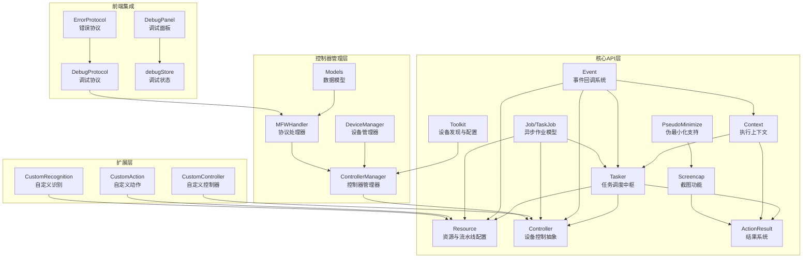
```mermaid
graph TB
subgraph "核心API层"
T["Tasker<br/>任务调度中枢"]
R["Resource<br/>资源与流水线配置"]
C["Controller<br/>设备控制抽象"]
X["Context<br/>执行上下文"]
E["Event<br/>事件回调系统"]
J["Job/TaskJob<br/>异步作业模型"]
AR["ActionResult<br/>结果系统"]
TK["Toolkit<br/>设备发现与配置"]
SC["Screencap<br/>截图功能"]
PM["PseudoMinimize<br/>伪最小化支持"]
end
subgraph "扩展层"
CA["CustomAction<br/>自定义动作"]
CR["CustomRecognition<br/>自定义识别"]
CC["CustomController<br/>自定义控制器"]
end
subgraph "控制器管理层"
CM["ControllerManager<br/>控制器管理器"]
DM["DeviceManager<br/>设备管理器"]
H["MFWHandler<br/>协议处理器"]
M["Models<br/>数据模型"]
end
subgraph "前端集成"
DP["DebugProtocol<br/>调试协议"]
EP["ErrorProtocol<br/>错误协议"]
DB["DebugPanel<br/>调试面板"]
DS["debugStore<br/>调试状态"]
end
T --> R
T --> C
T --> AR
X --> T
X --> AR
E --> T
E --> R
E --> C
E --> X
J --> T
J --> R
J --> C
CA --> R
CR --> R
CC --> C
CM --> C
DM --> CM
H --> CM
M --> H
DP --> H
EP --> DP
DB --> DS
TK --> CM
SC --> AR
PM --> SC
```

**图表来源**
- [controller.go](file://controller.go#L1-L418)
- [custom_controller.go](file://custom_controller.go#L1-L392)
- [controller_manager.go](file://LocalBridge/internal/mfw/controller_manager.go#L1-L994)
- [device_manager.go](file://LocalBridge/internal/mfw/device_manager.go#L1-L110)
- [handler.go](file://LocalBridge/internal/protocol/mfw/handler.go#L1-L694)
- [mfw.go](file://LocalBridge/pkg/models/mfw.go#L1-L192)
- [action_result.go](file://action_result.go#L1-L375)
- [tasker.go](file://tasker.go#L1-L678)
- [context.go](file://context.go#L1-L472)
- [Toolkit Api Reference.md](file://instructions/maafw-golang-binding/Toolkit Api Reference.md#L1-L375)

**章节来源**
- [controller.go](file://controller.go#L1-L418)
- [custom_controller.go](file://custom_controller.go#L1-L392)
- [controller_manager.go](file://LocalBridge/internal/mfw/controller_manager.go#L1-L994)
- [device_manager.go](file://LocalBridge/internal/mfw/device_manager.go#L1-L110)
- [handler.go](file://LocalBridge/internal/protocol/mfw/handler.go#L1-L694)

## 核心组件
- Tasker：负责任务提交、状态查询、停止信号、事件回调注册、节点详情查询等，是任务执行的中枢。
- Resource：负责资源加载、流水线覆盖、自定义识别/动作注册、事件回调注册等，承载识别与动作的配置与能力。
- Controller：负责设备连接、截图、输入、应用启停、滚动等操作，抽象出 ADB/Win32/Gamepad/PlayCover/自定义控制器。
- Context：提供在单次任务执行中运行识别/动作的能力，支持覆盖流水线、锚点、命中计数等上下文级操作，新增直接执行方法和状态监控功能。
- Event：统一的事件回调代理与分发器，将底层事件映射到 Tasker/Resource/Controller/Context 的回调接口。
- Job/TaskJob：封装异步作业的状态查询与等待逻辑，TaskJob 还可获取任务详情。
- ControllerManager：统一管理各种控制器的创建、连接、断开和操作，提供高级API。
- DeviceManager：管理 Win32 窗口发现和输入方法配置，提供设备信息查询。
- MFWHandler：处理前端发送的控制器相关协议消息，协调控制器管理器执行操作。
- ActionResult：类型安全的动作结果解析系统，支持多种动作类型的结果访问，**新增**：支持 AsScreencap 方法进行截图结果解析。
- **新增**：Toolkit：提供系统级设备发现和配置管理功能，支持 ADB 设备发现和桌面窗口发现。
- **新增**：Screencap 动作：支持屏幕截图功能，包含文件名、格式和质量等参数配置。
- **新增**：伪最小化截图方法：支持 FramePoolWithPseudoMinimize 和 PrintWindowWithPseudoMinimize 截图方法，提供更好的窗口最小化兼容性。

**更新** 新增 Toolkit API 参考文档，增强的 Context API，包括直接执行方法和状态监控功能。**新增**：ActScreencap 动作类型支持，为自动化任务提供截图功能。**新增**：WithPseudoMinimize 截图方法支持，提供更好的窗口最小化兼容性。

**章节来源**
- [controller.go](file://controller.go#L1-L418)
- [custom_controller.go](file://custom_controller.go#L1-L392)
- [controller_manager.go](file://LocalBridge/internal/mfw/controller_manager.go#L1-L994)
- [device_manager.go](file://LocalBridge/internal/mfw/device_manager.go#L1-L110)
- [handler.go](file://LocalBridge/internal/protocol/mfw/handler.go#L1-L694)
- [action_result.go](file://action_result.go#L1-L375)
- [context.go](file://context.go#L1-L472)
- [Toolkit Api Reference.md](file://instructions/maafw-golang-binding/Toolkit Api Reference.md#L1-L375)

## 架构总览
下图展示了从应用调用到底层原生交互的关键路径，以及事件回调的分发链路。新增的 ActionResult 结果系统和 Context 直接执行方法提供了更强大的结果处理和状态监控能力。**新增**：Toolkit API 提供了系统级设备发现和配置管理功能。**新增**：ActScreencap 动作类型支持截图功能。**新增**：WithPseudoMinimize 截图方法提供更好的窗口最小化兼容性。

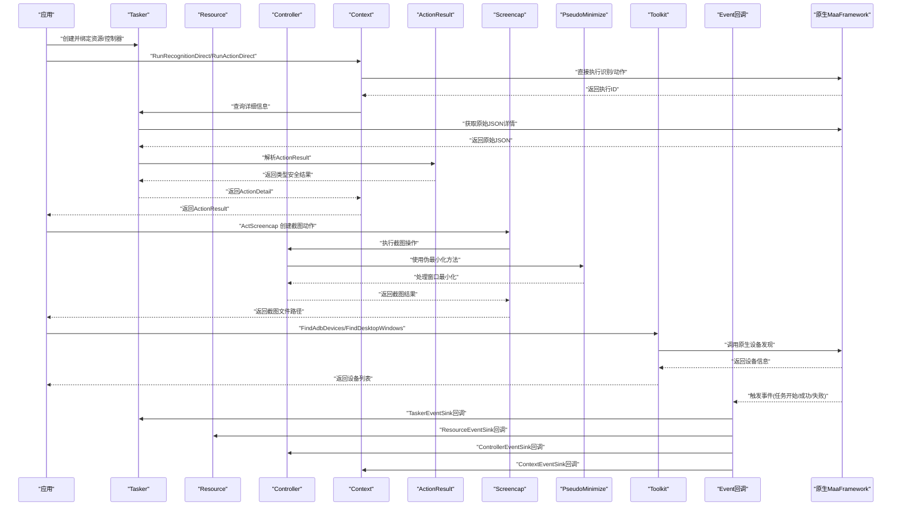
```mermaid
sequenceDiagram
participant App as "应用"
participant Tasker as "Tasker"
participant Res as "Resource"
participant Ctrl as "Controller"
participant Ctx as "Context"
participant AR as "ActionResult"
participant SC as "Screencap"
participant PM as "PseudoMinimize"
participant TK as "Toolkit"
participant Ev as "Event回调"
participant Native as "原生MaaFramework"
App->>Tasker : "创建并绑定资源/控制器"
App->>Ctx : "RunRecognitionDirect/RunActionDirect"
Ctx->>Native : "直接执行识别/动作"
Native-->>Ctx : "返回执行ID"
Ctx->>Tasker : "查询详细信息"
Tasker->>Native : "获取原始JSON详情"
Native-->>Tasker : "返回原始JSON"
Tasker->>AR : "解析ActionResult"
AR-->>Tasker : "返回类型安全结果"
Tasker-->>Ctx : "返回ActionDetail"
Ctx-->>App : "返回ActionResult"
App->>SC : "ActScreencap 创建截图动作"
SC->>Ctrl : "执行截图操作"
Ctrl->>PM : "使用伪最小化方法"
PM-->>Ctrl : "处理窗口最小化"
Ctrl-->>SC : "返回截图结果"
SC-->>App : "返回截图文件路径"
App->>TK : "FindAdbDevices/FindDesktopWindows"
TK->>Native : "调用原生设备发现"
Native-->>TK : "返回设备信息"
TK-->>App : "返回设备列表"
Native-->>Ev : "触发事件(任务开始/成功/失败)"
Ev->>Tasker : "TaskerEventSink回调"
Ev->>Res : "ResourceEventSink回调"
Ev->>Ctrl : "ControllerEventSink回调"
Ev->>Ctx : "ContextEventSink回调"
```

**图表来源**
- [controller.go](file://controller.go#L1-L418)
- [context.go](file://context.go#L209-L279)
- [action_result.go](file://action_result.go#L332-L374)
- [tasker.go](file://tasker.go#L320-L359)
- [Toolkit Api Reference.md](file://instructions/maafw-golang-binding/Toolkit Api Reference.md#L100-L127)

**章节来源**
- [controller.go](file://controller.go#L1-L418)
- [context.go](file://context.go#L209-L279)
- [action_result.go](file://action_result.go#L332-L374)
- [tasker.go](file://tasker.go#L320-L359)
- [Toolkit Api Reference.md](file://instructions/maafw-golang-binding/Toolkit Api Reference.md#L100-L127)

## 详细组件分析

### 初始化与配置
- maa.Init()：加载与 MaaFramework 相关的动态库并注册其相关函数。必须在调用任何其他 Maa 相关函数之前调用此函数。支持 InitOption 配置库目录、日志目录、保存绘图、输出级别、调试模式、插件路径等。
- maa.IsInited()：检查 Maa 框架是否已初始化。
- maa.Release()：释放 Maa 框架的动态库资源并注销其相关函数。
- maa.SetLogDir/SetSaveDraw/SetStdoutLevel/SetDebugMode：运行时设置日志目录、是否保存绘制、标准输出日志级别、调试模式。
- maa.LoadPlugin：加载插件。
- maa.ConfigInitOption：配置初始化选项（用户路径与默认配置 JSON）。

**章节来源**
- [controller.go](file://controller.go#L1-L418)
- [custom_controller.go](file://custom_controller.go#L1-L392)

### 任务管理器（Tasker）
- NewTasker()：创建一个新的任务管理器实例。
- Destroy()：释放任务管理器实例。
- BindResource(BindController)：将任务管理器绑定到已初始化的资源/控制器。
- Initialized()：检查任务管理器是否已初始化。
- PostTask(PostStop)：提交任务/停止信号，返回 TaskJob。
- Running/Stopping：检查实例是否正在运行/停止中。
- GetResource/GetController：获取资源/控制器句柄。
- ClearCache：清理运行时缓存。
- GetLatestNode：获取最新节点的详细信息。
- 事件回调：AddSink/RemoveSink/ClearSinks、AddContextSink/RemoveContextSink/ClearContextSinks。
- 任务详情：getTaskDetail/getNodeDetail/getRecognitionDetail/getActionDetail。
- **新增**：ActionDetail 结构包含动作标识、名称、类型、目标区域、成功标志、原始详情JSON和解析后的 ActionResult。

**更新** 增强了任务详情解析功能，支持 ActionResult 结果系统。

**章节来源**
- [controller.go](file://controller.go#L1-L418)
- [custom_controller.go](file://custom_controller.go#L1-L392)
- [tasker.go](file://tasker.go#L320-L359)

### 控制器（Controller）
- NewAdbController/NewWin32Controller/NewCustomController/NewPlayCoverController/NewGamepadController：创建不同类型的控制器实例。
- Destroy：释放控制器实例。
- SetScreenshotTargetLongSide/SetScreenshotTargetShortSide/SetScreenshotUseRawSize：截图尺寸与原始尺寸策略。
- PostConnect/PostClick/PostSwipe/PostClickKey/PostInputText/PostStartApp/PostStopApp/PostTouchDown/PostTouchMove/PostTouchUp/PostKeyDown/PostKeyUp/PostScreencap/PostScroll：设备操作。
- Connected/CacheImage/GetUUID/GetResolution：连接状态、缓存图像、设备 UUID、设备分辨率。
- 事件回调：AddSink/RemoveSink/ClearSinks 及便捷注册方法。
- ADB/Win32/PlayCover/游戏pad 方法枚举与解析：截图/输入方法集合与字符串解析。
- 自定义控制器接口与桥接：CustomController 与回调代理。

**更新** 新增游戏pad控制器支持，包括GamepadType枚举和相关常量定义。

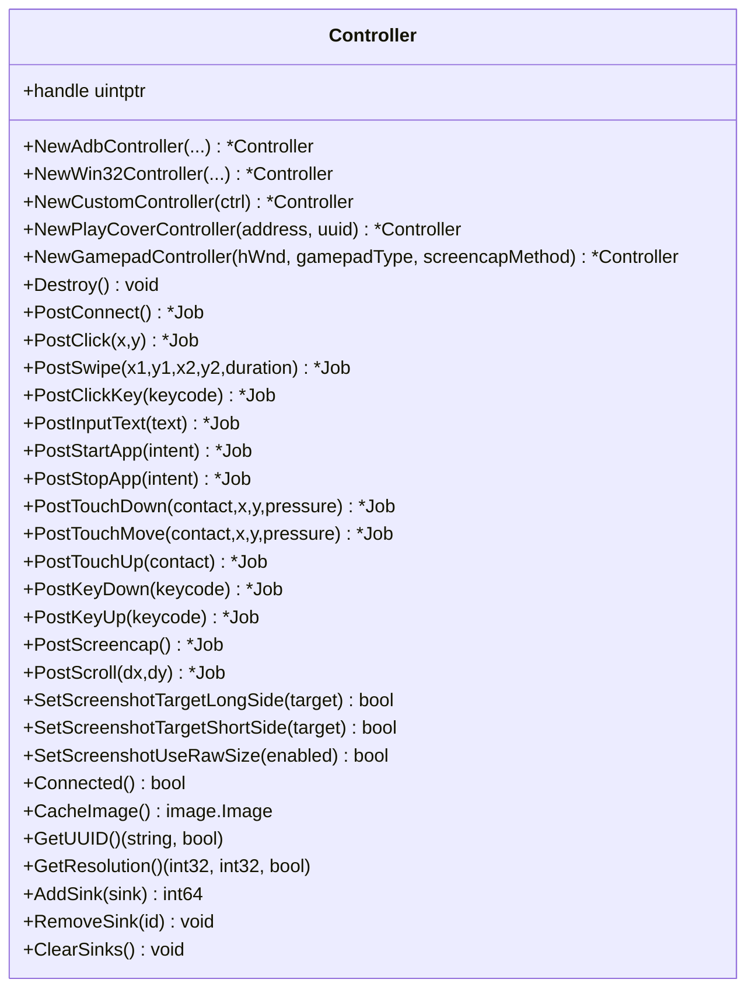
```mermaid
classDiagram
class Controller {
+handle uintptr
+NewAdbController(...) *Controller
+NewWin32Controller(...) *Controller
+NewCustomController(ctrl) *Controller
+NewPlayCoverController(address, uuid) *Controller
+NewGamepadController(hWnd, gamepadType, screencapMethod) *Controller
+Destroy() void
+PostConnect() *Job
+PostClick(x,y) *Job
+PostSwipe(x1,y1,x2,y2,duration) *Job
+PostClickKey(keycode) *Job
+PostInputText(text) *Job
+PostStartApp(intent) *Job
+PostStopApp(intent) *Job
+PostTouchDown(contact,x,y,pressure) *Job
+PostTouchMove(contact,x,y,pressure) *Job
+PostTouchUp(contact) *Job
+PostKeyDown(keycode) *Job
+PostKeyUp(keycode) *Job
+PostScreencap() *Job
+PostScroll(dx,dy) *Job
+SetScreenshotTargetLongSide(target) bool
+SetScreenshotTargetShortSide(target) bool
+SetScreenshotUseRawSize(enabled) bool
+Connected() bool
+CacheImage() image.Image
+GetUUID() (string, bool)
+GetResolution() (int32, int32, bool)
+AddSink(sink) int64
+RemoveSink(id) void
+ClearSinks() void
}
```

**图表来源**
- [controller.go](file://controller.go#L1-L418)

**章节来源**
- [controller.go](file://controller.go#L1-L418)
- [custom_controller.go](file://custom_controller.go#L1-L392)
- [gamepad控制器.md](file://instructions/maafw-golang-binding/核心概念/控制器 (Controller)/游戏pad控制器.md#L1-L474)

### 游戏pad控制器（Gamepad Controller）
- NewGamepadController(hWnd, gamepadType, screencapMethod)：创建虚拟游戏pad控制器实例
- GamepadType枚举：GamepadTypeXbox360、GamepadTypeDualShock4
- 按钮映射：ButtonA、ButtonB、ButtonX、ButtonY、ButtonLB、ButtonRB、ButtonStart、ButtonBack、ButtonGuide、ButtonDpadUp/Down/Left/Right
- 触摸输入：TouchLeftStick、TouchRightStick、TouchLeftTrigger、TouchRightTrigger
- ViGEm驱动依赖：需要安装ViGEm Bus Driver才能正常工作
- 屏幕截图功能：可选的Win32屏幕捕获方法

**更新** 新增完整的游戏pad控制器API参考，包括按钮映射、触摸输入和错误处理。

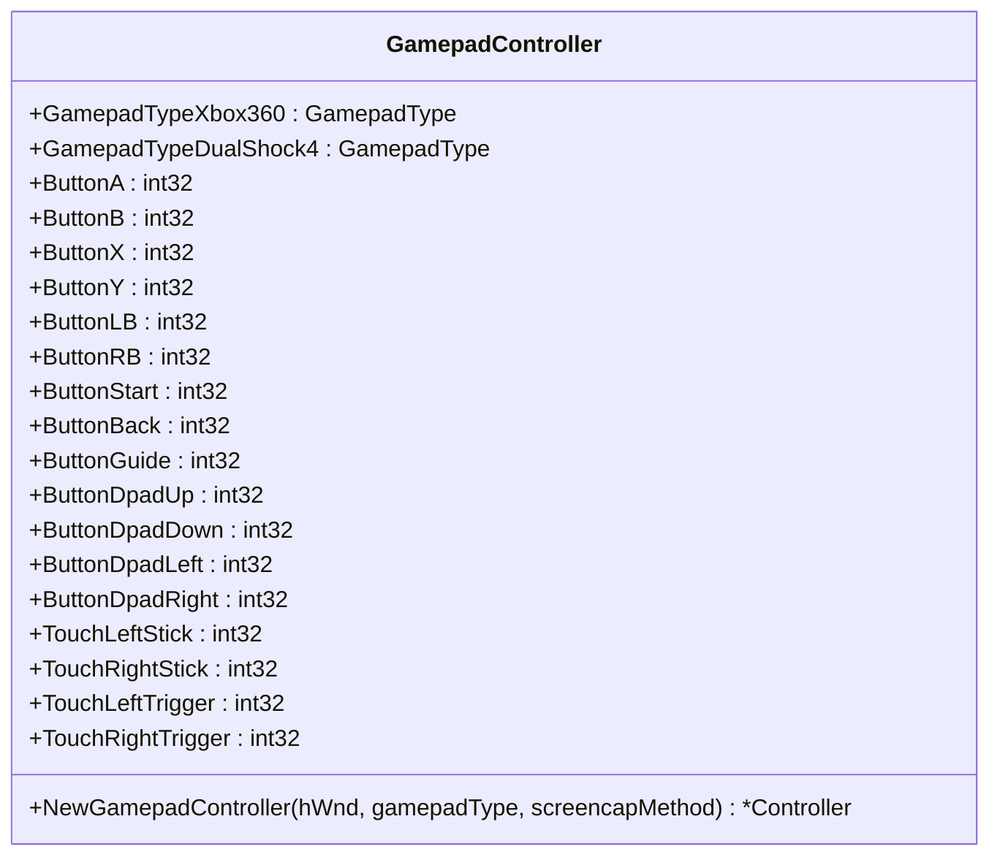
```mermaid
classDiagram
class GamepadController {
+NewGamepadController(hWnd, gamepadType, screencapMethod) *Controller
+GamepadTypeXbox360 : GamepadType
+GamepadTypeDualShock4 : GamepadType
+ButtonA : int32
+ButtonB : int32
+ButtonX : int32
+ButtonY : int32
+ButtonLB : int32
+ButtonRB : int32
+ButtonStart : int32
+ButtonBack : int32
+ButtonGuide : int32
+ButtonDpadUp : int32
+ButtonDpadDown : int32
+ButtonDpadLeft : int32
+ButtonDpadRight : int32
+TouchLeftStick : int32
+TouchRightStick : int32
+TouchLeftTrigger : int32
+TouchRightTrigger : int32
}
```

**图表来源**
- [gamepad控制器.md](file://instructions/maafw-golang-binding/核心概念/控制器 (Controller)/游戏pad控制器.md#L81-L119)

**章节来源**
- [gamepad控制器.md](file://instructions/maafw-golang-binding/核心概念/控制器 (Controller)/游戏pad控制器.md#L1-L474)
- [controller.go](file://controller.go#L121-L153)

### 控制器管理器（ControllerManager）
- CreateAdbController/CreateWin32Controller/CreatePlayCoverController/CreateGamepadController：创建不同类型的控制器实例
- ConnectController/DisconnectController：控制器连接和断开管理
- Click/Swipe/InputText/StartApp/StopApp：基础设备操作
- Screencap：截图功能，支持目标尺寸设置和缓存使用
- GetControllerStatus：获取控制器状态和UUID
- 游戏pad专用操作：ClickGamepadKey、TouchGamepadControl
- **新增**：Win32 输入方法映射：SendMessageWithWindowPos 和 PostMessageWithWindowPos 的支持
- **新增**：Win32 截图方法映射：FramePoolWithPseudoMinimize 和 PrintWindowWithPseudoMinimize 的支持

**更新** 新增CreateGamepadController方法和相关的游戏pad专用操作，增强Win32输入方法映射支持。新增伪最小化截图方法支持。

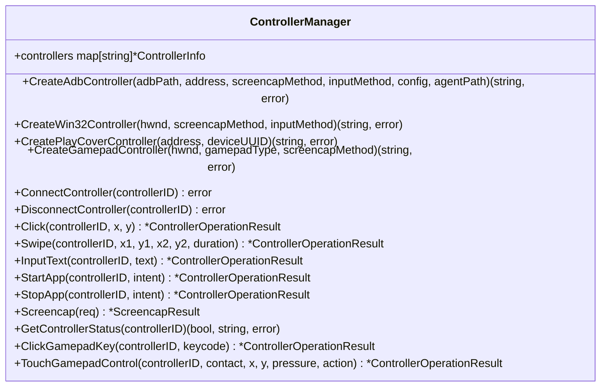
```mermaid
classDiagram
class ControllerManager {
+controllers map[string]*ControllerInfo
+CreateAdbController(adbPath, address, screencapMethod, inputMethod, config, agentPath) (string, error)
+CreateWin32Controller(hwnd, screencapMethod, inputMethod) (string, error)
+CreatePlayCoverController(address, deviceUUID) (string, error)
+CreateGamepadController(hwnd, gamepadType, screencapMethod) (string, error)
+ConnectController(controllerID) error
+DisconnectController(controllerID) error
+Click(controllerID, x, y) *ControllerOperationResult
+Swipe(controllerID, x1, y1, x2, y2, duration) *ControllerOperationResult
+InputText(controllerID, text) *ControllerOperationResult
+StartApp(controllerID, intent) *ControllerOperationResult
+StopApp(controllerID, intent) *ControllerOperationResult
+Screencap(req) *ScreencapResult
+GetControllerStatus(controllerID) (bool, string, error)
+ClickGamepadKey(controllerID, keycode) *ControllerOperationResult
+TouchGamepadControl(controllerID, contact, x, y, pressure, action) *ControllerOperationResult
}
```

**图表来源**
- [controller_manager.go](file://LocalBridge/internal/mfw/controller_manager.go#L1-L994)

**章节来源**
- [controller_manager.go](file://LocalBridge/internal/mfw/controller_manager.go#L1-L994)

### 设备管理器（DeviceManager）
- **新增**：GetWin32Windows：获取 Win32 窗口列表，包含所有可用的输入方法
- **新增**：Win32 输入方法列表：Seize、SendMessage、PostMessage、LegacyEvent、PostThreadMessage、SendMessageWithCursorPos、PostMessageWithCursorPos、SendMessageWithWindowPos、PostMessageWithWindowPos
- **新增**：Win32 截图方法列表：GDI、FramePool、**新增**：FramePoolWithPseudoMinimize、DXGI_DesktopDup、DXGI_DesktopDup_Window、PrintWindow、**新增**：PrintWindowWithPseudoMinimize、ScreenDC

**更新** 新增设备管理器功能，提供 Win32 窗口发现和输入方法配置。新增伪最小化截图方法支持。

**章节来源**
- [device_manager.go](file://LocalBridge/internal/mfw/device_manager.go#L70-L110)

### 协议处理器（MFWHandler）
- handleCreateGamepadController：处理游戏pad控制器创建请求
- handleDisconnectController：处理控制器断开连接请求
- handleScreencap：处理截图请求
- handleControllerClick/handleControllerSwipe/handleControllerInputText/handleControllerStartApp/handleControllerStopApp：处理各种控制器操作请求
- 自动连接功能：创建游戏pad控制器后自动尝试连接

**更新** 新增游戏pad控制器的协议处理支持。

**章节来源**
- [handler.go](file://LocalBridge/internal/protocol/mfw/handler.go#L266-L303)
- [handler.go](file://LocalBridge/internal/protocol/mfw/handler.go#L332-L459)

### 数据模型（Models）
- CreateGamepadControllerRequest：游戏pad控制器创建请求数据结构
- ControllerCreatedResponse：控制器创建结果响应
- ControllerClickKeyRequest：手柄按键点击请求
- ControllerTouchGamepadRequest：手柄触摸操作请求
- ControllerEventData：控制器事件数据

**更新** 新增游戏pad控制器相关的数据模型定义。

**章节来源**
- [mfw.go](file://LocalBridge/pkg/models/mfw.go#L22-L98)

### 资源管理器（Resource）
- NewResource/Destroy：创建/销毁资源。
- UseCPU/UseDirectml/UseCoreml/UseAutoExecutionProvider：推理设备与执行提供者设置。
- RegisterCustomRecognition/UnregisterCustomRecognition/ClearCustomRecognition：自定义识别注册/注销/清空。
- RegisterCustomAction/UnregisterCustomAction/ClearCustomAction：自定义动作注册/注销/清空。
- PostBundle/Clear/Loaded/GetHash：资源包添加、清空、加载状态、资源哈希。
- OverridePipeline/OverrideNext/OverrideImage：流水线/下一跳/图像覆盖。
- GetNodeJSON/GetNodeList/GetCustomRecognitionList/GetCustomActionList：节点与列表查询。
- AddSink/RemoveSink/ClearSinks：事件回调管理。

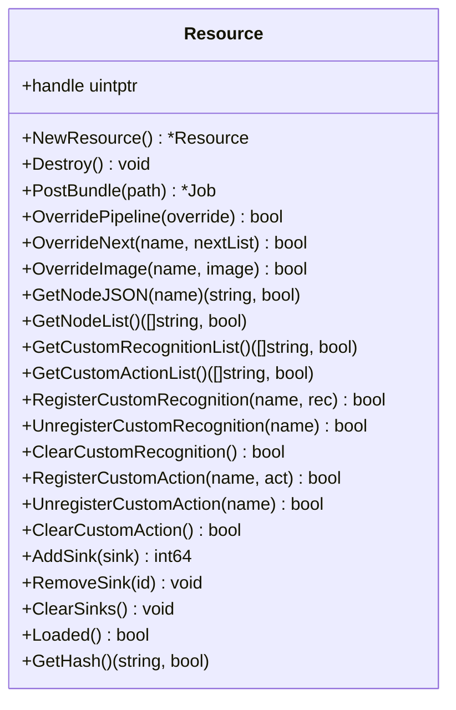
```mermaid
classDiagram
class Resource {
+handle uintptr
+NewResource() *Resource
+Destroy() void
+PostBundle(path) *Job
+OverridePipeline(override) bool
+OverrideNext(name, nextList) bool
+OverrideImage(name, image) bool
+GetNodeJSON(name) (string, bool)
+GetNodeList() ([]string, bool)
+GetCustomRecognitionList() ([]string, bool)
+GetCustomActionList() ([]string, bool)
+RegisterCustomRecognition(name, rec) bool
+UnregisterCustomRecognition(name) bool
+ClearCustomRecognition() bool
+RegisterCustomAction(name, act) bool
+UnregisterCustomAction(name) bool
+ClearCustomAction() bool
+AddSink(sink) int64
+RemoveSink(id) void
+ClearSinks() void
+Loaded() bool
+GetHash() (string, bool)
}
```

**图表来源**
- [controller.go](file://controller.go#L1-L418)

**章节来源**
- [controller.go](file://controller.go#L1-L418)
- [custom_controller.go](file://custom_controller.go#L1-L392)

### 执行上下文（Context）
- RunTask/RunRecognition/RunAction：在上下文中执行任务/识别/动作。
- **新增**：RunRecognitionDirect/RunActionDirect：直接执行识别和动作，无需流水线入口。
- OverridePipeline/OverrideNext/OverrideImage：上下文级覆盖。
- GetNodeJSON/GetNodeData：节点 JSON 与结构化数据。
- GetTaskJob/GetTasker/Clone：当前任务作业、Tasker 实例、上下文克隆。
- SetAnchor/GetAnchor/GetHitCount/ClearHitCount：锚点与命中计数管理。
- **新增**：WaitFreezes：屏幕稳定检测，等待屏幕状态稳定。
- override 参数支持 JSON 字符串或可序列化对象。

**更新** 新增直接执行方法和状态监控功能，显著增强了 Context 的灵活性。

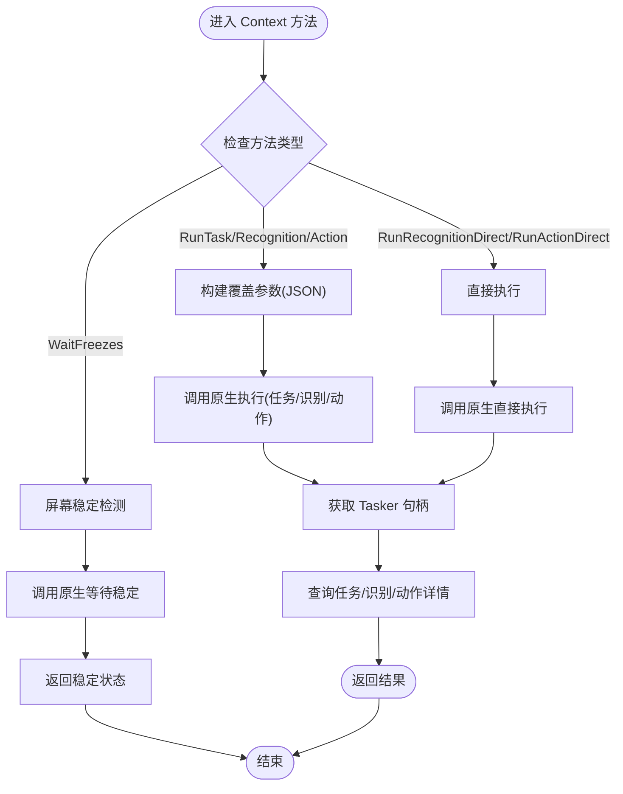
```mermaid
flowchart TD
Start(["进入 Context 方法"]) --> CheckMethod{"检查方法类型"}
CheckMethod --> |RunTask/Recognition/Action| BuildOverride["构建覆盖参数(JSON)"]
CheckMethod --> |RunRecognitionDirect/RunActionDirect| DirectExec["直接执行"]
CheckMethod --> |WaitFreezes| FreezeCheck["屏幕稳定检测"]
BuildOverride --> CallNative["调用原生执行(任务/识别/动作)"]
DirectExec --> CallDirect["调用原生直接执行"]
FreezeCheck --> CallWait["调用原生等待稳定"]
CallNative --> GetTasker["获取 Tasker 句柄"]
CallDirect --> GetTasker
CallWait --> ReturnBool["返回稳定状态"]
GetTasker --> QueryDetail["查询任务/识别/动作详情"]
QueryDetail --> Return(["返回结果"])
ReturnBool --> End(["结束"])
Return(["返回结果"]) --> End
```

**图表来源**
- [context.go](file://context.go#L209-L279)
- [context.go](file://context.go#L418-L428)

**章节来源**
- [context.go](file://context.go#L1-L472)
- [custom_controller.go](file://custom_controller.go#L1-L392)
- [执行上下文.md](file://instructions/maafw-golang-binding/API参考/执行上下文.md#L273-L428)
- [执行上下文 (Context).md](file://instructions/maafw-golang-binding/核心概念/执行上下文 (Context).md#L166-L289)

### ActionResult 结果系统
- **新增**：ActionResult 结构体，封装动作类型和对应的详细结果。
- **新增**：类型安全的结果访问接口，支持 AsClick、AsLongPress、AsSwipe、AsMultiSwipe、AsClickKey、AsLongPressKey、AsInputText、AsApp、AsScroll、AsTouch、AsShell、**新增**：AsScreencap 等方法。
- **新增**：十种主要的动作结果类型，支持点击、长按、滑动、按键输入、文本输入、应用控制、滚动、触摸、Shell 命令、**新增**：截图等。
- **新增**：Point 类型，支持字符串和数组格式的坐标解析。
- **新增**：SwipeActionResult 特殊处理，支持多种 end 参数格式。
- **新增**：延迟解析策略，只在需要时解析特定类型的结果。

**更新** 新增完整的 ActionResult 结果系统，提供类型安全的动作结果解析能力。**新增**：AsScreencap 方法支持截图结果的类型安全访问。

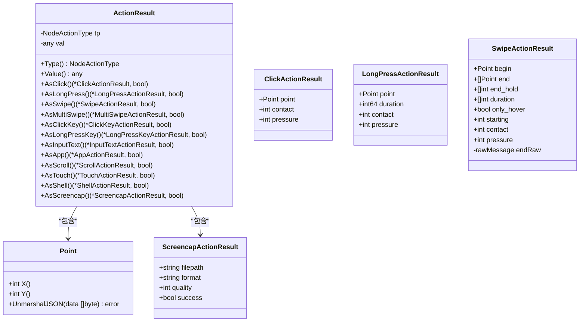
```mermaid
classDiagram
class ActionResult {
-NodeActionType tp
-any val
+Type() NodeActionType
+Value() any
+AsClick() (*ClickActionResult, bool)
+AsLongPress() (*LongPressActionResult, bool)
+AsSwipe() (*SwipeActionResult, bool)
+AsMultiSwipe() (*MultiSwipeActionResult, bool)
+AsClickKey() (*ClickKeyActionResult, bool)
+AsLongPressKey() (*LongPressKeyActionResult, bool)
+AsInputText() (*InputTextActionResult, bool)
+AsApp() (*AppActionResult, bool)
+AsScroll() (*ScrollActionResult, bool)
+AsTouch() (*TouchActionResult, bool)
+AsShell() (*ShellActionResult, bool)
+AsScreencap() (*ScreencapActionResult, bool)
}
class Point {
+int X()
+int Y()
+UnmarshalJSON(data []byte) error
}
class ClickActionResult {
+Point point
+int contact
+int pressure
}
class LongPressActionResult {
+Point point
+int64 duration
+int contact
+int pressure
}
class SwipeActionResult {
+Point begin
+[]Point end
+[]int end_hold
+[]int duration
+bool only_hover
+int starting
+int contact
+int pressure
-rawMessage endRaw
}
class ScreencapActionResult {
+string filepath
+string format
+int quality
+bool success
}
ActionResult --> Point : "包含"
ActionResult --> ScreencapActionResult : "包含"
```

**图表来源**
- [action_result.go](file://action_result.go#L48-L330)

**章节来源**
- [action_result.go](file://action_result.go#L1-L375)
- [tasker.go](file://tasker.go#L320-L359)
- [context.go](file://context.go#L247-L279)
- [ActionResult结果系统.md](file://instructions/maafw-golang-binding/高级功能/ActionResult结果系统.md#L68-L357)

### ActScreencap 动作类型
- **新增**：ActScreencap 函数：创建 Screencap 动作，支持截图参数配置。
- **新增**：ActionTypeScreencap：截图动作类型常量。
- **新增**：ScreencapParam 结构体：包含文件名、格式和质量等参数。
- **新增**：ScreencapActionResult 结构体：包含截图文件路径、格式、质量等结果信息。
- **新增**：AsScreencap 方法：在 ActionResult 中进行类型安全的截图结果访问。

**更新** 新增 ActScreencap 动作类型支持，为自动化任务提供截图功能。

**章节来源**
- [API大全.md](file://instructions/maafw-golang-binding/API大全.md#L233-L235)
- [API大全.md](file://instructions/maafw-golang-binding/API大全.md#L355)
- [API大全.md](file://instructions/maafw-golang-binding/API大全.md#L2219-L2228)
- [API大全.md](file://instructions/maafw-golang-binding/API大全.md#L2212-L2218)
- [API大全.md](file://instructions/maafw-golang-binding/API大全.md#L313-L314)

### 伪最小化截图方法（新增）
- **新增**：FramePoolWithPseudoMinimize：基于 FramePool 的截图方法，内置伪最小化支持
- **新增**：PrintWindowWithPseudoMinimize：基于 PrintWindow 的截图方法，内置伪最小化支持
- **新增**：win32ScreencapMethodMapping：截图方法映射表，将伪最小化变体映射到对应的基础方法
- **新增**：parseWin32ScreencapMethod：解析 Win32 截图方法，支持伪最小化变体
- **新增**：设备管理器截图方法列表包含伪最小化选项
- **新增**：兼容性说明：伪最小化方法在窗口最小化时自动处理，提供更好的用户体验

**更新** 新增 WithPseudoMinimize 截图方法支持，提供更好的窗口最小化兼容性。

**章节来源**
- [controller_manager.go](file://LocalBridge/internal/mfw/controller_manager.go#L91-L104)
- [device_manager.go](file://LocalBridge/internal/mfw/device_manager.go#L73-L76)
- [2.4-控制方式说明.md](file://instructions/maafw-guide/2.4-控制方式说明.md#L98-L101)

### 事件系统（Event）
- 事件状态枚举：Unknown/Starting/Succeeded/Failed。
- 事件详情结构体：ResourceLoadingDetail、ControllerActionDetail、TaskerTaskDetail、NodePipelineNodeDetail、NodeRecognitionNodeDetail、NodeActionNodeDetail、NodeNextListDetail、NodeRecognitionDetail、NodeActionDetail。
- 事件回调接口：TaskerEventSink/ResourceEventSink/ControllerEventSink/ContextEventSink。
- 注册与管理：registerEventCallback/unregisterEventCallback、AddSink/RemoveSink/ClearSinks、AddContextSink/RemoveContextSink/ClearContextSinks。
- 消息路由：按消息后缀解析状态，按消息前缀匹配事件类型。

**更新** 事件系统已重构，采用手写适配器而非代码生成，移除了 event_sinks_gen.go 文件。

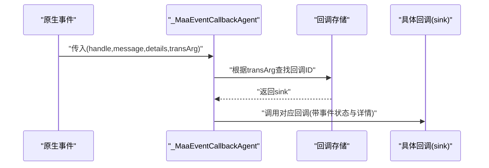
```mermaid
sequenceDiagram
participant Native as "原生事件"
participant Agent as "_MaaEventCallbackAgent"
participant Store as "回调存储"
participant Sink as "具体回调(sink)"
Native->>Agent : "传入(handle,message,details,transArg)"
Agent->>Store : "根据transArg查找回调ID"
Store-->>Agent : "返回sink"
Agent->>Sink : "调用对应回调(带事件状态与详情)"
```

**图表来源**
- [controller.go](file://controller.go#L1-L418)
- [custom_controller.go](file://custom_controller.go#L1-L392)

**章节来源**
- [controller.go](file://controller.go#L1-L418)
- [custom_controller.go](file://custom_controller.go#L1-L392)

### 自定义功能
- 自定义动作（CustomAction）：实现 Run(ctx, arg) bool，通过 Resource.RegisterCustomAction 注册，流水线中以 action=Custom、custom_action=名称的方式触发。
- 自定义识别（CustomRecognition）：实现 Run(ctx, arg) -> (result, bool)，通过 Resource.RegisterCustomRecognition 注册，可在 Run 中使用 Context 的 RunRecognition/OverridePipeline/Clone/OverrideNext 等能力。
- 自定义控制器（CustomController）：实现 Connect/RequestUUID/GetFeature/StartApp/StopApp/Screencap/Click/Swipe/TouchDown/TouchMove/TouchUp/ClickKey/InputText/KeyDown/KeyUp 等方法，通过 NewCustomController 绑定。

**章节来源**
- [controller.go](file://controller.go#L1-L418)
- [custom_controller.go](file://custom_controller.go#L1-L392)

### Agent 架构
- Agent 客户端：NewAgentClient/BindResource/Connect/Connected/Alive/SetTimeout/GetCustomActionList/GetCustomRecognitionList；与 Agent 服务器通过动态库桥接通信。
- Agent 服务器：AgentServerRegisterCustomAction/AgentServerStartUp/AgentServerJoin/AgentServerShutDown；支持事件回调注册与自定义动作回调。

**章节来源**
- [controller.go](file://controller.go#L1-L418)
- [custom_controller.go](file://custom_controller.go#L1-L392)

### 前端调试系统集成
- DebugProtocol：处理调试相关的协议消息，包括资源加载、识别开始、任务状态等事件
- ErrorProtocol：统一的错误处理协议，支持MFW系列错误码
- DebugPanel：前端调试面板组件，提供调试界面和状态显示
- debugStore：调试状态管理，维护调试会话、节点执行状态等

**更新** 新增与前端调试系统的深度集成，支持控制器事件处理和错误提示。

**章节来源**
- [DebugProtocol.ts](file://src/services/protocols/DebugProtocol.ts#L428-L476)
- [ErrorProtocol.ts](file://src/services/protocols/ErrorProtocol.ts#L39-L67)
- [DebugPanel.tsx](file://src/components/panels/tools/DebugPanel.tsx#L107-L149)
- [debugStore.ts](file://src/stores/debugStore.ts#L148-L720)

### Toolkit API（新增）
- **新增**：ConfigInitOption：初始化工具包配置选项
- **新增**：FindAdbDevices：发现 ADB 设备，支持指定 ADB 路径或扫描所有设备
- **新增**：FindDesktopWindows：发现系统中的所有桌面窗口
- **新增**：AdbDevice 结构体：包含设备名称、ADB 路径、地址、截图方法、输入方法、配置信息
- **新增**：DesktopWindow 结构体：包含窗口句柄、类名、窗口标题
- **新增**：纯 Go 实现：使用 purego 库进行动态库调用，无需 CGO 支持
- **新增**：跨平台支持：支持 Windows、Linux、macOS 平台

**更新** 新增完整的 Toolkit API 参考文档，提供系统级设备发现和配置管理功能。

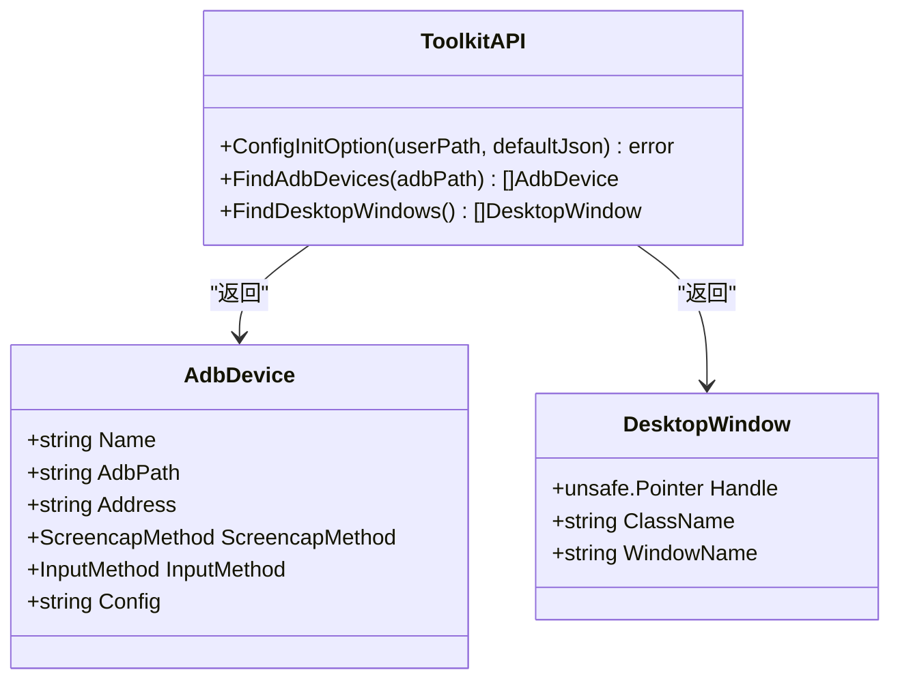
```mermaid
classDiagram
class ToolkitAPI {
+ConfigInitOption(userPath, defaultJson) error
+FindAdbDevices(adbPath) []AdbDevice
+FindDesktopWindows() []DesktopWindow
}
class AdbDevice {
+string Name
+string AdbPath
+string Address
+ScreencapMethod ScreencapMethod
+InputMethod InputMethod
+string Config
}
class DesktopWindow {
+unsafe.Pointer Handle
+string ClassName
+string WindowName
}
ToolkitAPI --> AdbDevice : "返回"
ToolkitAPI --> DesktopWindow : "返回"
```

**图表来源**
- [Toolkit Api Reference.md](file://instructions/maafw-golang-binding/Toolkit Api Reference.md#L72-L95)

**章节来源**
- [Toolkit Api Reference.md](file://instructions/maafw-golang-binding/Toolkit Api Reference.md#L1-L375)

### Win32 控制器输入方法（新增）
- **新增**：SendMessageWithWindowPos：短暂移动窗口使目标位置与光标重合后恢复，不抢占鼠标
- **新增**：PostMessageWithWindowPos：短暂移动窗口使目标位置与光标重合后恢复，不抢占鼠标
- **新增**：输入方法映射：SendMessageWithWindowPos → SendMessageWithCursorPosAndBlockInput
- **新增**：输入方法映射：PostMessageWithWindowPos → PostMessageWithCursorPosAndBlockInput
- **新增**：兼容性说明：WindowPos 系列方式不会移动光标，因此不抢占鼠标，但窗口会短暂闪烁

**更新** 新增 Win32 控制器 WindowPos 系列输入方法支持和兼容性说明。

**章节来源**
- [controller_manager.go](file://LocalBridge/internal/mfw/controller_manager.go#L78-L81)
- [device_manager.go](file://LocalBridge/internal/mfw/device_manager.go#L75-L76)
- [2.4-控制方式说明.md](file://instructions/maafw-guide/2.4-控制方式说明.md#L69-L71)

## 依赖关系分析
- 组件耦合
  - Tasker 依赖 Resource 与 Controller（绑定与查询）
  - Context 依赖 Tasker（获取任务详情、当前任务作业），**新增**：Context 依赖 ActionResult 系统进行结果解析
  - Event 系统为 Tasker/Resource/Controller/Context 提供统一的回调入口
  - Job/TaskJob 为 Tasker/Resource/Controller 的异步操作提供统一的状态查询与等待
  - ControllerManager 统一管理各种控制器的生命周期和操作
  - DeviceManager 管理 Win32 窗口发现和输入方法配置
  - MFWHandler 处理前端协议消息，协调控制器管理器执行操作
  - 前端调试系统通过协议与后端通信，实现实时调试监控
  - **新增**：Tasker 依赖 ActionResult 系统进行动作结果解析
  - **新增**：ControllerManager 依赖 DeviceManager 获取 Win32 窗口信息
  - **新增**：Toolkit API 提供系统级设备发现功能
  - **新增**：Screencap 动作依赖 ActionResult 系统进行截图结果解析
  - **新增**：伪最小化截图方法依赖 Win32 原生 API 提供窗口状态处理
- 外部依赖
  - 通过 internal/native 与原生 MaaFramework 交互
  - 通过 internal/store 维护句柄到回调映射与自定义识别/动作的回调 ID 映射
  - 游戏pad控制器依赖ViGEm驱动进行虚拟手柄模拟
  - **新增**：Toolkit API 依赖 purego 库进行动态库调用
  - **新增**：Win32 控制器依赖 Windows API 进行窗口操作
  - **新增**：ActionResult 系统依赖节点动作类型定义
  - **新增**：伪最小化功能依赖 Win32 窗口状态 API

**更新** 新增 Toolkit API、增强的 Context 依赖关系和 Win32 控制器输入方法映射。**新增**：ActScreencap 动作类型及其相关依赖。**新增**：伪最小化截图方法支持。

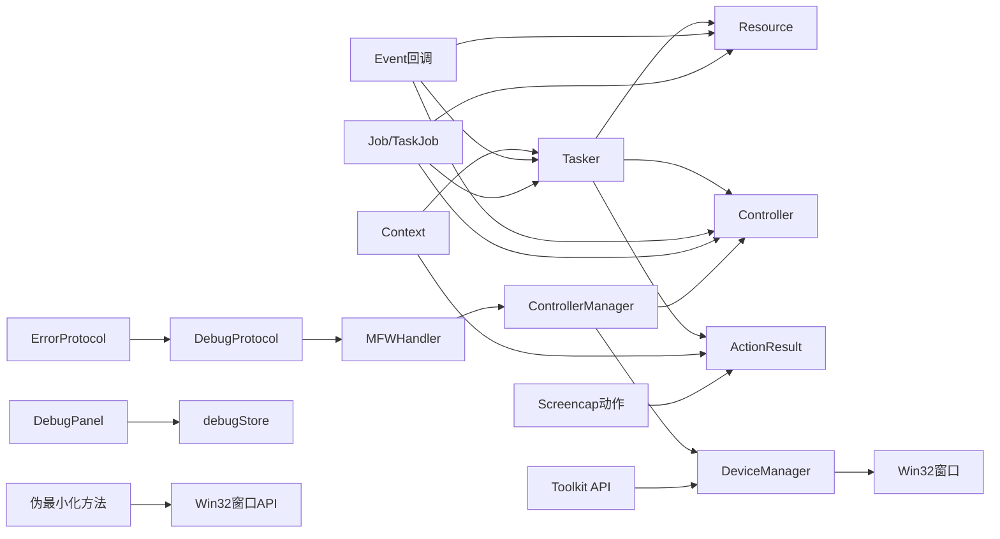
```mermaid
graph LR
Tasker["Tasker"] --> Resource["Resource"]
Tasker --> Controller["Controller"]
Tasker --> ActionResult["ActionResult"]
Context["Context"] --> Tasker
Context --> ActionResult
Event["Event回调"] --> Tasker
Event --> Resource
Event --> Controller
Job["Job/TaskJob"] --> Tasker
Job --> Resource
Job --> Controller
ControllerManager["ControllerManager"] --> Controller
ControllerManager --> DeviceManager["DeviceManager"]
DeviceManager --> Win32Windows["Win32窗口"]
MFWHandler["MFWHandler"] --> ControllerManager
DebugProtocol["DebugProtocol"] --> MFWHandler
ErrorProtocol["ErrorProtocol"] --> DebugProtocol
DebugPanel["DebugPanel"] --> DebugStore["debugStore"]
ToolkitAPI["Toolkit API"] --> DeviceManager
Screencap["Screencap动作"] --> ActionResult
PseudoMinimize["伪最小化方法"] --> Win32API["Win32窗口API"]
```

**图表来源**
- [controller.go](file://controller.go#L1-L418)
- [controller_manager.go](file://LocalBridge/internal/mfw/controller_manager.go#L1-L994)
- [device_manager.go](file://LocalBridge/internal/mfw/device_manager.go#L1-L110)
- [handler.go](file://LocalBridge/internal/protocol/mfw/handler.go#L1-L694)
- [DebugProtocol.ts](file://src/services/protocols/DebugProtocol.ts#L428-L476)
- [action_result.go](file://action_result.go#L1-L375)
- [tasker.go](file://tasker.go#L320-L359)
- [Toolkit Api Reference.md](file://instructions/maafw-golang-binding/Toolkit Api Reference.md#L1-L375)

**章节来源**
- [controller.go](file://controller.go#L1-L418)
- [controller_manager.go](file://LocalBridge/internal/mfw/controller_manager.go#L1-L994)
- [device_manager.go](file://LocalBridge/internal/mfw/device_manager.go#L1-L110)
- [handler.go](file://LocalBridge/internal/protocol/mfw/handler.go#L1-L694)
- [action_result.go](file://action_result.go#L1-L375)
- [tasker.go](file://tasker.go#L320-L359)
- [Toolkit Api Reference.md](file://instructions/maafw-golang-binding/Toolkit Api Reference.md#L1-L375)

## 性能考虑
- 异步作业模型：使用 Job/TaskJob 避免阻塞主线程，提高吞吐量。
- 缓存与复用：Tasker/Resource/Controller 在销毁时会注销所有回调，避免内存泄漏；Context 提供 Clone，可在需要时复制上下文以减少重复配置。
- 图像与缓冲：识别与动作过程中大量使用图像缓冲，注意及时释放缓冲区，避免内存占用过高。
- 事件回调：回调注册/注销需成对出现，避免回调表膨胀导致性能下降。
- 推理设备选择：UseAutoExecutionProvider 可自动选择最优执行提供者，但具体性能取决于运行环境；GPU 加速通常优于 CPU，但需考虑显存占用与驱动稳定性。
- 游戏pad控制器：ViGEm驱动的使用可能带来额外的系统开销，建议在不需要时及时断开连接。
- 前端集成：调试协议的消息处理需要考虑网络延迟和消息队列长度，避免阻塞UI线程。
- **新增**：ActionResult 解析优化：采用延迟解析策略，只在需要时解析特定类型的结果，避免不必要的计算开销。
- **新增**：Context 直接执行方法：RunRecognitionDirect 和 RunActionDirect 避免了流水线查找开销，直接参数传递减少了中间步骤，提高执行效率。
- **新增**：WaitFreezes 采用非阻塞等待机制，支持超时控制，避免长时间阻塞。
- **新增**：Toolkit API 性能优化：使用 purego 库进行动态库调用，避免 CGO 依赖带来的性能开销；设备发现过程采用智能内存管理模式。
- **新增**：Win32 输入方法选择：WindowPos 系列方法不会抢占鼠标，但会短暂移动窗口，适合需要精确位置控制但不希望影响用户操作的场景。
- **新增**：Screencap 动作性能：截图操作会生成文件，注意磁盘空间和I/O性能；建议合理设置图片质量和格式。
- **新增**：伪最小化截图方法性能：内置窗口状态处理，避免频繁的窗口激活/最小化操作，减少系统开销；在窗口最小化场景下提供更好的用户体验。

**更新** 新增 Toolkit API、ActionResult 结果系统和 Context 直接执行方法的性能考虑，以及 Win32 输入方法的选择策略。**新增**：ActScreencap 动作的性能考虑。**新增**：伪最小化截图方法的性能优势。

**章节来源**
- [controller.go](file://controller.go#L1-L418)
- [controller_manager.go](file://LocalBridge/internal/mfw/controller_manager.go#L1-L994)
- [device_manager.go](file://LocalBridge/internal/mfw/device_manager.go#L1-L110)
- [gamepad控制器.md](file://instructions/maafw-golang-binding/核心概念/控制器 (Controller)/游戏pad控制器.md#L413-L431)
- [action_result.go](file://action_result.go#L407-L414)
- [执行上下文.md](file://instructions/maafw-golang-binding/API参考/执行上下文.md#L637-L649)
- [执行上下文 (Context).md](file://instructions/maafw-golang-binding/核心概念/执行上下文 (Context).md#L327-L332)
- [Toolkit Api Reference.md](file://instructions/maafw-golang-binding/Toolkit Api Reference.md#L281-L306)
- [2.4-控制方式说明.md](file://instructions/maafw-guide/2.4-控制方式说明.md#L69-L71)

## 故障排查指南
- 初始化失败
  - 确认已正确初始化并配置运行库路径
  - 检查 Tasker/Resource/Controller 的初始化状态与错误返回值
- 事件未回调
  - 确认已正确注册 AddSink/RemoveSink，且回调 ID 未被重复使用
  - 检查事件消息前缀与回调类型匹配
- 任务无结果
  - 使用 Wait() 等待完成后再调用 GetDetail()
  - 检查 OverridePipeline/OverrideNext/OverrideImage 是否正确覆盖
- 设备连接问题
  - 确认 PostConnect 成功，Connected() 返回真
  - 检查截图尺寸设置与缓存图像是否可用
- 自定义动作/识别问题
  - 确认名称唯一且已注册
  - 检查 override 参数是否可序列化
  - 检查 Context 句柄有效性与任务详情获取
- 游戏pad控制器问题
  - ViGEm驱动未安装：创建控制器时返回失败，需要下载并安装最新版本的ViGEm驱动
  - 窗口句柄无效：确保传入有效的窗口句柄，支持十六进制字符串格式
  - 屏幕截图功能异常：检查Win32屏幕捕获方法的兼容性
- 前端调试问题
  - 控制器连接超时：检查网络连接和防火墙设置
  - 调试事件未显示：确认调试协议已正确配置和连接
  - 错误提示不准确：检查后端日志和错误码映射
- **新增**：ActionResult 解析错误
  - 检查坐标点格式是否正确，确保包含恰好两个整数元素
  - 确认动作类型与期望类型相符，使用正确的 AsXxx 方法
  - 验证滑动结束点JSON格式符合支持的格式之一
  - 检查未知动作类型，确认动作类型拼写或更新框架版本
  - **新增**：检查 AsScreencap 方法的返回值，确认截图操作成功
- **新增**：Context 直接执行方法问题
  - 确认 NodeRecognitionParam/NodeActionParam 类型正确且参数符合约束
  - 验证图像格式与尺寸满足底层要求
  - 检查 WaitFreezes 的超时参数和 ROI 参数设置
- **新增**：WaitFreezes 返回 false
  - 检查检测区域设置是否合理
  - 调整等待参数（阈值、方法、超时等）
- **新增**：Toolkit API 问题
  - 库加载失败：确认 MaaFramework 库文件存在于指定路径，检查库文件权限
  - 设备发现失败：确保 ADB 服务正常运行，检查设备连接状态
  - 窗口发现异常：以管理员权限运行程序，检查系统安全设置
- **新增**：Win32 输入方法问题
  - WindowPos 方法无效：检查目标程序是否支持窗口位置移动
  - 输入方法选择：根据目标程序的权限级别选择合适的输入方法
  - 管理员权限：若目标程序为管理员权限，需以管理员权限运行以保证兼容性
- **新增**：ActScreencap 动作问题
  - 检查截图参数配置，确认文件名、格式和质量参数有效
  - 验证控制器支持截图功能，检查设备分辨率和截图方法
  - 检查磁盘空间和权限，确保能够写入截图文件
- **新增**：伪最小化截图方法问题
  - 检查目标程序是否支持窗口状态变化
  - 验证截图方法兼容性，某些程序可能不支持伪最小化
  - 调整截图参数，确保在窗口最小化场景下的稳定性

**更新** 新增 Toolkit API、ActionResult 结果系统、Context 直接执行方法和 Win32 输入方法的故障排查指南。**新增**：ActScreencap 动作的故障排查指南。**新增**：伪最小化截图方法的故障排查指南。

**章节来源**
- [controller.go](file://controller.go#L1-L418)
- [controller_manager.go](file://LocalBridge/internal/mfw/controller_manager.go#L158-L211)
- [device_manager.go](file://LocalBridge/internal/mfw/device_manager.go#L75-L76)
- [gamepad控制器.md](file://instructions/maafw-golang-binding/核心概念/控制器 (Controller)/游戏pad控制器.md#L432-L462)
- [DebugProtocol.ts](file://src/services/protocols/DebugProtocol.ts#L428-L476)
- [ErrorProtocol.ts](file://src/services/protocols/ErrorProtocol.ts#L39-L67)
- [action_result.go](file://action_result.go#L416-L442)
- [执行上下文.md](file://instructions/maafw-golang-binding/API参考/执行上下文.md#L651-L675)
- [执行上下文 (Context).md](file://instructions/maafw-golang-binding/核心概念/执行上下文 (Context).md#L339-L355)
- [Toolkit Api Reference.md](file://instructions/maafw-golang-binding/Toolkit Api Reference.md#L307-L350)
- [2.4-控制方式说明.md](file://instructions/maafw-guide/2.4-控制方式说明.md#L69-L71)

## 结论
maa-framework-go 通过 Tasker、Resource、Controller、Context、Event 与 Job/TaskJob 的协同，构建了一个清晰、可扩展且高性能的自动化框架。Tasker 作为中枢协调任务执行，Resource 管理识别资源与流水线，Controller 抽象设备控制，Context 提供上下文级的执行能力，Event 以观察者模式实现异步通知，Job/TaskJob 则提供了统一的异步作业模型。

**更新** 本次更新显著增强了框架的功能性和灵活性，特别是新增的 ActionResult 结果系统、RunRecognitionDirect 和 RunActionDirect 方法、WaitFreezes 方法等，为开发者提供了更强大、更精确的自动化控制能力。类型安全的结果解析、直接执行方法和状态监控功能的加入，使得整个框架更加健壮、易于使用且功能完备。新增的控制器管理器、协议处理器、事件系统重构、Toolkit API 和 Win32 输入方法支持等文档，进一步完善了框架的使用指南和技术架构说明。新增的 Toolkit API 为系统级设备发现和配置管理提供了强大的基础设施，使得构建复杂的自动化解决方案变得更加简单和高效。**新增**：ActScreencap 动作类型支持为自动化任务提供了截图功能，进一步丰富了框架的实用功能。**新增**：WithPseudoMinimize 截图方法支持提供了更好的窗口最小化兼容性，解决了窗口最小化场景下的截图问题。

工厂模式与门面模式的应用使得 API 更加简洁易用。遵循本文的最佳实践与排错建议，可有效提升开发效率与稳定性。

## 附录
- 快速开始示例展示了从初始化、设备连接、资源加载到任务执行的完整流程
- 自定义动作与识别示例展示了如何扩展识别与动作能力
- Agent 客户端/服务器示例展示了分布式自动化架构与跨语言扩展
- 游戏pad控制器示例展示了虚拟手柄的创建和使用方法
- 前端调试系统示例展示了控制器事件处理和错误提示的实现
- **新增**：ActionResult 结果系统示例展示了类型安全的结果访问和解析
- **新增**：Context 直接执行方法示例展示了 RunRecognitionDirect、RunActionDirect 和 WaitFreezes 的使用
- **新增**：控制器管理器和协议处理器示例展示了高级控制器管理和前端集成
- **新增**：事件系统重构示例展示了手写适配器的使用和最佳实践
- **新增**：Toolkit API 使用示例展示了设备发现和配置管理功能
- **新增**：Win32 输入方法选择示例展示了不同输入方法的适用场景和兼容性
- **新增**：ActScreencap 动作使用示例展示了截图功能的配置和结果解析
- **新增**：伪最小化截图方法使用示例展示了窗口最小化场景下的截图处理

**章节来源**
- [controller.go](file://controller.go#L1-L418)
- [controller_manager.go](file://LocalBridge/internal/mfw/controller_manager.go#L1-L994)
- [device_manager.go](file://LocalBridge/internal/mfw/device_manager.go#L1-L110)
- [gamepad控制器.md](file://instructions/maafw-golang-binding/核心概念/控制器 (Controller)/游戏pad控制器.md#L1-L474)
- [DebugProtocol.ts](file://src/services/protocols/DebugProtocol.ts#L428-L476)
- [ErrorProtocol.ts](file://src/services/protocols/ErrorProtocol.ts#L39-L67)
- [action_result.go](file://action_result.go#L1-L375)
- [context.go](file://context.go#L209-L279)
- [context_test.go](file://context_test.go#L1385-L1460)
- [Toolkit Api Reference.md](file://instructions/maafw-golang-binding/Toolkit Api Reference.md#L1-L375)
- [2.4-控制方式说明.md](file://instructions/maafw-guide/2.4-控制方式说明.md#L59-L78)