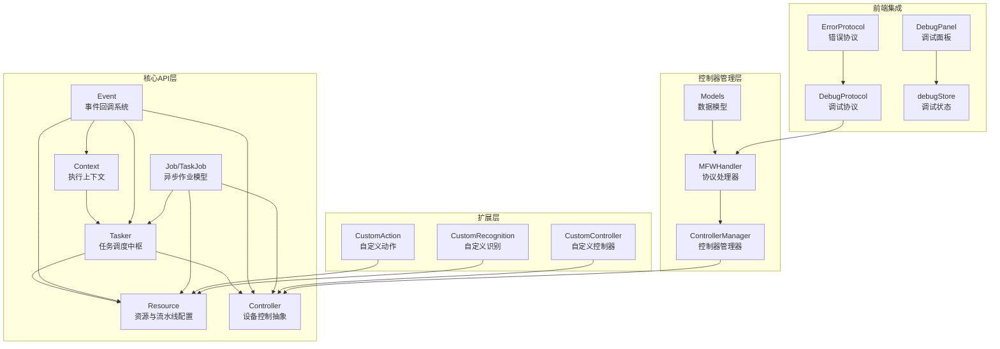
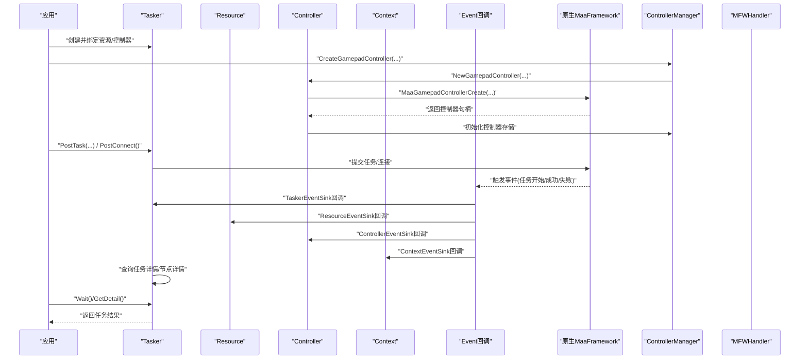
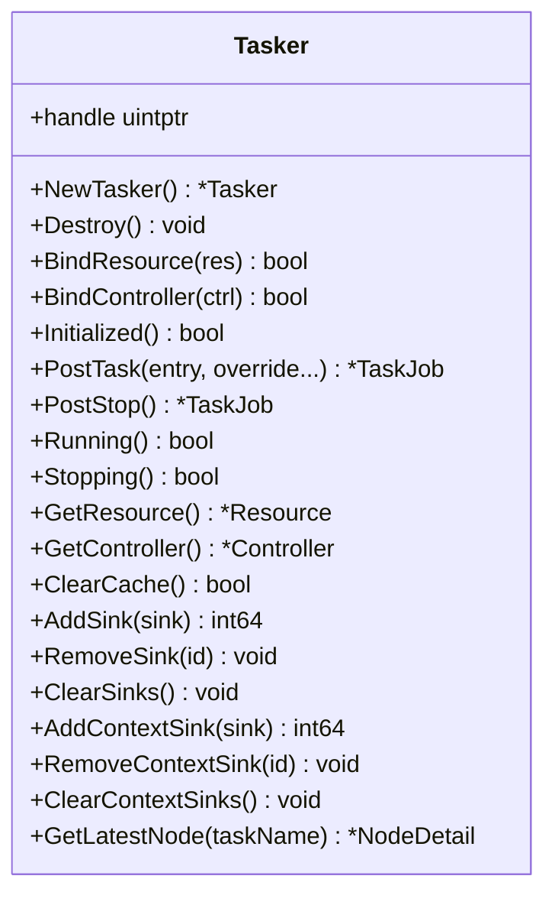
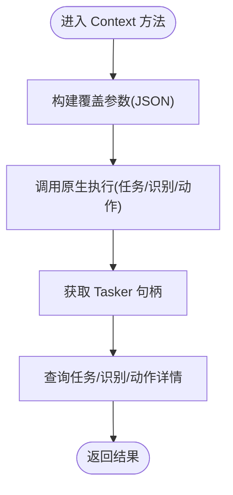
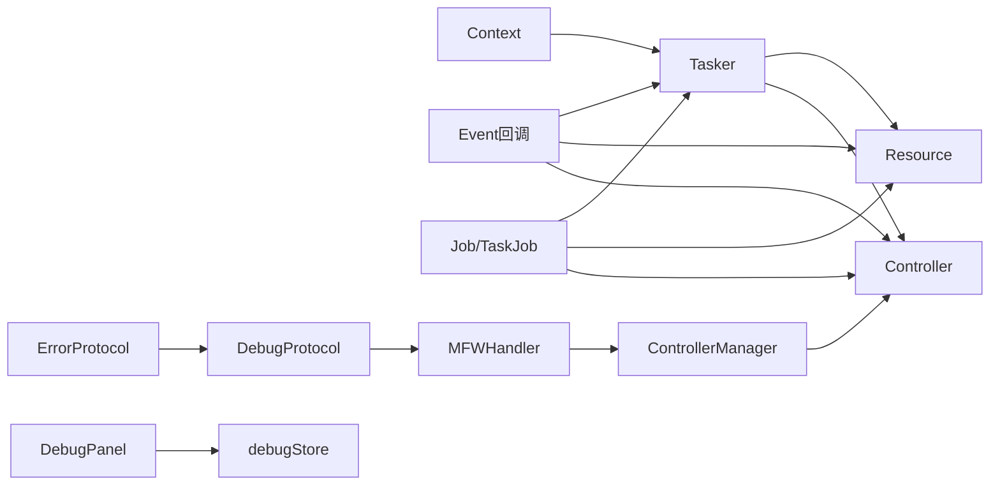

# maafw-golang API 参考

<cite>
**本文档中引用的文件**
- [controller.go](file://controller.go)
- [custom_controller.go](file://custom_controller.go)
- [controller_manager.go](file://LocalBridge/internal/mfw/controller_manager.go)
- [handler.go](file://LocalBridge/internal/protocol/mfw/handler.go)
- [mfw.go](file://LocalBridge/pkg/models/mfw.go)
- [gamepad控制器.md](file://instructions/maafw-golang-binding/核心概念/控制器 (Controller)/游戏pad控制器.md)
- [控制器.md](file://instructions/maafw-golang-binding/API参考/控制器.md)
- [API大全.md](file://instructions/maafw-golang-binding/API大全.md)
- [DebugProtocol.ts](file://src/services/protocols/DebugProtocol.ts)
- [ErrorProtocol.ts](file://src/services/protocols/ErrorProtocol.ts)
- [DebugPanel.tsx](file://src/components/panels/tools/DebugPanel.tsx)
- [debugStore.ts](file://src/stores/debugStore.ts)
</cite>

## 更新摘要
**已做更改**
- 新增游戏pad控制器（Gamepad Controller）API参考，包括CreateGamepadController方法的详细说明
- 更新控制器类型枚举，新增GamepadType枚举和相关常量定义
- 增强错误处理机制说明，涵盖ViGEm驱动安装要求和连接超时处理
- 添加与前端调试系统的集成说明，包括控制器事件处理和错误提示
- 更新控制器管理器的API文档，反映新的控制器类型支持

## 目录
1. [简介](#简介)
2. [项目结构](#项目结构)
3. [核心组件](#核心组件)
4. [架构总览](#架构总览)
5. [详细组件分析](#详细组件分析)
6. [依赖关系分析](#依赖关系分析)
7. [性能考虑](#性能考虑)
8. [故障排查指南](#故障排查指南)
9. [结论](#结论)
10. [附录](#附录)

## 简介
本文件为 maa-framework-go 的 API 参考与使用指南，面向希望在 Go 语言中使用 MaaFramework 的开发者。文档系统性梳理了框架初始化、任务管理、控制器操作、资源管理、自定义扩展、事件回调、上下文操作与状态/作业模型等核心能力，并通过示例与图示帮助读者快速上手与深入理解。

**更新** 本次更新重点扩展了控制器API，特别是新增的游戏pad控制器支持，包括完整的控制器类型枚举、错误处理机制和与前端调试系统的深度集成。

## 项目结构
仓库采用按职责分层的组织方式：
- 核心 API 层：controller.go、custom_controller.go、tasker.go、resource.go、context.go、event.go、job.go
- 控制器管理器：LocalBridge/internal/mfw/controller_manager.go
- 协议处理层：LocalBridge/internal/protocol/mfw/handler.go
- 数据模型：LocalBridge/pkg/models/mfw.go
- 文档与示例：instructions/maafw-golang-binding 目录下的各类文档
- 前端集成：src/services/protocols 下的调试协议和错误处理

**图表来源**
- [controller.go](file://controller.go#L1-L418)
- [custom_controller.go](file://custom_controller.go#L1-L392)
- [controller_manager.go](file://LocalBridge/internal/mfw/controller_manager.go#L1-L702)
- [handler.go](file://LocalBridge/internal/protocol/mfw/handler.go#L1-L694)
- [mfw.go](file://LocalBridge/pkg/models/mfw.go#L1-L192)

**章节来源**
- [controller.go](file://controller.go#L1-L418)
- [custom_controller.go](file://custom_controller.go#L1-L392)
- [controller_manager.go](file://LocalBridge/internal/mfw/controller_manager.go#L1-L702)
- [handler.go](file://LocalBridge/internal/protocol/mfw/handler.go#L1-L694)

## 核心组件
- Tasker：负责任务提交、状态查询、停止信号、事件回调注册、节点详情查询等，是任务执行的中枢。
- Resource：负责资源加载、流水线覆盖、自定义识别/动作注册、事件回调注册等，承载识别与动作的配置与能力。
- Controller：负责设备连接、截图、输入、应用启停、滚动等操作，抽象出 ADB/Win32/Gamepad/PlayCover/自定义控制器。
- Context：提供在单次任务执行中运行识别/动作的能力，支持覆盖流水线、锚点、命中计数等上下文级操作。
- Event：统一的事件回调代理与分发器，将底层事件映射到 Tasker/Resource/Controller/Context 的回调接口。
- Job/TaskJob：封装异步作业的状态查询与等待逻辑，TaskJob 还可获取任务详情。
- ControllerManager：统一管理各种控制器的创建、连接、断开和操作，提供高级API。
- MFWHandler：处理前端发送的控制器相关协议消息，协调控制器管理器执行操作。

**更新** 新增控制器类型枚举和游戏pad控制器支持，增强错误处理和前端集成能力。

**章节来源**
- [controller.go](file://controller.go#L1-L418)
- [custom_controller.go](file://custom_controller.go#L1-L392)
- [controller_manager.go](file://LocalBridge/internal/mfw/controller_manager.go#L1-L702)
- [handler.go](file://LocalBridge/internal/protocol/mfw/handler.go#L1-L694)

## 架构总览
下图展示了从应用调用到底层原生交互的关键路径，以及事件回调的分发链路。新增的游戏pad控制器通过ControllerManager统一管理，支持ViGEm驱动的虚拟手柄功能。

**图表来源**
- [controller.go](file://controller.go#L1-L418)
- [controller_manager.go](file://LocalBridge/internal/mfw/controller_manager.go#L158-L211)
- [handler.go](file://LocalBridge/internal/protocol/mfw/handler.go#L266-L303)

**章节来源**
- [controller.go](file://controller.go#L1-L418)
- [controller_manager.go](file://LocalBridge/internal/mfw/controller_manager.go#L158-L211)
- [handler.go](file://LocalBridge/internal/protocol/mfw/handler.go#L266-L303)

## 详细组件分析

### 初始化与配置
- maa.Init()：加载与 MaaFramework 相关的动态库并注册其相关函数。必须在调用任何其他 Maa 相关函数之前调用此函数。支持 InitOption 配置库目录、日志目录、保存绘图、输出级别、调试模式、插件路径等。
- maa.IsInited()：检查 Maa 框架是否已初始化。
- maa.Release()：释放 Maa 框架的动态库资源并注销其相关函数。
- maa.SetLogDir/SetSaveDraw/SetStdoutLevel/SetDebugMode：运行时设置日志目录、是否保存绘制、标准输出日志级别、调试模式。
- maa.LoadPlugin：加载插件。
- maa.ConfigInitOption：配置初始化选项（用户路径与默认配置 JSON）。

**章节来源**
- [controller.go](file://controller.go#L1-L418)
- [custom_controller.go](file://custom_controller.go#L1-L392)

### 任务管理器（Tasker）
- NewTasker()：创建一个新的任务管理器实例。
- Destroy()：释放任务管理器实例。
- BindResource(BindController)：将任务管理器绑定到已初始化的资源/控制器。
- Initialized()：检查任务管理器是否已初始化。
- PostTask(PostStop)：提交任务/停止信号，返回 TaskJob。
- Running/Stopping：检查实例是否正在运行/停止中。
- GetResource/GetController：获取资源/控制器句柄。
- ClearCache：清理运行时缓存。
- GetLatestNode：获取最新节点的详细信息。
- 事件回调：AddSink/RemoveSink/ClearSinks、AddContextSink/RemoveContextSink/ClearContextSinks。
- 任务详情：getTaskDetail/getNodeDetail/getRecognitionDetail/getActionDetail。

**图表来源**
- [controller.go](file://controller.go#L1-L418)

**章节来源**
- [controller.go](file://controller.go#L1-L418)
- [custom_controller.go](file://custom_controller.go#L1-L392)

### 控制器（Controller）
- NewAdbController/NewWin32Controller/NewCustomController/NewPlayCoverController/NewGamepadController：创建不同类型的控制器实例。
- Destroy：释放控制器实例。
- SetScreenshotTargetLongSide/SetScreenshotTargetShortSide/SetScreenshotUseRawSize：截图尺寸与原始尺寸策略。
- PostConnect/PostClick/PostSwipe/PostClickKey/PostInputText/PostStartApp/PostStopApp/PostTouchDown/PostTouchMove/PostTouchUp/PostKeyDown/PostKeyUp/PostScreencap/PostScroll：设备操作。
- Connected/CacheImage/GetUUID/GetResolution：连接状态、缓存图像、设备 UUID、设备分辨率。
- 事件回调：AddSink/RemoveSink/ClearSinks 及便捷注册方法。
- ADB/Win32/PlayCover/游戏pad 方法枚举与解析：截图/输入方法集合与字符串解析。
- 自定义控制器接口与桥接：CustomController 与回调代理。

**更新** 新增游戏pad控制器支持，包括GamepadType枚举和相关常量定义。

**图表来源**
- [controller.go](file://controller.go#L1-L418)

**章节来源**
- [controller.go](file://controller.go#L1-L418)
- [custom_controller.go](file://custom_controller.go#L1-L392)
- [gamepad控制器.md](file://instructions/maafw-golang-binding/核心概念/控制器 (Controller)/游戏pad控制器.md#L1-L474)

### 游戏pad控制器（Gamepad Controller）
- NewGamepadController(hWnd, gamepadType, screencapMethod)：创建虚拟游戏pad控制器实例
- GamepadType枚举：GamepadTypeXbox360、GamepadTypeDualShock4
- 按钮映射：ButtonA、ButtonB、ButtonX、ButtonY、ButtonLB、ButtonRB、ButtonStart、ButtonBack、ButtonGuide、ButtonDpadUp/Down/Left/Right
- 触摸输入：TouchLeftStick、TouchRightStick、TouchLeftTrigger、TouchRightTrigger
- ViGEm驱动依赖：需要安装ViGEm Bus Driver才能正常工作
- 屏幕截图功能：可选的Win32屏幕捕获方法

**更新** 新增完整的游戏pad控制器API参考，包括按钮映射、触摸输入和错误处理。

**图表来源**
- [gamepad控制器.md](file://instructions/maafw-golang-binding/核心概念/控制器 (Controller)/游戏pad控制器.md#L81-L119)

**章节来源**
- [gamepad控制器.md](file://instructions/maafw-golang-binding/核心概念/控制器 (Controller)/游戏pad控制器.md#L1-L474)
- [controller.go](file://controller.go#L121-L153)

### 控制器管理器（ControllerManager）
- CreateAdbController/CreateWin32Controller/CreatePlayCoverController/CreateGamepadController：创建不同类型的控制器实例
- ConnectController/DisconnectController：控制器连接和断开管理
- Click/Swipe/InputText/StartApp/StopApp：基础设备操作
- Screencap：截图功能，支持目标尺寸设置和缓存使用
- GetControllerStatus：获取控制器状态和UUID
- 游戏pad专用操作：ClickGamepadKey、TouchGamepadControl

**更新** 新增CreateGamepadController方法和相关的游戏pad专用操作。

**图表来源**
- [controller_manager.go](file://LocalBridge/internal/mfw/controller_manager.go#L1-L702)

**章节来源**
- [controller_manager.go](file://LocalBridge/internal/mfw/controller_manager.go#L1-L702)

### 协议处理器（MFWHandler）
- handleCreateGamepadController：处理游戏pad控制器创建请求
- handleDisconnectController：处理控制器断开连接请求
- handleScreencap：处理截图请求
- handleControllerClick/handleControllerSwipe/handleControllerInputText/handleControllerStartApp/handleControllerStopApp：处理各种控制器操作请求
- 自动连接功能：创建游戏pad控制器后自动尝试连接

**更新** 新增游戏pad控制器的协议处理支持。

**章节来源**
- [handler.go](file://LocalBridge/internal/protocol/mfw/handler.go#L266-L303)
- [handler.go](file://LocalBridge/internal/protocol/mfw/handler.go#L332-L459)

### 数据模型（Models）
- CreateGamepadControllerRequest：游戏pad控制器创建请求数据结构
- ControllerCreatedResponse：控制器创建结果响应
- ControllerClickKeyRequest：手柄按键点击请求
- ControllerTouchGamepadRequest：手柄触摸操作请求
- ControllerEventData：控制器事件数据

**更新** 新增游戏pad控制器相关的数据模型定义。

**章节来源**
- [mfw.go](file://LocalBridge/pkg/models/mfw.go#L22-L98)

### 资源管理器（Resource）
- NewResource/Destroy：创建/销毁资源。
- UseCPU/UseDirectml/UseCoreml/UseAutoExecutionProvider：推理设备与执行提供者设置。
- RegisterCustomRecognition/UnregisterCustomRecognition/ClearCustomRecognition：自定义识别注册/注销/清空。
- RegisterCustomAction/UnregisterCustomAction/ClearCustomAction：自定义动作注册/注销/清空。
- PostBundle/Clear/Loaded/GetHash：资源包添加、清空、加载状态、资源哈希。
- OverridePipeline/OverrideNext/OverrideImage：流水线/下一跳/图像覆盖。
- GetNodeJSON/GetNodeList/GetCustomRecognitionList/GetCustomActionList：节点与列表查询。
- AddSink/RemoveSink/ClearSinks：事件回调管理。

**图表来源**
- [controller.go](file://controller.go#L1-L418)

**章节来源**
- [controller.go](file://controller.go#L1-L418)
- [custom_controller.go](file://custom_controller.go#L1-L392)

### 执行上下文（Context）
- RunTask/RunRecognition/RunAction：在上下文中执行任务/识别/动作。
- OverridePipeline/OverrideNext/OverrideImage：上下文级覆盖。
- GetNodeJSON/GetNodeData：节点 JSON 与结构化数据。
- GetTaskJob/GetTasker/Clone：当前任务作业、Tasker 实例、上下文克隆。
- SetAnchor/GetAnchor/GetHitCount/ClearHitCount：锚点与命中计数管理。
- override 参数支持 JSON 字符串或可序列化对象。

**图表来源**
- [controller.go](file://controller.go#L1-L418)

**章节来源**
- [controller.go](file://controller.go#L1-L418)
- [custom_controller.go](file://custom_controller.go#L1-L392)

### 事件系统（Event）
- 事件状态枚举：Unknown/Starting/Succeeded/Failed。
- 事件详情结构体：ResourceLoadingDetail、ControllerActionDetail、TaskerTaskDetail、NodePipelineNodeDetail、NodeRecognitionNodeDetail、NodeActionNodeDetail、NodeNextListDetail、NodeRecognitionDetail、NodeActionDetail。
- 事件回调接口：TaskerEventSink/ResourceEventSink/ControllerEventSink/ContextEventSink。
- 注册与管理：registerEventCallback/unregisterEventCallback、AddSink/RemoveSink/ClearSinks、AddContextSink/RemoveContextSink/ClearContextSinks。
- 消息路由：按消息后缀解析状态，按消息前缀匹配事件类型。

**图表来源**
- [controller.go](file://controller.go#L1-L418)
- [custom_controller.go](file://custom_controller.go#L1-L392)

**章节来源**
- [controller.go](file://controller.go#L1-L418)
- [custom_controller.go](file://custom_controller.go#L1-L392)

### 自定义功能
- 自定义动作（CustomAction）：实现 Run(ctx, arg) bool，通过 Resource.RegisterCustomAction 注册，流水线中以 action=Custom、custom_action=名称的方式触发。
- 自定义识别（CustomRecognition）：实现 Run(ctx, arg) -> (result, bool)，通过 Resource.RegisterCustomRecognition 注册，可在 Run 中使用 Context 的 RunRecognition/OverridePipeline/Clone/OverrideNext 等能力。
- 自定义控制器（CustomController）：实现 Connect/RequestUUID/GetFeature/StartApp/StopApp/Screencap/Click/Swipe/TouchDown/TouchMove/TouchUp/ClickKey/InputText/KeyDown/KeyUp 等方法，通过 NewCustomController 绑定。

**章节来源**
- [controller.go](file://controller.go#L1-L418)
- [custom_controller.go](file://custom_controller.go#L1-L392)

### Agent 架构
- Agent 客户端：NewAgentClient/BindResource/Connect/Connected/Alive/SetTimeout/GetCustomActionList/GetCustomRecognitionList；与 Agent 服务器通过动态库桥接通信。
- Agent 服务器：AgentServerRegisterCustomAction/AgentServerStartUp/AgentServerJoin/AgentServerShutDown；支持事件回调注册与自定义动作回调。

**章节来源**
- [controller.go](file://controller.go#L1-L418)
- [custom_controller.go](file://custom_controller.go#L1-L392)

### 前端调试系统集成
- DebugProtocol：处理调试相关的协议消息，包括资源加载、识别开始、任务状态等事件
- ErrorProtocol：统一的错误处理协议，支持MFW系列错误码
- DebugPanel：前端调试面板组件，提供调试界面和状态显示
- debugStore：调试状态管理，维护调试会话、节点执行状态等

**更新** 新增与前端调试系统的深度集成，支持控制器事件处理和错误提示。

**章节来源**
- [DebugProtocol.ts](file://src/services/protocols/DebugProtocol.ts#L428-L476)
- [ErrorProtocol.ts](file://src/services/protocols/ErrorProtocol.ts#L39-L67)
- [DebugPanel.tsx](file://src/components/panels/tools/DebugPanel.tsx#L107-L149)
- [debugStore.ts](file://src/stores/debugStore.ts#L148-L720)

## 依赖关系分析
- 组件耦合
  - Tasker 依赖 Resource 与 Controller（绑定与查询）
  - Context 依赖 Tasker（获取任务详情、当前任务作业）
  - Event 系统为 Tasker/Resource/Controller/Context 提供统一的回调入口
  - Job/TaskJob 为 Tasker/Resource/Controller 的异步操作提供统一的状态查询与等待
  - ControllerManager 统一管理各种控制器的生命周期和操作
  - MFWHandler 处理前端协议消息，协调控制器管理器执行操作
  - 前端调试系统通过协议与后端通信，实现实时调试监控
- 外部依赖
  - 通过 internal/native 与原生 MaaFramework 交互
  - 通过 internal/store 维护句柄到回调映射与自定义识别/动作的回调 ID 映射
  - 游戏pad控制器依赖ViGEm驱动进行虚拟手柄模拟

**更新** 新增控制器管理器和前端调试系统的依赖关系。

**图表来源**
- [controller.go](file://controller.go#L1-L418)
- [controller_manager.go](file://LocalBridge/internal/mfw/controller_manager.go#L1-L702)
- [handler.go](file://LocalBridge/internal/protocol/mfw/handler.go#L1-L694)
- [DebugProtocol.ts](file://src/services/protocols/DebugProtocol.ts#L428-L476)

**章节来源**
- [controller.go](file://controller.go#L1-L418)
- [controller_manager.go](file://LocalBridge/internal/mfw/controller_manager.go#L1-L702)
- [handler.go](file://LocalBridge/internal/protocol/mfw/handler.go#L1-L694)

## 性能考虑
- 异步作业模型：使用 Job/TaskJob 避免阻塞主线程，提高吞吐量。
- 缓存与复用：Tasker/Resource/Controller 在销毁时会注销所有回调，避免内存泄漏；Context 提供 Clone，可在需要时复制上下文以减少重复配置。
- 图像与缓冲：识别与动作过程中大量使用图像缓冲，注意及时释放缓冲区，避免内存占用过高。
- 事件回调：回调注册/注销需成对出现，避免回调表膨胀导致性能下降。
- 推理设备选择：UseAutoExecutionProvider 可自动选择最优执行提供者，但具体性能取决于运行环境；GPU 加速通常优于 CPU，但需考虑显存占用与驱动稳定性。
- 游戏pad控制器：ViGEm驱动的使用可能带来额外的系统开销，建议在不需要时及时断开连接。
- 前端集成：调试协议的消息处理需要考虑网络延迟和消息队列长度，避免阻塞UI线程。

**更新** 新增游戏pad控制器和前端集成的性能考虑。

**章节来源**
- [controller.go](file://controller.go#L1-L418)
- [controller_manager.go](file://LocalBridge/internal/mfw/controller_manager.go#L1-L702)
- [gamepad控制器.md](file://instructions/maafw-golang-binding/核心概念/控制器 (Controller)/游戏pad控制器.md#L413-L431)

## 故障排查指南
- 初始化失败
  - 确认已正确初始化并配置运行库路径
  - 检查 Tasker/Resource/Controller 的初始化状态与错误返回值
- 事件未回调
  - 确认已正确注册 AddSink/RemoveSink，且回调 ID 未被重复使用
  - 检查事件消息前缀与回调类型匹配
- 任务无结果
  - 使用 Wait() 等待完成后再调用 GetDetail()
  - 检查 OverridePipeline/OverrideNext/OverrideImage 是否正确覆盖
- 设备连接问题
  - 确认 PostConnect 成功，Connected() 返回真
  - 检查截图尺寸设置与缓存图像是否可用
- 自定义动作/识别问题
  - 确认名称唯一且已注册
  - 检查 override 参数是否可序列化
  - 检查 Context 句柄有效性与任务详情获取
- 游戏pad控制器问题
  - ViGEm驱动未安装：创建控制器时返回失败，需要下载并安装最新版本的ViGEm驱动
  - 窗口句柄无效：确保传入有效的窗口句柄，支持十六进制字符串格式
  - 屏幕截图功能异常：检查Win32屏幕捕获方法的兼容性
- 前端调试问题
  - 控制器连接超时：检查网络连接和防火墙设置
  - 调试事件未显示：确认调试协议已正确配置和连接
  - 错误提示不准确：检查后端日志和错误码映射

**更新** 新增游戏pad控制器和前端调试系统的故障排查指南。

**章节来源**
- [controller.go](file://controller.go#L1-L418)
- [controller_manager.go](file://LocalBridge/internal/mfw/controller_manager.go#L158-L211)
- [gamepad控制器.md](file://instructions/maafw-golang-binding/核心概念/控制器 (Controller)/游戏pad控制器.md#L432-L462)
- [DebugProtocol.ts](file://src/services/protocols/DebugProtocol.ts#L428-L476)
- [ErrorProtocol.ts](file://src/services/protocols/ErrorProtocol.ts#L39-L67)

## 结论
maa-framework-go 通过 Tasker、Resource、Controller、Context、Event 与 Job/TaskJob 的协同，构建了一个清晰、可扩展且高性能的自动化框架。Tasker 作为中枢协调任务执行，Resource 管理识别资源与流水线，Controller 抽象设备控制，Context 提供上下文级的执行能力，Event 以观察者模式实现异步通知，Job/TaskJob 则提供了统一的异步作业模型。

**更新** 本次更新显著增强了控制器API的完整性和实用性，特别是新增的游戏pad控制器支持，为Windows平台的游戏自动化提供了强大的虚拟手柄控制能力。同时，完善的错误处理机制和与前端调试系统的深度集成，使得整个框架更加健壮和易于使用。

工厂模式与门面模式的应用使得 API 更加简洁易用。遵循本文的最佳实践与排错建议，可有效提升开发效率与稳定性。

## 附录
- 快速开始示例展示了从初始化、设备连接、资源加载到任务执行的完整流程
- 自定义动作与识别示例展示了如何扩展识别与动作能力
- Agent 客户端/服务器示例展示了分布式自动化架构与跨语言扩展
- 游戏pad控制器示例展示了虚拟手柄的创建和使用方法
- 前端调试系统示例展示了控制器事件处理和错误提示的实现

**章节来源**
- [controller.go](file://controller.go#L1-L418)
- [controller_manager.go](file://LocalBridge/internal/mfw/controller_manager.go#L1-L702)
- [gamepad控制器.md](file://instructions/maafw-golang-binding/核心概念/控制器 (Controller)/游戏pad控制器.md#L1-L474)
- [DebugProtocol.ts](file://src/services/protocols/DebugProtocol.ts#L428-L476)
- [ErrorProtocol.ts](file://src/services/protocols/ErrorProtocol.ts#L39-L67)