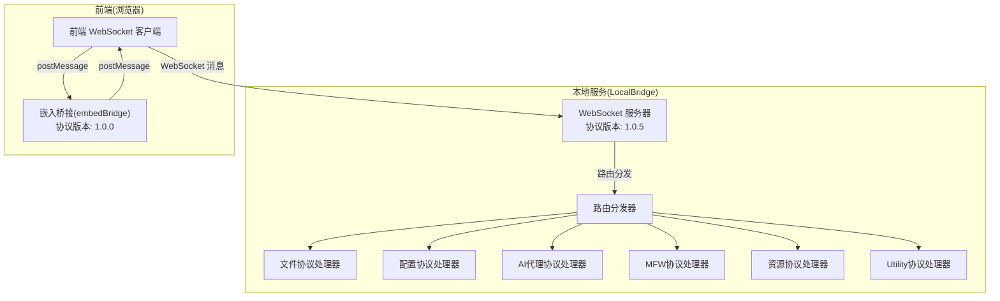
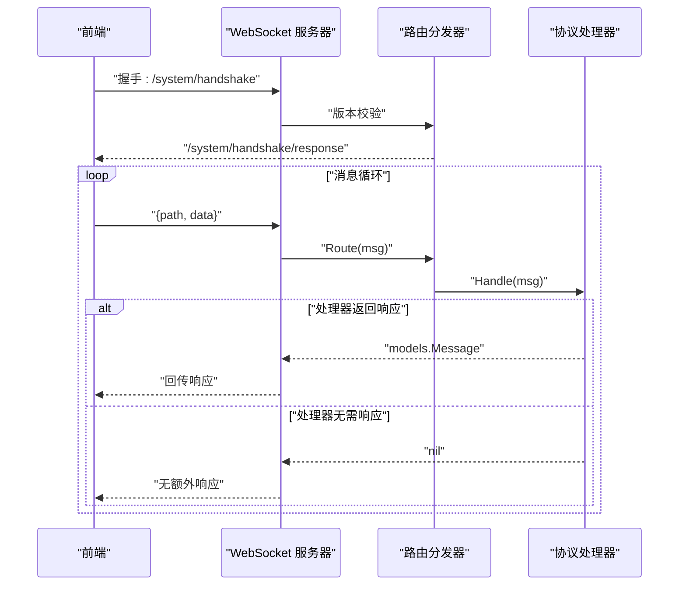
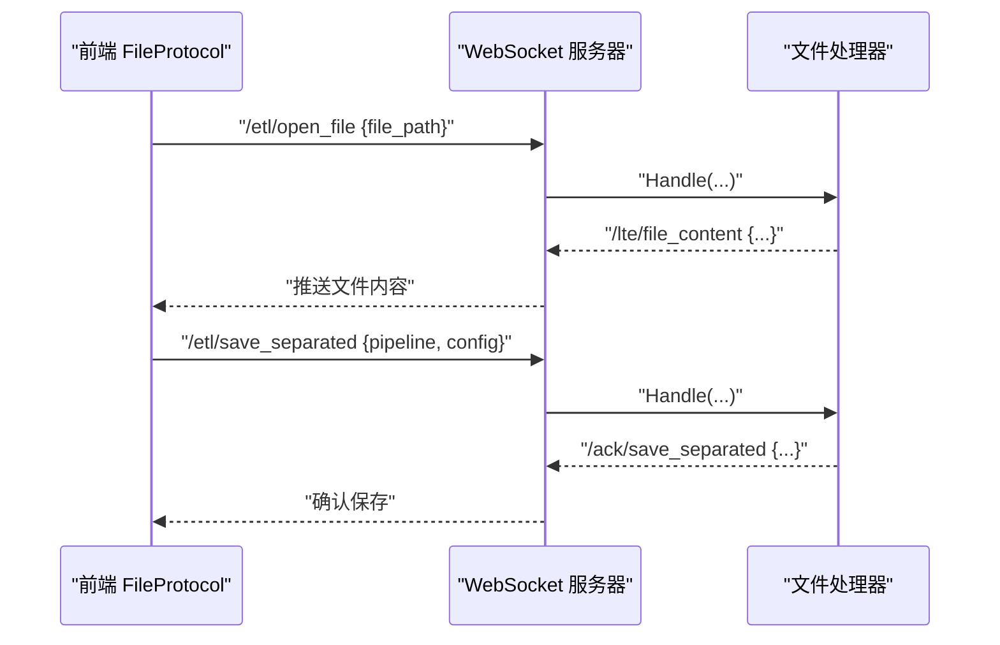
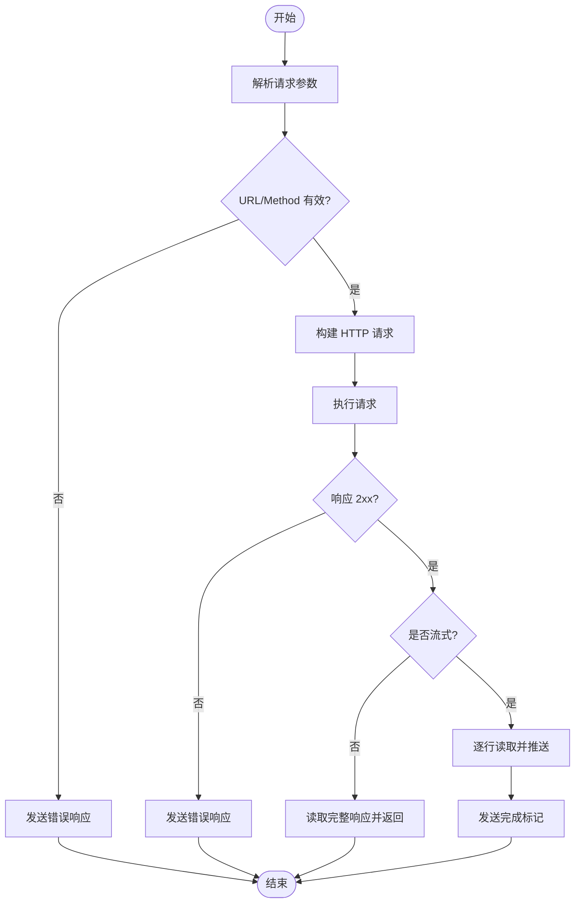
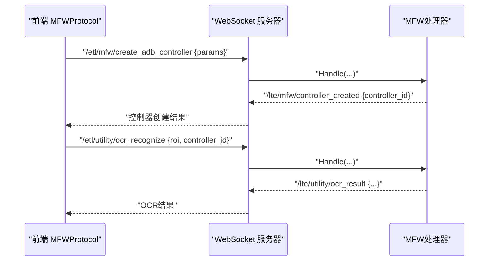
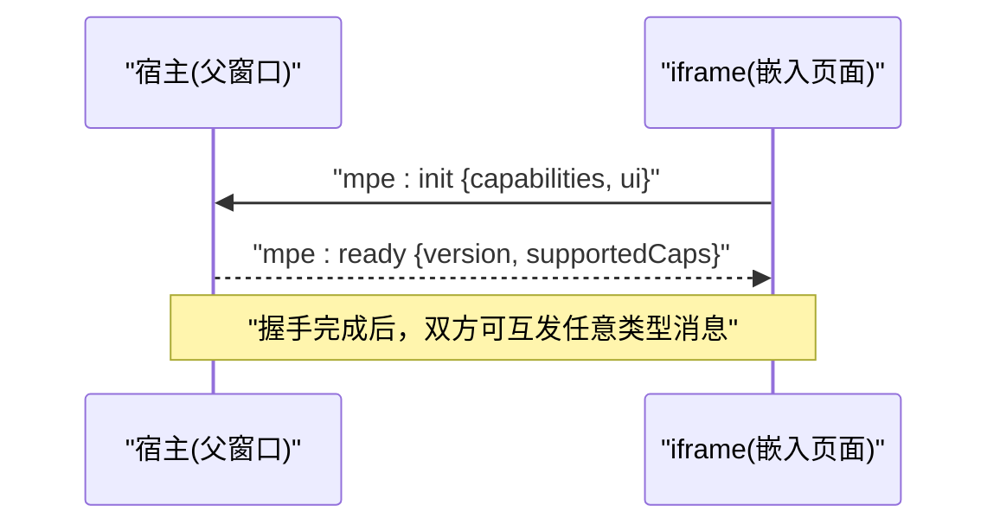
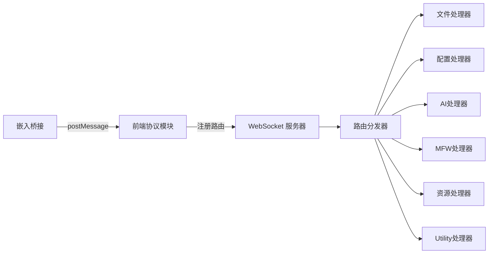

# API参考

<cite>
**本文引用的文件**
- [websocket.go](file://LocalBridge/internal/server/websocket.go)
- [router.go](file://LocalBridge/internal/router/router.go)
- [message.go](file://LocalBridge/pkg/models/message.go)
- [errors.go](file://LocalBridge/internal/errors/errors.go)
- [file_handler.go](file://LocalBridge/internal/protocol/file/file_handler.go)
- [handler.go](file://LocalBridge/internal/protocol/config/handler.go)
- [handler.go](file://LocalBridge/internal/protocol/ai/handler.go)
- [handler.go](file://LocalBridge/internal/protocol/mfw/handler.go)
- [handler.go](file://LocalBridge/internal/protocol/resource/handler.go)
- [handler.go](file://LocalBridge/internal/protocol/utility/handler.go)
- [BaseProtocol.ts](file://src/services/protocols/BaseProtocol.ts)
- [FileProtocol.ts](file://src/services/protocols/FileProtocol.ts)
- [MFWProtocol.ts](file://src/services/protocols/MFWProtocol.ts)
- [ResourceProtocol.ts](file://src/services/protocols/ResourceProtocol.ts)
- [ErrorProtocol.ts](file://src/services/protocols/ErrorProtocol.ts)
- [embedBridge.ts](file://src/utils/embedBridge.ts)
- [index.ts](file://src/services/protocols/index.ts)
</cite>

## 目录
1. [简介](#简介)
2. [项目结构](#项目结构)
3. [核心组件](#核心组件)
4. [架构总览](#架构总览)
5. [详细组件分析](#详细组件分析)
6. [依赖分析](#依赖分析)
7. [性能考虑](#性能考虑)
8. [故障排除指南](#故障排除指南)
9. [结论](#结论)
10. [附录](#附录)

## 简介
本文件为 MaaPipelineEditor 本地服务与前端之间的 API 参考文档，覆盖以下主题：
- WebSocket 协议规范与消息格式
- 协议路由机制与事件类型定义
- 嵌入式 API 的消息桥接协议与接口规范
- 错误码与异常处理标准
- 扩展点与插件接口实现规范
- API 使用示例与最佳实践
- API 版本管理与向后兼容性指导

## 项目结构
本地服务采用 Go 实现，前端采用 TypeScript/React。二者通过 WebSocket 进行双向通信；同时提供 iframe 嵌入桥接，使用 postMessage 实现宿主与嵌入页面的双向通信。

图表来源
- [websocket.go:15-22](file://LocalBridge/internal/server/websocket.go#L15-L22)
- [router.go:13-17](file://LocalBridge/internal/router/router.go#L13-L17)
- [file_handler.go:37-46](file://LocalBridge/internal/protocol/file/file_handler.go#L37-L46)
- [handler.go:20-23](file://LocalBridge/internal/protocol/config/handler.go#L20-L23)
- [handler.go:31-34](file://LocalBridge/internal/protocol/ai/handler.go#L31-L34)
- [handler.go:26-29](file://LocalBridge/internal/protocol/mfw/handler.go#L26-L29)
- [handler.go:45-53](file://LocalBridge/internal/protocol/resource/handler.go#L45-L53)
- [handler.go:39-42](file://LocalBridge/internal/protocol/utility/handler.go#L39-L42)
- [embedBridge.ts:7-16](file://src/utils/embedBridge.ts#L7-L16)

章节来源
- [websocket.go:15-22](file://LocalBridge/internal/server/websocket.go#L15-L22)
- [router.go:13-17](file://LocalBridge/internal/router/router.go#L13-L17)

## 核心组件
- WebSocket 服务器与握手
  - 协议版本：1.0.5
  - 握手路由：/system/handshake、/system/handshake/response
  - 版本不匹配时触发回调，阻止连接并提示更新
- 路由分发器
  - Handler 接口：GetRoutePrefix()、Handle()
  - 前缀匹配与精确匹配结合
  - 未知路由统一返回 /error
- 消息模型
  - 通用消息结构：path、data
  - 错误消息结构：code、message、detail
- 协议处理器
  - 文件(File)、配置(Config)、AI(AI)、MFW(MaaFramework)、资源(Resource)、Utility(Utility)
- 前端协议封装
  - BaseProtocol 抽象类
  - FileProtocol、MFWProtocol、ResourceProtocol、ErrorProtocol
- 嵌入式桥接
  - embedBridge.ts 提供 postMessage 双向通信与握手流程

章节来源
- [websocket.go:15-22](file://LocalBridge/internal/server/websocket.go#L15-L22)
- [router.go:19-26](file://LocalBridge/internal/router/router.go#L19-L26)
- [message.go:3-14](file://LocalBridge/pkg/models/message.go#L3-L14)
- [BaseProtocol.ts:7-39](file://src/services/protocols/BaseProtocol.ts#L7-L39)
- [embedBridge.ts:7-16](file://src/utils/embedBridge.ts#L7-L16)

## 架构总览
WebSocket 通信链路与消息流转如下：

图表来源
- [websocket.go:114-161](file://LocalBridge/internal/server/websocket.go#L114-L161)
- [router.go:56-83](file://LocalBridge/internal/router/router.go#L56-L83)

章节来源
- [websocket.go:114-161](file://LocalBridge/internal/server/websocket.go#L114-L161)
- [router.go:56-83](file://LocalBridge/internal/router/router.go#L56-L83)

## 详细组件分析

### WebSocket 协议规范与消息格式
- 协议版本
  - 本地服务协议版本：1.0.5
  - 嵌入桥接协议版本：1.0.0
- 消息结构
  - 通用消息：path(string)、data(interface{})
  - 错误消息：/error，包含 code、message、detail
- 握手流程
  - 前端发送 /system/handshake，携带 protocol_version
  - 服务器校验版本，返回 /system/handshake/response，包含 success、server_version、required_version、message
  - 版本不匹配时，服务器发送错误并终止握手

章节来源
- [websocket.go:15-22](file://LocalBridge/internal/server/websocket.go#L15-L22)
- [router.go:114-161](file://LocalBridge/internal/router/router.go#L114-L161)
- [message.go:9-14](file://LocalBridge/pkg/models/message.go#L9-L14)

### 路由机制与事件类型
- 路由分发
  - 精确匹配优先，否则前缀匹配
  - 未匹配到处理器时，统一返回 /error
- 事件推送
  - 服务器通过广播向所有连接推送事件
  - 前端协议模块注册对应接收路由，处理推送数据

章节来源
- [router.go:85-100](file://LocalBridge/internal/router/router.go#L85-L100)
- [websocket.go:163-171](file://LocalBridge/internal/server/websocket.go#L163-L171)

### 文件协议(FileProtocol)
- 路由前缀
  - /etl/open_file、/etl/save_file、/etl/save_separated、/etl/create_file、/etl/refresh_file_list
- 推送事件
  - /lte/file_list、/lte/file_content、/lte/file_changed
- 确认路由
  - /ack/save_file、/ack/save_separated、/ack/create_file
- 处理逻辑要点
  - 打开文件：读取文件与关联配置，更新编辑器状态
  - 保存文件：支持合并/分离两种模式，带超时确认机制
  - 文件变更：监听外部修改，提供自动重载或弹窗选择
  - 创建文件：生成新文件并刷新文件列表

图表来源
- [file_handler.go:48-64](file://LocalBridge/internal/protocol/file/file_handler.go#L48-L64)
- [file_handler.go:139-176](file://LocalBridge/internal/protocol/file/file_handler.go#L139-L176)
- [FileProtocol.ts:337-391](file://src/services/protocols/FileProtocol.ts#L337-L391)

章节来源
- [file_handler.go:37-64](file://LocalBridge/internal/protocol/file/file_handler.go#L37-L64)
- [FileProtocol.ts:337-391](file://src/services/protocols/FileProtocol.ts#L337-L391)

### 配置协议(ConfigProtocol)
- 路由前缀
  - /etl/config/get、/etl/config/set、/etl/config/reload
- 处理逻辑要点
  - 获取配置：返回当前配置与配置文件路径
  - 设置配置：支持 server、file、log、maafw 字段更新，保存后返回最新配置
  - 重载配置：发布事件，通知各模块重载配置

章节来源
- [handler.go:20-47](file://LocalBridge/internal/protocol/config/handler.go#L20-L47)
- [handler.go:49-204](file://LocalBridge/internal/protocol/config/handler.go#L49-L204)

### AI代理协议(AIProtocol)
- 路由前缀
  - /etl/ai/proxy、/etl/ai/proxy_stream、/etl/ai/proxy_cancel
- 处理逻辑要点
  - 非流式代理：发起 HTTP 请求，返回响应头、状态码、响应体
  - 流式代理：基于 SSE，逐行推送 chunk，支持取消
  - 取消：根据 request_id 关闭活跃请求

图表来源
- [handler.go:55-124](file://LocalBridge/internal/protocol/ai/handler.go#L55-L124)
- [handler.go:126-232](file://LocalBridge/internal/protocol/ai/handler.go#L126-L232)

章节来源
- [handler.go:31-53](file://LocalBridge/internal/protocol/ai/handler.go#L31-L53)

### MFW协议(MaaFramework)
- 路由前缀
  - /etl/mfw/*、/etl/utility/*
- 设备与控制器
  - 刷新设备列表：/etl/mfw/refresh_adb_devices、/etl/mfw/refresh_win32_windows、/etl/mfw/refresh_wlroots_sockets
  - 创建控制器：/etl/mfw/create_*，自动连接并推送 /lte/mfw/controller_created
  - 断开控制器：/etl/mfw/disconnect_controller
- 控制器操作
  - 点击、滑动、输入文本、启动/停止应用、按键、手柄触摸等
- Utility
  - OCR识别：/etl/utility/ocr_recognize，返回文本、框、图像
  - 图片路径解析：/etl/utility/resolve_image_path
  - 打开日志：/etl/utility/open_log

图表来源
- [handler.go:46-128](file://LocalBridge/internal/protocol/mfw/handler.go#L46-L128)
- [handler.go:49-66](file://LocalBridge/internal/protocol/utility/handler.go#L49-L66)
- [MFWProtocol.ts:328-800](file://src/services/protocols/MFWProtocol.ts#L328-L800)

章节来源
- [handler.go:26-128](file://LocalBridge/internal/protocol/mfw/handler.go#L26-L128)
- [handler.go:44-123](file://LocalBridge/internal/protocol/utility/handler.go#L44-L123)
- [MFWProtocol.ts:328-800](file://src/services/protocols/MFWProtocol.ts#L328-L800)

### 资源协议(ResourceProtocol)
- 路由前缀
  - /etl/get_image、/etl/get_images、/etl/get_image_list、/etl/refresh_resources
- 处理逻辑要点
  - 获取单张/批量图片：返回 base64、MIME、宽高、所属资源包
  - 获取图片列表：按 pipeline 路径筛选，支持过滤标记
  - 资源包列表：/lte/resource_bundles 推送

章节来源
- [handler.go:45-69](file://LocalBridge/internal/protocol/resource/handler.go#L45-L69)
- [ResourceProtocol.ts:149-240](file://src/services/protocols/ResourceProtocol.ts#L149-L240)

### 嵌入式API与消息桥接协议
- 协议标识与版本
  - 协议：mpe-embed
  - 版本：1.0.0
- 消息结构
  - protocol、version、type、requestId(可选)、payload
- 能力声明与UI配置
  - capabilities：只读、复制、撤销重做、自动布局、AI、搜索、自定义模板
  - ui：隐藏头部/工具栏、隐藏面板集合
- 握手与超时
  - 初始化：initEmbedBridge 注册 message 监听，设置 5s 超时
  - 完成握手：completeHandshake 发送 mpe:ready，包含 version 与 supportedCaps
  - 握手前仅处理 mpe:init，其他消息忽略

图表来源
- [embedBridge.ts:179-244](file://src/utils/embedBridge.ts#L179-L244)
- [embedBridge.ts:249-274](file://src/utils/embedBridge.ts#L249-L274)

章节来源
- [embedBridge.ts:7-16](file://src/utils/embedBridge.ts#L7-L16)
- [embedBridge.ts:179-244](file://src/utils/embedBridge.ts#L179-L244)

### 错误码与异常处理
- 错误消息格式
  - /error，包含 code、message、detail
- 常见错误码
  - 文件相关：FILE_NOT_FOUND、FILE_READ_ERROR、FILE_WRITE_ERROR、FILE_NAME_CONFLICT、INVALID_JSON、PERMISSION_DENIED
  - 请求相关：INVALID_REQUEST
  - 连接相关：CONNECTION_FAILED
  - 内部错误：INTERNAL_ERROR
- 前端错误协议(ErrorProtocol)
  - 统一处理 /error，按 code 映射用户提示
  - OCR 相关错误弹出 Modal，展示原因与排查建议
  - 控制器错误时清理连接状态

章节来源
- [errors.go:9-20](file://LocalBridge/internal/errors/errors.go#L9-L20)
- [errors.go:52-73](file://LocalBridge/internal/errors/errors.go#L52-L73)
- [ErrorProtocol.ts:27-79](file://src/services/protocols/ErrorProtocol.ts#L27-L79)

### 扩展点与插件接口实现规范
- 协议扩展
  - 实现 Handler 接口：GetRoutePrefix() 返回路由前缀数组，Handle() 处理消息
  - 在路由分发器中注册处理器
- 前端协议扩展
  - 继承 BaseProtocol，实现 getName()/getVersion()/register()/handleMessage()
  - 在 LocalWebSocketServer 中注册路由，处理推送事件
- 嵌入式扩展
  - 通过 embedBridge.ts 的 onParentMessage 注册消息处理器
  - 通过 sendToParent 发送消息至宿主

章节来源
- [router.go:19-26](file://LocalBridge/internal/router/router.go#L19-L26)
- [BaseProtocol.ts:7-39](file://src/services/protocols/BaseProtocol.ts#L7-L39)
- [embedBridge.ts:134-155](file://src/utils/embedBridge.ts#L134-L155)

### API使用示例与最佳实践
- 握手
  - 前端发送 /system/handshake，携带 protocol_version=1.0.5
  - 服务器返回 /system/handshake/response，检查 success
- 文件操作
  - 打开文件：/etl/open_file，接收 /lte/file_content
  - 保存文件：/etl/save_separated，等待 /ack/save_separated
  - 文件变更：监听 /lte/file_changed，按需自动重载
- MFW 控制器
  - 创建控制器：/etl/mfw/create_*，监听 /lte/mfw/controller_created
  - OCR：/etl/utility/ocr_recognize，监听 /lte/utility/ocr_result
- 嵌入式
  - 初始化：initEmbedBridge，等待 mpe:ready
  - 交互：sendToParent(type, payload, requestId?)

章节来源
- [router.go:114-161](file://LocalBridge/internal/router/router.go#L114-L161)
- [FileProtocol.ts:337-391](file://src/services/protocols/FileProtocol.ts#L337-L391)
- [MFWProtocol.ts:328-800](file://src/services/protocols/MFWProtocol.ts#L328-L800)
- [embedBridge.ts:179-244](file://src/utils/embedBridge.ts#L179-L244)

### API版本管理与向后兼容性
- 协议版本
  - 本地服务：1.0.5
  - 嵌入桥接：1.0.0
- 版本不匹配策略
  - 服务器在握手阶段校验前端协议版本
  - 不匹配时返回错误并终止握手，提示按后端提示更新
- 兼容性建议
  - 前端应固定使用与后端一致的协议版本
  - 新增路由遵循前缀约定，避免破坏既有路由
  - 处理器 Handle() 返回 nil 表示无需响应，减少冗余消息

章节来源
- [websocket.go:15-22](file://LocalBridge/internal/server/websocket.go#L15-L22)
- [router.go:127-138](file://LocalBridge/internal/router/router.go#L127-L138)

## 依赖分析
- 组件耦合
  - WebSocket 服务器与路由分发器低耦合，通过接口解耦
  - 协议处理器独立实现，便于扩展
  - 前端协议模块通过抽象基类统一接入
- 外部依赖
  - Gorilla WebSocket 用于 WebSocket 通信
  - MaaFramework Go 绑定用于设备控制与 OCR

图表来源
- [websocket.go:35-46](file://LocalBridge/internal/server/websocket.go#L35-L46)
- [router.go:28-49](file://LocalBridge/internal/router/router.go#L28-L49)
- [index.ts:1-6](file://src/services/protocols/index.ts#L1-L6)

章节来源
- [websocket.go:35-46](file://LocalBridge/internal/server/websocket.go#L35-L46)
- [router.go:28-49](file://LocalBridge/internal/router/router.go#L28-L49)
- [index.ts:1-6](file://src/services/protocols/index.ts#L1-L6)

## 性能考虑
- 流式代理
  - 使用 bufio.Scanner 增大缓冲区，提升长行读取性能
  - 逐行推送，降低内存峰值
- 图片传输
  - 采用 base64，前端缓存图片，避免重复请求
  - 批量请求时过滤已缓存与进行中请求
- 路由匹配
  - 精确匹配优先，减少前缀匹配开销
- 广播
  - 广播时并发发送，注意连接数增长带来的压力

## 故障排除指南
- 握手失败
  - 检查前端 protocol_version 是否为 1.0.5
  - 查看 /system/handshake/response 的 message 字段
- 文件操作失败
  - 检查 /error 的 code，常见为 FILE_NOT_FOUND、FILE_READ_ERROR、FILE_WRITE_ERROR
  - 确认路径与权限
- MFW 控制器问题
  - 查看 /error 的 MFW_* 错误码，必要时清理连接状态
  - OCR 失败查看详细建议，核对资源目录结构与文件完整性
- 嵌入式无响应
  - 确认已调用 initEmbedBridge，并等待 mpe:ready
  - 检查消息 origin 校验与协议标识

章节来源
- [router.go:127-138](file://LocalBridge/internal/router/router.go#L127-L138)
- [errors.go:9-20](file://LocalBridge/internal/errors/errors.go#L9-L20)
- [ErrorProtocol.ts:27-79](file://src/services/protocols/ErrorProtocol.ts#L27-L79)
- [embedBridge.ts:189-228](file://src/utils/embedBridge.ts#L189-L228)

## 结论
本文档提供了本地服务与前端之间的完整 API 参考，涵盖协议规范、路由机制、消息格式、错误处理、嵌入式桥接与版本管理。建议在扩展新功能时遵循现有路由前缀约定与消息结构，确保前后端版本一致与良好的兼容性。

## 附录
- 常用路由速查
  - 握手：/system/handshake、/system/handshake/response
  - 文件：/etl/open_file、/etl/save_file、/etl/save_separated、/etl/create_file、/etl/refresh_file_list
  - 配置：/etl/config/get、/etl/config/set、/etl/config/reload
  - AI：/etl/ai/proxy、/etl/ai/proxy_stream、/etl/ai/proxy_cancel
  - MFW：/etl/mfw/*、/etl/utility/*
  - 资源：/etl/get_image、/etl/get_images、/etl/get_image_list、/etl/refresh_resources
- 嵌入式消息类型
  - mpe:init、mpe:ready