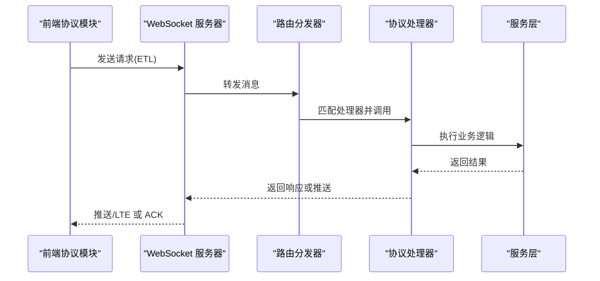
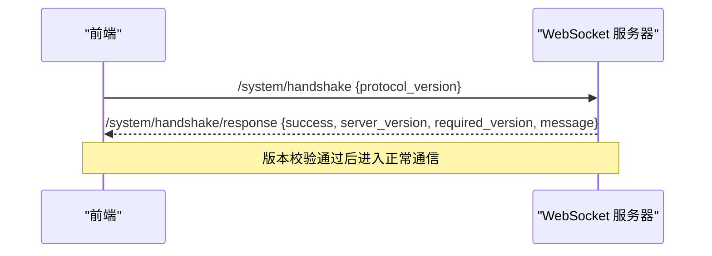
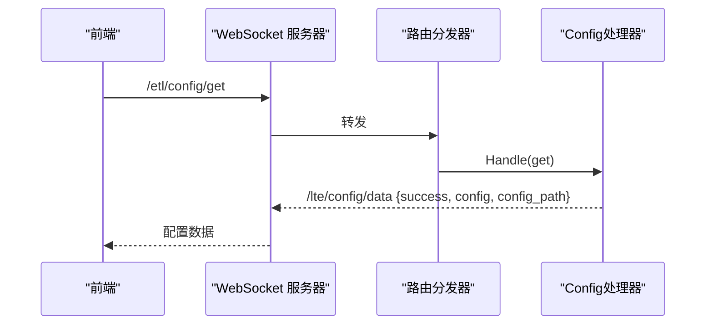
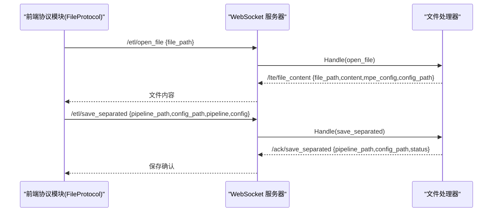
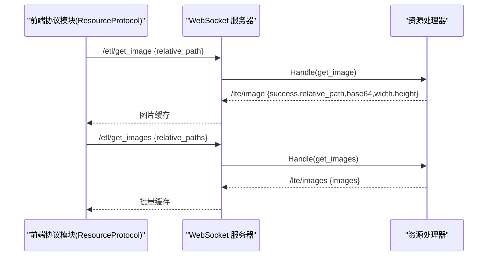
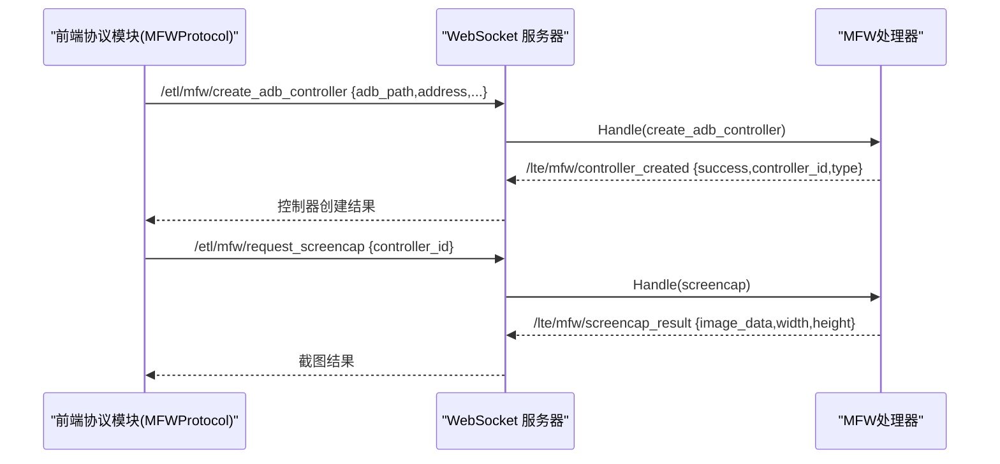
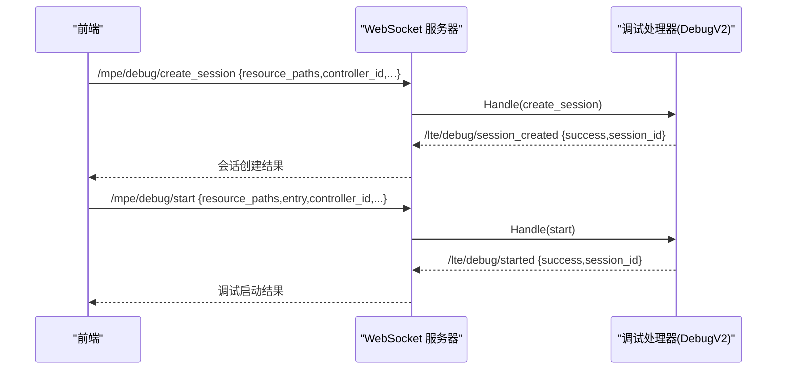
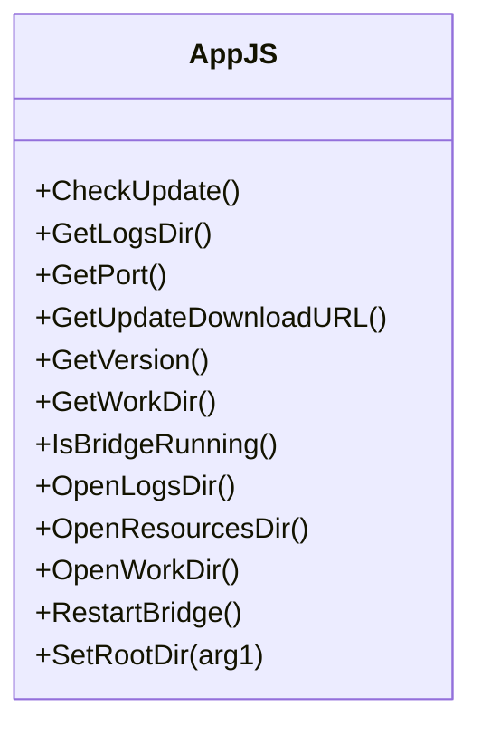
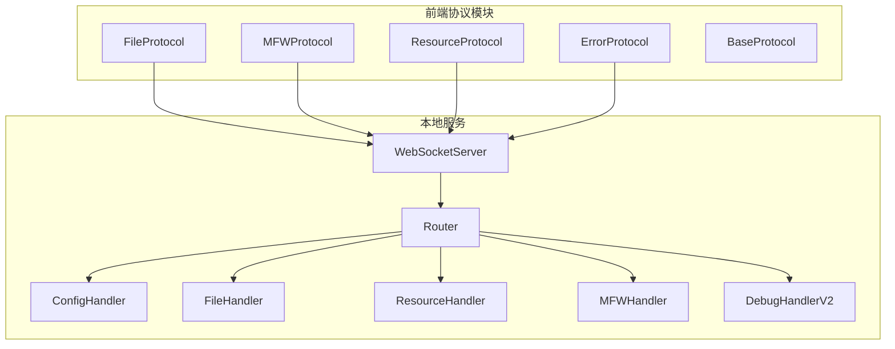

# API参考

<cite>
**本文档引用的文件**
- [websocket.go](file://LocalBridge/internal/server/websocket.go)
- [router.go](file://LocalBridge/internal/router/router.go)
- [message.go](file://LocalBridge/pkg/models/message.go)
- [errors.go](file://LocalBridge/internal/errors/errors.go)
- [handler.go](file://LocalBridge/internal/protocol/config/handler.go)
- [handler.go](file://LocalBridge/internal/protocol/file/file_handler.go)
- [handler.go](file://LocalBridge/internal/protocol/resource/handler.go)
- [handler.go](file://LocalBridge/internal/protocol/mfw/handler.go)
- [handler_v2.go](file://LocalBridge/internal/protocol/debug/handler_v2.go)
- [types.go](file://LocalBridge/internal/mfw/types.go)
- [FileProtocol.ts](file://src/services/protocols/FileProtocol.ts)
- [MFWProtocol.ts](file://src/services/protocols/MFWProtocol.ts)
- [ResourceProtocol.ts](file://src/services/protocols/ResourceProtocol.ts)
- [ErrorProtocol.ts](file://src/services/protocols/ErrorProtocol.ts)
- [BaseProtocol.ts](file://src/services/protocols/BaseProtocol.ts)
- [App.js](file://Extremer/frontend/wailsjs/go/main/App.js)
</cite>

## 目录
1. [简介](#简介)
2. [项目结构](#项目结构)
3. [核心组件](#核心组件)
4. [架构总览](#架构总览)
5. [详细组件分析](#详细组件分析)
6. [依赖关系分析](#依赖关系分析)
7. [性能考虑](#性能考虑)
8. [故障排除指南](#故障排除指南)
9. [结论](#结论)
10. [附录](#附录)

## 简介
本文件为 MaaPipelineEditor（MPE）的 LocalBridge 本地服务与前端之间的 API 参考文档，涵盖 WebSocket 通信协议、配置 API、文件 API、资源 API、MFW 集成 API 以及前端 JavaScript API。文档面向开发者与高级用户，提供消息类型、请求/响应结构、错误码、最佳实践与性能优化建议。

## 项目结构
LocalBridge 作为本地服务，负责：
- WebSocket 通信与路由分发
- 配置管理与热重载
- 文件系统读写与变更通知
- 资源包扫描与图片获取
- MaaFramework（MFW）设备与任务集成
- 调试会话管理

前端通过 Wails 与本地服务交互，使用协议模块封装各类 API。

```mermaid
graph TB
subgraph "前端"
FE["前端应用<br/>Wails + React"]
Protocols["协议模块<br/>File/MFW/Resource/Error"]
WailsJS["Wails JS 绑定<br/>App.js"]
end
subgraph "本地服务(LocalBridge)"
WS["WebSocket 服务器"]
Router["路由分发器"]
Handlers["协议处理器<br/>Config/File/Resource/MFW/Debug"]
Services["服务层<br/>文件/资源/MFW"]
end
FE --> WailsJS
FE --> Protocols
Protocols --> WS
WS --> Router
Router --> Handlers
Handlers --> Services
```

**图表来源**
- [websocket.go:1-179](file://LocalBridge/internal/server/websocket.go#L1-L179)
- [router.go:1-151](file://LocalBridge/internal/router/router.go#L1-L151)
- [FileProtocol.ts:1-607](file://src/services/protocols/FileProtocol.ts#L1-L607)
- [MFWProtocol.ts:1-774](file://src/services/protocols/MFWProtocol.ts#L1-L774)
- [ResourceProtocol.ts:1-271](file://src/services/protocols/ResourceProtocol.ts#L1-L271)

**章节来源**
- [websocket.go:1-179](file://LocalBridge/internal/server/websocket.go#L1-L179)
- [router.go:1-151](file://LocalBridge/internal/router/router.go#L1-L151)

## 核心组件
- WebSocket 服务器：负责连接管理、广播、握手与消息转发。
- 路由分发器：根据消息路径匹配处理器。
- 协议处理器：按模块划分（配置、文件、资源、MFW、调试）。
- 前端协议模块：封装 WebSocket 调用与事件订阅。
- 错误模型：统一错误码与错误数据结构。

**章节来源**
- [websocket.go:1-179](file://LocalBridge/internal/server/websocket.go#L1-L179)
- [router.go:1-151](file://LocalBridge/internal/router/router.go#L1-L151)
- [message.go:1-126](file://LocalBridge/pkg/models/message.go#L1-L126)
- [errors.go:1-141](file://LocalBridge/internal/errors/errors.go#L1-L141)

## 架构总览
WebSocket 通信采用“请求-响应/推送”模式，前端通过协议模块发送请求，后端处理器处理并返回响应或推送事件。

**图表来源**
- [websocket.go:114-179](file://LocalBridge/internal/server/websocket.go#L114-L179)
- [router.go:49-76](file://LocalBridge/internal/router/router.go#L49-L76)
- [FileProtocol.ts:36-68](file://src/services/protocols/FileProtocol.ts#L36-L68)
- [MFWProtocol.ts:38-97](file://src/services/protocols/MFWProtocol.ts#L38-L97)

## 详细组件分析

### WebSocket 通信协议
- 协议版本：0.7.4
- 握手路由：/system/handshake（请求）、/system/handshake/response（响应）
- 消息结构：包含 path 与 data 字段
- 错误路由：/error（统一错误推送）

**图表来源**
- [websocket.go:15-30](file://LocalBridge/internal/server/websocket.go#L15-L30)
- [router.go:108-150](file://LocalBridge/internal/router/router.go#L108-L150)

**章节来源**
- [websocket.go:1-179](file://LocalBridge/internal/server/websocket.go#L1-L179)
- [router.go:1-151](file://LocalBridge/internal/router/router.go#L1-L151)
- [message.go:101-126](file://LocalBridge/pkg/models/message.go#L101-L126)

### 配置 API
- 路由前缀：/etl/config/
- 支持操作：
  - 获取配置：/etl/config/get → 返回当前配置与配置文件路径
  - 更新配置：/etl/config/set → 支持 server、file、log、maafw 字段更新
  - 重载配置：/etl/config/reload → 触发内部重载事件

**图表来源**
- [handler.go:25-68](file://LocalBridge/internal/protocol/config/handler.go#L25-L68)

**章节来源**
- [handler.go:1-237](file://LocalBridge/internal/protocol/config/handler.go#L1-L237)
- [message.go:1-126](file://LocalBridge/pkg/models/message.go#L1-L126)

### 文件 API
- 路由前缀：/etl/open_file、/etl/save_file、/etl/save_separated、/etl/create_file、/etl/refresh_file_list
- 响应与推送：
  - /lte/file_list：文件列表推送
  - /lte/file_content：打开文件内容推送
  - /lte/file_changed：文件变更通知
  - /ack/save_file、/ack/save_separated、/ack/create_file：保存/创建确认
- 前端协议模块：
  - 注册接收路由并处理推送
  - 提供请求方法：requestOpenFile、requestCreateFile、requestSaveSeparated 等
  - 保存确认机制：waitForSaveAck + 超时处理

**图表来源**
- [handler.go:48-137](file://LocalBridge/internal/protocol/file/file_handler.go#L48-L137)
- [FileProtocol.ts:36-68](file://src/services/protocols/FileProtocol.ts#L36-L68)

**章节来源**
- [handler.go:1-328](file://LocalBridge/internal/protocol/file/file_handler.go#L1-L328)
- [FileProtocol.ts:1-607](file://src/services/protocols/FileProtocol.ts#L1-L607)
- [message.go:16-126](file://LocalBridge/pkg/models/message.go#L16-L126)

### 资源 API
- 路由前缀：/etl/get_image、/etl/get_images、/etl/get_image_list、/etl/refresh_resources
- 推送：
  - /lte/resource_bundles：资源包列表
  - /lte/image、/lte/images：图片数据（Base64、尺寸、MIME）
  - /lte/image_list：图片列表（按 pipeline 过滤）
- 前端协议模块：
  - 缓存策略：已缓存/请求中去重
  - 提供请求方法：requestImage、requestImages、requestRefreshResources、requestImageList

**图表来源**
- [handler.go:55-137](file://LocalBridge/internal/protocol/resource/handler.go#L55-L137)
- [ResourceProtocol.ts:13-36](file://src/services/protocols/ResourceProtocol.ts#L13-L36)

**章节来源**
- [handler.go:1-272](file://LocalBridge/internal/protocol/resource/handler.go#L1-L272)
- [ResourceProtocol.ts:1-271](file://src/services/protocols/ResourceProtocol.ts#L1-L271)
- [message.go:16-126](file://LocalBridge/pkg/models/message.go#L16-L126)

### MFW 集成 API
- 路由前缀：/etl/mfw/* 与 /etl/utility/*
- 设备与控制器：
  - 刷新设备：/etl/mfw/refresh_adb_devices、/etl/mfw/refresh_win32_windows
  - 创建控制器：/etl/mfw/create_adb_controller、/etl/mfw/create_win32_controller、/etl/mfw/create_playcover_controller、/etl/mfw/create_gamepad_controller
  - 断开控制器：/etl/mfw/disconnect_controller
- 控制器操作：
  - 截图：/etl/mfw/request_screencap
  - 点击/滑动/输入/按键/滚动/Shell 等
- 任务与资源：
  - 提交任务：/etl/mfw/submit_task
  - 查询/停止任务：/etl/mfw/query_task_status、/etl/mfw/stop_task
  - 加载资源：/etl/mfw/load_resource
- 工具与实用：
  - OCR 识别：/etl/utility/ocr_recognize
  - 解析图片路径：/etl/utility/resolve_image_path
  - 打开日志：/etl/utility/open_log

**图表来源**
- [handler.go:28-117](file://LocalBridge/internal/protocol/mfw/handler.go#L28-L117)
- [MFWProtocol.ts:38-97](file://src/services/protocols/MFWProtocol.ts#L38-L97)

**章节来源**
- [handler.go:1-860](file://LocalBridge/internal/protocol/mfw/handler.go#L1-L860)
- [MFWProtocol.ts:1-774](file://src/services/protocols/MFWProtocol.ts#L1-L774)
- [types.go:1-124](file://LocalBridge/internal/mfw/types.go#L1-L124)

### 调试协议 API（v2）
- 路由前缀：/mpe/debug/*
- 会话管理：创建/销毁/列出/获取会话
- 调试控制：启动/运行/停止
- 数据查询：获取节点数据、截图

**图表来源**
- [handler_v2.go:35-79](file://LocalBridge/internal/protocol/debug/handler_v2.go#L35-L79)

**章节来源**
- [handler_v2.go:1-520](file://LocalBridge/internal/protocol/debug/handler_v2.go#L1-L520)

### 前端 JavaScript API（Wails 绑定）
- Wails 自动生成的 Go→JS 绑定位于 wailsjs/go/main/App.js
- 主要方法：CheckUpdate、GetLogsDir、GetPort、GetVersion、GetWorkDir、IsBridgeRunning、OpenLogsDir、OpenResourcesDir、OpenWorkDir、RestartBridge、SetRootDir

**图表来源**
- [App.js:1-52](file://Extremer/frontend/wailsjs/go/main/App.js#L1-L52)

**章节来源**
- [App.js:1-52](file://Extremer/frontend/wailsjs/go/main/App.js#L1-L52)

## 依赖关系分析

**图表来源**
- [FileProtocol.ts:1-607](file://src/services/protocols/FileProtocol.ts#L1-L607)
- [MFWProtocol.ts:1-774](file://src/services/protocols/MFWProtocol.ts#L1-L774)
- [ResourceProtocol.ts:1-271](file://src/services/protocols/ResourceProtocol.ts#L1-L271)
- [ErrorProtocol.ts:1-68](file://src/services/protocols/ErrorProtocol.ts#L1-L68)
- [websocket.go:1-179](file://LocalBridge/internal/server/websocket.go#L1-L179)
- [router.go:1-151](file://LocalBridge/internal/router/router.go#L1-L151)
- [handler.go:1-237](file://LocalBridge/internal/protocol/config/handler.go#L1-L237)
- [handler.go:1-328](file://LocalBridge/internal/protocol/file/file_handler.go#L1-L328)
- [handler.go:1-272](file://LocalBridge/internal/protocol/resource/handler.go#L1-L272)
- [handler.go:1-860](file://LocalBridge/internal/protocol/mfw/handler.go#L1-L860)
- [handler_v2.go:1-520](file://LocalBridge/internal/protocol/debug/handler_v2.go#L1-L520)

**章节来源**
- [BaseProtocol.ts:1-40](file://src/services/protocols/BaseProtocol.ts#L1-L40)

## 性能考虑
- 图片请求去重与缓存：前端资源协议模块对已缓存与正在请求的路径进行去重，减少网络与解码开销。
- 批量图片请求：使用 /etl/get_images 一次性获取多张图片，降低往返次数。
- 保存确认超时：文件协议模块对保存确认设置超时，避免长时间阻塞。
- 资源包扫描：资源处理器在连接建立与扫描完成后推送资源包列表，前端据此更新缓存。
- 控制器操作：截图与 OCR 识别涉及图像处理，建议合理设置 ROI 与目标尺寸以提升性能。

[本节为通用指导，无需特定文件引用]

## 故障排除指南
- 协议版本不匹配：握手阶段若版本不一致，后端会返回错误信息，需按提示更新前端或后端。
- 未知路由：路由分发器找不到处理器时会返回 /error。
- 文件相关错误：包含 FILE_NOT_FOUND、FILE_READ_ERROR、FILE_WRITE_ERROR、INVALID_JSON、PERMISSION_DENIED 等。
- MFW 相关错误：包含 MFW_NOT_INITIALIZED、MFW_CONTROLLER_CREATE_FAIL、MFW_DEVICE_NOT_FOUND、MFW_OCR_RESOURCE_NOT_CONFIGURED 等。
- 前端错误协议：统一处理 /error 并根据错误码显示用户友好提示。

**章节来源**
- [router.go:107-150](file://LocalBridge/internal/router/router.go#L107-L150)
- [errors.go:1-141](file://LocalBridge/internal/errors/errors.go#L1-L141)
- [ErrorProtocol.ts:1-68](file://src/services/protocols/ErrorProtocol.ts#L1-L68)

## 结论
本文档提供了 MaaPipelineEditor LocalBridge 与前端之间的完整 API 参考，覆盖了 WebSocket 通信、配置、文件、资源、MFW 集成与前端绑定。建议在实际使用中遵循请求-响应/推送模式，合理利用缓存与批量请求，并关注错误码以便快速定位问题。

## 附录

### 请求/响应示例（路径与数据结构）
- 握手
  - 请求：/system/handshake {protocol_version}
  - 响应：/system/handshake/response {success, server_version, required_version, message}
- 配置
  - 获取：/etl/config/get → /lte/config/data {success, config, config_path}
  - 更新：/etl/config/set → /lte/config/data {success, config, config_path, message}
  - 重载：/etl/config/reload → /lte/config/reload {success, message}
- 文件
  - 打开：/etl/open_file → /lte/file_content {file_path, content, mpe_config, config_path}
  - 保存：/etl/save_file → /ack/save_file {file_path, status}
  - 分离保存：/etl/save_separated → /ack/save_separated {pipeline_path, config_path, status}
  - 创建：/etl/create_file → /ack/create_file {file_path, status}
  - 列表：/etl/refresh_file_list → /lte/file_list {root, files}
  - 变更：/lte/file_changed {type, file_path, is_directory}
- 资源
  - 单图：/etl/get_image → /lte/image {success, relative_path, base64, width, height}
  - 多图：/etl/get_images → /lte/images {images}
  - 列表：/etl/get_image_list → /lte/image_list {images, bundle_name, is_filtered}
  - 刷新：/etl/refresh_resources → /lte/resource_bundles {bundles, image_dirs}
- MFW
  - 设备：/etl/mfw/refresh_adb_devices → /lte/mfw/adb_devices {devices}
  - 控制器：/etl/mfw/create_* → /lte/mfw/controller_created {success, controller_id, type}
  - 截图：/etl/mfw/request_screencap → /lte/mfw/screencap_result {success, image, width, height}
  - OCR：/etl/utility/ocr_recognize → /lte/utility/ocr_result {success, text, boxes, image, roi, no_content}
  - 路径解析：/etl/utility/resolve_image_path → /lte/utility/image_path_resolved {success, relative_path, absolute_path, message}
  - 打开日志：/etl/utility/open_log → /lte/utility/log_opened {success, message, path}
- 调试
  - 会话：/mpe/debug/create_session → /lte/debug/session_created
  - 启动：/mpe/debug/start → /lte/debug/started
  - 事件：/lte/debug/event {event_name, session_id, node_name, ...}
  - 截图：/mpe/debug/screencap → /lte/debug/screencap {success, session_id, image_data}

**章节来源**
- [router.go:107-150](file://LocalBridge/internal/router/router.go#L107-L150)
- [handler.go:48-204](file://LocalBridge/internal/protocol/config/handler.go#L48-L204)
- [handler.go:48-300](file://LocalBridge/internal/protocol/file/file_handler.go#L48-L300)
- [handler.go:55-245](file://LocalBridge/internal/protocol/resource/handler.go#L55-L245)
- [handler.go:28-800](file://LocalBridge/internal/protocol/mfw/handler.go#L28-L800)
- [handler_v2.go:35-445](file://LocalBridge/internal/protocol/debug/handler_v2.go#L35-L445)

### 错误码参考
- 文件类：FILE_NOT_FOUND、FILE_READ_ERROR、FILE_WRITE_ERROR、FILE_NAME_CONFLICT、INVALID_JSON、PERMISSION_DENIED
- 请求类：INVALID_REQUEST、CONNECTION_FAILED、INTERNAL_ERROR
- MFW 类：MFW_NOT_INITIALIZED、MFW_CONTROLLER_CREATE_FAIL、MFW_CONTROLLER_NOT_FOUND、MFW_CONTROLLER_CONNECT_FAIL、MFW_DEVICE_NOT_FOUND、MFW_OCR_RESOURCE_NOT_CONFIGURED

**章节来源**
- [errors.go:1-141](file://LocalBridge/internal/errors/errors.go#L1-L141)
- [ErrorProtocol.ts:30-50](file://src/services/protocols/ErrorProtocol.ts#L30-L50)