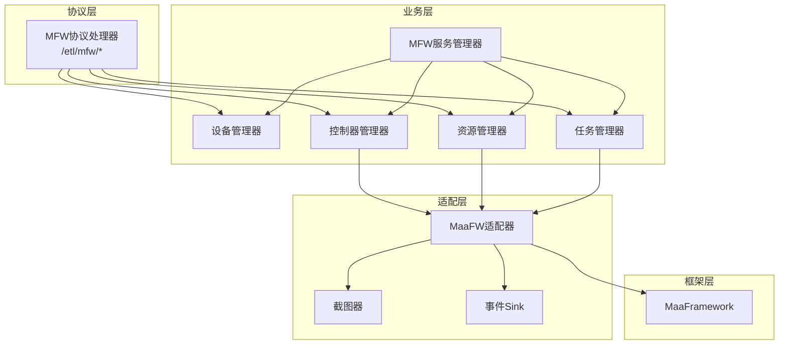
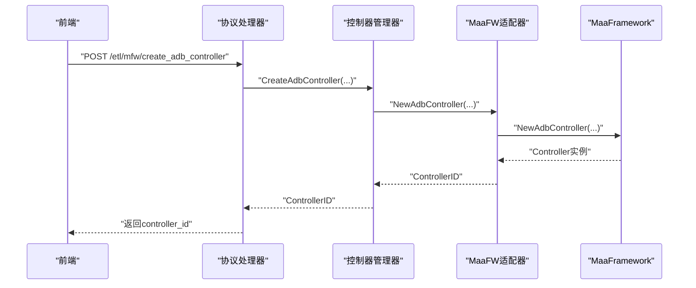
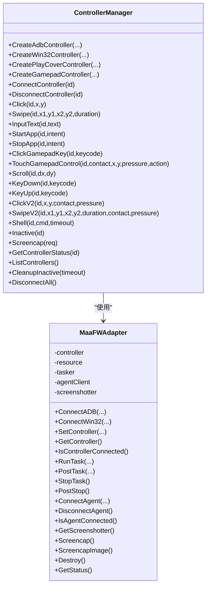
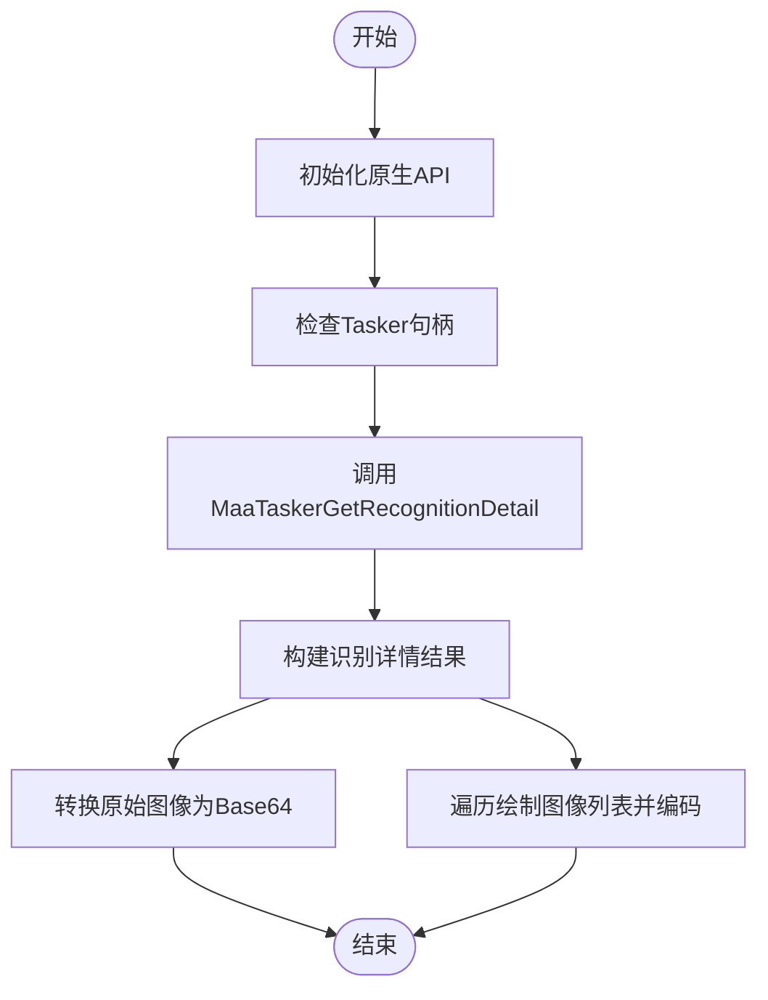
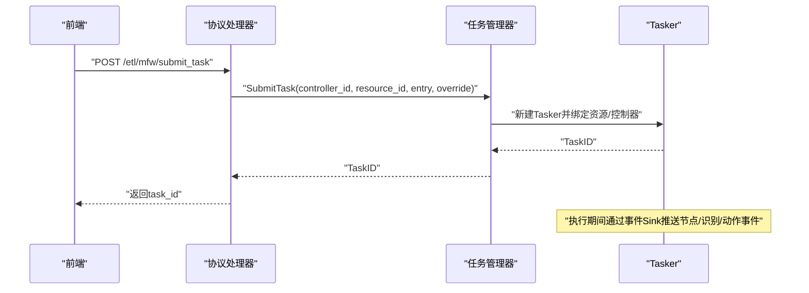
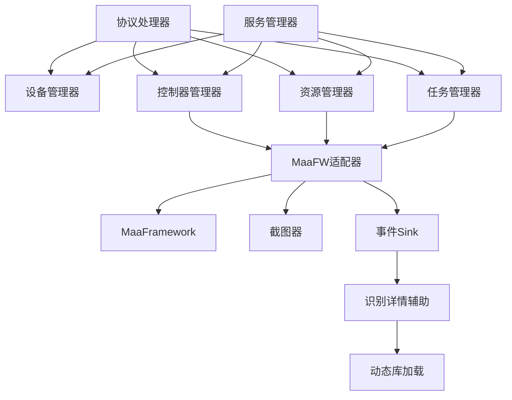

# MFW集成API

<cite>
**本文档引用的文件**
- [adapter.go](file://LocalBridge/internal/mfw/adapter.go)
- [device_manager.go](file://LocalBridge/internal/mfw/device_manager.go)
- [controller_manager.go](file://LocalBridge/internal/mfw/controller_manager.go)
- [task_manager.go](file://LocalBridge/internal/mfw/task_manager.go)
- [service.go](file://LocalBridge/internal/mfw/service.go)
- [types.go](file://LocalBridge/internal/mfw/types.go)
- [error.go](file://LocalBridge/internal/mfw/error.go)
- [resource_manager.go](file://LocalBridge/internal/mfw/resource_manager.go)
- [event_sink.go](file://LocalBridge/internal/mfw/event_sink.go)
- [reco_detail_helper.go](file://LocalBridge/internal/mfw/reco_detail_helper.go)
- [handler.go](file://LocalBridge/internal/protocol/mfw/handler.go)
- [mfw.go](file://LocalBridge/pkg/models/mfw.go)
- [lib_loader_windows.go](file://LocalBridge/internal/mfw/lib_loader_windows.go)
- [lib_loader_unix.go](file://LocalBridge/internal/mfw/lib_loader_unix.go)
</cite>

## 目录
1. [简介](#简介)
2. [项目结构](#项目结构)
3. [核心组件](#核心组件)
4. [架构总览](#架构总览)
5. [详细组件分析](#详细组件分析)
6. [依赖关系分析](#依赖关系分析)
7. [性能考虑](#性能考虑)
8. [故障排除指南](#故障排除指南)
9. [结论](#结论)
10. [附录](#附录)

## 简介
本文件面向MaaPipelineEditor的MFW（MaaFramework）集成API，提供设备控制、OCR识别、任务管理、设备管理与MFW适配器接口的完整技术文档。内容涵盖：
- 设备控制接口：连接、状态查询、命令发送、断开连接
- OCR识别服务：图像识别、文字提取、结果解析、精度控制
- 任务管理接口：任务创建、执行监控、进度跟踪、结果获取
- 设备管理功能：多设备协调、负载均衡、故障转移
- MFW适配器接口：设备抽象、协议转换、性能优化
- 完整API调用示例、错误处理策略、性能监控方案

## 项目结构
MFW集成位于LocalBridge模块内，采用分层设计：
- 协议层：对外暴露REST风格的WebSocket消息协议
- 业务层：设备管理、控制器管理、资源管理、任务管理
- 适配层：MaaFramework Go绑定封装
- 事件层：上下文事件与任务事件回调
- 模型层：请求/响应数据结构定义

**图表来源**
- [handler.go:1-860](file://LocalBridge/internal/protocol/mfw/handler.go#L1-L860)
- [service.go:1-218](file://LocalBridge/internal/mfw/service.go#L1-L218)
- [adapter.go:1-824](file://LocalBridge/internal/mfw/adapter.go#L1-L824)

**章节来源**
- [handler.go:1-860](file://LocalBridge/internal/protocol/mfw/handler.go#L1-L860)
- [service.go:1-218](file://LocalBridge/internal/mfw/service.go#L1-L218)

## 核心组件
- MFW服务管理器：统一初始化/关闭MaaFramework，聚合各管理器
- 设备管理器：枚举ADB设备与Win32窗口，提供可用截图/输入方法
- 控制器管理器：创建/连接/断开控制器，执行点击/滑动/输入等操作
- 资源管理器：加载/卸载资源包，计算哈希
- 任务管理器：提交/查询/停止任务
- MaaFW适配器：统一封装Controller/Resource/Tasker/Agent生命周期
- 事件Sink：节点/识别/动作/任务事件回调
- OCR识别辅助：原生API桥接，获取识别详情（原始图像、绘制图像）

**章节来源**
- [service.go:1-218](file://LocalBridge/internal/mfw/service.go#L1-L218)
- [device_manager.go:1-110](file://LocalBridge/internal/mfw/device_manager.go#L1-L110)
- [controller_manager.go:1-994](file://LocalBridge/internal/mfw/controller_manager.go#L1-L994)
- [resource_manager.go:1-158](file://LocalBridge/internal/mfw/resource_manager.go#L1-L158)
- [task_manager.go:1-114](file://LocalBridge/internal/mfw/task_manager.go#L1-L114)
- [adapter.go:1-824](file://LocalBridge/internal/mfw/adapter.go#L1-L824)
- [event_sink.go:1-520](file://LocalBridge/internal/mfw/event_sink.go#L1-L520)
- [reco_detail_helper.go:1-345](file://LocalBridge/internal/mfw/reco_detail_helper.go#L1-L345)

## 架构总览
MFW集成采用“协议处理器-业务管理器-适配器-框架”的分层架构。协议处理器接收前端消息，路由到对应管理器；管理器通过适配器与MaaFramework交互；事件Sink向前端推送调试事件。

**图表来源**
- [handler.go:159-203](file://LocalBridge/internal/protocol/mfw/handler.go#L159-L203)
- [controller_manager.go:34-75](file://LocalBridge/internal/mfw/controller_manager.go#L34-L75)
- [adapter.go:65-118](file://LocalBridge/internal/mfw/adapter.go#L65-L118)

## 详细组件分析

### 设备控制接口
- 设备发现
  - ADB设备：RefreshAdbDevices列出设备、截图方法、输入方法、配置
  - Win32窗口：RefreshWin32Windows列出窗口句柄、类名、标题、截图/输入方法
- 控制器创建与连接
  - ADB：CreateAdbController + ConnectController
  - Win32：CreateWin32Controller + ConnectController
  - PlayCover：CreatePlayCoverController
  - Gamepad：CreateGamepadController
- 控制器操作
  - 点击/滑动/输入文本/启动/停止应用
  - 手柄按键/触摸/滚动/按键按下/释放
  - V2版本点击/滑动（支持接触点与压力）
  - Shell命令执行、恢复控制器状态
- 截图
  - Screencap接口支持目标长边/短边、原始尺寸、缓存策略
- 状态查询与断开
  - GetControllerStatus、DisconnectController

**图表来源**
- [controller_manager.go:1-994](file://LocalBridge/internal/mfw/controller_manager.go#L1-L994)
- [adapter.go:1-824](file://LocalBridge/internal/mfw/adapter.go#L1-L824)

**章节来源**
- [device_manager.go:1-110](file://LocalBridge/internal/mfw/device_manager.go#L1-L110)
- [controller_manager.go:1-994](file://LocalBridge/internal/mfw/controller_manager.go#L1-L994)
- [adapter.go:1-824](file://LocalBridge/internal/mfw/adapter.go#L1-L824)

### OCR识别服务
- 识别详情获取
  - 通过原生API桥接，读取识别名称、算法、命中框、详情JSON、原始图像、绘制图像列表
  - 支持跨平台动态库加载（Windows LoadLibrary、Unix dlopen）
- 结果解析
  - 将MaaFramework缓冲区转换为Go图像，再编码为Base64
  - 识别详情包含算法、边界框、原始图像、绘制图像集合
- 精度控制
  - 通过识别节点配置与算法参数控制（由上层Pipeline定义）

**图表来源**
- [reco_detail_helper.go:85-267](file://LocalBridge/internal/mfw/reco_detail_helper.go#L85-L267)
- [lib_loader_windows.go:1-21](file://LocalBridge/internal/mfw/lib_loader_windows.go#L1-L21)
- [lib_loader_unix.go:1-19](file://LocalBridge/internal/mfw/lib_loader_unix.go#L1-L19)

**章节来源**
- [reco_detail_helper.go:1-345](file://LocalBridge/internal/mfw/reco_detail_helper.go#L1-L345)

### 任务管理接口
- 任务提交
  - SubmitTask生成TaskID，绑定控制器与资源，记录入口与覆盖参数
- 任务状态
  - GetTaskStatus查询状态（Pending/Running/Stopped/Success/Failure）
- 任务停止
  - StopTask/StopAll停止指定或全部任务
- 事件回调
  - 通过SimpleTaskerSink推送任务开始/成功/失败事件

**图表来源**
- [handler.go:685-715](file://LocalBridge/internal/protocol/mfw/handler.go#L685-L715)
- [task_manager.go:24-53](file://LocalBridge/internal/mfw/task_manager.go#L24-L53)
- [event_sink.go:418-454](file://LocalBridge/internal/mfw/event_sink.go#L418-L454)

**章节来源**
- [task_manager.go:1-114](file://LocalBridge/internal/mfw/task_manager.go#L1-L114)
- [handler.go:684-771](file://LocalBridge/internal/protocol/mfw/handler.go#L684-L771)
- [event_sink.go:1-520](file://LocalBridge/internal/mfw/event_sink.go#L1-L520)

### 设备管理功能
- 多设备协调
  - 通过控制器ID区分设备，支持同时管理多种控制器
- 负载均衡
  - 通过控制器列表与状态查询，结合业务侧策略进行分配
- 故障转移
  - 断开异常控制器，自动清理并重建；支持非活跃控制器定时清理

**章节来源**
- [controller_manager.go:613-647](file://LocalBridge/internal/mfw/controller_manager.go#L613-L647)
- [service.go:140-170](file://LocalBridge/internal/mfw/service.go#L140-L170)

### MFW适配器接口
- 设备抽象
  - 统一封装ADB/Win32/PlayCover/Gamepad控制器，屏蔽底层差异
- 协议转换
  - 将上层请求转换为MaaFramework调用，返回统一结果
- 性能优化
  - 截图缓存（默认100ms TTL），避免频繁截图
  - 事件Sink精简关键事件，降低前端压力
  - 资源路径处理（Windows短路径/工作目录切换），提升稳定性

**章节来源**
- [adapter.go:1-824](file://LocalBridge/internal/mfw/adapter.go#L1-L824)
- [event_sink.go:1-520](file://LocalBridge/internal/mfw/event_sink.go#L1-L520)

## 依赖关系分析

**图表来源**
- [handler.go:1-860](file://LocalBridge/internal/protocol/mfw/handler.go#L1-L860)
- [service.go:1-218](file://LocalBridge/internal/mfw/service.go#L1-L218)
- [adapter.go:1-824](file://LocalBridge/internal/mfw/adapter.go#L1-L824)
- [event_sink.go:1-520](file://LocalBridge/internal/mfw/event_sink.go#L1-L520)
- [reco_detail_helper.go:1-345](file://LocalBridge/internal/mfw/reco_detail_helper.go#L1-L345)

**章节来源**
- [handler.go:1-860](file://LocalBridge/internal/protocol/mfw/handler.go#L1-L860)
- [service.go:1-218](file://LocalBridge/internal/mfw/service.go#L1-L218)

## 性能考虑
- 截图缓存：截图器默认100ms TTL，减少重复截图开销
- 事件降噪：仅推送关键节点/识别/动作/任务事件，降低前端渲染压力
- 资源路径处理：Windows环境下优先短路径或工作目录切换，避免中文路径导致的库加载问题
- 非活跃清理：定期清理长时间未使用的控制器，释放内存与句柄
- 异步连接：控制器连接使用异步方式并带超时，避免阻塞主线程

[本节为通用性能建议，无需特定文件引用]

## 故障排除指南
- 初始化失败
  - 症状：服务未初始化，返回“MaaFramework未初始化”
  - 处理：使用命令设置库路径后重启服务
- 控制器创建失败
  - 症状：ErrCodeControllerCreateFail
  - 处理：检查ADB路径、设备地址、截图/输入方法配置
- 控制器连接失败
  - 症状：ErrCodeControllerConnectFail
  - 处理：确认设备在线、权限充足、方法组合有效
- 截图失败
  - 症状：ErrCodeScreencapFailed
  - 处理：更换截图方法、检查权限、调整目标尺寸
- 任务提交失败
  - 症状：ErrCodeTaskSubmitFailed
  - 处理：检查控制器/资源绑定状态、入口节点与覆盖参数
- 资源加载失败
  - 症状：ErrCodeResourceLoadFailed
  - 处理：检查资源路径、中文路径处理、工作目录切换

**章节来源**
- [error.go:1-53](file://LocalBridge/internal/mfw/error.go#L1-L53)
- [service.go:36-138](file://LocalBridge/internal/mfw/service.go#L36-L138)
- [controller_manager.go:249-300](file://LocalBridge/internal/mfw/controller_manager.go#L249-L300)
- [resource_manager.go:26-105](file://LocalBridge/internal/mfw/resource_manager.go#L26-L105)

## 结论
MFW集成API提供了完整的设备控制、OCR识别、任务管理与设备管理能力。通过协议处理器与多层管理器解耦，配合MaaFW适配器与事件系统，实现了高可用、高性能的自动化控制与识别服务。建议在生产环境中结合事件监控与资源路径处理策略，确保稳定运行。

[本节为总结性内容，无需特定文件引用]

## 附录

### API调用示例（路径与参数）
- 设备发现
  - GET /etl/mfw/refresh_adb_devices
  - GET /etl/mfw/refresh_win32_windows
- 控制器管理
  - POST /etl/mfw/create_adb_controller
    - 参数：adb_path, address, screencap_methods[], input_methods[], config, agent_path
  - POST /etl/mfw/create_win32_controller
    - 参数：hwnd, screencap_method, input_method
  - POST /etl/mfw/create_playcover_controller
    - 参数：address, uuid
  - POST /etl/mfw/create_gamepad_controller
    - 参数：hwnd, gamepad_type, screencap_method
  - POST /etl/mfw/disconnect_controller
    - 参数：controller_id
- 控制器操作
  - POST /etl/mfw/controller_click
    - 参数：controller_id, x, y
  - POST /etl/mfw/controller_swipe
    - 参数：controller_id, x1, y1, x2, y2, duration
  - POST /etl/mfw/controller_input_text
    - 参数：controller_id, text
  - POST /etl/mfw/controller_start_app
    - 参数：controller_id, package
  - POST /etl/mfw/controller_stop_app
    - 参数：controller_id, package
  - POST /etl/mfw/controller_click_key
    - 参数：controller_id, keycode
  - POST /etl/mfw/controller_touch_gamepad
    - 参数：controller_id, contact, x, y, pressure, action
  - POST /etl/mfw/controller_scroll
    - 参数：controller_id, dx, dy
  - POST /etl/mfw/controller_key_down
    - 参数：controller_id, keycode
  - POST /etl/mfw/controller_key_up
    - 参数：controller_id, keycode
  - POST /etl/mfw/controller_click_v2
    - 参数：controller_id, x, y, contact, pressure
  - POST /etl/mfw/controller_swipe_v2
    - 参数：controller_id, x1, y1, x2, y2, duration, contact, pressure
  - POST /etl/mfw/controller_shell
    - 参数：controller_id, command, timeout
  - POST /etl/mfw/controller_inactive
    - 参数：controller_id
- 截图
  - POST /etl/mfw/request_screencap
    - 参数：controller_id
- 任务管理
  - POST /etl/mfw/submit_task
    - 参数：controller_id, resource_id, entry, pipeline_override(map)
  - POST /etl/mfw/query_task_status
    - 参数：task_id
  - POST /etl/mfw/stop_task
    - 参数：task_id
- 资源管理
  - POST /etl/mfw/load_resource
    - 参数：resource_path

**章节来源**
- [handler.go:1-860](file://LocalBridge/internal/protocol/mfw/handler.go#L1-L860)
- [mfw.go:1-244](file://LocalBridge/pkg/models/mfw.go#L1-L244)

### 错误码与含义
- MFW_CONTROLLER_CREATE_FAIL：控制器创建失败
- MFW_CONTROLLER_CONNECT_FAIL：控制器连接失败
- MFW_CONTROLLER_NOT_FOUND：控制器不存在
- MFW_CONTROLLER_NOT_CONNECTED：控制器未连接
- MFW_CONNECTION_FAILED：连接失败
- MFW_SCREENCAP_FAILED：截图失败
- MFW_OPERATION_FAILED：操作失败
- MFW_TASK_SUBMIT_FAILED：任务提交失败
- MFW_RESOURCE_LOAD_FAILED：资源加载失败
- MFW_INVALID_PARAMETER：参数无效
- MFW_DEVICE_NOT_FOUND：设备未找到
- MFW_NOT_INITIALIZED：MaaFramework未初始化
- MFW_OCR_RESOURCE_NOT_CONFIGURED：OCR资源未配置

**章节来源**
- [error.go:1-53](file://LocalBridge/internal/mfw/error.go#L1-L53)