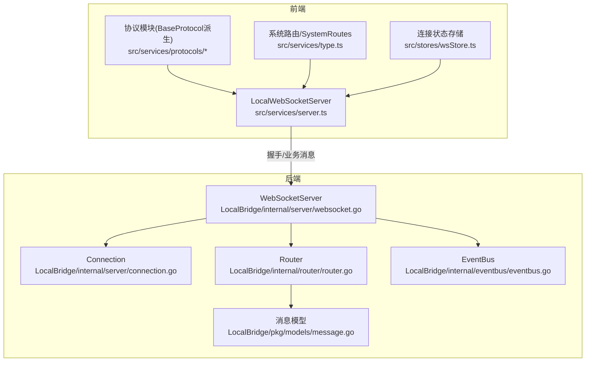
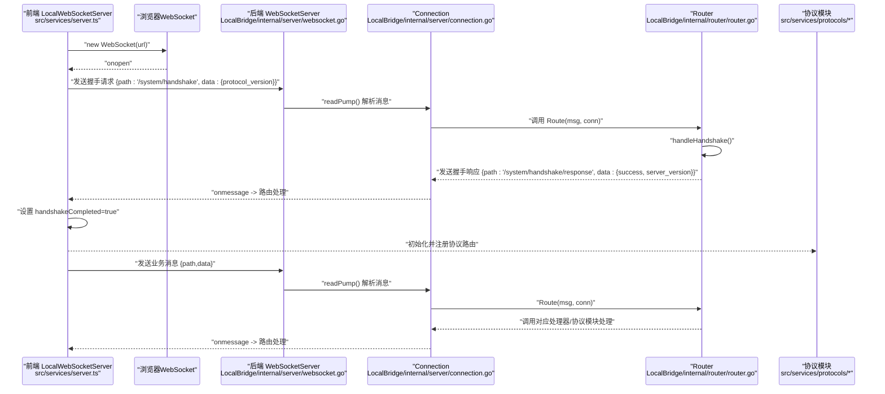
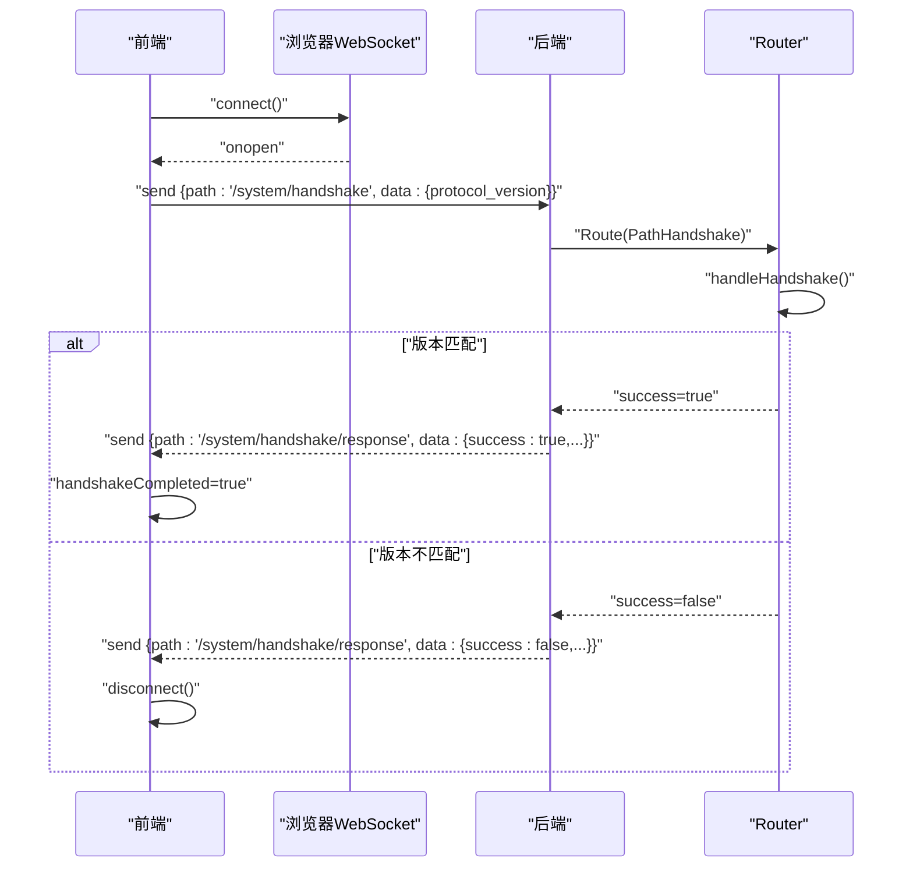
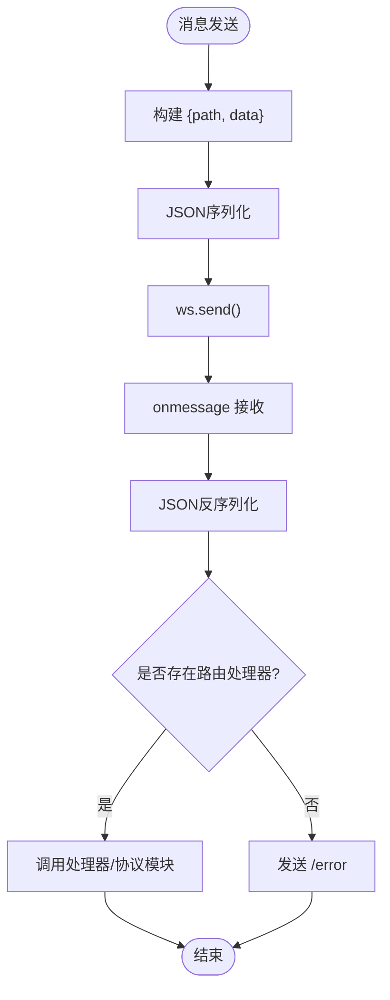
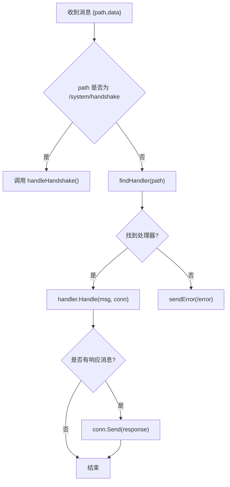
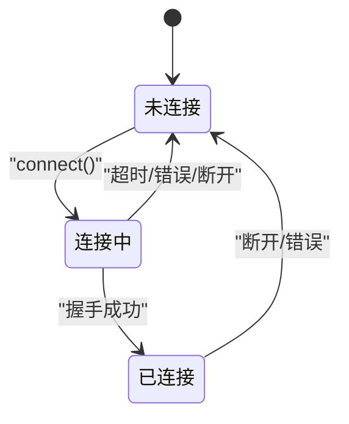
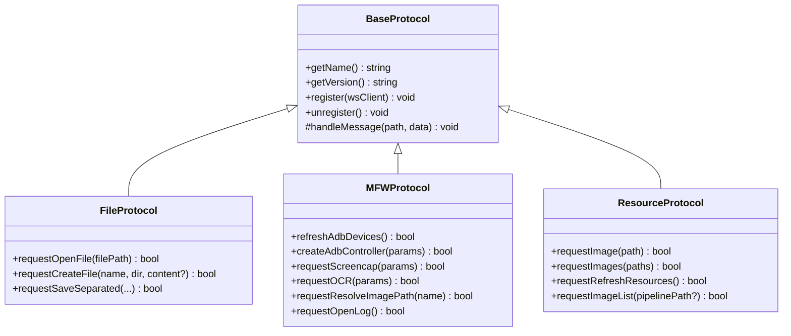
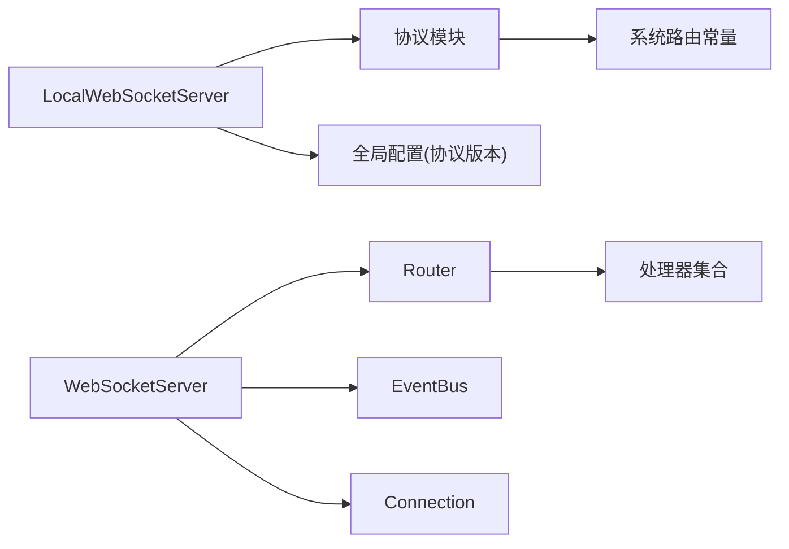

# WebSocket协议

<cite>
**本文档引用的文件**
- [websocket.go](file://LocalBridge/internal/server/websocket.go)
- [connection.go](file://LocalBridge/internal/server/connection.go)
- [router.go](file://LocalBridge/internal/router/router.go)
- [message.go](file://LocalBridge/pkg/models/message.go)
- [server.ts](file://src/services/server.ts)
- [type.ts](file://src/services/type.ts)
- [BaseProtocol.ts](file://src/services/protocols/BaseProtocol.ts)
- [FileProtocol.ts](file://src/services/protocols/FileProtocol.ts)
- [MFWProtocol.ts](file://src/services/protocols/MFWProtocol.ts)
- [ResourceProtocol.ts](file://src/services/protocols/ResourceProtocol.ts)
- [ErrorProtocol.ts](file://src/services/protocols/ErrorProtocol.ts)
- [eventbus.go](file://LocalBridge/internal/eventbus/eventbus.go)
- [wsStore.ts](file://src/stores/wsStore.ts)
</cite>

## 目录
1. [引言](#引言)
2. [项目结构](#项目结构)
3. [核心组件](#核心组件)
4. [架构总览](#架构总览)
5. [详细组件分析](#详细组件分析)
6. [依赖关系分析](#依赖关系分析)
7. [性能考虑](#性能考虑)
8. [故障排除指南](#故障排除指南)
9. [结论](#结论)
10. [附录](#附录)

## 引言
本文件系统性地阐述本项目的WebSocket协议设计与实现，覆盖连接建立与握手流程、消息格式与路由机制、事件类型定义、协议版本管理与向后兼容策略、消息序列化规范、连接状态管理与重连机制、错误处理策略、以及协议扩展点与自定义消息类型的实现方式。目标读者包括前端与后端工程师、集成开发者与维护人员。

## 项目结构
本协议实现横跨前端TypeScript与后端Go两部分：
- 前端负责WebSocket连接、消息编解码、路由注册与协议模块化封装
- 后端负责WebSocket升级、连接管理、消息路由与处理器分发、事件总线与协议版本控制

**图表来源**
- [server.ts:22-343](file://src/services/server.ts#L22-L343)
- [websocket.go:36-178](file://LocalBridge/internal/server/websocket.go#L36-L178)
- [connection.go:12-96](file://LocalBridge/internal/server/connection.go#L12-L96)
- [router.go:28-161](file://LocalBridge/internal/router/router.go#L28-L161)
- [message.go:3-129](file://LocalBridge/pkg/models/message.go#L3-L129)
- [eventbus.go:17-83](file://LocalBridge/internal/eventbus/eventbus.go#L17-L83)
- [wsStore.ts:7-23](file://src/stores/wsStore.ts#L7-L23)

**章节来源**
- [server.ts:22-343](file://src/services/server.ts#L22-L343)
- [websocket.go:36-178](file://LocalBridge/internal/server/websocket.go#L36-L178)
- [connection.go:12-96](file://LocalBridge/internal/server/connection.go#L12-L96)
- [router.go:28-161](file://LocalBridge/internal/router/router.go#L28-L161)
- [message.go:3-129](file://LocalBridge/pkg/models/message.go#L3-L129)
- [eventbus.go:17-83](file://LocalBridge/internal/eventbus/eventbus.go#L17-L83)
- [wsStore.ts:7-23](file://src/stores/wsStore.ts#L7-L23)

## 核心组件
- 协议版本与路由常量
  - 前端系统路由：握手请求与响应路径
  - 后端协议版本：服务端声明的协议版本
- 消息模型
  - 通用消息结构、错误消息、文件/资源/日志等专用数据结构
- 连接与服务器
  - 前端：连接生命周期、超时、状态监听、消息发送
  - 后端：HTTP升级、连接注册/注销、读写泵、广播
- 路由与处理器
  - 路由器负责系统握手与业务路由分发，处理器按前缀匹配
- 协议模块
  - BaseProtocol抽象基类，各协议模块注册路由与处理消息
- 事件总线
  - 连接建立/关闭事件发布，供其他组件订阅

**章节来源**
- [type.ts:1-27](file://src/services/type.ts#L1-L27)
- [websocket.go:15-31](file://LocalBridge/internal/server/websocket.go#L15-L31)
- [message.go:3-129](file://LocalBridge/pkg/models/message.go#L3-L129)
- [connection.go:12-96](file://LocalBridge/internal/server/connection.go#L12-L96)
- [router.go:13-100](file://LocalBridge/internal/router/router.go#L13-L100)
- [BaseProtocol.ts:7-39](file://src/services/protocols/BaseProtocol.ts#L7-L39)
- [eventbus.go:74-83](file://LocalBridge/internal/eventbus/eventbus.go#L74-L83)

## 架构总览
下图展示从连接建立到消息路由的整体流程，包括握手、版本协商、消息分发与协议模块处理。

**图表来源**
- [server.ts:108-184](file://src/services/server.ts#L108-L184)
- [websocket.go:144-161](file://LocalBridge/internal/server/websocket.go#L144-L161)
- [connection.go:31-59](file://LocalBridge/internal/server/connection.go#L31-L59)
- [router.go:56-83](file://LocalBridge/internal/router/router.go#L56-L83)
- [BaseProtocol.ts:20-39](file://src/services/protocols/BaseProtocol.ts#L20-L39)

**章节来源**
- [server.ts:108-184](file://src/services/server.ts#L108-L184)
- [websocket.go:144-161](file://LocalBridge/internal/server/websocket.go#L144-L161)
- [connection.go:31-59](file://LocalBridge/internal/server/connection.go#L31-L59)
- [router.go:56-83](file://LocalBridge/internal/router/router.go#L56-L83)

## 详细组件分析

### 连接建立与握手流程
- 前端连接
  - 创建WebSocket实例，设置连接超时（默认3秒），监听onopen/onmessage/onerror/onclose
  - onopen后立即发送握手请求，包含协议版本
  - 收到握手响应后，若成功则标记握手完成，触发连接状态变化
- 后端握手
  - 读取消息后进入路由分发
  - 处理系统握手路径，解析客户端协议版本并与服务端版本比较
  - 成功则返回握手响应，失败则返回错误消息并可触发协议不匹配回调
- 版本协商
  - 前端通过全局配置注入协议版本
  - 后端声明固定协议版本常量
  - 不匹配时前端断开连接并提示升级

**图表来源**
- [server.ts:108-168](file://src/services/server.ts#L108-L168)
- [router.go:114-143](file://LocalBridge/internal/router/router.go#L114-L143)
- [type.ts:2-5](file://src/services/type.ts#L2-L5)

**章节来源**
- [server.ts:108-168](file://src/services/server.ts#L108-L168)
- [router.go:114-143](file://LocalBridge/internal/router/router.go#L114-L143)
- [type.ts:2-5](file://src/services/type.ts#L2-L5)

### 消息格式与序列化规范
- 通用消息结构
  - 字段：path（路由路径）、data（消息体）
- 前端序列化
  - 将{path, data}序列化为JSON字符串并通过WebSocket发送
  - 接收时反序列化为对象并按path分发
- 后端序列化
  - 读取消息后解析为通用消息结构
  - 发送时将消息结构序列化为JSON
- 错误消息
  - 路径固定为"/error"，包含code、message、detail
- 专用数据结构
  - 文件、资源、日志、版本握手等专用结构体

**图表来源**
- [server.ts:289-304](file://src/services/server.ts#L289-L304)
- [connection.go:78-95](file://LocalBridge/internal/server/connection.go#L78-L95)
- [message.go:3-14](file://LocalBridge/pkg/models/message.go#L3-L14)

**章节来源**
- [server.ts:289-304](file://src/services/server.ts#L289-L304)
- [connection.go:78-95](file://LocalBridge/internal/server/connection.go#L78-L95)
- [message.go:3-14](file://LocalBridge/pkg/models/message.go#L3-L14)

### 路由机制与事件类型
- 路由分发
  - 精确匹配优先于前缀匹配
  - 系统握手路由独立处理
  - 未知路由返回错误消息
- 事件类型
  - 连接建立/关闭事件通过事件总线发布
  - 前端订阅这些事件以更新UI与状态

**图表来源**
- [router.go:56-112](file://LocalBridge/internal/router/router.go#L56-L112)
- [eventbus.go:74-83](file://LocalBridge/internal/eventbus/eventbus.go#L74-L83)

**章节来源**
- [router.go:56-112](file://LocalBridge/internal/router/router.go#L56-L112)
- [eventbus.go:74-83](file://LocalBridge/internal/eventbus/eventbus.go#L74-L83)

### 协议版本管理与向后兼容
- 版本常量
  - 后端声明固定协议版本常量
  - 前端从全局配置注入协议版本
- 版本协商
  - 握手阶段进行版本比对
  - 不匹配时拒绝连接并提示升级
- 向后兼容策略
  - 主版本变更：不兼容变更（消息格式、握手流程等）
  - 次版本变更：向后兼容功能新增（新增消息类型、新增capability字段）
  - 修订号变更：向后兼容问题修正

**章节来源**
- [websocket.go:15-16](file://LocalBridge/internal/server/websocket.go#L15-L16)
- [server.ts:20-20](file://src/services/server.ts#L20-L20)
- [router.go:127-138](file://LocalBridge/internal/router/router.go#L127-L138)

### 连接状态管理与重连机制
- 前端状态
  - 连接中/已连接状态、连接超时、错误提示、断开清理
  - 提供状态与连接中状态监听器
- 后端状态
  - 连接注册/注销、读写泵、异常关闭处理
- 重连策略
  - 当前实现未内置自动重连逻辑，建议在上层业务中基于状态监听实现指数退避或固定间隔重试

**图表来源**
- [server.ts:108-270](file://src/services/server.ts#L108-L270)
- [connection.go:31-76](file://LocalBridge/internal/server/connection.go#L31-L76)

**章节来源**
- [server.ts:108-270](file://src/services/server.ts#L108-L270)
- [connection.go:31-76](file://LocalBridge/internal/server/connection.go#L31-L76)

### 错误处理策略
- 错误消息格式
  - 统一的错误消息结构，包含code、message、detail
- 前端处理
  - 统一注册"/error"路由，根据code映射用户可见提示
  - 针对特定错误（如OCR资源加载失败）弹出Modal
- 后端处理
  - 未知路由返回错误消息
  - 发送失败记录日志

**章节来源**
- [ErrorProtocol.ts:20-79](file://src/services/protocols/ErrorProtocol.ts#L20-L79)
- [router.go:102-112](file://LocalBridge/internal/router/router.go#L102-L112)
- [message.go:9-14](file://LocalBridge/pkg/models/message.go#L9-L14)

### 协议扩展点与自定义消息类型
- 协议模块化
  - 所有协议模块继承BaseProtocol，实现getName/getVersion/register/unregister/handleMessage
  - 协议模块通过wsClient.registerRoute注册接收路由，并通过wsClient.send发送请求
- 扩展步骤
  - 新建协议类，实现必要方法
  - 在initializeWebSocket中注册协议实例
  - 前端路由与后端处理器按约定路径进行双向通信

**图表来源**
- [BaseProtocol.ts:7-39](file://src/services/protocols/BaseProtocol.ts#L7-L39)
- [FileProtocol.ts:16-68](file://src/services/protocols/FileProtocol.ts#L16-L68)
- [MFWProtocol.ts:18-115](file://src/services/protocols/MFWProtocol.ts#L18-L115)
- [ResourceProtocol.ts:13-36](file://src/services/protocols/ResourceProtocol.ts#L13-L36)

**章节来源**
- [BaseProtocol.ts:7-39](file://src/services/protocols/BaseProtocol.ts#L7-L39)
- [FileProtocol.ts:16-68](file://src/services/protocols/FileProtocol.ts#L16-L68)
- [MFWProtocol.ts:18-115](file://src/services/protocols/MFWProtocol.ts#L18-L115)
- [ResourceProtocol.ts:13-36](file://src/services/protocols/ResourceProtocol.ts#L13-L36)

### 典型协议模块示例

#### 文件协议（FileProtocol）
- 职责
  - 处理文件列表、内容、变更推送
  - 处理保存/创建确认
  - 提供打开/创建/保存/分离保存等请求方法
- 关键路由
  - 接收：/lte/file_list、/lte/file_content、/lte/file_changed、/ack/save_file、/ack/save_separated、/ack/create_file
  - 请求：/etl/open_file、/etl/create_file、/etl/save_separated

**章节来源**
- [FileProtocol.ts:16-68](file://src/services/protocols/FileProtocol.ts#L16-L68)
- [FileProtocol.ts:338-391](file://src/services/protocols/FileProtocol.ts#L338-L391)

#### MFW协议（MFWProtocol）
- 职责
  - 设备发现与控制器管理
  - 截图、OCR、图片路径解析、日志打开等能力
  - 提供设备连接、断开与操作方法
- 关键路由
  - 接收：/lte/mfw/*、/lte/utility/*
  - 请求：/etl/mfw/*、/etl/utility/*

**章节来源**
- [MFWProtocol.ts:18-115](file://src/services/protocols/MFWProtocol.ts#L18-L115)
- [MFWProtocol.ts:332-402](file://src/services/protocols/MFWProtocol.ts#L332-L402)

#### 资源协议（ResourceProtocol）
- 职责
  - 资源包与图片列表管理
  - 单/批量图片请求与缓存
- 关键路由
  - 接收：/lte/resource_bundles、/lte/image、/lte/images、/lte/image_list
  - 请求：/etl/get_image、/etl/get_images、/etl/refresh_resources、/etl/get_image_list

**章节来源**
- [ResourceProtocol.ts:13-36](file://src/services/protocols/ResourceProtocol.ts#L13-L36)
- [ResourceProtocol.ts:149-240](file://src/services/protocols/ResourceProtocol.ts#L149-L240)

## 依赖关系分析
- 前端依赖
  - LocalWebSocketServer依赖系统路由常量、协议模块、全局配置
  - 协议模块依赖wsClient提供的注册与发送能力
- 后端依赖
  - WebSocketServer依赖gorilla/websocket、内部models与eventbus
  - Router依赖handlers映射与错误模型
- 耦合与内聚
  - 前后端通过统一消息格式耦合，协议模块化提高内聚
  - 路由器与处理器通过接口解耦

**图表来源**
- [server.ts:361-387](file://src/services/server.ts#L361-L387)
- [websocket.go:36-46](file://LocalBridge/internal/server/websocket.go#L36-L46)
- [router.go:28-49](file://LocalBridge/internal/router/router.go#L28-L49)
- [eventbus.go:17-27](file://LocalBridge/internal/eventbus/eventbus.go#L17-L27)

**章节来源**
- [server.ts:361-387](file://src/services/server.ts#L361-L387)
- [websocket.go:36-46](file://LocalBridge/internal/server/websocket.go#L36-L46)
- [router.go:28-49](file://LocalBridge/internal/router/router.go#L28-L49)
- [eventbus.go:17-27](file://LocalBridge/internal/eventbus/eventbus.go#L17-L27)

## 性能考虑
- 发送队列与背压
  - 后端Connection的发送通道容量有限，避免阻塞
- 读写泵
  - 读写分离，避免阻塞导致的连接堆积
- 路由查找
  - 精确匹配优先，减少前缀匹配开销
- 建议
  - 大消息分片或压缩
  - 合理设置连接超时与重连间隔
  - 对高频事件进行去抖/节流

[本节为通用指导，无需具体文件分析]

## 故障排除指南
- 连接超时
  - 前端检测到超时后弹出提示并断开连接
  - 检查本地服务是否启动、端口是否占用
- 协议版本不匹配
  - 握手失败时前端断开连接并提示升级
  - 确保前后端协议版本一致
- 消息解析失败
  - 后端记录错误并忽略非法消息
  - 前端检查消息格式与序列化
- 未知路由
  - 后端返回错误消息，前端根据code提示用户
- 连接异常断开
  - 后端记录异常关闭并清理连接
  - 前端触发状态变更与断开提示

**章节来源**
- [server.ts:130-163](file://src/services/server.ts#L130-L163)
- [router.go:117-121](file://LocalBridge/internal/router/router.go#L117-L121)
- [connection.go:39-44](file://LocalBridge/internal/server/connection.go#L39-L44)
- [ErrorProtocol.ts:20-79](file://src/services/protocols/ErrorProtocol.ts#L20-L79)

## 结论
本协议通过清晰的消息格式、严格的版本协商、模块化的协议设计与完善的错误处理，实现了前后端稳定可靠的WebSocket通信。建议在上层业务中结合状态监听与事件总线实现健壮的重连与可观测性，并通过协议扩展点持续演进功能。

[本节为总结性内容，无需具体文件分析]

## 附录

### 消息示例与序列化规范
- 通用消息
  - 路径：任意字符串
  - 数据：任意JSON对象
- 握手请求
  - 路径：/system/handshake
  - 数据：{ protocol_version: string }
- 握手响应
  - 路径：/system/handshake/response
  - 数据：{ success: boolean, server_version: string, required_version: string, message: string }
- 错误消息
  - 路径：/error
  - 数据：{ code: string, message: string, detail?: any }

**章节来源**
- [type.ts:7-18](file://src/services/type.ts#L7-L18)
- [message.go:104-115](file://LocalBridge/pkg/models/message.go#L104-L115)
- [router.go:146-160](file://LocalBridge/internal/router/router.go#L146-L160)

### 路由与事件清单
- 系统路由
  - /system/handshake
  - /system/handshake/response
- 事件类型
  - connection.established
  - connection.closed

**章节来源**
- [type.ts:2-5](file://src/services/type.ts#L2-L5)
- [eventbus.go:74-83](file://LocalBridge/internal/eventbus/eventbus.go#L74-L83)