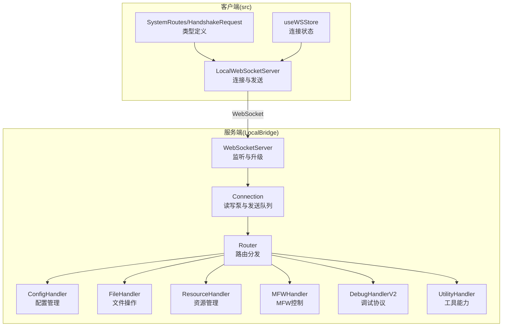
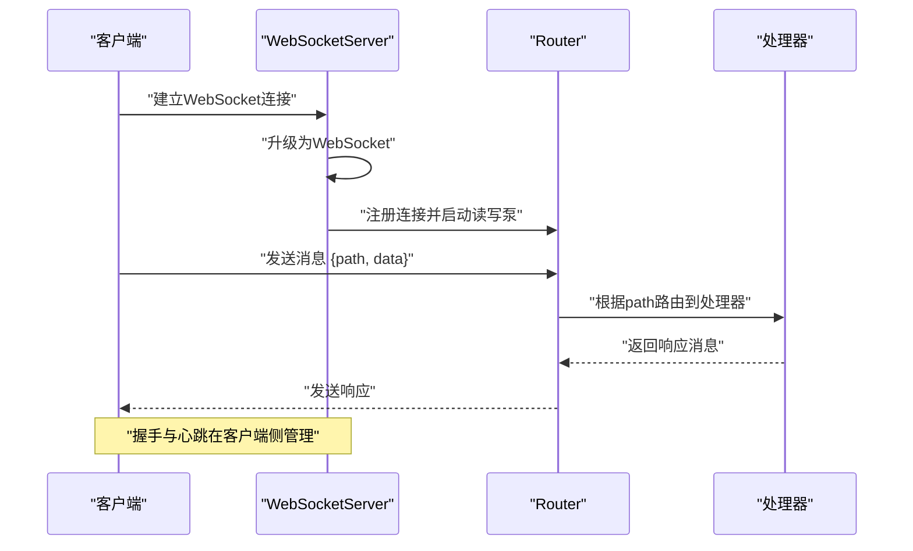
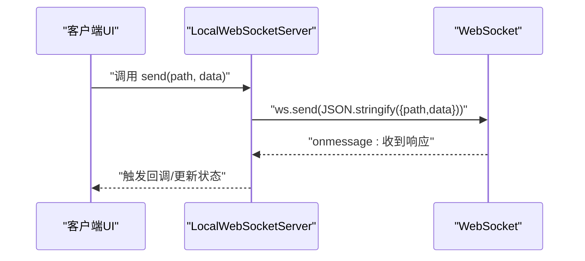
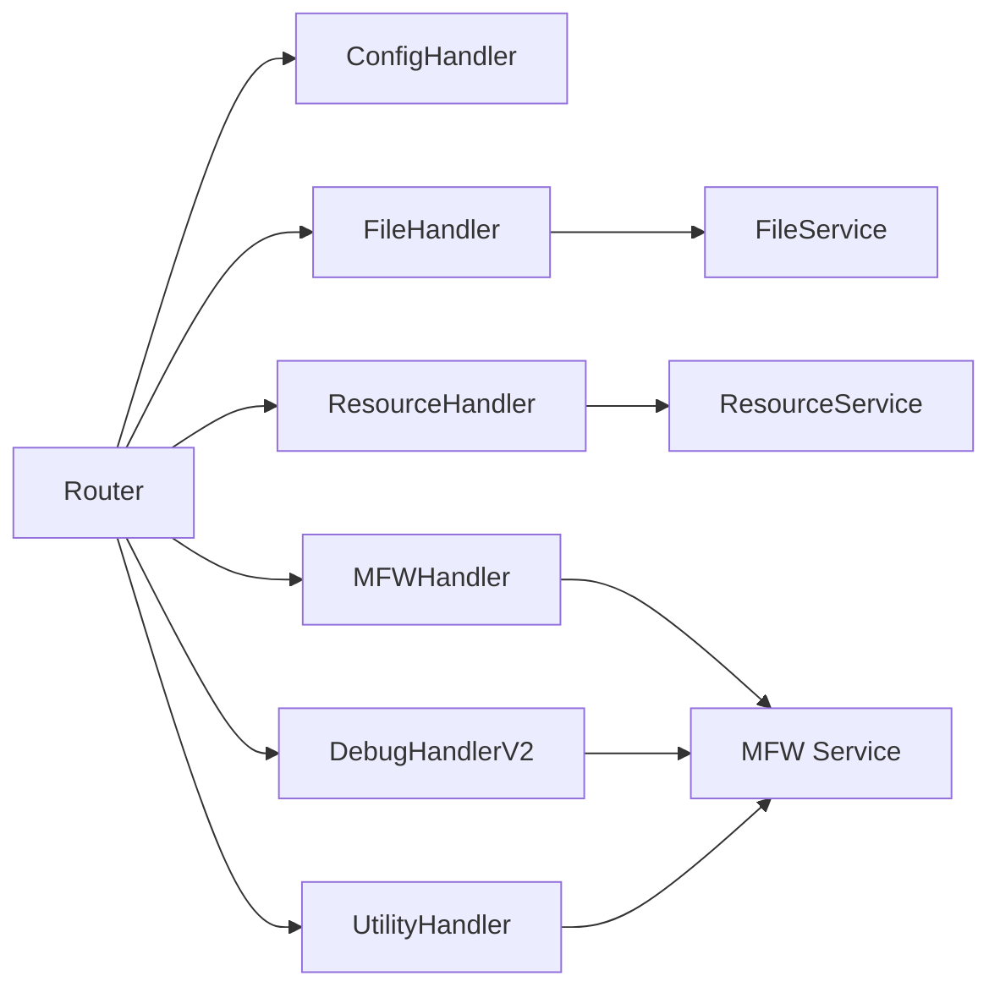

# WebSocket通信协议

<cite>
**本文档引用的文件**
- [websocket.go](file://LocalBridge/internal/server/websocket.go)
- [connection.go](file://LocalBridge/internal/server/connection.go)
- [router.go](file://LocalBridge/internal/router/router.go)
- [message.go](file://LocalBridge/pkg/models/message.go)
- [mfw.go](file://LocalBridge/pkg/models/mfw.go)
- [resource.go](file://LocalBridge/pkg/models/resource.go)
- [handler.go](file://LocalBridge/internal/protocol/config/handler.go)
- [file_handler.go](file://LocalBridge/internal/protocol/file/file_handler.go)
- [handler.go](file://LocalBridge/internal/protocol/resource/handler.go)
- [handler.go](file://LocalBridge/internal/protocol/mfw/handler.go)
- [handler_v2.go](file://LocalBridge/internal/protocol/debug/handler_v2.go)
- [handler.go](file://LocalBridge/internal/protocol/utility/handler.go)
- [server.ts](file://src/services/server.ts)
- [type.ts](file://src/services/type.ts)
- [index.ts](file://src/services/protocols/index.ts)
- [wsStore.ts](file://src/stores/wsStore.ts)
</cite>

## 目录
1. [简介](#简介)
2. [项目结构](#项目结构)
3. [核心组件](#核心组件)
4. [架构总览](#架构总览)
5. [详细组件分析](#详细组件分析)
6. [依赖关系分析](#依赖关系分析)
7. [性能考虑](#性能考虑)
8. [故障排查指南](#故障排查指南)
9. [结论](#结论)
10. [附录](#附录)

## 简介
本文件系统性阐述 MaaPipelineEditor 的 WebSocket 通信协议，覆盖协议设计原则、消息格式、路由机制、连接管理、握手与心跳、错误处理、版本管理与兼容性、以及客户端最佳实践。协议采用统一的 JSON 消息结构，通过路径式路由进行功能分发，并以处理器模块化组织各业务域。

## 项目结构
- 服务端位于 LocalBridge，负责 WebSocket 服务器、连接管理、消息路由与各协议处理器。
- 客户端位于 src，负责连接建立、消息收发、状态管理与协议封装。

图表来源
- [websocket.go:35-93](file://LocalBridge/internal/server/websocket.go#L35-L93)
- [connection.go:12-76](file://LocalBridge/internal/server/connection.go#L12-L76)
- [router.go:28-76](file://LocalBridge/internal/router/router.go#L28-L76)
- [handler.go:12-47](file://LocalBridge/internal/protocol/config/handler.go#L12-L47)
- [file_handler.go:14-46](file://LocalBridge/internal/protocol/file/file_handler.go#L14-L46)
- [handler.go:22-53](file://LocalBridge/internal/protocol/resource/handler.go#L22-L53)
- [handler.go:11-26](file://LocalBridge/internal/protocol/mfw/handler.go#L11-L26)
- [handler_v2.go:16-33](file://LocalBridge/internal/protocol/debug/handler_v2.go#L16-L33)
- [handler.go:24-41](file://LocalBridge/internal/protocol/utility/handler.go#L24-L41)
- [server.ts:260-322](file://src/services/server.ts#L260-L322)
- [type.ts:1-27](file://src/services/type.ts#L1-L27)
- [wsStore.ts:1-23](file://src/stores/wsStore.ts#L1-L23)

章节来源
- [websocket.go:35-93](file://LocalBridge/internal/server/websocket.go#L35-L93)
- [connection.go:12-76](file://LocalBridge/internal/server/connection.go#L12-L76)
- [router.go:28-76](file://LocalBridge/internal/router/router.go#L28-L76)
- [server.ts:260-322](file://src/services/server.ts#L260-L322)
- [type.ts:1-27](file://src/services/type.ts#L1-L27)
- [wsStore.ts:1-23](file://src/stores/wsStore.ts#L1-L23)

## 核心组件
- 服务器与连接
  - WebSocketServer：负责监听、升级连接、维护连接集合、广播消息。
  - Connection：封装单个连接，提供读写泵与发送队列，确保线程安全。
- 路由与处理器
  - Router：基于路径精确匹配与前缀匹配，将消息分发至对应处理器。
  - 处理器：按领域划分（配置、文件、资源、MFW、调试、工具），统一实现 Handle 方法。
- 消息模型
  - Message：统一的请求/响应载体，包含 path 与 data。
  - 错误模型：ErrorData，包含 code、message、detail。
- 客户端桥接
  - LocalWebSocketServer：封装客户端连接、发送消息、握手与连接状态管理。
  - useWSStore：连接状态持久化与共享。

章节来源
- [websocket.go:35-93](file://LocalBridge/internal/server/websocket.go#L35-L93)
- [connection.go:12-76](file://LocalBridge/internal/server/connection.go#L12-L76)
- [router.go:28-76](file://LocalBridge/internal/router/router.go#L28-L76)
- [message.go:3-14](file://LocalBridge/pkg/models/message.go#L3-L14)
- [server.ts:260-322](file://src/services/server.ts#L260-L322)
- [wsStore.ts:1-23](file://src/stores/wsStore.ts#L1-L23)

## 架构总览
协议采用“服务器-连接-路由-处理器”的分层架构。客户端通过 WebSocket 连接服务端，发送统一的 Message；服务端通过 Router 将消息分发到具体处理器，处理器执行业务逻辑并返回响应或事件消息。

图表来源
- [websocket.go:144-161](file://LocalBridge/internal/server/websocket.go#L144-L161)
- [connection.go:31-59](file://LocalBridge/internal/server/connection.go#L31-L59)
- [router.go:49-76](file://LocalBridge/internal/router/router.go#L49-L76)

## 详细组件分析

### 消息格式与路由机制
- 统一消息结构
  - path：字符串，表示路由路径。
  - data：任意 JSON 对象，承载请求参数或响应数据。
- 路由规则
  - 精确匹配：当 path 与处理器前缀完全一致时直接命中。
  - 前缀匹配：当 path 以前缀开头时命中对应处理器。
- 系统路由
  - 握手：/system/handshake（请求）、/system/handshake/response（响应）。
  - 错误：/error（通用错误响应）。

章节来源
- [message.go:3-7](file://LocalBridge/pkg/models/message.go#L3-L7)
- [router.go:13-17](file://LocalBridge/internal/router/router.go#L13-L17)
- [router.go:49-93](file://LocalBridge/internal/router/router.go#L49-L93)

### 连接管理与生命周期
- 连接建立
  - 服务端升级 HTTP 连接为 WebSocket，创建 Connection 并注册到服务器。
  - 服务器发布连接建立事件，供订阅者推送初始数据。
- 连接断开
  - 读取循环异常或关闭时，注销连接并关闭底层连接。
  - 服务器发布连接关闭事件。
- 广播与多播
  - 服务器维护连接集合，支持向所有连接广播消息。

章节来源
- [websocket.go:144-161](file://LocalBridge/internal/server/websocket.go#L144-L161)
- [websocket.go:114-142](file://LocalBridge/internal/server/websocket.go#L114-L142)
- [connection.go:31-59](file://LocalBridge/internal/server/connection.go#L31-L59)
- [connection.go:61-76](file://LocalBridge/internal/server/connection.go#L61-L76)

### 握手与版本管理
- 握手流程
  - 客户端发送 {path: /system/handshake, data: {protocol_version}}。
  - 服务端校验版本，若匹配则返回 {success: true}，否则返回失败与提示。
- 版本策略
  - 服务端固定协议版本常量，客户端需严格匹配。
  - 不匹配时输出安装/更新指引，避免跨版本通信导致的兼容性问题。

章节来源
- [router.go:107-151](file://LocalBridge/internal/router/router.go#L107-L151)
- [websocket.go:15-22](file://LocalBridge/internal/server/websocket.go#L15-L22)
- [server.ts:268-283](file://src/services/server.ts#L268-L283)
- [type.ts:7-18](file://src/services/type.ts#L7-L18)

### 心跳机制与异常处理
- 心跳策略
  - 客户端侧维持心跳定时器，周期性发送 ping 消息；收到 pong 或业务消息时重置计时。
  - 若超时未收到 pong，主动关闭连接并触发重连。
- 异常处理
  - 读取失败、解析失败、发送失败均记录日志并优雅关闭连接。
  - 路由未匹配或处理器内部错误统一返回 /error 消息。

章节来源
- [connection.go:31-59](file://LocalBridge/internal/server/connection.go#L31-L59)
- [connection.go:61-76](file://LocalBridge/internal/server/connection.go#L61-L76)
- [router.go:95-105](file://LocalBridge/internal/router/router.go#L95-L105)

### 协议域与消息类型

#### 配置协议 (/etl/config/*)
- 路由
  - /etl/config/get：获取当前配置。
  - /etl/config/set：设置配置（支持 server、file、log、maafw 字段）。
  - /etl/config/reload：内部重载配置并广播更新。
- 响应
  - 成功：/lte/config/data（含 config、config_path、message）。
  - 失败：/error（含 code、message、detail）。

章节来源
- [handler.go:20-47](file://LocalBridge/internal/protocol/config/handler.go#L20-L47)
- [handler.go:49-68](file://LocalBridge/internal/protocol/config/handler.go#L49-L68)
- [handler.go:70-171](file://LocalBridge/internal/protocol/config/handler.go#L70-L171)
- [handler.go:173-204](file://LocalBridge/internal/protocol/config/handler.go#L173-L204)

#### 文件协议 (/etl/*)
- 路由
  - /etl/open_file：打开文件并返回内容与关联配置。
  - /etl/save_file：保存文件。
  - /etl/save_separated：分离保存 Pipeline 与配置。
  - /etl/create_file：创建文件并返回确认。
  - /etl/refresh_file_list：刷新文件列表。
- 广播
  - /lte/file_list：推送文件树。
  - /lte/file_changed：推送文件变更事件。
  - /ack/*：确认消息（save_file、save_separated、create_file）。
  - /lte/file_content：返回打开文件的内容与配置。

章节来源
- [file_handler.go:37-64](file://LocalBridge/internal/protocol/file/file_handler.go#L37-L64)
- [file_handler.go:66-137](file://LocalBridge/internal/protocol/file/file_handler.go#L66-L137)
- [file_handler.go:139-166](file://LocalBridge/internal/protocol/file/file_handler.go#L139-L166)
- [file_handler.go:168-208](file://LocalBridge/internal/protocol/file/file_handler.go#L168-L208)
- [file_handler.go:210-241](file://LocalBridge/internal/protocol/file/file_handler.go#L210-L241)
- [file_handler.go:243-247](file://LocalBridge/internal/protocol/file/file_handler.go#L243-L247)
- [file_handler.go:287-300](file://LocalBridge/internal/protocol/file/file_handler.go#L287-L300)
- [file_handler.go:250-284](file://LocalBridge/internal/protocol/file/file_handler.go#L250-L284)

#### 资源协议 (/etl/get_* 与 /etl/refresh_resources)
- 路由
  - /etl/get_image：获取单张图片（Base64 + 元信息）。
  - /etl/get_images：批量获取图片。
  - /etl/get_image_list：按 Pipeline 路径获取图片列表（可过滤）。
  - /etl/refresh_resources：刷新资源扫描。
- 广播
  - /lte/resource_bundles：推送资源包列表。
  - /lte/image、/lte/images：推送图片数据。
  - /lte/image_list：推送图片清单。

章节来源
- [handler.go:45-69](file://LocalBridge/internal/protocol/resource/handler.go#L45-L69)
- [handler.go:71-105](file://LocalBridge/internal/protocol/resource/handler.go#L71-L105)
- [handler.go:107-137](file://LocalBridge/internal/protocol/resource/handler.go#L107-L137)
- [handler.go:108-114](file://LocalBridge/internal/protocol/resource/handler.go#L108-L114)
- [handler.go:220-245](file://LocalBridge/internal/protocol/resource/handler.go#L220-L245)

#### MFW 控制协议 (/etl/mfw/*)
- 设备与控制器
  - 设备枚举：/etl/mfw/refresh_adb_devices、/etl/mfw/refresh_win32_windows。
  - 控制器创建：/etl/mfw/create_adb_controller、/etl/mfw/create_win32_controller、/etl/mfw/create_playcover_controller、/etl/mfw/create_gamepad_controller。
  - 控制器操作：/etl/mfw/disconnect_controller、/etl/mfw/request_screencap、/etl/mfw/controller_* 系列。
  - 新增操作：/etl/mfw/controller_scroll、/etl/mfw/controller_key_down、/etl/mfw/controller_key_up、/etl/mfw/controller_click_v2、/etl/mfw/controller_swipe_v2、/etl/mfw/controller_shell、/etl/mfw/controller_inactive。
- 任务与资源
  - 任务：/etl/mfw/submit_task、/etl/mfw/query_task_status、/etl/mfw/stop_task。
  - 资源：/etl/mfw/load_resource、/etl/mfw/register_custom_recognition、/etl/mfw/register_custom_action。
- 响应
  - /lte/mfw/*：设备列表、控制器状态、截图结果、任务状态、资源加载结果等。
  - /error：错误码与详细信息。

章节来源
- [handler.go:23-117](file://LocalBridge/internal/protocol/mfw/handler.go#L23-L117)
- [handler.go:119-156](file://LocalBridge/internal/protocol/mfw/handler.go#L119-L156)
- [handler.go:158-320](file://LocalBridge/internal/protocol/mfw/handler.go#L158-L320)
- [handler.go:348-381](file://LocalBridge/internal/protocol/mfw/handler.go#L348-L381)
- [handler.go:383-532](file://LocalBridge/internal/protocol/mfw/handler.go#L383-L532)
- [handler.go:534-682](file://LocalBridge/internal/protocol/mfw/handler.go#L534-L682)
- [handler.go:684-771](file://LocalBridge/internal/protocol/mfw/handler.go#L684-L771)
- [handler.go:773-800](file://LocalBridge/internal/protocol/mfw/handler.go#L773-L800)

#### 调试协议 V2 (/mpe/debug/*)
- 会话管理
  - /mpe/debug/create_session：创建调试会话并绑定事件回调。
  - /mpe/debug/destroy_session：销毁会话。
  - /mpe/debug/list_sessions：列出所有会话。
  - /mpe/debug/get_session：获取指定会话信息。
- 调试控制
  - /mpe/debug/start：自动创建会话并运行任务。
  - /mpe/debug/run：运行指定会话的任务。
  - /mpe/debug/stop：停止指定会话。
- 数据查询
  - /mpe/debug/get_node_data：获取节点 JSON 数据。
  - /mpe/debug/screencap：获取当前截图。
- 事件推送
  - /lte/debug/event：调试事件流（节点执行、延迟、详情等）。
  - /lte/debug/*：会话生命周期与状态响应。

章节来源
- [handler_v2.go:30-79](file://LocalBridge/internal/protocol/debug/handler_v2.go#L30-L79)
- [handler_v2.go:85-137](file://LocalBridge/internal/protocol/debug/handler_v2.go#L85-L137)
- [handler_v2.go:139-164](file://LocalBridge/internal/protocol/debug/handler_v2.go#L139-L164)
- [handler_v2.go:166-186](file://LocalBridge/internal/protocol/debug/handler_v2.go#L166-L186)
- [handler_v2.go:188-221](file://LocalBridge/internal/protocol/debug/handler_v2.go#L188-L221)
- [handler_v2.go:227-294](file://LocalBridge/internal/protocol/debug/handler_v2.go#L227-L294)
- [handler_v2.go:296-331](file://LocalBridge/internal/protocol/debug/handler_v2.go#L296-L331)
- [handler_v2.go:333-366](file://LocalBridge/internal/protocol/debug/handler_v2.go#L333-L366)
- [handler_v2.go:372-405](file://LocalBridge/internal/protocol/debug/handler_v2.go#L372-L405)
- [handler_v2.go:407-445](file://LocalBridge/internal/protocol/debug/handler_v2.go#L407-L445)

#### 工具协议 (/etl/utility/*)
- 路由
  - /etl/utility/ocr_recognize：OCR 识别（支持 ROI 区域）。
  - /etl/utility/resolve_image_path：解析图片相对路径。
  - /etl/utility/open_log：打开日志目录（跨平台）。
- 响应
  - /lte/utility/ocr_result：OCR 结果（文本、框、图像 Base64、无内容标记）。
  - /lte/utility/image_path_resolved：路径解析结果。
  - /lte/utility/log_opened：日志打开结果。
  - /error：错误码与详细信息。

章节来源
- [handler.go:38-65](file://LocalBridge/internal/protocol/utility/handler.go#L38-L65)
- [handler.go:67-119](file://LocalBridge/internal/protocol/utility/handler.go#L67-L119)
- [handler.go:452-514](file://LocalBridge/internal/protocol/utility/handler.go#L452-L514)
- [handler.go:597-693](file://LocalBridge/internal/protocol/utility/handler.go#L597-L693)

### 客户端连接与消息发送接收

#### 客户端连接建立
- LocalWebSocketServer
  - 维护 WebSocket 实例与连接状态。
  - 发送握手请求：{path: /system/handshake, data: {protocol_version}}。
  - 发送消息：JSON 序列化 {path, data}。
  - 状态管理：connected/connecting，配合 useWSStore。

章节来源
- [server.ts:268-322](file://src/services/server.ts#L268-L322)
- [wsStore.ts:1-23](file://src/stores/wsStore.ts#L1-L23)
- [type.ts:1-27](file://src/services/type.ts#L1-L27)

#### 消息发送接收流程

图表来源
- [server.ts:285-300](file://src/services/server.ts#L285-L300)
- [connection.go:78-95](file://LocalBridge/internal/server/connection.go#L78-L95)

#### 最佳实践
- 连接前检查：确保已发送握手且握手成功后再发送业务消息。
- 消息幂等：对可重复操作（如刷新列表）进行去抖或节流。
- 错误处理：捕获 /error 消息，展示用户可读提示并记录 detail。
- 心跳保活：开启心跳并在 onclose/onerror 时触发重连策略。

章节来源
- [server.ts:268-322](file://src/services/server.ts#L268-L322)
- [connection.go:31-59](file://LocalBridge/internal/server/connection.go#L31-L59)

## 依赖关系分析

图表来源
- [router.go:40-47](file://LocalBridge/internal/router/router.go#L40-L47)
- [file_handler.go:14-35](file://LocalBridge/internal/protocol/file/file_handler.go#L14-L35)
- [handler.go:22-43](file://LocalBridge/internal/protocol/resource/handler.go#L22-L43)
- [handler.go:11-21](file://LocalBridge/internal/protocol/mfw/handler.go#L11-L21)
- [handler_v2.go:16-28](file://LocalBridge/internal/protocol/debug/handler_v2.go#L16-L28)
- [handler.go:24-36](file://LocalBridge/internal/protocol/utility/handler.go#L24-L36)

章节来源
- [router.go:40-47](file://LocalBridge/internal/router/router.go#L40-L47)
- [file_handler.go:14-35](file://LocalBridge/internal/protocol/file/file_handler.go#L14-L35)
- [handler.go:22-43](file://LocalBridge/internal/protocol/resource/handler.go#L22-L43)
- [handler.go:11-21](file://LocalBridge/internal/protocol/mfw/handler.go#L11-L21)
- [handler_v2.go:16-28](file://LocalBridge/internal/protocol/debug/handler_v2.go#L16-L28)
- [handler.go:24-36](file://LocalBridge/internal/protocol/utility/handler.go#L24-L36)

## 性能考虑
- 发送队列：Connection 的发送通道容量为 256，避免阻塞写入；当队列满时丢弃消息并告警。
- 广播优化：服务器维护连接集合，广播时并发写入；建议对高频事件进行合并或限流。
- 资源加载：图片 Base64 编码与尺寸探测在处理器内完成，注意大图传输成本，必要时采用分页或懒加载。
- 任务与事件：调试事件流较大，客户端应合理消费并避免 UI 阻塞。

章节来源
- [connection.go:22-29](file://LocalBridge/internal/server/connection.go#L22-L29)
- [connection.go:78-95](file://LocalBridge/internal/server/connection.go#L78-L95)
- [handler.go:139-182](file://LocalBridge/internal/protocol/resource/handler.go#L139-L182)

## 故障排查指南
- 握手失败
  - 现象：收到 /system/handshake/response.success=false。
  - 处理：核对客户端协议版本与服务端版本一致性，按提示更新。
- 路由错误
  - 现象：收到 /error，code 为“未知的路由”。
  - 处理：检查 path 是否正确，确认处理器前缀注册。
- 资源访问失败
  - 现象：/lte/resource_bundles 或 /lte/image 为空。
  - 处理：执行 /etl/refresh_resources，检查资源目录结构与权限。
- MFW 初始化失败
  - 现象：/error 或调试会话创建失败。
  - 处理：确认 MaaFramework 库路径与资源路径配置，重启服务后重试。
- 心跳中断
  - 现象：连接断开或超时关闭。
  - 处理：检查网络稳定性，调整心跳间隔与超时阈值。

章节来源
- [router.go:107-151](file://LocalBridge/internal/router/router.go#L107-L151)
- [router.go:95-105](file://LocalBridge/internal/router/router.go#L95-L105)
- [handler.go:107-114](file://LocalBridge/internal/protocol/resource/handler.go#L107-L114)
- [handler.go:33-41](file://LocalBridge/internal/protocol/mfw/handler.go#L33-L41)
- [connection.go:61-76](file://LocalBridge/internal/server/connection.go#L61-L76)

## 结论
本协议以统一消息结构与清晰的路由分发为核心，覆盖配置、文件、资源、MFW 控制、调试与工具等完整场景。通过严格的握手与版本管理、完善的错误与事件机制，以及可扩展的处理器架构，为 MaaPipelineEditor 提供了稳定可靠的本地通信基础。建议在生产环境中遵循最佳实践，持续监控心跳与事件流，确保用户体验与系统稳定性。

## 附录

### 协议版本与兼容性
- 服务端协议版本：固定常量，客户端需严格匹配。
- 兼容性策略：不匹配时拒绝握手并提示更新，避免跨版本行为差异。

章节来源
- [websocket.go:15-22](file://LocalBridge/internal/server/websocket.go#L15-L22)
- [router.go:120-128](file://LocalBridge/internal/router/router.go#L120-L128)

### 错误码与语义
- 通用错误：/error，包含 code、message、detail。
- 典型错误类别
  - 未知路由：请求 path 未注册处理器。
  - 配置未加载/保存失败：配置相关操作失败。
  - 资源未找到/加载失败：资源扫描或读取异常。
  - MFW 未初始化/操作失败：控制器/任务/资源相关错误。
  - 请求数据格式错误：JSON 解析或字段缺失。

章节来源
- [message.go:9-14](file://LocalBridge/pkg/models/message.go#L9-L14)
- [handler.go:217-236](file://LocalBridge/internal/protocol/config/handler.go#L217-L236)
- [handler.go:261-271](file://LocalBridge/internal/protocol/resource/handler.go#L261-L271)
- [handler.go:33-41](file://LocalBridge/internal/protocol/mfw/handler.go#L33-L41)
- [handler_v2.go:460-470](file://LocalBridge/internal/protocol/debug/handler_v2.go#L460-L470)