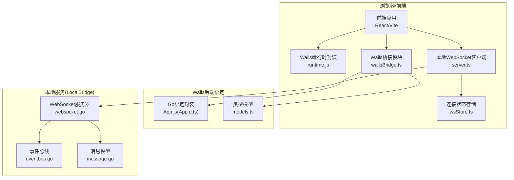
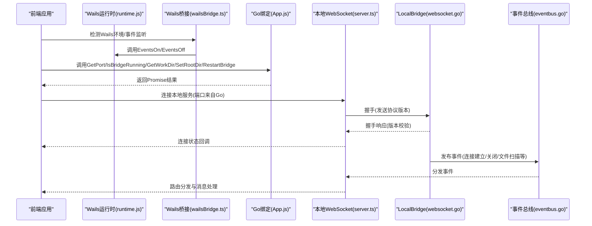
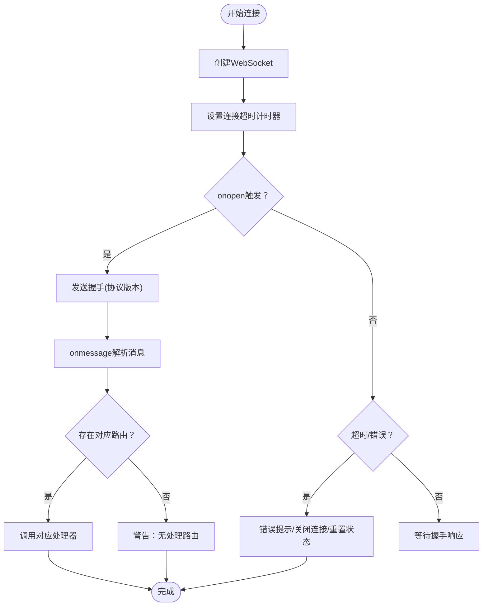
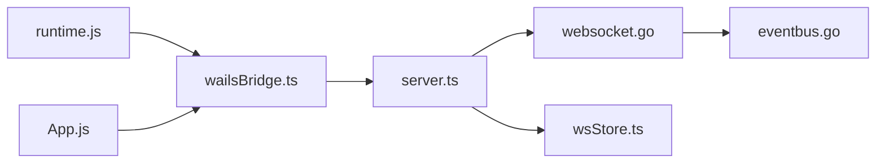

# 前端JavaScript API

<cite>
**本文引用的文件**
- [runtime.js](file://Extremer/frontend/wailsjs/runtime/runtime.js)
- [runtime.d.ts](file://Extremer/frontend/wailsjs/runtime/runtime.d.ts)
- [App.js](file://Extremer/frontend/wailsjs/go/main/App.js)
- [App.d.ts](file://Extremer/frontend/wailsjs/go/main/App.d.ts)
- [models.ts](file://Extremer/frontend/wailsjs/go/models.ts)
- [wailsBridge.ts](file://src/utils/wailsBridge.ts)
- [server.ts](file://src/services/server.ts)
- [type.ts](file://src/services/type.ts)
- [BaseProtocol.ts](file://src/services/protocols/BaseProtocol.ts)
- [websocket.go](file://LocalBridge/internal/server/websocket.go)
- [eventbus.go](file://LocalBridge/internal/eventbus/eventbus.go)
- [message.go](file://LocalBridge/pkg/models/message.go)
- [wsStore.ts](file://src/stores/wsStore.ts)
</cite>

## 目录
1. [简介](#简介)
2. [项目结构](#项目结构)
3. [核心组件](#核心组件)
4. [架构总览](#架构总览)
5. [详细组件分析](#详细组件分析)
6. [依赖分析](#依赖分析)
7. [性能考虑](#性能考虑)
8. [故障排查指南](#故障排查指南)
9. [结论](#结论)
10. [附录](#附录)

## 简介
本文件面向MaaPipelineEditor前端开发者，系统性梳理并说明以下内容：
- Wails运行时API：窗口控制、系统集成、文件操作、剪贴板等能力的封装与使用方式
- Go后端绑定接口：方法调用、参数传递、返回值处理、错误捕获与环境检测
- 事件监听系统：WebSocket事件、本地事件、自定义事件的注册与处理
- 异步调用模式：Promise处理、回调函数、超时控制等
- 类型定义与接口规范：TypeScript声明文件、数据模型定义、泛型使用
- 完整的JavaScript调用示例、错误处理方案与性能优化建议

## 项目结构
前端与Wails运行时及本地服务的关系如下图所示：

**图表来源**
- [runtime.js:1-242](file://Extremer/frontend/wailsjs/runtime/runtime.js#L1-L242)
- [App.js:1-52](file://Extremer/frontend/wailsjs/go/main/App.js#L1-L52)
- [server.ts:1-373](file://src/services/server.ts#L1-L373)
- [websocket.go:1-179](file://LocalBridge/internal/server/websocket.go#L1-L179)
- [eventbus.go:1-83](file://LocalBridge/internal/eventbus/eventbus.go#L1-L83)
- [message.go:1-126](file://LocalBridge/pkg/models/message.go#L1-L126)
- [wsStore.ts:1-24](file://src/stores/wsStore.ts#L1-L24)

**章节来源**
- [runtime.js:1-242](file://Extremer/frontend/wailsjs/runtime/runtime.js#L1-L242)
- [App.js:1-52](file://Extremer/frontend/wailsjs/go/main/App.js#L1-L52)
- [server.ts:1-373](file://src/services/server.ts#L1-L373)

## 核心组件
- Wails运行时API封装：提供日志、事件、窗口、屏幕、剪贴板、拖拽、环境信息、应用生命周期等能力的统一入口
- Wails Go绑定封装：暴露后端方法（如获取端口、工作目录、重启桥接等），以Promise形式返回
- 本地WebSocket客户端：负责与LocalBridge建立WebSocket连接、握手校验、消息路由与错误处理
- 事件总线与消息模型：LocalBridge内部事件分发与消息格式定义
- 连接状态存储：前端Zustand状态管理，维护连接/连接中状态

**章节来源**
- [runtime.js:1-242](file://Extremer/frontend/wailsjs/runtime/runtime.js#L1-L242)
- [App.js:1-52](file://Extremer/frontend/wailsjs/go/main/App.js#L1-L52)
- [server.ts:1-373](file://src/services/server.ts#L1-L373)
- [websocket.go:1-179](file://LocalBridge/internal/server/websocket.go#L1-L179)
- [eventbus.go:1-83](file://LocalBridge/internal/eventbus/eventbus.go#L1-L83)
- [message.go:1-126](file://LocalBridge/pkg/models/message.go#L1-L126)
- [wsStore.ts:1-24](file://src/stores/wsStore.ts#L1-L24)

## 架构总览
下图展示从前端到后端的完整调用链路与交互时序。

**图表来源**
- [runtime.js:1-242](file://Extremer/frontend/wailsjs/runtime/runtime.js#L1-L242)
- [wailsBridge.ts:1-197](file://src/utils/wailsBridge.ts#L1-L197)
- [App.js:1-52](file://Extremer/frontend/wailsjs/go/main/App.js#L1-L52)
- [server.ts:1-373](file://src/services/server.ts#L1-L373)
- [websocket.go:1-179](file://LocalBridge/internal/server/websocket.go#L1-L179)
- [eventbus.go:1-83](file://LocalBridge/internal/eventbus/eventbus.go#L1-L83)

## 详细组件分析

### Wails运行时API（窗口/系统/剪贴板/事件）
- 日志：提供多级别日志输出，便于前端侧调试与问题定位
- 事件：支持一次性、多次、全部取消监听；可发射自定义事件
- 窗口：标题、尺寸、位置、最小/最大/正常/全屏、置顶、主题、背景色、隐藏显示等
- 屏幕：查询多显示器信息
- 浏览器：打开系统默认浏览器
- 环境：平台、架构、构建类型等信息
- 应用生命周期：退出、隐藏、显示
- 剪贴板：文本读取与设置（返回Promise）
- 拖拽：监听文件拖放事件（坐标+路径数组）

使用要点：
- 事件监听返回取消函数，便于组件卸载时清理
- 窗口尺寸、位置、状态查询返回Promise，注意异步处理
- 拖拽回调参数顺序为(x, y, paths)，需按序接收

**章节来源**
- [runtime.js:1-242](file://Extremer/frontend/wailsjs/runtime/runtime.js#L1-L242)
- [runtime.d.ts:1-249](file://Extremer/frontend/wailsjs/runtime/runtime.d.ts#L1-L249)

### Wails Go绑定接口（后端方法）
- 方法清单：检查更新、获取日志/工作目录、获取端口、获取版本、打开目录、重启桥接、设置根目录等
- 返回值：均为Promise，便于在前端以async/await或then/catch处理
- 参数：根据方法签名传入必要参数（如SetRootDir需要字符串路径）
- 错误捕获：调用前建议检测Wails环境，调用时try/catch包裹，避免未定义异常

典型调用路径：
- 检测环境 -> 调用Go方法 -> Promise解析 -> 成功/失败分支处理

**章节来源**
- [App.js:1-52](file://Extremer/frontend/wailsjs/go/main/App.js#L1-L52)
- [App.d.ts:1-28](file://Extremer/frontend/wailsjs/go/main/App.d.ts#L1-L28)
- [models.ts:1-28](file://Extremer/frontend/wailsjs/go/models.ts#L1-L28)

### 事件监听系统（WebSocket/本地事件/自定义事件）
- 自定义事件（Wails运行时）：通过EventsOn/EventsOnce/EventsOff/EventsOffAll进行注册与注销
- 本地事件（LocalBridge）：通过事件总线发布/订阅，前端通过WebSocket路由接收
- 事件数据：Wails事件回调的第一个参数即为事件数据；本地事件遵循Message结构{path, data}

最佳实践：
- 在组件挂载时注册，在卸载时调用取消函数或EventsOffAll
- 对于一次性事件使用EventsOnce，避免重复监听
- 本地事件需严格匹配path路由，否则视为无处理

**章节来源**
- [runtime.js:1-242](file://Extremer/frontend/wailsjs/runtime/runtime.js#L1-L242)
- [server.ts:1-373](file://src/services/server.ts#L1-L373)
- [eventbus.go:1-83](file://LocalBridge/internal/eventbus/eventbus.go#L1-L83)
- [message.go:1-126](file://LocalBridge/pkg/models/message.go#L1-L126)

### 异步调用模式（Promise/回调/超时）
- Promise：Go绑定与运行时多数API返回Promise，推荐使用async/await
- 回调：部分运行时API接受回调（如事件监听），需返回取消函数
- 超时控制：本地WebSocket连接设置固定超时时间，onerror/onclose统一处理

超时与错误处理流程：

**图表来源**
- [server.ts:104-251](file://src/services/server.ts#L104-L251)

**章节来源**
- [server.ts:1-373](file://src/services/server.ts#L1-L373)

### 类型定义与接口规范（TypeScript）
- 运行时类型：Position/Size/Screen/EnvironmentInfo等基础类型
- 运行时函数：EventsOn/EventsOff/Window*等函数签名与返回值
- Go绑定类型：各方法返回Promise<T>，如GetPort返回number，SetRootDir返回void
- 本地消息模型：Message、HandshakeRequest/Response、文件/日志/错误等数据结构
- 协议抽象：BaseProtocol定义协议名称、版本与注册/注销流程

使用建议：
- 使用App.d.ts与runtime.d.ts提供的签名进行静态检查
- 本地消息路由使用SystemRoutes常量，避免硬编码
- 协议扩展时继承BaseProtocol并实现register/handleMessage

**章节来源**
- [runtime.d.ts:1-249](file://Extremer/frontend/wailsjs/runtime/runtime.d.ts#L1-L249)
- [App.d.ts:1-28](file://Extremer/frontend/wailsjs/go/main/App.d.ts#L1-L28)
- [type.ts:1-28](file://src/services/type.ts#L1-L28)
- [BaseProtocol.ts:1-40](file://src/services/protocols/BaseProtocol.ts#L1-L40)
- [message.go:1-126](file://LocalBridge/pkg/models/message.go#L1-L126)

### JavaScript调用示例与错误处理
- 环境检测与事件监听
  - 使用isWailsEnvironment判断运行时是否存在
  - 使用onWailsEvent注册事件，返回取消函数；offWailsEvent取消指定事件
- Go绑定调用
  - getWailsPort/IsBridgeRunning/getWorkDir/setRootDir/restartBridge均返回Promise
  - 建议在调用前检测环境，调用时try/catch，并在失败时记录日志
- 本地WebSocket连接
  - setPort后connect()发起连接；onStatus/onConnecting注册状态回调
  - send()发送消息时需检查连接状态与返回值
  - 超时与错误统一通过onerror/onclose处理，提示用户并引导文档

错误处理策略：
- 网络/协议错误：显示友好提示，引导用户检查本地服务状态与端口
- 运行时未就绪：延迟重试或降级处理
- 事件泄漏：确保组件卸载时调用取消函数

**章节来源**
- [wailsBridge.ts:1-197](file://src/utils/wailsBridge.ts#L1-L197)
- [server.ts:1-373](file://src/services/server.ts#L1-L373)

## 依赖分析
- 前端依赖关系
  - runtime.js与App.js分别提供运行时与Go绑定的封装
  - wailsBridge.ts聚合运行时与Go绑定，提供统一的环境检测与错误处理
  - server.ts负责WebSocket连接、握手与消息路由
  - wsStore.ts提供连接状态的全局存储
- 后端依赖关系
  - websocket.go提供WebSocket服务器与连接管理
  - eventbus.go提供事件总线与事件分发
  - message.go定义消息模型与协议版本

**图表来源**
- [runtime.js:1-242](file://Extremer/frontend/wailsjs/runtime/runtime.js#L1-L242)
- [App.js:1-52](file://Extremer/frontend/wailsjs/go/main/App.js#L1-L52)
- [wailsBridge.ts:1-197](file://src/utils/wailsBridge.ts#L1-L197)
- [server.ts:1-373](file://src/services/server.ts#L1-L373)
- [websocket.go:1-179](file://LocalBridge/internal/server/websocket.go#L1-L179)
- [eventbus.go:1-83](file://LocalBridge/internal/eventbus/eventbus.go#L1-L83)
- [wsStore.ts:1-24](file://src/stores/wsStore.ts#L1-L24)

**章节来源**
- [runtime.js:1-242](file://Extremer/frontend/wailsjs/runtime/runtime.js#L1-L242)
- [App.js:1-52](file://Extremer/frontend/wailsjs/go/main/App.js#L1-L52)
- [wailsBridge.ts:1-197](file://src/utils/wailsBridge.ts#L1-L197)
- [server.ts:1-373](file://src/services/server.ts#L1-L373)
- [websocket.go:1-179](file://LocalBridge/internal/server/websocket.go#L1-L179)
- [eventbus.go:1-83](file://LocalBridge/internal/eventbus/eventbus.go#L1-L83)
- [wsStore.ts:1-24](file://src/stores/wsStore.ts#L1-L24)

## 性能考虑
- 事件监听去抖：对高频事件（如窗口大小变化）采用节流/去抖
- 连接复用：避免重复创建WebSocket实例，优先使用单例localServer
- 路由缓存：消息路由表使用Map，减少查找成本
- 资源释放：组件卸载时及时取消事件监听与连接，防止内存泄漏
- 错误快速失败：网络错误与超时尽早返回，避免无效重试

## 故障排查指南
- 无法连接本地服务
  - 检查端口是否正确（通过Go绑定获取端口）
  - 查看连接超时与错误回调，确认本地服务是否启动
  - 核对协议版本，握手失败会导致连接被主动断开
- 事件未触发
  - 确认事件名称与监听方式一致（一次性/多次）
  - 组件卸载后是否调用了取消函数
- 剪贴板/窗口API无效
  - 确认运行时存在（isWailsEnvironment）
  - 某些平台限制（如主题设置仅Windows有效）

**章节来源**
- [server.ts:1-373](file://src/services/server.ts#L1-L373)
- [wailsBridge.ts:1-197](file://src/utils/wailsBridge.ts#L1-L197)

## 结论
本文档从运行时API、后端绑定、事件系统、异步模式、类型规范与工程实践六个维度，系统阐述了MaaPipelineEditor前端JavaScript API的设计与使用。建议在实际开发中：
- 以wailsBridge.ts为统一入口，集中处理环境检测与错误
- 以server.ts为WebSocket通信中心，严格遵循协议版本与路由
- 以TypeScript声明文件为准绳，确保类型安全与可维护性
- 重视事件与连接的生命周期管理，避免泄漏与抖动

## 附录
- 常用API速查
  - 运行时：日志、事件、窗口、屏幕、剪贴板、拖拽、环境、应用生命周期
  - Go绑定：端口、工作目录、版本、桥接状态、重启、根目录设置
  - 本地服务：握手、路由注册、消息发送、连接状态