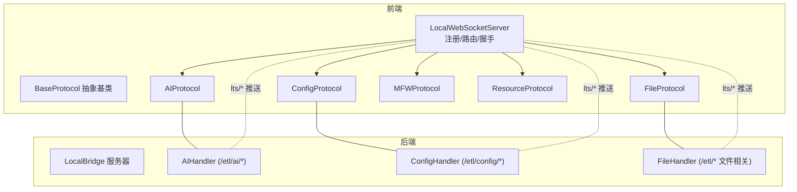
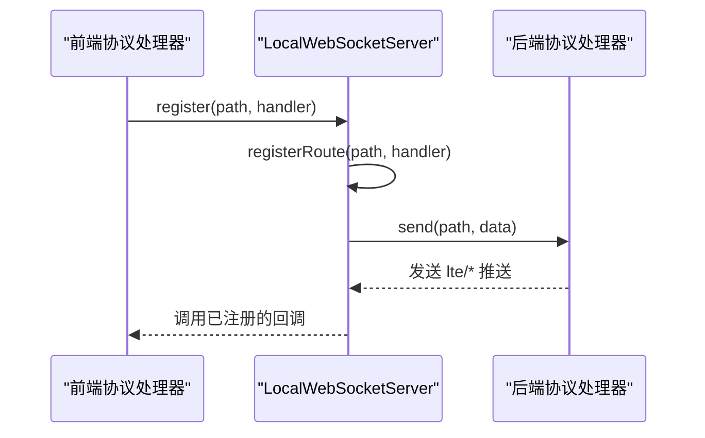
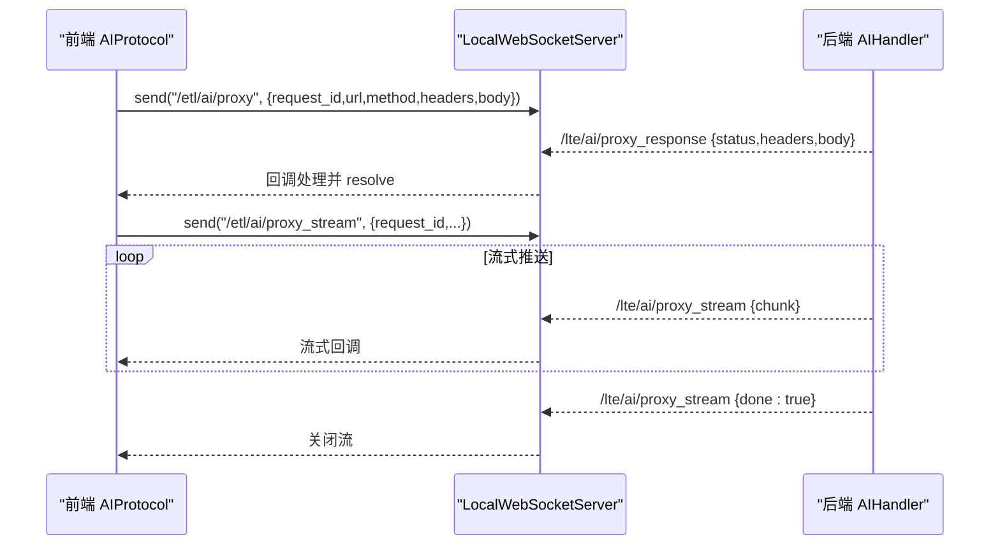
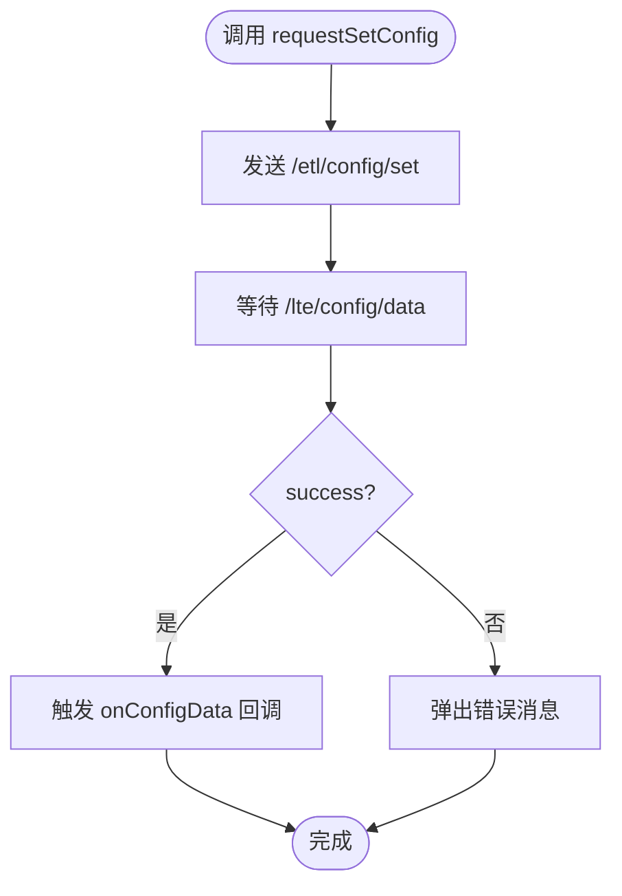
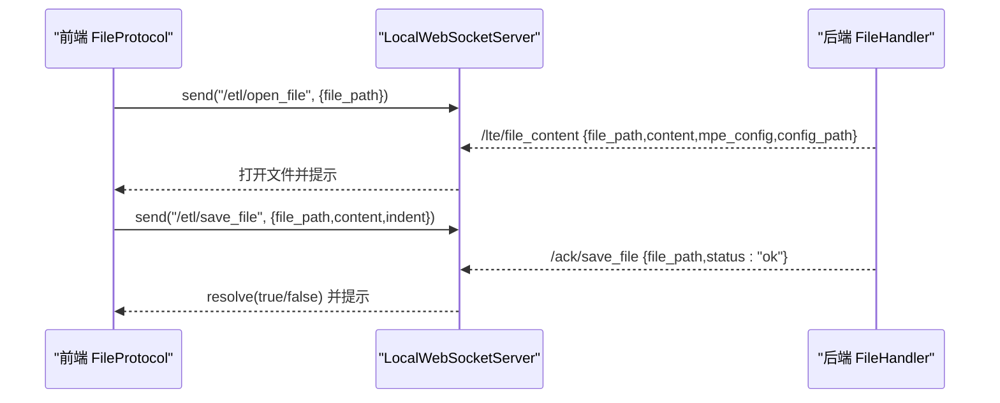
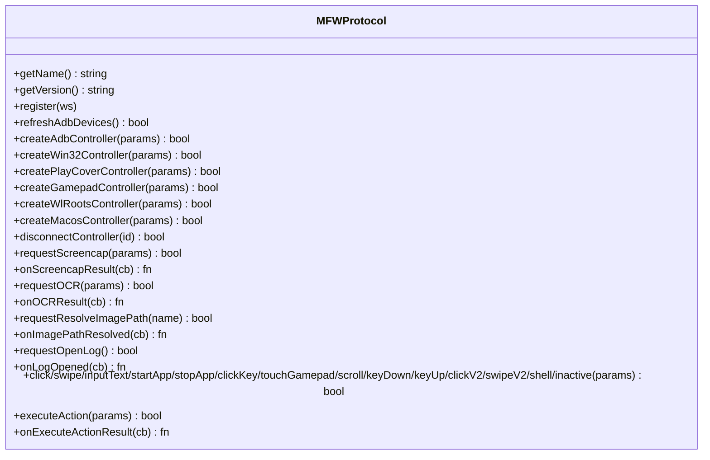
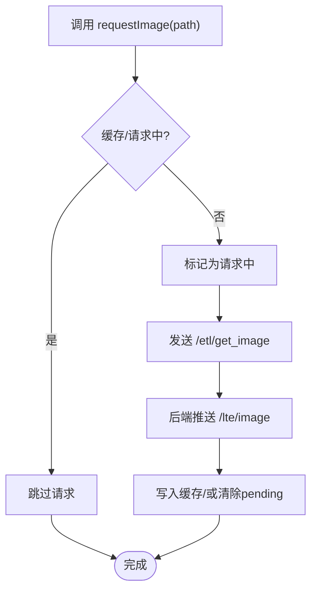
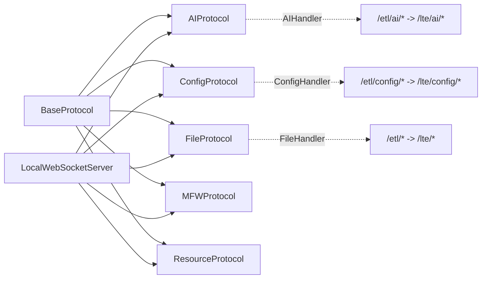

# 协议处理器

<cite>
**本文档引用的文件**
- [BaseProtocol.ts](file://src/services/protocols/BaseProtocol.ts)
- [AIProtocol.ts](file://src/services/protocols/AIProtocol.ts)
- [ConfigProtocol.ts](file://src/services/protocols/ConfigProtocol.ts)
- [FileProtocol.ts](file://src/services/protocols/FileProtocol.ts)
- [MFWProtocol.ts](file://src/services/protocols/MFWProtocol.ts)
- [ResourceProtocol.ts](file://src/services/protocols/ResourceProtocol.ts)
- [index.ts](file://src/services/protocols/index.ts)
- [server.ts](file://src/services/server.ts)
- [handler.go（AI）](file://LocalBridge/internal/protocol/ai/handler.go)
- [handler.go（配置）](file://LocalBridge/internal/protocol/config/handler.go)
- [file_handler.go（文件）](file://LocalBridge/internal/protocol/file/file_handler.go)
- [message.go（模型）](file://LocalBridge/pkg/models/message.go)
- [file.go（模型）](file://LocalBridge/pkg/models/file.go)
- [mfw.go（模型）](file://LocalBridge/pkg/models/mfw.go)
- [resource.go（模型）](file://LocalBridge/pkg/models/resource.go)
</cite>

## 目录
1. [简介](#简介)
2. [项目结构](#项目结构)
3. [核心组件](#核心组件)
4. [架构总览](#架构总览)
5. [详细组件分析](#详细组件分析)
6. [依赖关系分析](#依赖关系分析)
7. [性能考量](#性能考量)
8. [故障排查指南](#故障排查指南)
9. [结论](#结论)
10. [附录](#附录)

## 简介
本文件为“协议处理器”的完整参考文档，覆盖前端协议处理器与后端协议处理器的接口规范、消息格式、参数定义、返回值规范以及生命周期管理。重点分析以下处理器：
- AI协议：代理HTTP请求，支持非流式与流式响应
- 配置协议：获取/设置/重载后端配置
- 文件协议：打开/保存/创建/刷新文件列表，监听文件变更
- MFW协议：设备发现与控制器管理、输入控制、截图/OCR等
- 资源协议：资源包与图片列表、图片加载与缓存

同时阐述协议处理器的注册机制、生命周期管理，并提供扩展与自定义处理器的开发指南。

## 项目结构
前端协议处理器位于 src/services/protocols，统一继承 BaseProtocol 并通过 LocalWebSocketServer 注册路由；后端协议处理器位于 LocalBridge/internal/protocol 下，对应处理前端发送的 etl/* 路由请求，并通过 WebSocket 回推 lte/* 路由。

图表来源
- [server.ts:22-387](file://src/services/server.ts#L22-L387)
- [BaseProtocol.ts:7-39](file://src/services/protocols/BaseProtocol.ts#L7-L39)
- [AIProtocol.ts:8-32](file://src/services/protocols/AIProtocol.ts#L8-L32)
- [ConfigProtocol.ts:46-70](file://src/services/protocols/ConfigProtocol.ts#L46-L70)
- [FileProtocol.ts:16-68](file://src/services/protocols/FileProtocol.ts#L16-L68)
- [MFWProtocol.ts:18-115](file://src/services/protocols/MFWProtocol.ts#L18-L115)
- [ResourceProtocol.ts:13-36](file://src/services/protocols/ResourceProtocol.ts#L13-L36)
- [handler.go（AI）:32-53](file://LocalBridge/internal/protocol/ai/handler.go#L32-L53)
- [handler.go（配置）:21-47](file://LocalBridge/internal/protocol/config/handler.go#L21-L47)
- [file_handler.go（文件）:38-46](file://LocalBridge/internal/protocol/file/file_handler.go#L38-L46)

章节来源
- [server.ts:22-387](file://src/services/server.ts#L22-L387)
- [index.ts:1-6](file://src/services/protocols/index.ts#L1-L6)

## 核心组件
- BaseProtocol：抽象基类，定义协议名称、版本、注册/注销、消息入口等
- LocalWebSocketServer：负责连接、握手、路由注册、消息发送与状态广播
- 各协议处理器：继承 BaseProtocol，注册各自路由，处理后端推送与对外暴露API

章节来源
- [BaseProtocol.ts:7-39](file://src/services/protocols/BaseProtocol.ts#L7-L39)
- [server.ts:22-387](file://src/services/server.ts#L22-L387)

## 架构总览
前端协议处理器在初始化时统一注册到 LocalWebSocketServer，后端协议处理器在 LocalBridge 中根据 etl/* 路由进行处理，并通过 lte/* 路由回推给前端。

图表来源
- [server.ts:97-106](file://src/services/server.ts#L97-L106)
- [server.ts:290-304](file://src/services/server.ts#L290-L304)
- [handler.go（AI）:37-53](file://LocalBridge/internal/protocol/ai/handler.go#L37-L53)
- [handler.go（配置）:26-46](file://LocalBridge/internal/protocol/config/handler.go#L26-L46)
- [file_handler.go（文件）:49-63](file://LocalBridge/internal/protocol/file/file_handler.go#L49-L63)

## 详细组件分析

### AI协议（AIProtocol）
- 功能
  - 代理HTTP请求，绕过浏览器CORS限制
  - 支持非流式代理与流式代理（SSE风格）
  - 提供Promise与ReadableStream两种调用方式
- 注册路由
  - /lte/ai/proxy_response（非流式响应）
  - /lte/ai/proxy_stream（流式响应）
- 发送路由
  - /etl/ai/proxy（非流式）
  - /etl/ai/proxy_stream（流式）
  - /etl/ai/proxy_cancel（取消流式请求）
- 方法与参数
  - sendProxyRequest(request)
    - 参数：url/method/headers/body
    - 返回：Promise<{status, headers, body}>
  - sendStreamProxyRequest(request)
    - 参数：同上
    - 返回：{stream: ReadableStream, requestId}
- 消息格式
  - 请求体携带 request_id，后端回推相同 request_id
  - 非流式：/lte/ai/proxy_response 包含 status/headers/body 或 error
  - 流式：/lte/ai/proxy_stream 逐行推送 chunk，最后 done=true
- 生命周期
  - 注册时绑定两个接收路由
  - 超时控制：非流式60s，流式120s
  - 取消：调用 /etl/ai/proxy_cancel

图表来源
- [AIProtocol.ts:20-58](file://src/services/protocols/AIProtocol.ts#L20-L58)
- [AIProtocol.ts:104-117](file://src/services/protocols/AIProtocol.ts#L104-L117)
- [AIProtocol.ts:163-175](file://src/services/protocols/AIProtocol.ts#L163-L175)
- [handler.go（AI）:42-53](file://LocalBridge/internal/protocol/ai/handler.go#L42-L53)
- [handler.go（AI）:115-124](file://LocalBridge/internal/protocol/ai/handler.go#L115-L124)
- [handler.go（AI）:204-230](file://LocalBridge/internal/protocol/ai/handler.go#L204-L230)

章节来源
- [AIProtocol.ts:8-187](file://src/services/protocols/AIProtocol.ts#L8-L187)
- [handler.go（AI）:16-279](file://LocalBridge/internal/protocol/ai/handler.go#L16-L279)

### 配置协议（ConfigProtocol）
- 功能
  - 获取后端配置、设置配置、重载配置
  - 推送配置数据与重载结果
- 注册路由
  - /lte/config/data（配置数据推送）
  - /lte/config/reload（重载响应）
- 发送路由
  - /etl/config/get（获取配置）
  - /etl/config/set（设置配置）
  - /etl/config/reload（重载配置）
- 数据结构
  - BackendConfig：包含 server、file、log、maafw 等子配置
  - ConfigResponse：success/config/config_path/message
- 方法与返回
  - requestGetConfig()/requestSetConfig()/requestReload()：返回布尔发送结果
  - onConfigData()/onReload()：注册回调，返回注销函数

图表来源
- [ConfigProtocol.ts:128-161](file://src/services/protocols/ConfigProtocol.ts#L128-L161)
- [ConfigProtocol.ts:60-70](file://src/services/protocols/ConfigProtocol.ts#L60-L70)
- [ConfigProtocol.ts:80-98](file://src/services/protocols/ConfigProtocol.ts#L80-L98)
- [handler.go（配置）:32-44](file://LocalBridge/internal/protocol/config/handler.go#L32-L44)
- [handler.go（配置）:60-68](file://LocalBridge/internal/protocol/config/handler.go#L60-L68)

章节来源
- [ConfigProtocol.ts:46-196](file://src/services/protocols/ConfigProtocol.ts#L46-L196)
- [handler.go（配置）:12-237](file://LocalBridge/internal/protocol/config/handler.go#L12-L237)
- [message.go（模型）:105-115](file://LocalBridge/pkg/models/message.go#L105-L115)

### 文件协议（FileProtocol）
- 功能
  - 打开文件、保存文件、分离保存、创建文件
  - 刷新文件列表、监听文件变更
  - 保存确认与自动重载策略
- 注册路由
  - /lte/file_list（文件列表推送）
  - /lte/file_content（文件内容推送）
  - /lte/file_changed（文件变化通知）
  - /ack/save_file、/ack/save_separated、/ack/create_file（保存/创建确认）
- 发送路由
  - /etl/open_file、/etl/save_file、/etl/save_separated、/etl/create_file、/etl/refresh_file_list
- 交互流程
  - 打开文件：后端返回 /lte/file_content，前端打开并提示
  - 保存文件：前端发送 /etl/save_file，后端回推 /ack/save_file
  - 文件变更：后端推送 /lte/file_changed，前端弹窗或自动重载
- 保存确认机制
  - waitForSaveAck：静态方法，返回 Promise 等待确认
  - 超时 10s，断开连接时清理回调

图表来源
- [FileProtocol.ts:338-347](file://src/services/protocols/FileProtocol.ts#L338-L347)
- [FileProtocol.ts:109-141](file://src/services/protocols/FileProtocol.ts#L109-L141)
- [FileProtocol.ts:237-257](file://src/services/protocols/FileProtocol.ts#L237-L257)
- [file_handler.go（文件）:67-137](file://LocalBridge/internal/protocol/file/file_handler.go#L67-L137)
- [file_handler.go（文件）:139-176](file://LocalBridge/internal/protocol/file/file_handler.go#L139-L176)
- [file_handler.go（文件）:240-271](file://LocalBridge/internal/protocol/file/file_handler.go#L240-L271)

章节来源
- [FileProtocol.ts:16-581](file://src/services/protocols/FileProtocol.ts#L16-L581)
- [file_handler.go（文件）:14-358](file://LocalBridge/internal/protocol/file/file_handler.go#L14-L358)
- [message.go（模型）:31-44](file://LocalBridge/pkg/models/message.go#L31-L44)
- [message.go（模型）:77-94](file://LocalBridge/pkg/models/message.go#L77-L94)

### MFW协议（MFWProtocol）
- 功能
  - 设备发现：ADB、Win32窗口、WlRoots套接字
  - 控制器管理：创建/断开、状态监听
  - 输入控制：点击、滑动、输入文本、按键、滚动、手柄触摸
  - 工具能力：截图、OCR、图片路径解析、打开日志、执行动作
- 注册路由
  - /lte/mfw/adb_devices、/lte/mfw/win32_windows、/lte/mfw/wlroots_sockets
  - /lte/mfw/controller_created、/lte/mfw/controller_status
  - /lte/mfw/screencap_result、/lte/utility/ocr_result、/lte/utility/image_path_resolved、/lte/utility/log_opened、/lte/mfw/execute_action_result
- 发送路由
  - 设备刷新：/etl/mfw/refresh_*_devices
  - 控制器创建：/etl/mfw/create_*_controller
  - 控制器操作：/etl/mfw/controller_*、/etl/mfw/controller_*_v2
  - 工具：/etl/utility/ocr_recognize、/etl/utility/resolve_image_path、/etl/utility/open_log
  - 执行动作：/etl/mfw/execute_action
- 回调注册
  - onScreencapResult/onOCRResult/onImagePathResolved/onLogOpened/onExecuteActionResult

图表来源
- [MFWProtocol.ts:18-115](file://src/services/protocols/MFWProtocol.ts#L18-L115)
- [MFWProtocol.ts:332-515](file://src/services/protocols/MFWProtocol.ts#L332-L515)
- [MFWProtocol.ts:565-628](file://src/services/protocols/MFWProtocol.ts#L565-L628)
- [MFWProtocol.ts:633-701](file://src/services/protocols/MFWProtocol.ts#L633-L701)
- [MFWProtocol.ts:708-943](file://src/services/protocols/MFWProtocol.ts#L708-L943)

章节来源
- [MFWProtocol.ts:18-945](file://src/services/protocols/MFWProtocol.ts#L18-L945)
- [mfw.go（模型）:5-260](file://LocalBridge/pkg/models/mfw.go#L5-L260)

### 资源协议（ResourceProtocol）
- 功能
  - 获取资源包列表、图片列表
  - 拉取单张或多张图片，带缓存与去重
- 注册路由
  - /lte/resource_bundles、/lte/image、/lte/images、/lte/image_list
- 发送路由
  - /etl/refresh_resources、/etl/get_image、/etl/get_images、/etl/get_image_list
- 图片加载策略
  - 若已缓存或正在请求，则跳过重复请求
  - 成功后写入缓存，失败则清除 pending 标记

图表来源
- [ResourceProtocol.ts:149-173](file://src/services/protocols/ResourceProtocol.ts#L149-L173)
- [ResourceProtocol.ts:227-240](file://src/services/protocols/ResourceProtocol.ts#L227-L240)
- [ResourceProtocol.ts:46-70](file://src/services/protocols/ResourceProtocol.ts#L46-L70)
- [ResourceProtocol.ts:76-121](file://src/services/protocols/ResourceProtocol.ts#L76-L121)

章节来源
- [ResourceProtocol.ts:13-271](file://src/services/protocols/ResourceProtocol.ts#L13-L271)
- [resource.go（模型）:16-67](file://LocalBridge/pkg/models/resource.go#L16-L67)

## 依赖关系分析
- 前端依赖
  - BaseProtocol：所有协议处理器的父类
  - LocalWebSocketServer：统一路由注册、消息发送、状态管理
  - 各协议处理器：按需注册接收与发送路由
- 后端依赖
  - 各协议处理器：实现 GetRoutePrefix 与 Handle，处理 etl/* 请求并回推 lte/*
  - 模型定义：message.go、file.go、mfw.go、resource.go 提供消息结构

图表来源
- [BaseProtocol.ts:7-39](file://src/services/protocols/BaseProtocol.ts#L7-L39)
- [server.ts:348-387](file://src/services/server.ts#L348-L387)
- [handler.go（AI）:32-53](file://LocalBridge/internal/protocol/ai/handler.go#L32-L53)
- [handler.go（配置）:21-47](file://LocalBridge/internal/protocol/config/handler.go#L21-L47)
- [file_handler.go（文件）:38-63](file://LocalBridge/internal/protocol/file/file_handler.go#L38-L63)

章节来源
- [index.ts:1-6](file://src/services/protocols/index.ts#L1-L6)
- [server.ts:348-387](file://src/services/server.ts#L348-L387)

## 性能考量
- 流式代理
  - 流式读取使用 Scanner 并增大缓冲区，避免长行阻塞
  - 定期发送 chunk 并在完成后发送 done=true，减少内存占用
- 文件保存确认
  - 采用静态 Map 存储回调，10s 超时，断开连接时统一清理
- 图片加载
  - 请求前检查缓存与 pending 状态，避免重复请求
  - 批量请求时过滤已缓存项，降低网络压力
- 控制器操作
  - V2系列接口支持接触点与压力，提升交互精度但需注意参数范围

## 故障排查指南
- 连接与握手
  - 前端握手失败会提示协议版本不匹配并断开连接
  - 连接超时与错误会弹出通知并引导查看文档
- AI代理
  - 非流式超时60s，流式超时120s；取消请求需发送 /etl/ai/proxy_cancel
  - 流式读取错误若包含“closed”，表示客户端主动取消
- 配置协议
  - 设置配置后需重载或重启服务以生效部分配置
- 文件协议
  - 保存失败会弹出错误；自动重载可通过配置开关启用
  - 断开连接时需清理等待中的保存回调
- 资源协议
  - 图片加载失败会清除 pending 标记，可再次请求
- MFW协议
  - 控制器断开会清空状态；创建失败会记录错误并清理设备信息

章节来源
- [server.ts:42-66](file://src/services/server.ts#L42-L66)
- [server.ts:131-163](file://src/services/server.ts#L131-L163)
- [server.ts:186-224](file://src/services/server.ts#L186-L224)
- [AIProtocol.ts:82-85](file://src/services/protocols/AIProtocol.ts#L82-L85)
- [AIProtocol.ts:150-155](file://src/services/protocols/AIProtocol.ts#L150-L155)
- [handler.go（AI）:214-231](file://LocalBridge/internal/protocol/ai/handler.go#L214-L231)
- [ConfigProtocol.ts:154-161](file://src/services/protocols/ConfigProtocol.ts#L154-L161)
- [FileProtocol.ts:573-579](file://src/services/protocols/FileProtocol.ts#L573-L579)
- [ResourceProtocol.ts:115-117](file://src/services/protocols/ResourceProtocol.ts#L115-L117)

## 结论
本协议体系通过统一的 LocalWebSocketServer 与 BaseProtocol 抽象，实现了前后端消息路由、状态管理与生命周期控制。各协议处理器职责清晰、接口一致，便于扩展与维护。建议在新增协议时遵循现有模式：定义前端处理器、实现后端处理器、注册路由、完善错误处理与超时控制。

## 附录

### 协议处理器注册与生命周期
- 初始化
  - 在应用启动时调用 initializeWebSocket，依次注册 ErrorProtocol、FileProtocol、MFWProtocol、ConfigProtocol、DebugProtocolClient、ResourceProtocol、LoggerProtocol、AIProtocol
- 注册机制
  - 协议处理器调用 register(ws)，传入 LocalWebSocketServer 实例
  - LocalWebSocketServer.registerRoute 注册接收路由
- 生命周期
  - 连接建立：握手成功后进入可用状态
  - 连接断开：清理控制器状态、断开连接、触发状态回调
  - 注销：调用 unregister 或销毁 LocalWebSocketServer

章节来源
- [server.ts:361-387](file://src/services/server.ts#L361-L387)
- [BaseProtocol.ts:29-31](file://src/services/protocols/BaseProtocol.ts#L29-L31)

### 开发新协议处理器指南
- 前端步骤
  - 新建类继承 BaseProtocol，实现 getName/getVersion/register/handleMessage
  - 在 server.ts 的 initializeWebSocket 中注册
  - 导出并在 index.ts 中导出
- 后端步骤
  - 在 LocalBridge/internal/protocol 下新建包，实现 GetRoutePrefix 与 Handle
  - 在 LocalBridge/internal/server/server.go 中注册路由前缀
  - 定义消息模型（可复用 pkg/models）
- 接口规范
  - etl/* 为前端发送路由，lte/* 为后端推送路由
  - 错误通过 /error 路由返回标准错误结构
  - 超时与取消：为长耗时操作提供超时与取消机制
- 示例参考
  - AI协议：非流式与流式代理
  - 配置协议：增删改查与重载
  - 文件协议：打开/保存/创建/刷新与变更监听
  - MFW协议：设备发现与控制器操作
  - 资源协议：资源包与图片加载

章节来源
- [BaseProtocol.ts:7-39](file://src/services/protocols/BaseProtocol.ts#L7-L39)
- [server.ts:348-387](file://src/services/server.ts#L348-L387)
- [handler.go（AI）:32-53](file://LocalBridge/internal/protocol/ai/handler.go#L32-L53)
- [handler.go（配置）:21-47](file://LocalBridge/internal/protocol/config/handler.go#L21-L47)
- [file_handler.go（文件）:38-63](file://LocalBridge/internal/protocol/file/file_handler.go#L38-L63)
- [message.go（模型）:9-14](file://LocalBridge/pkg/models/message.go#L9-L14)