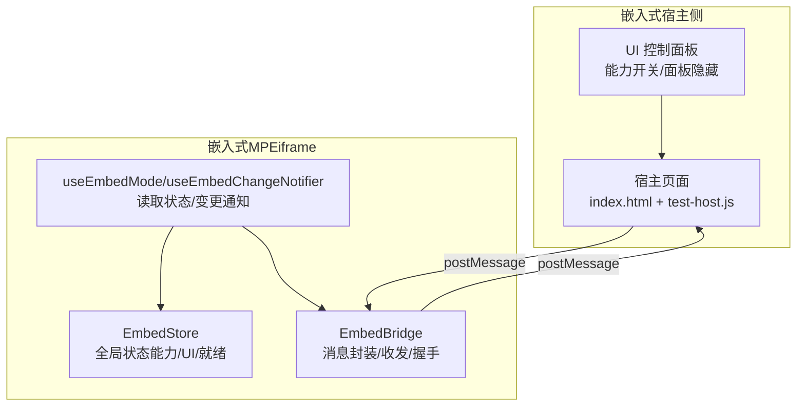
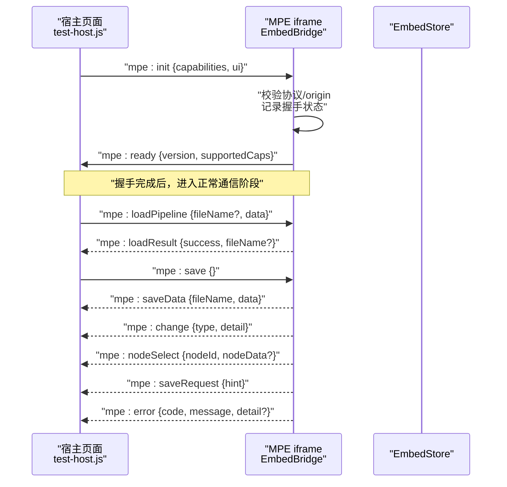
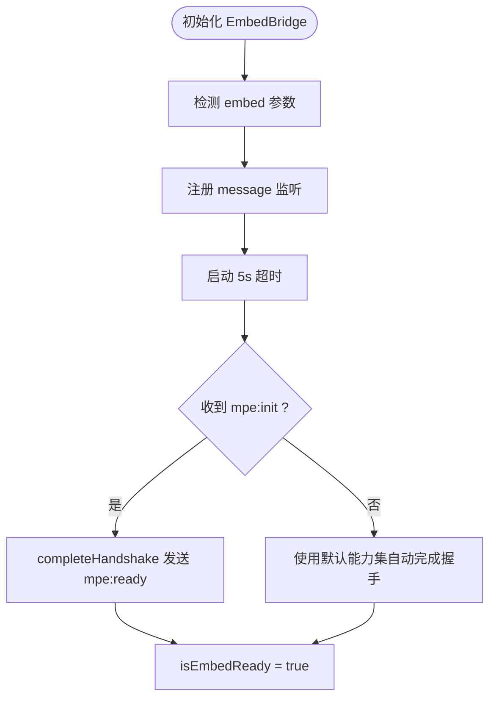
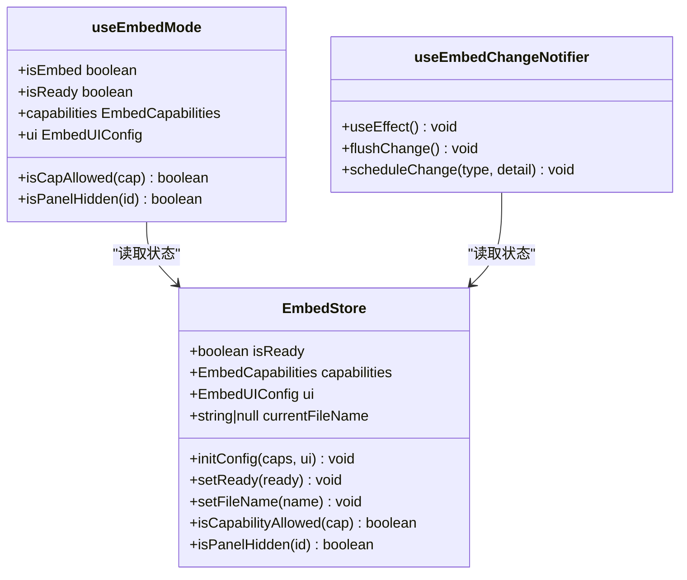
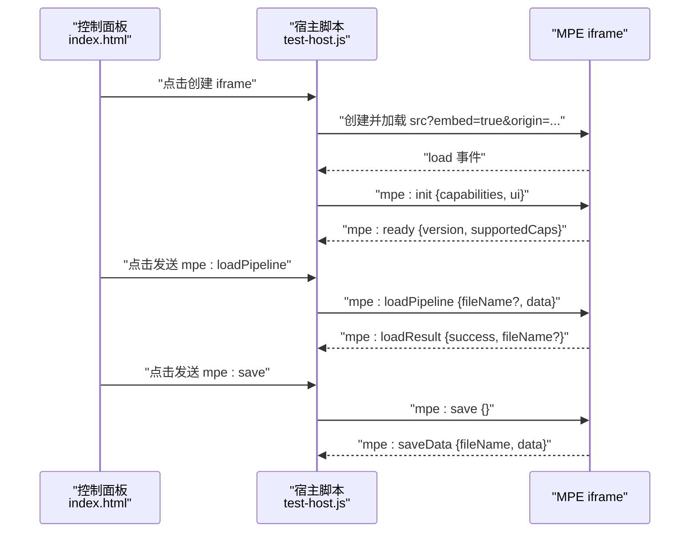
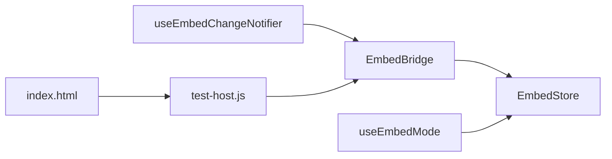

# 嵌入式API

<cite>
**本文引用的文件**
- [embedBridge.ts](file://src/utils/embedBridge.ts)
- [embedStore.ts](file://src/stores/embedStore.ts)
- [useEmbedMode.ts](file://src/hooks/useEmbedMode.ts)
- [useEmbedChangeNotifier.ts](file://src/hooks/useEmbedChangeNotifier.ts)
- [index.html](file://Iframe/index.html)
- [test-host.js](file://Iframe/test-host.js)
- [test-host.css](file://Iframe/test-host.css)
- [嵌入通信协议.md](file://docsite/docs/01.指南/95.开发与调试/20.Iframe 嵌入与通信.md)
- [开发者工具.md](file://docsite/docs/01.指南/95.开发与调试/05.开发者工具.md)
- [wails.json](file://Extremer/wails.json)
- [go.mod](file://Extremer/go.mod)
- [BaseProtocol.ts](file://src/services/protocols/BaseProtocol.ts)
- [ConfigProtocol.ts](file://src/services/protocols/ConfigProtocol.ts)
- [FileProtocol.ts](file://src/services/protocols/FileProtocol.ts)
- [MFWProtocol.ts](file://src/services/protocols/MFWProtocol.ts)
</cite>

## 目录
1. [简介](#简介)
2. [项目结构](#项目结构)
3. [核心组件](#核心组件)
4. [架构总览](#架构总览)
5. [详细组件分析](#详细组件分析)
6. [依赖关系分析](#依赖关系分析)
7. [性能考量](#性能考量)
8. [故障排查指南](#故障排查指南)
9. [结论](#结论)
10. [附录](#附录)

## 简介
本文件为 MaaPipelineEditor（MPE）嵌入式API的权威参考文档，聚焦于iframe嵌入模式下的消息桥接协议、能力控制与权限管理、UI配置与主题定制、生命周期与事件处理、跨域通信与安全策略，并提供最佳实践与示例集成路径。读者可基于本文档在宿主应用（如VSCode插件、Web IDE等）中将MPE以iframe方式无缝集成，实现流程编辑器的嵌入式使用。

## 项目结构
围绕嵌入式通信的核心代码主要分布在以下位置：
- 嵌入式桥接与状态：src/utils/embedBridge.ts、src/stores/embedStore.ts、src/hooks/useEmbedMode.ts、src/hooks/useEmbedChangeNotifier.ts
- 嵌入式测试宿主：Iframe/index.html、Iframe/test-host.js、Iframe/test-host.css
- 文档与协议说明：docsite/docs/01.指南/95.开发与调试/20.Iframe 嵌入与通信.md
- 本地服务协议（对比参考）：src/services/protocols/*.ts

图表来源
- [index.html:1-175](file://Iframe/index.html#L1-L175)
- [test-host.js:1-449](file://Iframe/test-host.js#L1-L449)
- [embedBridge.ts:1-282](file://src/utils/embedBridge.ts#L1-L282)
- [embedStore.ts:1-60](file://src/stores/embedStore.ts#L1-L60)
- [useEmbedMode.ts:1-30](file://src/hooks/useEmbedMode.ts#L1-L30)
- [useEmbedChangeNotifier.ts:1-136](file://src/hooks/useEmbedChangeNotifier.ts#L1-L136)

章节来源
- [嵌入通信协议.md:1-577](file://docsite/docs/01.指南/95.开发与调试/20.Iframe 嵌入与通信.md#L1-L577)
- [index.html:1-175](file://Iframe/index.html#L1-L175)
- [test-host.js:1-449](file://Iframe/test-host.js#L1-L449)

## 核心组件
- 消息桥接与握手
  - 协议常量与消息信封：协议标识、版本、类型、requestId、payload
  - 能力声明与UI配置：capabilities、ui
  - 环境检测与origin校验：embed参数、origin参数（标识符或URL）
  - 握手流程：宿主发送mpe:init，MPE回复mpe:ready，握手超时回退默认能力
- 全局状态与Hook
  - EmbedStore集中管理能力、UI、就绪状态、当前文件名
  - useEmbedMode提供便捷读取能力与UI配置
  - useEmbedChangeNotifier订阅流程变更并向宿主推送mpe:change与mpe:nodeSelect
- 测试宿主
  - 提供能力开关、UI隐藏面板、消息发送按钮、Pipeline JSON输入、实时日志与超时提示

章节来源
- [embedBridge.ts:1-282](file://src/utils/embedBridge.ts#L1-L282)
- [embedStore.ts:1-60](file://src/stores/embedStore.ts#L1-L60)
- [useEmbedMode.ts:1-30](file://src/hooks/useEmbedMode.ts#L1-L30)
- [useEmbedChangeNotifier.ts:1-136](file://src/hooks/useEmbedChangeNotifier.ts#L1-L136)
- [index.html:1-175](file://Iframe/index.html#L1-L175)
- [test-host.js:1-449](file://Iframe/test-host.js#L1-L449)

## 架构总览
嵌入式通信采用postMessage双向桥接，宿主与MPE通过统一的“mpe-embed”协议进行消息传递。MPE在iframe内运行，宿主负责创建iframe、发起握手、转发消息、处理响应与事件。

图表来源
- [test-host.js:253-427](file://Iframe/test-host.js#L253-L427)
- [embedBridge.ts:179-281](file://src/utils/embedBridge.ts#L179-L281)
- [embedStore.ts:1-60](file://src/stores/embedStore.ts#L1-L60)

章节来源
- [嵌入通信协议.md:63-86](file://docsite/docs/01.指南/95.开发与调试/20.Iframe 嵌入与通信.md#L63-L86)
- [test-host.js:1-449](file://Iframe/test-host.js#L1-L449)
- [embedBridge.ts:1-282](file://src/utils/embedBridge.ts#L1-L282)

## 详细组件分析

### 消息桥接与握手（EmbedBridge）
- 协议与消息格式
  - 协议标识："mpe-embed"
  - 版本：字符串，如"1.0.0"
  - 类型：消息类型，如"mpe:init"、"mpe:ready"
  - requestId：请求-响应匹配
  - payload：消息体
- 能力声明与UI配置
  - capabilities：readOnly、allowCopy、allowUndoRedo、allowAutoLayout、allowAI、allowSearch、allowCustomTemplate
  - ui：hideHeader、hideToolbar、hiddenPanels[]
- 环境检测与origin校验
  - URL参数embed=true判定嵌入环境
  - URL参数origin用于origin校验（以http开头则严格匹配event.origin，否则仅作日志标识）
- 握手流程
  - initEmbedBridge注册message监听，启动5秒握手超时
  - completeHandshake发送mpe:ready，携带version与supportedCaps
  - isEmbedReady查询就绪状态
- 消息收发
  - sendToParent发送消息至父窗口
  - onParentMessage/offParentMessage注册/移除处理器
  - dispatchMessage分发消息到对应处理器

图表来源
- [embedBridge.ts:179-281](file://src/utils/embedBridge.ts#L179-L281)

章节来源
- [embedBridge.ts:1-282](file://src/utils/embedBridge.ts#L1-L282)
- [嵌入通信协议.md:47-86](file://docsite/docs/01.指南/95.开发与调试/20.Iframe 嵌入与通信.md#L47-L86)

### 全局状态与Hook（EmbedStore/useEmbedMode）
- EmbedStore
  - 状态：isReady、capabilities、ui、currentFileName
  - 动作：initConfig、setReady、setFileName、isCapabilityAllowed、isPanelHidden
- useEmbedMode
  - 返回isEmbed、isReady、capabilities、ui、isCapAllowed、isPanelHidden
- useEmbedChangeNotifier
  - 订阅FlowStore节点/边/选中状态变化
  - nodes/edges变化：300ms防抖后发送mpe:change
  - selectedNodes变化：即时发送mpe:nodeSelect

图表来源
- [embedStore.ts:1-60](file://src/stores/embedStore.ts#L1-L60)
- [useEmbedMode.ts:1-30](file://src/hooks/useEmbedMode.ts#L1-L30)
- [useEmbedChangeNotifier.ts:1-136](file://src/hooks/useEmbedChangeNotifier.ts#L1-L136)

章节来源
- [embedStore.ts:1-60](file://src/stores/embedStore.ts#L1-L60)
- [useEmbedMode.ts:1-30](file://src/hooks/useEmbedMode.ts#L1-L30)
- [useEmbedChangeNotifier.ts:1-136](file://src/hooks/useEmbedChangeNotifier.ts#L1-L136)

### 宿主侧集成与测试（test-host）
- 宿主侧职责
  - 创建/销毁iframe
  - 发送mpe:init并等待mpe:ready
  - 发送mpe:loadPipeline、mpe:save、mpe:selectNode、mpe:focusNode、mpe:state
  - 监听mpe:ready、mpe:change、mpe:saveRequest、mpe:nodeSelect、mpe:error
  - 请求-响应超时处理（10秒）
- 测试宿主功能
  - 能力开关（复选框）
  - UI隐藏面板配置
  - Pipeline JSON输入与示例加载
  - 实时消息日志（颜色区分方向/类型）

图表来源
- [index.html:1-175](file://Iframe/index.html#L1-L175)
- [test-host.js:195-344](file://Iframe/test-host.js#L195-L344)

章节来源
- [index.html:1-175](file://Iframe/index.html#L1-L175)
- [test-host.js:1-449](file://Iframe/test-host.js#L1-L449)
- [嵌入通信协议.md:561-577](file://docsite/docs/01.指南/95.开发与调试/20.Iframe 嵌入与通信.md#L561-L577)

### 能力控制与权限管理
- 能力声明（capabilities）
  - readOnly：禁用编辑、过滤节点变更
  - allowCopy：允许复制/粘贴
  - allowUndoRedo：允许撤销/重做
  - allowAutoLayout：允许自动布局（禁用时点击触发mpe:error）
  - allowAI：显示AI搜索按钮
  - allowSearch：显示搜索面板
  - allowCustomTemplate：显示自定义模板面板
- 默认能力集（5秒超时回退）
  - readOnly=false、allowCopy=true、allowUndoRedo=true、allowAutoLayout=true、allowAI=false、allowSearch=true、allowCustomTemplate=true
- UI控制（ui）
  - hideHeader、hideToolbar
  - hiddenPanels[]：可隐藏面板ID（field、edge、search、file、config、ai-history、local-file、error、recognition-history、toolbar、logger、exploration）

章节来源
- [嵌入通信协议.md:219-294](file://docsite/docs/01.指南/95.开发与调试/20.Iframe 嵌入与通信.md#L219-L294)
- [embedBridge.ts:43-58](file://src/utils/embedBridge.ts#L43-L58)

### 生命周期与事件处理
- 生命周期
  - 宿主创建iframe → MPE检测embed=true → MPE等待mpe:init → 超时使用默认能力集 → 收到mpe:init → 发送mpe:ready → 正常通信 → 宿主销毁iframe（可选发送mpe:destroy）
- 事件处理
  - mpe:change：节点/边增删改，带detail（nodeId、edgeId、source/target、nodeCount、edgeCount）
  - mpe:nodeSelect：选中节点，带nodeId与nodeData
  - mpe:saveRequest：MPE主动请求保存（如Ctrl+S）
  - mpe:error：错误通知（如capability_denied、node_not_found）

章节来源
- [嵌入通信协议.md:305-218](file://docsite/docs/01.指南/95.开发与调试/20.Iframe 嵌入与通信.md#L305-L218)
- [useEmbedChangeNotifier.ts:1-136](file://src/hooks/useEmbedChangeNotifier.ts#L1-L136)

### 跨域通信与安全考虑
- Origin校验
  - 协议标识：protocol="mpe-embed"
  - 若origin参数以http开头：严格匹配event.origin
  - 若origin为标识符：仅记录日志，不阻断消息
- 版本协商
  - 握手时MPE在mpe:ready中声明协议版本（当前1.0.0）
  - 语义化版本：主版本不兼容、次版本向后兼容新增、修订版向后兼容修复
- VSCode WebView桥接
  - 通过acquireVsCodeApi()中继postMessage，iframe内使用window.parent.postMessage

章节来源
- [嵌入通信协议.md:334-351](file://docsite/docs/01.指南/95.开发与调试/20.Iframe 嵌入与通信.md#L334-L351)
- [embedBridge.ts:196-208](file://src/utils/embedBridge.ts#L196-L208)

### 本地服务协议（对比参考）
- BaseProtocol：协议模块基类，定义getName、getVersion、register、unregister、handleMessage
- ConfigProtocol：后端配置数据结构与路由（/lte/config/*、/etl/config/*）
- FileProtocol：文件列表、内容、变更、保存确认（/lte/file_*、/ack/save_*、/etl/*）
- MFWProtocol：MaaFramework设备与控制器、截图、OCR、日志、控制器操作等路由

章节来源
- [BaseProtocol.ts:1-40](file://src/services/protocols/BaseProtocol.ts#L1-L40)
- [ConfigProtocol.ts:1-197](file://src/services/protocols/ConfigProtocol.ts#L1-L197)
- [FileProtocol.ts:1-581](file://src/services/protocols/FileProtocol.ts#L1-L581)
- [MFWProtocol.ts:1-945](file://src/services/protocols/MFWProtocol.ts#L1-L945)

## 依赖关系分析
- 组件耦合
  - EmbedBridge与EmbedStore通过useEmbedMode耦合，useEmbedChangeNotifier订阅FlowStore并与EmbedBridge交互
  - 测试宿主test-host.js与Iframe/index.html强关联，负责演示所有消息类型
- 外部依赖
  - Wails应用配置（Extremer/wails.json、Extremer/go.mod）描述前端构建与输出路径，与嵌入式API无直接耦合

图表来源
- [embedBridge.ts:1-282](file://src/utils/embedBridge.ts#L1-L282)
- [embedStore.ts:1-60](file://src/stores/embedStore.ts#L1-L60)
- [useEmbedMode.ts:1-30](file://src/hooks/useEmbedMode.ts#L1-L30)
- [useEmbedChangeNotifier.ts:1-136](file://src/hooks/useEmbedChangeNotifier.ts#L1-L136)
- [index.html:1-175](file://Iframe/index.html#L1-L175)
- [test-host.js:1-449](file://Iframe/test-host.js#L1-L449)

章节来源
- [wails.json:1-18](file://Extremer/wails.json#L1-L18)
- [go.mod:1-39](file://Extremer/go.mod#L1-L39)

## 性能考量
- 变更通知防抖：nodes/edges变更采用300ms防抖，减少频繁推送
- 请求-响应超时：宿主侧10秒超时，避免阻塞
- 默认能力集：5秒超时自动回退默认能力，保证可用性
- UI隐藏：通过hiddenPanels减少DOM与渲染压力

## 故障排查指南
- 握手失败/超时
  - 确认iframe URL包含embed=true与origin参数
  - 确保宿主在MPE load后发送mpe:init，且requestId原样回填
- Origin不匹配
  - 若origin为URL，检查event.origin是否严格匹配
- 能力被拒绝
  - allowAutoLayout禁用时点击会触发mpe:error（capability_denied）
- 节点不存在
  - mpe:focusNode/mpe:selectNode找不到节点会触发mpe:error（node_not_found）
- 保存请求
  - 收到mpe:saveRequest后，宿主应触发mpe:save并接收mpe:saveData

章节来源
- [嵌入通信协议.md:84-86](file://docsite/docs/01.指南/95.开发与调试/20.Iframe 嵌入与通信.md#L84-L86)
- [embedBridge.ts:196-208](file://src/utils/embedBridge.ts#L196-L208)
- [useEmbedChangeNotifier.ts:1-136](file://src/hooks/useEmbedChangeNotifier.ts#L1-L136)

## 结论
MPE嵌入式API通过标准化的postMessage协议与严格的握手流程，实现了宿主与MPE在iframe内的稳定通信。结合能力声明与UI配置，宿主可灵活控制编辑器行为与外观；通过变更通知与错误处理，宿主可实现精确的状态同步与用户体验优化。配合测试宿主与文档示例，开发者可快速完成集成与调试。

## 附录
- 开发者工具
  - 浏览器控制台输入mpedev()查看可用命令，支持nodes、edges、config、state、selectNode等调试命令
- VSCode WebView桥接
  - 通过acquireVsCodeApi()中继postMessage，再由iframe内window.parent.postMessage转发给MPE

章节来源
- [开发者工具.md:1-90](file://docsite/docs/01.指南/95.开发与调试/05.开发者工具.md#L1-L90)
- [嵌入通信协议.md:532-559](file://docsite/docs/01.指南/95.开发与调试/20.Iframe 嵌入与通信.md#L532-L559)