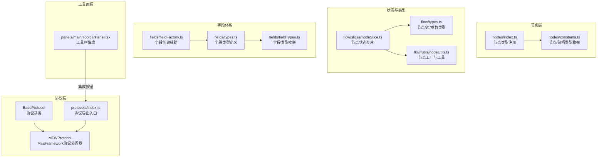
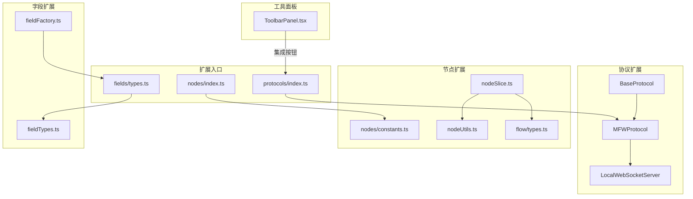
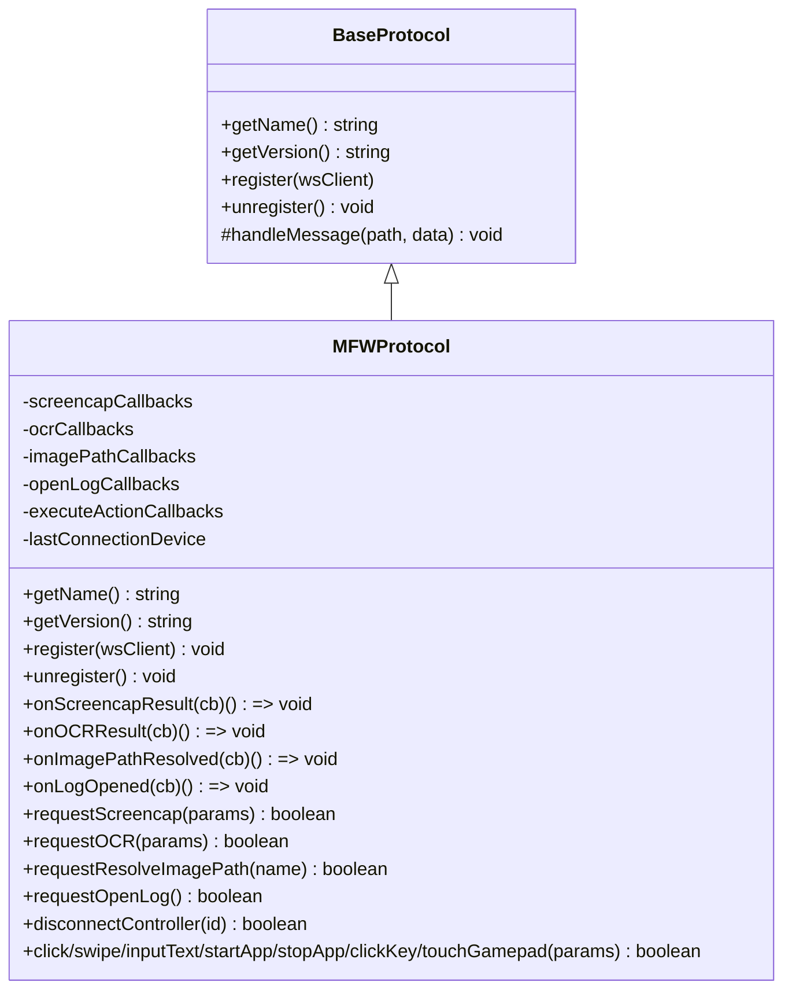
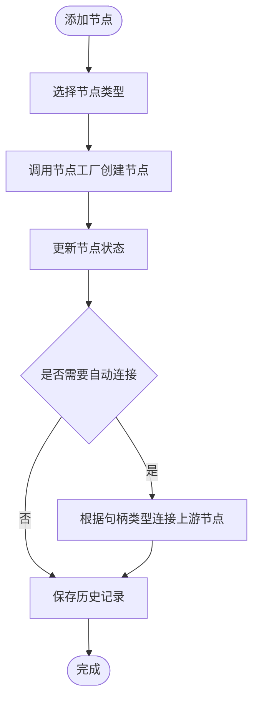
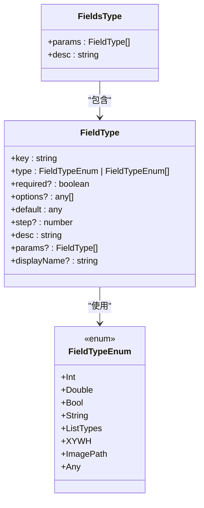
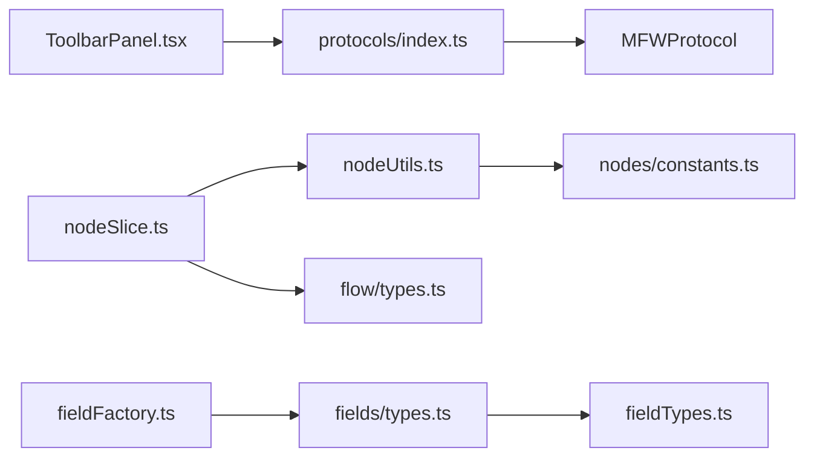

# 扩展点

<cite>
**本文档引用的文件**
- [src/services/protocols/BaseProtocol.ts](file://src/services/protocols/BaseProtocol.ts)
- [src/services/protocols/index.ts](file://src/services/protocols/index.ts)
- [src/services/protocols/MFWProtocol.ts](file://src/services/protocols/MFWProtocol.ts)
- [src/components/flow/nodes/index.ts](file://src/components/flow/nodes/index.ts)
- [src/components/flow/nodes/constants.ts](file://src/components/flow/nodes/constants.ts)
- [src/stores/flow/types.ts](file://src/stores/flow/types.ts)
- [src/stores/flow/utils/nodeUtils.ts](file://src/stores/flow/utils/nodeUtils.ts)
- [src/stores/flow/slices/nodeSlice.ts](file://src/stores/flow/slices/nodeSlice.ts)
- [src/core/fields/types.ts](file://src/core/fields/types.ts)
- [src/core/fields/fieldTypes.ts](file://src/core/fields/fieldTypes.ts)
- [src/core/fields/fieldFactory.ts](file://src/core/fields/fieldFactory.ts)
- [src/components/panels/main/ToolbarPanel.tsx](file://src/components/panels/main/ToolbarPanel.tsx)
</cite>

## 目录
1. [简介](#简介)
2. [项目结构](#项目结构)
3. [核心组件](#核心组件)
4. [架构总览](#架构总览)
5. [详细组件分析](#详细组件分析)
6. [依赖分析](#依赖分析)
7. [性能考量](#性能考量)
8. [故障排查指南](#故障排查指南)
9. [结论](#结论)
10. [附录](#附录)

## 简介
本文件系统性梳理本项目的扩展点与插件接口，重点覆盖以下方面：
- 协议处理器的扩展机制与插件注册方式
- 节点类型的扩展接口与自定义节点实现规范
- 字段编辑器的扩展点与自定义编辑器开发指南
- 工具面板的扩展接口与自定义工具集成方式
- 插件生命周期管理与依赖注入机制
- 扩展点的安全考虑与权限控制
- 提供扩展开发的完整示例与最佳实践

## 项目结构
围绕扩展能力的关键目录与文件如下：
- 协议层：src/services/protocols
- 节点层：src/components/flow/nodes
- 状态与类型：src/stores/flow
- 字段体系：src/core/fields
- 工具面板：src/components/panels/main

**图表来源**
- [src/services/protocols/BaseProtocol.ts:1-40](file://src/services/protocols/BaseProtocol.ts#L1-L40)
- [src/services/protocols/MFWProtocol.ts:1-120](file://src/services/protocols/MFWProtocol.ts#L1-L120)
- [src/services/protocols/index.ts:1-6](file://src/services/protocols/index.ts#L1-L6)
- [src/components/flow/nodes/index.ts:1-26](file://src/components/flow/nodes/index.ts#L1-L26)
- [src/components/flow/nodes/constants.ts:1-47](file://src/components/flow/nodes/constants.ts#L1-L47)
- [src/stores/flow/types.ts:1-120](file://src/stores/flow/types.ts#L1-L120)
- [src/stores/flow/utils/nodeUtils.ts:1-120](file://src/stores/flow/utils/nodeUtils.ts#L1-L120)
- [src/stores/flow/slices/nodeSlice.ts:1-120](file://src/stores/flow/slices/nodeSlice.ts#L1-L120)
- [src/core/fields/types.ts:1-34](file://src/core/fields/types.ts#L1-L34)
- [src/core/fields/fieldFactory.ts:1-16](file://src/core/fields/fieldFactory.ts#L1-L16)
- [src/core/fields/fieldTypes.ts:1-27](file://src/core/fields/fieldTypes.ts#L1-L27)
- [src/components/panels/main/ToolbarPanel.tsx:1-22](file://src/components/panels/main/ToolbarPanel.tsx#L1-L22)

**章节来源**
- [src/services/protocols/index.ts:1-6](file://src/services/protocols/index.ts#L1-L6)
- [src/components/flow/nodes/index.ts:1-26](file://src/components/flow/nodes/index.ts#L1-L26)
- [src/stores/flow/types.ts:1-120](file://src/stores/flow/types.ts#L1-L120)
- [src/core/fields/types.ts:1-34](file://src/core/fields/types.ts#L1-L34)
- [src/components/panels/main/ToolbarPanel.tsx:1-22](file://src/components/panels/main/ToolbarPanel.tsx#L1-L22)

## 核心组件
- 协议处理器基类与扩展点
  - BaseProtocol：定义协议处理器的统一接口，包括名称、版本、注册/注销与消息处理入口。
  - MFWProtocol：具体协议实现，负责设备发现、控制器创建、截图/OCR等事件的路由与回调管理。
  - protocols/index.ts：集中导出协议模块，便于统一注册与管理。

- 节点类型与扩展接口
  - nodes/index.ts：通过字典映射注册可用节点类型，支持新增节点类型时在此处登记。
  - nodes/constants.ts：定义节点类型枚举、句柄类型枚举与句柄方向等基础常量。
  - flow/types.ts：定义节点、边、参数等核心类型，是扩展节点数据结构的基础契约。
  - flow/utils/nodeUtils.ts：提供节点工厂方法（Pipeline/External/Anchor/Sticker/Group），用于创建标准节点。
  - flow/slices/nodeSlice.ts：节点状态管理，包含添加、更新、分组/解组等操作，是节点行为扩展的主要落点。

- 字段编辑器扩展点
  - fields/types.ts：字段类型定义，支持键、类型、默认值、可选参数等元信息。
  - fields/fieldTypes.ts：字段类型枚举，涵盖基础类型、列表、对象、图片路径等。
  - fields/fieldFactory.ts：字段创建辅助，提供批量创建与简化定义的能力。

- 工具面板扩展接口
  - panels/main/ToolbarPanel.tsx：横向工具栏组件，集成导入、导出、JSON预览等工具按钮，作为扩展自定义工具的挂载点。

**章节来源**
- [src/services/protocols/BaseProtocol.ts:1-40](file://src/services/protocols/BaseProtocol.ts#L1-L40)
- [src/services/protocols/MFWProtocol.ts:1-120](file://src/services/protocols/MFWProtocol.ts#L1-L120)
- [src/services/protocols/index.ts:1-6](file://src/services/protocols/index.ts#L1-L6)
- [src/components/flow/nodes/index.ts:1-26](file://src/components/flow/nodes/index.ts#L1-L26)
- [src/components/flow/nodes/constants.ts:1-47](file://src/components/flow/nodes/constants.ts#L1-L47)
- [src/stores/flow/types.ts:1-120](file://src/stores/flow/types.ts#L1-L120)
- [src/stores/flow/utils/nodeUtils.ts:1-120](file://src/stores/flow/utils/nodeUtils.ts#L1-L120)
- [src/stores/flow/slices/nodeSlice.ts:1-120](file://src/stores/flow/slices/nodeSlice.ts#L1-L120)
- [src/core/fields/types.ts:1-34](file://src/core/fields/types.ts#L1-L34)
- [src/core/fields/fieldTypes.ts:1-27](file://src/core/fields/fieldTypes.ts#L1-L27)
- [src/core/fields/fieldFactory.ts:1-16](file://src/core/fields/fieldFactory.ts#L1-L16)
- [src/components/panels/main/ToolbarPanel.tsx:1-22](file://src/components/panels/main/ToolbarPanel.tsx#L1-L22)

## 架构总览
下图展示协议扩展、节点扩展与字段体系之间的交互关系，以及工具面板的集成位置。

**图表来源**
- [src/services/protocols/index.ts:1-6](file://src/services/protocols/index.ts#L1-L6)
- [src/services/protocols/BaseProtocol.ts:1-40](file://src/services/protocols/BaseProtocol.ts#L1-L40)
- [src/services/protocols/MFWProtocol.ts:1-120](file://src/services/protocols/MFWProtocol.ts#L1-L120)
- [src/components/flow/nodes/index.ts:1-26](file://src/components/flow/nodes/index.ts#L1-L26)
- [src/components/flow/nodes/constants.ts:1-47](file://src/components/flow/nodes/constants.ts#L1-L47)
- [src/stores/flow/utils/nodeUtils.ts:1-120](file://src/stores/flow/utils/nodeUtils.ts#L1-L120)
- [src/stores/flow/slices/nodeSlice.ts:1-120](file://src/stores/flow/slices/nodeSlice.ts#L1-L120)
- [src/stores/flow/types.ts:1-120](file://src/stores/flow/types.ts#L1-L120)
- [src/core/fields/types.ts:1-34](file://src/core/fields/types.ts#L1-L34)
- [src/core/fields/fieldTypes.ts:1-27](file://src/core/fields/fieldTypes.ts#L1-L27)
- [src/core/fields/fieldFactory.ts:1-16](file://src/core/fields/fieldFactory.ts#L1-L16)
- [src/components/panels/main/ToolbarPanel.tsx:1-22](file://src/components/panels/main/ToolbarPanel.tsx#L1-L22)

## 详细组件分析

### 协议处理器扩展机制与插件注册
- 扩展点设计
  - BaseProtocol：抽象基类，要求实现 getName、getVersion、register、unregister 与受保护的 handleMessage。
  - MFWProtocol：继承 BaseProtocol，注册多条路由（设备列表、控制器状态、截图、OCR、日志、动作执行等），并通过回调队列管理异步结果。
  - protocols/index.ts：集中导出协议模块，便于上层统一加载与注册。

- 插件注册方式
  - 在应用初始化阶段，调用协议实例的 register 方法传入 LocalWebSocketServer，即可完成路由注册。
  - 注销时调用 unregister，释放绑定资源。

- 生命周期管理
  - 连接状态监听：当 WebSocket 断开或重连时，清理控制器状态并同步 UI。
  - 回调管理：为每类结果维护独立回调数组，提供 onXxxResult 返回的注销函数，避免内存泄漏。

**图表来源**
- [src/services/protocols/BaseProtocol.ts:1-40](file://src/services/protocols/BaseProtocol.ts#L1-L40)
- [src/services/protocols/MFWProtocol.ts:1-120](file://src/services/protocols/MFWProtocol.ts#L1-L120)

**章节来源**
- [src/services/protocols/BaseProtocol.ts:1-40](file://src/services/protocols/BaseProtocol.ts#L1-L40)
- [src/services/protocols/MFWProtocol.ts:1-120](file://src/services/protocols/MFWProtocol.ts#L1-L120)
- [src/services/protocols/index.ts:1-6](file://src/services/protocols/index.ts#L1-L6)

### 节点类型的扩展接口与自定义节点实现规范
- 节点类型注册
  - nodes/index.ts 通过字典将 NodeTypeEnum 映射到对应的节点组件，新增节点类型需在此登记。
  - nodes/constants.ts 定义 NodeTypeEnum、SourceHandleTypeEnum、TargetHandleTypeEnum 与句柄方向选项。

- 节点数据结构
  - flow/types.ts 定义了 PipelineNodeType、ExternalNodeType、AnchorNodeType、StickerNodeType、GroupNodeType 以及通用参数类型（RecognitionParamType、ActionParamType、OtherParamType）。
  - 扩展节点应遵循现有数据结构，确保与解析器、序列化器兼容。

- 节点工厂与行为扩展
  - flow/utils/nodeUtils.ts 提供 createPipelineNode、createExternalNode、createAnchorNode、createStickerNode、createGroupNode 等工厂方法，扩展节点建议复用或参考这些工厂。
  - flow/slices/nodeSlice.ts 提供节点增删改、分组/解组、锚点引用索引重建等状态逻辑，扩展节点的行为变更应在此处体现。

**图表来源**
- [src/stores/flow/slices/nodeSlice.ts:138-308](file://src/stores/flow/slices/nodeSlice.ts#L138-L308)
- [src/stores/flow/utils/nodeUtils.ts:15-120](file://src/stores/flow/utils/nodeUtils.ts#L15-L120)
- [src/components/flow/nodes/index.ts:8-14](file://src/components/flow/nodes/index.ts#L8-L14)
- [src/components/flow/nodes/constants.ts:14-20](file://src/components/flow/nodes/constants.ts#L14-L20)

**章节来源**
- [src/components/flow/nodes/index.ts:1-26](file://src/components/flow/nodes/index.ts#L1-L26)
- [src/components/flow/nodes/constants.ts:1-47](file://src/components/flow/nodes/constants.ts#L1-L47)
- [src/stores/flow/types.ts:109-227](file://src/stores/flow/types.ts#L109-L227)
- [src/stores/flow/utils/nodeUtils.ts:15-120](file://src/stores/flow/utils/nodeUtils.ts#L15-L120)
- [src/stores/flow/slices/nodeSlice.ts:138-308](file://src/stores/flow/slices/nodeSlice.ts#L138-L308)

### 字段编辑器的扩展点与自定义编辑器开发指南
- 字段类型定义
  - fields/types.ts 定义 FieldType 与 FieldsType，支持键、类型、默认值、可选参数、显示名等元信息；支持嵌套参数（params）以表达复杂结构。
  - fields/fieldTypes.ts 定义字段类型枚举，覆盖基础类型、列表、对象、图片路径等，扩展编辑器需与之匹配。

- 字段创建辅助
  - fields/fieldFactory.ts 提供 createField 与 createFields，简化字段定义与批量创建，便于在扩展中快速声明字段。

- 自定义编辑器开发要点
  - 编辑器需能读取字段元信息（类型、默认值、可选项等），并在 UI 中渲染合适的控件。
  - 对于复杂字段（如 focus、XYWH、列表），建议通过 params 递归构建结构化编辑器。
  - 与节点状态联动：编辑器变更应触发 setNodeData 或 batchSetNodeData，确保状态一致性与历史记录保存。

**图表来源**
- [src/core/fields/types.ts:6-24](file://src/core/fields/types.ts#L6-L24)
- [src/core/fields/fieldTypes.ts:4-26](file://src/core/fields/fieldTypes.ts#L4-L26)

**章节来源**
- [src/core/fields/types.ts:1-34](file://src/core/fields/types.ts#L1-L34)
- [src/core/fields/fieldTypes.ts:1-27](file://src/core/fields/fieldTypes.ts#L1-L27)
- [src/core/fields/fieldFactory.ts:1-16](file://src/core/fields/fieldFactory.ts#L1-L16)

### 工具面板的扩展接口与自定义工具集成
- 工具栏集成点
  - panels/main/ToolbarPanel.tsx 提供横向工具栏，内置导入、导出、JSON 预览等按钮，扩展自定义工具只需在该组件中添加新的按钮并实现其行为。
  - 建议保持按钮风格一致，并通过模块化方式组织工具逻辑，便于测试与维护。

- 集成方式
  - 新增按钮组件后，在 ToolbarPanel 中引入并渲染。
  - 若涉及协议交互（如导出/导入），可通过 protocols/index.ts 导出的协议模块进行调用。

**章节来源**
- [src/components/panels/main/ToolbarPanel.tsx:1-22](file://src/components/panels/main/ToolbarPanel.tsx#L1-L22)
- [src/services/protocols/index.ts:1-6](file://src/services/protocols/index.ts#L1-L6)

## 依赖分析
- 组件耦合关系
  - 协议层依赖 WebSocket 服务器，通过路由与回调实现事件驱动。
  - 节点层依赖状态层的类型与工具，状态层依赖节点工厂与常量定义。
  - 字段体系独立于 UI，但与节点数据结构强关联，编辑器需遵循字段类型定义。
  - 工具面板依赖协议与状态层提供的能力，形成“UI → 协议/状态”的单向依赖。

**图表来源**
- [src/components/panels/main/ToolbarPanel.tsx:1-22](file://src/components/panels/main/ToolbarPanel.tsx#L1-L22)
- [src/services/protocols/index.ts:1-6](file://src/services/protocols/index.ts#L1-L6)
- [src/services/protocols/MFWProtocol.ts:1-120](file://src/services/protocols/MFWProtocol.ts#L1-L120)
- [src/stores/flow/slices/nodeSlice.ts:1-120](file://src/stores/flow/slices/nodeSlice.ts#L1-L120)
- [src/stores/flow/utils/nodeUtils.ts:1-120](file://src/stores/flow/utils/nodeUtils.ts#L1-L120)
- [src/stores/flow/types.ts:1-120](file://src/stores/flow/types.ts#L1-L120)
- [src/components/flow/nodes/constants.ts:1-47](file://src/components/flow/nodes/constants.ts#L1-L47)
- [src/core/fields/types.ts:1-34](file://src/core/fields/types.ts#L1-L34)
- [src/core/fields/fieldTypes.ts:1-27](file://src/core/fields/fieldTypes.ts#L1-L27)
- [src/core/fields/fieldFactory.ts:1-16](file://src/core/fields/fieldFactory.ts#L1-L16)

**章节来源**
- [src/services/protocols/index.ts:1-6](file://src/services/protocols/index.ts#L1-L6)
- [src/stores/flow/slices/nodeSlice.ts:1-120](file://src/stores/flow/slices/nodeSlice.ts#L1-L120)
- [src/stores/flow/utils/nodeUtils.ts:1-120](file://src/stores/flow/utils/nodeUtils.ts#L1-L120)
- [src/core/fields/types.ts:1-34](file://src/core/fields/types.ts#L1-L34)

## 性能考量
- 节点批量更新
  - 使用 batchSetNodeData 可减少多次状态更新带来的重渲染与历史记录压力。
- 回调管理
  - 协议处理器为每类结果维护回调数组，及时注销不再使用的回调，避免内存泄漏与频繁触发。
- 历史记录
  - 节点增删改、移动等操作均会触发历史记录保存，建议在高频操作时适当延迟保存或合并保存，降低性能开销。

## 故障排查指南
- 协议注册失败
  - 检查 BaseProtocol 实现是否正确实现 getName/getVersion/register/unregister。
  - 确认 LocalWebSocketServer 已初始化且未断开。
- 节点标签冲突
  - flow/utils/nodeUtils.ts 提供 checkRepeatNodeLabelList，导出/配置生成时会校验标签冲突，需修正重复标签。
- 字段类型不匹配
  - 确保自定义字段类型与 fields/fieldTypes.ts 中的枚举一致，避免编辑器渲染异常。
- 工具按钮无效
  - 确认按钮组件已正确引入并渲染，相关行为逻辑已实现，必要时通过协议模块进行调用。

**章节来源**
- [src/services/protocols/BaseProtocol.ts:1-40](file://src/services/protocols/BaseProtocol.ts#L1-L40)
- [src/stores/flow/utils/nodeUtils.ts:228-279](file://src/stores/flow/utils/nodeUtils.ts#L228-L279)
- [src/core/fields/fieldTypes.ts:1-27](file://src/core/fields/fieldTypes.ts#L1-L27)
- [src/components/panels/main/ToolbarPanel.tsx:1-22](file://src/components/panels/main/ToolbarPanel.tsx#L1-L22)

## 结论
本项目通过清晰的协议基类、节点注册机制、字段类型体系与工具面板集成点，提供了完善的扩展能力。开发者可在不破坏既有契约的前提下，安全地扩展协议处理器、节点类型、字段编辑器与工具面板，实现高度定制化的流程编辑体验。

## 附录
- 扩展开发最佳实践
  - 遵循现有类型定义与工厂方法，保证与解析器/序列化器兼容。
  - 通过回调注销与批量更新策略优化性能。
  - 保持 UI 与协议/状态层的单向依赖，避免循环依赖。
  - 在工具面板中采用模块化组织，提升可维护性与可测试性。