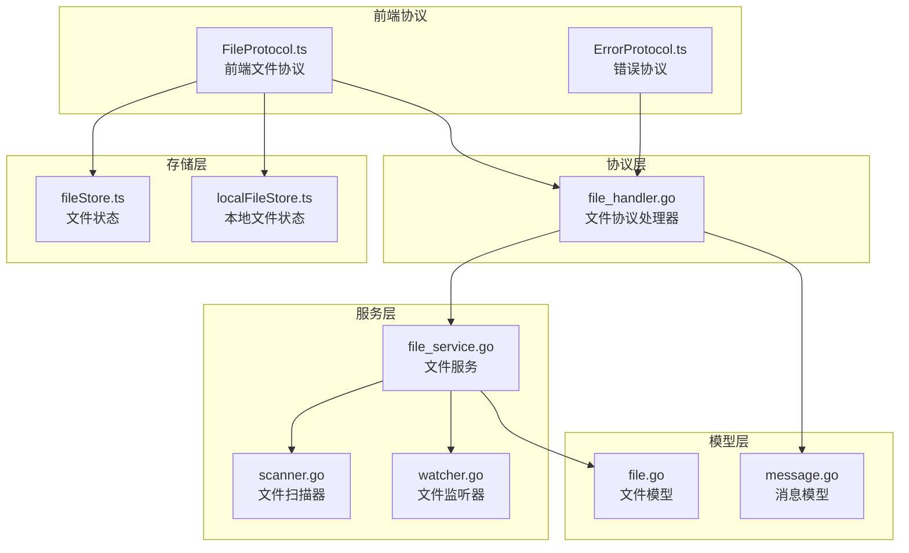
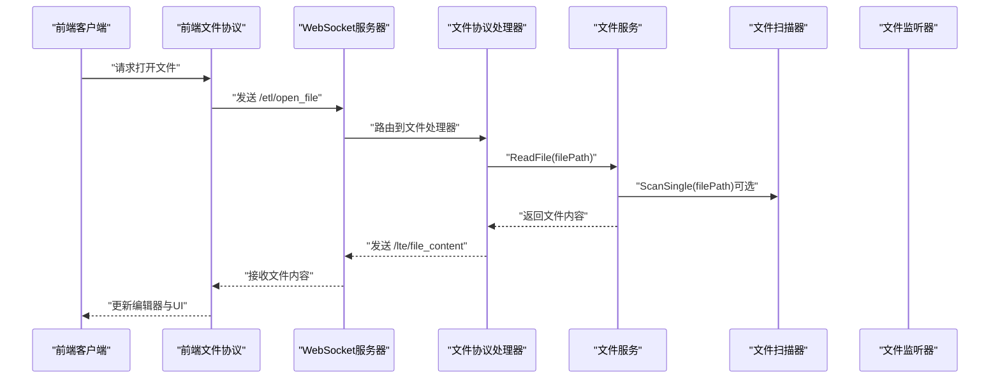
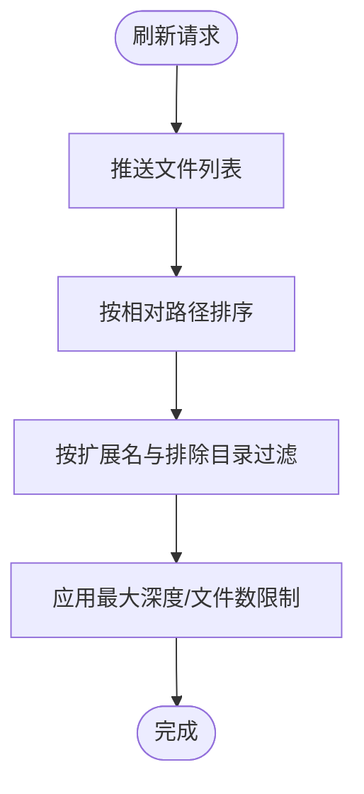
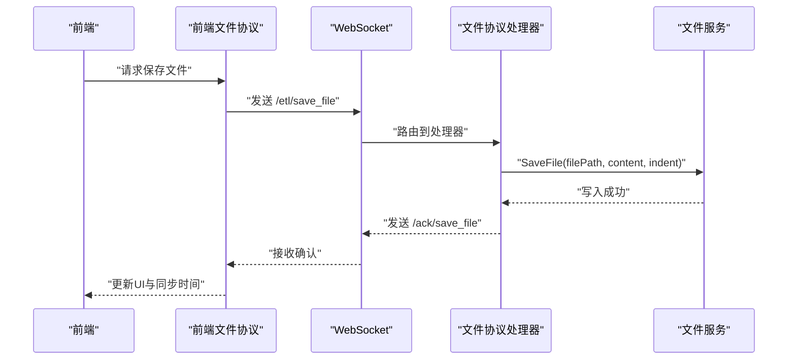
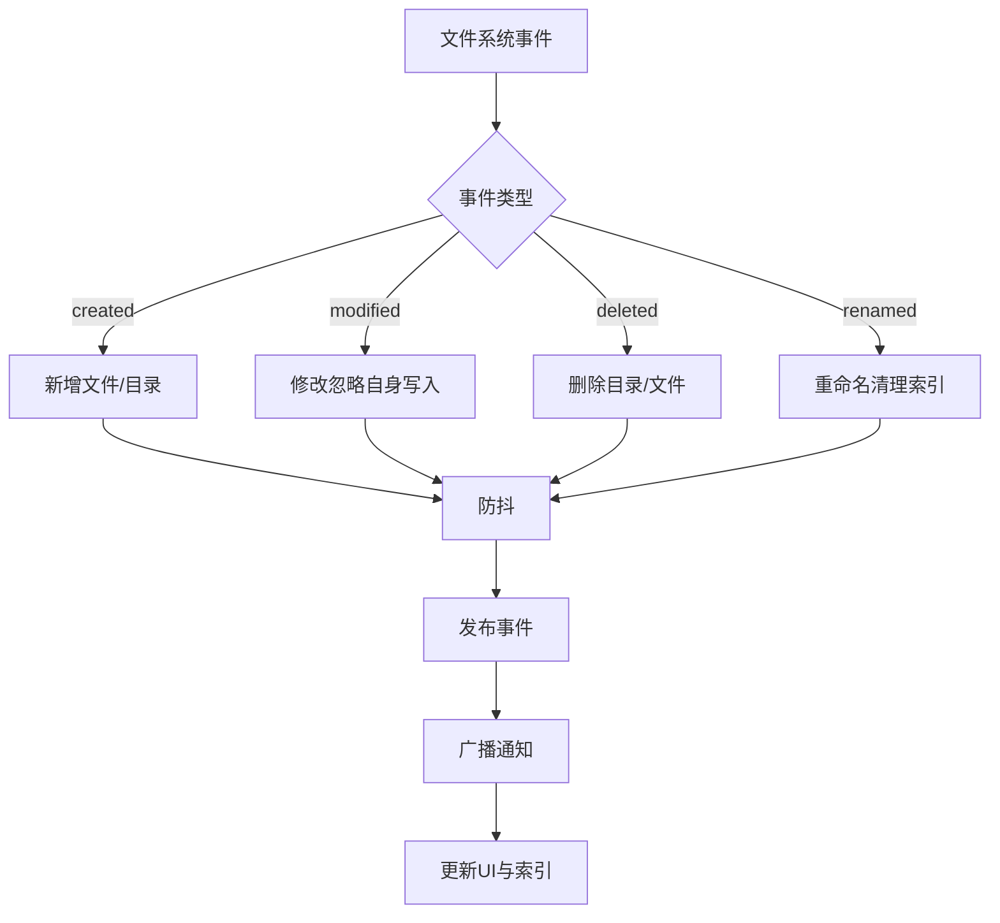

# 文件API

<cite>
**本文档引用的文件**
- [file_handler.go](file://LocalBridge/internal/protocol/file/file_handler.go)
- [file_service.go](file://LocalBridge/internal/service/file/file_service.go)
- [scanner.go](file://LocalBridge/internal/service/file/scanner.go)
- [watcher.go](file://LocalBridge/internal/service/file/watcher.go)
- [file.go](file://LocalBridge/pkg/models/file.go)
- [message.go](file://LocalBridge/pkg/models/message.go)
- [errors.go](file://LocalBridge/internal/errors/errors.go)
- [paths.go](file://LocalBridge/internal/paths/paths.go)
- [FileProtocol.ts](file://src/services/protocols/FileProtocol.ts)
- [ErrorProtocol.ts](file://src/services/protocols/ErrorProtocol.ts)
- [fileStore.ts](file://src/stores/fileStore.ts)
- [localFileStore.ts](file://src/stores/localFileStore.ts)
</cite>

## 目录
1. [简介](#简介)
2. [项目结构](#项目结构)
3. [核心组件](#核心组件)
4. [架构总览](#架构总览)
5. [详细组件分析](#详细组件分析)
6. [依赖关系分析](#依赖关系分析)
7. [性能考虑](#性能考虑)
8. [故障排查指南](#故障排查指南)
9. [结论](#结论)
10. [附录](#附录)

## 简介
本文档面向MaaPipelineEditor的文件API，系统性说明文件列表接口、文件读写操作、文件监控机制、文件系统操作接口、缓存策略与安全验证等技术细节，并提供完整的API调用示例、错误码说明与性能优化建议。目标读者既包括前端开发者，也包括需要理解后端实现的工程师。

## 项目结构
文件API主要分布在以下模块：
- 协议层：负责WebSocket消息路由与协议交互
- 服务层：负责文件扫描、监控、读写与索引维护
- 模型层：定义消息与文件数据结构
- 前端协议：负责与前端的WebSocket通信与UI交互
- 错误处理：统一错误码与错误消息封装



图表来源
- [file_handler.go:1-328](file://LocalBridge/internal/protocol/file/file_handler.go#L1-L328)
- [file_service.go:1-360](file://LocalBridge/internal/service/file/file_service.go#L1-L360)
- [scanner.go:1-250](file://LocalBridge/internal/service/file/scanner.go#L1-L250)
- [watcher.go:1-258](file://LocalBridge/internal/service/file/watcher.go#L1-L258)
- [file.go:1-29](file://LocalBridge/pkg/models/file.go#L1-L29)
- [message.go:1-126](file://LocalBridge/pkg/models/message.go#L1-L126)
- [FileProtocol.ts:1-607](file://src/services/protocols/FileProtocol.ts#L1-L607)
- [ErrorProtocol.ts:1-41](file://src/services/protocols/ErrorProtocol.ts#L1-L41)
- [fileStore.ts:255-296](file://src/stores/fileStore.ts#L255-L296)
- [localFileStore.ts:182-231](file://src/stores/localFileStore.ts#L182-L231)

章节来源
- [file_handler.go:1-328](file://LocalBridge/internal/protocol/file/file_handler.go#L1-L328)
- [file_service.go:1-360](file://LocalBridge/internal/service/file/file_service.go#L1-L360)
- [scanner.go:1-250](file://LocalBridge/internal/service/file/scanner.go#L1-L250)
- [watcher.go:1-258](file://LocalBridge/internal/service/file/watcher.go#L1-L258)
- [file.go:1-29](file://LocalBridge/pkg/models/file.go#L1-L29)
- [message.go:1-126](file://LocalBridge/pkg/models/message.go#L1-L126)
- [FileProtocol.ts:1-607](file://src/services/protocols/FileProtocol.ts#L1-L607)
- [ErrorProtocol.ts:1-41](file://src/services/protocols/ErrorProtocol.ts#L1-L41)
- [fileStore.ts:255-296](file://src/stores/fileStore.ts#L255-L296)
- [localFileStore.ts:182-231](file://src/stores/localFileStore.ts#L182-L231)

## 核心组件
- 文件协议处理器：负责WebSocket路由前缀注册、消息解析与错误回传
- 文件服务：负责文件读写、创建、索引构建与更新、路径安全校验
- 文件扫描器：负责目录遍历、文件过滤、排序与分页（通过限制参数实现）
- 文件监听器：基于fsnotify的文件系统事件监听，支持防抖与忽略自身写入
- 消息模型：定义文件列表、文件内容、文件变化通知、保存确认等消息结构
- 前端文件协议：负责与前端WebSocket通信、文件变更通知、自动重载与确认机制

章节来源
- [file_handler.go:1-328](file://LocalBridge/internal/protocol/file/file_handler.go#L1-L328)
- [file_service.go:1-360](file://LocalBridge/internal/service/file/file_service.go#L1-L360)
- [scanner.go:1-250](file://LocalBridge/internal/service/file/scanner.go#L1-L250)
- [watcher.go:1-258](file://LocalBridge/internal/service/file/watcher.go#L1-L258)
- [message.go:1-126](file://LocalBridge/pkg/models/message.go#L1-L126)
- [FileProtocol.ts:1-607](file://src/services/protocols/FileProtocol.ts#L1-L607)

## 架构总览
文件API采用“协议层-服务层-模型层-前端协议”的分层架构，通过WebSocket实现前后端双向通信。后端负责文件系统操作与监控，前端负责UI展示与用户交互。



图表来源
- [FileProtocol.ts:360-373](file://src/services/protocols/FileProtocol.ts#L360-L373)
- [file_handler.go:67-137](file://LocalBridge/internal/protocol/file/file_handler.go#L67-L137)
- [file_service.go:122-156](file://LocalBridge/internal/service/file/file_service.go#L122-L156)
- [scanner.go:176-210](file://LocalBridge/internal/service/file/scanner.go#L176-L210)

## 详细组件分析

### 文件列表接口
- 路由前缀：/etl/refresh_file_list
- 功能：主动刷新并推送文件列表
- 数据结构：FileListData（包含根目录与文件数组）
- 排序：按相对路径排序，保证列表顺序稳定
- 过滤：通过扫描器的扩展名过滤与排除目录策略实现
- 分页：通过扫描限制（最大深度、最大文件数）实现分页效果



图表来源
- [file_handler.go:243-247](file://LocalBridge/internal/protocol/file/file_handler.go#L243-L247)
- [file_handler.go:287-300](file://LocalBridge/internal/protocol/file/file_handler.go#L287-L300)
- [file_service.go:104-120](file://LocalBridge/internal/service/file/file_service.go#L104-L120)
- [scanner.go:64-147](file://LocalBridge/internal/service/file/scanner.go#L64-L147)

章节来源
- [file_handler.go:243-247](file://LocalBridge/internal/protocol/file/file_handler.go#L243-L247)
- [file_handler.go:287-300](file://LocalBridge/internal/protocol/file/file_handler.go#L287-L300)
- [file_service.go:104-120](file://LocalBridge/internal/service/file/file_service.go#L104-L120)
- [scanner.go:64-147](file://LocalBridge/internal/service/file/scanner.go#L64-L147)

### 文件读写操作
- 打开文件：/etl/open_file
  - 读取JSONC文件内容并解析为JSON对象
  - 自动探测.mpe.json配置文件并返回
- 保存文件：/etl/save_file
  - 支持自定义缩进
  - 保存后清除防抖事件，避免重复触发
- 分离保存：/etl/save_separated
  - 同时保存Pipeline与配置文件
  - 成功后更新当前文件路径与同步时间



图表来源
- [FileProtocol.ts:360-417](file://src/services/protocols/FileProtocol.ts#L360-L417)
- [file_handler.go:139-166](file://LocalBridge/internal/protocol/file/file_handler.go#L139-L166)
- [file_handler.go:168-208](file://LocalBridge/internal/protocol/file/file_handler.go#L168-L208)
- [file_service.go:158-201](file://LocalBridge/internal/service/file/file_service.go#L158-L201)

章节来源
- [file_handler.go:139-208](file://LocalBridge/internal/protocol/file/file_handler.go#L139-L208)
- [file_service.go:158-201](file://LocalBridge/internal/service/file/file_service.go#L158-L201)
- [FileProtocol.ts:360-417](file://src/services/protocols/FileProtocol.ts#L360-L417)

### 文件监控功能
- 事件类型：created、modified、deleted、renamed
- 防抖：默认300ms，避免频繁触发
- 忽略自身写入：2秒窗口期，避免保存后立即触发变更通知
- 广播：通过WebSocket广播文件变化通知
- 增量更新：根据事件类型更新文件索引与UI



图表来源
- [watcher.go:114-188](file://LocalBridge/internal/service/file/watcher.go#L114-L188)
- [watcher.go:201-258](file://LocalBridge/internal/service/file/watcher.go#L201-L258)
- [file_service.go:253-343](file://LocalBridge/internal/service/file/file_service.go#L253-L343)
- [file_handler.go:249-284](file://LocalBridge/internal/protocol/file/file_handler.go#L249-L284)

章节来源
- [watcher.go:114-188](file://LocalBridge/internal/service/file/watcher.go#L114-L188)
- [watcher.go:201-258](file://LocalBridge/internal/service/file/watcher.go#L201-L258)
- [file_service.go:253-343](file://LocalBridge/internal/service/file/file_service.go#L253-L343)
- [file_handler.go:249-284](file://LocalBridge/internal/protocol/file/file_handler.go#L249-L284)

### 文件系统操作接口
- 创建文件：/etl/create_file
  - 安全校验：路径合法性与文件名合法性
  - 默认内容：空对象
  - 成功后重新推送文件列表
- 删除/移动/复制：当前实现未提供专用API，但可通过文件系统直接操作；监控会自动反映变化

章节来源
- [file_handler.go:210-241](file://LocalBridge/internal/protocol/file/file_handler.go#L210-L241)
- [file_service.go:203-251](file://LocalBridge/internal/service/file/file_service.go#L203-L251)

### 文件缓存策略、压缩传输与安全验证
- 缓存策略
  - 前端：编辑器状态与文件缓存存储在本地状态中，避免重复加载
  - 后端：文件索引（fileIndex）缓存文件元信息，按需更新
- 压缩传输
  - 采用WebSocket消息结构，未见专门的压缩实现
- 安全验证
  - 路径安全：绝对路径转换与根目录范围检查
  - 文件名安全：禁止非法字符
  - 权限控制：拒绝越权访问

章节来源
- [file_service.go:345-359](file://LocalBridge/internal/service/file/file_service.go#L345-L359)
- [file.go:1-29](file://LocalBridge/pkg/models/file.go#L1-L29)
- [fileStore.ts:255-296](file://src/stores/fileStore.ts#L255-L296)

## 依赖关系分析

```mermaid
classDiagram
class Handler {
+GetRoutePrefix() []string
+Handle(msg, conn) *Message
+subscribeEvents()
+pushFileList()
}
class Service {
+Start() error
+Stop()
+GetFileList() []FileInfo
+ReadFile(filePath) (interface{}, error)
+SaveFile(filePath, content, indent) error
+CreateFile(directory, fileName, content) (string, error)
-validatePath(path) error
}
class Scanner {
+SetMaxDepth(depth)
+SetMaxFiles(count)
+ScanWithLimit() (*ScanResult, error)
+ScanSingle(absPath) (*File, error)
}
class Watcher {
+Start() error
+Stop()
+ClearDebounce(filePath)
}
class FileProtocol {
+requestOpenFile(filePath) bool
+requestCreateFile(name, dir, content?) bool
+requestSaveSeparated(pPath, cPath, p, c) bool
}
Handler --> Service : "依赖"
Service --> Scanner : "使用"
Service --> Watcher : "使用"
FileProtocol --> Handler : "通信"
```

图表来源
- [file_handler.go:14-35](file://LocalBridge/internal/protocol/file/file_handler.go#L14-L35)
- [file_service.go:19-62](file://LocalBridge/internal/service/file/file_service.go#L19-L62)
- [scanner.go:20-48](file://LocalBridge/internal/service/file/scanner.go#L20-L48)
- [watcher.go:34-59](file://LocalBridge/internal/service/file/watcher.go#L34-L59)
- [FileProtocol.ts:16-68](file://src/services/protocols/FileProtocol.ts#L16-L68)

章节来源
- [file_handler.go:14-35](file://LocalBridge/internal/protocol/file/file_handler.go#L14-L35)
- [file_service.go:19-62](file://LocalBridge/internal/service/file/file_service.go#L19-L62)
- [scanner.go:20-48](file://LocalBridge/internal/service/file/scanner.go#L20-L48)
- [watcher.go:34-59](file://LocalBridge/internal/service/file/watcher.go#L34-L59)
- [FileProtocol.ts:16-68](file://src/services/protocols/FileProtocol.ts#L16-L68)

## 性能考虑
- 扫描限制
  - 最大深度与最大文件数限制，避免大规模目录遍历导致性能问题
- 防抖机制
  - 文件监听器默认300ms防抖，减少频繁触发
- 自身写入忽略
  - 2秒窗口期忽略自身写入事件，避免保存后重复触发
- 排序稳定性
  - 文件列表按相对路径排序，确保UI一致性
- 建议
  - 合理设置最大深度与最大文件数
  - 对于大文件，建议使用分离保存模式
  - 在网络不稳定场景下，利用前端确认机制与自动重载策略

[本节为通用性能建议，无需特定文件来源]

## 故障排查指南
- 常见错误码
  - FILE_NOT_FOUND：文件不存在
  - FILE_READ_ERROR：文件读取失败
  - FILE_WRITE_ERROR：文件写入失败
  - FILE_NAME_CONFLICT：文件名冲突
  - INVALID_JSON：JSON格式无效
  - PERMISSION_DENIED：权限不足或路径非法
  - INVALID_REQUEST：请求参数无效
- 前端错误映射
  - 错误协议将后端错误码映射为用户友好的提示
- 排查步骤
  - 检查路径是否在根目录范围内
  - 确认文件名不包含非法字符
  - 查看日志输出定位具体错误
  - 使用刷新文件列表接口重新同步

章节来源
- [errors.go:9-20](file://LocalBridge/internal/errors/errors.go#L9-L20)
- [errors.go:77-140](file://LocalBridge/internal/errors/errors.go#L77-L140)
- [ErrorProtocol.ts:26-41](file://src/services/protocols/ErrorProtocol.ts#L26-L41)

## 结论
MaaPipelineEditor的文件API通过清晰的分层设计与完善的监控机制，提供了稳定可靠的文件管理能力。其核心优势在于：
- 安全的路径校验与文件名校验
- 基于fsnotify的高效文件监控与防抖
- 统一的错误码与前端友好提示
- 支持分离保存与自动重载的用户体验

[本节为总结性内容，无需特定文件来源]

## 附录

### API调用示例
- 打开文件
  - 路由：/etl/open_file
  - 参数：file_path
  - 返回：/lte/file_content
- 保存文件
  - 路由：/etl/save_file
  - 参数：file_path, content, indent
  - 返回：/ack/save_file
- 分离保存
  - 路由：/etl/save_separated
  - 参数：pipeline_path, config_path, pipeline, config, indent
  - 返回：/ack/save_separated
- 创建文件
  - 路由：/etl/create_file
  - 参数：file_name, directory, content?
  - 返回：/ack/create_file
- 刷新文件列表
  - 路由：/etl/refresh_file_list
  - 返回：/lte/file_list

章节来源
- [FileProtocol.ts:360-417](file://src/services/protocols/FileProtocol.ts#L360-L417)
- [file_handler.go:48-64](file://LocalBridge/internal/protocol/file/file_handler.go#L48-L64)
- [message.go:46-91](file://LocalBridge/pkg/models/message.go#L46-L91)

### 错误码说明
- FILE_NOT_FOUND：文件不存在
- FILE_READ_ERROR：文件读取失败
- FILE_WRITE_ERROR：文件写入失败
- FILE_NAME_CONFLICT：文件名冲突
- INVALID_JSON：JSON格式无效
- PERMISSION_DENIED：权限不足或路径非法
- INVALID_REQUEST：请求参数无效

章节来源
- [errors.go:9-20](file://LocalBridge/internal/errors/errors.go#L9-L20)
- [errors.go:77-140](file://LocalBridge/internal/errors/errors.go#L77-L140)
- [ErrorProtocol.ts:26-41](file://src/services/protocols/ErrorProtocol.ts#L26-L41)

### 配置项参考
- file.root：文件根目录
- file.exclude：排除目录列表
- file.extensions：允许的文件扩展名
- file.max_depth：最大扫描深度
- file.max_files：最大文件数量

章节来源
- [paths.go:192-217](file://LocalBridge/internal/paths/paths.go#L192-L217)