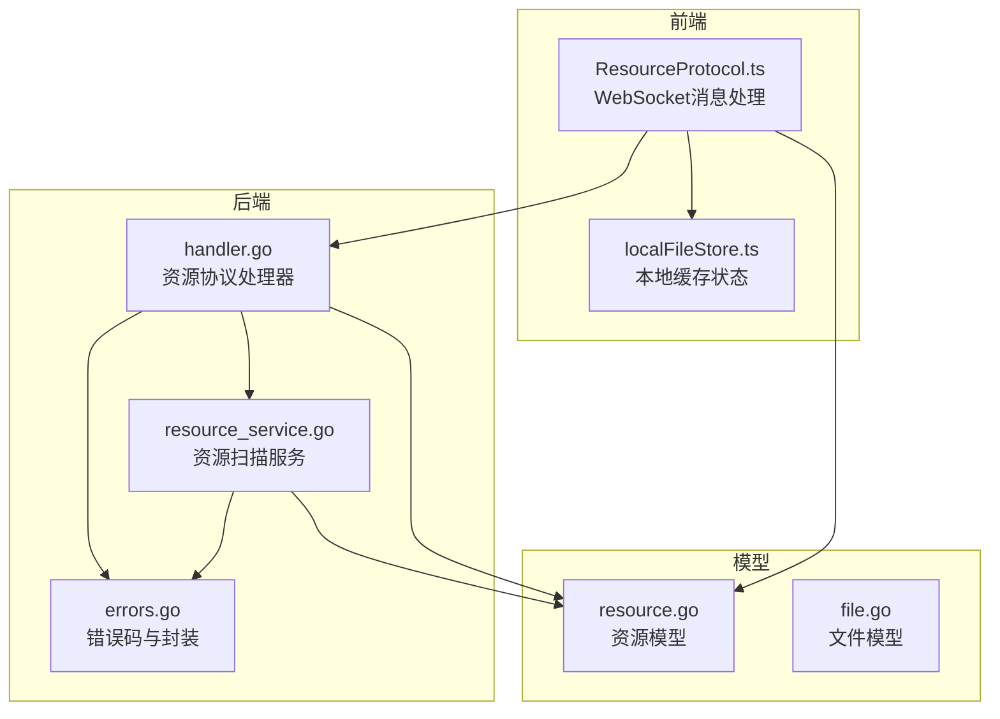
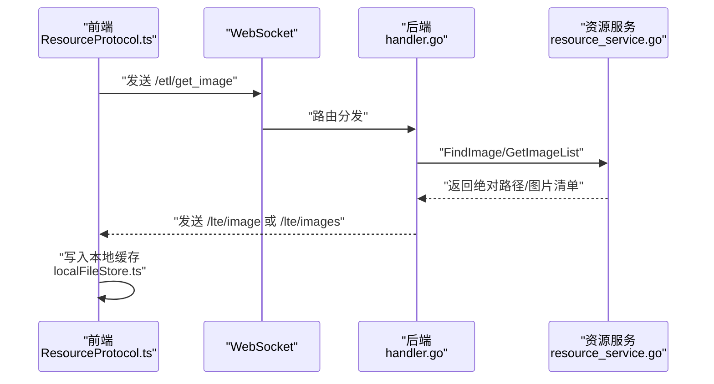
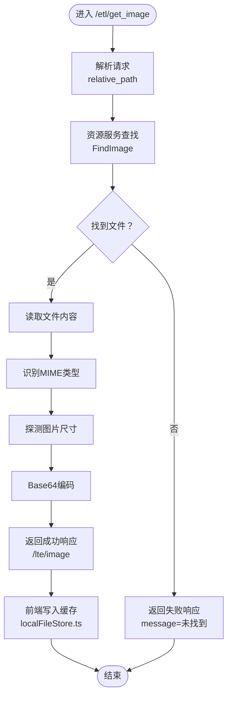
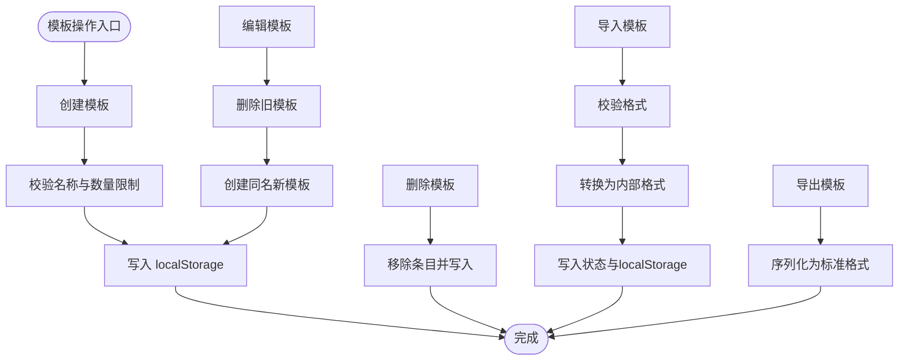
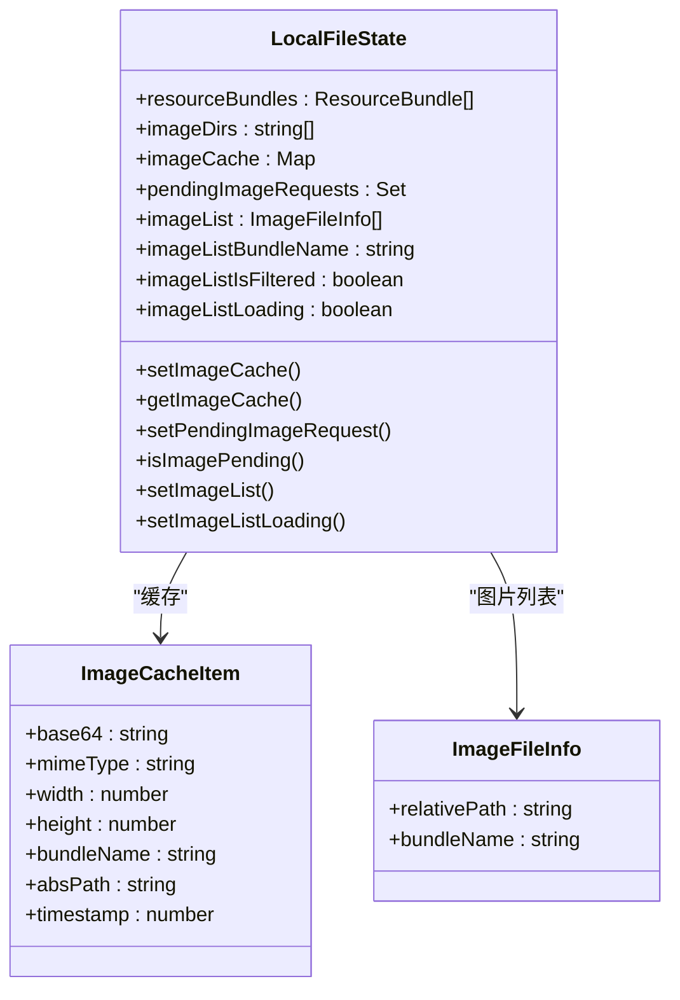
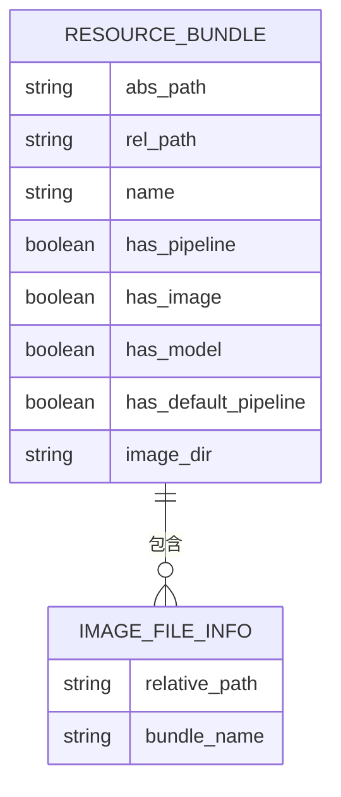
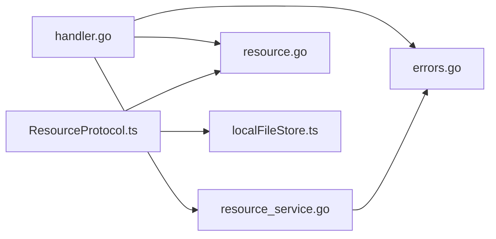

# 资源API

<cite>
**本文引用的文件**
- [handler.go](file://LocalBridge/internal/protocol/resource/handler.go)
- [resource_service.go](file://LocalBridge/internal/service/resource/resource_service.go)
- [resource.go](file://LocalBridge/pkg/models/resource.go)
- [ResourceProtocol.ts](file://src/services/protocols/ResourceProtocol.ts)
- [localFileStore.ts](file://src/stores/localFileStore.ts)
- [errors.go](file://LocalBridge/internal/errors/errors.go)
- [file.go](file://LocalBridge/pkg/models/file.go)
- [customTemplateStore.ts](file://src/stores/customTemplateStore.ts)
</cite>

## 目录
1. [简介](#简介)
2. [项目结构](#项目结构)
3. [核心组件](#核心组件)
4. [架构总览](#架构总览)
5. [详细组件分析](#详细组件分析)
6. [依赖分析](#依赖分析)
7. [性能考虑](#性能考虑)
8. [故障排查指南](#故障排查指南)
9. [结论](#结论)
10. [附录](#附录)

## 简介
本文件为 MaaPipelineEditor 的资源API文档，聚焦于图像资源管理与模板资源操作。内容涵盖：
- 图像资源管理接口：单图/批量获取、格式识别、尺寸探测、Base64编码传输
- 模板资源操作：自定义模板的创建、编辑、删除、导入导出与版本管理
- 资源缓存机制：本地内存缓存、请求去重、预加载策略
- 资源元数据管理：资源包列表、图片清单、来源标记
- 资源安全控制：路径合法性校验、目录跳过规则
- 错误处理与API规范：统一错误码、异常传播、前端提示

## 项目结构
资源API涉及前后端协作的关键模块：
- 后端协议处理器：负责路由分发、请求解析、资源扫描与响应封装
- 资源服务：负责扫描资源包、定位图片、生成图片清单
- 前端协议处理器：负责WebSocket消息收发、缓存更新、UI状态联动
- 本地文件缓存Store：负责资源包、图片缓存、图片列表的状态管理

**图表来源**
- [handler.go:45-69](file://LocalBridge/internal/protocol/resource/handler.go#L45-L69)
- [resource_service.go:14-46](file://LocalBridge/internal/service/resource/resource_service.go#L14-L46)
- [ResourceProtocol.ts:22-36](file://src/services/protocols/ResourceProtocol.ts#L22-L36)
- [localFileStore.ts:129-200](file://src/stores/localFileStore.ts#L129-L200)

**章节来源**
- [handler.go:45-69](file://LocalBridge/internal/protocol/resource/handler.go#L45-L69)
- [resource_service.go:14-46](file://LocalBridge/internal/service/resource/resource_service.go#L14-L46)
- [ResourceProtocol.ts:22-36](file://src/services/protocols/ResourceProtocol.ts#L22-L36)
- [localFileStore.ts:129-200](file://src/stores/localFileStore.ts#L129-L200)

## 核心组件
- 资源协议处理器（后端）：提供 /etl/get_image、/etl/get_images、/etl/get_image_list、/etl/refresh_resources 路由；负责解析请求、调用资源服务、组装响应并通过WebSocket推送
- 资源扫描服务：扫描根目录及其子目录，识别资源包（含 pipeline/image/model/default_pipeline.json 标志），构建资源包列表与 image 目录索引；支持图片清单生成与定位
- 前端资源协议处理器：注册 /lte/* 推送路由，处理资源包列表、图片数据、图片列表；维护本地缓存与请求状态
- 本地文件缓存Store：以Zustand状态管理资源包、图片缓存、图片列表、请求去重集合
- 错误处理：统一错误码与封装，便于前后端一致的错误传播

**章节来源**
- [handler.go:55-137](file://LocalBridge/internal/protocol/resource/handler.go#L55-L137)
- [resource_service.go:48-68](file://LocalBridge/internal/service/resource/resource_service.go#L48-L68)
- [ResourceProtocol.ts:46-70](file://src/services/protocols/ResourceProtocol.ts#L46-L70)
- [localFileStore.ts:67-118](file://src/stores/localFileStore.ts#L67-L118)
- [errors.go:9-20](file://LocalBridge/internal/errors/errors.go#L9-L20)

## 架构总览
资源API采用“后端扫描 + 前端缓存”的架构模式：
- 后端定期扫描资源包，推送资源包列表给前端
- 前端根据用户交互请求图片或图片列表
- 后端按需读取图片文件，计算MIME与尺寸，返回Base64数据
- 前端将图片数据写入本地缓存，避免重复请求

**图表来源**
- [ResourceProtocol.ts:149-173](file://src/services/protocols/ResourceProtocol.ts#L149-L173)
- [handler.go:71-105](file://LocalBridge/internal/protocol/resource/handler.go#L71-L105)
- [resource_service.go:175-193](file://LocalBridge/internal/service/resource/resource_service.go#L175-L193)

**章节来源**
- [ResourceProtocol.ts:149-240](file://src/services/protocols/ResourceProtocol.ts#L149-L240)
- [handler.go:71-137](file://LocalBridge/internal/protocol/resource/handler.go#L71-L137)
- [resource_service.go:175-272](file://LocalBridge/internal/service/resource/resource_service.go#L175-L272)

## 详细组件分析

### 图像资源管理接口
- 单张图片获取
  - 请求：/etl/get_image，携带 relative_path
  - 处理：后端在资源包的 image 目录中查找；读取文件、识别MIME、探测尺寸、Base64编码
  - 响应：/lte/image，包含 success、relative_path、absolute_path、bundle_name、base64、mime_type、width、height、message
  - 前端：写入本地缓存，移除 pending 状态
- 批量图片获取
  - 请求：/etl/get_images，携带 relative_paths
  - 处理：逐个调用单图逻辑，聚合为 /lte/images
  - 前端：批量写入缓存
- 图片列表获取
  - 请求：/etl/get_image_list，可选 pipeline_path
  - 处理：扫描所有资源包的 image 目录，生成图片清单；若提供 pipeline_path，返回当前资源包过滤结果
  - 响应：/lte/image_list，包含 images、bundle_name、is_filtered
  - 前端：更新图片列表状态

**图表来源**
- [handler.go:71-182](file://LocalBridge/internal/protocol/resource/handler.go#L71-L182)
- [resource_service.go:175-193](file://LocalBridge/internal/service/resource/resource_service.go#L175-L193)
- [ResourceProtocol.ts:76-121](file://src/services/protocols/ResourceProtocol.ts#L76-L121)

**章节来源**
- [handler.go:71-182](file://LocalBridge/internal/protocol/resource/handler.go#L71-L182)
- [resource_service.go:175-272](file://LocalBridge/internal/service/resource/resource_service.go#L175-L272)
- [ResourceProtocol.ts:76-143](file://src/services/protocols/ResourceProtocol.ts#L76-L143)

### 模板资源操作
- 自定义模板存储：基于 localStorage 的自定义模板持久化，支持创建、编辑、删除、导入、导出与版本管理
- 模板生命周期
  - 创建：校验名称长度与唯一性，序列化节点数据，写入 localStorage
  - 编辑：删除旧模板并创建同名新模板
  - 删除：移除对应条目并同步 localStorage
  - 导入/导出：序列化为标准格式，支持跨设备迁移
  - 版本管理：存储版本号，不匹配时提示迁移或清空
- 与资源API的关系：模板数据独立于资源API，但可在节点编辑器中引用图片资源

**图表来源**
- [customTemplateStore.ts:96-170](file://src/stores/customTemplateStore.ts#L96-L170)
- [customTemplateStore.ts:172-200](file://src/stores/customTemplateStore.ts#L172-L200)
- [customTemplateStore.ts:202-210](file://src/stores/customTemplateStore.ts#L202-L210)
- [customTemplateStore.ts:255-307](file://src/stores/customTemplateStore.ts#L255-L307)

**章节来源**
- [customTemplateStore.ts:96-170](file://src/stores/customTemplateStore.ts#L96-L170)
- [customTemplateStore.ts:172-200](file://src/stores/customTemplateStore.ts#L172-L200)
- [customTemplateStore.ts:202-210](file://src/stores/customTemplateStore.ts#L202-L210)
- [customTemplateStore.ts:255-307](file://src/stores/customTemplateStore.ts#L255-L307)

### 资源缓存机制
- 本地缓存
  - 图片缓存：Map<relative_path, ImageCacheItem>，包含 base64、mimeType、width、height、bundleName、absPath、timestamp
  - 请求去重：Set<relative_path> 标记正在请求的图片，避免重复发送
  - 图片列表：ImageFileInfo[]，包含 relative_path 与 bundleName
- 预加载策略
  - 前端在请求图片前检查缓存与请求状态，仅对缺失或未在请求中的路径发起请求
  - 批量请求会过滤已缓存与正在请求的路径，减少网络开销
- 资源包列表
  - 后端扫描完成后通过 /lte/resource_bundles 推送，前端写入本地状态

**图表来源**
- [localFileStore.ts:67-118](file://src/stores/localFileStore.ts#L67-L118)
- [localFileStore.ts:39-47](file://src/stores/localFileStore.ts#L39-L47)
- [localFileStore.ts:52-55](file://src/stores/localFileStore.ts#L52-L55)

**章节来源**
- [localFileStore.ts:67-118](file://src/stores/localFileStore.ts#L67-L118)
- [ResourceProtocol.ts:149-207](file://src/services/protocols/ResourceProtocol.ts#L149-L207)

### 资源元数据管理
- 资源包元数据：包含绝对路径、相对路径、名称、是否包含 pipeline/image/model/default_pipeline.json、image 目录绝对路径
- 图片元数据：相对路径、所属资源包名称
- 图片清单：支持按 pipeline_path 所属资源包过滤，返回 is_filtered 标识

**图表来源**
- [resource.go:3-13](file://LocalBridge/pkg/models/resource.go#L3-L13)
- [resource.go:50-54](file://LocalBridge/pkg/models/resource.go#L50-L54)
- [resource_service.go:243-272](file://LocalBridge/internal/service/resource/resource_service.go#L243-L272)

**章节来源**
- [resource.go:3-13](file://LocalBridge/pkg/models/resource.go#L3-L13)
- [resource.go:50-54](file://LocalBridge/pkg/models/resource.go#L50-L54)
- [resource_service.go:243-272](file://LocalBridge/internal/service/resource/resource_service.go#L243-L272)

### 资源安全控制
- 路径合法性与目录跳过：扫描阶段跳过隐藏目录与常见非资源目录（如 .git、node_modules、logs 等），降低风险
- 目录安全性检查：配置层提供根目录安全性检查，识别高风险系统目录并给出建议

**章节来源**
- [resource_service.go:208-228](file://LocalBridge/internal/service/resource/resource_service.go#L208-L228)
- [config.go:234-257](file://LocalBridge/internal/config/config.go#L234-L257)

### 错误处理与API规范
- 统一错误码：FILE_NOT_FOUND、FILE_READ_ERROR、INVALID_JSON、PERMISSION_DENIED、INVALID_REQUEST、INTERNAL_ERROR 等
- 错误传播：后端将错误封装为 /error 消息，前端记录并提示
- API规范要点
  - 请求参数必须包含 relative_path（单图）、relative_paths（批量）、pipeline_path（可选）
  - 响应必须包含 success 字段；失败时提供 message
  - 成功响应包含 base64、mime_type、width、height 等元数据

**章节来源**
- [errors.go:9-20](file://LocalBridge/internal/errors/errors.go#L9-L20)
- [errors.go:115-140](file://LocalBridge/internal/errors/errors.go#L115-L140)
- [handler.go:247-271](file://LocalBridge/internal/protocol/resource/handler.go#L247-L271)
- [ResourceProtocol.ts:262-270](file://src/services/protocols/ResourceProtocol.ts#L262-L270)

## 依赖分析
- 路由依赖：后端 handler.go 明确声明了 /etl/* 路由；前端 ResourceProtocol.ts 注册 /lte/* 接收路由
- 数据模型：resource.go 提供资源包与图片元数据模型；file.go 提供文件模型
- 状态依赖：localFileStore.ts 作为前端状态中心，被 ResourceProtocol.ts 读写
- 错误依赖：errors.go 为统一错误封装来源

**图表来源**
- [handler.go:22-43](file://LocalBridge/internal/protocol/resource/handler.go#L22-L43)
- [resource_service.go:14-31](file://LocalBridge/internal/service/resource/resource_service.go#L14-L31)
- [ResourceProtocol.ts:13-36](file://src/services/protocols/ResourceProtocol.ts#L13-L36)
- [localFileStore.ts:129-139](file://src/stores/localFileStore.ts#L129-L139)
- [errors.go:22-50](file://LocalBridge/internal/errors/errors.go#L22-L50)

**章节来源**
- [handler.go:22-43](file://LocalBridge/internal/protocol/resource/handler.go#L22-L43)
- [resource_service.go:14-31](file://LocalBridge/internal/service/resource/resource_service.go#L14-L31)
- [ResourceProtocol.ts:13-36](file://src/services/protocols/ResourceProtocol.ts#L13-L36)
- [localFileStore.ts:129-139](file://src/stores/localFileStore.ts#L129-L139)
- [errors.go:22-50](file://LocalBridge/internal/errors/errors.go#L22-L50)

## 性能考虑
- I/O优化
  - 仅在首次请求时读取文件并进行 Base64 编码，后续直接命中本地缓存
  - 批量请求时过滤已缓存与正在请求的路径，减少重复网络请求
- 扫描优化
  - 递归扫描深度限制为2层，跳过常见非资源目录，降低磁盘扫描成本
  - 资源包识别通过标志目录/文件判断，避免遍历全部文件
- 前端渲染
  - 使用 zustand 状态管理，局部更新减少重渲染
  - 图片尺寸与MIME在后端计算，前端仅做展示，避免额外计算

## 故障排查指南
- 常见问题
  - 图片未找到：检查 relative_path 是否正确，确认资源包中存在该文件
  - 读取失败：检查文件权限与路径合法性
  - JSON解析错误：检查请求体格式，确保字段齐全
- 排查步骤
  - 后端：查看日志输出与错误码
  - 前端：检查本地缓存与 pending 状态，确认是否重复请求
  - 资源包：确认 /lte/resource_bundles 是否正常推送

**章节来源**
- [handler.go:140-182](file://LocalBridge/internal/protocol/resource/handler.go#L140-L182)
- [ResourceProtocol.ts:76-121](file://src/services/protocols/ResourceProtocol.ts#L76-L121)
- [errors.go:115-140](file://LocalBridge/internal/errors/errors.go#L115-L140)

## 结论
资源API通过“后端扫描 + 前端缓存”的设计，实现了高效的图像资源管理与模板资源操作。其关键优势包括：
- 明确的路由与数据模型，便于扩展与维护
- 本地缓存与请求去重，显著降低网络与I/O压力
- 统一错误处理与资源包元数据，提升稳定性与可观测性
- 模板资源独立存储，满足自定义节点模板的创建与迁移需求

## 附录

### API一览（后端）
- GET /etl/get_image
  - 请求体：relative_path
  - 响应：/lte/image
- GET /etl/get_images
  - 请求体：relative_paths
  - 响应：/lte/images
- GET /etl/get_image_list
  - 请求体：pipeline_path（可选）
  - 响应：/lte/image_list
- GET /etl/refresh_resources
  - 请求体：{}
  - 响应：无（触发资源包推送）

**章节来源**
- [handler.go:56-114](file://LocalBridge/internal/protocol/resource/handler.go#L56-L114)

### 前端调用示例（路径）
- 单图请求：[ResourceProtocol.ts:149-173](file://src/services/protocols/ResourceProtocol.ts#L149-L173)
- 批量请求：[ResourceProtocol.ts:179-207](file://src/services/protocols/ResourceProtocol.ts#L179-L207)
- 刷新资源：[ResourceProtocol.ts:213-220](file://src/services/protocols/ResourceProtocol.ts#L213-L220)
- 图片列表：[ResourceProtocol.ts:227-240](file://src/services/protocols/ResourceProtocol.ts#L227-L240)