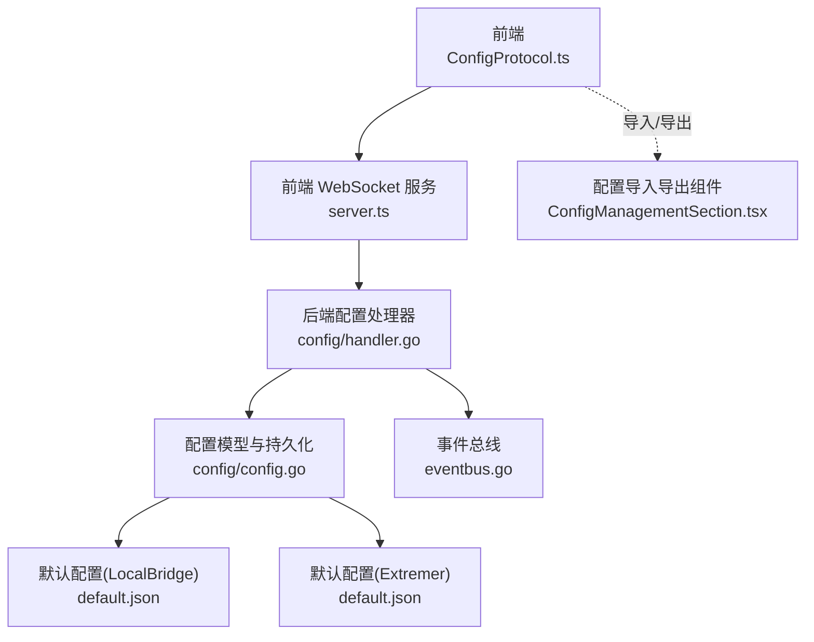
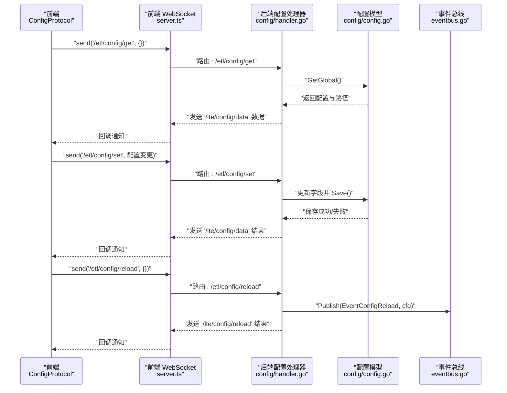
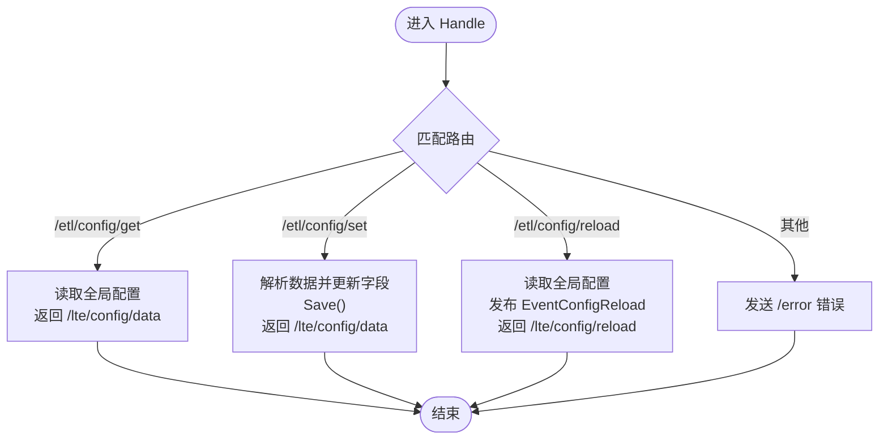
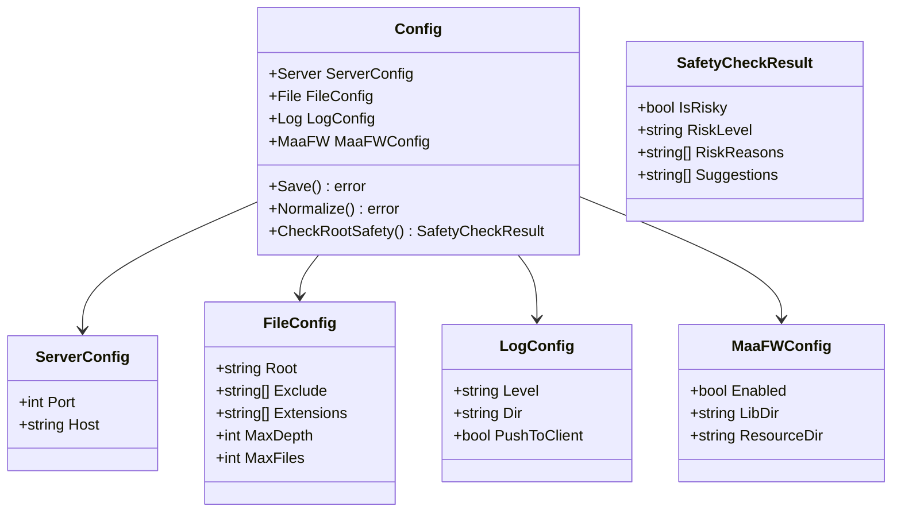
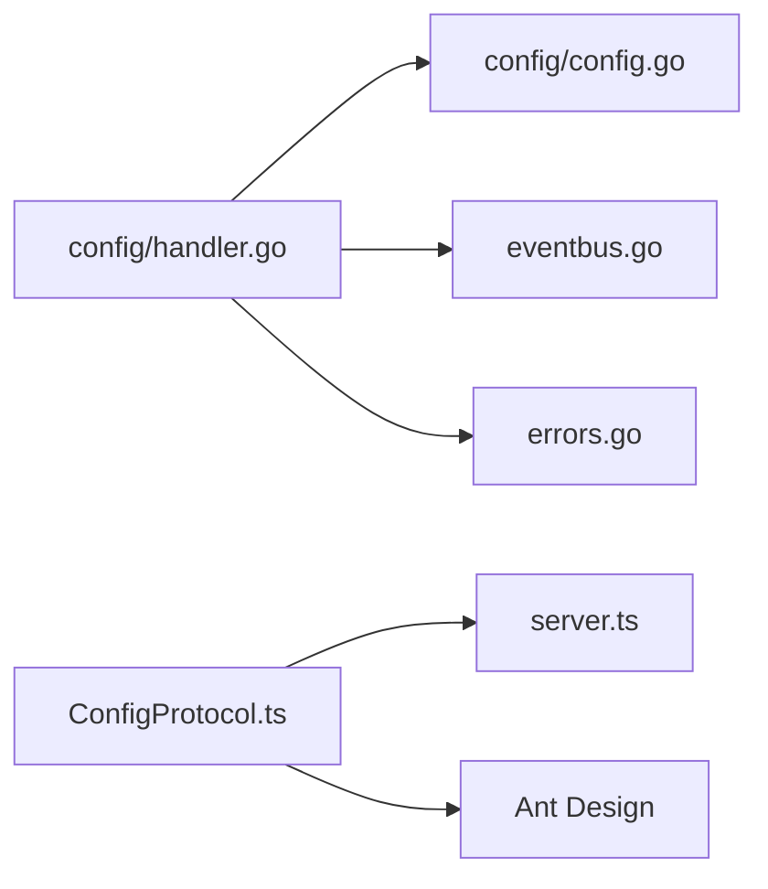

# 配置API

<cite>
**本文引用的文件**
- [LocalBridge 内部协议配置处理器](file://LocalBridge/internal/protocol/config/handler.go)
- [LocalBridge 配置模型与持久化](file://LocalBridge/internal/config/config.go)
- [前端配置协议封装](file://src/services/protocols/ConfigProtocol.ts)
- [前端 WebSocket 服务与协议注册](file://src/services/server.ts)
- [默认配置（LocalBridge）](file://LocalBridge/config/default.json)
- [默认配置（Extremer）](file://Extremer/config/default.json)
- [事件总线（配置重载）](file://LocalBridge/internal/eventbus/eventbus.go)
- [配置导入导出（前端）](file://src/components/panels/config/ConfigManagementSection.tsx)
- [配置安全检查](file://LocalBridge/internal/config/config.go)
- [Extremer 配置校验](file://Extremer/app.go)
- [前端配置表单（日志/MaaFW）](file://src/components/modals/BackendConfigModal.tsx)
- [错误定义（请求无效）](file://LocalBridge/internal/errors/errors.go)
</cite>

## 目录
1. [简介](#简介)
2. [项目结构](#项目结构)
3. [核心组件](#核心组件)
4. [架构总览](#架构总览)
5. [详细组件分析](#详细组件分析)
6. [依赖关系分析](#依赖关系分析)
7. [性能考量](#性能考量)
8. [故障排查指南](#故障排查指南)
9. [结论](#结论)
10. [附录](#附录)

## 简介
本文件面向 MaaPipelineEditor 的“配置API”，系统性梳理后端配置协议、前端协议封装、配置模型与持久化、以及导入导出与安全检查机制。重点覆盖以下能力：
- 配置获取：当前配置查询、默认配置来源、配置验证（安全检查）
- 配置更新：单字段/多字段更新、批量更新、保存与生效策略
- 存储机制：内存单例、Viper 默认值与持久化、路径规范化与校验
- 热重载：内部重载触发与事件广播
- 格式规范：JSON Schema 约束、字段约束、默认值
- 变更通知：前端回调、消息推送、错误码
- 冲突与回滚：当前实现未提供自动回滚，建议采用“备份+手动恢复”策略
- API 示例与错误处理：通过路由与消息结构说明调用方式与异常场景

## 项目结构
围绕配置API的关键文件分布如下：
- 后端协议与处理：LocalBridge/internal/protocol/config/handler.go
- 配置模型与持久化：LocalBridge/internal/config/config.go
- 事件总线：LocalBridge/internal/eventbus/eventbus.go
- 前端协议封装与WebSocket：src/services/protocols/ConfigProtocol.ts、src/services/server.ts
- 默认配置：LocalBridge/config/default.json、Extremer/config/default.json
- 导入导出：src/components/panels/config/ConfigManagementSection.tsx
- 安全检查与校验：LocalBridge/internal/config/config.go、Extremer/app.go
- 错误定义：LocalBridge/internal/errors/errors.go

图表来源
- [LocalBridge 内部协议配置处理器:26-47](file://LocalBridge/internal/protocol/config/handler.go#L26-L47)
- [LocalBridge 配置模型与持久化:54-95](file://LocalBridge/internal/config/config.go#L54-L95)
- [前端配置协议封装:60-70](file://src/services/protocols/ConfigProtocol.ts#L60-L70)
- [前端 WebSocket 服务与协议注册:358-369](file://src/services/server.ts#L358-L369)
- [默认配置（LocalBridge）:1-29](file://LocalBridge/config/default.json#L1-L29)
- [默认配置（Extremer）:1-34](file://Extremer/config/default.json#L1-L34)
- [事件总线（配置重载）:66-82](file://LocalBridge/internal/eventbus/eventbus.go#L66-L82)
- [配置导入导出（前端）:27-102](file://src/components/panels/config/ConfigManagementSection.tsx#L27-L102)

章节来源
- [LocalBridge 内部协议配置处理器:26-47](file://LocalBridge/internal/protocol/config/handler.go#L26-L47)
- [LocalBridge 配置模型与持久化:54-95](file://LocalBridge/internal/config/config.go#L54-L95)
- [前端配置协议封装:60-70](file://src/services/protocols/ConfigProtocol.ts#L60-L70)
- [前端 WebSocket 服务与协议注册:358-369](file://src/services/server.ts#L358-L369)
- [默认配置（LocalBridge）:1-29](file://LocalBridge/config/default.json#L1-L29)
- [默认配置（Extremer）:1-34](file://Extremer/config/default.json#L1-L34)
- [事件总线（配置重载）:66-82](file://LocalBridge/internal/eventbus/eventbus.go#L66-L82)
- [配置导入导出（前端）:27-102](file://src/components/panels/config/ConfigManagementSection.tsx#L27-L102)

## 核心组件
- 后端配置处理器：负责路由分发、配置获取、设置、重载，并向客户端发送统一消息结构。
- 配置模型与持久化：定义配置结构体、默认值、路径规范化、保存逻辑、安全检查。
- 事件总线：发布“配置重载”事件，供订阅者同步状态。
- 前端协议封装：封装 WebSocket 路由、回调注册、错误提示与成功提示。
- 默认配置：Viper 默认值与文件默认值共同构成初始配置。
- 导入导出：前端提供配置导出/导入 UI，支持自定义模板同步。

章节来源
- [LocalBridge 内部协议配置处理器:12-47](file://LocalBridge/internal/protocol/config/handler.go#L12-L47)
- [LocalBridge 配置模型与持久化:42-48](file://LocalBridge/internal/config/config.go#L42-L48)
- [事件总线（配置重载）:74-82](file://LocalBridge/internal/eventbus/eventbus.go#L74-L82)
- [前端配置协议封装:46-70](file://src/services/protocols/ConfigProtocol.ts#L46-L70)
- [默认配置（LocalBridge）:1-29](file://LocalBridge/config/default.json#L1-L29)
- [默认配置（Extremer）:1-34](file://Extremer/config/default.json#L1-L34)
- [配置导入导出（前端）:27-102](file://src/components/panels/config/ConfigManagementSection.tsx#L27-L102)

## 架构总览
后端通过 WebSocket 路由与前端交互，前端通过协议封装统一处理消息与回调。配置更新会落盘并可触发内部重载事件。

图表来源
- [LocalBridge 内部协议配置处理器:26-47](file://LocalBridge/internal/protocol/config/handler.go#L26-L47)
- [LocalBridge 配置模型与持久化:54-95](file://LocalBridge/internal/config/config.go#L54-L95)
- [事件总线（配置重载）:74-82](file://LocalBridge/internal/eventbus/eventbus.go#L74-L82)
- [前端配置协议封装:128-161](file://src/services/protocols/ConfigProtocol.ts#L128-L161)
- [前端 WebSocket 服务与协议注册:358-369](file://src/services/server.ts#L358-L369)

## 详细组件分析

### 后端配置处理器（路由与业务）
- 路由前缀：/etl/config/
- 支持路由：
  - /etl/config/get：返回当前配置与配置文件路径
  - /etl/config/set：根据传入字段更新配置并保存
  - /etl/config/reload：触发内部重载并广播事件
- 错误处理：未知路由、请求数据格式错误、保存失败、未加载配置等均通过统一错误消息返回。

图表来源
- [LocalBridge 内部协议配置处理器:26-47](file://LocalBridge/internal/protocol/config/handler.go#L26-L47)
- [LocalBridge 内部协议配置处理器:50-68](file://LocalBridge/internal/protocol/config/handler.go#L50-L68)
- [LocalBridge 内部协议配置处理器:70-171](file://LocalBridge/internal/protocol/config/handler.go#L70-L171)
- [LocalBridge 内部协议配置处理器:173-204](file://LocalBridge/internal/protocol/config/handler.go#L173-L204)

章节来源
- [LocalBridge 内部协议配置处理器:26-47](file://LocalBridge/internal/protocol/config/handler.go#L26-L47)
- [LocalBridge 内部协议配置处理器:50-68](file://LocalBridge/internal/protocol/config/handler.go#L50-L68)
- [LocalBridge 内部协议配置处理器:70-171](file://LocalBridge/internal/protocol/config/handler.go#L70-L171)
- [LocalBridge 内部协议配置处理器:173-204](file://LocalBridge/internal/protocol/config/handler.go#L173-L204)
- [错误定义（请求无效）:133-140](file://LocalBridge/internal/errors/errors.go#L133-L140)

### 配置模型与持久化（数据结构与默认值）
- 配置结构体：包含 server、file、log、maafw 四个子配置
- 默认值来源：
  - Viper 默认值：server.port/host、file.exclude/extensions/max_depth/max_files、log.level/dir/push_to_client、maafw.enabled/lib_dir/resource_dir
  - 文件默认值：LocalBridge/config/default.json、Extremer/config/default.json
- 路径规范化：相对路径转绝对路径、根目录存在性校验、日志目录规范化
- 保存逻辑：JSON 序列化并写入配置文件
- 安全检查：根目录高风险检测、驱动器根目录检测、扫描限制缺失检测

图表来源
- [LocalBridge 配置模型与持久化:13-48](file://LocalBridge/internal/config/config.go#L13-L48)
- [LocalBridge 配置模型与持久化:226-296](file://LocalBridge/internal/config/config.go#L226-L296)

章节来源
- [LocalBridge 配置模型与持久化:42-48](file://LocalBridge/internal/config/config.go#L42-L48)
- [LocalBridge 配置模型与持久化:103-123](file://LocalBridge/internal/config/config.go#L103-L123)
- [LocalBridge 配置模型与持久化:125-153](file://LocalBridge/internal/config/config.go#L125-L153)
- [LocalBridge 配置模型与持久化:195-212](file://LocalBridge/internal/config/config.go#L195-L212)
- [LocalBridge 配置模型与持久化:234-296](file://LocalBridge/internal/config/config.go#L234-L296)
- [默认配置（LocalBridge）:1-29](file://LocalBridge/config/default.json#L1-L29)
- [默认配置（Extremer）:1-34](file://Extremer/config/default.json#L1-L34)

### 事件总线与热重载
- 事件类型：EventConfigReload
- 处理流程：后端收到 /etl/config/reload 后，读取全局配置并发布事件；订阅者可据此刷新内部状态
- 前端回调：前端注册 /lte/config/reload 路由，收到成功响应后触发回调

章节来源
- [事件总线（配置重载）:74-82](file://LocalBridge/internal/eventbus/eventbus.go#L74-L82)
- [LocalBridge 内部协议配置处理器:173-204](file://LocalBridge/internal/protocol/config/handler.go#L173-L204)
- [前端配置协议封装:67-69](file://src/services/protocols/ConfigProtocol.ts#L67-L69)
- [前端配置协议封装:104-122](file://src/services/protocols/ConfigProtocol.ts#L104-L122)

### 前端协议封装与消息结构
- 路由注册：
  - 接收：/lte/config/data、/lte/config/reload
  - 发送：/etl/config/get、/etl/config/set、/etl/config/reload
- 数据结构：
  - /lte/config/data：包含 success、config、config_path、message（可选）
  - /lte/config/reload：包含 success、error（可选）
- 回调注册：onConfigData、onReload，返回注销函数

章节来源
- [前端配置协议封装:60-70](file://src/services/protocols/ConfigProtocol.ts#L60-L70)
- [前端配置协议封装:128-161](file://src/services/protocols/ConfigProtocol.ts#L128-L161)
- [前端配置协议封装:168-195](file://src/services/protocols/ConfigProtocol.ts#L168-L195)

### 配置导入与导出（前端）
- 导出：收集可导出配置与自定义模板，生成 JSON 并下载
- 导入：解析 JSON，校验结构，替换当前配置；可选导入自定义模板
- UI 位置：配置面板中的“导出/导入”区域

章节来源
- [配置导入导出（前端）:27-102](file://src/components/panels/config/ConfigManagementSection.tsx#L27-L102)

### 配置安全检查与校验
- 根目录安全检查：高风险系统目录、驱动器根目录、用户主目录检测；扫描深度与文件数量限制缺失检测
- Extremer 配置校验：校验 MaaFW 的 lib_dir 与 resource_dir 是否有效，若无效则返回 false（非致命错误）

章节来源
- [LocalBridge 配置模型与持久化:234-296](file://LocalBridge/internal/config/config.go#L234-L296)
- [Extremer 配置校验:313-351](file://Extremer/app.go#L313-L351)

## 依赖关系分析
- 后端配置处理器依赖：
  - 配置模型（读取/保存/规范化）
  - 事件总线（发布重载事件）
  - 错误模块（统一错误码）
- 前端协议依赖：
  - WebSocket 服务（注册路由、发送消息）
  - Ant Design UI（消息提示）

图表来源
- [LocalBridge 内部协议配置处理器:3-10](file://LocalBridge/internal/protocol/config/handler.go#L3-L10)
- [LocalBridge 配置模型与持久化:54-95](file://LocalBridge/internal/config/config.go#L54-L95)
- [事件总线（配置重载）:66-82](file://LocalBridge/internal/eventbus/eventbus.go#L66-L82)
- [错误定义（请求无效）:133-140](file://LocalBridge/internal/errors/errors.go#L133-L140)
- [前端配置协议封装:60-70](file://src/services/protocols/ConfigProtocol.ts#L60-L70)
- [前端 WebSocket 服务与协议注册:358-369](file://src/services/server.ts#L358-L369)

章节来源
- [LocalBridge 内部协议配置处理器:3-10](file://LocalBridge/internal/protocol/config/handler.go#L3-L10)
- [LocalBridge 配置模型与持久化:54-95](file://LocalBridge/internal/config/config.go#L54-L95)
- [事件总线（配置重载）:66-82](file://LocalBridge/internal/eventbus/eventbus.go#L66-L82)
- [错误定义（请求无效）:133-140](file://LocalBridge/internal/errors/errors.go#L133-L140)
- [前端配置协议封装:60-70](file://src/services/protocols/ConfigProtocol.ts#L60-L70)
- [前端 WebSocket 服务与协议注册:358-369](file://src/services/server.ts#L358-L369)

## 性能考量
- 配置读取：内存单例，Viper 解析一次，后续读取 O(1)
- 配置保存：JSON 序列化 + 文件写入，建议避免频繁写入
- 路径规范化：仅在加载/覆盖时进行，减少运行期开销
- 事件广播：异步发布（可扩展）有利于降低阻塞

## 故障排查指南
- 未知路由：后端返回 /error，前端收到错误消息
- 请求数据格式错误：/etl/config/set 传入数据非 map[string]interface{} 时触发
- 保存失败：配置保存写文件失败，返回 SAVE_FAILED
- 配置未加载：全局配置为空，返回 CONFIG_NOT_LOADED
- 无有效更新：/etl/config/set 未识别任何字段，返回 NO_CHANGES
- 连接问题：前端 WebSocket 连接超时或错误，弹出提示并引导查看文档

章节来源
- [LocalBridge 内部协议配置处理器:41-44](file://LocalBridge/internal/protocol/config/handler.go#L41-L44)
- [LocalBridge 内部协议配置处理器:72-76](file://LocalBridge/internal/protocol/config/handler.go#L72-L76)
- [LocalBridge 内部协议配置处理器:153-157](file://LocalBridge/internal/protocol/config/handler.go#L153-L157)
- [LocalBridge 内部协议配置处理器:52-55](file://LocalBridge/internal/protocol/config/handler.go#L52-L55)
- [LocalBridge 内部协议配置处理器:147-150](file://LocalBridge/internal/protocol/config/handler.go#L147-L150)
- [前端 WebSocket 服务与协议注册:127-159](file://src/services/server.ts#L127-L159)
- [错误定义（请求无效）:133-140](file://LocalBridge/internal/errors/errors.go#L133-L140)

## 结论
本配置API以 WebSocket 路由为核心，结合后端配置模型与前端协议封装，实现了配置的获取、更新、重载与导入导出。默认值与路径规范化保证了初始可用性与安全性，事件总线支持热重载。当前未提供自动回滚，建议采用“备份+手动恢复”的策略保障变更安全。

## 附录

### API 调用示例（步骤说明）
- 获取当前配置
  - 前端发送：/etl/config/get
  - 后端返回：/lte/config/data（包含 success、config、config_path）
- 更新配置
  - 前端发送：/etl/config/set（携带 server、file、log、maafw 字段）
  - 后端保存并返回：/lte/config/data（含 message 提示）
- 重载配置
  - 前端发送：/etl/config/reload
  - 后端发布事件并返回：/lte/config/reload（success=true）

章节来源
- [前端配置协议封装:128-161](file://src/services/protocols/ConfigProtocol.ts#L128-L161)
- [LocalBridge 内部协议配置处理器:50-68](file://LocalBridge/internal/protocol/config/handler.go#L50-L68)
- [LocalBridge 内部协议配置处理器:70-171](file://LocalBridge/internal/protocol/config/handler.go#L70-L171)
- [LocalBridge 内部协议配置处理器:173-204](file://LocalBridge/internal/protocol/config/handler.go#L173-L204)

### 配置格式规范（字段与默认值）
- server
  - 字段：port（整数）、host（字符串）
  - 默认值：LocalBridge 默认 9066、localhost；Extremer 默认同上
- file
  - 字段：root（字符串）、exclude（字符串数组）、extensions（字符串数组）、max_depth（整数）、max_files（整数）
  - 默认值：exclude、extensions、max_depth、max_files（参考 default.json）
- log
  - 字段：level（字符串）、dir（字符串）、push_to_client（布尔）
  - 默认值：level、dir、push_to_client（参考 default.json）
- maafw
  - 字段：enabled（布尔）、lib_dir（字符串）、resource_dir（字符串）
  - 默认值：enabled、lib_dir、resource_dir（参考 default.json）

章节来源
- [LocalBridge 配置模型与持久化:13-48](file://LocalBridge/internal/config/config.go#L13-L48)
- [默认配置（LocalBridge）:1-29](file://LocalBridge/config/default.json#L1-L29)
- [默认配置（Extremer）:1-34](file://Extremer/config/default.json#L1-L34)

### 配置变更通知与冲突解决
- 通知机制：后端通过 /lte/config/data 与 /lte/config/reload 推送；前端 onConfigData/onReload 回调
- 冲突解决：当前未提供自动冲突合并；建议在前端 UI 中增加“冲突提示”并在保存前进行本地校验
- 回滚策略：当前未提供自动回滚；建议在保存前备份配置文件，或在前端提供“撤销”按钮（基于内存状态）

章节来源
- [前端配置协议封装:168-195](file://src/services/protocols/ConfigProtocol.ts#L168-L195)
- [LocalBridge 内部协议配置处理器:173-204](file://LocalBridge/internal/protocol/config/handler.go#L173-L204)

### 安全检查与合规建议
- 根目录安全检查：避免扫描系统目录、驱动器根目录、用户主目录
- 建议：设置合理的 max_depth 与 max_files，避免性能与安全风险
- Extremer：校验 MaaFW 路径有效性，若无效需用户提供正确路径或使用默认路径

章节来源
- [LocalBridge 配置模型与持久化:234-296](file://LocalBridge/internal/config/config.go#L234-L296)
- [Extremer 配置校验:313-351](file://Extremer/app.go#L313-L351)