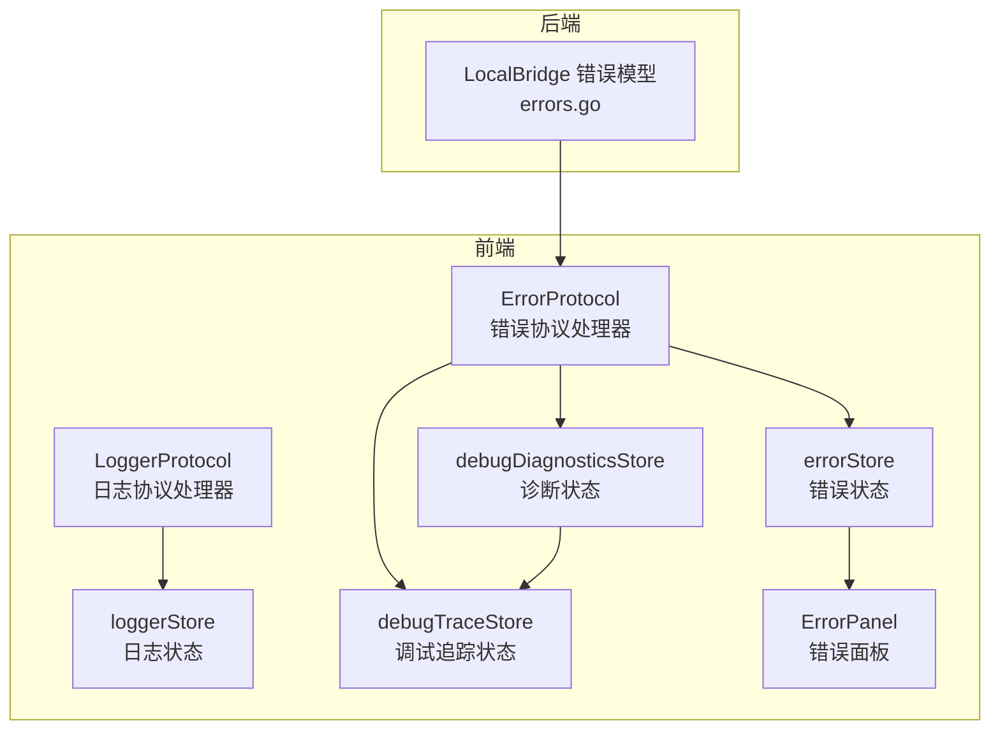
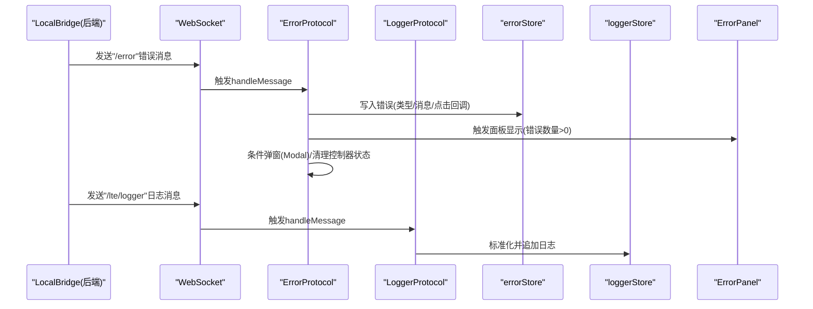
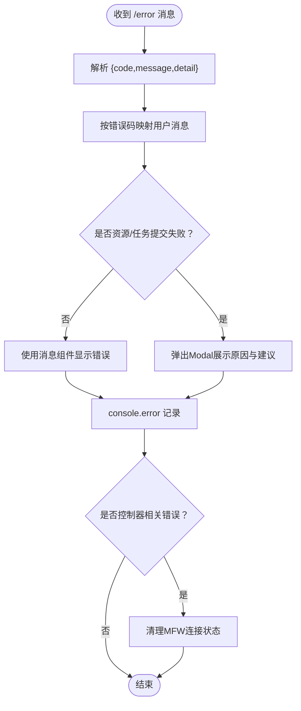
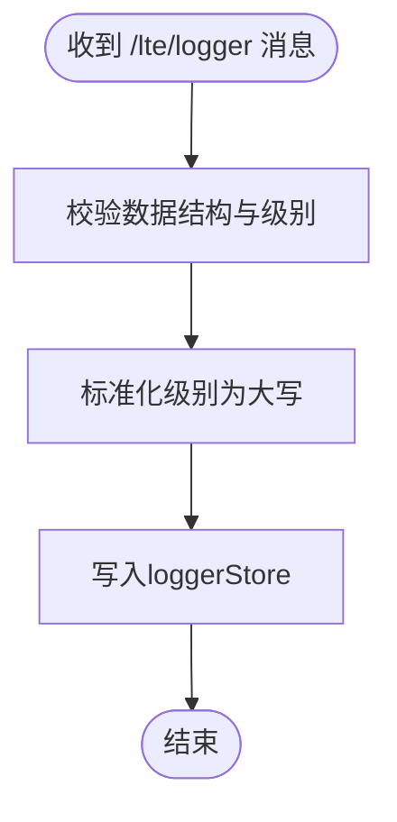
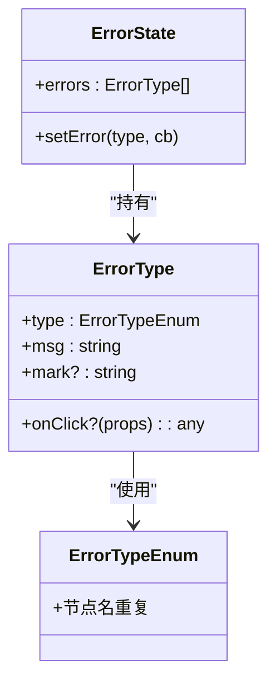
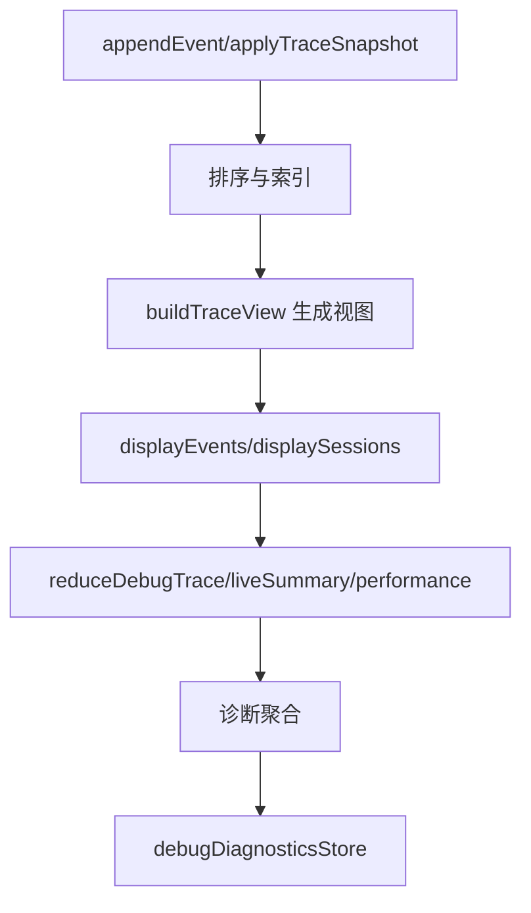
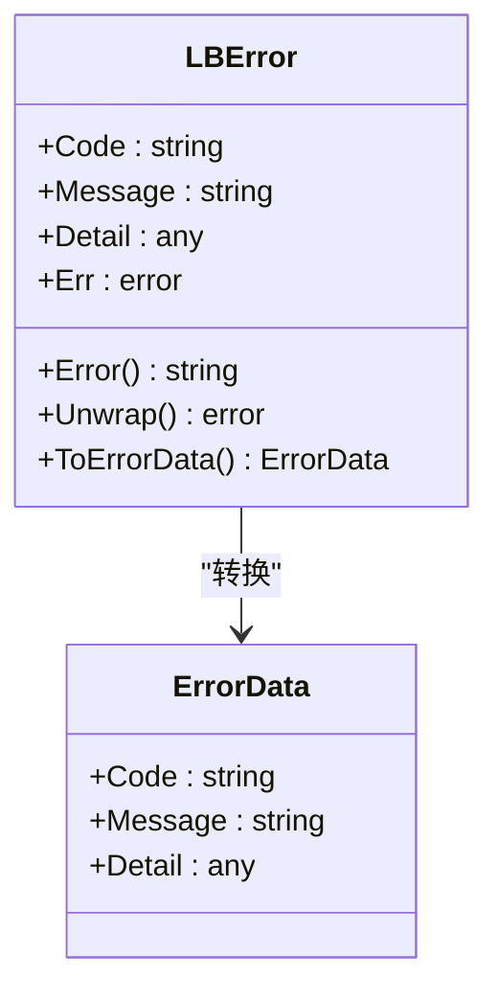
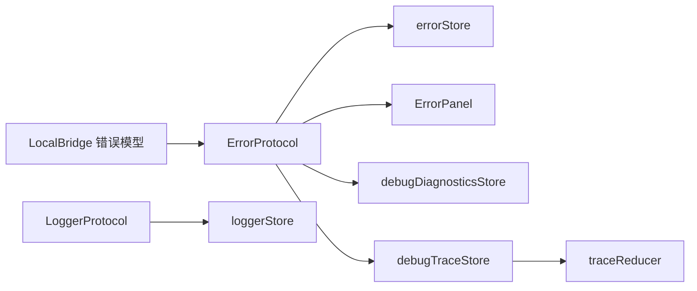

# 错误处理

<cite>
**本文引用的文件**   
- [ErrorProtocol.ts](file://src/services/protocols/ErrorProtocol.ts)
- [LoggerProtocol.ts](file://src/services/protocols/LoggerProtocol.ts)
- [errorStore.ts](file://src/stores/errorStore.ts)
- [loggerStore.ts](file://src/stores/loggerStore.ts)
- [ErrorPanel.tsx](file://src/components/panels/main/ErrorPanel.tsx)
- [debugDiagnosticsStore.ts](file://src/stores/debugDiagnosticsStore.ts)
- [debugTraceStore.ts](file://src/stores/debugTraceStore.ts)
- [traceReducer.ts](file://src/features/debug/traceReducer.ts)
- [errors.go](file://LocalBridge/internal/errors/errors.go)
- [Error Handling.md](file://dev/instructions/maafw-golang-binding/Error Handling.md)
</cite>

## 目录
1. [简介](#简介)
2. [项目结构](#项目结构)
3. [核心组件](#核心组件)
4. [架构总览](#架构总览)
5. [详细组件分析](#详细组件分析)
6. [依赖关系分析](#依赖关系分析)
7. [性能考量](#性能考量)
8. [故障排查指南](#故障排查指南)
9. [结论](#结论)
10. [附录](#附录)

## 简介
本文件为“错误处理系统”的完整API参考文档，覆盖以下主题：
- 错误代码分类与定义规范
- 错误协议的消息格式与传播机制
- 错误存储与状态管理
- 错误恢复与重试策略API规范
- 自定义错误类型的注册与处理流程
- 错误日志记录与诊断信息获取
- 最佳实践与调试技巧

## 项目结构
错误处理系统由前端协议处理器、状态存储、UI面板以及后端错误模型共同组成，形成“接收—解析—展示—持久化”的闭环。

**图表来源**
- [ErrorProtocol.ts:1-121](file://src/services/protocols/ErrorProtocol.ts#L1-L121)
- [LoggerProtocol.ts:1-58](file://src/services/protocols/LoggerProtocol.ts#L1-L58)
- [errorStore.ts:1-39](file://src/stores/errorStore.ts#L1-L39)
- [loggerStore.ts:1-46](file://src/stores/loggerStore.ts#L1-L46)
- [debugDiagnosticsStore.ts:1-49](file://src/stores/debugDiagnosticsStore.ts#L1-L49)
- [debugTraceStore.ts:1-451](file://src/stores/debugTraceStore.ts#L1-L451)
- [ErrorPanel.tsx:1-38](file://src/components/panels/main/ErrorPanel.tsx#L1-L38)
- [errors.go:1-67](file://LocalBridge/internal/errors/errors.go#L1-L67)

**章节来源**
- [ErrorProtocol.ts:1-121](file://src/services/protocols/ErrorProtocol.ts#L1-L121)
- [LoggerProtocol.ts:1-58](file://src/services/protocols/LoggerProtocol.ts#L1-L58)
- [errorStore.ts:1-39](file://src/stores/errorStore.ts#L1-L39)
- [loggerStore.ts:1-46](file://src/stores/loggerStore.ts#L1-L46)
- [debugDiagnosticsStore.ts:1-49](file://src/stores/debugDiagnosticsStore.ts#L1-L49)
- [debugTraceStore.ts:1-451](file://src/stores/debugTraceStore.ts#L1-L451)
- [ErrorPanel.tsx:1-38](file://src/components/panels/main/ErrorPanel.tsx#L1-L38)
- [errors.go:1-67](file://LocalBridge/internal/errors/errors.go#L1-L67)

## 核心组件
- 错误协议处理器：统一接收后端错误消息，进行映射、弹窗与状态清理。
- 日志协议处理器：接收后端推送日志，标准化并写入日志状态。
- 错误状态存储：集中管理应用内错误类型与消息，支持按类型过滤与更新。
- 日志状态存储：维护日志列表、展开状态与容量控制。
- 诊断与追踪状态：聚合调试事件，生成诊断与运行摘要。
- 错误面板：展示当前错误列表，驱动UI显隐。
- 后端错误模型：定义错误码、封装错误对象与转换为传输结构。

**章节来源**
- [ErrorProtocol.ts:1-121](file://src/services/protocols/ErrorProtocol.ts#L1-L121)
- [LoggerProtocol.ts:1-58](file://src/services/protocols/LoggerProtocol.ts#L1-L58)
- [errorStore.ts:1-39](file://src/stores/errorStore.ts#L1-L39)
- [loggerStore.ts:1-46](file://src/stores/loggerStore.ts#L1-L46)
- [debugDiagnosticsStore.ts:1-49](file://src/stores/debugDiagnosticsStore.ts#L1-L49)
- [debugTraceStore.ts:1-451](file://src/stores/debugTraceStore.ts#L1-L451)
- [ErrorPanel.tsx:1-38](file://src/components/panels/main/ErrorPanel.tsx#L1-L38)
- [errors.go:1-67](file://LocalBridge/internal/errors/errors.go#L1-L67)

## 架构总览
错误处理的端到端流程如下：

**图表来源**
- [ErrorProtocol.ts:20-79](file://src/services/protocols/ErrorProtocol.ts#L20-L79)
- [LoggerProtocol.ts:25-56](file://src/services/protocols/LoggerProtocol.ts#L25-L56)
- [errorStore.ts:17-38](file://src/stores/errorStore.ts#L17-L38)
- [loggerStore.ts:11-45](file://src/stores/loggerStore.ts#L11-L45)
- [ErrorPanel.tsx:8-18](file://src/components/panels/main/ErrorPanel.tsx#L8-L18)

## 详细组件分析

### 错误协议处理器（ErrorProtocol）
职责：
- 注册"/error"路由，接收后端错误消息。
- 将错误码映射为用户可读消息；对特定错误触发Modal弹窗。
- 在控制器类错误时，调用MFW状态清理函数。
- 记录控制台错误日志，便于定位问题。

关键行为：
- 消息映射：根据code选择预设文案或回退到message/detail。
- 弹窗策略：针对资源加载与任务提交失败使用Modal展示详细原因与建议。
- 状态联动：控制器错误时清空连接状态，避免后续操作误导。

**图表来源**
- [ErrorProtocol.ts:27-79](file://src/services/protocols/ErrorProtocol.ts#L27-L79)

**章节来源**
- [ErrorProtocol.ts:1-121](file://src/services/protocols/ErrorProtocol.ts#L1-L121)

### 日志协议处理器（LoggerProtocol）
职责：
- 注册"/lte/logger"路由，接收后端日志消息。
- 标准化日志级别（INFO/WARN/ERROR），默认模块名与时间戳。
- 写入loggerStore，供日志面板消费。

**图表来源**
- [LoggerProtocol.ts:32-56](file://src/services/protocols/LoggerProtocol.ts#L32-L56)

**章节来源**
- [LoggerProtocol.ts:1-58](file://src/services/protocols/LoggerProtocol.ts#L1-L58)

### 错误状态存储（errorStore）
职责：
- 定义错误类型枚举与错误条目结构。
- 提供按类型查询与批量更新能力。
- 通过回调函数计算新错误集合，替换同类型旧错误，保证幂等。

**图表来源**
- [errorStore.ts:3-38](file://src/stores/errorStore.ts#L3-L38)

**章节来源**
- [errorStore.ts:1-39](file://src/stores/errorStore.ts#L1-L39)

### 日志状态存储（loggerStore）
职责：
- 维护日志列表、展开状态与最大容量。
- 追加日志时生成唯一ID，自动裁剪超出容量的日志。

**章节来源**
- [loggerStore.ts:1-46](file://src/stores/loggerStore.ts#L1-L46)

### 诊断与追踪状态（debugDiagnosticsStore / debugTraceStore / traceReducer）
职责：
- debugDiagnosticsStore：从调试事件构建诊断项，支持设置预检诊断、追加事件与清空。
- debugTraceStore：维护调试事件、会话、性能汇总与回放状态，提供视图构建与选择逻辑。
- traceReducer：将事件流规约为摘要（状态、节点/边集合、诊断、制品等）。

**图表来源**
- [debugTraceStore.ts:270-450](file://src/stores/debugTraceStore.ts#L270-L450)
- [traceReducer.ts:184-317](file://src/features/debug/traceReducer.ts#L184-L317)
- [debugDiagnosticsStore.ts:11-32](file://src/stores/debugDiagnosticsStore.ts#L11-L32)

**章节来源**
- [debugDiagnosticsStore.ts:1-49](file://src/stores/debugDiagnosticsStore.ts#L1-L49)
- [debugTraceStore.ts:1-451](file://src/stores/debugTraceStore.ts#L1-L451)
- [traceReducer.ts:1-570](file://src/features/debug/traceReducer.ts#L1-L570)

### 错误面板（ErrorPanel）
职责：
- 读取errorStore中的错误列表，动态切换面板显隐。
- 展示错误序号、类型与消息。

**章节来源**
- [ErrorPanel.tsx:1-38](file://src/components/panels/main/ErrorPanel.tsx#L1-L38)

### 后端错误模型（LocalBridge）
职责：
- 定义标准错误码常量。
- 封装LBError，支持包装原始错误与转换为传输结构。
- 提供New/Wrap工厂方法。

**图表来源**
- [errors.go:23-50](file://LocalBridge/internal/errors/errors.go#L23-L50)

**章节来源**
- [errors.go:1-67](file://LocalBridge/internal/errors/errors.go#L1-L67)

## 依赖关系分析
- 前端协议处理器依赖各自的状态存储与UI组件。
- 错误面板依赖errorStore以决定显示。
- 诊断与追踪状态相互协作，traceReducer为两者提供统一的摘要能力。
- 后端错误模型通过协议消息被前端消费，形成闭环。

**图表来源**
- [ErrorProtocol.ts:1-121](file://src/services/protocols/ErrorProtocol.ts#L1-L121)
- [LoggerProtocol.ts:1-58](file://src/services/protocols/LoggerProtocol.ts#L1-L58)
- [errorStore.ts:1-39](file://src/stores/errorStore.ts#L1-L39)
- [loggerStore.ts:1-46](file://src/stores/loggerStore.ts#L1-L46)
- [debugDiagnosticsStore.ts:1-49](file://src/stores/debugDiagnosticsStore.ts#L1-L49)
- [debugTraceStore.ts:1-451](file://src/stores/debugTraceStore.ts#L1-L451)
- [traceReducer.ts:1-570](file://src/features/debug/traceReducer.ts#L1-L570)
- [errors.go:1-67](file://LocalBridge/internal/errors/errors.go#L1-L67)

**章节来源**
- [ErrorProtocol.ts:1-121](file://src/services/protocols/ErrorProtocol.ts#L1-L121)
- [LoggerProtocol.ts:1-58](file://src/services/protocols/LoggerProtocol.ts#L1-L58)
- [errorStore.ts:1-39](file://src/stores/errorStore.ts#L1-L39)
- [loggerStore.ts:1-46](file://src/stores/loggerStore.ts#L1-L46)
- [debugDiagnosticsStore.ts:1-49](file://src/stores/debugDiagnosticsStore.ts#L1-L49)
- [debugTraceStore.ts:1-451](file://src/stores/debugTraceStore.ts#L1-L451)
- [traceReducer.ts:1-570](file://src/features/debug/traceReducer.ts#L1-L570)
- [errors.go:1-67](file://LocalBridge/internal/errors/errors.go#L1-L67)

## 性能考量
- 日志存储采用固定容量裁剪，避免无限增长导致内存压力。
- 事件排序与索引在调试追踪中按需构建，减少重复计算。
- 错误消息映射与弹窗仅在必要时触发，避免频繁UI更新。

[本节为通用指导，不直接分析具体文件]

## 故障排查指南
- 查看错误面板：当错误数量大于0时自动显示，便于快速定位。
- 使用日志面板：LoggerProtocol标准化级别与内容，结合时间戳定位问题发生点。
- 诊断与追踪：通过debugDiagnosticsStore与debugTraceStore查看诊断与运行摘要，辅助复盘。
- 控制器错误：若出现控制器相关错误，系统会自动清理连接状态，避免后续误用。

**章节来源**
- [ErrorPanel.tsx:8-18](file://src/components/panels/main/ErrorPanel.tsx#L8-L18)
- [LoggerProtocol.ts:32-56](file://src/services/protocols/LoggerProtocol.ts#L32-L56)
- [debugDiagnosticsStore.ts:11-32](file://src/stores/debugDiagnosticsStore.ts#L11-L32)
- [debugTraceStore.ts:270-450](file://src/stores/debugTraceStore.ts#L270-L450)
- [ErrorProtocol.ts:69-78](file://src/services/protocols/ErrorProtocol.ts#L69-L78)

## 结论
本错误处理系统通过协议处理器、状态存储与UI组件的协同，实现了从后端错误消息到前端可视化的完整链路。配合诊断与追踪能力，能够有效支撑开发与运维场景下的问题定位与修复。

[本节为总结性内容，不直接分析具体文件]

## 附录

### 错误代码分类与定义规范
- 分类维度：文件类、MFW框架类、通用类。
- 命名规范：采用全大写蛇形命名，语义明确且与后端一致。
- 示例常量与含义：
  - 文件类：FILE_NOT_FOUND、FILE_READ_ERROR、FILE_WRITE_ERROR、FILE_NAME_CONFLICT、INVALID_JSON、PERMISSION_DENIED
  - MFW类：MFW_NOT_INITIALIZED、MFW_CONTROLLER_CREATE_FAIL、MFW_CONTROLLER_NOT_FOUND、MFW_CONTROLLER_CONNECT_FAIL、MFW_CONTROLLER_NOT_CONNECTED、MFW_DEVICE_NOT_FOUND、MFW_OCR_RESOURCE_NOT_CONFIGURED、MFW_RESOURCE_LOAD_FAILED、MFW_TASK_SUBMIT_FAILED
  - 通用类：INVALID_REQUEST、CONNECTION_FAILED、INTERNAL_ERROR

**章节来源**
- [errors.go:10-20](file://LocalBridge/internal/errors/errors.go#L10-L20)
- [ErrorProtocol.ts:31-51](file://src/services/protocols/ErrorProtocol.ts#L31-L51)

### 错误协议消息格式与传播机制
- 错误消息格式：包含code、message、detail三要素，用于映射与弹窗。
- 传播路径：后端通过WebSocket发送"/error"，前端ErrorProtocol解析并分发至errorStore与UI；同时根据错误类型决定是否弹窗与清理控制器状态。
- 日志消息格式：包含level、module、message、timestamp，前端LoggerProtocol标准化后写入loggerStore。

**章节来源**
- [ErrorProtocol.ts:27-79](file://src/services/protocols/ErrorProtocol.ts#L27-L79)
- [LoggerProtocol.ts:32-56](file://src/services/protocols/LoggerProtocol.ts#L32-L56)

### 错误存储与状态管理
- 错误存储：按类型聚合与替换，支持回调计算新错误集合并去重。
- 日志存储：容量裁剪、唯一ID生成、展开状态切换。
- 诊断与追踪：事件排序、会话构建、摘要规约、回放游标。

**章节来源**
- [errorStore.ts:17-38](file://src/stores/errorStore.ts#L17-L38)
- [loggerStore.ts:21-45](file://src/stores/loggerStore.ts#L21-L45)
- [debugTraceStore.ts:270-450](file://src/stores/debugTraceStore.ts#L270-L450)
- [traceReducer.ts:184-317](file://src/features/debug/traceReducer.ts#L184-L317)

### 错误恢复与重试策略API规范
- 立即错误检查：调用方在产生错误后立即检查，不得延迟或累积。
- 失败快速返回：错误发生时立即返回，避免状态污染。
- setter方法：仅返回错误，nil表示成功；失败时返回错误对象。
- 典型场景：
  - 资源创建失败：NewResource返回错误
  - 资产加载失败：PostBundle().Wait()返回失败状态
  - JSON序列化失败：OverridePipeline返回错误
  - 自定义动作注册冲突：RegisterCustomAction返回重复名错误
  - 节点不存在：GetNode返回错误

**章节来源**
- [Error Handling.md:23-29](file://dev/instructions/maafw-golang-binding/Error Handling.md#L23-L29)
- [Error Handling.md:154-177](file://dev/instructions/maafw-golang-binding/Error Handling.md#L154-L177)
- [Error Handling.md:866-931](file://dev/instructions/maafw-golang-binding/Error Handling.md#L866-L931)

### 自定义错误类型的注册与处理流程
- 后端：新增错误码常量与LBError包装，确保ToErrorData结构一致。
- 前端：在ErrorProtocol的消息映射表中添加对应文案；如需特殊弹窗，扩展条件分支。
- 状态：errorStore按类型更新，ErrorPanel自动显示。

**章节来源**
- [errors.go:10-20](file://LocalBridge/internal/errors/errors.go#L10-L20)
- [errors.go:44-50](file://LocalBridge/internal/errors/errors.go#L44-L50)
- [ErrorProtocol.ts:31-67](file://src/services/protocols/ErrorProtocol.ts#L31-L67)
- [errorStore.ts:13-15](file://src/stores/errorStore.ts#L13-L15)

### 错误日志记录与诊断信息获取
- 日志记录：LoggerProtocol标准化级别与内容，写入loggerStore；日志面板可展开查看。
- 诊断信息：debugDiagnosticsStore从事件提取诊断项，traceReducer生成摘要；结合ErrorProtocol的错误映射，形成完整的排障线索。

**章节来源**
- [LoggerProtocol.ts:32-56](file://src/services/protocols/LoggerProtocol.ts#L32-L56)
- [loggerStore.ts:21-45](file://src/stores/loggerStore.ts#L21-L45)
- [debugDiagnosticsStore.ts:11-32](file://src/stores/debugDiagnosticsStore.ts#L11-L32)
- [traceReducer.ts:130-154](file://src/features/debug/traceReducer.ts#L130-L154)

### 最佳实践与调试技巧
- 错误检查最佳实践：立即检查、失败快速返回、错误包装与透传。
- 调试技巧：利用traceReducer生成的摘要与回放游标，定位失败节点与候选边；结合诊断信息与日志时间线复盘。
- UI联动：控制器错误自动清理连接状态，避免误操作；错误面板自动显隐提升可观测性。

**章节来源**
- [Error Handling.md:597-607](file://dev/instructions/maafw-golang-binding/Error Handling.md#L597-L607)
- [ErrorProtocol.ts:69-78](file://src/services/protocols/ErrorProtocol.ts#L69-L78)
- [debugTraceStore.ts:338-365](file://src/stores/debugTraceStore.ts#L338-L365)
- [ErrorPanel.tsx:12-18](file://src/components/panels/main/ErrorPanel.tsx#L12-L18)