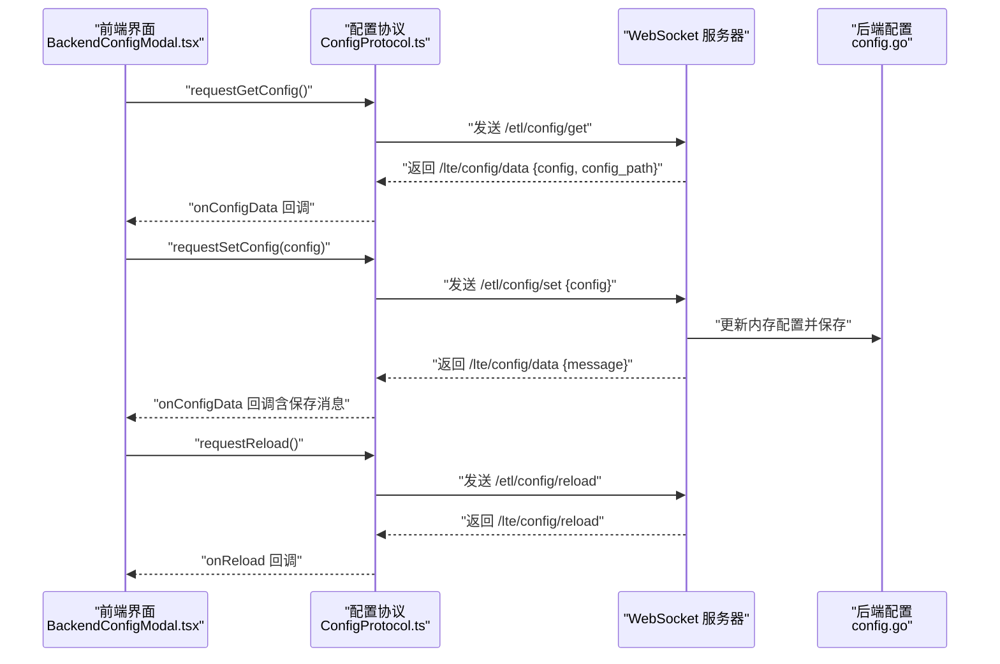
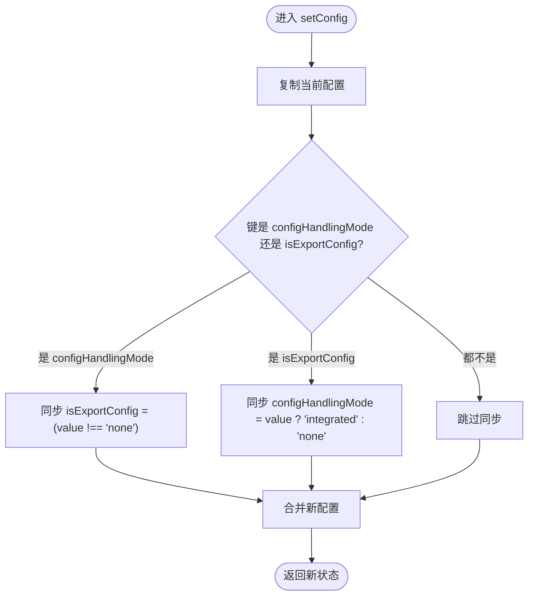
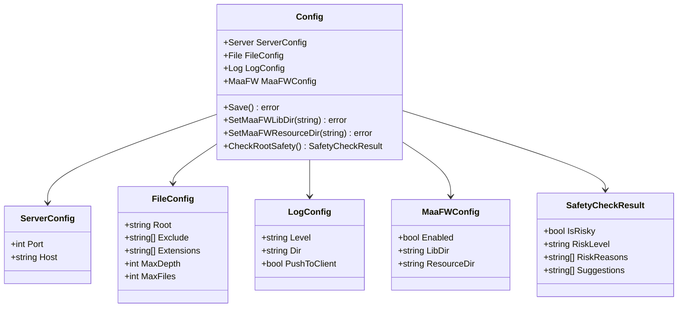
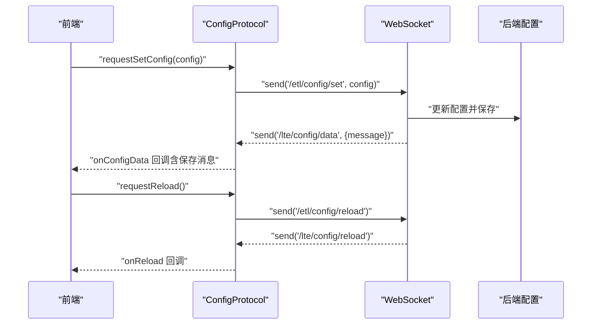
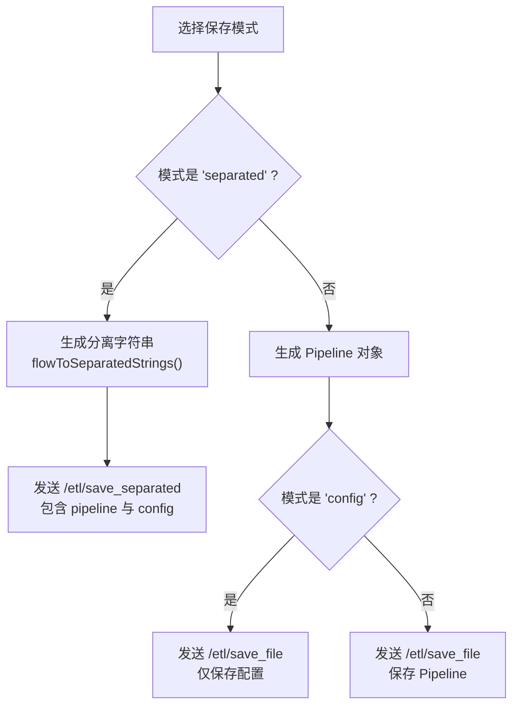
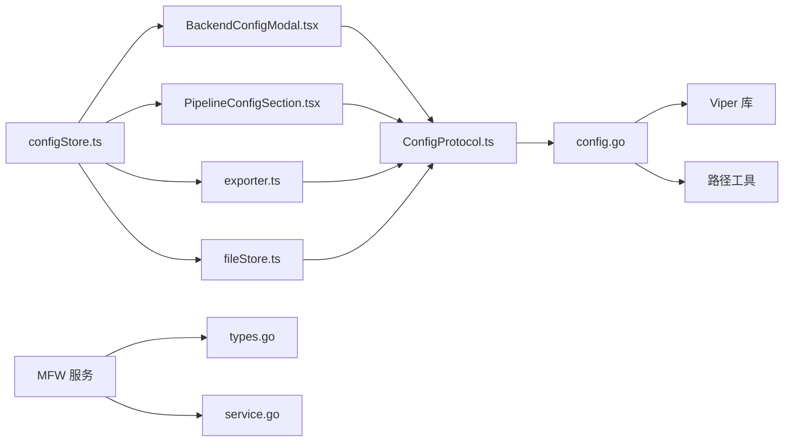

# 配置存储

<cite>
**本文档引用的文件**
- [configStore.ts](file://src/stores/configStore.ts)
- [config.go](file://LocalBridge/internal/config/config.go)
- [default.json](file://Extremer/config/default.json)
- [default.json](file://LocalBridge/config/default.json)
- [ConfigProtocol.ts](file://src/services/protocols/ConfigProtocol.ts)
- [BackendConfigModal.tsx](file://src/components/modals/BackendConfigModal.tsx)
- [PipelineConfigSection.tsx](file://src/components/panels/config/PipelineConfigSection.tsx)
- [exporter.ts](file://src/core/parser/exporter.ts)
- [fileStore.ts](file://src/stores/fileStore.ts)
- [package.json](file://package.json)
- [go.mod](file://LocalBridge/go.mod)
- [types.go](file://LocalBridge/internal/mfw/types.go)
- [service.go](file://LocalBridge/internal/mfw/service.go)
- [updateLogs.ts](file://src/data/updateLogs.ts)
</cite>

## 更新摘要
**所做的更改**
- 更新版本信息：版本号从 1.3.0 降至 1.2.2，beta 迭代增加到 2
- 更新 MFW 版本：从 5.8.0 升级到 5.8.1
- 更新协议版本：从 0.7.2 推进到 0.7.3
- 新增版本号管理机制：引入全局配置对象统一管理版本信息
- 更新依赖版本：maa-framework-go 升级到 v4.0.0-beta.12

## 目录
1. [简介](#简介)
2. [项目结构](#项目结构)
3. [核心组件](#核心组件)
4. [架构总览](#架构总览)
5. [详细组件分析](#详细组件分析)
6. [依赖关系分析](#依赖关系分析)
7. [性能考虑](#性能考虑)
8. [故障排除指南](#故障排除指南)
9. [结论](#结论)

## 简介
本文件全面阐述 MaaPipelineEditor（MPE）中的"配置存储"体系，涵盖前端 Zustand 状态管理、后端 Go 配置系统、前后端通信协议以及配置导入导出机制。重点包括：
- 前端配置状态模型与分类
- 后端配置结构与持久化
- 前后端通过 WebSocket 的配置协议交互
- 配置处理方案（集成/分离/不导出）与导出流程
- 安全性检查与最佳实践

**更新** 本次更新反映了版本号从 1.3.0 降至 1.2.2，beta 迭代增加到 2，MFW 版本升级到 5.8.1，协议版本推进到 0.7.3 的变更。

## 项目结构
配置存储涉及三个层面：
- 前端状态层：使用 Zustand 管理用户界面与应用行为配置
- 后端配置层：Go 语言实现的服务器、文件、日志、MaaFramework 配置
- 协议层：前端通过 WebSocket 与后端通信，实现配置的获取、设置与重载

```mermaid
graph TB
subgraph "前端"
ZS["Zustand 配置存储<br/>src/stores/configStore.ts"]
UI["配置面板与弹窗<br/>src/components/panels/config/*<br/>src/components/modals/BackendConfigModal.tsx"]
Proto["配置协议处理器<br/>src/services/protocols/ConfigProtocol.ts"]
End
subgraph "后端"
CFG["Go 配置结构体<br/>LocalBridge/internal/config/config.go"]
DEF1["Extremer 默认配置<br/>Extremer/config/default.json"]
DEF2["LocalBridge 默认配置<br/>LocalBridge/config/default.json"]
MFW["MFW 服务管理<br/>LocalBridge/internal/mfw/service.go"]
End
ZS --> Proto
UI --> Proto
Proto --> CFG
DEF1 -.-> CFG
DEF2 -.-> CFG
CFG --> MFW
```

**图表来源**
- [configStore.ts](file://src/stores/configStore.ts#L1-L268)
- [ConfigProtocol.ts](file://src/services/protocols/ConfigProtocol.ts#L46-L196)
- [config.go](file://LocalBridge/internal/config/config.go#L43-L95)
- [default.json](file://Extremer/config/default.json#L1-L34)
- [default.json](file://LocalBridge/config/default.json#L1-L29)
- [service.go](file://LocalBridge/internal/mfw/service.go#L15-L34)

**章节来源**
- [configStore.ts](file://src/stores/configStore.ts#L1-L268)
- [config.go](file://LocalBridge/internal/config/config.go#L1-L339)
- [ConfigProtocol.ts](file://src/services/protocols/ConfigProtocol.ts#L1-L197)
- [default.json](file://Extremer/config/default.json#L1-L34)
- [default.json](file://LocalBridge/config/default.json#L1-L29)

## 核心组件
- 前端配置存储（Zustand）
  - 管理界面行为、管道导出、通信端口、AI 配置、实时预览等
  - 支持配置分类映射与导出过滤
  - 提供状态同步逻辑（如导出配置开关与处理方案的联动）
  - **新增** 全局版本配置管理，统一管理版本号、beta 迭代、MFW 版本和协议版本

- 后端配置系统（Go）
  - 定义服务器、文件、日志、MaaFramework 四类配置
  - Viper 默认值与文件读取、路径规范化、安全检查
  - 支持命令行覆盖与保存到文件

- 配置协议（WebSocket）
  - 定义配置数据结构与响应格式
  - 提供获取、设置、重载配置的请求方法
  - 统一消息处理与回调注册

**更新** 前端配置存储现在包含统一的全局版本配置管理，确保版本信息的一致性和准确性。

**章节来源**
- [configStore.ts](file://src/stores/configStore.ts#L95-L161)
- [config.go](file://LocalBridge/internal/config/config.go#L13-L48)
- [ConfigProtocol.ts](file://src/services/protocols/ConfigProtocol.ts#L5-L40)

## 架构总览
前端通过配置协议向后端请求配置，后端返回当前配置；用户在前端修改配置后，前端调用设置接口提交，后端更新内存配置并持久化到文件，随后可触发重载。



**图表来源**
- [BackendConfigModal.tsx](file://src/components/modals/BackendConfigModal.tsx#L46-L118)
- [ConfigProtocol.ts](file://src/services/protocols/ConfigProtocol.ts#L128-L161)
- [config.go](file://LocalBridge/internal/config/config.go#L196-L212)

## 详细组件分析

### 前端配置存储（Zustand）
- 配置分类与映射
  - 将配置项按"面板"、"管道"、"通信"、"AI"四类进行归类，支持按类别导出过滤
- 配置项与默认值
  - 包括界面行为（如实时预览、暗色模式）、管道导出（导出样式、协议版本、校验跳过、缩进）、通信（端口、自动连接、文件自动重载、跨文件搜索）、AI（API 地址、密钥、模型）、画布背景、字段面板模式、节点磁吸等
- 状态同步逻辑
  - 导出配置开关与处理方案双向同步（集成/不导出）
- 导出能力
  - 提供按类别过滤的可导出配置集合
- **新增** 全局版本配置管理
  - 统一管理应用版本号、beta 迭代次数、MFW 版本和协议版本
  - 支持开发模式下的版本号格式化



**图表来源**
- [configStore.ts](file://src/stores/configStore.ts#L212-L224)

**章节来源**
- [configStore.ts](file://src/stores/configStore.ts#L17-L77)
- [configStore.ts](file://src/stores/configStore.ts#L95-L161)
- [configStore.ts](file://src/stores/configStore.ts#L212-L253)

### 后端配置系统（Go）
- 配置结构
  - 服务器：主机与端口
  - 文件：根目录、排除列表、扩展名、最大扫描深度、最大文件数
  - 日志：级别、目录、是否推送到客户端
  - MaaFramework：启用、库目录、资源目录
- 默认值与读取
  - 使用 Viper 设置默认值，支持指定配置文件路径或自动生成默认路径
  - 读取配置文件并反序列化为结构体，路径相对绝对化处理
- 覆盖与保存
  - 支持命令行参数覆盖（根目录、日志目录、日志级别、端口），并重新规范化路径
  - 保存配置到文件（JSON 缩进格式）
- 安全检查
  - 根目录安全性检查：高风险系统目录、驱动器根目录、用户主目录等
  - 扫描限制检查：深度与文件数限制缺失的风险提示与建议



**图表来源**
- [config.go](file://LocalBridge/internal/config/config.go#L13-L48)
- [config.go](file://LocalBridge/internal/config/config.go#L227-L296)

**章节来源**
- [config.go](file://LocalBridge/internal/config/config.go#L43-L95)
- [config.go](file://LocalBridge/internal/config/config.go#L103-L123)
- [config.go](file://LocalBridge/internal/config/config.go#L156-L182)
- [config.go](file://LocalBridge/internal/config/config.go#L196-L212)
- [config.go](file://LocalBridge/internal/config/config.go#L235-L296)

### 配置协议（WebSocket）
- 数据结构
  - 后端配置结构体与响应结构体，包含服务器、文件、日志、MaaFramework 配置及配置文件路径
- 方法
  - requestGetConfig：获取配置
  - requestSetConfig：设置配置
  - requestReload：重载配置
  - onConfigData/onReload：注册回调
- 错误处理
  - 失败时统一错误提示，成功时触发回调



**图表来源**
- [ConfigProtocol.ts](file://src/services/protocols/ConfigProtocol.ts#L128-L161)
- [ConfigProtocol.ts](file://src/services/protocols/ConfigProtocol.ts#L168-L195)

**章节来源**
- [ConfigProtocol.ts](file://src/services/protocols/ConfigProtocol.ts#L5-L40)
- [ConfigProtocol.ts](file://src/services/protocols/ConfigProtocol.ts#L128-L161)
- [ConfigProtocol.ts](file://src/services/protocols/ConfigProtocol.ts#L168-L195)

### 配置面板与弹窗
- 后端配置弹窗
  - 加载配置：请求后端配置并填充表单
  - 保存配置：校验表单后发送设置请求，支持与 Extremer 环境同步根目录
  - 重载配置：发送重载请求并处理响应
- 管道配置面板
  - 配置处理方案选择（集成/分离/不导出），提供说明气泡
  - 与前端配置存储联动，影响导出行为

**章节来源**
- [BackendConfigModal.tsx](file://src/components/modals/BackendConfigModal.tsx#L46-L118)
- [BackendConfigModal.tsx](file://src/components/modals/BackendConfigModal.tsx#L130-L181)
- [BackendConfigModal.tsx](file://src/components/modals/BackendConfigModal.tsx#L184-L200)
- [PipelineConfigSection.tsx](file://src/components/panels/config/PipelineConfigSection.tsx#L243-L273)

### 导出与配置处理方案
- 集成导出
  - 配置嵌入 Pipeline 文件，适合单文件分享
- 分离导出
  - Pipeline 与配置分别保存为不同文件，便于版本管理
- 不导出
  - 导入时触发自动布局
- 导出流程
  - 分离模式：生成 Pipeline 与配置两份 JSON 字符串，使用当前配置的缩进
  - 文件保存：根据保存模式选择发送完整或单独文件内容



**图表来源**
- [exporter.ts](file://src/core/parser/exporter.ts#L228-L243)
- [fileStore.ts](file://src/stores/fileStore.ts#L708-L746)

**章节来源**
- [exporter.ts](file://src/core/parser/exporter.ts#L228-L243)
- [fileStore.ts](file://src/stores/fileStore.ts#L708-L746)

### 版本管理机制
- **新增** 全局配置对象
  - 统一管理应用版本号、beta 迭代次数、MFW 版本和协议版本
  - 支持开发模式下的版本号格式化（如 1.2.2_beta_2）
- **更新** 版本信息
  - 应用版本：1.2.2（从 1.3.0 降低）
  - Beta 迭代：2（从 1 增加）
  - MFW 版本：5.8.1（从 5.8.0 升级）
  - 协议版本：0.7.3（从 0.7.2 推进）

**章节来源**
- [configStore.ts](file://src/stores/configStore.ts#L4-L11)
- [configStore.ts](file://src/stores/configStore.ts#L13-L15)

## 依赖关系分析
- 前端依赖
  - Zustand 配置存储被多个组件依赖（面板、弹窗、导出逻辑）
  - 配置协议作为通信桥梁，依赖 WebSocket 服务器
- 后端依赖
  - Viper 用于配置读取与默认值设置
  - 路径工具用于绝对路径转换与有效性检查
- 协议与存储耦合
  - 前端配置存储与后端配置结构相互影响（如端口、自动连接等）
- **新增** MFW 依赖
  - maa-framework-go v4.0.0-beta.12
  - 支持新的控制器类型和设备管理



**图表来源**
- [configStore.ts](file://src/stores/configStore.ts#L163-L267)
- [BackendConfigModal.tsx](file://src/components/modals/BackendConfigModal.tsx#L22-L31)
- [PipelineConfigSection.tsx](file://src/components/panels/config/PipelineConfigSection.tsx#L243-L273)
- [exporter.ts](file://src/core/parser/exporter.ts#L228-L243)
- [fileStore.ts](file://src/stores/fileStore.ts#L708-L746)
- [ConfigProtocol.ts](file://src/services/protocols/ConfigProtocol.ts#L60-L70)
- [config.go](file://LocalBridge/internal/config/config.go#L54-L95)
- [types.go](file://LocalBridge/internal/mfw/types.go#L1-L124)
- [service.go](file://LocalBridge/internal/mfw/service.go#L1-L200)

**章节来源**
- [configStore.ts](file://src/stores/configStore.ts#L163-L267)
- [ConfigProtocol.ts](file://src/services/protocols/ConfigProtocol.ts#L60-L70)
- [config.go](file://LocalBridge/internal/config/config.go#L54-L95)

## 性能考虑
- 前端状态更新
  - 使用不可变对象合并配置，避免不必要的重渲染
  - 同步逻辑仅在关键配置变更时触发，减少副作用
- 导出性能
  - 分离导出时一次性生成两份字符串，注意大文件场景下的内存占用
  - 缩进设置影响 JSON 字符串大小，可根据需求调整
- 后端配置读写
  - 保存配置采用缩进格式化，便于人工查看但会增加文件体积
  - 路径规范化与安全检查在启动阶段执行，避免运行时重复计算
- **新增** 版本管理性能
  - 全局版本配置一次性初始化，避免重复计算
  - 开发模式下的版本号格式化仅在需要时执行

## 故障排除指南
- 无法连接本地服务
  - 确认前端已连接本地服务器后再操作配置
- 配置保存失败
  - 检查配置文件路径是否有效，确保有写权限
  - 查看后端返回的错误信息，确认配置格式正确
- 重载失败
  - 确认后端服务正在运行，网络连接正常
  - 查看前端控制台错误日志，必要时手动重启服务
- 安全性警告
  - 若根目录位于高风险位置，遵循建议修改为具体项目目录
  - 设置合理的扫描深度与文件数量限制，避免性能问题
- **新增** 版本兼容性问题
  - 确保 MFW 版本为 5.8.1 或更高版本
  - 检查协议版本 0.7.3 与后端服务的兼容性
  - 验证 beta 迭代版本的稳定性

**章节来源**
- [BackendConfigModal.tsx](file://src/components/modals/BackendConfigModal.tsx#L47-L50)
- [BackendConfigModal.tsx](file://src/components/modals/BackendConfigModal.tsx#L184-L200)
- [config.go](file://LocalBridge/internal/config/config.go#L235-L296)

## 结论
MPE 的配置存储体系通过前端 Zustand、后端 Go 配置系统与 WebSocket 协议形成闭环：前端负责用户交互与状态管理，后端负责配置持久化与安全检查，协议层确保两端高效协同。配合多种导出方案，满足从个人使用到团队协作的不同需求。

**更新** 本次更新反映了版本号从 1.3.0 降至 1.2.2，beta 迭代增加到 2，MFW 版本升级到 5.8.1，协议版本推进到 0.7.3 的变更。新的版本管理机制确保了版本信息的一致性和准确性，同时 MFW 5.8.1 的升级带来了更好的稳定性和新功能支持。

建议在生产环境中启用安全检查、合理设置扫描限制，并定期备份配置文件。同时关注版本兼容性，确保各组件版本匹配以获得最佳使用体验。