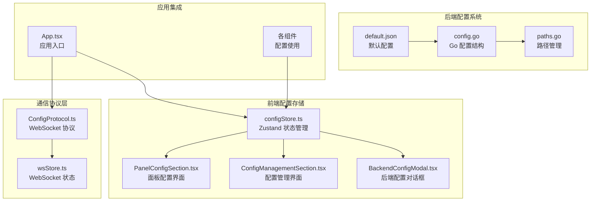
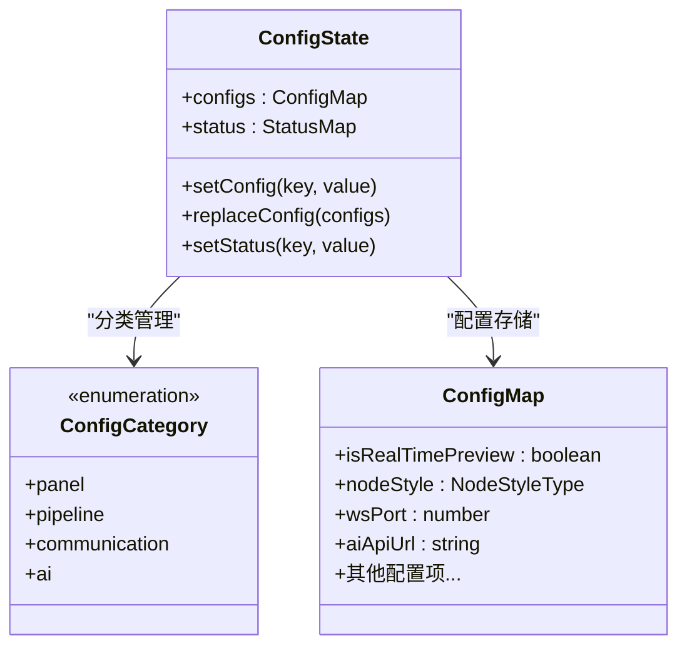
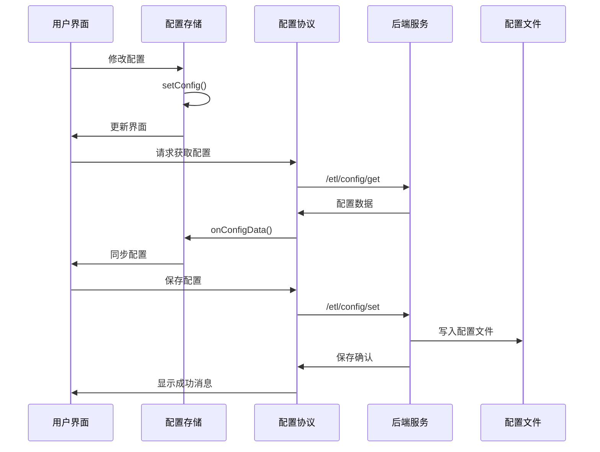
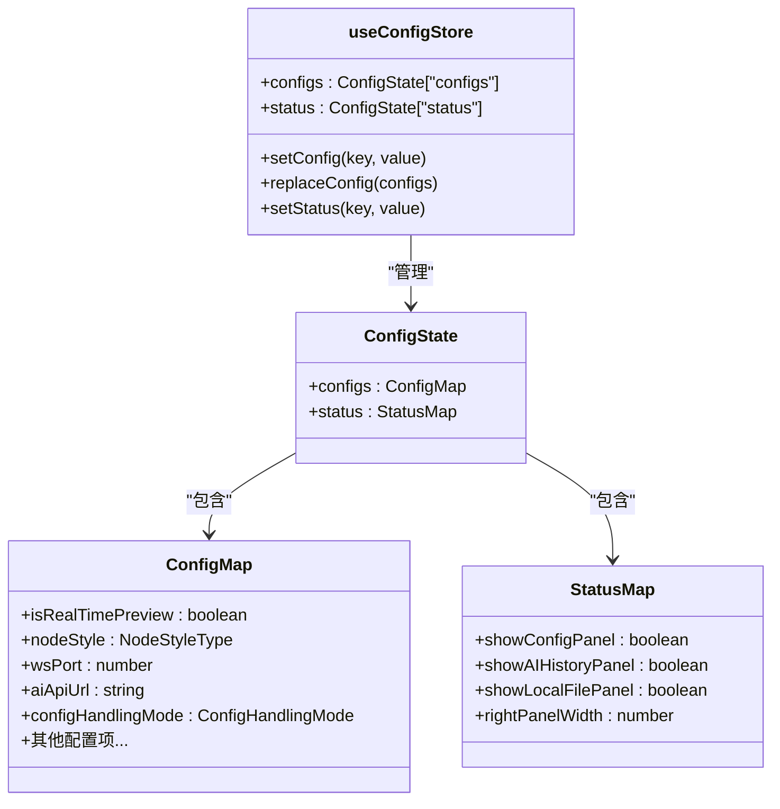
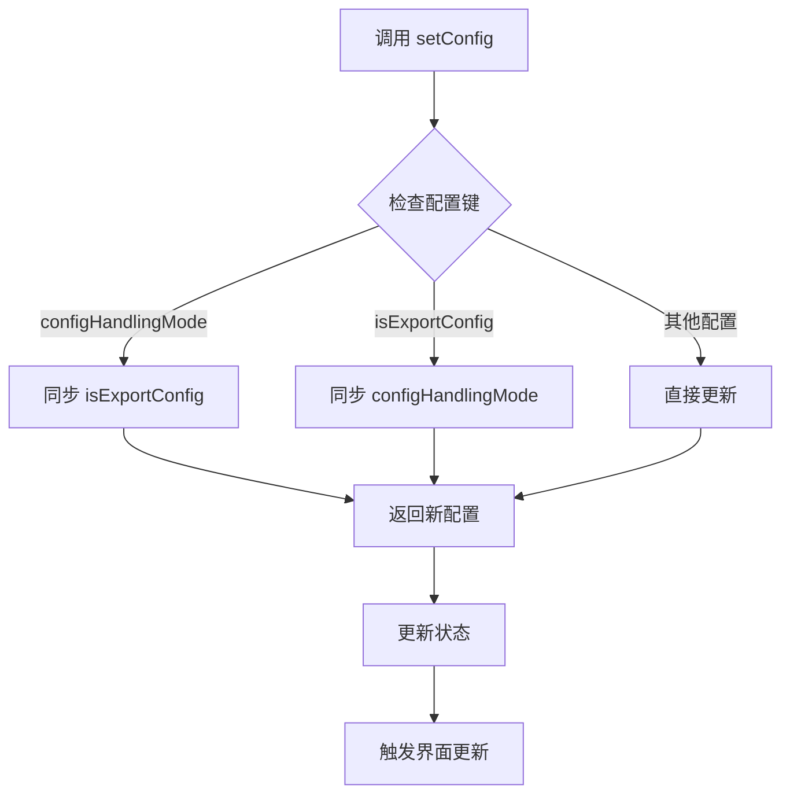
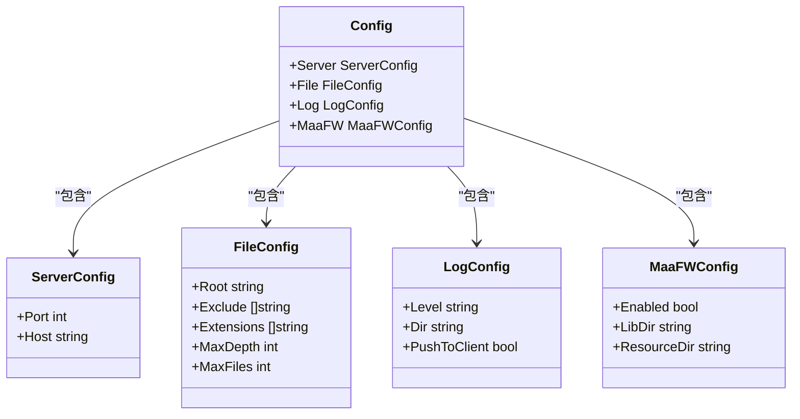
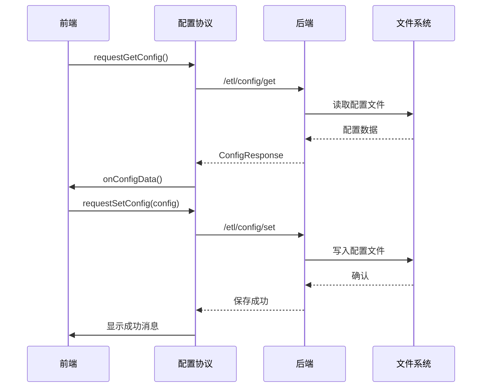
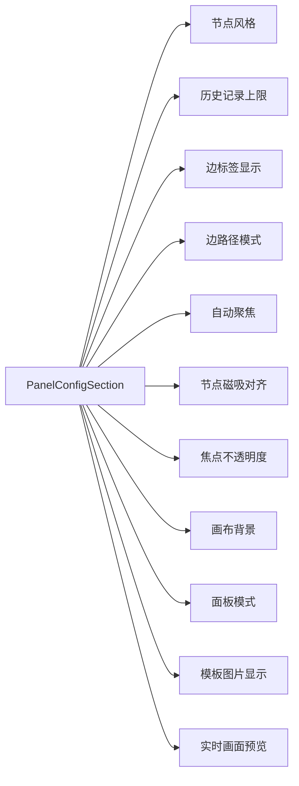
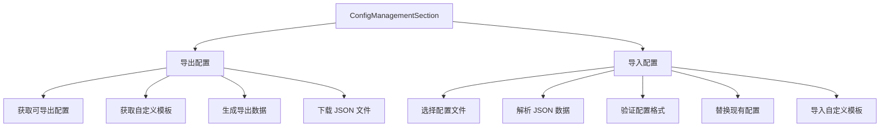
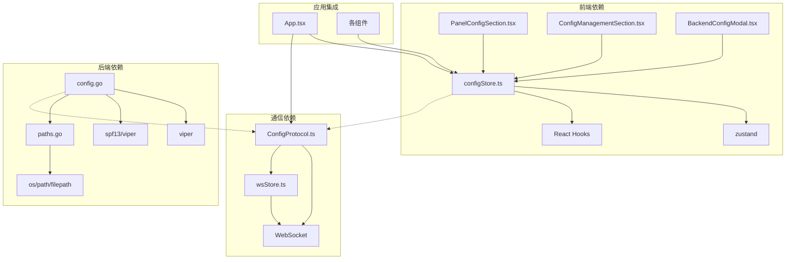

# 配置存储

<cite>
**本文档引用的文件**
- [configStore.ts](file://src/stores/configStore.ts)
- [config.go](file://LocalBridge/internal/config/config.go)
- [paths.go](file://LocalBridge/internal/paths/paths.go)
- [default.json](file://LocalBridge/config/default.json)
- [default.json](file://Extremer/config/default.json)
- [ConfigProtocol.ts](file://src/services/protocols/ConfigProtocol.ts)
- [BackendConfigModal.tsx](file://src/components/modals/BackendConfigModal.tsx)
- [PanelConfigSection.tsx](file://src/components/panels/config/PanelConfigSection.tsx)
- [ConfigManagementSection.tsx](file://src/components/panels/config/ConfigManagementSection.tsx)
- [App.tsx](file://src/App.tsx)
</cite>

## 目录
1. [简介](#简介)
2. [项目结构](#项目结构)
3. [核心组件](#核心组件)
4. [架构概览](#架构概览)
5. [详细组件分析](#详细组件分析)
6. [依赖关系分析](#依赖关系分析)
7. [性能考虑](#性能考虑)
8. [故障排除指南](#故障排除指南)
9. [结论](#结论)

## 简介

配置存储系统是 MaaPipelineEditor 的核心基础设施，负责管理应用的各种配置参数和状态。该系统采用分层架构设计，结合前端 Zustand 状态管理和后端 Go 配置系统，实现了完整的配置生命周期管理。

系统主要分为三个层面：
- **前端配置存储**：基于 Zustand 的轻量级状态管理
- **后端配置系统**：基于 Viper 的配置文件管理和验证
- **通信协议层**：通过 WebSocket 实现前后端配置同步

## 项目结构

**图表来源**
- [configStore.ts:1-276](file://src/stores/configStore.ts#L1-L276)
- [ConfigProtocol.ts:1-197](file://src/services/protocols/ConfigProtocol.ts#L1-L197)
- [config.go:1-339](file://LocalBridge/internal/config/config.go#L1-L339)

## 核心组件

### 配置分类系统

系统将配置分为四大类别，每种类别都有特定的功能领域：

**图表来源**
- [configStore.ts:17-63](file://src/stores/configStore.ts#L17-L63)
- [configStore.ts:98-167](file://src/stores/configStore.ts#L98-L167)

### 配置映射机制

系统使用配置映射表将配置项分类到相应的功能类别中：

| 配置类别 | 配置项列表 |
|---------|-----------|
| **面板配置** | nodeStyle, historyLimit, isRealTimePreview, showEdgeLabel, edgePathMode, isAutoFocus, focusOpacity, useDarkMode, canvasBackgroundMode, fieldPanelMode, inlinePanelScale, showNodeTemplateImages, showNodeDetailFields, saveFilesBeforeDebug, enableNodeSnap, snapOnlyInViewport, enableLiveScreen, liveScreenRefreshRate |
| **管道配置** | nodeAttrExportStyle, defaultHandleDirection, exportDefaultRecoAction, pipelineProtocolVersion, skipFieldValidation, jsonIndent, configHandlingMode |
| **通信配置** | wsPort, wsAutoConnect, fileAutoReload, enableCrossFileSearch |
| **AI 配置** | aiApiUrl, aiApiKey, aiModel |

**章节来源**
- [configStore.ts:24-63](file://src/stores/configStore.ts#L24-L63)

## 架构概览

**图表来源**
- [ConfigProtocol.ts:128-161](file://src/services/protocols/ConfigProtocol.ts#L128-L161)
- [configStore.ts:220-232](file://src/stores/configStore.ts#L220-L232)

## 详细组件分析

### 前端配置存储 (Zustand)

前端配置存储基于 Zustand 实现，提供了类型安全的状态管理：

**图表来源**
- [configStore.ts:98-167](file://src/stores/configStore.ts#L98-L167)

#### 配置同步机制

系统实现了智能的配置同步机制，确保相关配置项的一致性：

**图表来源**
- [configStore.ts:220-232](file://src/stores/configStore.ts#L220-L232)

**章节来源**
- [configStore.ts:169-275](file://src/stores/configStore.ts#L169-L275)

### 后端配置系统 (Go)

后端配置系统基于 Viper 实现，提供了强大的配置管理能力：

**图表来源**
- [config.go:42-48](file://LocalBridge/internal/config/config.go#L42-L48)

#### 配置文件管理

系统支持多种运行模式和配置文件管理策略：

| 运行模式 | 特点 | 配置文件位置 |
|---------|------|-------------|
| **开发模式** | 使用可执行文件同目录的 config 目录 | exeDir/config/default.json |
| **便携模式** | 强制使用可执行文件同目录 | exeDir/config/config.json |
| **用户模式** | 使用系统用户数据目录 | %APPDATA%/MaaPipelineEditor/LocalBridge/config.json |

**章节来源**
- [config.go:53-94](file://LocalBridge/internal/config/config.go#L53-L94)
- [paths.go:72-87](file://LocalBridge/internal/paths/paths.go#L72-L87)

### 通信协议层

配置协议层通过 WebSocket 实现前后端配置的实时同步：

**图表来源**
- [ConfigProtocol.ts:128-161](file://src/services/protocols/ConfigProtocol.ts#L128-L161)

**章节来源**
- [ConfigProtocol.ts:46-196](file://src/services/protocols/ConfigProtocol.ts#L46-L196)

### 配置界面组件

系统提供了多个配置界面组件，分别管理不同类型的配置：

#### 面板配置组件

面板配置组件管理编辑器界面相关的配置：

**图表来源**
- [PanelConfigSection.tsx:56-481](file://src/components/panels/config/PanelConfigSection.tsx#L56-L481)

#### 配置管理组件

配置管理组件提供配置的导入导出功能：

**图表来源**
- [ConfigManagementSection.tsx:27-102](file://src/components/panels/config/ConfigManagementSection.tsx#L27-L102)

**章节来源**
- [PanelConfigSection.tsx:10-486](file://src/components/panels/config/PanelConfigSection.tsx#L10-L486)
- [ConfigManagementSection.tsx:15-138](file://src/components/panels/config/ConfigManagementSection.tsx#L15-L138)

## 依赖关系分析

**图表来源**
- [configStore.ts:1](file://src/stores/configStore.ts#L1)
- [config.go:3-11](file://LocalBridge/internal/config/config.go#L3-L11)

**章节来源**
- [App.tsx:15-55](file://src/App.tsx#L15-L55)

## 性能考虑

### 状态管理优化

1. **选择性更新**：Zustand 支持选择性状态更新，避免不必要的组件重渲染
2. **批量更新**：通过 `replaceConfig` 方法实现批量配置更新
3. **配置分类**：按功能类别分离配置，减少无关配置的更新频率

### 配置文件访问优化

1. **路径缓存**：路径管理系统缓存计算结果，避免重复的文件系统查询
2. **延迟初始化**：配置文件在首次访问时才进行加载和解析
3. **增量更新**：支持增量配置更新，减少完整配置文件的写入次数

### 网络通信优化

1. **连接复用**：WebSocket 连接复用，避免频繁的连接建立和断开
2. **错误重试**：实现智能的错误重试机制，提高配置同步的可靠性
3. **状态同步**：双向状态同步，确保前后端配置的一致性

## 故障排除指南

### 常见问题及解决方案

#### 配置文件加载失败

**问题症状**：
- 应用启动时报配置文件不存在错误
- 配置界面显示默认值而非预期值

**解决步骤**：
1. 检查配置文件路径是否正确
2. 验证配置文件格式是否有效
3. 确认文件权限是否正确
4. 检查磁盘空间是否充足

**章节来源**
- [config.go:53-94](file://LocalBridge/internal/config/config.go#L53-L94)

#### WebSocket 连接问题

**问题症状**：
- 配置同步失败
- 后端配置对话框无法显示
- 保存配置后无响应

**解决步骤**：
1. 检查本地服务是否正常运行
2. 验证 WebSocket 端口配置
3. 检查防火墙设置
4. 查看浏览器开发者工具中的网络错误

**章节来源**
- [ConfigProtocol.ts:128-161](file://src/services/protocols/ConfigProtocol.ts#L128-L161)

#### 配置同步冲突

**问题症状**：
- 配置更新后立即被覆盖
- 设置项在不同会话间丢失

**解决步骤**：
1. 检查是否有多个实例同时修改配置
2. 验证配置文件的写入权限
3. 清理临时配置文件
4. 重启应用以恢复配置状态

## 结论

配置存储系统通过分层架构设计，成功实现了前端状态管理、后端配置管理和通信协议的无缝集成。系统的主要优势包括：

1. **模块化设计**：清晰的职责分离使得系统易于维护和扩展
2. **类型安全**：完整的 TypeScript 类型定义确保了配置使用的安全性
3. **实时同步**：基于 WebSocket 的双向通信保证了配置的一致性
4. **灵活配置**：支持多种运行模式和配置策略，适应不同的使用场景

未来可以考虑的改进方向：
- 添加配置版本控制机制
- 实现配置模板功能
- 增强配置导入导出的兼容性
- 优化大规模配置的性能表现