# 配置存储

<cite>
**本文档引用的文件**
- [configStore.ts](file://src/stores/configStore.ts)
- [config.go](file://LocalBridge/internal/config/config.go)
- [paths.go](file://LocalBridge/internal/paths/paths.go)
- [default.json](file://LocalBridge/config/default.json)
- [default.json](file://Extremer/config/default.json)
- [ConfigProtocol.ts](file://src/services/protocols/ConfigProtocol.ts)
- [BackendConfigModal.tsx](file://src/components/modals/BackendConfigModal.tsx)
- [PanelConfigSection.tsx](file://src/components/panels/config/PanelConfigSection.tsx)
- [PipelineConfigSection.tsx](file://src/components/panels/config/PipelineConfigSection.tsx)
- [ConfigManagementSection.tsx](file://src/components/panels/config/ConfigManagementSection.tsx)
- [FieldSortModal.tsx](file://src/components/modals/FieldSortModal.tsx)
- [App.tsx](file://src/App.tsx)
- [exporter.ts](file://src/core/parser/exporter.ts)
- [fileStore.ts](file://src/stores/fileStore.ts)
- [nodeParser.ts](file://src/core/parser/nodeParser.ts)
- [file_service.go](file://LocalBridge/internal/service/file/file_service.go)
- [nodeJsonValidator.ts](file://src/utils/nodeJsonValidator.ts)
- [index.ts](file://src/core/sorting/index.ts)
- [types.ts](file://src/core/sorting/types.ts)
- [defaults.ts](file://src/core/sorting/defaults.ts)
- [applySort.ts](file://src/core/sorting/applySort.ts)
- [FieldSortModal.module.less](file://src/styles/FieldSortModal.module.less)
- [preview.yaml](file://.github/workflows/preview.yaml)
- [error.json](file://LocalBridge/test-json/base/error.json)
- [package.json](file://package.json)
- [go.mod](file://LocalBridge/go.mod)
- [guardSystem.ts](file://src/components/panels/settings/guardSystem.ts)
- [settingsDefinitions.ts](file://src/components/panels/settings/settingsDefinitions.ts)
- [customRenderers.tsx](file://src/components/panels/settings/customRenderers.tsx)
</cite>

## 更新摘要
**变更内容**
- 新增字段排序配置功能，支持自定义字段显示顺序
- 新增FieldSortConfig配置项，允许用户拖拽调整字段排序
- 新增FieldSortModal组件，提供可视化排序界面
- 新增字段排序系统，支持5个不同类别的字段排序
- 新增配置已配置追踪机制，支持守卫系统
- 新增自动持久化机制，支持localStorage配置保存
- 新增配置验证系统，支持字段格式验证
- 版本号更新到1.5.0，beta迭代号从0更新到1，反映开发迭代进度的更新
- 扩展排序应用逻辑，支持v1/v2协议版本的字段排序
- 增强导出器，支持按用户配置的字段顺序导出

## 目录
1. [简介](#简介)
2. [项目结构](#项目结构)
3. [核心组件](#核心组件)
4. [架构概览](#架构概览)
5. [详细组件分析](#详细组件分析)
6. [依赖关系分析](#依赖关系分析)
7. [性能考虑](#性能考虑)
8. [故障排除指南](#故障排除指南)
9. [结论](#结论)

## 简介

配置存储系统是 MaaPipelineEditor 的核心基础设施，负责管理应用的各种配置参数和状态。该系统采用分层架构设计，结合前端 Zustand 状态管理和后端 Go 配置系统，实现了完整的配置生命周期管理。

系统主要分为三个层面：
- **前端配置存储**：基于 Zustand 的轻量级状态管理
- **后端配置系统**：基于 Viper 的配置文件管理和验证
- **通信协议层**：通过 WebSocket 实现前后端配置同步

**更新** 新增字段排序配置功能，允许用户自定义字段显示顺序，提升配置文件的可读性和一致性。新增配置已配置追踪机制，支持守卫系统实现智能配置引导。新增自动持久化机制，支持localStorage配置保存，确保用户配置的持久化存储。**版本更新** 当前版本为1.5.0_beta_1，beta迭代号已从0更新到1，体现了持续的开发进度跟踪。

## 项目结构

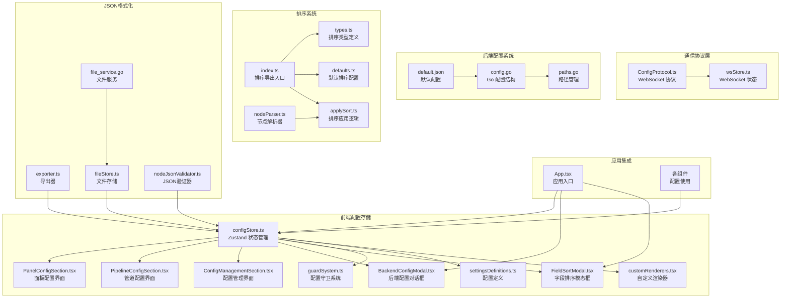
```mermaid
graph TB
subgraph "前端配置存储"
A[configStore.ts<br/>Zustand 状态管理]
B[PanelConfigSection.tsx<br/>面板配置界面]
C[PipelineConfigSection.tsx<br/>管道配置界面]
D[ConfigManagementSection.tsx<br/>配置管理界面]
E[BackendConfigModal.tsx<br/>后端配置对话框]
F[FieldSortModal.tsx<br/>字段排序模态框]
G[guardSystem.ts<br/>配置守卫系统]
H[settingsDefinitions.ts<br/>配置定义]
I[customRenderers.tsx<br/>自定义渲染器]
end
subgraph "通信协议层"
J[ConfigProtocol.ts<br/>WebSocket 协议]
K[wsStore.ts<br/>WebSocket 状态]
end
subgraph "后端配置系统"
L[config.go<br/>Go 配置结构]
M[paths.go<br/>路径管理]
N[default.json<br/>默认配置]
end
subgraph "应用集成"
O[App.tsx<br/>应用入口]
P[各组件<br/>配置使用]
end
subgraph "排序系统"
Q[index.ts<br/>排序导出入口]
R[types.ts<br/>排序类型定义]
S[defaults.ts<br/>默认排序配置]
T[applySort.ts<br/>排序应用逻辑]
U[nodeParser.ts<br/>节点解析器]
end
subgraph "JSON格式化"
V[exporter.ts<br/>导出器]
W[fileStore.ts<br/>文件存储]
X[file_service.go<br/>文件服务]
Y[nodeJsonValidator.ts<br/>JSON验证器]
end
A --> B
A --> C
A --> D
A --> E
A --> F
A --> G
A --> H
A --> I
J --> K
L --> M
N --> L
O --> A
O --> E
O --> F
P --> A
Q --> R
Q --> S
Q --> T
U --> T
V --> A
W --> A
X --> W
Y --> A
```

**图表来源**
- [configStore.ts:1-355](file://src/stores/configStore.ts#L1-L355)
- [ConfigProtocol.ts:1-197](file://src/services/protocols/ConfigProtocol.ts#L1-L197)
- [config.go:1-339](file://LocalBridge/internal/config/config.go#L1-L339)
- [exporter.ts:217-243](file://src/core/parser/exporter.ts#L217-L243)
- [fileStore.ts:697-753](file://src/stores/fileStore.ts#L697-L753)
- [FieldSortModal.tsx:1-362](file://src/components/modals/FieldSortModal.tsx#L1-L362)
- [applySort.ts:1-341](file://src/core/sorting/applySort.ts#L1-L341)
- [guardSystem.ts:1-38](file://src/components/panels/settings/guardSystem.ts#L1-L38)
- [settingsDefinitions.ts:1-200](file://src/components/panels/settings/settingsDefinitions.ts#L1-L200)
- [customRenderers.tsx:1-200](file://src/components/panels/settings/customRenderers.tsx#L1-L200)

## 核心组件

### 配置分类系统

系统将配置分为九个类别，每种类别都有特定的功能领域：

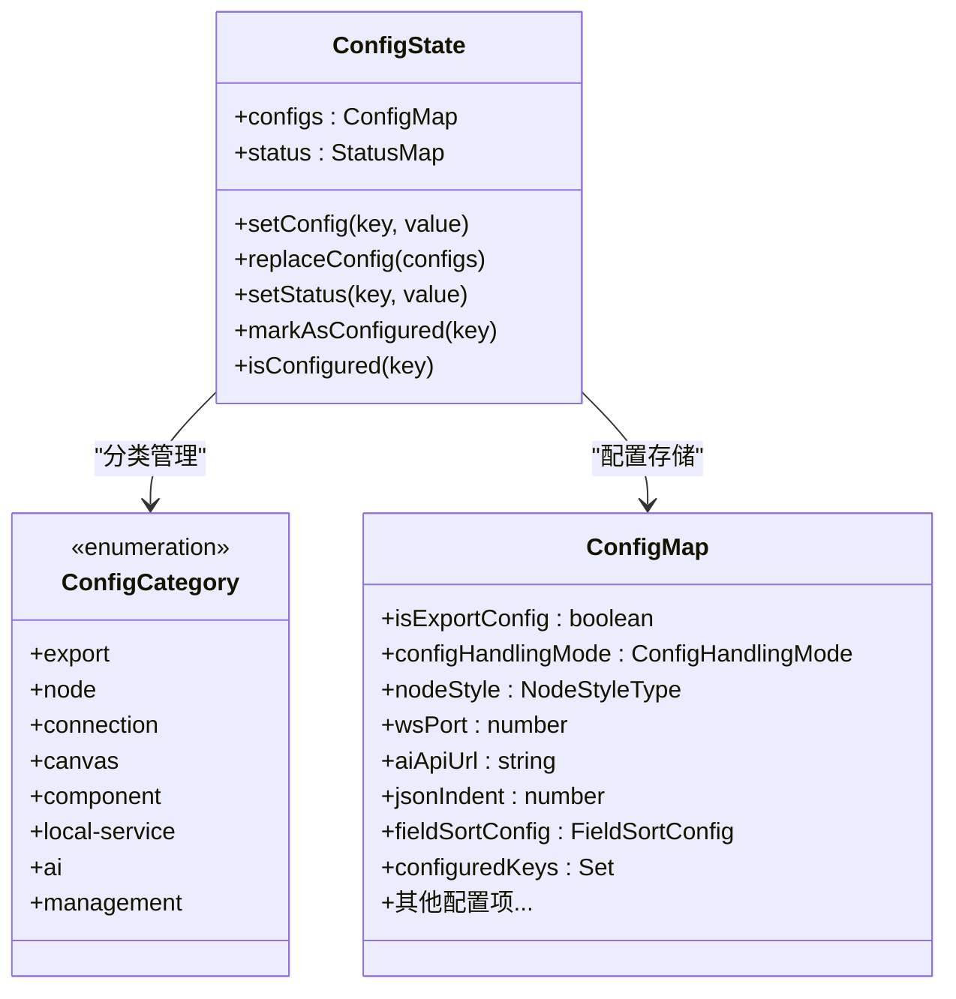
```mermaid
classDiagram
class ConfigCategory {
<<enumeration>>
+export
+node
+connection
+canvas
+component
+local-service
+ai
+management
}
class ConfigState {
+configs : ConfigMap
+status : StatusMap
+setConfig(key, value)
+replaceConfig(configs)
+setStatus(key, value)
+markAsConfigured(key)
+isConfigured(key)
}
class ConfigMap {
+isExportConfig : boolean
+configHandlingMode : ConfigHandlingMode
+nodeStyle : NodeStyleType
+wsPort : number
+aiApiUrl : string
+jsonIndent : number
+fieldSortConfig : FieldSortConfig
+configuredKeys : Set<string>
+其他配置项...
}
ConfigState --> ConfigCategory : "分类管理"
ConfigState --> ConfigMap : "配置存储"
```

**图表来源**
- [configStore.ts:18-27](file://src/stores/configStore.ts#L18-L27)
- [configStore.ts:169-250](file://src/stores/configStore.ts#L169-L250)

### 配置映射机制

系统使用配置映射表将配置项分类到相应的功能类别中：

| 配置类别 | 配置项列表 |
|---------|-----------|
| **导出配置** | nodeAttrExportStyle, exportDefaultRecoAction, exportEmptyParam, pipelineProtocolVersion, skipFieldValidation, jsonIndent, configHandlingMode |
| **节点配置** | nodeStyle, showNodeDetailFields, showNodeTemplateImages, enableNodeSnap, snapOnlyInViewport, defaultHandleDirection |
| **连接配置** | edgePathMode, showEdgeLabel, showEdgeControlPoint, quickCreateNodeOnConnectBlank |
| **画布配置** | canvasBackgroundMode, isAutoFocus, focusOpacity, useDarkMode |
| **组件配置** | isExportConfig, saveFilesBeforeDebug, fieldPanelMode, inlinePanelScale, enableLiveScreen, liveScreenRefreshRate, historyLimit |
| **本地服务配置** | wsPort, wsAutoConnect, fileAutoReload, enableCrossFileSearch |
| **AI 配置** | aiApiUrl, aiApiKey, aiModel, aiTemperature |
| **管理配置** | **fieldSortConfig** |

**更新** 新增管理配置类别，包含fieldSortConfig配置项，用于管理字段显示顺序。

**章节来源**
- [configStore.ts:33-77](file://src/stores/configStore.ts#L33-L77)

## 架构概览

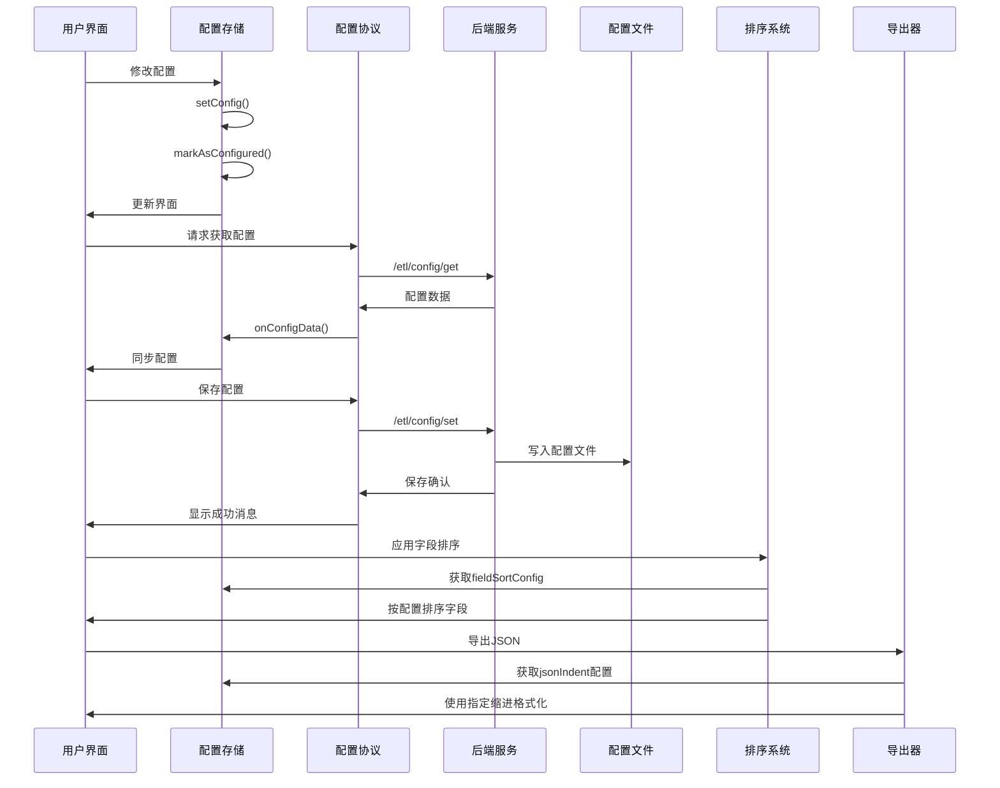
```mermaid
sequenceDiagram
participant UI as 用户界面
participant Store as 配置存储
participant Protocol as 配置协议
participant Backend as 后端服务
participant File as 配置文件
participant SortSystem as 排序系统
participant Exporter as 导出器
UI->>Store : 修改配置
Store->>Store : setConfig()
Store->>Store : markAsConfigured()
Store->>UI : 更新界面
UI->>Protocol : 请求获取配置
Protocol->>Backend : /etl/config/get
Backend->>Protocol : 配置数据
Protocol->>Store : onConfigData()
Store->>UI : 同步配置
UI->>Protocol : 保存配置
Protocol->>Backend : /etl/config/set
Backend->>File : 写入配置文件
Backend->>Protocol : 保存确认
Protocol->>UI : 显示成功消息
UI->>SortSystem : 应用字段排序
SortSystem->>Store : 获取fieldSortConfig
SortSystem->>UI : 按配置排序字段
UI->>Exporter : 导出JSON
Exporter->>Store : 获取jsonIndent配置
Exporter->>UI : 使用指定缩进格式化
```

**图表来源**
- [ConfigProtocol.ts:128-161](file://src/services/protocols/ConfigProtocol.ts#L128-L161)
- [configStore.ts:255-273](file://src/stores/configStore.ts#L255-L273)
- [exporter.ts:235-261](file://src/core/parser/exporter.ts#L235-L261)
- [applySort.ts:314-327](file://src/core/sorting/applySort.ts#L314-L327)

## 详细组件分析

### 前端配置存储 (Zustand)

前端配置存储基于 Zustand 实现，提供了类型安全的状态管理：

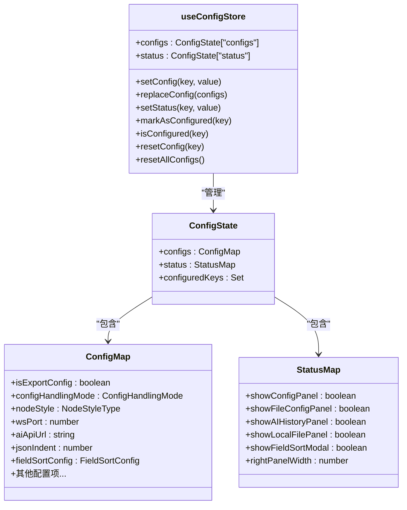
```mermaid
classDiagram
class useConfigStore {
+configs : ConfigState["configs"]
+status : ConfigState["status"]
+setConfig(key, value)
+replaceConfig(configs)
+setStatus(key, value)
+markAsConfigured(key)
+isConfigured(key)
+resetConfig(key)
+resetAllConfigs()
}
class ConfigState {
+configs : ConfigMap
+status : StatusMap
+configuredKeys : Set<string>
}
class ConfigMap {
+isExportConfig : boolean
+configHandlingMode : ConfigHandlingMode
+nodeStyle : NodeStyleType
+wsPort : number
+aiApiUrl : string
+jsonIndent : number
+fieldSortConfig : FieldSortConfig
+其他配置项...
}
class StatusMap {
+showConfigPanel : boolean
+showFileConfigPanel : boolean
+showAIHistoryPanel : boolean
+showLocalFilePanel : boolean
+showFieldSortModal : boolean
+rightPanelWidth : number
}
useConfigStore --> ConfigState : "管理"
ConfigState --> ConfigMap : "包含"
ConfigState --> StatusMap : "包含"
```

**图表来源**
- [configStore.ts:252-354](file://src/stores/configStore.ts#L252-L354)

#### 配置同步机制

系统实现了智能的配置同步机制，确保相关配置项的一致性：

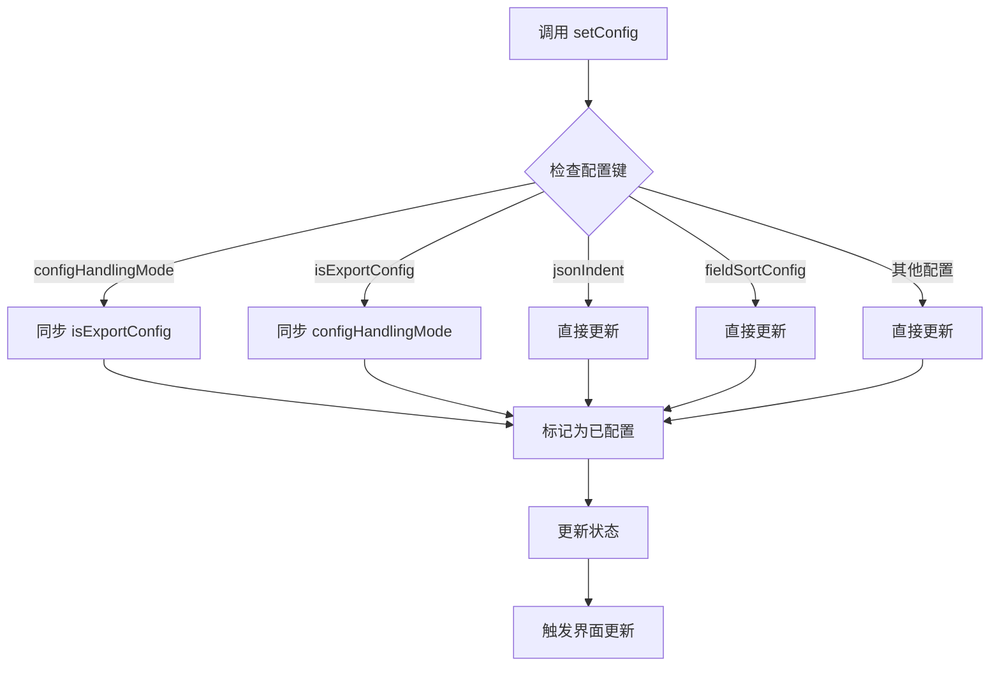
```mermaid
flowchart TD
A[调用 setConfig] --> B{检查配置键}
B --> |configHandlingMode| C[同步 isExportConfig]
B --> |isExportConfig| D[同步 configHandlingMode]
B --> |jsonIndent| E[直接更新]
B --> |fieldSortConfig| F[直接更新]
B --> |其他配置| G[直接更新]
C --> H[标记为已配置]
D --> H
E --> H
F --> H
G --> H
H --> I[更新状态]
I --> J[触发界面更新]
```

**更新** 新增配置已配置追踪机制，通过configuredKeys Set集合跟踪用户已配置的配置项，支持守卫系统实现智能配置引导。

**图表来源**
- [configStore.ts:255-273](file://src/stores/configStore.ts#L255-L273)

**章节来源**
- [configStore.ts:308-339](file://src/stores/configStore.ts#L308-L339)

### 字段排序配置系统

**新增** 字段排序配置系统提供了强大的字段排序功能：

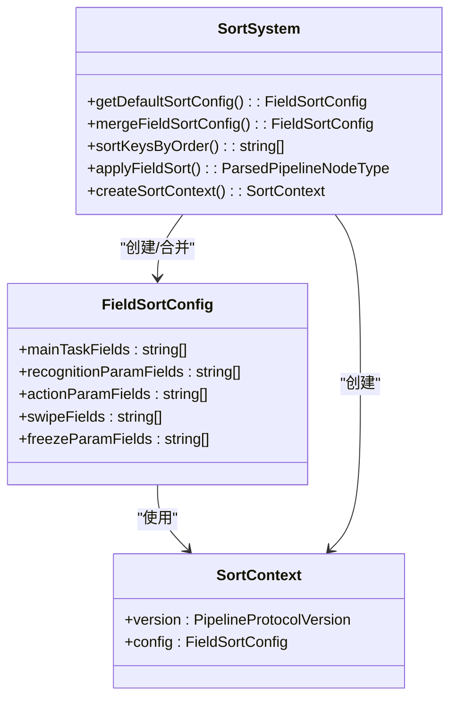
```mermaid
classDiagram
class FieldSortConfig {
+mainTaskFields : string[]
+recognitionParamFields : string[]
+actionParamFields : string[]
+swipeFields : string[]
+freezeParamFields : string[]
}
class SortContext {
+version : PipelineProtocolVersion
+config : FieldSortConfig
}
class SortSystem {
+getDefaultSortConfig() : FieldSortConfig
+mergeFieldSortConfig() : FieldSortConfig
+sortKeysByOrder() : string[]
+applyFieldSort() : ParsedPipelineNodeType
+createSortContext() : SortContext
}
FieldSortConfig --> SortContext : "使用"
SortSystem --> FieldSortConfig : "创建/合并"
SortSystem --> SortContext : "创建"
```

**图表来源**
- [types.ts:6-27](file://src/core/sorting/types.ts#L6-L27)
- [applySort.ts:59-74](file://src/core/sorting/applySort.ts#L59-L74)

#### 默认排序配置

系统提供了完整的默认排序配置：

| 字段类别 | 默认顺序 | 用途 |
|---------|----------|------|
| **主任务字段** | desc, doc, enabled, max_hit, sub_name, recognition, inverse, pre_wait_freezes, pre_delay, action, anchor, repeat, repeat_wait_freezes, repeat_delay, post_wait_freezes, post_delay, timeout, rate_limit, next, on_error, focus, attach | 主要任务节点的核心字段 |
| **识别参数字段** | custom_recognition, custom_recognition_param, roi, roi_offset, template, green_mask, method, detector, ratio, lower, upper, connected, expected, replace, only_rec, model, color_filter, labels, threshold, count, all_of, any_of, box_index, order_by, index | 识别算法的参数字段 |
| **动作参数字段** | custom_action, custom_action_param, target, target_offset, begin, begin_offset, end, end_offset, end_hold, only_hover, duration, contact, pressure, swipes, dx, dy, key, input_text, package, exec, args, detach, cmd, shell_timeout, filename, format, quality | 动作执行的参数字段 |
| **滑动参数字段** | starting, begin, begin_offset, end, end_offset, duration, end_hold, only_hover, contact, pressure | 滑动操作的参数字段 |
| **冻结参数字段** | time, target, target_offset, threshold, method, rate_limit, timeout | 冻结等待的参数字段 |

**章节来源**
- [defaults.ts:16-152](file://src/core/sorting/defaults.ts#L16-L152)

### 字段排序模态框

**新增** 字段排序模态框提供了直观的可视化排序界面：

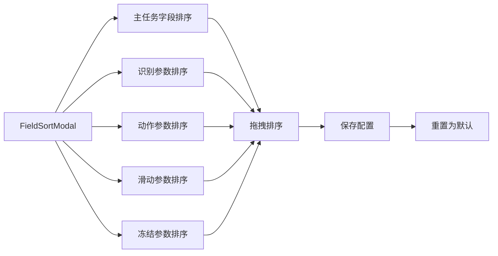
```mermaid
graph LR
A[FieldSortModal] --> B[主任务字段排序]
A --> C[识别参数排序]
A --> D[动作参数排序]
A --> E[滑动参数排序]
A --> F[冻结参数排序]
B --> G[拖拽排序]
C --> G
D --> G
E --> G
F --> G
G --> H[保存配置]
H --> I[重置为默认]
```

**更新** 新增字段排序模态框组件，提供拖拽排序功能，支持5个不同类别的字段排序。

**图表来源**
- [FieldSortModal.tsx:108-360](file://src/components/modals/FieldSortModal.tsx#L108-L360)

#### 排序界面特性

字段排序模态框具有以下特性：

- **拖拽排序**：使用DndKit库实现拖拽排序功能
- **分组管理**：支持5个不同类别的字段分组管理
- **重置功能**：每个分组都可以重置为默认排序
- **一键重置**：支持一键恢复所有默认排序
- **实时预览**：排序变更实时反映在界面中

**章节来源**
- [FieldSortModal.tsx:108-360](file://src/components/modals/FieldSortModal.tsx#L108-L360)

### 排序应用逻辑

**新增** 排序应用逻辑支持v1/v2协议版本的字段排序：

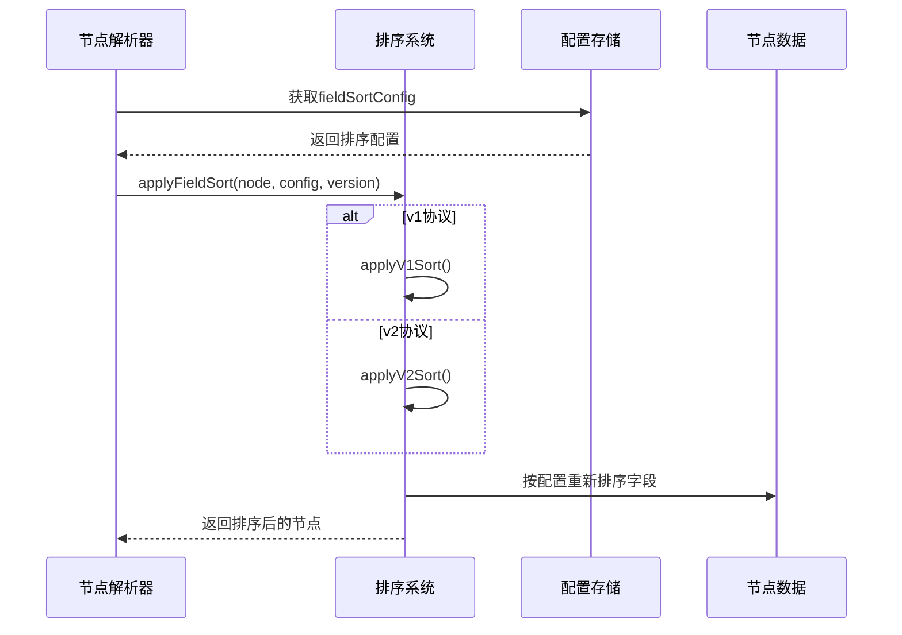
```mermaid
sequenceDiagram
participant Parser as 节点解析器
participant SortSystem as 排序系统
participant ConfigStore as 配置存储
participant Node as 节点数据
Parser->>ConfigStore : 获取fieldSortConfig
ConfigStore-->>Parser : 返回排序配置
Parser->>SortSystem : applyFieldSort(node, config, version)
alt v1协议
SortSystem->>SortSystem : applyV1Sort()
else v2协议
SortSystem->>SortSystem : applyV2Sort()
end
SortSystem->>Node : 按配置重新排序字段
SortSystem-->>Parser : 返回排序后的节点
```

**更新** 排序系统现在支持v1和v2两种协议版本，提供不同的字段排序策略。

**图表来源**
- [applySort.ts:314-327](file://src/core/sorting/applySort.ts#L314-L327)
- [nodeParser.ts:156-159](file://src/core/parser/nodeParser.ts#L156-L159)

#### 排序策略对比

| 排序策略 | v1协议 | v2协议 |
|---------|--------|--------|
| **主任务字段** | 直接添加到结果对象 | 按顺序遍历并处理特殊字段 |
| **识别参数** | 识别字段单独处理 | recognition对象内排序 |
| **动作参数** | 动作字段单独处理 | action对象内排序 |
| **滑动参数** | 不支持 | swipes数组内排序 |
| **冻结参数** | 不支持 | freeze对象内排序 |
| **MPE特色字段** | 放在末尾 | 放在末尾 |

**章节来源**
- [applySort.ts:183-305](file://src/core/sorting/applySort.ts#L183-L305)

### 导出器集成

导出器系统集成了字段排序配置，确保导出的JSON文件格式一致：

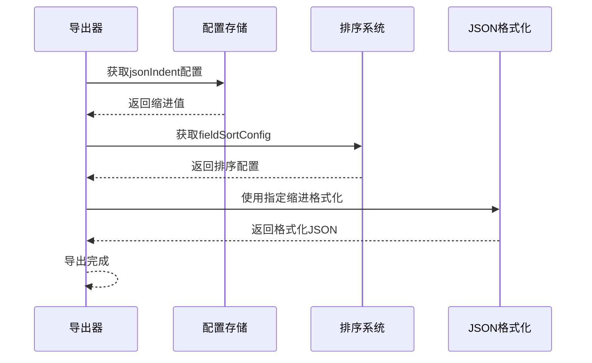
```mermaid
sequenceDiagram
participant Exporter as 导出器
participant Store as 配置存储
participant SortSystem as 排序系统
participant JSON as JSON格式化
Exporter->>Store : 获取jsonIndent配置
Store-->>Exporter : 返回缩进值
Exporter->>SortSystem : 获取fieldSortConfig
SortSystem-->>Exporter : 返回排序配置
Exporter->>JSON : 使用指定缩进格式化
JSON-->>Exporter : 返回格式化JSON
Exporter-->>Exporter : 导出完成
```

**更新** 导出器现在从配置存储中获取fieldSortConfig配置，支持按用户定义的字段顺序导出。

**图表来源**
- [exporter.ts:235-261](file://src/core/parser/exporter.ts#L235-L261)

#### 导出逻辑增强

导出器的JSON格式化逻辑得到了增强：

- **动态缩进**：根据配置存储中的jsonIndent值动态调整缩进
- **字段排序**：应用用户定义的字段排序配置
- **分离模式支持**：在分离模式下同时格式化Pipeline和配置文件
- **默认回退**：当配置不可用时使用默认4空格缩进

**章节来源**
- [exporter.ts:235-261](file://src/core/parser/exporter.ts#L235-L261)

### 文件存储集成

文件存储系统集成了字段排序配置，确保文件保存时使用正确的格式：

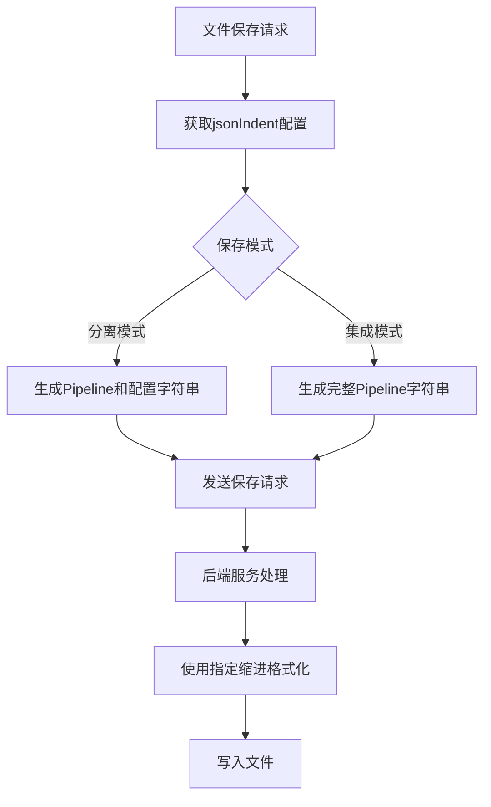
```mermaid
flowchart TD
A[文件保存请求] --> B[获取jsonIndent配置]
B --> C{保存模式}
C --> |分离模式| D[生成Pipeline和配置字符串]
C --> |集成模式| E[生成完整Pipeline字符串]
D --> F[发送保存请求]
E --> F
F --> G[后端服务处理]
G --> H[使用指定缩进格式化]
H --> I[写入文件]
```

**更新** 文件存储系统现在支持传递jsonIndent参数给后端服务，确保文件保存时使用正确的缩进格式。

**图表来源**
- [fileStore.ts:636-699](file://src/stores/fileStore.ts#L636-L699)

#### 后端服务处理

后端文件服务处理JSON缩进配置：

- **缩进字符串构建**：根据传入的缩进值构建相应的空格字符串
- **默认回退**：当缩进值为0时使用4个空格作为默认缩进
- **序列化处理**：使用json.MarshalIndent函数进行格式化输出

**章节来源**
- [fileStore.ts:636-699](file://src/stores/fileStore.ts#L636-L699)
- [file_service.go:158-201](file://LocalBridge/internal/service/file/file_service.go#L158-L201)

### 自动持久化机制

**新增** 自动持久化机制确保用户配置的持久化存储：

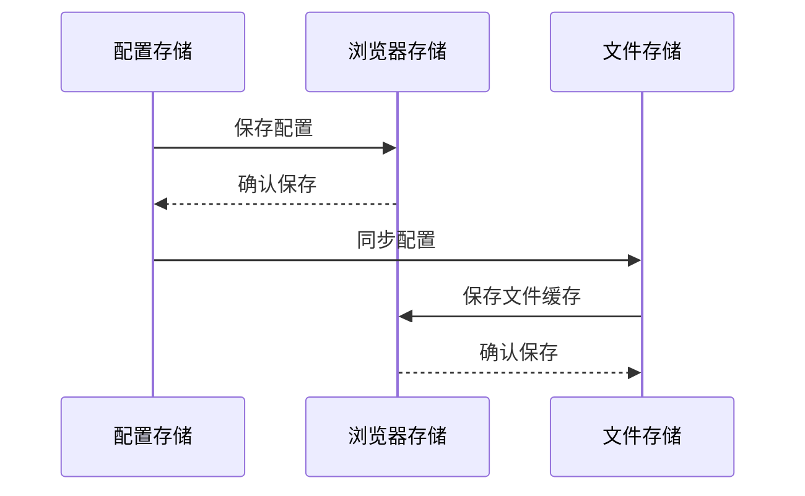
```mermaid
sequenceDiagram
participant Store as 配置存储
participant LocalStorage as 浏览器存储
participant FileStore as 文件存储
Store->>LocalStorage : 保存配置
LocalStorage-->>Store : 确认保存
Store->>FileStore : 同步配置
FileStore->>LocalStorage : 保存文件缓存
LocalStorage-->>FileStore : 确认保存
```

**更新** 新增自动持久化机制，通过localStorage实现配置的持久化存储，支持configuredKeys的保存和恢复。

**图表来源**
- [fileStore.ts:247-255](file://src/stores/fileStore.ts#L247-L255)
- [fileStore.ts:506-517](file://src/stores/fileStore.ts#L506-L517)

#### 持久化特性

自动持久化机制具有以下特性：

- **配置保存**：自动保存所有配置项到localStorage
- **已配置追踪**：保存configuredKeys集合，跟踪用户配置状态
- **文件缓存**：同步保存文件缓存，支持多文件管理
- **恢复机制**：应用启动时自动恢复配置和文件状态
- **错误处理**：处理localStorage配额超限等异常情况

**章节来源**
- [fileStore.ts:247-275](file://src/stores/fileStore.ts#L247-L275)
- [fileStore.ts:506-517](file://src/stores/fileStore.ts#L506-L517)

### 配置守卫系统

**新增** 配置守卫系统提供智能的配置引导功能：

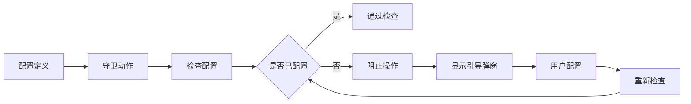
```mermaid
graph LR
A[配置定义] --> B[守卫动作]
B --> C[检查配置]
C --> D{是否已配置}
D --> |是| E[通过检查]
D --> |否| F[阻止操作]
F --> G[显示引导弹窗]
G --> H[用户配置]
H --> I[重新检查]
I --> D
```

**更新** 新增配置守卫系统，通过configuredKeys集合实现智能配置引导，确保关键配置的完整性。

**图表来源**
- [guardSystem.ts:17-32](file://src/components/panels/settings/guardSystem.ts#L17-L32)
- [settingsDefinitions.ts:164-172](file://src/components/panels/settings/settingsDefinitions.ts#L164-L172)

#### 守卫系统特性

配置守卫系统具有以下特性：

- **配置追踪**：通过configuredKeys集合追踪用户已配置的配置项
- **操作保护**：防止未配置的关键操作被执行
- **智能引导**：自动检测未配置的配置项并引导用户完成配置
- **批量检查**：支持批量检查多个配置项的配置状态
- **自定义提示**：支持为不同操作配置自定义的引导提示

**章节来源**
- [guardSystem.ts:17-38](file://src/components/panels/settings/guardSystem.ts#L17-L38)
- [settingsDefinitions.ts:164-172](file://src/components/panels/settings/settingsDefinitions.ts#L164-L172)

### 配置验证系统

**新增** 配置验证系统提供字段格式验证功能：

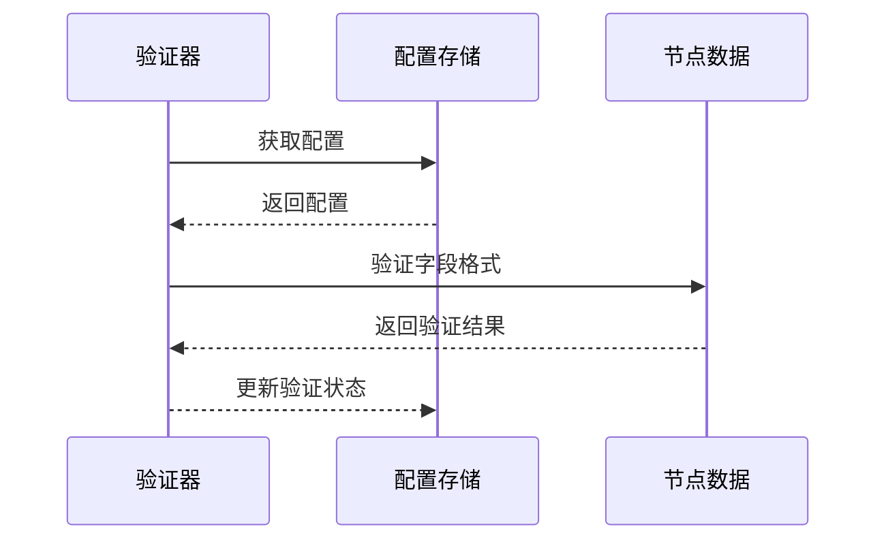
```mermaid
sequenceDiagram
participant Validator as 验证器
participant ConfigStore as 配置存储
participant Node as 节点数据
Validator->>ConfigStore : 获取配置
ConfigStore-->>Validator : 返回配置
Validator->>Node : 验证字段格式
Node-->>Validator : 返回验证结果
Validator-->>ConfigStore : 更新验证状态
```

**更新** 新增配置验证系统，通过nodeJsonValidator实现字段格式验证，确保配置数据的正确性。

**图表来源**
- [nodeJsonValidator.ts:21-95](file://src/utils/nodeJsonValidator.ts#L21-L95)

#### 验证系统特性

配置验证系统具有以下特性：

- **节点验证**：验证节点数据对象的完整性和正确性
- **自动修复**：尝试修复不完整的节点数据结构
- **格式检查**：验证字段类型和必需字段的存在性
- **错误报告**：提供详细的错误信息和修复建议
- **类型支持**：支持多种节点类型的验证

**章节来源**
- [nodeJsonValidator.ts:21-95](file://src/utils/nodeJsonValidator.ts#L21-L95)

### 后端配置系统 (Go)

后端配置系统基于 Viper 实现，提供了强大的配置管理能力：

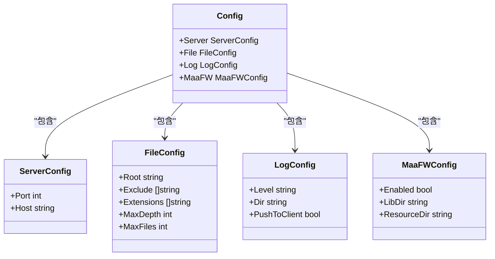
```mermaid
classDiagram
class Config {
+Server ServerConfig
+File FileConfig
+Log LogConfig
+MaaFW MaaFWConfig
}
class ServerConfig {
+Port int
+Host string
}
class FileConfig {
+Root string
+Exclude []string
+Extensions []string
+MaxDepth int
+MaxFiles int
}
class LogConfig {
+Level string
+Dir string
+PushToClient bool
}
class MaaFWConfig {
+Enabled bool
+LibDir string
+ResourceDir string
}
Config --> ServerConfig : "包含"
Config --> FileConfig : "包含"
Config --> LogConfig : "包含"
Config --> MaaFWConfig : "包含"
```

**图表来源**
- [config.go:42-48](file://LocalBridge/internal/config/config.go#L42-L48)

#### 配置文件管理

系统支持多种运行模式和配置文件管理策略：

| 运行模式 | 特点 | 配置文件位置 |
|---------|------|-------------|
| **开发模式** | 使用可执行文件同目录的 config 目录 | exeDir/config/default.json |
| **便携模式** | 强制使用可执行文件同目录 | exeDir/config/config.json |
| **用户模式** | 使用系统用户数据目录 | %APPDATA%/MaaPipelineEditor/LocalBridge/config.json |

**章节来源**
- [config.go:53-94](file://LocalBridge/internal/config/config.go#L53-L94)
- [paths.go:72-87](file://LocalBridge/internal/paths/paths.go#L72-L87)

### 通信协议层

配置协议层通过 WebSocket 实现前后端配置的实时同步：

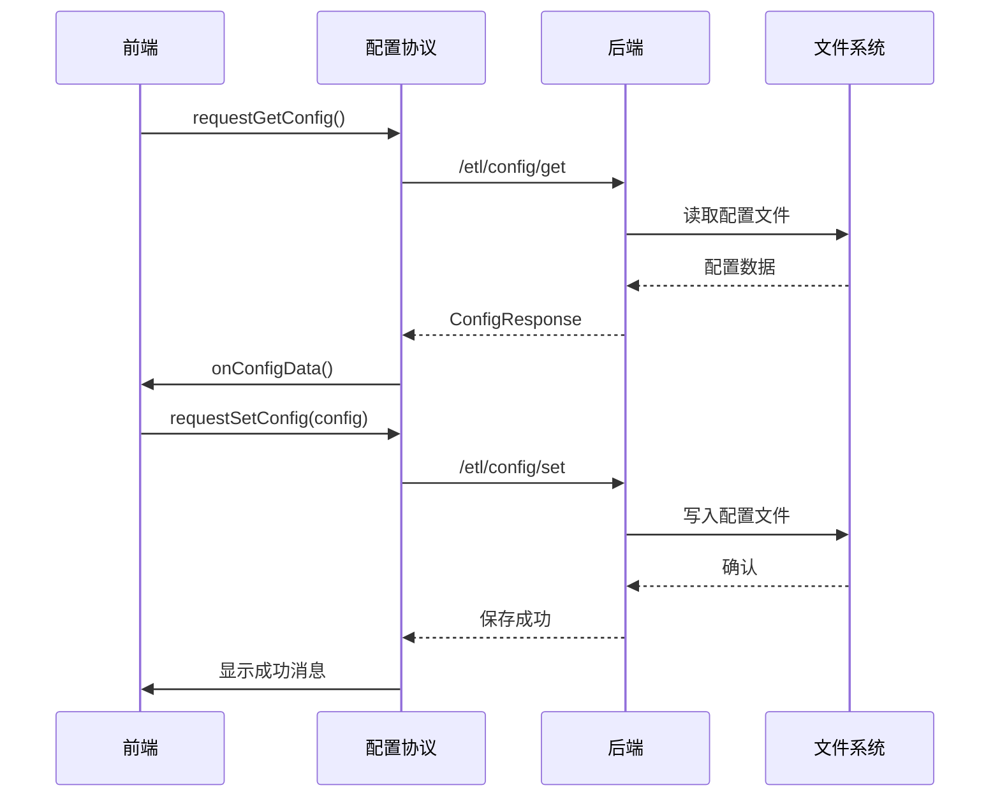
```mermaid
sequenceDiagram
participant Frontend as 前端
participant Protocol as 配置协议
participant Backend as 后端
participant FileSystem as 文件系统
Frontend->>Protocol : requestGetConfig()
Protocol->>Backend : /etl/config/get
Backend->>FileSystem : 读取配置文件
FileSystem-->>Backend : 配置数据
Backend-->>Protocol : ConfigResponse
Protocol->>Frontend : onConfigData()
Frontend->>Protocol : requestSetConfig(config)
Protocol->>Backend : /etl/config/set
Backend->>FileSystem : 写入配置文件
FileSystem-->>Backend : 确认
Backend-->>Protocol : 保存成功
Protocol->>Frontend : 显示成功消息
```

**图表来源**
- [ConfigProtocol.ts:128-161](file://src/services/protocols/ConfigProtocol.ts#L128-L161)

**章节来源**
- [ConfigProtocol.ts:46-196](file://src/services/protocols/ConfigProtocol.ts#L46-L196)

### 配置界面组件

系统提供了多个配置界面组件，分别管理不同类型的配置：

#### 面板配置组件

面板配置组件管理编辑器界面相关的配置：

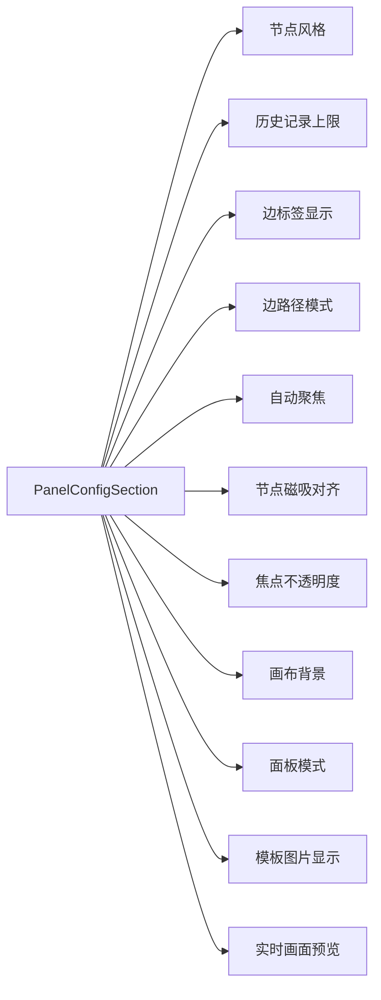
```mermaid
graph LR
A[PanelConfigSection] --> B[节点风格]
A --> C[历史记录上限]
A --> D[边标签显示]
A --> E[边路径模式]
A --> F[自动聚焦]
A --> G[节点磁吸对齐]
A --> H[焦点不透明度]
A --> I[画布背景]
A --> J[面板模式]
A --> K[模板图片显示]
A --> L[实时画面预览]
```

**图表来源**
- [PanelConfigSection.tsx:56-481](file://src/components/panels/config/PanelConfigSection.tsx#L56-L481)

#### 配置管理组件

配置管理组件提供配置的导入导出功能：

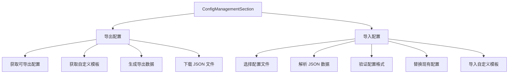
```mermaid
flowchart TD
A[ConfigManagementSection] --> B[导出配置]
A --> C[导入配置]
B --> D[获取可导出配置]
B --> E[获取自定义模板]
B --> F[生成导出数据]
B --> G[下载 JSON 文件]
C --> H[选择配置文件]
C --> I[解析 JSON 数据]
C --> J[验证配置格式]
C --> K[替换现有配置]
C --> L[导入自定义模板]
```

**图表来源**
- [ConfigManagementSection.tsx:27-102](file://src/components/panels/config/ConfigManagementSection.tsx#L27-L102)

**章节来源**
- [PanelConfigSection.tsx:10-486](file://src/components/panels/config/PanelConfigSection.tsx#L10-L486)
- [ConfigManagementSection.tsx:15-138](file://src/components/panels/config/ConfigManagementSection.tsx#L15-L138)

## 依赖关系分析

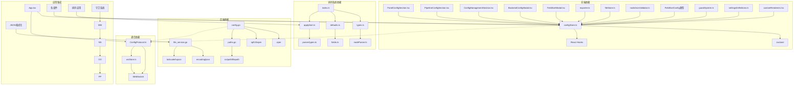
```mermaid
graph TB
subgraph "前端依赖"
A[configStore.ts] --> B[zustand]
A --> C[React Hooks]
D[PanelConfigSection.tsx] --> A
E[PipelineConfigSection.tsx] --> A
F[ConfigManagementSection.tsx] --> A
G[BackendConfigModal.tsx] --> A
H[FieldSortModal.tsx] --> A
I[exporter.ts] --> A
J[fileStore.ts] --> A
K[nodeJsonValidator.ts] --> A
L[FieldSortConfig类型] --> A
M[guardSystem.ts] --> A
N[settingsDefinitions.ts] --> A
O[customRenderers.tsx] --> A
end
subgraph "排序系统依赖"
P[index.ts] --> Q[types.ts]
P --> R[defaults.ts]
P --> S[applySort.ts]
Q --> T[nodeParser.ts]
R --> U[fields.ts]
S --> V[parser/types.ts]
end
subgraph "后端依赖"
W[config.go] --> X[viper]
W --> Y[spf13/viper]
Z[paths.go] --> AA[os/path/filepath]
W --> Z
BB[file_service.go] --> CC[encoding/json]
BB --> DD[tailscale/hujson]
end
subgraph "通信依赖"
EE[ConfigProtocol.ts] --> FF[WebSocket]
GG[wsStore.ts] --> FF
EE --> GG
end
subgraph "应用集成"
HH[App.tsx] --> A
HH --> EE
II[各组件] --> A
JJ[JSON格式化] --> BB
KK[排序应用] --> S
LL[守卫系统] --> MM
MM --> NN
NN --> OO
OO --> PP
end
A -.-> EE
W -.-> EE
```

**更新** 新增排序系统相关依赖，包括FieldSortConfig类型、排序应用逻辑等。新增守卫系统依赖，包括guardSystem、settingsDefinitions、customRenderers等组件。

**图表来源**
- [configStore.ts:1](file://src/stores/configStore.ts#L1)
- [config.go:3-11](file://LocalBridge/internal/config/config.go#L3-L11)
- [nodeJsonValidator.ts:272-279](file://src/utils/nodeJsonValidator.ts#L272-L279)
- [file_service.go:158-201](file://LocalBridge/internal/service/file/file_service.go#L158-L201)
- [applySort.ts:1-341](file://src/core/sorting/applySort.ts#L1-L341)
- [guardSystem.ts:1-38](file://src/components/panels/settings/guardSystem.ts#L1-L38)
- [settingsDefinitions.ts:1-200](file://src/components/panels/settings/settingsDefinitions.ts#L1-L200)
- [customRenderers.tsx:1-200](file://src/components/panels/settings/customRenderers.tsx#L1-L200)

**章节来源**
- [App.tsx:15-55](file://src/App.tsx#L15-L55)

## 性能考虑

### 状态管理优化

1. **选择性更新**：Zustand 支持选择性状态更新，避免不必要的组件重渲染
2. **批量更新**：通过 `replaceConfig` 方法实现批量配置更新
3. **配置分类**：按功能类别分离配置，减少无关配置的更新频率
4. **字段排序缓存**：排序配置在导出过程中会被缓存，避免重复查询
5. **已配置追踪优化**：configuredKeys使用Set数据结构，提供O(1)的查找性能

### 配置文件访问优化

1. **路径缓存**：路径管理系统缓存计算结果，避免重复的文件系统查询
2. **延迟初始化**：配置文件在首次访问时才进行加载和解析
3. **增量更新**：支持增量配置更新，减少完整配置文件的写入次数
4. **持久化优化**：localStorage存储采用批量保存策略，减少存储操作次数

### 网络通信优化

1. **连接复用**：WebSocket 连接复用，避免频繁的连接建立和断开
2. **错误重试**：实现智能的错误重试机制，提高配置同步的可靠性
3. **状态同步**：双向状态同步，确保前后端配置的一致性

### JSON格式化性能

**更新** 新增JSON格式化性能考虑：

1. **配置缓存**：jsonIndent配置值在导出过程中会被缓存，避免重复查询
2. **批量处理**：在分离模式下，Pipeline和配置文件会同时进行格式化处理
3. **内存优化**：使用流式JSON处理，避免大文件格式化时的内存峰值
4. **排序优化**：字段排序配置只在需要时应用，避免不必要的排序操作
5. **持久化优化**：localStorage批量保存配置，减少存储操作次数

### 排序系统性能

**新增** 字段排序系统的性能优化：

1. **默认配置缓存**：默认排序配置会在首次使用时缓存
2. **增量合并**：用户自定义配置与默认配置的合并只在需要时进行
3. **对象字段排序**：使用Set数据结构优化字段处理效率
4. **协议版本优化**：根据协议版本选择最优的排序策略
5. **守卫系统优化**：configuredKeys使用Set数据结构，提供O(1)的查找性能

### 守卫系统性能

**新增** 配置守卫系统的性能优化：

1. **配置追踪优化**：configuredKeys使用Set数据结构，提供O(1)的查找性能
2. **批量检查**：支持批量检查多个配置项的配置状态
3. **智能引导**：仅在必要时显示引导弹窗，避免频繁的用户交互
4. **配置定义缓存**：settingsDefinitions配置定义会被缓存，避免重复解析

## 故障排除指南

### 常见问题及解决方案

#### 配置文件加载失败

**问题症状**：
- 应用启动时报配置文件不存在错误
- 配置界面显示默认值而非预期值

**解决步骤**：
1. 检查配置文件路径是否正确
2. 验证配置文件格式是否有效
3. 确认文件权限是否正确
4. 检查磁盘空间是否充足

**章节来源**
- [config.go:53-94](file://LocalBridge/internal/config/config.go#L53-L94)

#### WebSocket 连接问题

**问题症状**：
- 配置同步失败
- 后端配置对话框无法显示
- 保存配置后无响应

**解决步骤**：
1. 检查本地服务是否正常运行
2. 验证 WebSocket 端口配置
3. 检查防火墙设置
4. 查看浏览器开发者工具中的网络错误

**章节来源**
- [ConfigProtocol.ts:128-161](file://src/services/protocols/ConfigProtocol.ts#L128-L161)

#### 配置同步冲突

**问题症状**：
- 配置更新后立即被覆盖
- 设置项在不同会话间丢失

**解决步骤**：
1. 检查是否有多个实例同时修改配置
2. 验证配置文件的写入权限
3. 清理临时配置文件
4. 重启应用以恢复配置状态

#### JSON导出格式异常

**更新** 新增JSON导出相关故障排除：

**问题症状**：
- 导出的JSON文件缩进格式不正确
- 导出的JSON文件出现格式错误
- 分离模式下的配置文件格式异常

**解决步骤**：
1. 检查jsonIndent配置值是否在0-16范围内
2. 验证导出的JSON数据结构是否有效
3. 确认后端服务是否正确接收缩进参数
4. 检查文件权限是否允许写入导出文件

#### 字段排序配置异常

**新增** 字段排序相关故障排除：

**问题症状**：
- 字段排序配置无法保存
- 导出的字段顺序不符合预期
- 字段排序模态框无法打开

**解决步骤**：
1. 检查FieldSortModal组件是否正确导入
2. 验证FieldSortConfig类型定义是否正确
3. 确认排序配置是否在配置存储中正确保存
4. 检查排序应用逻辑是否正确处理协议版本
5. 验证拖拽排序功能是否正常工作

#### 配置持久化问题

**新增** 配置持久化相关故障排除：

**问题症状**：
- 应用重启后配置丢失
- localStorage存储空间不足
- 配置恢复失败

**解决步骤**：
1. 检查浏览器localStorage功能是否正常
2. 验证localStorage配额是否足够
3. 检查浏览器隐私设置是否阻止localStorage
4. 清理浏览器缓存和localStorage数据
5. 检查文件存储是否正确保存配置

#### 守卫系统异常

**新增** 配置守卫相关故障排除：

**问题症状**：
- 守卫系统无法正常工作
- 配置引导弹窗频繁出现
- 关键操作无法执行

**解决步骤**：
1. 检查configuredKeys集合是否正确更新
2. 验证配置定义是否正确设置guardAction
3. 确认守卫检查逻辑是否正常执行
4. 检查配置项是否正确标记为已配置
5. 验证settingsDefinitions配置是否正确

## 版本管理与发布流程

### 版本标识系统

系统采用多层版本标识机制来跟踪开发进度：

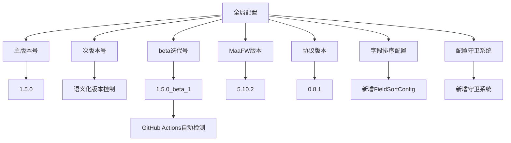
```mermaid
flowchart TD
A[全局配置] --> B[主版本号]
A --> C[次版本号]
A --> D[beta迭代号]
A --> E[MaaFW版本]
A --> F[协议版本]
A --> G[字段排序配置]
A --> H[配置守卫系统]
B --> I[1.5.0]
C --> J[语义化版本控制]
D --> K[1.5.0_beta_1]
E --> L[5.10.2]
F --> M[0.8.1]
K --> N[GitHub Actions自动检测]
G --> O[新增FieldSortConfig]
H --> P[新增守卫系统]
```

**更新** 版本信息更新详情：
- **主版本号**：1.5.0
- **次版本号**：语义化版本控制
- **Beta迭代号**：从0更新到1，体现持续开发进度
- **MaaFW版本**：5.10.2
- **协议版本**：0.8.1
- **字段排序配置**：新增FieldSortConfig配置项
- **配置守卫系统**：新增守卫系统功能

**图表来源**
- [configStore.ts:5-16](file://src/stores/configStore.ts#L5-L16)

### GitHub Actions自动化部署

系统使用GitHub Actions实现自动化部署流程，特别关注beta迭代号的变化：

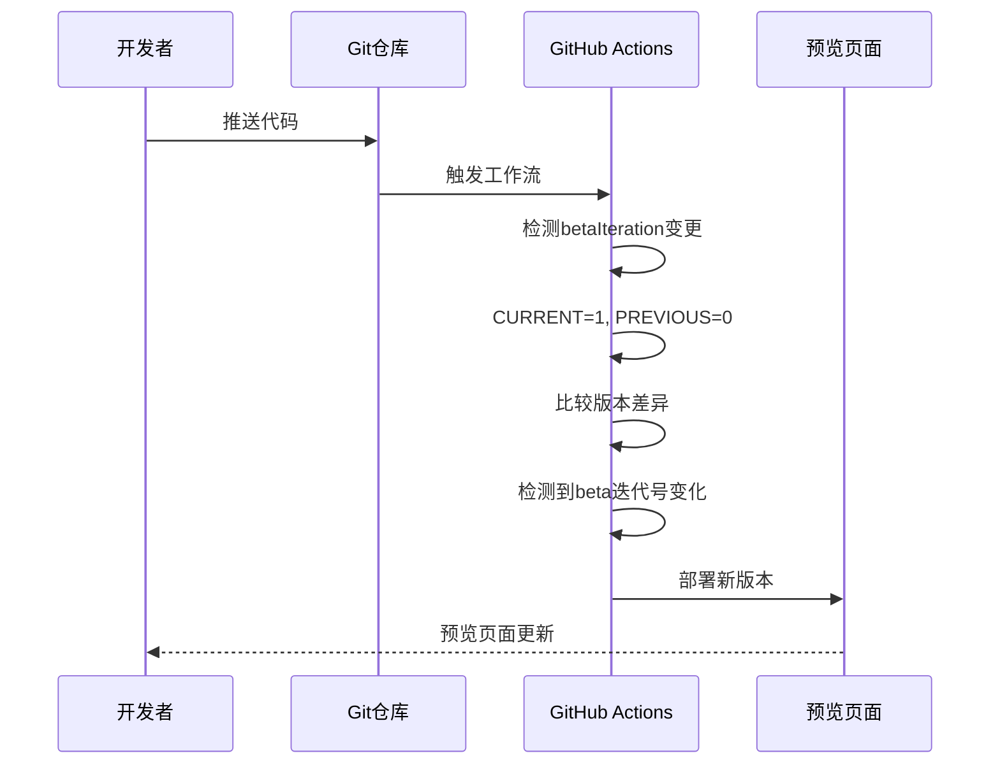
```mermaid
sequenceDiagram
participant Dev as 开发者
participant Repo as Git仓库
participant Actions as GitHub Actions
participant Preview as 预览页面
Dev->>Repo : 推送代码
Repo->>Actions : 触发工作流
Actions->>Actions : 检测betaIteration变更
Actions->>Actions : CURRENT=1, PREVIOUS=0
Actions->>Actions : 比较版本差异
Actions->>Actions : 检测到beta迭代号变化
Actions->>Preview : 部署新版本
Preview-->>Dev : 预览页面更新
```

**更新** GitHub Actions工作流现在监控beta迭代号从0到1的变更，确保每次beta迭代都触发部署流程。

**图表来源**
- [.github/workflows/preview.yaml:36-62](file://.github/workflows/preview.yaml#L36-L62)

### 测试文件版本兼容性

测试文件也反映了版本更新的影响：

**更新** 错误测试文件中的版本标识：
- **测试文件版本**：v1.3.0_beta_3
- **实际系统版本**：v1.5.0_beta_1

这表明测试文件可能需要更新以匹配当前的系统版本。

**章节来源**
- [error.json:10](file://LocalBridge/test-json/base/error.json#L10)

## 结论

配置存储系统通过分层架构设计，成功实现了前端状态管理、后端配置管理和通信协议的无缝集成。系统的主要优势包括：

1. **模块化设计**：清晰的职责分离使得系统易于维护和扩展
2. **类型安全**：完整的 TypeScript 类型定义确保了配置使用的安全性
3. **实时同步**：基于 WebSocket 的双向通信保证了配置的一致性
4. **灵活配置**：支持多种运行模式和配置策略，适应不同的使用场景
5. **JSON格式化增强**：新增的JSON导出缩进配置提升了配置文件的可读性和一致性
6. **字段排序功能**：新增的字段排序配置功能允许用户自定义字段显示顺序
7. **版本管理完善**：多层版本标识和自动化部署流程确保了开发进度的有效跟踪
8. **配置持久化**：新增的localStorage持久化机制确保用户配置的持久保存
9. **配置守卫系统**：新增的守卫系统提供智能的配置引导功能
10. **配置验证系统**：新增的验证系统确保配置数据的正确性和完整性

**更新** 最新的字段排序配置功能、配置守卫系统和自动持久化机制进一步增强了系统的灵活性和用户体验。当前版本1.5.0_beta_1体现了持续的开发进度，beta迭代号从0更新到1，配合GitHub Actions的自动化部署流程，确保了每次迭代都能及时反映到预览环境中。

未来可以考虑的改进方向：
- 添加配置版本控制机制
- 实现配置模板功能
- 增强配置导入导出的兼容性
- 优化大规模配置的性能表现
- 扩展JSON格式化的高级选项
- 添加JSON格式验证功能
- 完善测试文件的版本同步机制
- 增加字段排序配置的备份和恢复功能
- 提供字段排序配置的批量导入导出功能
- 扩展守卫系统的配置范围
- 增强配置验证的规则定制功能
- 优化持久化存储的性能表现