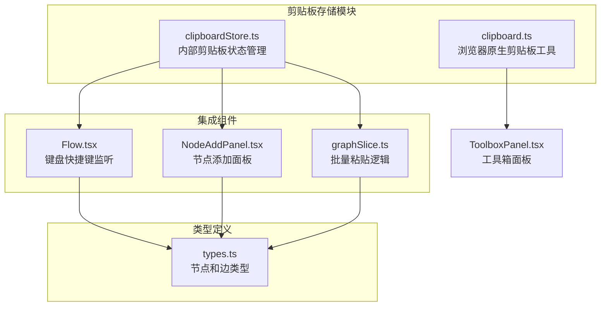
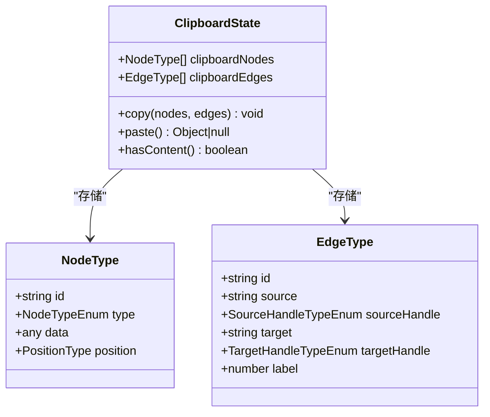
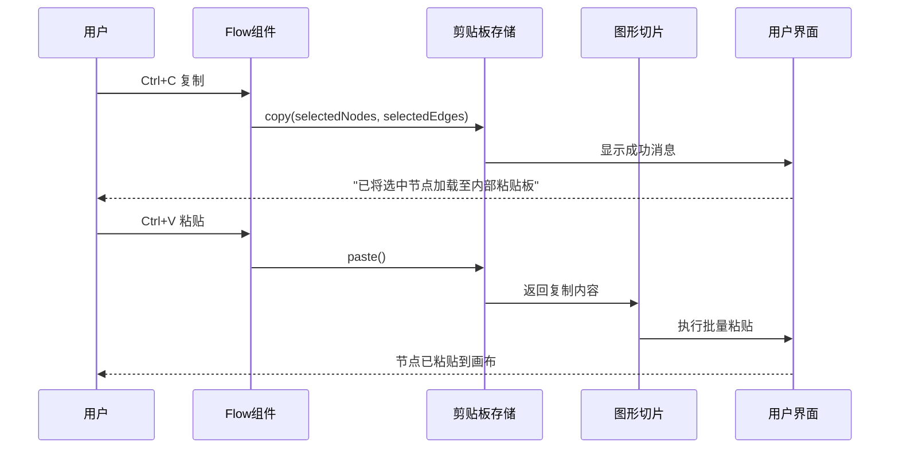
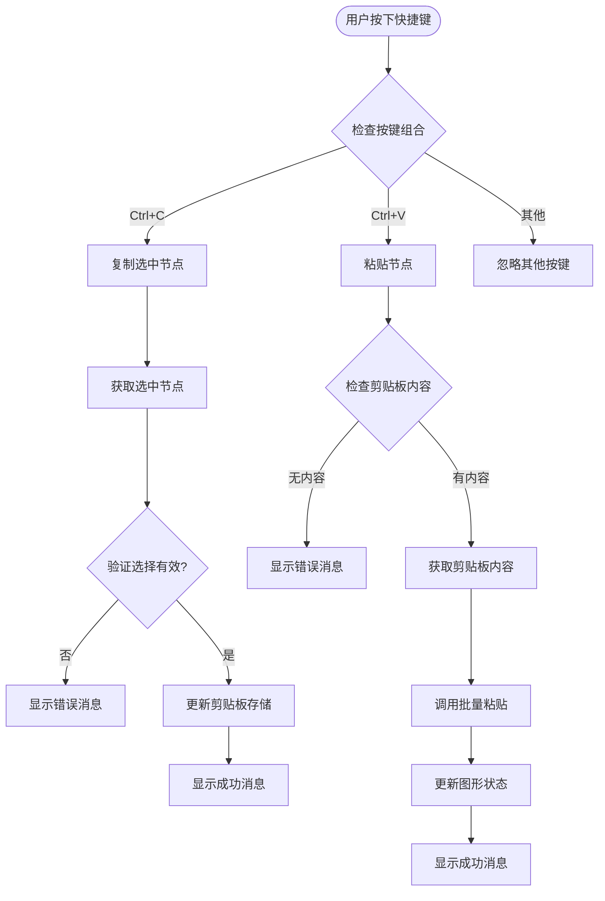
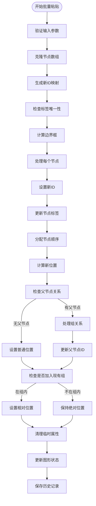
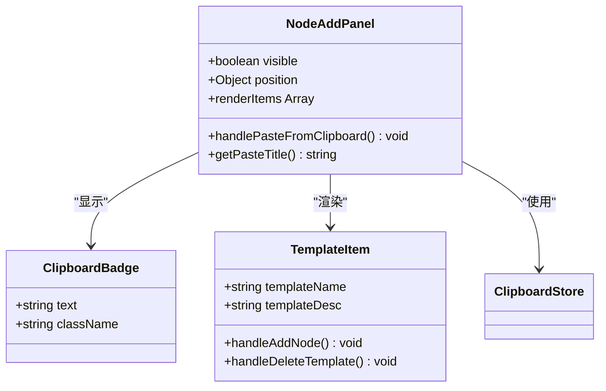
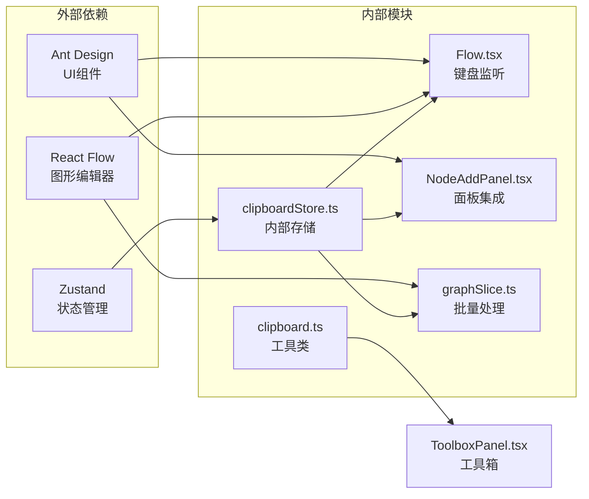

# 剪贴板存储

<cite>
**本文档引用的文件**
- [clipboardStore.ts](file://src/stores/clipboardStore.ts)
- [clipboard.ts](file://src/utils/clipboard.ts)
- [Flow.tsx](file://src/components/Flow.tsx)
- [NodeAddPanel.tsx](file://src/components/panels/main/NodeAddPanel.tsx)
- [graphSlice.ts](file://src/stores/flow/slices/graphSlice.ts)
- [types.ts](file://src/stores/flow/types.ts)
- [ToolboxPanel.tsx](file://src/components/panels/tools/ToolboxPanel.tsx)
</cite>

## 目录
1. [简介](#简介)
2. [项目结构](#项目结构)
3. [核心组件](#核心组件)
4. [架构概览](#架构概览)
5. [详细组件分析](#详细组件分析)
6. [依赖关系分析](#依赖关系分析)
7. [性能考虑](#性能考虑)
8. [故障排除指南](#故障排除指南)
9. [结论](#结论)

## 简介

剪贴板存储是Maa Pipeline Editor中的一个重要功能模块，它提供了两种不同类型的剪贴板操作：

1. **内部剪贴板存储**：用于工作流节点和边的复制粘贴操作
2. **浏览器原生剪贴板**：用于文本内容的复制粘贴操作

该模块通过Zustand状态管理库实现了高效的状态管理，并与React Flow图形编辑器深度集成，为用户提供流畅的工作流编辑体验。

## 项目结构

剪贴板存储功能分布在以下主要文件中：

**图表来源**
- [clipboardStore.ts:1-51](file://src/stores/clipboardStore.ts#L1-L51)
- [clipboard.ts:1-64](file://src/utils/clipboard.ts#L1-L64)
- [Flow.tsx:49-95](file://src/components/Flow.tsx#L49-L95)

**章节来源**
- [clipboardStore.ts:1-51](file://src/stores/clipboardStore.ts#L1-L51)
- [clipboard.ts:1-64](file://src/utils/clipboard.ts#L1-L64)
- [Flow.tsx:49-95](file://src/components/Flow.tsx#L49-L95)

## 核心组件

### 内部剪贴板存储 (ClipboardStore)

内部剪贴板存储使用Zustand实现，提供以下核心功能：

- **复制操作**：将选中的节点和边复制到内部存储
- **粘贴操作**：从内部存储中获取复制的内容
- **内容检查**：验证剪贴板中是否存在内容

**图表来源**
- [clipboardStore.ts:5-11](file://src/stores/clipboardStore.ts#L5-L11)
- [types.ts:28-38](file://src/stores/flow/types.ts#L28-L38)

### 浏览器原生剪贴板工具 (ClipboardHelper)

浏览器原生剪贴板工具提供了静态方法来处理文本内容的复制和粘贴：

- **write**：将任意内容写入剪贴板（自动序列化为JSON）
- **writeString**：直接写入字符串内容
- **read**：从剪贴板读取文本内容

**章节来源**
- [clipboardStore.ts:13-50](file://src/stores/clipboardStore.ts#L13-L50)
- [clipboard.ts:3-63](file://src/utils/clipboard.ts#L3-L63)

## 架构概览

剪贴板存储系统采用分层架构设计，确保功能的模块化和可维护性：

**图表来源**
- [Flow.tsx:77-91](file://src/components/Flow.tsx#L77-L91)
- [clipboardStore.ts:18-43](file://src/stores/clipboardStore.ts#L18-L43)
- [graphSlice.ts:56-279](file://src/stores/flow/slices/graphSlice.ts#L56-L279)

## 详细组件分析

### 键盘快捷键集成

工作流组件通过键盘监听机制实现了标准的Ctrl+C和Ctrl+V快捷键支持：

**图表来源**
- [Flow.tsx:77-91](file://src/components/Flow.tsx#L77-L91)
- [clipboardStore.ts:18-43](file://src/stores/clipboardStore.ts#L18-L43)

### 批量粘贴功能

批量粘贴功能实现了复杂的位置计算和节点关系处理：

**图表来源**
- [graphSlice.ts:56-279](file://src/stores/flow/slices/graphSlice.ts#L56-L279)

### 节点添加面板集成

节点添加面板提供了直观的粘贴操作入口：

**图表来源**
- [NodeAddPanel.tsx:575-612](file://src/components/panels/main/NodeAddPanel.tsx#L575-L612)

**章节来源**
- [Flow.tsx:49-95](file://src/components/Flow.tsx#L49-L95)
- [NodeAddPanel.tsx:575-612](file://src/components/panels/main/NodeAddPanel.tsx#L575-L612)
- [graphSlice.ts:56-279](file://src/stores/flow/slices/graphSlice.ts#L56-L279)

## 依赖关系分析

剪贴板存储系统具有清晰的依赖关系：

**图表来源**
- [clipboardStore.ts:1-3](file://src/stores/clipboardStore.ts#L1-L3)
- [Flow.tsx:53-65](file://src/components/Flow.tsx#L53-L65)

**章节来源**
- [clipboardStore.ts:1-3](file://src/stores/clipboardStore.ts#L1-L3)
- [Flow.tsx:53-65](file://src/components/Flow.tsx#L53-L65)

## 性能考虑

剪贴板存储系统在设计时充分考虑了性能优化：

### 状态管理优化
- 使用Zustand替代Redux，减少不必要的状态更新
- 采用选择器模式避免组件重新渲染
- 内存友好的状态结构设计

### 批量操作优化
- 克隆操作使用深拷贝避免引用污染
- ID映射表提高父子关系处理效率
- 批量更新减少多次状态变更

### 用户体验优化
- 即时反馈机制提升交互响应速度
- 错误处理确保操作的可靠性
- 自动聚焦功能改善用户体验

## 故障排除指南

### 常见问题及解决方案

#### 复制操作失败
**症状**：复制节点时无任何反应
**可能原因**：
- 未选中任何节点
- 浏览器权限限制

**解决方法**：
1. 确保至少选中一个节点
2. 检查浏览器剪贴板权限设置

#### 粘贴操作异常
**症状**：粘贴时出现位置错误或节点丢失
**可能原因**：
- 父子节点关系处理异常
- 节点ID冲突

**解决方法**：
1. 检查节点的父子关系
2. 重新生成节点ID

#### 性能问题
**症状**：大量节点复制粘贴时卡顿
**解决方法**：
1. 分批处理大量节点
2. 优化节点渲染
3. 使用虚拟滚动

**章节来源**
- [clipboardStore.ts:18-30](file://src/stores/clipboardStore.ts#L18-L30)
- [graphSlice.ts:75-115](file://src/stores/flow/slices/graphSlice.ts#L75-L115)

## 结论

剪贴板存储系统通过精心设计的架构和实现，为Maa Pipeline Editor提供了强大而灵活的节点复制粘贴功能。系统的主要优势包括：

1. **模块化设计**：清晰的功能分离便于维护和扩展
2. **高性能实现**：优化的状态管理和批量处理算法
3. **良好的用户体验**：直观的界面和即时反馈机制
4. **完善的错误处理**：健壮的异常处理和用户提示

该系统不仅满足了当前的功能需求，还为未来的功能扩展奠定了坚实的基础。通过合理的架构设计和性能优化，为用户提供了流畅高效的工作流编辑体验。