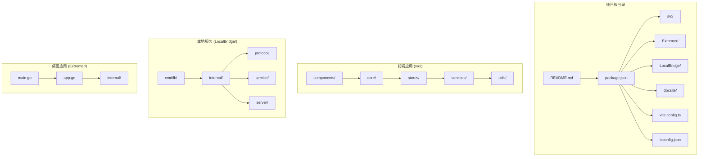
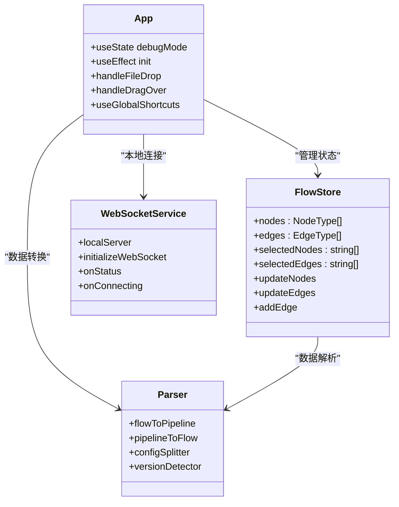
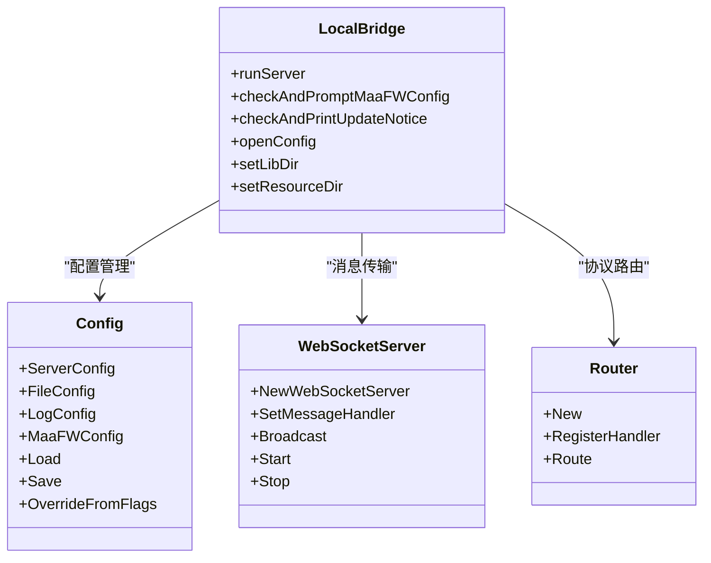
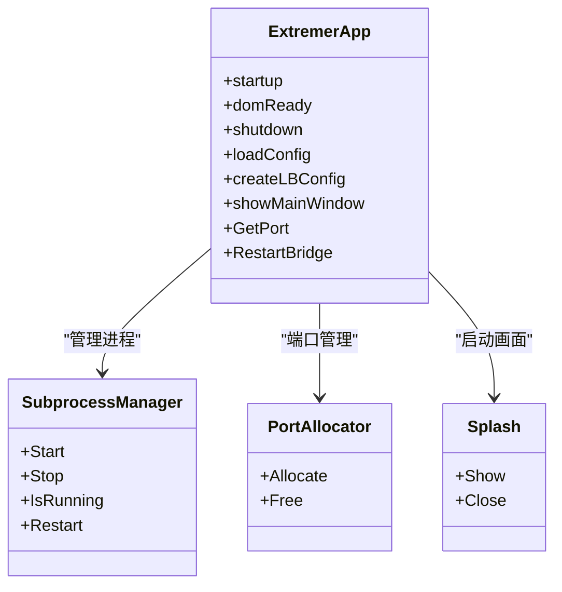
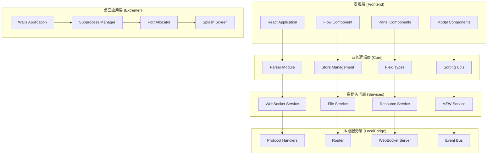
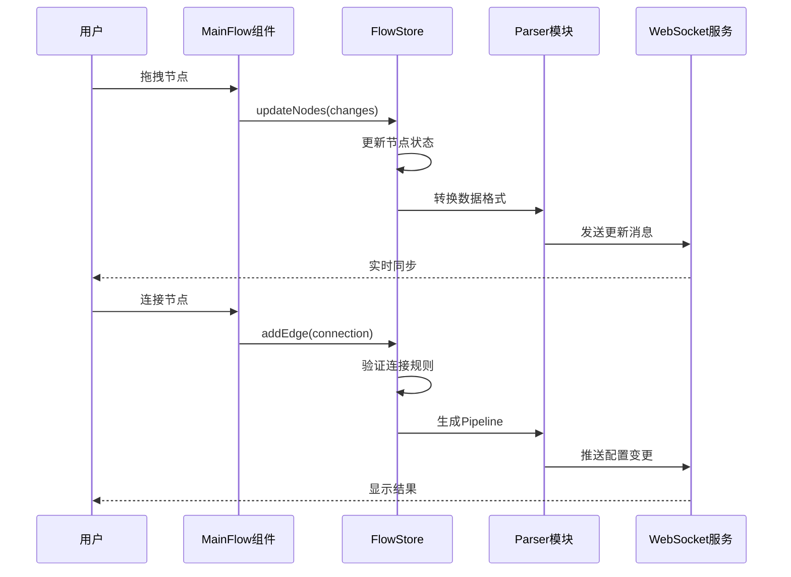
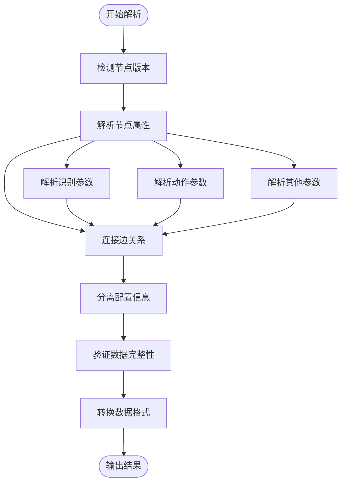
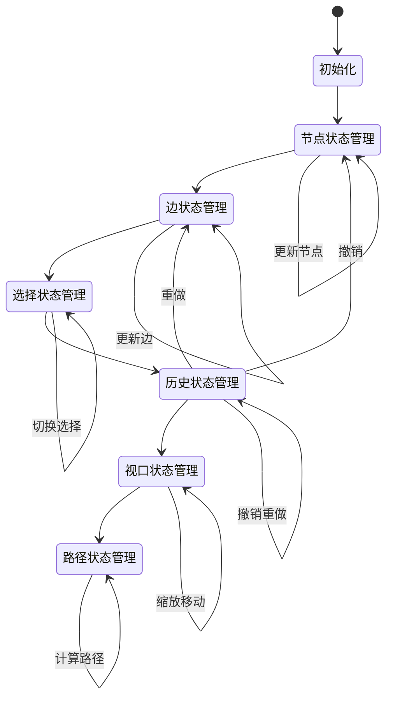
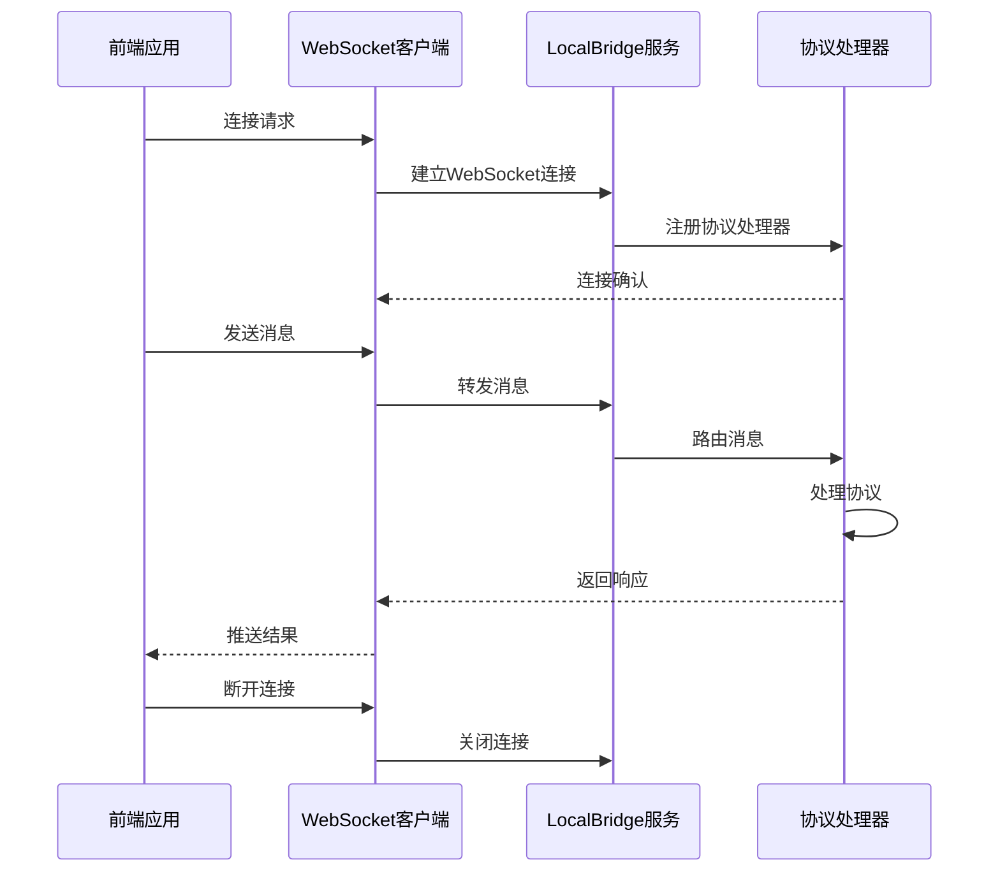
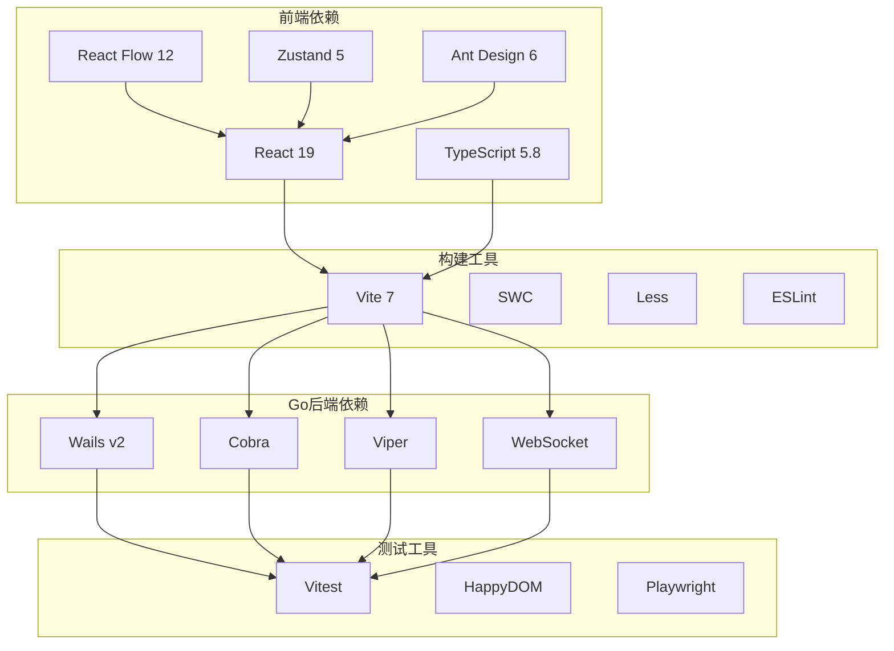

# 开发者指南

<cite>
**本文档引用的文件**
- [README.md](file://README.md)
- [package.json](file://package.json)
- [src/main.tsx](file://src/main.tsx)
- [src/App.tsx](file://src/App.tsx)
- [Extremer/main.go](file://Extremer/main.go)
- [Extremer/app.go](file://Extremer/app.go)
- [LocalBridge/cmd/lb/main.go](file://LocalBridge/cmd/lb/main.go)
- [LocalBridge/internal/config/config.go](file://LocalBridge/internal/config/config.go)
- [src/core/parser/index.ts](file://src/core/parser/index.ts)
- [src/stores/flow/index.ts](file://src/stores/flow/index.ts)
- [src/components/Flow.tsx](file://src/components/Flow.tsx)
- [vite.config.ts](file://vite.config.ts)
- [tsconfig.json](file://tsconfig.json)
</cite>

## 目录
1. [简介](#简介)
2. [项目结构](#项目结构)
3. [核心组件](#核心组件)
4. [架构概览](#架构概览)
5. [详细组件分析](#详细组件分析)
6. [依赖关系分析](#依赖关系分析)
7. [性能考虑](#性能考虑)
8. [故障排除指南](#故障排除指南)
9. [结论](#结论)
10. [附录](#附录)

## 简介

MaaPipelineEditor (MPE) 是一款基于 React 19 和 TypeScript 5.8 的现代化 Pipeline 编辑器，采用前后端分离架构设计。该项目旨在为 MaaFramework 提供可视化的工作流编辑体验，支持拖拽式节点创建、智能连接、实时调试和丰富的辅助功能。

项目具有以下核心特点：
- **跨平台支持**：基于 Web 技术，支持 Windows、macOS 和 Linux
- **模块化架构**：前端 React 应用与 Go 后端服务分离
- **本地服务集成**：通过 LocalBridge 提供文件管理和 MaaFramework 集成
- **一体化打包**：Extremer 提供完整的桌面应用解决方案

## 项目结构

项目采用多模块架构，主要包含以下核心目录：



**图表来源**
- [package.json:1-71](file://package.json#L1-L71)
- [src/main.tsx:1-18](file://src/main.tsx#L1-L18)
- [Extremer/main.go:1-90](file://Extremer/main.go#L1-L90)

**章节来源**
- [README.md:31-90](file://README.md#L31-L90)
- [package.json:1-71](file://package.json#L1-L71)

## 核心组件

### 前端应用架构

前端应用基于 React 19 和 TypeScript 5.8 构建，采用模块化设计：



**图表来源**
- [src/App.tsx:111-333](file://src/App.tsx#L111-L333)
- [src/stores/flow/index.ts:15-24](file://src/stores/flow/index.ts#L15-L24)
- [src/core/parser/index.ts:19-46](file://src/core/parser/index.ts#L19-L46)

### 本地服务架构

LocalBridge 提供强大的本地服务功能，支持文件管理、MaaFramework 集成和实时通信：



**图表来源**
- [LocalBridge/cmd/lb/main.go:183-440](file://LocalBridge/cmd/lb/main.go#L183-L440)
- [LocalBridge/internal/config/config.go:54-95](file://LocalBridge/internal/config/config.go#L54-L95)

### 桌面应用架构

Extremer 提供完整的桌面应用解决方案，集成本地服务和用户界面：



**图表来源**
- [Extremer/app.go:182-475](file://Extremer/app.go#L182-L475)
- [Extremer/main.go:26-89](file://Extremer/main.go#L26-L89)

**章节来源**
- [src/App.tsx:111-333](file://src/App.tsx#L111-L333)
- [LocalBridge/cmd/lb/main.go:183-440](file://LocalBridge/cmd/lb/main.go#L183-L440)
- [Extremer/app.go:182-475](file://Extremer/app.go#L182-L475)

## 架构概览

项目采用三层架构设计，实现了高度的模块化和可扩展性：



**图表来源**
- [src/App.tsx:296-330](file://src/App.tsx#L296-L330)
- [src/core/parser/index.ts:19-85](file://src/core/parser/index.ts#L19-L85)
- [LocalBridge/cmd/lb/main.go:386-413](file://LocalBridge/cmd/lb/main.go#L386-L413)

## 详细组件分析

### 流程编辑器组件

MainFlow 组件是整个应用的核心，提供了完整的可视化编辑体验：



**图表来源**
- [src/components/Flow.tsx:254-327](file://src/components/Flow.tsx#L254-L327)
- [src/stores/flow/index.ts:16-24](file://src/stores/flow/index.ts#L16-L24)

#### 节点类型系统

应用支持多种节点类型，每种类型都有特定的功能和外观：

| 节点类型 | 描述 | 主要用途 |
|---------|------|----------|
| PipelineNode | 主要工作流节点 | 核心业务逻辑 |
| ExternalNode | 外部引用节点 | 引用外部资源 |
| AnchorNode | 锚点节点 | 作为连接参考点 |
| StickerNode | 便签节点 | 标记和注释 |
| GroupNode | 分组节点 | 组织和管理节点 |

**章节来源**
- [src/components/Flow.tsx:195-584](file://src/components/Flow.tsx#L195-L584)
- [src/stores/flow/index.ts:48-67](file://src/stores/flow/index.ts#L48-L67)

### 数据解析器

Parser 模块负责 Pipeline 格式与 Flow 格式之间的转换：



**图表来源**
- [src/core/parser/index.ts:19-85](file://src/core/parser/index.ts#L19-L85)

#### 版本兼容性

解析器支持多版本兼容，能够处理不同版本的 Pipeline 格式：

| 版本 | 特性 | 兼容性 |
|------|------|--------|
| v1 | 基础节点类型 | 完全兼容 |
| v2 | 增强识别功能 | 部分兼容 |
| v3 | 新增动作类型 | 需要升级 |

**章节来源**
- [src/core/parser/index.ts:59-64](file://src/core/parser/index.ts#L59-L64)

### 状态管理系统

应用使用 Zustand 作为状态管理库，实现了高效的组件状态同步：



**图表来源**
- [src/stores/flow/index.ts:16-24](file://src/stores/flow/index.ts#L16-L24)

**章节来源**
- [src/stores/flow/index.ts:1-109](file://src/stores/flow/index.ts#L1-L109)

### 本地服务通信

WebSocket 服务提供了前后端实时通信能力：



**图表来源**
- [src/services/index.ts:1-6](file://src/services/index.ts#L1-L6)
- [LocalBridge/cmd/lb/main.go:415-420](file://LocalBridge/cmd/lb/main.go#L415-L420)

**章节来源**
- [src/services/index.ts:1-6](file://src/services/index.ts#L1-L6)
- [LocalBridge/cmd/lb/main.go:386-413](file://LocalBridge/cmd/lb/main.go#L386-L413)

## 依赖关系分析

项目使用现代化的依赖管理策略，确保开发效率和运行性能：



**图表来源**
- [package.json:24-69](file://package.json#L24-L69)
- [Extremer/main.go:9-16](file://Extremer/main.go#L9-L16)

**章节来源**
- [package.json:1-71](file://package.json#L1-L71)
- [vite.config.ts:1-41](file://vite.config.ts#L1-L41)

## 性能考虑

### 前端性能优化

应用采用了多项性能优化策略：

1. **懒加载组件**：使用 React.lazy 和 Suspense 实现组件懒加载
2. **状态分片**：使用 Zustand 的分片状态管理减少不必要的重渲染
3. **防抖机制**：对频繁操作使用防抖处理
4. **虚拟滚动**：对大量节点使用虚拟滚动技术

### 后端性能优化

LocalBridge 服务实现了高效的并发处理：

1. **协程池**：使用 goroutine 处理并发请求
2. **连接池**：复用数据库和外部服务连接
3. **缓存机制**：对频繁访问的数据进行缓存
4. **异步处理**：耗时操作异步执行，避免阻塞主线程

## 故障排除指南

### 常见问题及解决方案

#### WebSocket 连接问题

**问题描述**：前端无法连接到 LocalBridge 服务

**诊断步骤**：
1. 检查 LocalBridge 服务是否正常运行
2. 验证端口配置是否正确
3. 查看浏览器控制台错误信息

**解决方案**：
```bash
# 启动 LocalBridge 服务
cd LocalBridge
go run cmd/lb/main.go

# 检查端口占用
netstat -an | grep 9066

# 查看日志
tail -f logs/*.log
```

#### 配置文件问题

**问题描述**：配置文件加载失败或路径错误

**诊断步骤**：
1. 检查配置文件格式是否正确
2. 验证路径权限
3. 确认文件编码

**解决方案**：
```bash
# 重新生成默认配置
mpelb config open

# 检查配置路径
mpelb info

# 设置 MaaFramework 路径
mpelb config set-lib "C:\MaaFramework\bin"
mpelb config set-resource "C:\MaaResource"
```

#### 性能问题

**问题描述**：应用运行缓慢或内存占用过高

**诊断步骤**：
1. 使用浏览器性能分析工具
2. 检查网络请求
3. 监控内存使用情况

**优化建议**：
1. 减少节点数量
2. 关闭不必要的面板
3. 清理缓存数据
4. 更新到最新版本

**章节来源**
- [LocalBridge/cmd/lb/main.go:442-492](file://LocalBridge/cmd/lb/main.go#L442-L492)
- [Extremer/app.go:467-475](file://Extremer/app.go#L467-L475)

## 结论

MaaPipelineEditor 是一个设计精良、功能完善的 Pipeline 编辑器。项目采用现代化的技术栈和架构设计，为用户提供了优秀的开发体验。

### 主要优势

1. **模块化设计**：清晰的组件分离和职责划分
2. **跨平台支持**：统一的代码基础支持多平台部署
3. **高性能架构**：优化的前端和后端性能
4. **丰富的功能**：完整的编辑、调试和协作功能
5. **良好的扩展性**：插件化的架构便于功能扩展

### 发展方向

1. **AI 集成**：进一步增强 AI 辅助功能
2. **云端协作**：支持多人实时协作编辑
3. **移动端支持**：开发移动端应用
4. **插件生态**：建立丰富的插件生态系统
5. **性能优化**：持续优化大型项目的处理能力

## 附录

### 开发环境设置

```bash
# 克隆项目
git clone https://github.com/kqcoxn/MaaPipelineEditor.git
cd MaaPipelineEditor

# 安装前端依赖
npm install

# 启动开发服务器
npm run dev

# 启动本地服务
npm run server

# 构建生产版本
npm run build
```

### 构建配置

项目支持多种构建模式：

| 模式 | 用途 | 基础路径 |
|------|------|----------|
| stable | 生产环境 | `/stable/` |
| preview | 预览环境 | `/MaaPipelineEditor/` |
| extremer | 桌面应用 | `./` |
| 其他 | 开发环境 | `/{mode}/` |

### 贡献指南

1. **代码规范**：遵循 ESLint 和 TypeScript 规范
2. **测试要求**：每个功能都需要相应的单元测试
3. **文档更新**：修改功能时同步更新文档
4. **版本管理**：使用语义化版本控制
5. **代码审查**：所有代码变更需要代码审查