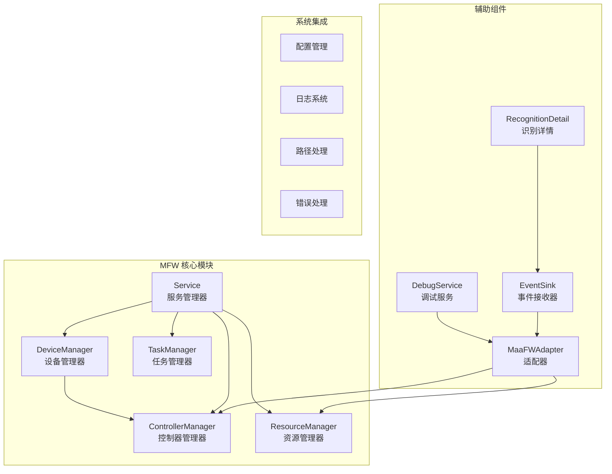
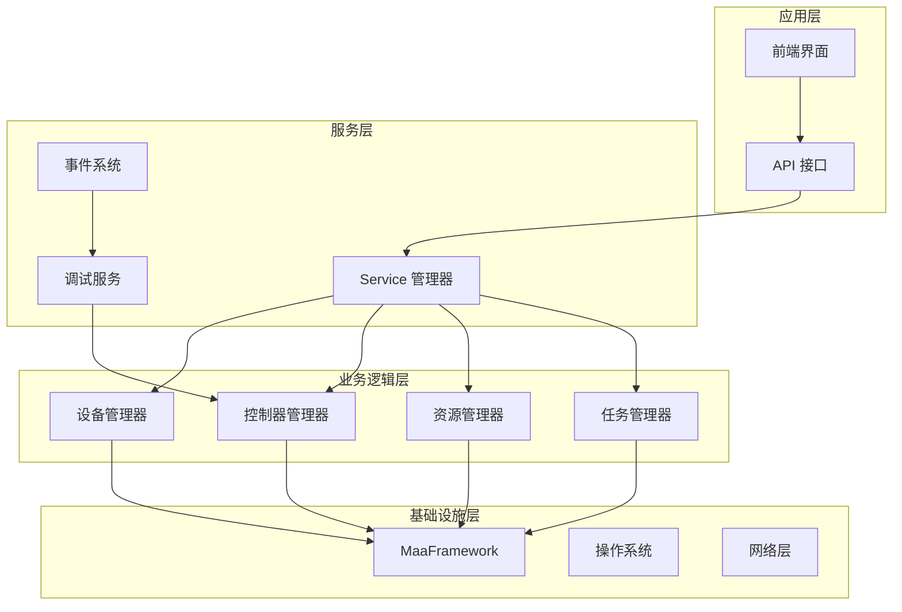
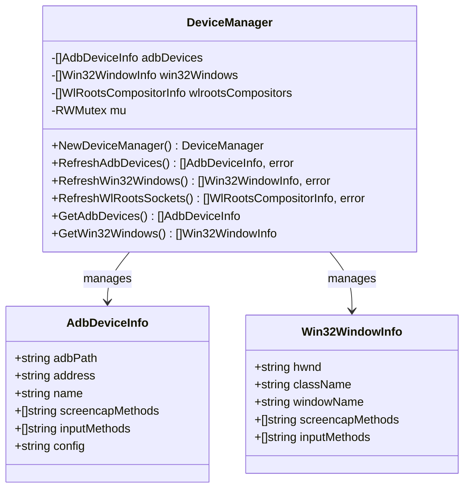
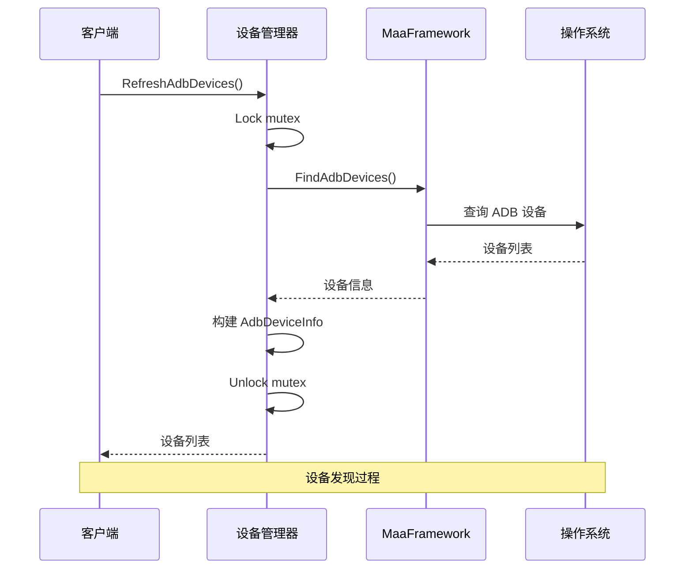
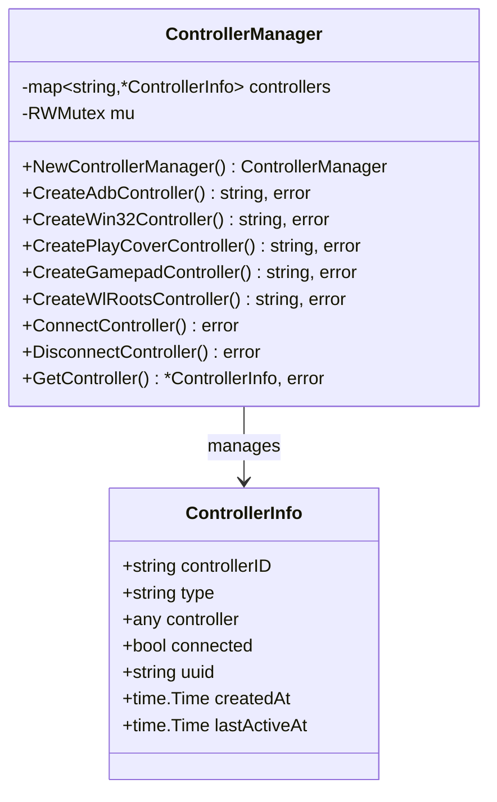
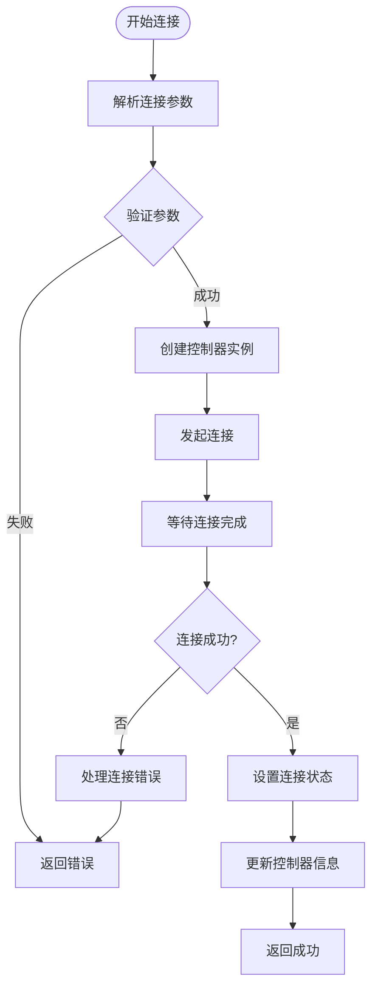
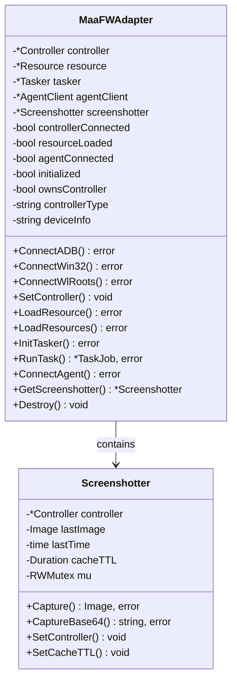
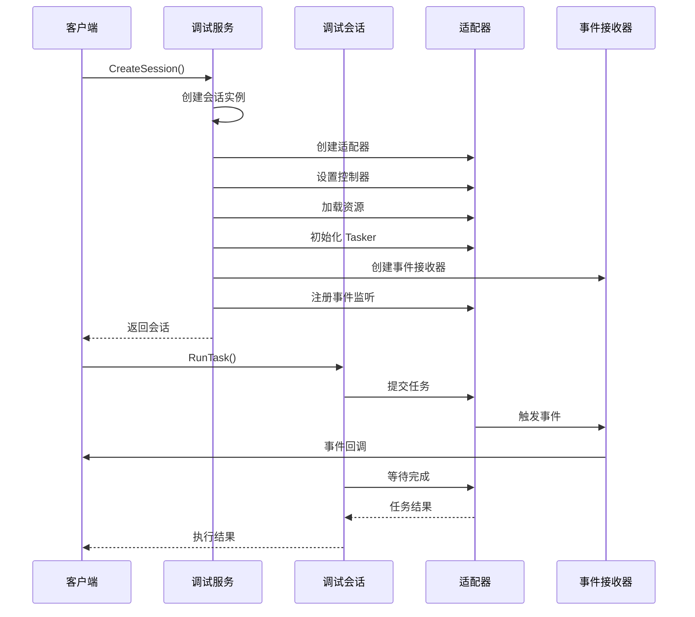
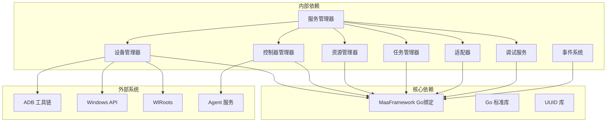
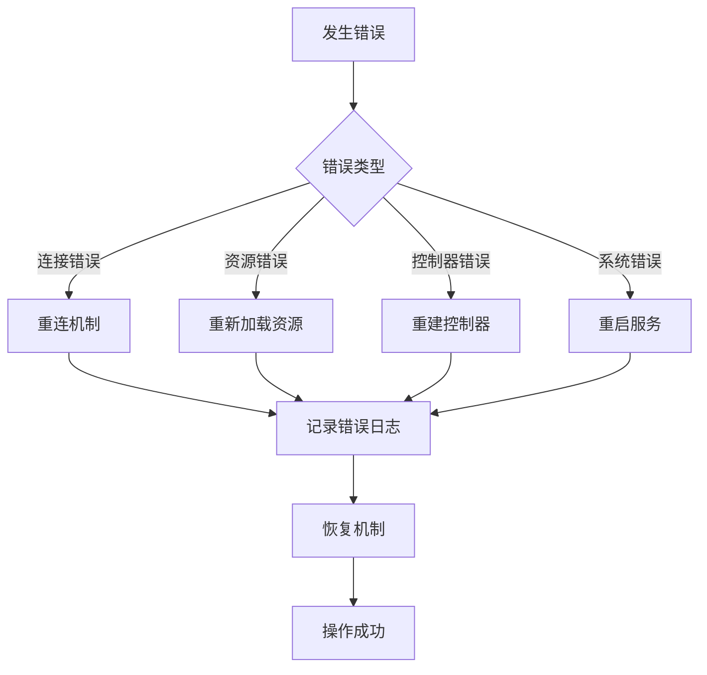

# 设备管理器

<cite>
**本文档引用的文件**
- [device_manager.go](file://LocalBridge/internal/mfw/device_manager.go)
- [controller_manager.go](file://LocalBridge/internal/mfw/controller_manager.go)
- [service.go](file://LocalBridge/internal/mfw/service.go)
- [types.go](file://LocalBridge/internal/mfw/types.go)
- [resource_manager.go](file://LocalBridge/internal/mfw/resource_manager.go)
- [task_manager.go](file://LocalBridge/internal/mfw/task_manager.go)
- [error.go](file://LocalBridge/internal/mfw/error.go)
- [event_sink.go](file://LocalBridge/internal/mfw/event_sink.go)
- [adapter.go](file://LocalBridge/internal/mfw/adapter.go)
- [debug_service_v2.go](file://LocalBridge/internal/mfw/debug_service_v2.go)
- [reco_detail_helper.go](file://LocalBridge/internal/mfw/reco_detail_helper.go)
- [lib_loader_windows.go](file://LocalBridge/internal/mfw/lib_loader_windows.go)
- [lib_loader_unix.go](file://LocalBridge/internal/mfw/lib_loader_unix.go)
- [path_unix.go](file://LocalBridge/internal/mfw/path_unix.go)
- [path_windows.go](file://LocalBridge/internal/mfw/path_windows.go)
</cite>

## 目录
1. [简介](#简介)
2. [项目结构](#项目结构)
3. [核心组件](#核心组件)
4. [架构概览](#架构概览)
5. [详细组件分析](#详细组件分析)
6. [依赖关系分析](#依赖关系分析)
7. [性能考虑](#性能考虑)
8. [故障排除指南](#故障排除指南)
9. [结论](#结论)

## 简介

设备管理器是 MaaPipelineEditor 本地桥接服务的核心组件，负责管理各种类型的设备连接和控制。该系统基于 MaaFramework Go 语言绑定，提供了统一的设备抽象层，支持 ADB 设备、Windows 桌面窗口、WlRoots 合成器等多种设备类型。

系统采用模块化设计，通过服务管理器协调各个子系统的生命周期，提供完整的设备发现、连接、控制和调试功能。支持多平台部署，包括 Windows、Linux 和 macOS 系统。

## 项目结构

LocalBridge 项目的 MFW（MaaFramework）模块位于 `LocalBridge/internal/mfw/` 目录下，采用分层架构设计：

**图表来源**
- [device_manager.go:1-127](file://LocalBridge/internal/mfw/device_manager.go#L1-L127)
- [controller_manager.go:1-800](file://LocalBridge/internal/mfw/controller_manager.go#L1-L800)
- [service.go:1-218](file://LocalBridge/internal/mfw/service.go#L1-L218)

**章节来源**
- [device_manager.go:1-127](file://LocalBridge/internal/mfw/device_manager.go#L1-L127)
- [service.go:15-34](file://LocalBridge/internal/mfw/service.go#L15-L34)

## 核心组件

### 设备管理器 (DeviceManager)

设备管理器负责发现和管理各种类型的设备，提供统一的设备抽象接口：

**主要功能：**
- ADB 设备发现和管理
- Windows 桌面窗口枚举
- WlRoots 合成器检测
- 设备信息缓存和查询

**支持的设备类型：**
- **ADB 设备**：Android 设备，支持多种截图和输入方法
- **Win32 窗口**：Windows 桌面应用程序窗口
- **WlRoots 合成器**：Linux Wayland 显示服务器

**章节来源**
- [device_manager.go:11-25](file://LocalBridge/internal/mfw/device_manager.go#L11-L25)
- [device_manager.go:27-61](file://LocalBridge/internal/mfw/device_manager.go#L27-L61)
- [device_manager.go:63-96](file://LocalBridge/internal/mfw/device_manager.go#L63-L96)
- [device_manager.go:98-112](file://LocalBridge/internal/mfw/device_manager.go#L98-L112)

### 控制器管理器 (ControllerManager)

控制器管理器负责创建、管理和控制各种类型的设备控制器：

**主要功能：**
- ADB 控制器创建和连接
- Win32 控制器创建和管理
- PlayCover 控制器支持
- Gamepad 控制器管理
- WlRoots 控制器处理

**支持的控制方法：**
- **ADB 控制器**：支持多种截图方法（EncodeToFile、Minicap 等）和输入方法
- **Win32 控制器**：支持多种窗口截图和鼠标输入方法
- **Gamepad 控制器**：支持手柄按键和触控操作

**章节来源**
- [controller_manager.go:20-31](file://LocalBridge/internal/mfw/controller_manager.go#L20-L31)
- [controller_manager.go:33-75](file://LocalBridge/internal/mfw/controller_manager.go#L33-L75)
- [controller_manager.go:106-162](file://LocalBridge/internal/mfw/controller_manager.go#L106-L162)
- [controller_manager.go:249-276](file://LocalBridge/internal/mfw/controller_manager.go#L249-L276)

### 服务管理器 (Service)

服务管理器是整个 MFW 模块的协调中心，负责初始化和管理各个子系统：

**主要职责：**
- MaaFramework 框架初始化
- 跨平台路径处理
- 资源清理和释放
- 组件生命周期管理

**章节来源**
- [service.go:15-34](file://LocalBridge/internal/mfw/service.go#L15-L34)
- [service.go:36-138](file://LocalBridge/internal/mfw/service.go#L36-L138)
- [service.go:140-170](file://LocalBridge/internal/mfw/service.go#L140-L170)

## 架构概览

系统采用分层架构设计，各层职责明确，耦合度低：

**图表来源**
- [service.go:15-34](file://LocalBridge/internal/mfw/service.go#L15-L34)
- [debug_service_v2.go:60-73](file://LocalBridge/internal/mfw/debug_service_v2.go#L60-L73)
- [event_sink.go:11-81](file://LocalBridge/internal/mfw/event_sink.go#L11-L81)

## 详细组件分析

### 设备管理器详细分析

设备管理器实现了线程安全的设备发现和管理功能：

**图表来源**
- [device_manager.go:11-17](file://LocalBridge/internal/mfw/device_manager.go#L11-L17)
- [types.go:7-24](file://LocalBridge/internal/mfw/types.go#L7-L24)

#### 设备发现流程

**图表来源**
- [device_manager.go:27-61](file://LocalBridge/internal/mfw/device_manager.go#L27-L61)

**章节来源**
- [device_manager.go:27-127](file://LocalBridge/internal/mfw/device_manager.go#L27-L127)

### 控制器管理器详细分析

控制器管理器提供了统一的控制器创建和管理接口：

**图表来源**
- [controller_manager.go:20-31](file://LocalBridge/internal/mfw/controller_manager.go#L20-L31)
- [types.go:45-54](file://LocalBridge/internal/mfw/types.go#L45-L54)

#### 控制器连接流程

**图表来源**
- [controller_manager.go:278-329](file://LocalBridge/internal/mfw/controller_manager.go#L278-L329)

**章节来源**
- [controller_manager.go:33-276](file://LocalBridge/internal/mfw/controller_manager.go#L33-L276)

### 适配器模式分析

MaaFWAdapter 提供了统一的适配器模式，简化了外部集成：

**图表来源**
- [adapter.go:23-50](file://LocalBridge/internal/mfw/adapter.go#L23-L50)
- [adapter.go:766-789](file://LocalBridge/internal/mfw/adapter.go#L766-L789)

**章节来源**
- [adapter.go:52-745](file://LocalBridge/internal/mfw/adapter.go#L52-L745)

### 调试服务分析

调试服务提供了完整的调试和监控功能：

**图表来源**
- [debug_service_v2.go:87-171](file://LocalBridge/internal/mfw/debug_service_v2.go#L87-L171)
- [debug_service_v2.go:220-277](file://LocalBridge/internal/mfw/debug_service_v2.go#L220-L277)

**章节来源**
- [debug_service_v2.go:60-472](file://LocalBridge/internal/mfw/debug_service_v2.go#L60-L472)

## 依赖关系分析

系统采用模块化设计，各组件之间的依赖关系清晰：

**图表来源**
- [service.go:3-13](file://LocalBridge/internal/mfw/service.go#L3-L13)
- [controller_manager.go:3-18](file://LocalBridge/internal/mfw/controller_manager.go#L3-L18)

**章节来源**
- [service.go:3-13](file://LocalBridge/internal/mfw/service.go#L3-L13)
- [controller_manager.go:3-18](file://LocalBridge/internal/mfw/controller_manager.go#L3-L18)

## 性能考虑

### 内存管理

系统采用了多种内存优化策略：

1. **连接池模式**：控制器实例可以被多个会话共享
2. **资源缓存**：截图结果缓存，避免重复计算
3. **延迟初始化**：按需创建和销毁资源
4. **批量操作**：支持批量资源加载和任务提交

### 并发控制

- **读写锁**：使用 RWMutex 实现高效的并发访问
- **异步操作**：大量操作采用异步模式，避免阻塞
- **超时机制**：所有长时间操作都有超时保护

### 跨平台优化

- **路径处理**：自动处理不同平台的路径差异
- **动态库加载**：根据平台选择最优的库加载方式
- **字符编码**：正确处理 Unicode 字符串

## 故障排除指南

### 常见问题诊断

**设备连接失败**
1. 检查设备驱动和权限
2. 验证 ADB 端口和网络连接
3. 确认设备处于允许调试状态

**资源加载错误**
1. 检查资源路径的有效性
2. 验证资源文件的完整性
3. 确认磁盘空间充足

**控制器创建失败**
1. 检查 MaaFramework 库文件
2. 验证平台兼容性
3. 确认必要的系统组件已安装

### 错误处理机制

系统提供了完善的错误处理和恢复机制：

**章节来源**
- [error.go:5-53](file://LocalBridge/internal/mfw/error.go#L5-L53)
- [service.go:36-51](file://LocalBridge/internal/mfw/service.go#L36-L51)

## 结论

设备管理器作为 MaaPipelineEditor 的核心组件，展现了优秀的架构设计和实现质量。系统通过模块化设计实现了高度的可维护性和可扩展性，同时提供了完善的错误处理和性能优化机制。

**主要优势：**
- **模块化设计**：清晰的职责分离和低耦合
- **跨平台支持**：统一的 API 支持多操作系统
- **性能优化**：高效的内存管理和并发控制
- **错误处理**：完善的错误捕获和恢复机制
- **调试功能**：丰富的调试和监控能力

**未来改进方向：**
- 增加更多的设备类型支持
- 优化大规模设备管理的性能
- 扩展远程设备管理功能
- 增强安全性和权限控制

该系统为 MaaPipelineEditor 提供了稳定可靠的设备管理基础，是整个应用架构的重要支撑组件。