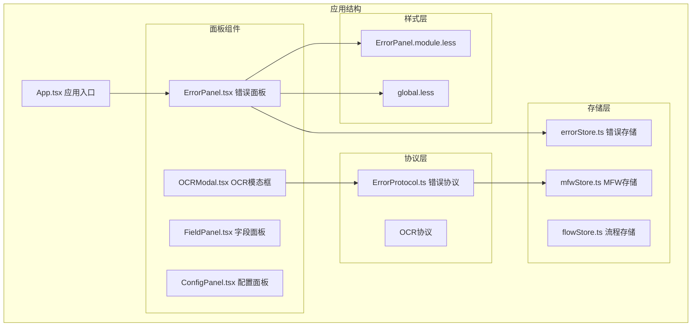
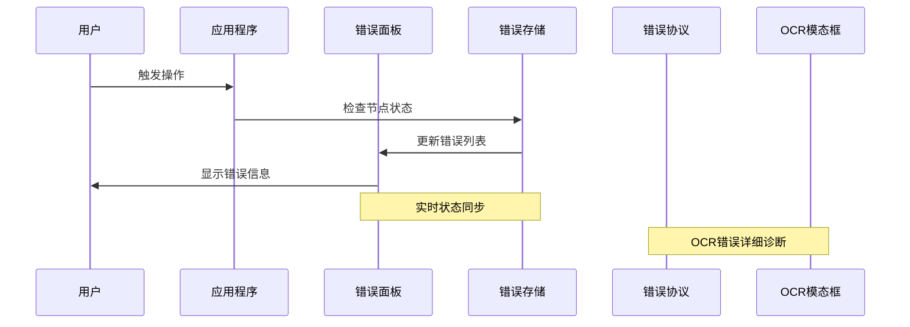
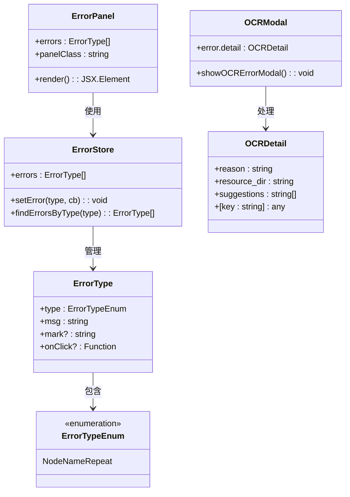
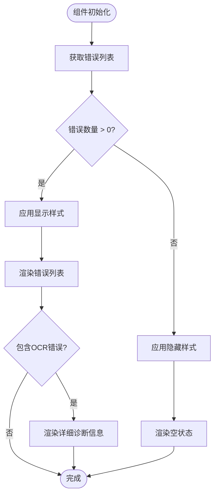
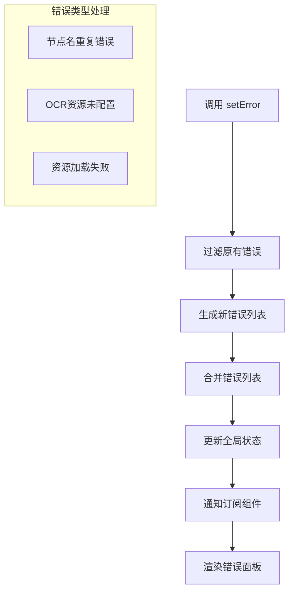
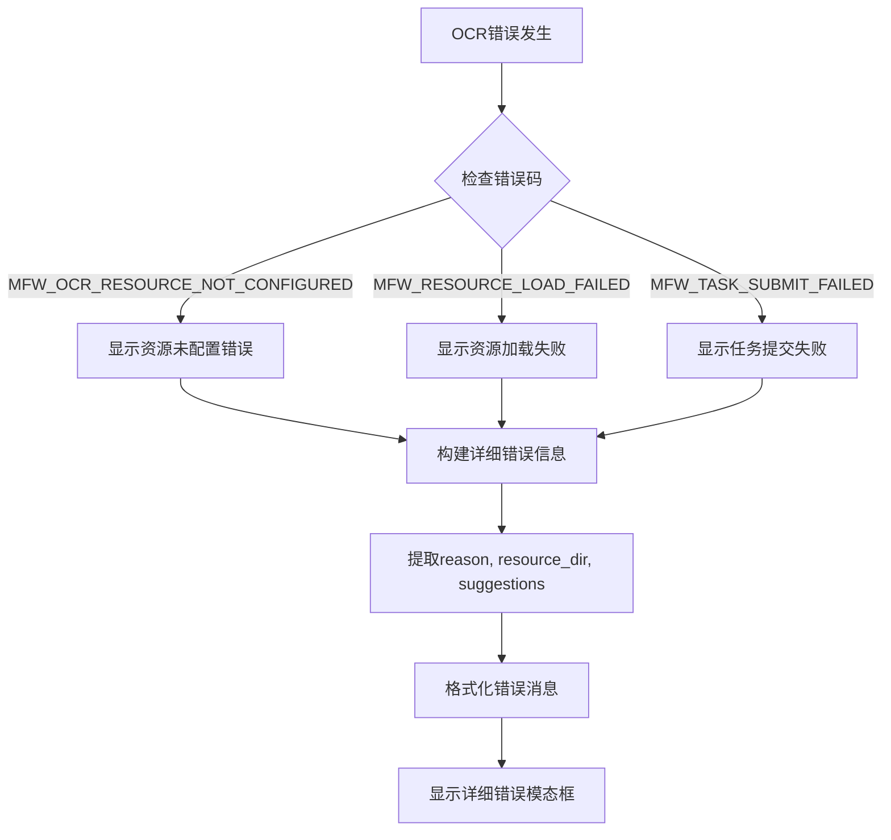
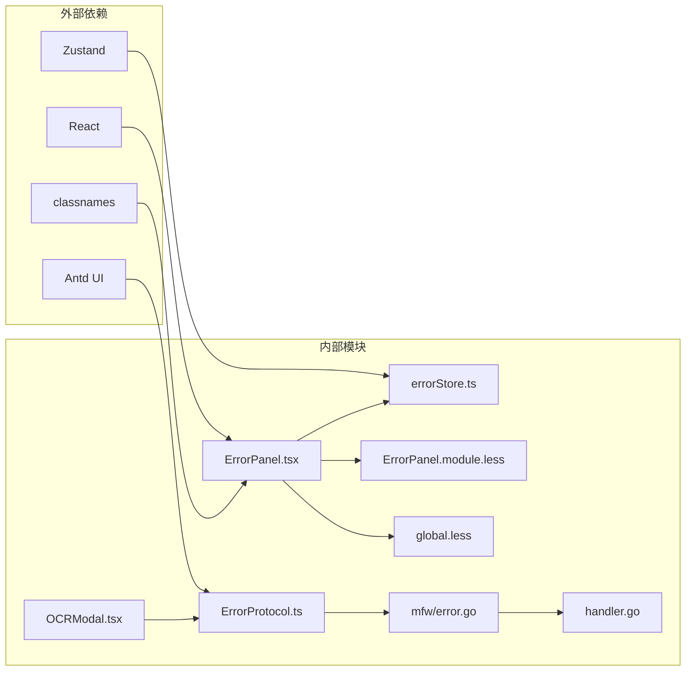

# 错误面板

<cite>
**本文档引用的文件**
- [ErrorPanel.tsx](file://src/components/panels/main/ErrorPanel.tsx)
- [errorStore.ts](file://src/stores/errorStore.ts)
- [ErrorPanel.module.less](file://src/styles/ErrorPanel.module.less)
- [App.tsx](file://src/App.tsx)
- [index.ts](file://src/stores/flow/index.ts)
- [nodeUtils.ts](file://src/stores/flow/utils/nodeUtils.ts)
- [nodeJsonValidator.ts](file://src/utils/nodeJsonValidator.ts)
- [FieldPanel.tsx](file://src/components/panels/main/FieldPanel.tsx)
- [global.less](file://src/styles/global.less)
- [OCRModal.tsx](file://src/components/modals/OCRModal.tsx)
- [ErrorProtocol.ts](file://src/services/protocols/ErrorProtocol.ts)
- [error.go](file://LocalBridge/internal/mfw/error.go)
- [handler.go](file://LocalBridge/internal/protocol/utility/handler.go)
</cite>

## 更新摘要
**变更内容**
- 新增OCR错误处理的详细诊断信息支持
- 添加error.detail结构的完整实现
- 增强错误信息的结构化和可操作性
- 扩展错误面板的功能以支持OCR特定错误类型

## 目录
1. [简介](#简介)
2. [项目结构](#项目结构)
3. [核心组件](#核心组件)
4. [架构概览](#架构概览)
5. [详细组件分析](#详细组件分析)
6. [OCR错误处理增强](#ocr错误处理增强)
7. [依赖关系分析](#依赖关系分析)
8. [性能考虑](#性能考虑)
9. [故障排除指南](#故障排除指南)
10. [结论](#结论)

## 简介

错误面板是 MAA Pipeline Editor 中的一个重要用户界面组件，用于显示和管理应用程序运行过程中产生的各种错误信息。该面板采用响应式设计，能够动态显示当前存在的错误列表，并提供直观的视觉反馈。

**更新** 错误面板现已支持OCR错误的详细诊断信息，从简单的错误消息升级为包含reason、resource_dir、suggestions等字段的结构化错误报告，为用户提供可操作的故障排除建议。

错误面板的核心功能包括：
- 实时监控和显示错误状态
- 动态样式切换（显示/隐藏）
- 错误信息格式化展示
- 与全局错误存储的状态同步
- OCR错误的详细诊断信息展示
- 结构化的错误报告和故障排除建议

## 项目结构

错误面板位于前端项目的组件层次结构中，具体组织如下：



**图表来源**
- [App.tsx:320-321](file://src/App.tsx#L320-L321)
- [ErrorPanel.tsx:1-38](file://src/components/panels/main/ErrorPanel.tsx#L1-L38)
- [OCRModal.tsx:40-53](file://src/components/modals/OCRModal.tsx#L40-L53)

**章节来源**
- [ErrorPanel.tsx:1-38](file://src/components/panels/main/ErrorPanel.tsx#L1-L38)
- [App.tsx:310-333](file://src/App.tsx#L310-L333)

## 核心组件

### 错误面板组件

错误面板是一个基于 React 的函数组件，使用了现代 React 特性如 useMemo 和 memo 优化性能。

**主要特性：**
- 使用 Zustand 状态管理库进行状态存储
- 通过 useMemo 优化渲染性能
- 使用 classNames 库进行条件样式绑定
- 支持动态显示/隐藏效果
- **新增** 支持OCR错误的详细信息展示

**关键实现细节：**
- 错误列表长度决定面板显示状态
- 错误项包含序号、类型和消息
- 使用 Less 样式模块化设计
- **新增** OCR错误的结构化展示支持

**章节来源**
- [ErrorPanel.tsx:8-38](file://src/components/panels/main/ErrorPanel.tsx#L8-L38)

### 错误存储系统

错误存储采用 Zustand 状态管理库实现，提供了类型安全的错误管理机制。

**核心功能：**
- 错误类型枚举定义
- 错误状态管理
- 条件错误更新机制
- 类型安全的错误操作

**错误类型定义：**
- NodeNameRepeat: 节点名重复错误
- **新增** OCRResourceNotConfigured: OCR资源未配置错误
- **新增** ResourceLoadFailed: 资源加载失败错误

**章节来源**
- [errorStore.ts:1-39](file://src/stores/errorStore.ts#L1-L39)

## 架构概览

错误面板在整个应用程序架构中扮演着重要的监控和反馈角色：



**图表来源**
- [index.ts:70-89](file://src/stores/flow/index.ts#L70-L89)
- [errorStore.ts:24-38](file://src/stores/errorStore.ts#L24-L38)
- [ErrorProtocol.ts:27-78](file://src/services/protocols/ErrorProtocol.ts#L27-L78)

### 组件交互流程

错误面板与其他组件的交互关系如下：



**图表来源**
- [ErrorPanel.tsx:6-18](file://src/components/panels/main/ErrorPanel.tsx#L6-L18)
- [errorStore.ts:3-11](file://src/stores/errorStore.ts#L3-L11)
- [OCRModal.tsx:40-53](file://src/components/modals/OCRModal.tsx#L40-L53)

## 详细组件分析

### 错误面板渲染逻辑

错误面板的渲染逻辑采用了条件渲染和动态样式绑定：



**图表来源**
- [ErrorPanel.tsx:12-18](file://src/components/panels/main/ErrorPanel.tsx#L12-L18)

### 错误存储更新机制

错误存储提供了灵活的错误更新机制：



**图表来源**
- [errorStore.ts:26-37](file://src/stores/errorStore.ts#L26-L37)

**章节来源**
- [ErrorPanel.tsx:21-35](file://src/components/panels/main/ErrorPanel.tsx#L21-L35)
- [errorStore.ts:24-38](file://src/stores/errorStore.ts#L24-L38)

### 节点名重复检测

错误面板主要用于显示节点名重复问题，这通过专门的检测函数实现：

**检测流程：**
1. 获取所有节点列表
2. 应用配置前缀规则
3. 统计标签出现频率
4. 识别重复标签
5. 更新错误存储

**章节来源**
- [index.ts:70-89](file://src/stores/flow/index.ts#L70-L89)
- [nodeUtils.ts:249-275](file://src/stores/flow/utils/nodeUtils.ts#L249-L275)

## OCR错误处理增强

### OCR错误详细信息结构

**更新** 新增了完整的OCR错误详细信息支持，包括以下字段：

```mermaid
classDiagram
class OCRResult {
+success : boolean
+text? : string
+boxes? : Box[]
+error? : string
+code? : string
+no_content? : boolean
+detail? : OCRDetail
}
class OCRDetail {
+reason : string
+resource_dir : string
+suggestions : string[]
+[key : string] : any
}
class MFWError {
+Code : string
+Message : string
+Detail : map[string]interface{}
}
OCRResult --> OCRDetail : 包含
MFWError --> OCRDetail : 创建
```

**图表来源**
- [OCRModal.tsx:40-53](file://src/components/modals/OCRModal.tsx#L40-L53)
- [error.go:34-52](file://LocalBridge/internal/mfw/error.go#L34-L52)

### OCR错误处理流程

**更新** OCR错误处理现在支持详细的诊断信息：



**图表来源**
- [OCRModal.tsx:315-351](file://src/components/modals/OCRModal.tsx#L315-L351)
- [ErrorProtocol.ts:83-118](file://src/services/protocols/ErrorProtocol.ts#L83-L118)

### 错误详情字段说明

**更新** 新增的error.detail结构包含以下关键字段：

- **reason**: 错误的根本原因描述
- **resource_dir**: OCR资源目录路径
- **suggestions**: 具体的故障排除建议列表
- **[key: string]**: 其他自定义错误信息字段

**章节来源**
- [OCRModal.tsx:325-327](file://src/components/modals/OCRModal.tsx#L325-L327)
- [ErrorProtocol.ts:87-89](file://src/services/protocols/ErrorProtocol.ts#L87-L89)

## 依赖关系分析

错误面板的依赖关系相对简洁，主要依赖于状态管理和样式系统：



**图表来源**
- [ErrorPanel.tsx:1-6](file://src/components/panels/main/ErrorPanel.tsx#L1-L6)
- [errorStore.ts:1](file://src/stores/errorStore.ts#L1)
- [ErrorProtocol.ts:1-6](file://src/services/protocols/ErrorProtocol.ts#L1-L6)

### 样式依赖关系

错误面板的样式系统采用模块化设计：

**样式层次结构：**
- global.less: 基础面板样式和动画
- ErrorPanel.module.less: 错误面板专用样式
- 条件样式: panel-show 控制显示状态
- **新增** OCR错误模态框样式

**章节来源**
- [ErrorPanel.module.less:1-25](file://src/styles/ErrorPanel.module.less#L1-L25)
- [global.less:21-72](file://src/styles/global.less#L21-L72)

## 性能考虑

错误面板在设计时充分考虑了性能优化：

### 渲染优化
- 使用 memo 包装组件避免不必要的重渲染
- useMemo 优化样式计算
- 条件渲染减少 DOM 元素数量
- **新增** OCR错误信息的懒加载处理

### 状态管理优化
- Zustand 提供轻量级状态管理
- 局部状态订阅减少全局重渲染
- 函数式更新确保状态一致性
- **新增** 错误详情对象的浅拷贝优化

### 内存管理
- 错误列表按需清理
- 组件卸载时自动清理订阅
- 避免内存泄漏的设计模式
- **新增** OCR错误详情的内存管理

## 故障排除指南

### 常见问题及解决方案

**问题1: 错误面板不显示**
- 检查错误存储中是否有错误数据
- 验证面板样式类名是否正确应用
- 确认全局样式是否加载成功

**问题2: 错误信息格式异常**
- 检查错误类型枚举定义
- 验证错误消息格式化逻辑
- 确认 Less 样式编译正常

**问题3: 性能问题**
- 检查组件重渲染次数
- 验证 useMemo 使用是否正确
- 确认状态更新是否必要

**问题4: OCR错误详情不显示**
- **新增** 检查错误码是否为OCR相关错误
- 验证error.detail对象是否正确传递
- 确认OCR模态框的显示逻辑

**章节来源**
- [ErrorPanel.tsx:12-18](file://src/components/panels/main/ErrorPanel.tsx#L12-L18)
- [errorStore.ts:24-38](file://src/stores/errorStore.ts#L24-L38)
- [OCRModal.tsx:315-351](file://src/components/modals/OCRModal.tsx#L315-L351)

### 调试技巧

1. **状态检查**: 使用浏览器开发者工具检查错误存储状态
2. **样式调试**: 验证 CSS 类名和样式规则
3. **事件监听**: 监听错误存储的状态变化
4. **性能分析**: 使用 React DevTools 分析组件渲染
5. **OCR错误调试**: 检查error.detail对象的结构和内容

## 结论

错误面板作为 MAA Pipeline Editor 的重要组成部分，展现了现代前端开发的最佳实践。其设计具有以下特点：

**技术优势：**
- 简洁高效的组件架构
- 类型安全的错误管理系统
- 优化的渲染性能
- 模块化的样式设计
- **新增** 完整的OCR错误诊断支持

**用户体验：**
- 实时错误反馈
- 直观的视觉指示
- 无侵入式的设计
- 响应式的布局
- **新增** 结构化的错误报告和可操作的故障排除建议

**可维护性：**
- 清晰的代码结构
- 完善的类型定义
- 良好的扩展性
- 详细的注释说明
- **新增** 支持未来更多错误类型的扩展

**更新** 错误面板现已支持OCR错误的详细诊断信息，从简单的错误消息升级为包含reason、resource_dir、suggestions等字段的结构化错误报告，为用户提供可操作的故障排除建议。这一增强显著提升了用户在OCR资源配置和使用过程中的问题诊断和解决效率。

错误面板不仅解决了实际的用户需求，还为整个应用程序提供了可靠的错误监控和反馈机制，是 MAA Pipeline Editor 用户体验的重要保障。