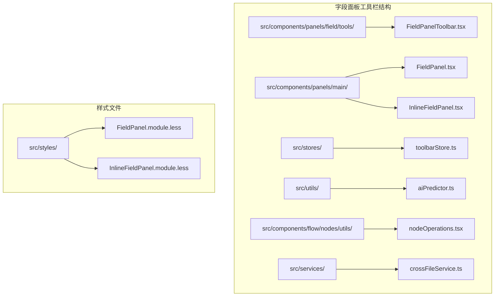
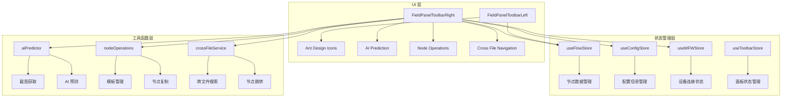
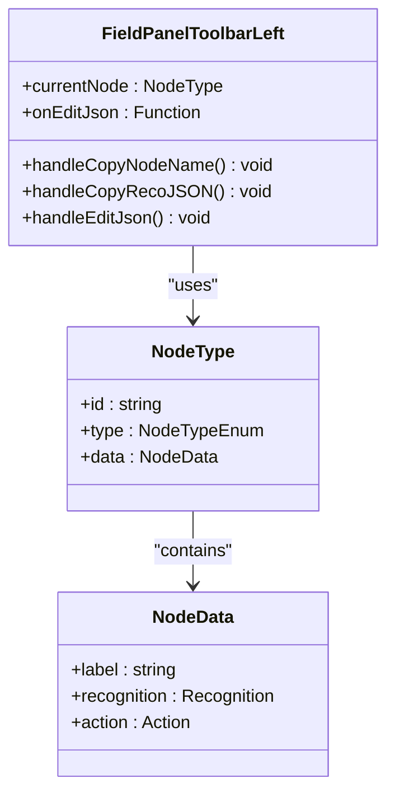
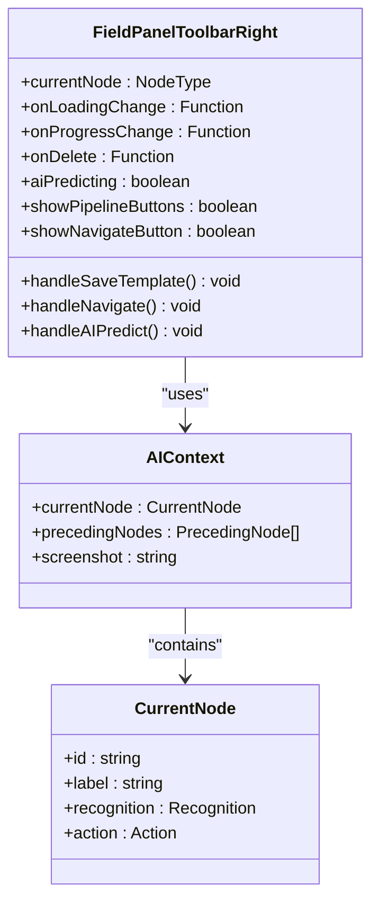
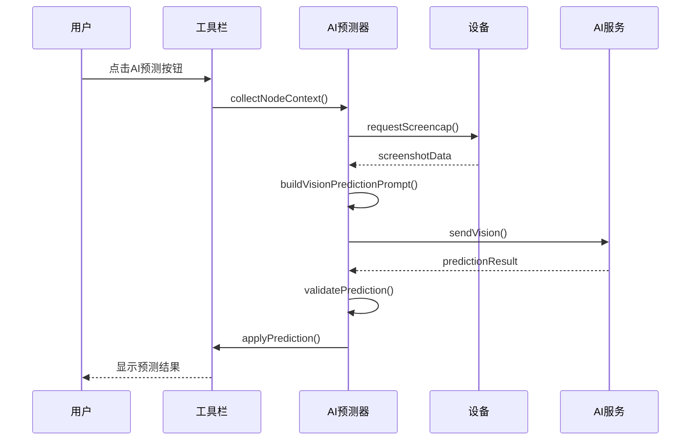
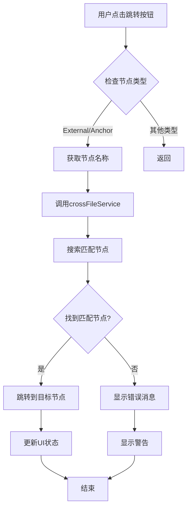

# 字段面板工具栏

<cite>
**本文档引用的文件**
- [FieldPanelToolbar.tsx](file://src/components/panels/field/tools/FieldPanelToolbar.tsx)
- [FieldPanel.tsx](file://src/components/panels/main/FieldPanel.tsx)
- [InlineFieldPanel.tsx](file://src/components/panels/main/InlineFieldPanel.tsx)
- [toolbarStore.ts](file://src/stores/toolbarStore.ts)
- [aiPredictor.ts](file://src/utils/aiPredictor.ts)
- [nodeOperations.tsx](file://src/components/flow/nodes/utils/nodeOperations.tsx)
- [crossFileService.ts](file://src/services/crossFileService.ts)
- [FieldPanel.module.less](file://src/styles/FieldPanel.module.less)
- [InlineFieldPanel.module.less](file://src/styles/InlineFieldPanel.module.less)
</cite>

## 目录
1. [简介](#简介)
2. [项目结构](#项目结构)
3. [核心组件](#核心组件)
4. [架构概览](#架构概览)
5. [详细组件分析](#详细组件分析)
6. [依赖关系分析](#依赖关系分析)
7. [性能考虑](#性能考虑)
8. [故障排除指南](#故障排除指南)
9. [结论](#结论)

## 简介

字段面板工具栏是 MAA Pipeline Editor 中一个关键的功能模块，负责提供节点字段编辑界面的工具栏功能。该工具栏分为左右两个部分：左侧工具栏提供基础操作功能，右侧工具栏提供高级功能。系统支持三种面板模式：固定模式、拖拽模式和内嵌模式，每种模式都有不同的布局和交互方式。

该工具栏集成了 AI 智能预测、节点模板管理、跨文件导航等高级功能，为用户提供了高效的工作流程编辑体验。

## 项目结构

字段面板工具栏位于项目的组件层次结构中，主要分布在以下目录：



**图表来源**
- [FieldPanelToolbar.tsx:1-280](file://src/components/panels/field/tools/FieldPanelToolbar.tsx#L1-L280)
- [FieldPanel.tsx:1-573](file://src/components/panels/main/FieldPanel.tsx#L1-L573)

**章节来源**
- [FieldPanelToolbar.tsx:1-280](file://src/components/panels/field/tools/FieldPanelToolbar.tsx#L1-L280)
- [FieldPanel.tsx:1-573](file://src/components/panels/main/FieldPanel.tsx#L1-L573)

## 核心组件

字段面板工具栏由两个主要组件构成：左侧工具栏和右侧工具栏，每个组件都针对不同的节点类型提供相应的功能。

### 左侧工具栏功能

左侧工具栏提供基础的节点操作功能，主要包括：

- **节点名称复制**：支持复制节点的完整名称（包含文件前缀）
- **Reco JSON 复制**：专门用于 Pipeline 节点的识别配置复制
- **JSON 编辑器**：打开节点的 JSON 编辑模式

### 右侧工具栏功能

右侧工具栏提供高级功能，根据节点类型动态显示：

- **跳转到目标节点**：支持 External 和 Anchor 节点的跨文件导航
- **保存为模板**：将 Pipeline 节点保存为自定义模板
- **AI 智能预测**：基于视觉分析的节点配置自动填充
- **节点删除**：删除当前选中的节点

**章节来源**
- [FieldPanelToolbar.tsx:24-86](file://src/components/panels/field/tools/FieldPanelToolbar.tsx#L24-L86)
- [FieldPanelToolbar.tsx:89-279](file://src/components/panels/field/tools/FieldPanelToolbar.tsx#L89-L279)

## 架构概览

字段面板工具栏采用模块化的架构设计，通过状态管理和工具函数实现功能解耦：



**图表来源**
- [FieldPanelToolbar.tsx:1-280](file://src/components/panels/field/tools/FieldPanelToolbar.tsx#L1-L280)
- [aiPredictor.ts:1-467](file://src/utils/aiPredictor.ts#L1-L467)
- [nodeOperations.tsx:1-184](file://src/components/flow/nodes/utils/nodeOperations.tsx#L1-L184)

## 详细组件分析

### 左侧工具栏组件分析

左侧工具栏组件 `FieldPanelToolbarLeft` 提供三个核心功能：



**图表来源**
- [FieldPanelToolbar.tsx:24-86](file://src/components/panels/field/tools/FieldPanelToolbar.tsx#L24-L86)

左侧工具栏的功能实现：

1. **节点名称复制**：通过 `copyNodeName` 函数实现，支持文件前缀的自动添加
2. **Reco JSON 复制**：专门针对 Pipeline 节点的识别配置复制功能
3. **JSON 编辑器**：触发父组件的 JSON 编辑模式

**章节来源**
- [FieldPanelToolbar.tsx:24-86](file://src/components/panels/field/tools/FieldPanelToolbar.tsx#L24-L86)
- [nodeOperations.tsx:17-28](file://src/components/flow/nodes/utils/nodeOperations.tsx#L17-L28)

### 右侧工具栏组件分析

右侧工具栏组件 `FieldPanelToolbarRight` 提供更复杂的功能，包括条件显示逻辑：



**图表来源**
- [FieldPanelToolbar.tsx:89-279](file://src/components/panels/field/tools/FieldPanelToolbar.tsx#L89-L279)

右侧工具栏的核心功能：

1. **条件显示逻辑**：
   - Pipeline 节点显示保存模板和 AI 预测功能
   - External 和 Anchor 节点显示跳转功能
   - 支持删除功能

2. **AI 智能预测流程**：
   - 设备连接状态检查
   - 截图获取
   - AI 预测调用
   - 结果应用

**章节来源**
- [FieldPanelToolbar.tsx:89-279](file://src/components/panels/field/tools/FieldPanelToolbar.tsx#L89-L279)
- [aiPredictor.ts:71-150](file://src/utils/aiPredictor.ts#L71-L150)

### AI 预测系统分析

AI 预测系统是右侧工具栏的核心功能，实现了完整的视觉识别流程：



**图表来源**
- [FieldPanelToolbar.tsx:148-225](file://src/components/panels/field/tools/FieldPanelToolbar.tsx#L148-L225)
- [aiPredictor.ts:210-241](file://src/utils/aiPredictor.ts#L210-L241)

AI 预测系统的处理流程：

1. **上下文收集**：收集当前节点及其前置节点的信息
2. **截图获取**：通过设备连接获取屏幕截图
3. **提示词构建**：生成 AI 分析所需的提示词
4. **预测执行**：调用 AI 服务进行视觉分析
5. **结果验证**：验证 AI 返回的预测结果
6. **配置应用**：将有效的预测结果应用到节点

**章节来源**
- [aiPredictor.ts:1-467](file://src/utils/aiPredictor.ts#L1-L467)

### 跨文件导航系统

跨文件导航功能允许用户在多个工作文件之间快速跳转：



**图表来源**
- [FieldPanelToolbar.tsx:120-145](file://src/components/panels/field/tools/FieldPanelToolbar.tsx#L120-L145)
- [crossFileService.ts:276-316](file://src/services/crossFileService.ts#L276-L316)

**章节来源**
- [crossFileService.ts:1-729](file://src/services/crossFileService.ts#L1-L729)

## 依赖关系分析

字段面板工具栏的依赖关系展现了清晰的分层架构：

```mermaid
graph TB
subgraph "外部依赖"
A[Ant Design] --> B[Tooltip]
A --> C[Message]
D[React] --> E[memo]
D --> F[useState]
D --> G[useCallback]
H[@xyflow/react] --> I[useReactFlow]
H --> J[ViewportPortal]
end
subgraph "状态管理"
K[zustand] --> L[useFlowStore]
K --> M[useConfigStore]
K --> N[useMFWStore]
K --> O[useToolbarStore]
end
subgraph "工具函数"
P[aiPredictor] --> Q[collectNodeContext]
P --> R[predictNodeConfig]
P --> S[applyPrediction]
T[nodeOperations] --> U[copyNodeName]
T --> V[saveNodeAsTemplate]
T --> W[copyNodeRecoJSON]
X[crossFileService] --> Y[navigateToNodeByName]
end
subgraph "样式系统"
Z[Less Modules] --> AA[FieldPanel.module.less]
Z --> AB[InlineFieldPanel.module.less]
end
A --> P
D --> T
H --> X
K --> L
```

**图表来源**
- [FieldPanelToolbar.tsx:1-280](file://src/components/panels/field/tools/FieldPanelToolbar.tsx#L1-L280)
- [FieldPanel.tsx:1-573](file://src/components/panels/main/FieldPanel.tsx#L1-L573)

**章节来源**
- [FieldPanelToolbar.tsx:1-280](file://src/components/panels/field/tools/FieldPanelToolbar.tsx#L1-L280)
- [toolbarStore.ts:1-147](file://src/stores/toolbarStore.ts#L1-L147)

## 性能考虑

字段面板工具栏在设计时充分考虑了性能优化：

### 渲染优化
- 使用 `memo` 包装组件，避免不必要的重新渲染
- 条件渲染逻辑，只在需要时显示相关功能按钮
- 状态分离，独立的状态管理减少全局更新

### 异步操作优化
- AI 预测采用异步处理，避免阻塞主线程
- 进度回调机制，提供用户反馈
- 超时处理和错误恢复机制

### 内存管理
- 组件卸载时清理事件监听器
- 及时释放 AI 预测相关的内存资源
- 优化截图获取的内存使用

## 故障排除指南

### 常见问题及解决方案

#### AI 预测功能异常
**问题症状**：点击 AI 预测按钮无响应或报错
**可能原因**：
- 设备连接状态异常
- AI API 配置不正确
- 截图获取失败

**解决步骤**：
1. 检查设备连接状态
2. 验证 AI API 配置
3. 确认截图权限
4. 查看控制台错误信息

#### 跨文件导航失败
**问题症状**：跳转按钮不可用或跳转失败
**可能原因**：
- 节点名称为空
- 目标节点不存在
- 文件未加载

**解决步骤**：
1. 确保节点名称正确
2. 检查目标文件是否已加载
3. 验证跨文件连接状态

#### 模板保存失败
**问题症状**：保存模板时报错
**可能原因**：
- 模板名称冲突
- 浏览器存储空间不足
- 节点数据格式异常

**解决步骤**：
1. 更换模板名称
2. 清理浏览器缓存
3. 检查节点数据完整性

**章节来源**
- [FieldPanelToolbar.tsx:204-224](file://src/components/panels/field/tools/FieldPanelToolbar.tsx#L204-L224)
- [crossFileService.ts:288-316](file://src/services/crossFileService.ts#L288-L316)

## 结论

字段面板工具栏是 MAA Pipeline Editor 中一个设计精良的功能模块，它通过清晰的架构设计和完善的错误处理机制，为用户提供了高效、可靠的节点编辑体验。

该工具栏的主要优势包括：

1. **模块化设计**：左右工具栏分离，功能职责明确
2. **条件渲染**：根据节点类型动态显示相关功能
3. **状态管理**：完善的状态管理机制，支持多种面板模式
4. **错误处理**：全面的错误处理和用户反馈机制
5. **性能优化**：合理的渲染策略和异步处理

未来可以考虑的改进方向：
- 增加更多节点类型的专用功能
- 优化 AI 预测的准确性
- 改进跨文件导航的用户体验
- 添加更多的自定义配置选项