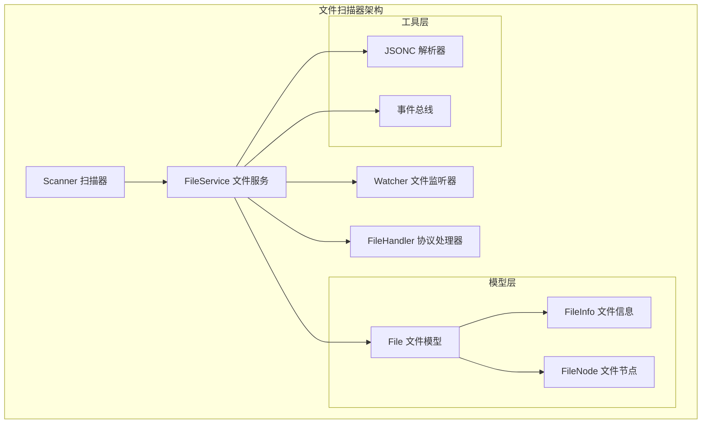
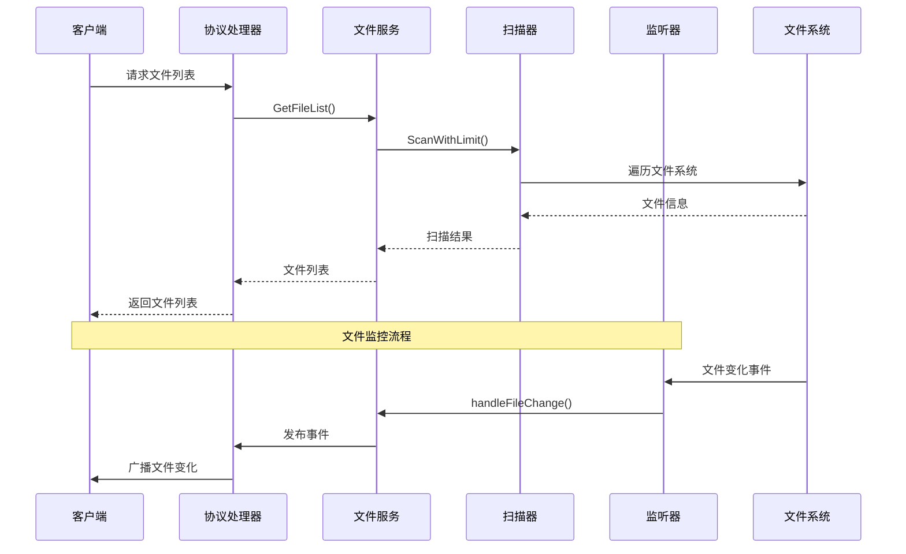
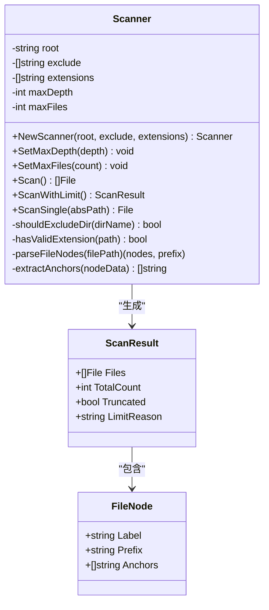
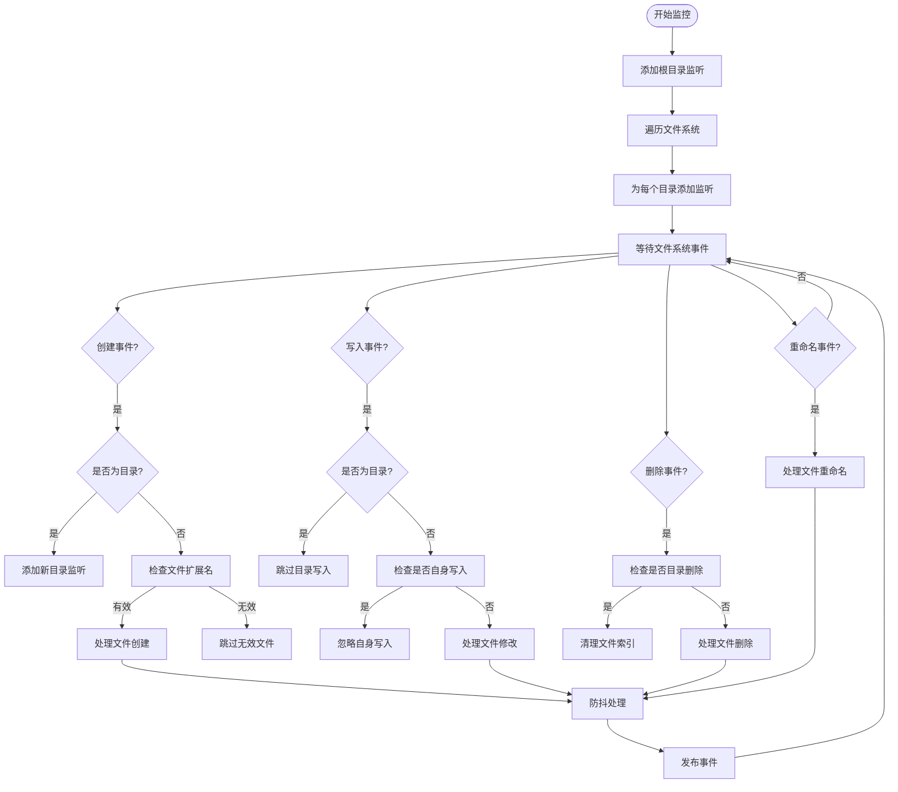
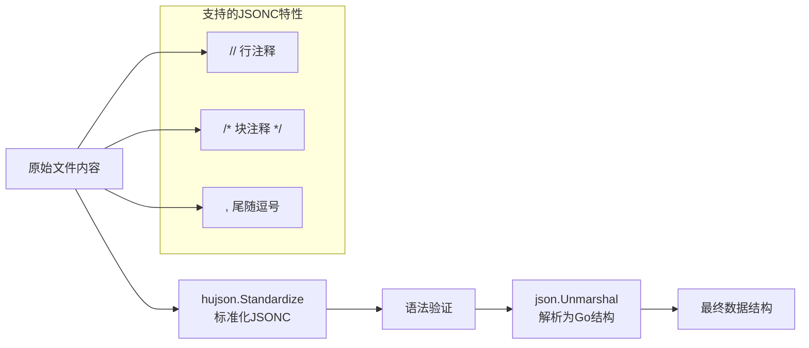
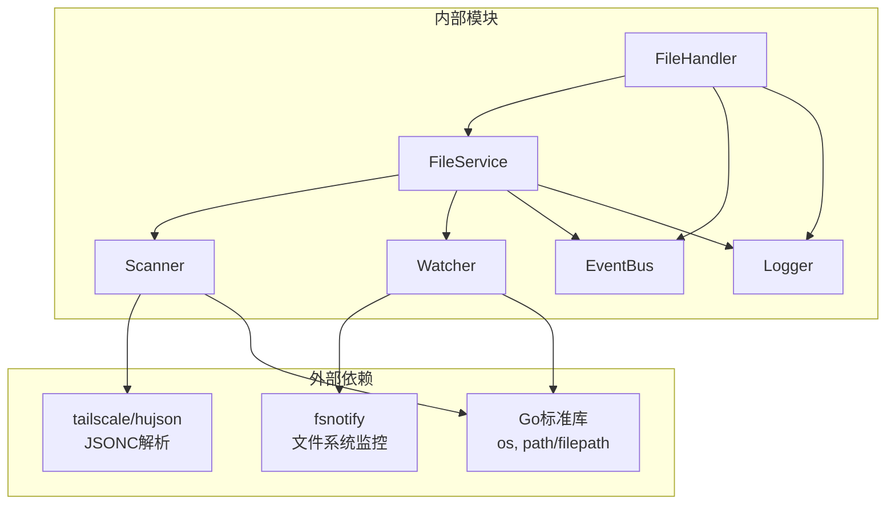

# 文件扫描器

<cite>
**本文档引用的文件**
- [scanner.go](file://LocalBridge/internal/service/file/scanner.go)
- [file_service.go](file://LocalBridge/internal/service/file/file_service.go)
- [watcher.go](file://LocalBridge/internal/service/file/watcher.go)
- [file_handler.go](file://LocalBridge/internal/protocol/file/file_handler.go)
- [file.go](file://LocalBridge/pkg/models/file.go)
- [message.go](file://LocalBridge/pkg/models/message.go)
- [jsonc.go](file://LocalBridge/internal/utils/jsonc.go)
- [default.json](file://LocalBridge/config/default.json)
- [关闭游戏.json](file://LocalBridge/test-json/base/pipeline/日常任务/关闭游戏.json)
- [default_pipeline.json](file://LocalBridge/test-json/base/default_pipeline.json)
</cite>

## 目录
1. [简介](#简介)
2. [项目结构](#项目结构)
3. [核心组件](#核心组件)
4. [架构概览](#架构概览)
5. [详细组件分析](#详细组件分析)
6. [依赖关系分析](#依赖关系分析)
7. [性能考虑](#性能考虑)
8. [故障排除指南](#故障排除指南)
9. [结论](#结论)

## 简介

文件扫描器是 MAA Pipeline Editor 本地桥接服务中的核心组件，负责扫描本地文件系统中的 Pipeline 文件，解析文件内容以提取节点信息，并提供实时文件监控功能。该组件支持 JSON 和 JSONC 格式的文件解析，能够智能识别文件中的节点定义和锚点引用。

## 项目结构

文件扫描器相关的代码主要位于 LocalBridge 项目的 internal/service/file 目录中，采用分层架构设计：

**图表来源**
- [scanner.go:20-38](file://LocalBridge/internal/service/file/scanner.go#L20-L38)
- [file_service.go:19-36](file://LocalBridge/internal/service/file/file_service.go#L19-L36)
- [watcher.go:34-41](file://LocalBridge/internal/service/file/watcher.go#L34-L41)
- [file_handler.go:14-21](file://LocalBridge/internal/protocol/file/file_handler.go#L14-L21)

**章节来源**
- [scanner.go:1-301](file://LocalBridge/internal/service/file/scanner.go#L1-L301)
- [file_service.go:1-360](file://LocalBridge/internal/service/file/file_service.go#L1-L360)
- [watcher.go:1-258](file://LocalBridge/internal/service/file/watcher.go#L1-L258)

## 核心组件

### Scanner 扫描器

Scanner 是文件扫描的核心组件，负责遍历文件系统并提取文件信息：

- **扫描范围控制**：支持最大深度限制和文件数量限制
- **过滤机制**：基于扩展名和排除目录的智能过滤
- **节点解析**：从文件内容中提取节点定义和锚点引用
- **错误处理**：优雅处理文件访问权限和路径问题

### FileService 文件服务

FileService 提供了完整的文件管理功能，包括：

- **初始化扫描**：启动时执行全量文件扫描
- **实时监控**：通过文件监听器跟踪文件变化
- **安全验证**：路径安全检查和访问控制
- **事件发布**：文件变化事件的统一管理和分发

### Watcher 文件监听器

Watcher 实现了高效的文件系统监控：

- **多平台支持**：基于 fsnotify 的跨平台文件监控
- **防抖机制**：避免频繁的文件系统事件触发
- **自动管理**：动态添加和移除目录监听
- **错误处理**：文件系统异常的健壮性处理

**章节来源**
- [scanner.go:20-301](file://LocalBridge/internal/service/file/scanner.go#L20-L301)
- [file_service.go:19-360](file://LocalBridge/internal/service/file/file_service.go#L19-L360)
- [watcher.go:34-258](file://LocalBridge/internal/service/file/watcher.go#L34-L258)

## 架构概览

文件扫描器采用分层架构设计，各组件职责明确，耦合度低：

**图表来源**
- [file_handler.go:243-300](file://LocalBridge/internal/protocol/file/file_handler.go#L243-L300)
- [file_service.go:65-95](file://LocalBridge/internal/service/file/file_service.go#L65-L95)
- [watcher.go:95-188](file://LocalBridge/internal/service/file/watcher.go#L95-L188)

## 详细组件分析

### Scanner 类详细分析

**图表来源**
- [scanner.go:20-56](file://LocalBridge/internal/service/file/scanner.go#L20-L56)
- [scanner.go:212-254](file://LocalBridge/internal/service/file/scanner.go#L212-L254)
- [scanner.go:256-295](file://LocalBridge/internal/service/file/scanner.go#L256-L295)

Scanner 的核心功能包括：

1. **智能扫描算法**：使用 `filepath.WalkDir` 进行深度优先遍历
2. **条件过滤**：支持深度限制、文件数量限制和扩展名过滤
3. **节点提取**：从 JSONC 文件中解析节点定义和锚点引用
4. **错误恢复**：遇到不可访问文件时跳过并继续扫描

### 文件监控流程

**图表来源**
- [watcher.go:114-188](file://LocalBridge/internal/service/file/watcher.go#L114-L188)
- [file_service.go:254-343](file://LocalBridge/internal/service/file/file_service.go#L254-L343)

### JSONC 解析机制

文件扫描器支持 JSONC 格式，提供了强大的注释和尾随逗号支持：

**图表来源**
- [jsonc.go:9-23](file://LocalBridge/internal/utils/jsonc.go#L9-L23)
- [scanner.go:217-227](file://LocalBridge/internal/service/file/scanner.go#L217-L227)

**章节来源**
- [scanner.go:58-147](file://LocalBridge/internal/service/file/scanner.go#L58-L147)
- [watcher.go:62-92](file://LocalBridge/internal/service/file/watcher.go#L62-L92)
- [jsonc.go:1-30](file://LocalBridge/internal/utils/jsonc.go#L1-L30)

## 依赖关系分析

文件扫描器的依赖关系清晰，遵循单一职责原则：

**图表来源**
- [scanner.go:3-12](file://LocalBridge/internal/service/file/scanner.go#L3-L12)
- [watcher.go:3-11](file://LocalBridge/internal/service/file/watcher.go#L3-L11)
- [file_service.go:3-17](file://LocalBridge/internal/service/file/file_service.go#L3-L17)

**章节来源**
- [scanner.go:1-12](file://LocalBridge/internal/service/file/scanner.go#L1-L12)
- [watcher.go:1-11](file://LocalBridge/internal/service/file/watcher.go#L1-L11)
- [file_service.go:1-17](file://LocalBridge/internal/service/file/file_service.go#L1-L17)

## 性能考虑

文件扫描器在设计时充分考虑了性能优化：

### 扫描优化策略

1. **早期退出机制**：当达到文件数量限制时立即停止扫描
2. **深度优先遍历**：减少内存占用，提高响应速度
3. **智能过滤**：在遍历过程中进行多重过滤，减少不必要的处理
4. **缓存机制**：文件索引的并发安全访问

### 内存管理

- **增量更新**：文件变化时只处理受影响的部分
- **及时释放**：扫描完成后及时释放临时数据结构
- **并发安全**：使用读写锁保证多协程访问的安全性

### 网络传输优化

- **事件驱动**：仅在文件发生变化时推送更新
- **批量处理**：合并相似的文件变化事件
- **压缩传输**：WebSocket 消息的最小化传输

## 故障排除指南

### 常见问题及解决方案

#### 1. 权限不足错误

**症状**：扫描过程中出现访问权限错误

**原因**：
- 目标目录没有读取权限
- 系统文件无法访问
- 网络驱动器权限问题

**解决方案**：
- 检查目标目录的访问权限
- 以管理员权限运行应用程序
- 排除不受信任的网络驱动器

#### 2. 性能问题

**症状**：扫描速度慢或内存占用过高

**原因**：
- 监控目录包含大量小文件
- 深度过深导致遍历范围过大
- 文件数量超过限制

**解决方案**：
- 设置合适的 `maxDepth` 和 `maxFiles` 限制
- 排除不需要监控的目录（如 `node_modules`, `.git`）
- 优化文件扩展名过滤规则

#### 3. 文件监控失效

**症状**：文件变化无法被及时检测

**原因**：
- 文件系统监控器异常
- 防抖机制导致事件延迟
- 跨平台兼容性问题

**解决方案**：
- 重启文件监控服务
- 检查防火墙设置
- 验证文件系统支持情况

**章节来源**
- [scanner.go:14-18](file://LocalBridge/internal/service/file/scanner.go#L14-L18)
- [file_service.go:345-359](file://LocalBridge/internal/service/file/file_service.go#L345-L359)
- [watcher.go:104-109](file://LocalBridge/internal/service/file/watcher.go#L104-L109)

## 结论

文件扫描器作为 MAA Pipeline Editor 的核心组件，展现了优秀的架构设计和实现质量。其主要特点包括：

1. **模块化设计**：清晰的职责分离和接口定义
2. **高性能实现**：智能的扫描算法和优化策略
3. **健壮性保障**：完善的错误处理和异常恢复机制
4. **可扩展性**：灵活的配置选项和插件化架构

通过合理的配置和使用，文件扫描器能够高效地管理大型项目中的文件资源，为用户提供流畅的开发体验。其设计原则和实现模式可以作为类似文件管理系统的重要参考。