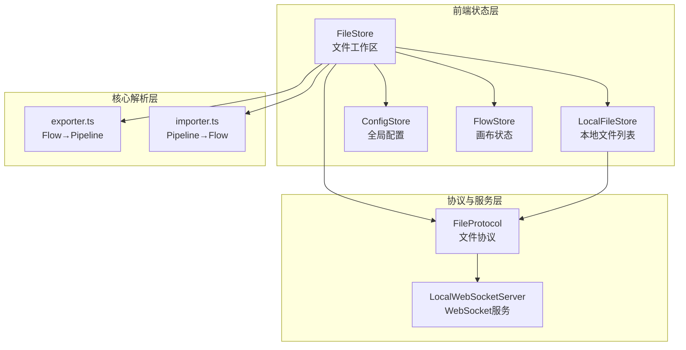
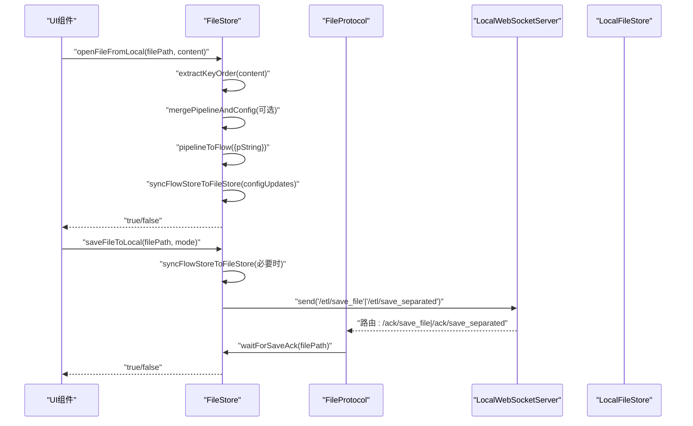
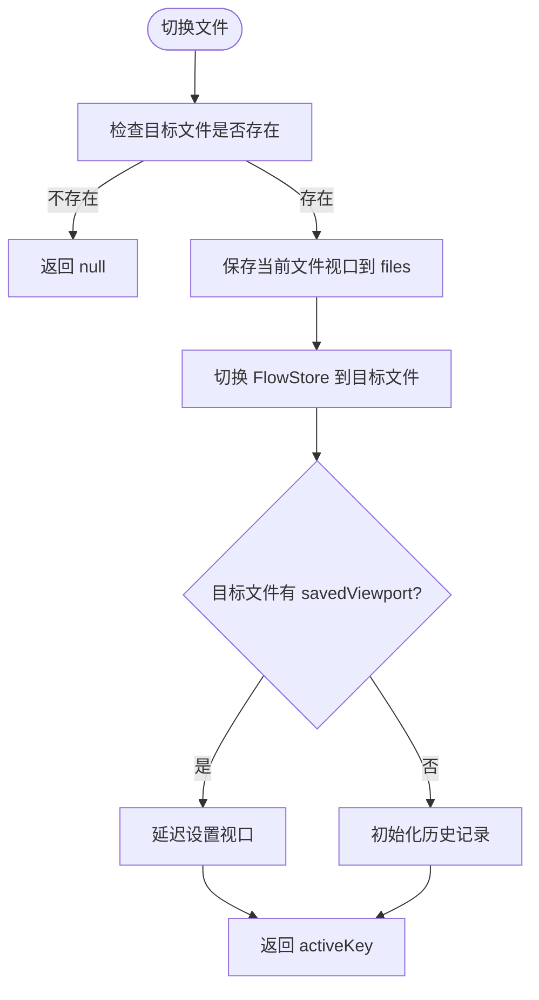
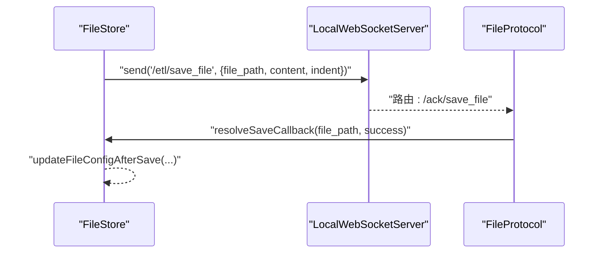
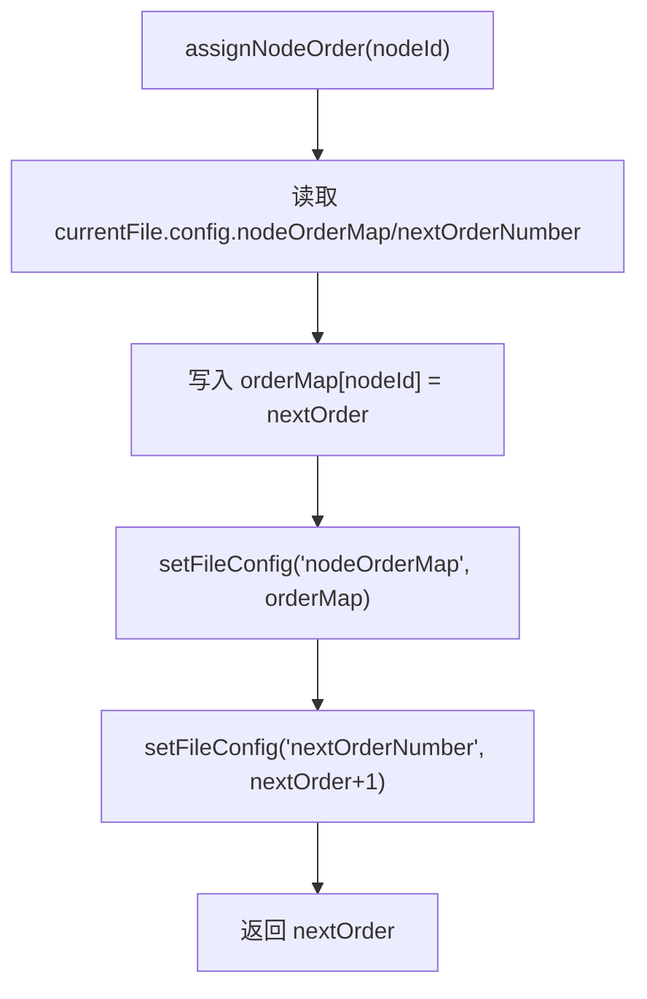
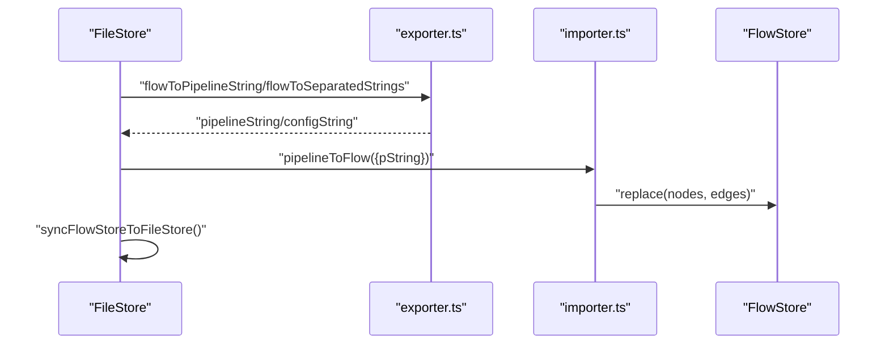
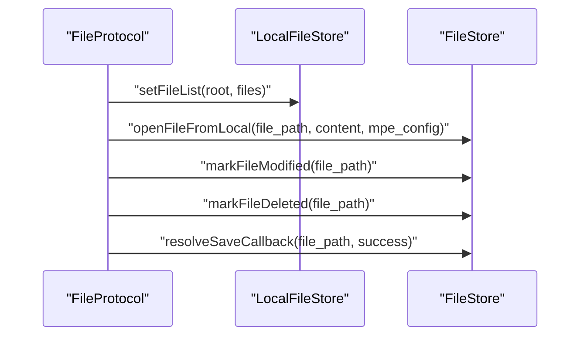
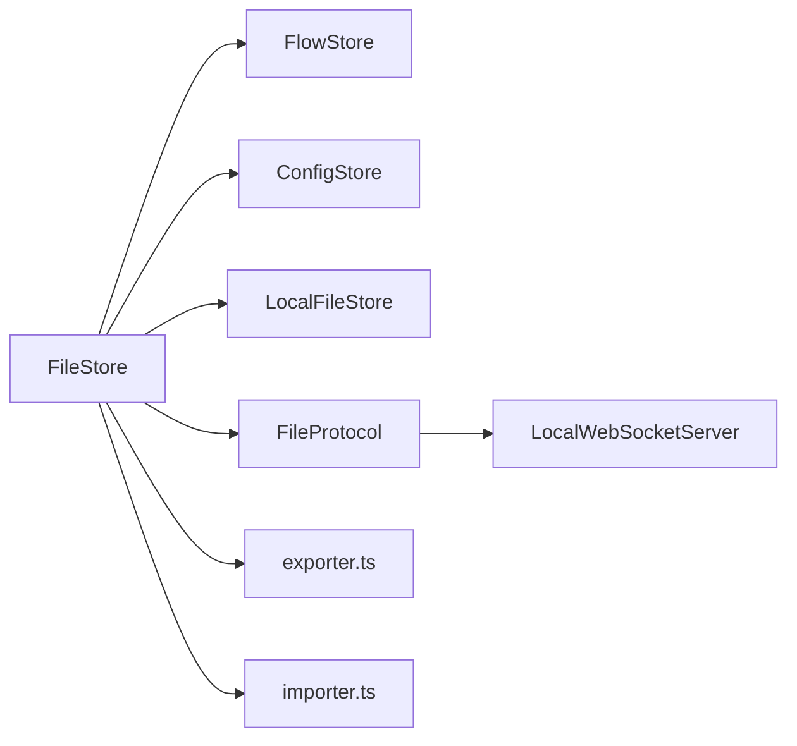

# FileStore.ts

<cite>
**本文档引用的文件**
- [fileStore.ts](file://src/stores/fileStore.ts)
- [FileProtocol.ts](file://src/services/protocols/FileProtocol.ts)
- [localFileStore.ts](file://src/stores/localFileStore.ts)
- [crossFileService.ts](file://src/services/crossFileService.ts)
- [exporter.ts](file://src/core/parser/exporter.ts)
- [importer.ts](file://src/core/parser/importer.ts)
- [viewSlice.ts](file://src/stores/flow/slices/viewSlice.ts)
- [server.ts](file://src/services/server.ts)
</cite>

## 目录
1. [简介](#简介)
2. [项目结构](#项目结构)
3. [核心组件](#核心组件)
4. [架构总览](#架构总览)
5. [详细组件分析](#详细组件分析)
6. [依赖关系分析](#依赖关系分析)
7. [性能考虑](#性能考虑)
8. [故障排查指南](#故障排查指南)
9. [结论](#结论)

## 简介
FileStore.ts 是 MaaPipelineEditor 前端的核心状态管理模块之一，负责管理多文件工作区、文件切换、本地/远程文件交互、节点顺序管理以及与后端 LocalBridge 的文件协议通信。它通过 Zustand 状态库提供轻量级的状态管理，并与 FlowStore、ConfigStore、LocalFileStore 等模块协同工作，支撑整个可视化编辑器的文件生命周期管理。

## 项目结构
FileStore 位于前端 src/stores 目录下，与以下关键模块协作：
- FlowStore：可视化画布状态（节点、边、视口）
- ConfigStore：全局配置（如保存模式、缩进等）
- LocalFileStore：本地文件列表缓存（来自 LocalBridge）
- FileProtocol：与 LocalBridge 的 WebSocket 协议处理
- Parser：Pipeline 与 Flow 的相互转换
- Server：WebSocket 服务封装

图表来源
- [fileStore.ts:1-876](file://src/stores/fileStore.ts#L1-L876)
- [FileProtocol.ts:1-581](file://src/services/protocols/FileProtocol.ts#L1-L581)
- [localFileStore.ts:1-339](file://src/stores/localFileStore.ts#L1-L339)
- [exporter.ts:1-43](file://src/core/parser/exporter.ts#L1-L43)
- [importer.ts:141-249](file://src/core/parser/importer.ts#L141-L249)

章节来源
- [fileStore.ts:1-876](file://src/stores/fileStore.ts#L1-L876)
- [server.ts:324-372](file://src/services/server.ts#L324-L372)

## 核心组件
- 文件配置类型 FileConfigType：包含文件路径、相对路径、分离配置路径、删除/外部修改标记、最后同步时间、视口信息、节点顺序映射等。
- 文件类型 FileType：包含文件名、节点数组、边数组、文件配置。
- 文件仓库 FileState：提供文件名设置、文件配置更新、文件切换、文件增删、拖拽排序、本地文件操作（打开/保存）、外部修改标记与重载、根据路径查找文件等方法。
- 节点顺序管理：分配/移除/获取节点顺序号，用于保持节点在导出时的顺序一致性。

章节来源
- [fileStore.ts:20-38](file://src/stores/fileStore.ts#L20-L38)
- [fileStore.ts:300-329](file://src/stores/fileStore.ts#L300-L329)
- [fileStore.ts:271-297](file://src/stores/fileStore.ts#L271-L297)

## 架构总览
FileStore 的职责边界清晰：
- 管理多文件工作区：files 数组 + currentFile
- 同步 FlowStore 与 FileStore：在保存/切换时双向同步节点、边、视口
- 本地/远程文件交互：通过 FileProtocol 与 LocalBridge 通信，支持打开、保存、重载、删除标记
- 本地持久化：localStorage 缓存 files 与配置
- 节点顺序管理：基于 nodeOrderMap 与 nextOrderNumber 维护导出顺序
- 与 Parser 协作：将 Flow 转换为 Pipeline 字符串或分离字符串，或将 Pipeline 导入为 Flow

图表来源
- [fileStore.ts:518-604](file://src/stores/fileStore.ts#L518-L604)
- [fileStore.ts:606-790](file://src/stores/fileStore.ts#L606-L790)
- [FileProtocol.ts:109-141](file://src/services/protocols/FileProtocol.ts#L109-L141)
- [FileProtocol.ts:237-289](file://src/services/protocols/FileProtocol.ts#L237-L289)

## 详细组件分析

### 文件工作区管理
- 文件创建与去重：createFile 生成唯一文件名，isFileNameRepate 检测重复。
- 文件切换：switchFile 保存当前视口到 files 数组，切换到目标文件，恢复视口，必要时触发后端重载。
- 文件增删：addFile/removeFile，支持自动切换到新文件。
- 拖拽排序：onDragEnd 使用 arrayMove 重排 files 数组。
- 本地持久化：localSave 将 files 与配置序列化到 localStorage，normalizeViewport 对视口数值取整。

图表来源
- [fileStore.ts:373-439](file://src/stores/fileStore.ts#L373-L439)

章节来源
- [fileStore.ts:42-84](file://src/stores/fileStore.ts#L42-L84)
- [fileStore.ts:373-439](file://src/stores/fileStore.ts#L373-L439)
- [fileStore.ts:228-269](file://src/stores/fileStore.ts#L228-L269)

### 本地文件操作
- 打开文件：openFileFromLocal 支持合并 mpe_config，避免重复打开同一路径文件，必要时新建文件或直接导入。
- 保存文件：saveFileToLocal 支持集成/分离两种保存模式，根据配置生成 config 路径，等待 ack 回调。
- 重载文件：reloadFileFromLocal 将后端推送的内容重新导入为 Flow，并清除外部修改标记。
- 外部修改标记：markFileModified/markFileDeleted 用于标识文件被外部修改或删除。

图表来源
- [fileStore.ts:606-790](file://src/stores/fileStore.ts#L606-L790)
- [FileProtocol.ts:237-257](file://src/services/protocols/FileProtocol.ts#L237-L257)

章节来源
- [fileStore.ts:518-604](file://src/stores/fileStore.ts#L518-L604)
- [fileStore.ts:606-790](file://src/stores/fileStore.ts#L606-L790)
- [fileStore.ts:836-875](file://src/stores/fileStore.ts#L836-L875)

### 节点顺序管理
- 分配顺序号：assignNodeOrder 为新节点分配递增顺序号并写入 nodeOrderMap。
- 移除顺序号：removeNodeOrder 删除指定节点的顺序映射。
- 获取顺序号：getNodeOrder 查询节点顺序号。
- 导出时清理：localSave 将 nodeOrderMap 与 nextOrderNumber 置空，避免污染持久化数据。

图表来源
- [fileStore.ts:271-297](file://src/stores/fileStore.ts#L271-L297)

章节来源
- [fileStore.ts:271-297](file://src/stores/fileStore.ts#L271-L297)

### 与 Parser 的协作
- 导出：flowToPipelineString/flowToSeparatedStrings 将 Flow 转换为 Pipeline 字符串或分离字符串。
- 导入：pipelineToFlow 将 Pipeline 字符串解析为 Flow，支持合并外部配置与保留键顺序。
- 同步：syncFlowStoreToFileStore 在保存/切换时同步 FlowStore 的节点、边、视口到 FileStore。

图表来源
- [fileStore.ts:86-124](file://src/stores/fileStore.ts#L86-L124)
- [exporter.ts:1-43](file://src/core/parser/exporter.ts#L1-L43)
- [importer.ts:155-249](file://src/core/parser/importer.ts#L155-L249)

章节来源
- [fileStore.ts:86-124](file://src/stores/fileStore.ts#L86-L124)
- [exporter.ts:1-43](file://src/core/parser/exporter.ts#L1-L43)
- [importer.ts:155-249](file://src/core/parser/importer.ts#L155-L249)

### 与 LocalBridge 的文件协议交互
- 文件列表：/lte/file_list 推送本地文件列表，更新 LocalFileStore。
- 文件内容：/lte/file_content 推送文件内容，FileStore.openFileFromLocal 导入。
- 文件变更：/lte/file_changed 处理 created/modified/deleted/renamed，标记外部修改或删除。
- 保存确认：/ack/save_file 与 /ack/save_separated 解析保存回调，更新文件配置。

图表来源
- [FileProtocol.ts:78-141](file://src/services/protocols/FileProtocol.ts#L78-L141)
- [FileProtocol.ts:147-231](file://src/services/protocols/FileProtocol.ts#L147-L231)
- [FileProtocol.ts:237-332](file://src/services/protocols/FileProtocol.ts#L237-L332)

章节来源
- [FileProtocol.ts:78-141](file://src/services/protocols/FileProtocol.ts#L78-L141)
- [FileProtocol.ts:147-231](file://src/services/protocols/FileProtocol.ts#L147-L231)
- [FileProtocol.ts:237-332](file://src/services/protocols/FileProtocol.ts#L237-L332)

### 与跨文件服务的协作
- CrossFileService 依赖 FileStore 获取已加载文件列表，支持跨文件节点搜索、跳转、自动完成等。
- FileStore 与 LocalFileStore 协同，提供本地文件节点信息与已加载文件节点信息的统一视图。

章节来源
- [crossFileService.ts:65-196](file://src/services/crossFileService.ts#L65-L196)
- [localFileStore.ts:125-130](file://src/stores/localFileStore.ts#L125-L130)

## 依赖关系分析
- FileStore 依赖：
  - FlowStore：节点、边、视口、历史记录
  - ConfigStore：保存模式、缩进、自动重载等配置
  - LocalFileStore：本地文件列表
  - FileProtocol：WebSocket 协议处理
  - Parser：Flow/Pipeline 转换
  - Server：WebSocket 服务封装

图表来源
- [fileStore.ts:1-18](file://src/stores/fileStore.ts#L1-L18)
- [server.ts:324-372](file://src/services/server.ts#L324-L372)

章节来源
- [fileStore.ts:1-18](file://src/stores/fileStore.ts#L1-L18)
- [server.ts:324-372](file://src/services/server.ts#L324-L372)

## 性能考虑
- 视口同步：在文件切换时仅保存当前视口到 files 数组，避免频繁写入。
- 本地持久化：localSave 序列化 files 与配置，注意 localStorage 配额限制，出现 QuotaExceededError 时提示用户清理数据或减少文件数量。
- 节点顺序：导出前清理 nodeOrderMap 与 nextOrderNumber，避免持久化冗余数据。
- 保存确认：使用 waitForSaveAck 等待后端确认，超时自动清理回调，防止内存泄漏。

## 故障排查指南
- 保存失败：
  - 检查 WebSocket 连接状态，确保 localServer.isConnected() 为真。
  - 确认保存模式与文件路径有效。
  - 查看 FileProtocol.waitForSaveAck 的超时日志与错误消息。
- 打开文件失败：
  - 检查 content 是否为有效 JSON 字符串或对象。
  - 确认 mpe_config 合并逻辑是否抛错。
- 外部修改：
  - 若目标文件被外部修改，FileStore 会标记 isModifiedExternally 并弹出提示。
  - 可通过 reloadFileFromLocal 或 FileProtocol 的自动重载机制解决。
- 本地存储空间不足：
  - 出现 QuotaExceededError 时，提示用户清理浏览器数据或减少文件数量。

章节来源
- [fileStore.ts:228-269](file://src/stores/fileStore.ts#L228-L269)
- [fileStore.ts:606-790](file://src/stores/fileStore.ts#L606-L790)
- [FileProtocol.ts:147-231](file://src/services/protocols/FileProtocol.ts#L147-L231)

## 结论
FileStore.ts 通过清晰的状态划分与严格的职责边界，实现了多文件工作区的高效管理。它与 FlowStore、ConfigStore、LocalFileStore、FileProtocol、Parser 等模块紧密协作，既满足本地缓存需求，又保证与 LocalBridge 的稳定通信。其节点顺序管理、视口同步、保存确认机制等设计，为复杂工作流的编辑提供了可靠的基础能力。