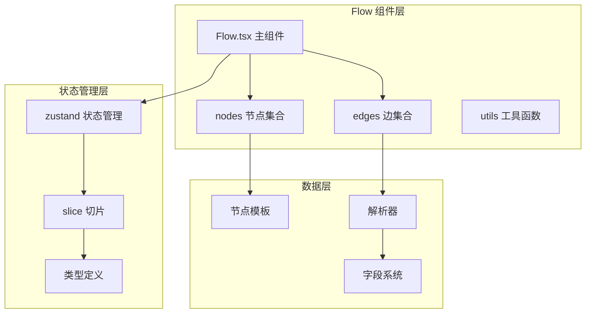
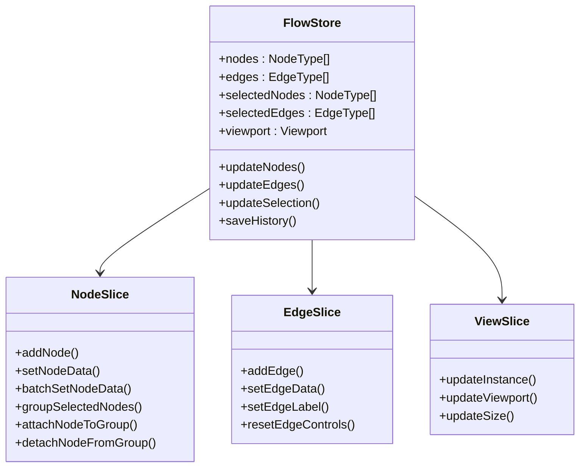
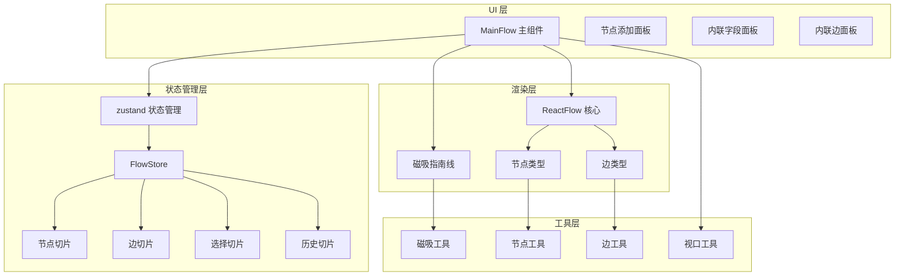
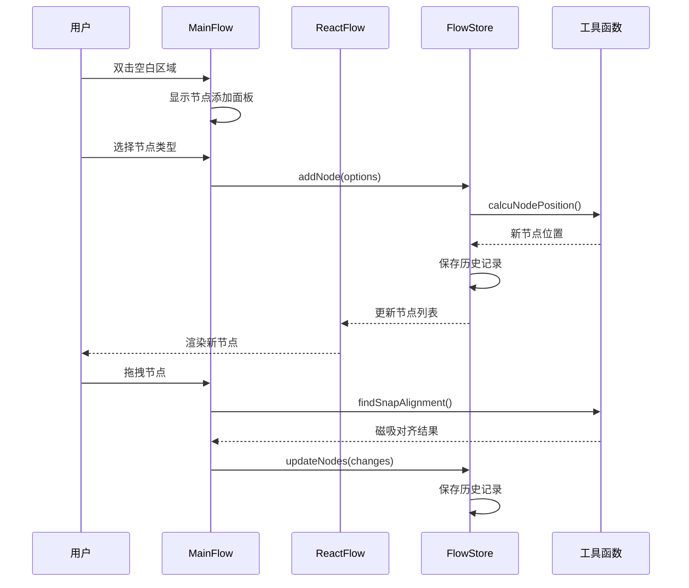
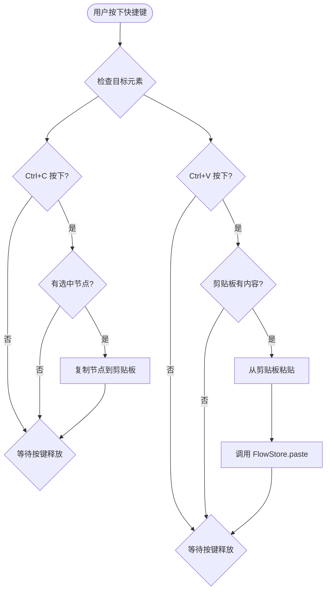
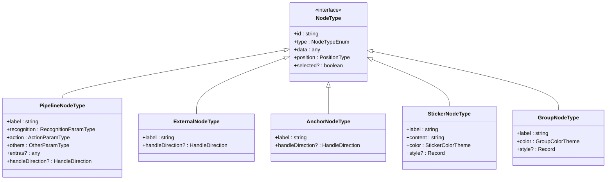
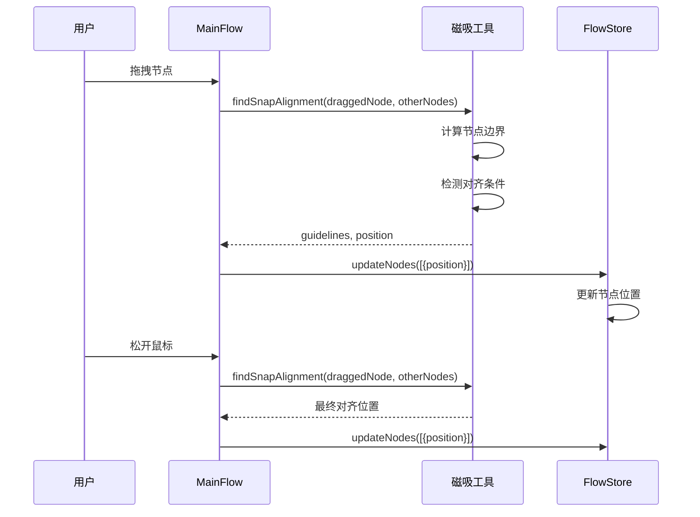
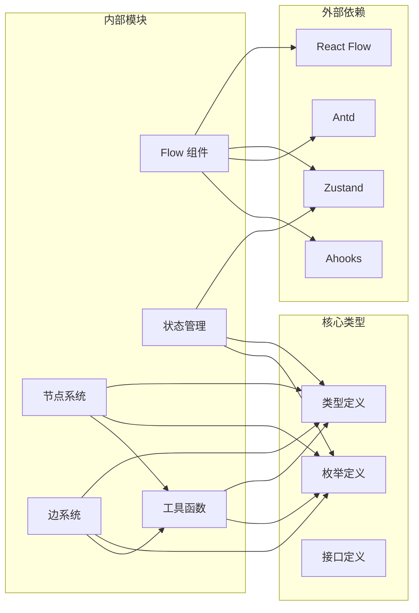

# Flow 组件

<cite>
**本文档引用的文件**
- [Flow.tsx](file://src/components/Flow.tsx)
- [index.ts](file://src/stores/flow/index.ts)
- [types.ts](file://src/stores/flow/types.ts)
- [nodeSlice.ts](file://src/stores/flow/slices/nodeSlice.ts)
- [edgeSlice.ts](file://src/stores/flow/slices/edgeSlice.ts)
- [edges.tsx](file://src/components/flow/edges.tsx)
- [constants.ts](file://src/components/flow/nodes/constants.ts)
- [nodeUtils.ts](file://src/stores/flow/utils/nodeUtils.ts)
- [edgeUtils.ts](file://src/stores/flow/utils/edgeUtils.ts)
- [viewportUtils.ts](file://src/stores/flow/utils/viewportUtils.ts)
- [nodeTemplates.ts](file://src/data/nodeTemplates.ts)
- [types.ts](file://src/core/parser/types.ts)
- [index.ts](file://src/core/fields/index.ts)
</cite>

## 目录
1. [简介](#简介)
2. [项目结构](#项目结构)
3. [核心组件](#核心组件)
4. [架构概览](#架构概览)
5. [详细组件分析](#详细组件分析)
6. [依赖关系分析](#依赖关系分析)
7. [性能考虑](#性能考虑)
8. [故障排除指南](#故障排除指南)
9. [结论](#结论)

## 简介

Flow 组件是 MaaPipelineEditor 项目中的核心可视化编辑器组件，基于 React Flow 构建，提供了强大的节点拖拽、连接、分组等功能。该组件支持多种节点类型（Pipeline、External、Anchor、Sticker、Group），并集成了智能磁吸对齐、路径模式、调试模式等高级功能。

## 项目结构

Flow 组件采用模块化的架构设计，主要由以下几个核心部分组成：



**图表来源**
- [Flow.tsx](file://src/components/Flow.tsx#L1-L542)
- [index.ts](file://src/stores/flow/index.ts#L1-L109)

**章节来源**
- [Flow.tsx](file://src/components/Flow.tsx#L1-L542)
- [index.ts](file://src/stores/flow/index.ts#L1-L109)

## 核心组件

### 主要功能特性

Flow 组件提供了以下核心功能：

1. **多节点类型支持**：支持 Pipeline、External、Anchor、Sticker、Group 五种节点类型
2. **智能磁吸对齐**：提供节点拖拽时的磁吸对齐功能
3. **分组管理**：支持节点分组和嵌套分组
4. **路径模式**：提供调试和路径追踪功能
5. **键盘快捷键**：支持 Ctrl+C/V 复制粘贴操作
6. **响应式布局**：自动适配容器大小变化

### 状态管理架构



**图表来源**
- [types.ts](file://src/stores/flow/types.ts#L247-L362)
- [nodeSlice.ts](file://src/stores/flow/slices/nodeSlice.ts#L36-L691)
- [edgeSlice.ts](file://src/stores/flow/slices/edgeSlice.ts#L16-L221)

**章节来源**
- [types.ts](file://src/stores/flow/types.ts#L1-L362)
- [nodeSlice.ts](file://src/stores/flow/slices/nodeSlice.ts#L1-L691)
- [edgeSlice.ts](file://src/stores/flow/slices/edgeSlice.ts#L1-L221)

## 架构概览

Flow 组件的整体架构采用分层设计，确保了良好的可维护性和扩展性：



**图表来源**
- [Flow.tsx](file://src/components/Flow.tsx#L193-L542)
- [index.ts](file://src/stores/flow/index.ts#L16-L24)

## 详细组件分析

### 主 Flow 组件

MainFlow 是整个 Flow 系统的核心组件，负责协调各个子组件和状态管理：



**图表来源**
- [Flow.tsx](file://src/components/Flow.tsx#L296-L413)
- [nodeSlice.ts](file://src/stores/flow/slices/nodeSlice.ts#L132-L288)

#### 键盘快捷键处理

组件实现了完整的键盘快捷键支持：



**图表来源**
- [Flow.tsx](file://src/components/Flow.tsx#L49-L93)

**章节来源**
- [Flow.tsx](file://src/components/Flow.tsx#L1-L542)

### 节点系统

Flow 组件支持五种不同类型的节点，每种节点都有其特定的功能和渲染方式：



**图表来源**
- [types.ts](file://src/stores/flow/types.ts#L107-L235)

#### 节点模板系统

节点模板提供了预定义的节点配置，支持快速创建常用节点：

| 节点类型 | 模板标签 | 默认图标 | 特殊属性 |
|---------|---------|---------|----------|
| Pipeline | 文字识别 | icon-ocr | recognition: OCR<br/>action: Click |
| Pipeline | 图像识别 | icon-tuxiang | recognition: TemplateMatch<br/>action: Click |
| Pipeline | 无延迟节点 | icon-weizhihang | pre_delay: 0<br/>post_delay: 0 |
| Pipeline | 直接点击 | icon-dianji | target: [0,0,0,0] |
| Pipeline | Custom | icon-daima | custom_action<br/>custom_action_param |
| External | 外部节点 | icon-xiaofangtongdao | NodeTypeEnum.External |
| Anchor | 重定向节点 | icon-ziyuan | NodeTypeEnum.Anchor |
| Sticker | 便签贴纸 | icon-bianqian1 | NodeTypeEnum.Sticker |
| Group | 分组框 | icon-kuangxuanzhong | NodeTypeEnum.Group |

**章节来源**
- [nodeTemplates.ts](file://src/data/nodeTemplates.ts#L1-L108)

### 边系统

Flow 组件的边系统提供了灵活的连接管理和视觉表现：

```mermaid
flowchart TD
Edge[EdgeType] --> Source[源节点]
Edge --> Target[目标节点]
Edge --> Handle[句柄类型]
Edge --> Attributes[属性]
Handle --> SourceHandle[SourceHandleTypeEnum]
Handle --> TargetHandle[TargetHandleTypeEnum]
SourceHandle --> Next[Next: "next"]
SourceHandle --> Error[Error: "on_error"]
TargetHandle --> Target[Target: "target"]
TargetHandle --> JumpBack[JumpBack: "jump_back"]
Attributes --> JumpBackAttr[jump_back: boolean]
Attributes --> AnchorAttr[anchor: boolean]
```

**图表来源**
- [types.ts](file://src/stores/flow/types.ts#L27-L38)
- [constants.ts](file://src/components/flow/nodes/constants.ts#L2-L11)

#### 边类型和样式

边系统支持多种样式和交互功能：

| 边类型 | 源句柄 | 目标句柄 | 样式类 | 功能描述 |
|--------|--------|----------|--------|----------|
| next | next | target | edge-next | 正常流程连接 |
| on_error | on_error | target | edge-error | 错误处理连接 |
| jump_back | next | jump_back | edge-jumpback | 跳转回连接 |
| error_jump_back | on_error | jump_back | edge-error-jumpback | 错误跳转连接 |

**章节来源**
- [edges.tsx](file://src/components/flow/edges.tsx#L188-L525)
- [types.ts](file://src/stores/flow/types.ts#L21-L38)

### 磁吸对齐系统

Flow 组件实现了智能的磁吸对齐功能，提升用户体验：



**图表来源**
- [Flow.tsx](file://src/components/Flow.tsx#L296-L360)

## 依赖关系分析

Flow 组件的依赖关系复杂但清晰，主要依赖包括：



**图表来源**
- [Flow.tsx](file://src/components/Flow.tsx#L4-L29)
- [index.ts](file://src/stores/flow/index.ts#L1-L14)

**章节来源**
- [Flow.tsx](file://src/components/Flow.tsx#L1-L542)
- [index.ts](file://src/stores/flow/index.ts#L1-L109)

## 性能考虑

Flow 组件在设计时充分考虑了性能优化：

### 1. 状态更新优化
- 使用 `useMemo` 缓存计算结果
- 使用 `useCallback` 优化函数引用
- 实现防抖机制减少频繁更新

### 2. 渲染优化
- 使用 `memo` 包装组件避免不必要的重渲染
- 智能选择性更新（只更新受影响的节点或边）
- 虚拟化处理大量节点的情况

### 3. 内存管理
- 及时清理事件监听器
- 合理的垃圾回收策略
- 避免内存泄漏

## 故障排除指南

### 常见问题及解决方案

#### 1. 节点无法拖拽
**症状**：节点拖拽无效
**可能原因**：
- React Flow 实例未正确初始化
- 节点类型配置错误
- 样式冲突

**解决方法**：
```typescript
// 检查 React Flow 实例
const instance = useFlowStore.getState().instance;
if (!instance) {
  console.error('React Flow 实例未初始化');
  return;
}

// 验证节点类型
if (!nodeTypes[node.type]) {
  console.error(`未知节点类型: ${node.type}`);
  return;
}
```

#### 2. 边连接异常
**症状**：边连接失败或显示错误
**可能原因**：
- 句柄类型不匹配
- 连接规则冲突
- 边属性设置错误

**解决方法**：
```typescript
// 检查连接冲突
const hasConflict = edges.find(edge => {
  return edge.source === source && 
         edge.target === target && 
         ((sourceHandle === 'next' && edge.sourceHandle === 'on_error') ||
          (sourceHandle === 'on_error' && edge.sourceHandle === 'next'));
});

if (hasConflict) {
  console.warn('连接冲突: next 和 on_error 不能同时指向同一节点');
  return;
}
```

#### 3. 磁吸对齐失效
**症状**：节点拖拽时没有磁吸效果
**可能原因**：
- 磁吸功能被禁用
- 可视区域内节点过多
- 计算错误

**解决方法**：
```typescript
// 检查磁吸配置
const enableNodeSnap = useConfigStore.getState().configs.enableNodeSnap;
if (!enableNodeSnap) {
  console.log('磁吸功能已禁用');
  return;
}

// 过滤可视范围内的节点
let otherNodes = nodes;
if (snapOnlyInViewport) {
  otherNodes = filterNodesInViewport(otherNodes, {...viewport, ...size});
}

if (otherNodes.length === 0) {
  console.log('可视范围内没有其他节点');
  return;
}
```

**章节来源**
- [Flow.tsx](file://src/components/Flow.tsx#L296-L413)
- [nodeSlice.ts](file://src/stores/flow/slices/nodeSlice.ts#L55-L85)
- [edgeSlice.ts](file://src/stores/flow/slices/edgeSlice.ts#L154-L188)

## 结论

Flow 组件是一个功能强大、架构清晰的可视化编辑器组件。它成功地将复杂的节点管理、边连接、状态同步等功能整合在一个统一的系统中，为用户提供了流畅的使用体验。

### 主要优势

1. **模块化设计**：清晰的分层架构便于维护和扩展
2. **类型安全**：完整的 TypeScript 类型定义确保代码质量
3. **性能优化**：合理的优化策略保证了良好的运行效率
4. **用户体验**：丰富的交互功能提升了用户的操作体验

### 技术亮点

1. **智能磁吸对齐**：提供精确的节点对齐功能
2. **多节点类型支持**：满足不同的业务需求
3. **状态管理**：基于 Zustand 的高效状态管理
4. **响应式设计**：适应不同的屏幕尺寸和设备

Flow 组件为 MaaPipelineEditor 提供了坚实的技术基础，是整个项目的核心组成部分。通过持续的优化和完善，它将继续为用户提供优秀的可视化编辑体验。