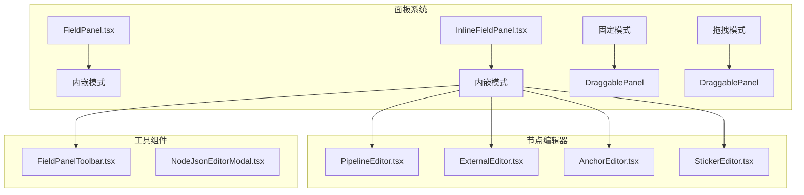
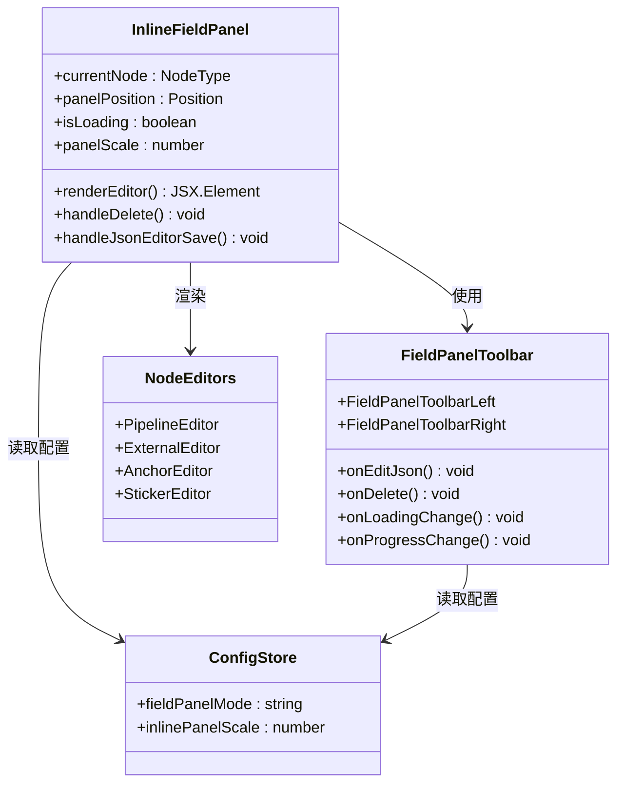
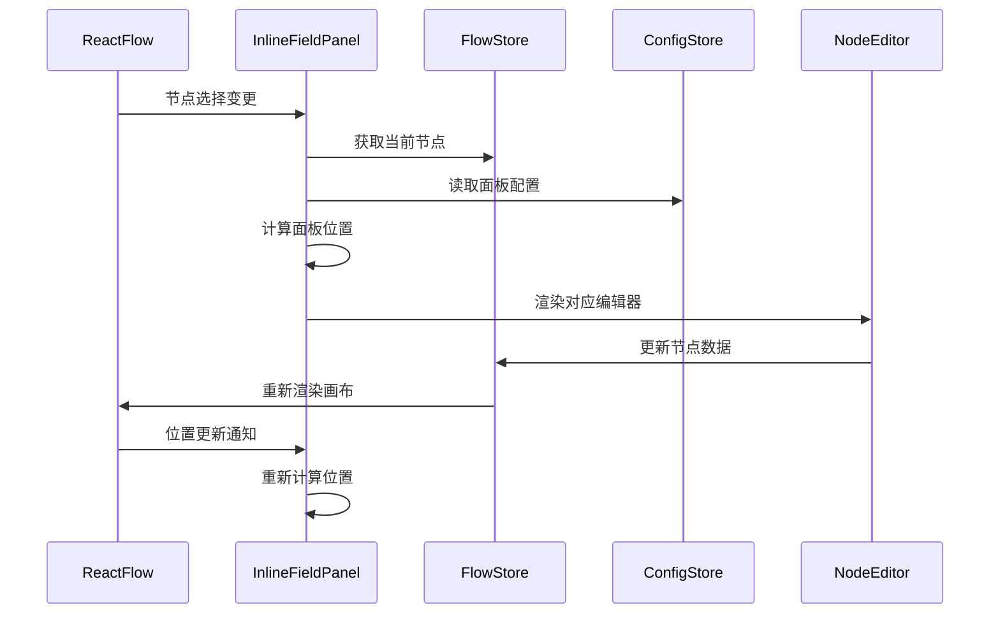
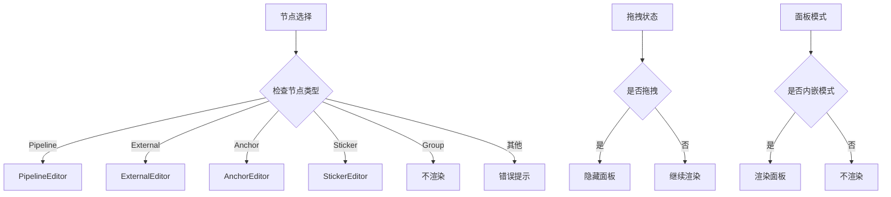
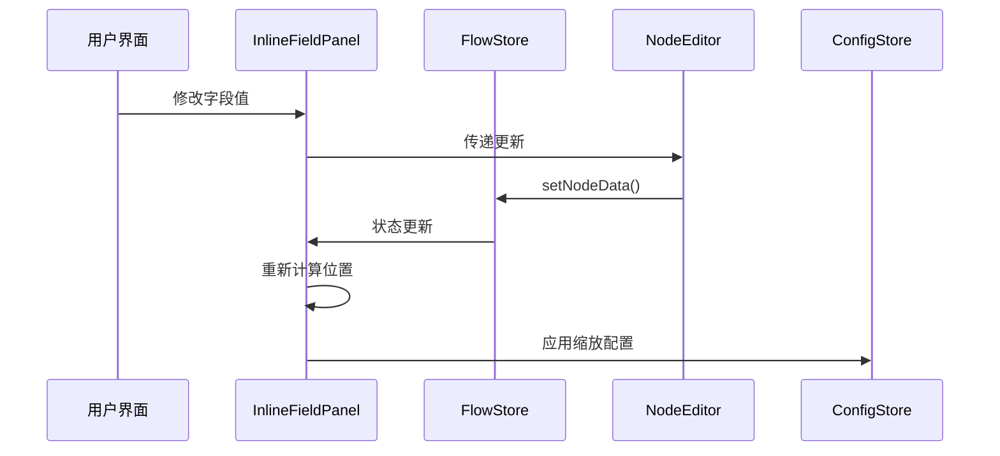
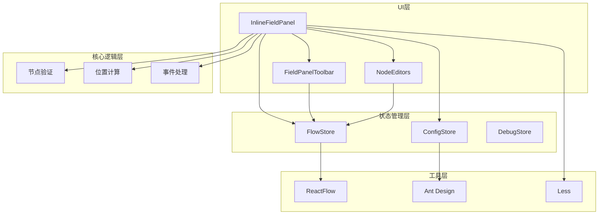

# 内嵌字段面板

<cite>
**本文档引用的文件**
- [InlineFieldPanel.tsx](file://src/components/panels/main/InlineFieldPanel.tsx)
- [InlineFieldPanel.module.less](file://src/styles/InlineFieldPanel.module.less)
- [FieldPanel.tsx](file://src/components/panels/main/FieldPanel.tsx)
- [FieldPanelToolbar.tsx](file://src/components/panels/field/tools/FieldPanelToolbar.tsx)
- [configStore.ts](file://src/stores/configStore.ts)
- [PipelineEditor.tsx](file://src/components/panels/node-editors/PipelineEditor.tsx)
- [ExternalEditor.tsx](file://src/components/panels/node-editors/ExternalEditor.tsx)
- [Flow.tsx](file://src/components/Flow.tsx)
- [panelPosition.ts](file://src/utils/panelPosition.ts)
</cite>

## 目录
1. [简介](#简介)
2. [项目结构](#项目结构)
3. [核心组件](#核心组件)
4. [架构概览](#架构概览)
5. [详细组件分析](#详细组件分析)
6. [依赖关系分析](#依赖关系分析)
7. [性能考虑](#性能考虑)
8. [故障排除指南](#故障排除指南)
9. [结论](#结论)

## 简介

内嵌字段面板（Inline Field Panel）是 MAA Pipeline Editor 中的一个关键组件，它为用户提供了在节点旁边直接编辑节点字段的功能。该面板采用"内嵌"模式显示，始终位于选中节点的右侧，与传统的固定或拖拽模式形成对比。

该组件实现了以下核心功能：
- 实时响应节点位置变化，动态调整面板位置
- 支持多种节点类型的专用编辑器
- 提供统一的工具栏接口
- 实现缩放和变换功能
- 集成加载状态管理和进度反馈

## 项目结构

内嵌字段面板位于项目的面板系统中，与主面板系统并行存在：

**图表来源**
- [InlineFieldPanel.tsx:1-229](file://src/components/panels/main/InlineFieldPanel.tsx#L1-L229)
- [FieldPanel.tsx:1-200](file://src/components/panels/main/FieldPanel.tsx#L1-L200)

**章节来源**
- [InlineFieldPanel.tsx:1-229](file://src/components/panels/main/InlineFieldPanel.tsx#L1-L229)
- [FieldPanel.tsx:185-200](file://src/components/panels/main/FieldPanel.tsx#L185-L200)

## 核心组件

内嵌字段面板系统由多个相互协作的组件组成：

### 主要组件架构

**图表来源**
- [InlineFieldPanel.tsx:33-229](file://src/components/panels/main/InlineFieldPanel.tsx#L33-L229)
- [FieldPanelToolbar.tsx:23-259](file://src/components/panels/field/tools/FieldPanelToolbar.tsx#L23-L259)
- [configStore.ts:134-137](file://src/stores/configStore.ts#L134-L137)

### 配置管理

内嵌字段面板的配置主要通过全局配置存储管理：

| 配置项 | 类型 | 默认值 | 描述 |
|--------|------|--------|------|
| fieldPanelMode | string | "fixed" | 字段面板显示模式 |
| inlinePanelScale | number | 1.0 | 内嵌模式缩放比例（0.5-1.0） |

**章节来源**
- [configStore.ts:134-137](file://src/stores/configStore.ts#L134-L137)
- [configStore.ts:363-404](file://src/stores/configStore.ts#L363-L404)

## 架构概览

内嵌字段面板采用响应式架构设计，实现了与 React Flow 的深度集成：

**图表来源**
- [InlineFieldPanel.tsx:48-71](file://src/components/panels/main/InlineFieldPanel.tsx#L48-L71)
- [InlineFieldPanel.tsx:113-136](file://src/components/panels/main/InlineFieldPanel.tsx#L113-L136)

## 详细组件分析

### InlineFieldPanel 组件

InlineFieldPanel 是整个内嵌字段面板的核心组件，负责协调所有子组件的工作。

#### 核心功能实现

**图表来源**
- [InlineFieldPanel.tsx:116-151](file://src/components/panels/main/InlineFieldPanel.tsx#L116-L151)
- [InlineFieldPanel.tsx:139-156](file://src/components/panels/main/InlineFieldPanel.tsx#L139-L156)

#### 位置计算机制

内嵌字段面板的位置计算基于节点的实时位置信息：

**图表来源**
- [InlineFieldPanel.tsx:65-71](file://src/components/panels/main/InlineFieldPanel.tsx#L65-L71)

#### 数据流管理

**图表来源**
- [InlineFieldPanel.tsx:87-110](file://src/components/panels/main/InlineFieldPanel.tsx#L87-L110)

**章节来源**
- [InlineFieldPanel.tsx:33-229](file://src/components/panels/main/InlineFieldPanel.tsx#L33-L229)

### 节点编辑器系统

内嵌字段面板支持多种节点类型的专用编辑器：

#### PipelineEditor 功能特性

PipelineEditor 专门处理 Pipeline 节点的复杂字段编辑：

- **识别算法选择**：支持多种 OCR 识别算法
- **动作类型配置**：提供丰富的动作选项
- **焦点字段管理**：支持字符串和对象两种模式
- **自定义扩展**：允许添加额外的 JSON 配置

#### ExternalEditor 特殊功能

ExternalEditor 为外部节点提供跨文件导航能力：

- **自动完成功能**：基于文件系统扫描的节点名建议
- **路径显示**：显示目标节点所在的文件路径
- **实时搜索**：支持模糊匹配和过滤

**章节来源**
- [PipelineEditor.tsx:22-200](file://src/components/panels/node-editors/PipelineEditor.tsx#L22-L200)
- [ExternalEditor.tsx:8-106](file://src/components/panels/node-editors/ExternalEditor.tsx#L8-L106)

### 工具栏组件

FieldPanelToolbar 提供了统一的操作接口：

#### 左侧工具栏功能

| 工具图标 | 功能 | 条件 |
|----------|------|------|
| 复制节点名 | 复制节点标签到剪贴板 | 所有节点类型 |
| 复制 Reco JSON | 复制识别配置到剪贴板 | Pipeline 节点 |
| 编辑 JSON | 打开 JSON 编辑器 | 所有节点类型 |

#### 右侧工具栏功能

| 工具图标 | 功能 | 条件 |
|----------|------|------|
| 保存模板 | 保存为配置模板 | Pipeline 节点 |
| AI 智能预测 | 基于上下文的配置建议 | Pipeline 节点 |
| 删除节点 | 移除当前节点 | 所有节点类型 |

**章节来源**
- [FieldPanelToolbar.tsx:23-259](file://src/components/panels/field/tools/FieldPanelToolbar.tsx#L23-L259)

## 依赖关系分析

内嵌字段面板系统涉及多个层次的依赖关系：

**图表来源**
- [InlineFieldPanel.tsx:1-26](file://src/components/panels/main/InlineFieldPanel.tsx#L1-L26)
- [FieldPanelToolbar.tsx:1-21](file://src/components/panels/field/tools/FieldPanelToolbar.tsx#L1-L21)

### 关键依赖关系

1. **ReactFlow 集成**：通过 useReactFlow 和 useStore 订阅节点状态
2. **状态管理**：依赖 FlowStore 和 ConfigStore 进行数据同步
3. **UI 组件库**：使用 Ant Design 提供的组件基础
4. **样式系统**：采用 Less 进行样式管理

**章节来源**
- [InlineFieldPanel.tsx:4-25](file://src/components/panels/main/InlineFieldPanel.tsx#L4-L25)
- [FieldPanelToolbar.tsx:1-21](file://src/components/panels/field/tools/FieldPanelToolbar.tsx#L1-L21)

## 性能考虑

内嵌字段面板在设计时充分考虑了性能优化：

### 渲染优化策略

1. **条件渲染**：仅在特定条件下渲染面板
2. **记忆化优化**：使用 useMemo 和 useCallback 避免不必要的重渲染
3. **事件冒泡阻止**：防止面板交互影响画布操作
4. **缩放优化**：transform-origin 设置为左上角避免位置偏移

### 内存管理

- 使用 React.memo 包装组件避免重复渲染
- 合理的 useState 使用减少状态更新频率
- 及时清理事件监听器和订阅

## 故障排除指南

### 常见问题及解决方案

#### 面板不显示

**可能原因**：
1. 当前未选中任何节点
2. 面板模式不是内嵌模式
3. 节点类型不受支持

**解决方法**：
1. 确保至少选中一个节点
2. 在配置中设置 fieldPanelMode 为 "inline"
3. 检查节点类型是否在支持列表中

#### 位置计算错误

**可能原因**：
1. 节点宽度测量失败
2. ReactFlow 实例未就绪
3. 视口状态异常

**解决方法**：
1. 确保节点已完成测量
2. 检查 ReactFlow 初始化状态
3. 重置视口状态

#### 缩放问题

**可能原因**：
1. inlinePanelScale 配置超出范围
2. transform-origin 设置不当
3. 浏览器兼容性问题

**解决方法**：
1. 确保缩放值在 0.5-1.0 范围内
2. 检查 transform-origin 设置
3. 测试不同浏览器的兼容性

**章节来源**
- [InlineFieldPanel.tsx:139-156](file://src/components/panels/main/InlineFieldPanel.tsx#L139-L156)
- [InlineFieldPanel.tsx:65-71](file://src/components/panels/main/InlineFieldPanel.tsx#L65-L71)

## 结论

内嵌字段面板是 MAA Pipeline Editor 中一个精心设计的组件，它成功地解决了传统面板系统的局限性，提供了更加直观和高效的节点编辑体验。

### 主要优势

1. **实时响应**：与节点位置完全同步，提供无缝的用户体验
2. **类型安全**：针对不同节点类型提供专用编辑器
3. **性能优化**：采用多种优化策略确保流畅运行
4. **配置灵活**：支持缩放等个性化设置

### 技术亮点

- 深度集成 React Flow 的响应式架构
- 完善的状态管理和数据流控制
- 优雅的错误处理和边界情况处理
- 良好的可扩展性和维护性

内嵌字段面板不仅提升了用户的编辑效率，也为整个应用的用户体验奠定了坚实的基础。