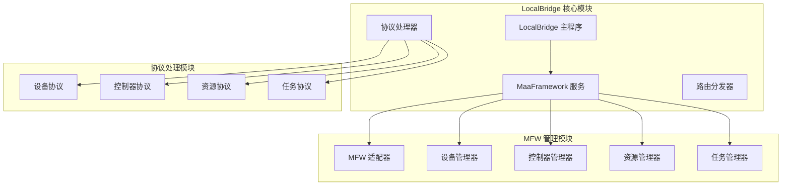
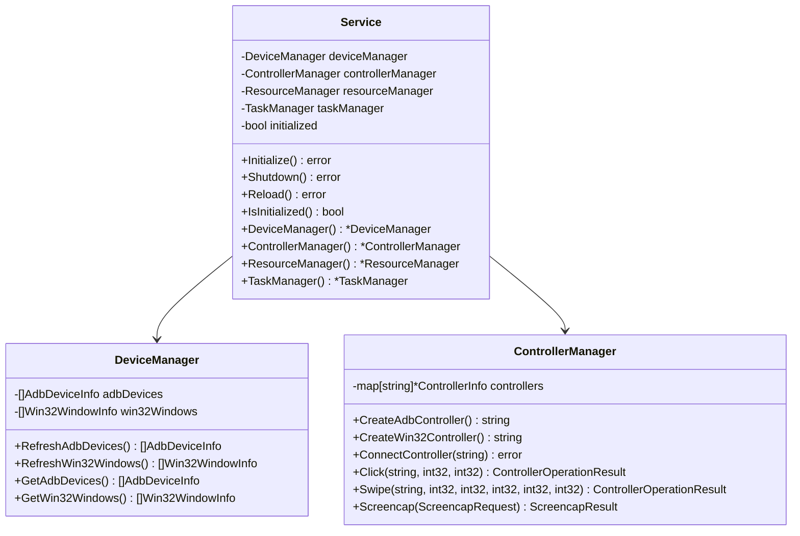
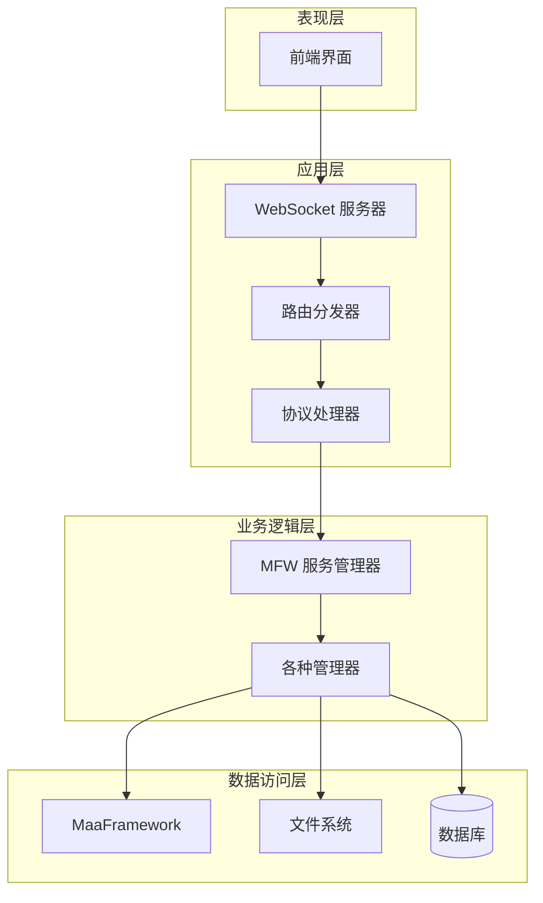
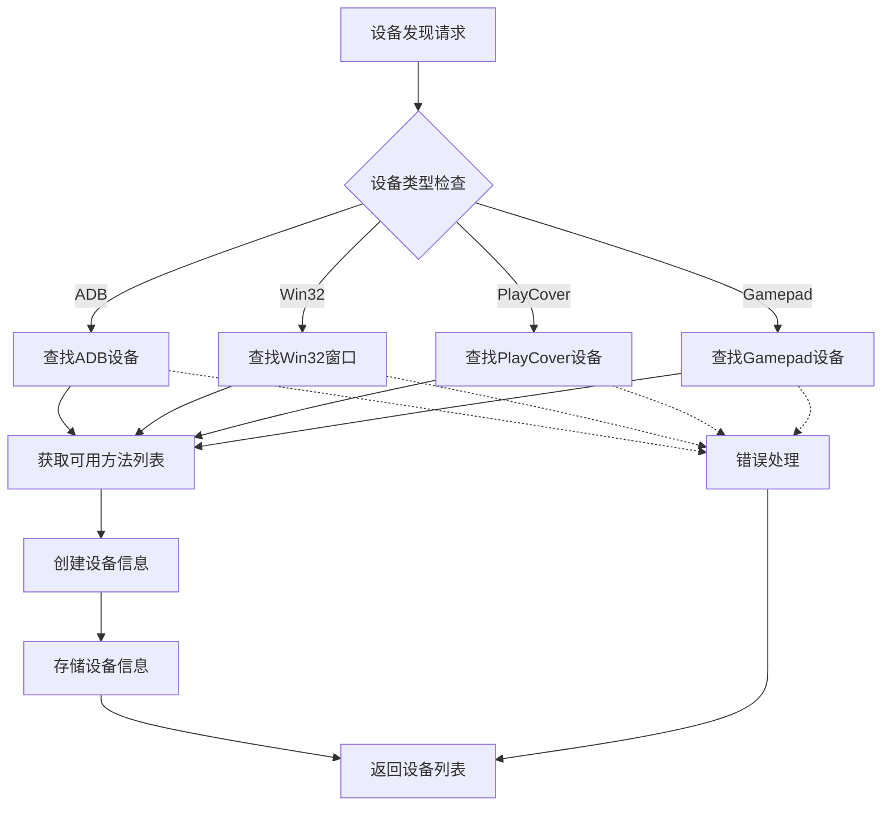
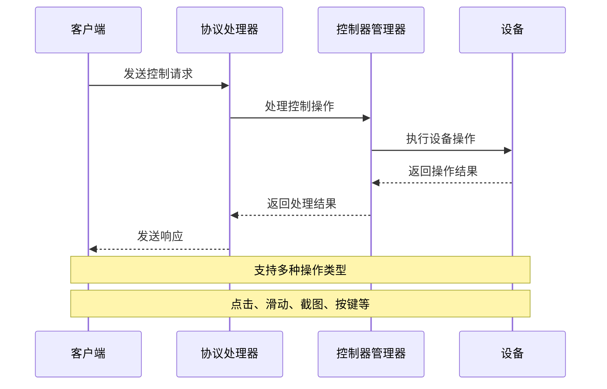
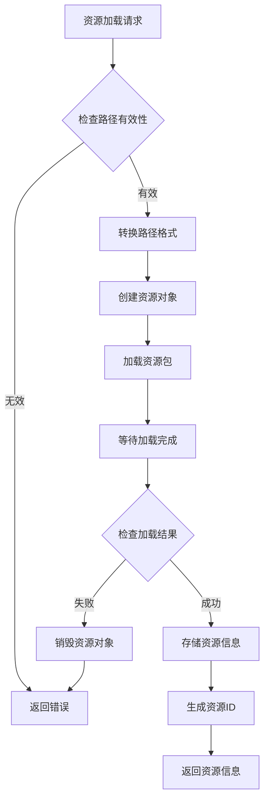
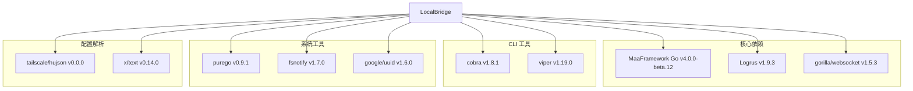
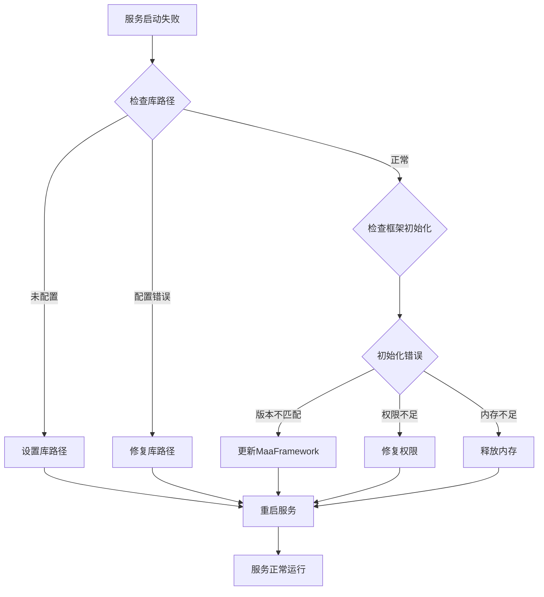

# Maafw Golang Api Consistency Checker

<cite>
**本文档中引用的文件**
- [main.go](file://LocalBridge/cmd/lb/main.go)
- [adapter.go](file://LocalBridge/internal/mfw/adapter.go)
- [service.go](file://LocalBridge/internal/mfw/service.go)
- [types.go](file://LocalBridge/internal/mfw/types.go)
- [device_manager.go](file://LocalBridge/internal/mfw/device_manager.go)
- [controller_manager.go](file://LocalBridge/internal/mfw/controller_manager.go)
- [resource_manager.go](file://LocalBridge/internal/mfw/resource_manager.go)
- [task_manager.go](file://LocalBridge/internal/mfw/task_manager.go)
- [handler.go](file://LocalBridge/internal/protocol/mfw/handler.go)
- [go.mod](file://LocalBridge/go.mod)
- [go.sum](file://LocalBridge/go.sum)
- [API参考.md](file://instructions/maafw-golang-binding/API参考/API参考.md)
</cite>

## 目录
1. [项目概述](#项目概述)
2. [项目结构](#项目结构)
3. [核心组件](#核心组件)
4. [架构概览](#架构概览)
5. [详细组件分析](#详细组件分析)
6. [依赖关系分析](#依赖关系分析)
7. [性能考虑](#性能考虑)
8. [故障排除指南](#故障排除指南)
9. [结论](#结论)

## 项目概述

Maafw Golang Api Consistency Checker 是一个基于 MaaFramework 的本地桥接服务，专门用于检查和验证 Golang API 的一致性。该项目为 MaaPipelineEditor 提供了强大的本地服务支持，通过统一的 API 接口管理和设备控制能力，实现了跨平台的自动化控制和资源管理。

该项目的核心价值在于：
- 提供完整的 MaaFramework Go 语言绑定 API 一致性检查
- 支持多种设备类型的统一管理（ADB、Win32、PlayCover、Gamepad）
- 实现了完整的控制器、资源、任务管理系统
- 提供了丰富的调试和监控功能

## 项目结构

项目采用模块化的架构设计，主要分为以下几个核心模块：



**图表来源**
- [main.go](file://LocalBridge/cmd/lb/main.go#L1-L882)
- [service.go](file://LocalBridge/internal/mfw/service.go#L1-L218)

**章节来源**
- [main.go](file://LocalBridge/cmd/lb/main.go#L1-L882)
- [go.mod](file://LocalBridge/go.mod#L1-L38)

## 核心组件

### MFW 服务管理器

MFW 服务管理器是整个系统的核心协调器，负责管理所有 MaaFramework 相关的组件和服务。



**图表来源**
- [service.go](file://LocalBridge/internal/mfw/service.go#L15-L34)
- [device_manager.go](file://LocalBridge/internal/mfw/device_manager.go#L11-L24)
- [controller_manager.go](file://LocalBridge/internal/mfw/controller_manager.go#L20-L31)

### MFW 适配器

MFW 适配器提供了统一的 API 接口，封装了底层的 MaaFramework 调用细节。

```mermaid
classDiagram
class MaaFWAdapter {
-Controller controller
-Resource resource
-Tasker tasker
-AgentClient agentClient
-Screenshotter screenshotter
-bool controllerConnected
-bool resourceLoaded
-bool agentConnected
-bool initialized
+ConnectADB(string, string, []string, []string, string, string) error
+ConnectWin32(uintptr, string, string) error
+LoadResource(string) error
+InitTasker() error
+RunTask(string, interface{}) TaskJob
+Screencap() string
+Destroy() void
}
class Screenshotter {
-Controller controller
-Image lastImage
-time lastTime
-time Duration cacheTTL
+Capture() Image
+CaptureBase64() string
+SetCacheTTL(time.Duration) void
}
MaaFWAdapter --> Screenshotter
```

**图表来源**
- [adapter.go](file://LocalBridge/internal/mfw/adapter.go#L23-L50)
- [adapter.go](file://LocalBridge/internal/mfw/adapter.go#L724-L731)

**章节来源**
- [service.go](file://LocalBridge/internal/mfw/service.go#L15-L34)
- [adapter.go](file://LocalBridge/internal/mfw/adapter.go#L19-L50)

## 架构概览

系统采用分层架构设计，确保了良好的可维护性和扩展性：



**图表来源**
- [main.go](file://LocalBridge/cmd/lb/main.go#L317-L420)
- [handler.go](file://LocalBridge/internal/protocol/mfw/handler.go#L11-L26)

## 详细组件分析

### 设备管理器

设备管理器负责发现和管理各种类型的设备连接。



**图表来源**
- [device_manager.go](file://LocalBridge/internal/mfw/device_manager.go#L26-L60)
- [device_manager.go](file://LocalBridge/internal/mfw/device_manager.go#L62-L94)

### 控制器管理器

控制器管理器提供了统一的设备控制接口，支持多种设备类型的操作。



**图表来源**
- [controller_manager.go](file://LocalBridge/internal/mfw/controller_manager.go#L321-L355)
- [controller_manager.go](file://LocalBridge/internal/mfw/controller_manager.go#L357-L391)

### 资源管理器

资源管理器负责管理 MaaFramework 的资源包加载和卸载。



**图表来源**
- [resource_manager.go](file://LocalBridge/internal/mfw/resource_manager.go#L26-L105)

**章节来源**
- [device_manager.go](file://LocalBridge/internal/mfw/device_manager.go#L1-L110)
- [controller_manager.go](file://LocalBridge/internal/mfw/controller_manager.go#L1-L800)
- [resource_manager.go](file://LocalBridge/internal/mfw/resource_manager.go#L1-L158)

## 依赖关系分析

项目使用了现代化的 Go 模块系统和依赖管理：



**图表来源**
- [go.mod](file://LocalBridge/go.mod#L5-L16)

**章节来源**
- [go.mod](file://LocalBridge/go.mod#L1-L38)
- [go.sum](file://LocalBridge/go.sum#L1-L93)

## 性能考虑

系统在设计时充分考虑了性能优化：

### 内存管理
- 使用连接池和对象复用减少内存分配
- 实现智能缓存机制（截图缓存 TTL 100ms）
- 及时释放不再使用的资源和连接

### 并发处理
- 采用读写锁分离提高并发性能
- 异步操作避免阻塞主线程
- 任务队列管理后台操作

### 网络优化
- WebSocket 长连接减少连接开销
- 消息批量处理提高吞吐量
- 压缩传输数据减少带宽占用

## 故障排除指南

### 常见问题诊断



### 调试功能

系统提供了完善的调试和监控功能：

- **日志系统**：支持多级别日志输出和历史日志推送
- **状态监控**：实时监控设备连接状态和操作结果
- **性能指标**：记录关键操作的执行时间和成功率
- **错误追踪**：详细的错误堆栈和上下文信息

**章节来源**
- [main.go](file://LocalBridge/cmd/lb/main.go#L282-L298)
- [service.go](file://LocalBridge/internal/mfw/service.go#L36-L51)

## 结论

Maafw Golang Api Consistency Checker 是一个设计精良、功能完备的本地服务系统。通过模块化的架构设计和完善的错误处理机制，该项目为 MaaPipelineEditor 提供了稳定可靠的本地桥接服务。

### 主要优势

1. **API 一致性**：严格遵循 MaaFramework 的 API 规范，确保跨平台兼容性
2. **扩展性强**：模块化设计便于添加新的设备类型和功能
3. **性能优异**：优化的内存管理和并发处理机制
4. **易于维护**：清晰的代码结构和完善的文档支持

### 技术特色

- 支持多种设备类型的统一管理
- 提供完整的生命周期管理
- 实现了丰富的调试和监控功能
- 采用现代化的 Go 语言特性和最佳实践

该项目为自动化控制和资源管理领域提供了一个优秀的解决方案，具有很高的实用价值和推广前景。