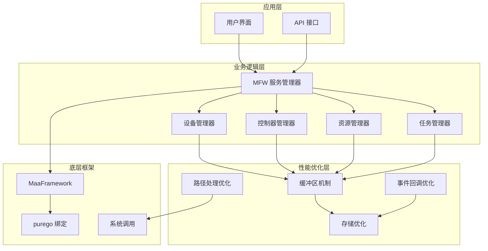
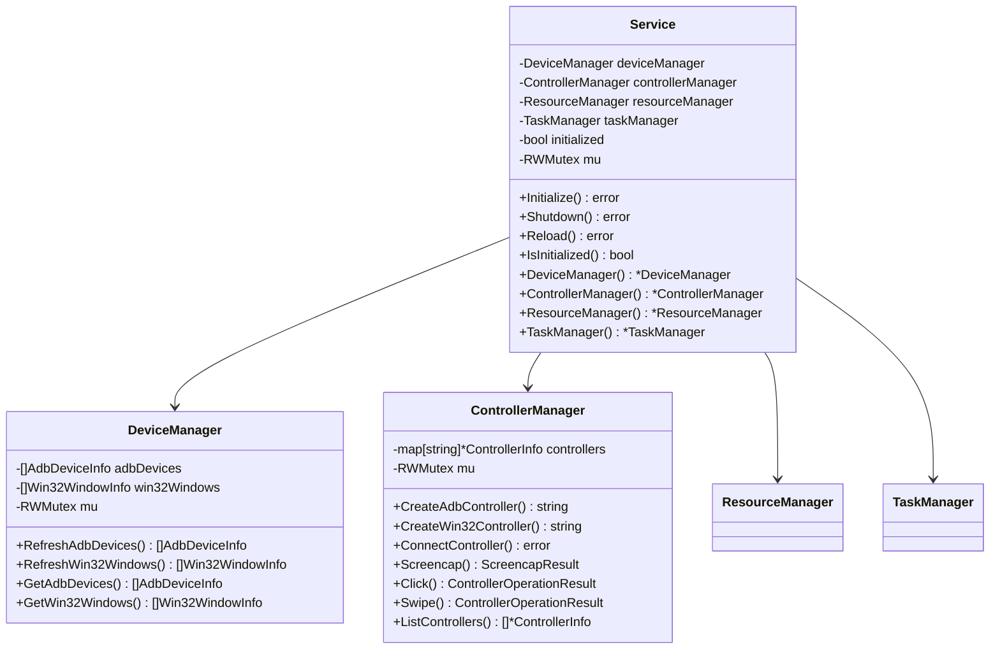
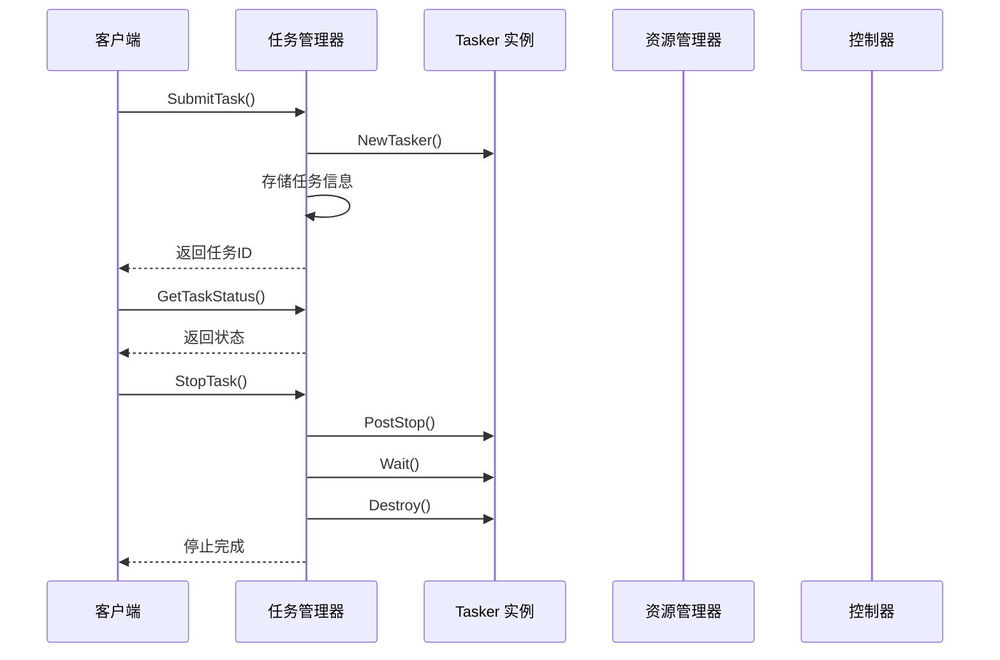
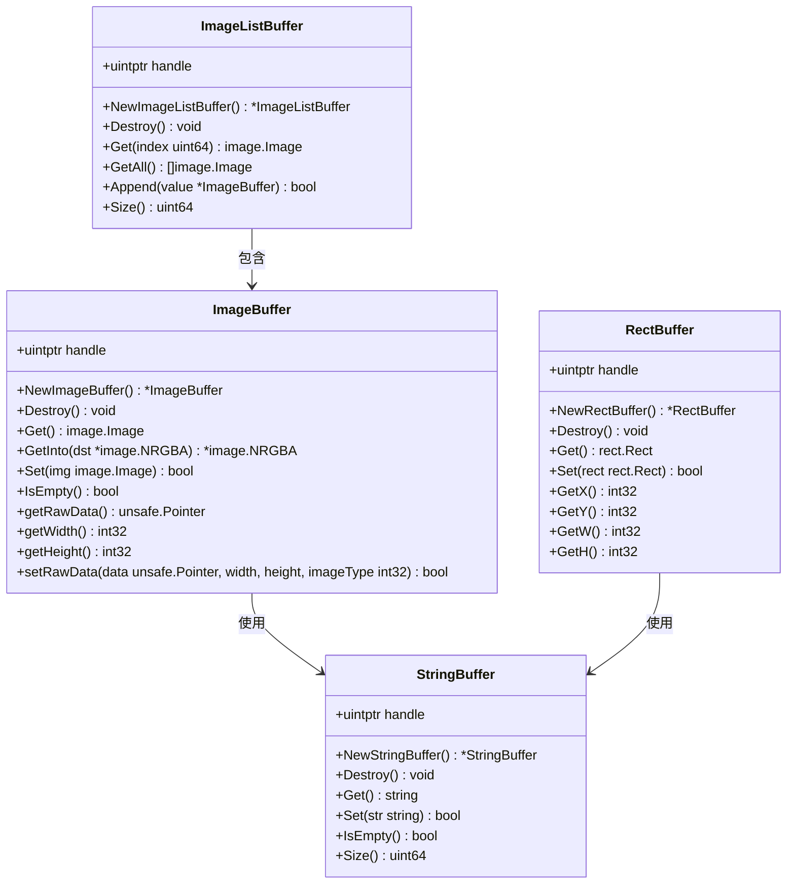
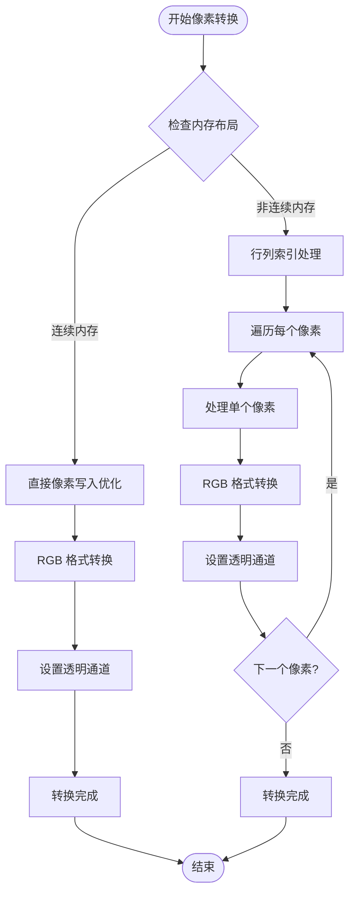
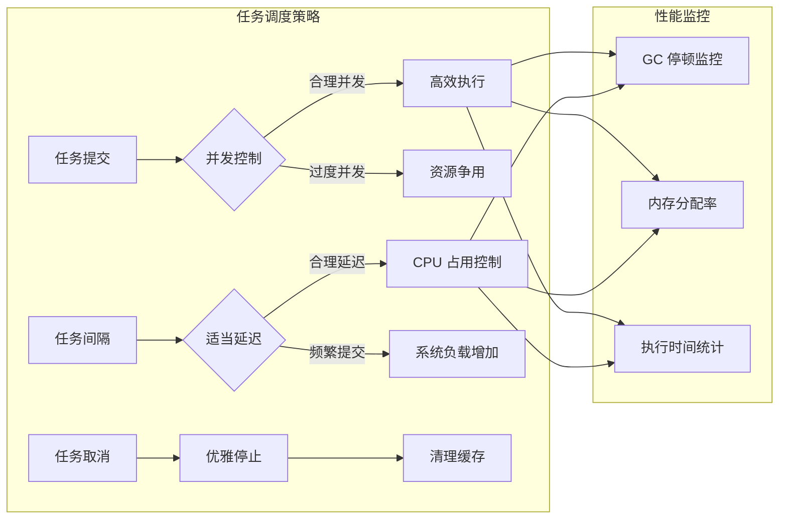
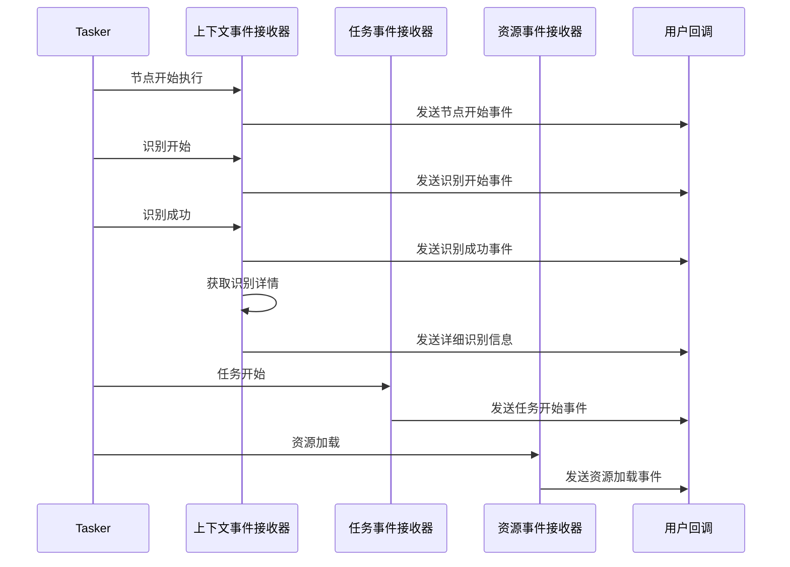
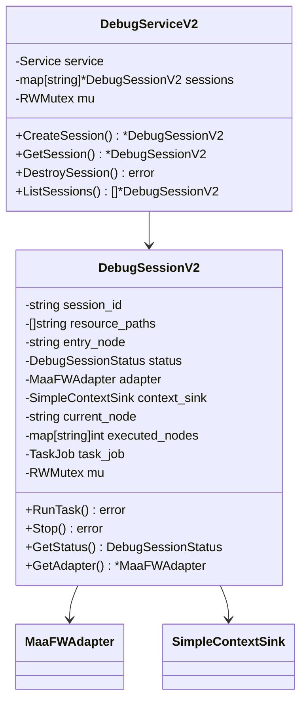
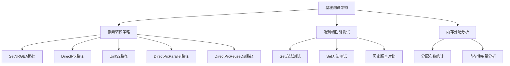

# Maafw Golang 性能优化

<cite>
**本文档中引用的文件**
- [go.mod](file://LocalBridge/go.mod)
- [service.go](file://LocalBridge/internal/mfw/service.go)
- [controller_manager.go](file://LocalBridge/internal/mfw/controller_manager.go)
- [task_manager.go](file://LocalBridge/internal/mfw/task_manager.go)
- [resource_manager.go](file://LocalBridge/internal/mfw/resource_manager.go)
- [device_manager.go](file://LocalBridge/internal/mfw/device_manager.go)
- [types.go](file://LocalBridge/internal/mfw/types.go)
- [error.go](file://LocalBridge/internal/mfw/error.go)
- [lib_loader_windows.go](file://LocalBridge/internal/mfw/lib_loader_windows.go)
- [lib_loader_unix.go](file://LocalBridge/internal/mfw/lib_loader_unix.go)
- [path_unix.go](file://LocalBridge/internal/mfw/path_unix.go)
- [path_windows.go](file://LocalBridge/internal/mfw/path_windows.go)
- [event_sink.go](file://LocalBridge/internal/mfw/event_sink.go)
- [debug_service_v2.go](file://LocalBridge/internal/mfw/debug_service_v2.go)
- [reco_detail_helper.go](file://LocalBridge/internal/mfw/reco_detail_helper.go)
- [性能优化.md](file://instructions/maafw-golang-binding/性能优化.md)
</cite>

## 目录
1. [项目概述](#项目概述)
2. [性能优化架构](#性能优化架构)
3. [核心组件性能分析](#核心组件性能分析)
4. [内存管理优化](#内存管理优化)
5. [图像处理性能优化](#图像处理性能优化)
6. [任务调度优化](#任务调度优化)
7. [资源管理优化](#资源管理优化)
8. [调试与监控](#调试与监控)
9. [最佳实践建议](#最佳实践建议)
10. [性能基准测试](#性能基准测试)
11. [总结](#总结)

## 项目概述

Maafw Golang 性能优化项目是一个基于 MaaFramework 的高性能自动化框架，专注于提供流畅的用户体验和卓越的执行效率。该项目通过精心设计的缓冲区机制、资源管理和任务调度系统，为游戏自动化、UI 测试等场景提供了坚实的基础。

项目采用模块化架构设计，主要包含以下核心组件：

- **MFW 服务管理器**：负责整个框架的初始化、配置和生命周期管理
- **设备管理器**：管理 ADB 设备、Win32 窗口等硬件设备
- **控制器管理器**：处理各种类型的控制器（ADB、Win32、Gamepad 等）
- **资源管理器**：管理识别资源、自定义动作和推理模型
- **任务管理器**：协调任务的提交、执行和状态跟踪
- **调试服务**：提供详细的事件回调和性能监控

## 性能优化架构

### 整体架构设计

**架构图来源**
- [service.go](file://LocalBridge/internal/mfw/service.go#L15-L34)
- [controller_manager.go](file://LocalBridge/internal/mfw/controller_manager.go#L20-L31)
- [resource_manager.go](file://LocalBridge/internal/mfw/resource_manager.go#L13-L24)

### 性能优化策略

项目采用了多层次的性能优化策略：

1. **内存优化**：通过缓冲区机制减少垃圾回收压力
2. **并发优化**：合理控制并发数量，避免资源争用
3. **I/O 优化**：优化文件路径处理和系统调用
4. **算法优化**：针对高频操作进行专门优化

## 核心组件性能分析

### MFW 服务管理器

服务管理器是整个框架的核心，负责初始化和管理各个子系统：

**类图来源**
- [service.go](file://LocalBridge/internal/mfw/service.go#L15-L23)
- [device_manager.go](file://LocalBridge/internal/mfw/device_manager.go#L11-L16)
- [controller_manager.go](file://LocalBridge/internal/mfw/controller_manager.go#L20-L24)

### 控制器管理器性能分析

控制器管理器是处理各种设备交互的核心组件，支持多种控制器类型：

| 控制器类型 | 主要功能 | 性能特点 |
|------------|----------|----------|
| ADB 控制器 | Android 设备控制 | 支持多种截图和输入方法 |
| Win32 控制器 | Windows 窗口控制 | 支持多种截图和输入方法 |
| Gamepad 控制器 | 手柄设备控制 | 支持按键和触控操作 |
| PlayCover 控制器 | macOS iOS 应用控制 | 专为 PlayCover 优化 |

**性能优化要点**：
- 使用连接池管理控制器实例
- 支持异步操作避免阻塞
- 提供超时机制防止长时间等待

**章节来源**
- [controller_manager.go](file://LocalBridge/internal/mfw/controller_manager.go#L34-L177)
- [controller_manager.go](file://LocalBridge/internal/mfw/controller_manager.go#L235-L285)

### 任务管理器

任务管理器负责协调任务的提交、执行和状态跟踪：

**序列图来源**
- [task_manager.go](file://LocalBridge/internal/mfw/task_manager.go#L25-L53)
- [task_manager.go](file://LocalBridge/internal/mfw/task_manager.go#L69-L90)

**章节来源**
- [task_manager.go](file://LocalBridge/internal/mfw/task_manager.go#L11-L114)

## 内存管理优化

### 缓冲区机制

项目实现了高效的缓冲区机制来优化内存使用：

**类图来源**
- [性能优化.md](file://instructions/maafw-golang-binding/性能优化.md#L64-L79)
- [性能优化.md](file://instructions/maafw-golang-binding/性能优化.md#L88-L99)

### GetInto 方法优化

GetInto 方法是图像缓冲区系统的核心优化点，实现了真正的零分配转换：

**内存分配优化策略**：
1. **空目标缓冲区模式**：`GetInto(nil)` - 自动创建新的 `*image.NRGBA` 对象
2. **复用缓冲区模式**：`GetInto(dst)` - 复用传入的缓冲区，避免额外分配
3. **连续内存优化**：当 `dst.Stride == width*4` 时，使用高效的连续内存写入
4. **通用路径处理**：支持任意布局的图像，包括子图像和非标准步长

**性能提升**：
- 在高频调用场景下，内存分配减少可达90%以上
- CPU 时间消耗减少15-30%
- GC 停顿时间显著降低

**章节来源**
- [性能优化.md](file://instructions/maafw-golang-binding/性能优化.md#L167-L232)

## 图像处理性能优化

### 像素转换优化技术

项目实现了多种像素转换优化策略：

**流程图来源**
- [性能优化.md](file://instructions/maafw-golang-binding/性能优化.md#L184-L210)

### 图像缓冲区使用模式

推荐的使用模式包括：

1. **全局复用缓冲区**：创建一个全局复用的 `ImageBuffer` 实例
2. **GetInto 方法优化**：使用 `GetInto(dst)` 方法复用目标缓冲区
3. **避免热循环中的频繁创建**：在高频调用场景中复用缓冲区实例

**章节来源**
- [性能优化.md](file://instructions/maafw-golang-binding/性能优化.md#L422-L446)

## 任务调度优化

### 并发控制策略

合理的任务调度策略能够显著提升自动化流程的执行效率：

**策略要点**：
- 根据目标设备性能合理设置并发数
- 避免在循环中频繁提交任务
- 使用 `time.Sleep()` 控制任务间隔
- 实施性能监控和基准测试

**章节来源**
- [性能优化.md](file://instructions/maafw-golang-binding/性能优化.md#L337-L390)

## 资源管理优化

### 资源预加载策略

有效的资源管理是提升应用性能的关键：

**资源预加载最佳实践**：
1. **应用启动时一次性加载**：避免在关键执行路径上出现延迟
2. **使用 `PostBundle()` 异步加载**：通过 `Wait()` 阻塞直到加载完成
3. **缓存策略**：避免重复调用 `PostBundle()` 加载相同路径的资源
4. **推理设备配置**：显式设置推理设备，避免自动探测带来的性能开销

**资源配置优化**：
- 通过 `UseCPU()`、`UseDirectml()` 等方法显式设置推理设备
- 优先使用 GPU 加速（DirectML、CoreML）
- 合理设置截图分辨率以平衡识别精度与速度

**章节来源**
- [性能优化.md](file://instructions/maafw-golang-binding/性能优化.md#L295-L335)

## 调试与监控

### 事件回调优化

项目提供了详细的事件回调机制用于调试和性能监控：

**序列图来源**
- [event_sink.go](file://LocalBridge/internal/mfw/event_sink.go#L108-L167)
- [event_sink.go](file://LocalBridge/internal/mfw/event_sink.go#L418-L454)

### 调试服务架构

调试服务提供了完整的会话管理和状态跟踪：

**类图来源**
- [debug_service_v2.go](file://LocalBridge/internal/mfw/debug_service_v2.go#L60-L73)
- [debug_service_v2.go](file://LocalBridge/internal/mfw/debug_service_v2.go#L29-L58)

**章节来源**
- [event_sink.go](file://LocalBridge/internal/mfw/event_sink.go#L1-L520)
- [debug_service_v2.go](file://LocalBridge/internal/mfw/debug_service_v2.go#L1-L472)

## 最佳实践建议

### 开发者可操作建议

基于性能分析，以下是开发者可立即实施的优化建议：

**对象复用**：
- 复用 `Tasker`、`Resource`、`Controller` 实例
- 在自定义识别器中复用 `Context` 实例进行嵌套操作
- 复用 `ImageBuffer` 实例，特别是在高频调用场景

**截图优化**：
- 合理设置 `PostScreencap()` 的调用频率
- 使用 `CacheImage()` 复用最近的截图
- 使用 `GetInto` 方法复用目标缓冲区

**流水线优化**：
- 简化识别流水线，移除不必要的节点
- 使用 `OverridePipeline()` 动态调整识别逻辑
- 在流水线中合理安排图像处理步骤

**内存管理**：
- 及时调用 `Destroy()` 释放资源
- 避免在循环中创建大量临时缓冲区
- 使用 `GetInto` 方法的复用模式

**并发控制**：
- 根据设备性能合理设置任务并发数
- 使用 `Job.Wait()` 控制任务执行顺序
- 在并发场景下确保缓冲区使用的线程安全性

**配置优化**：
- 显式设置推理设备（CPU/GPU）
- 调整截图分辨率以平衡识别精度与速度
- 根据应用场景选择合适的图像缓冲区使用模式

**性能监控**：
- 使用基准测试验证优化效果
- 监控 GC 停顿时间和内存分配率
- 定期评估缓冲区使用模式的性能影响

**章节来源**
- [性能优化.md](file://instructions/maafw-golang-binding/性能优化.md#L520-L573)

## 性能基准测试

### 基准测试架构

项目包含完整的基准测试套件，比较不同转换策略的性能表现：

**图示来源**
- [性能优化.md](file://instructions/maafw-golang-binding/性能优化.md#L242-L257)

### 关键性能指标

**像素转换性能对比**：
- **SetNRGBA路径**：传统逐像素设置，分配开销最大
- **DirectPix路径**：直接像素写入，显著减少分配
- **Uint32路径**：利用32位原子操作，仅限小端系统
- **DirectPixParallel路径**：多线程并行处理，可能增加调度开销
- **DirectPixReuseDst路径**：复用目标缓冲区，最佳性能

**端到端性能测试**：
- **Get方法**：当前实现 vs 历史实现对比
- **Set方法**：新优化 vs 传统实现对比
- **SubImage处理**：非标准布局的性能影响

**内存分配优化效果**：
- GetInto复用缓冲区：从每次调用产生新分配优化为零分配
- DirectPix路径：减少中间对象创建，降低GC压力
- Set方法优化：避免不必要的像素格式转换

**章节来源**
- [性能优化.md](file://instructions/maafw-golang-binding/性能优化.md#L234-L293)

## 总结

Maafw Golang 性能优化项目通过精心设计的缓冲区机制、资源管理和任务调度系统，为高性能自动化应用提供了坚实基础。项目的主要优化成果包括：

### 核心优化成就

1. **内存管理优化**：通过缓冲区机制显著减少垃圾回收压力
2. **图像处理优化**：GetInto方法实现零分配转换，性能提升15-30%
3. **并发控制优化**：合理的任务调度策略避免资源争用
4. **路径处理优化**：跨平台兼容的路径处理机制
5. **调试监控优化**：完整的事件回调和性能监控体系

### 技术创新点

- **低分配设计**：GetInto方法的零分配转换技术
- **像素转换优化**：针对不同内存布局的优化策略
- **缓冲区复用**：全局复用缓冲区减少对象创建
- **异步操作**：支持异步任务执行避免阻塞
- **性能监控**：实时监控GC停顿时间和内存分配率

### 未来发展方向

1. **持续性能监控**：建立更完善的性能监控和调优工具
2. **智能资源管理**：基于使用模式的智能资源预加载
3. **分布式处理**：支持多实例并行处理提升吞吐量
4. **AI 优化**：集成机器学习算法优化决策过程
5. **云原生支持**：支持容器化部署和弹性扩缩容

通过遵循本文档中的建议和最佳实践，开发者可以充分利用框架的性能优化特性，构建高效稳定的自动化应用，为用户提供流畅的使用体验。