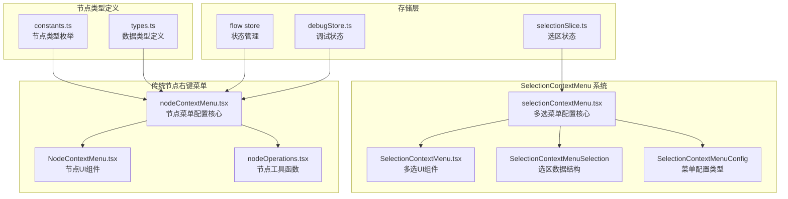
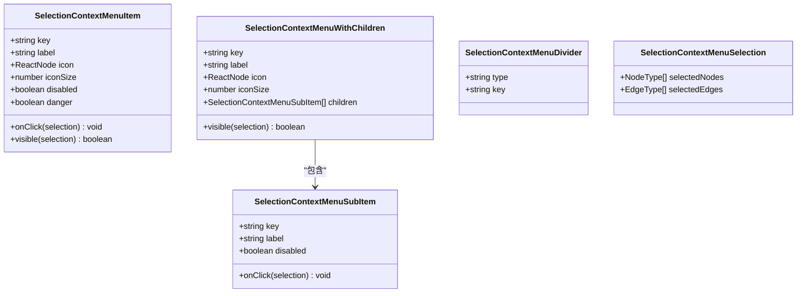
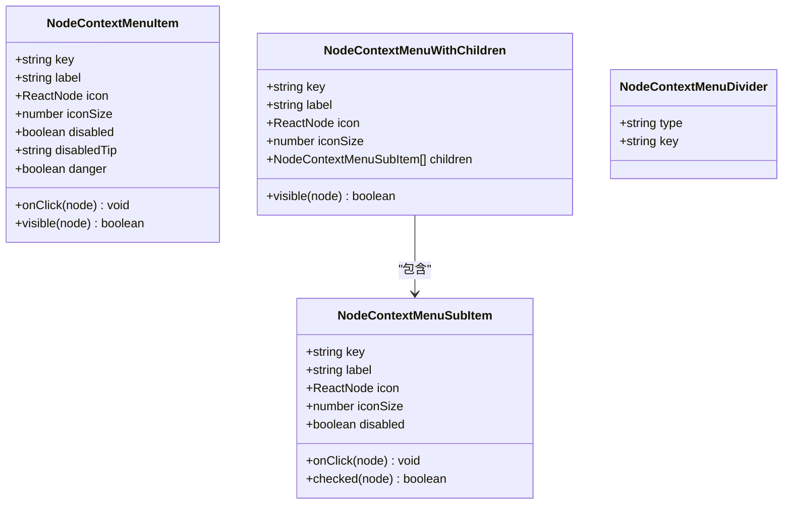
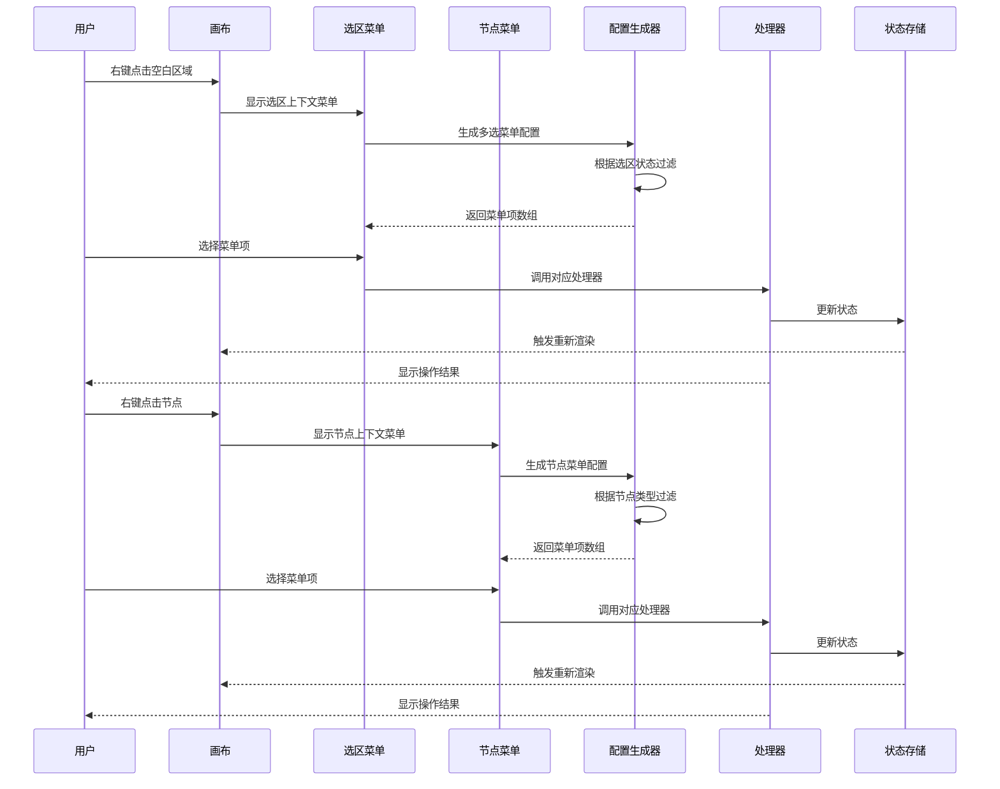
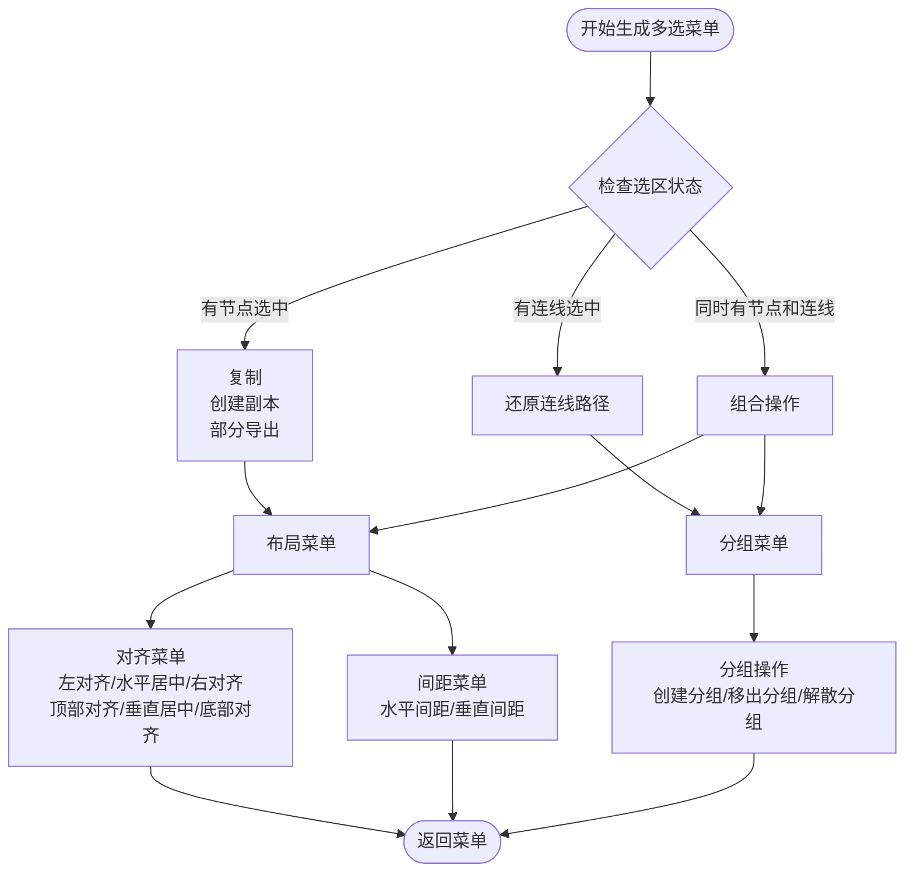
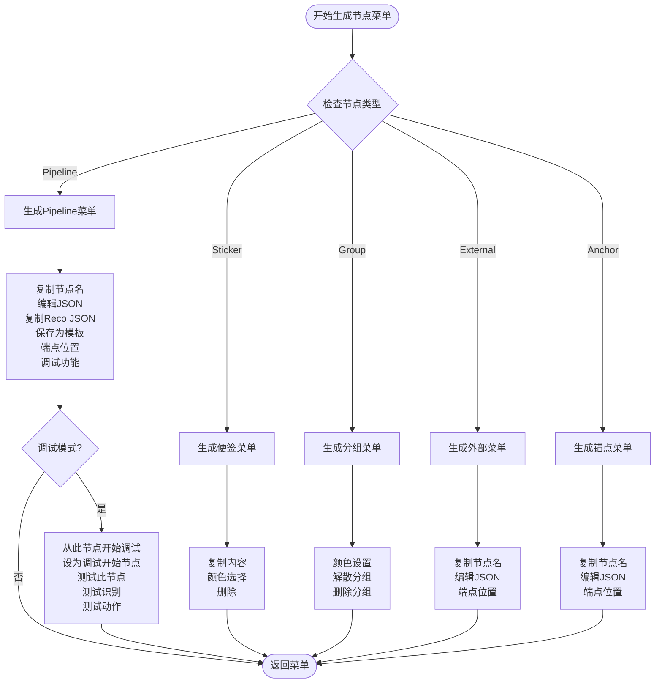
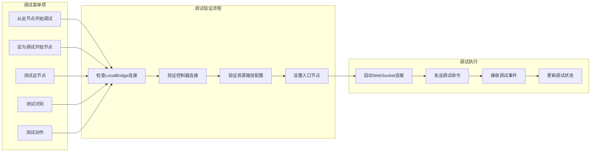
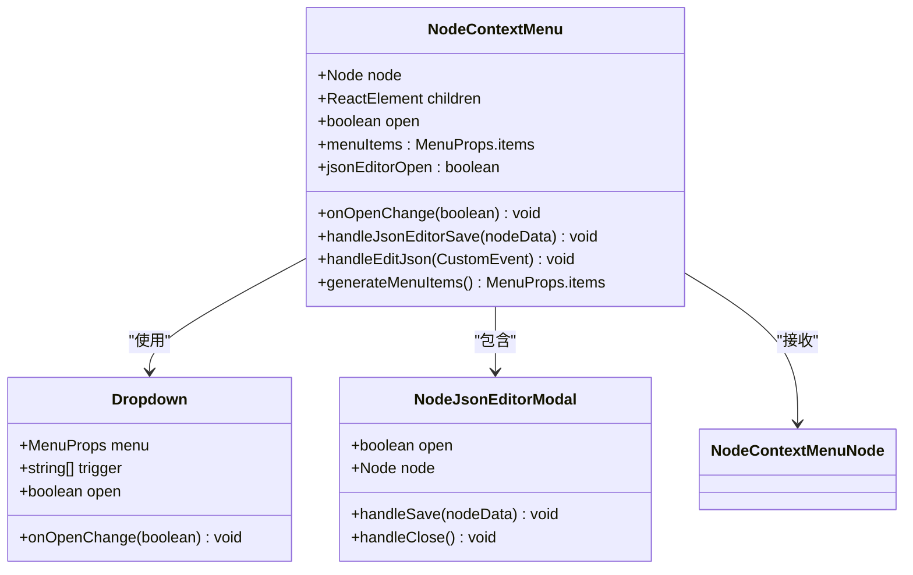
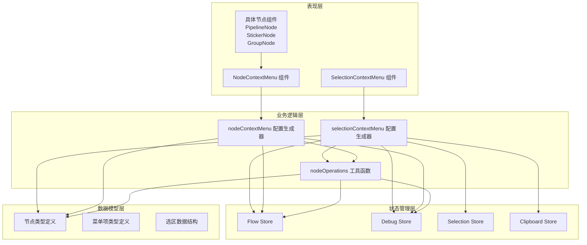

# 节点上下文菜单

<cite>
**本文档引用的文件**
- [selectionContextMenu.tsx](file://src/components/flow/selectionContextMenu.tsx)
- [SelectionContextMenu.tsx](file://src/components/flow/components/SelectionContextMenu.tsx)
- [nodeContextMenu.tsx](file://src/components/flow/nodes/nodeContextMenu.tsx)
- [NodeContextMenu.tsx](file://src/components/flow/nodes/components/NodeContextMenu.tsx)
- [nodeOperations.tsx](file://src/components/flow/nodes/utils/nodeOperations.tsx)
- [constants.ts](file://src/components/flow/nodes/constants.ts)
- [types.ts](file://src/stores/flow/types.ts)
- [index.ts](file://src/stores/flow/index.ts)
- [selectionSlice.ts](file://src/stores/flow/slices/selectionSlice.ts)
- [debugStore.ts](file://src/stores/debugStore.ts)
- [Flow.tsx](file://src/components/Flow.tsx)
- [PipelineNode/index.tsx](file://src/components/flow/nodes/PipelineNode/index.tsx)
- [StickerNode.tsx](file://src/components/flow/nodes/StickerNode.tsx)
- [GroupNode.tsx](file://src/components/flow/nodes/GroupNode.tsx)
- [layout.ts](file://src/core/layout.ts)
</cite>

## 更新摘要
**变更内容**
- 新增 SelectionContextMenu 系统，替代原有的简单右键菜单功能
- 引入多选上下文菜单，支持批量节点操作
- 添加布局对齐、间距调整、分组管理等高级功能
- 重构菜单系统架构，实现更强大的多选操作能力

## 目录
1. [简介](#简介)
2. [项目结构](#项目结构)
3. [核心组件](#核心组件)
4. [架构概览](#架构概览)
5. [详细组件分析](#详细组件分析)
6. [依赖关系分析](#依赖关系分析)
7. [性能考虑](#性能考虑)
8. [故障排除指南](#故障排除指南)
9. [结论](#结论)

## 简介

节点上下文菜单系统是 MAA Pipeline Editor 中一个关键的用户交互功能，现已演进为支持多选操作的强大系统。该系统不仅保留了原有的节点右键菜单功能，还引入了全新的 SelectionContextMenu 系统，为用户提供更丰富的批量操作能力。

系统采用模块化设计，将菜单配置逻辑与 UI 组件分离，实现了高度的可扩展性和维护性。通过统一的接口定义和类型安全的设计，确保了不同节点类型之间的一致性体验。

**更新** 系统现已支持多选上下文菜单，用户可以通过右键点击空白区域或选区来访问批量操作功能，包括复制、创建副本、部分导出、对齐、间距调整、分组管理等高级功能。

## 项目结构

节点上下文菜单系统主要分布在以下目录结构中：



**图表来源**
- [selectionContextMenu.tsx:1-487](file://src/components/flow/selectionContextMenu.tsx#L1-L487)
- [SelectionContextMenu.tsx:1-162](file://src/components/flow/components/SelectionContextMenu.tsx#L1-L162)
- [nodeContextMenu.tsx:1-603](file://src/components/flow/nodes/nodeContextMenu.tsx#L1-L603)
- [NodeContextMenu.tsx:1-227](file://src/components/flow/nodes/components/NodeContextMenu.tsx#L1-L227)

**章节来源**
- [selectionContextMenu.tsx:1-487](file://src/components/flow/selectionContextMenu.tsx#L1-L487)
- [SelectionContextMenu.tsx:1-162](file://src/components/flow/components/SelectionContextMenu.tsx#L1-L162)
- [nodeContextMenu.tsx:1-603](file://src/components/flow/nodes/nodeContextMenu.tsx#L1-L603)
- [NodeContextMenu.tsx:1-227](file://src/components/flow/nodes/components/NodeContextMenu.tsx#L1-L227)

## 核心组件

### SelectionContextMenu 类型系统

新增的 SelectionContextMenu 系统定义了完整的多选菜单项类型层次结构：



**图表来源**
- [selectionContextMenu.tsx:15-58](file://src/components/flow/selectionContextMenu.tsx#L15-L58)

### 菜单项类型系统

系统定义了完整的菜单项类型层次结构，支持普通菜单项、带子菜单的菜单项和分隔线：



**图表来源**
- [nodeContextMenu.tsx:27-71](file://src/components/flow/nodes/nodeContextMenu.tsx#L27-L71)

### 节点类型联合体

系统支持五种不同的节点类型，每种类型都有其特定的数据结构和行为：

| 节点类型 | 数据类型 | 主要功能 | 特殊属性 |
|---------|----------|----------|----------|
| Pipeline | PipelineNodeDataType | 核心识别和动作节点 | recognition, action, others |
| External | ExternalNodeDataType | 外部节点连接 | - |
| Anchor | AnchorNodeDataType | 重定向节点 | - |
| Sticker | StickerNodeDataType | 便签注释 | content, color |
| Group | GroupNodeDataType | 分组容器 | color |

**章节来源**
- [types.ts:107-163](file://src/stores/flow/types.ts#L107-L163)
- [constants.ts:14-20](file://src/components/flow/nodes/constants.ts#L14-L20)

## 架构概览

节点上下文菜单系统采用分层架构设计，实现了关注点分离和高内聚低耦合：



**图表来源**
- [SelectionContextMenu.tsx:50-162](file://src/components/flow/components/SelectionContextMenu.tsx#L50-L162)
- [nodeContextMenu.tsx:378-602](file://src/components/flow/nodes/nodeContextMenu.tsx#L378-L602)

## 详细组件分析

### SelectionContextMenu 配置生成器

SelectionContextMenu 配置生成器是多选操作的核心，负责根据选区状态动态生成相应的菜单项：



**图表来源**
- [selectionContextMenu.tsx:314-486](file://src/components/flow/selectionContextMenu.tsx#L314-L486)

### 传统节点菜单配置生成器

传统的节点右键菜单配置生成器负责根据节点类型动态生成相应的菜单项：



**图表来源**
- [nodeContextMenu.tsx:378-602](file://src/components/flow/nodes/nodeContextMenu.tsx#L378-L602)

### 调试功能集成

系统深度集成了调试功能，为 Pipeline 节点提供了强大的调试支持：



**图表来源**
- [nodeContextMenu.tsx:114-176](file://src/components/flow/nodes/nodeContextMenu.tsx#L114-L176)
- [debugStore.ts:143-200](file://src/stores/debugStore.ts#L143-L200)

### UI 组件实现

SelectionContextMenu 组件负责将配置转换为实际的 UI 元素，并处理用户交互：

```mermaid
classDiagram
class SelectionContextMenu {
+{x : number, y : number} position
+boolean open
+onOpenChange(boolean) void
+menuItems : MenuProps.items
+generateMenuItems() MenuProps.items
}
class Dropdown {
+MenuProps menu
+string[] trigger
+boolean open
+onOpenChange(boolean) void
}
class SelectionContextMenuSelection {
+NodeType[] selectedNodes
+EdgeType[] selectedEdges
}
SelectionContextMenu --> Dropdown : "使用"
SelectionContextMenu --> SelectionContextMenuSelection : "接收"
```

**图表来源**
- [SelectionContextMenu.tsx:16-21](file://src/components/flow/components/SelectionContextMenu.tsx#L16-L21)

NodeContextMenu 组件负责将配置转换为实际的 UI 元素，并处理用户交互：



**图表来源**
- [NodeContextMenu.tsx:18-227](file://src/components/flow/nodes/components/NodeContextMenu.tsx#L18-L227)

### 工具函数模块

nodeOperations 模块提供了通用的操作函数，被菜单处理器调用：

| 函数名称 | 功能描述 | 参数类型 | 返回值 |
|---------|----------|----------|--------|
| copyNodeName | 复制节点名称 | nodeName: string, nodeType?: NodeTypeEnum | void |
| saveNodeAsTemplate | 保存节点为模板 | nodeName: string, nodeData: PipelineNodeDataType | void |
| deleteNode | 删除节点 | nodeId: string | void |
| copyNodeRecoJSON | 复制识别JSON | nodeId: string | void |

**章节来源**
- [nodeOperations.tsx:12-184](file://src/components/flow/nodes/utils/nodeOperations.tsx#L12-L184)

## 依赖关系分析

节点上下文菜单系统的依赖关系体现了清晰的分层架构：



**图表来源**
- [selectionContextMenu.tsx:1-8](file://src/components/flow/selectionContextMenu.tsx#L1-L8)
- [nodeContextMenu.tsx:14-25](file://src/components/flow/nodes/nodeContextMenu.tsx#L14-L25)
- [SelectionContextMenu.tsx:7-14](file://src/components/flow/components/SelectionContextMenu.tsx#L7-L14)

**章节来源**
- [index.ts:15-24](file://src/stores/flow/index.ts#L15-L24)
- [selectionSlice.ts:12-102](file://src/stores/flow/slices/selectionSlice.ts#L12-L102)

## 性能考虑

系统在设计时充分考虑了性能优化：

### 渲染优化
- 使用 React.memo 对节点组件进行记忆化缓存
- 通过 useMemo 优化菜单项的计算
- 防抖机制减少频繁的状态更新
- SelectionContextMenu 使用浅比较优化渲染

### 内存管理
- 调试记录和识别详情采用 LRU 缓存策略
- 定期清理过期的调试数据
- 控制识别记录的最大数量
- 选区状态使用防抖机制减少内存占用

### 异步处理
- 调试启动采用异步验证流程
- WebSocket 通信使用非阻塞模式
- 消息提示采用轻量级通知
- SelectionContextMenu 使用异步处理确保用户体验

## 故障排除指南

### 常见问题及解决方案

| 问题类型 | 症状 | 可能原因 | 解决方案 |
|---------|------|----------|----------|
| 菜单不显示 | 右键无反应 | 节点类型不支持 | 检查节点类型定义 |
| 调试失败 | 启动调试报错 | 连接状态异常 | 验证 LocalBridge 连接 |
| 模板保存失败 | 保存模板失败 | 模板名称冲突 | 检查模板名称唯一性 |
| JSON 编辑异常 | 编辑器无法打开 | 事件监听问题 | 检查事件分发机制 |
| 多选菜单无响应 | 选区右键无菜单 | 选区状态异常 | 检查 selectionSlice 状态 |
| 对齐功能失效 | 节点无法对齐 | 节点尺寸未测量 | 等待节点测量完成 |

### 调试模式验证

当启用调试模式时，系统会自动添加调试相关的菜单项。如果这些菜单项不可用，需要检查：

1. **调试存储状态**：确认 debugMode 为 true
2. **连接状态验证**：检查 LocalBridge 和控制器连接
3. **资源路径配置**：确保 resourcePaths 非空
4. **入口节点设置**：验证 entryNode 配置

### 多选菜单验证

当使用多选菜单时，系统会根据选区状态动态生成菜单项。如果菜单项不可用，需要检查：

1. **选区状态验证**：确认 selectedNodes 和 selectedEdges 非空
2. **节点类型验证**：检查选中节点的类型是否支持相应操作
3. **分组状态验证**：确认节点的分组状态是否正确
4. **连线关联验证**：检查选中连线是否与节点相关联

**章节来源**
- [selectionContextMenu.tsx:132-200](file://src/components/flow/selectionContextMenu.tsx#L132-L200)
- [nodeContextMenu.tsx:187-243](file://src/components/flow/nodes/nodeContextMenu.tsx#L187-L243)
- [debugStore.ts:143-200](file://src/stores/debugStore.ts#L143-L200)

## 结论

节点上下文菜单系统展现了优秀的软件工程实践，通过模块化设计、类型安全和清晰的关注点分离，实现了高度可维护和可扩展的用户界面功能。

系统的主要优势包括：

1. **类型安全**：完整的 TypeScript 类型定义确保了编译时的安全性
2. **可扩展性**：模块化的架构设计便于添加新的节点类型和菜单项
3. **用户体验**：直观的右键菜单提供了一致的操作体验
4. **调试集成**：深度集成的调试功能提升了开发效率
5. **性能优化**：合理的缓存和防抖机制保证了良好的响应性能
6. **多选支持**：新增的 SelectionContextMenu 系统支持批量操作，提升工作效率

**更新** 系统现已支持多选上下文菜单，用户可以通过右键点击空白区域或选区来访问批量操作功能，包括复制、创建副本、部分导出、对齐、间距调整、分组管理等高级功能。这一增强显著提升了用户的操作效率和工作流程的灵活性。

该系统为 MAA Pipeline Editor 提供了强大而灵活的节点操作能力，是整个应用的重要组成部分。